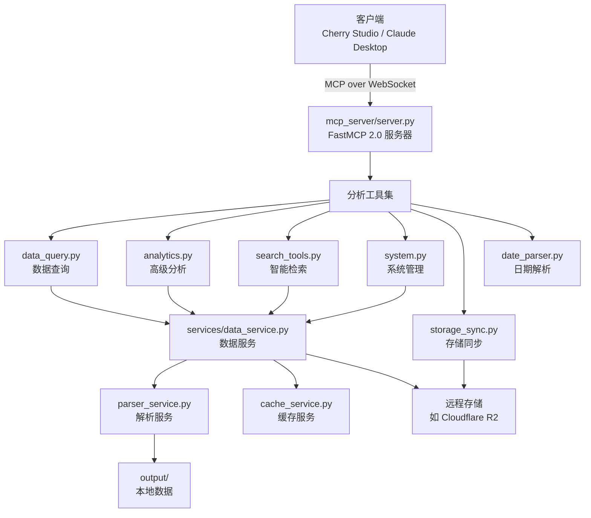

# AI智能分析

<cite>
**本文档引用的文件**   
- [server.py](file://mcp_server/server.py)
- [data_query.py](file://mcp_server/tools/data_query.py)
- [analytics.py](file://mcp_server/tools/analytics.py)
- [search_tools.py](file://mcp_server/tools/search_tools.py)
- [system.py](file://mcp_server/tools/system.py)
- [storage_sync.py](file://mcp_server/tools/storage_sync.py)
- [date_parser.py](file://mcp_server/utils/date_parser.py)
- [README-MCP-FAQ.md](file://README-MCP-FAQ.md)
</cite>

## 目录
1. [简介](#简介)
2. [系统架构与协议](#系统架构与协议)
3. [核心分析工具](#核心分析工具)
4. [数据查询工具](#数据查询工具)
5. [高级数据分析工具](#高级数据分析工具)
6. [智能检索工具](#智能检索工具)
7. [系统与存储管理工具](#系统与存储管理工具)
8. [AppContext与依赖注入](#appcontext与依赖注入)
9. [客户端集成示例](#客户端集成示例)
10. [常见问题解答](#常见问题解答)

## 简介
本API文档详细介绍了TrendRadar项目中基于MCP (Model Context Protocol) 协议的AI智能分析功能。该系统通过`mcp_server/server.py`实现了一个WebSocket服务器，能够接收来自客户端（如Cherry Studio、Claude Desktop）的自然语言查询。文档的核心是13种分析工具，它们被组织在`mcp_server/tools/`目录下，包括数据查询、趋势分析、情感分析和系统管理等功能。每个工具都设计为MCP协议的“工具”（Tool），允许AI模型通过函数调用的方式与系统交互。文档将详细说明每个工具的输入参数、输出格式和使用场景，并提供客户端集成的示例。

## 系统架构与协议



**Diagram sources**
- [server.py](file://mcp_server/server.py#L1-L800)
- [data_query.py](file://mcp_server/tools/data_query.py#L1-L285)
- [analytics.py](file://mcp_server/tools/analytics.py#L1-L800)
- [search_tools.py](file://mcp_server/tools/search_tools.py#L1-L702)
- [system.py](file://mcp_server/tools/system.py#L1-L369)
- [storage_sync.py](file://mcp_server/tools/storage_sync.py#L1-L469)
- [data_service.py](file://mcp_server/services/data_service.py#L1-L624)

**Section sources**
- [server.py](file://mcp_server/server.py#L1-L800)

## 核心分析工具
TrendRadar MCP服务器提供了13种核心分析工具，这些工具通过`FastMCP`框架暴露给AI客户端。所有工具都遵循一致的输入输出规范，返回JSON格式的字符串。工具的调用流程通常建议先使用`resolve_date_range`工具解析自然语言日期，再将得到的`date_range`对象传递给其他需要日期范围的工具，以确保结果的一致性和准确性。

**Section sources**
- [server.py](file://mcp_server/server.py#L1-L800)

## 数据查询工具
数据查询工具是进行任何分析的基础，它们提供对原始新闻数据的直接访问。

### get_latest_news: 获取最新新闻
获取最新一批爬取的新闻数据，用于快速了解当前热点。

**输入参数:**
- `platforms`: 平台ID列表（可选），如 `['zhihu', 'weibo']`。不指定时使用`config.yaml`中配置的所有平台。
- `limit`: 返回条数限制，默认50，最大1000。
- `include_url`: 是否包含URL链接，默认`False`（节省token）。

**输出格式:**
返回一个JSON对象，包含`news`（新闻列表）、`total`（总数）、`platforms`（平台列表）和`success`（成功标志）。

**使用场景:**
当用户询问“最新的新闻”或“今天的热点”时使用。

**Section sources**
- [server.py](file://mcp_server/server.py#L115-L150)
- [data_query.py](file://mcp_server/tools/data_query.py#L34-L75)

### get_news_by_date: 按日期查询新闻
获取指定日期的新闻数据，用于历史数据分析和对比。

**输入参数:**
- `date_query`: 日期查询字符串（可选），支持“今天”、“昨天”、“3天前”、“2025-11-15”等格式。默认为“今天”。
- `platforms`: 平台ID列表（可选）。
- `limit`: 返回条数限制，默认50。
- `include_url`: 是否包含URL链接，默认`False`。

**输出格式:**
返回一个JSON对象，包含`news`（新闻列表）、`total`（总数）、`date`（目标日期）和`success`（成功标志）。

**使用场景:**
当用户询问“昨天的新闻”或“11月1日的热点”时使用。

**Section sources**
- [server.py](file://mcp_server/server.py#L178-L223)
- [data_query.py](file://mcp_server/tools/data_query.py#L211-L269)

### get_trending_topics: 获取趋势话题
统计用户在`config/frequency_words.txt`中设置的个人关注词在新闻中出现的频率。

**输入参数:**
- `top_n`: 返回TOP N的关注词，默认10。
- `mode`: 统计模式，可选`daily`（当日累计）或`current`（最新一批），默认`current`。

**输出格式:**
返回一个JSON对象，包含`topics`（关注词列表，含频率信息）和`success`（成功标志）。

**使用场景:**
当用户询问“我关注的词今天出现了多少次”或“哪些词最热门”时使用。

**Section sources**
- [server.py](file://mcp_server/server.py#L153-L175)
- [data_query.py](file://mcp_server/tools/data_query.py#L154-L195)

## 高级数据分析工具
这些工具提供对新闻数据的深度洞察和分析。

### analyze_topic_trend: 分析话题趋势
统一的话题趋势分析工具，支持多种分析模式。

**输入参数:**
- `topic`: 话题关键词（必需）。
- `analysis_type`: 分析类型，可选：
  - `"trend"`: 热度趋势分析（追踪热度变化）
  - `"lifecycle"`: 生命周期分析（从出现到消失）
  - `"viral"`: 异常热度检测（识别突然爆火的话题）
  - `"predict"`: 话题预测（预测未来可能的热点）
- `date_range`: **日期范围对象**，格式为 `{"start": "YYYY-MM-DD", "end": "YYYY-MM-DD"}`。建议先调用`resolve_date_range`工具获取。
- `granularity`: 时间粒度，仅支持`"day"`。
- `threshold`: 热度突增倍数阈值（`viral`模式）。
- `time_window`: 检测时间窗口小时数（`viral`模式）。
- `lookahead_hours`: 预测未来小时数（`predict`模式）。
- `confidence_threshold`: 置信度阈值（`predict`模式）。

**输出格式:**
返回一个JSON对象，包含`topic`、`date_range`、`trend_data`（趋势数据点列表）和`statistics`（统计信息）等。

**使用场景:**
当用户询问“分析AI本周的趋势”或“看看特斯拉最近30天的热度”时使用。

**Section sources**
- [server.py](file://mcp_server/server.py#L229-L290)
- [analytics.py](file://mcp_server/tools/analytics.py#L155-L241)

### analyze_data_insights: 分析数据洞察
整合多种数据分析模式的统一工具。

**输入参数:**
- `insight_type`: 洞察类型，可选：
  - `"platform_compare"`: 平台对比分析（对比不同平台对话题的关注度）
  - `"platform_activity"`: 平台活跃度统计（统计各平台发布频率）
  - `"keyword_cooccur"`: 关键词共现分析（分析关键词同时出现的模式）
- `topic`: 话题关键词（`platform_compare`模式适用）。
- `date_range`: **日期范围对象**，格式为 `{"start": "YYYY-MM-DD", "end": "YYYY-MM-DD"}`。
- `min_frequency`: 最小共现频次（`keyword_cooccur`模式）。
- `top_n`: 返回TOP N结果（`keyword_cooccur`模式）。

**输出格式:**
返回一个JSON对象，根据`insight_type`返回不同的分析结果，如平台对比数据、平台活跃度或关键词共现对。

**使用场景:**
当用户询问“对比各平台对'AI'的关注度”或“哪些关键词经常一起出现”时使用。

**Section sources**
- [server.py](file://mcp_server/server.py#L293-L333)
- [analytics.py](file://mcp_server/tools/analytics.py#L88-L140)

### analyze_sentiment: 分析情感倾向
生成用于AI情感分析的结构化提示词。

**输入参数:**
- `topic`: 话题关键词（可选）。
- `platforms`: 平台ID列表（可选）。
- `date_range`: **日期范围对象**，格式为 `{"start": "YYYY-MM-DD", "end": "YYYY-MM-DD"}`。不指定则查询今天。
- `limit`: 返回新闻数量，默认50，最大100。
- `sort_by_weight`: 是否按热度权重排序，默认`True`。
- `include_url`: 是否包含URL链接，默认`False`。

**输出格式:**
返回一个JSON对象，包含`ai_prompt`（发送给AI的提示词）、`news_sample`（新闻样本）和`summary`（摘要信息）。

**使用场景:**
当用户询问“分析一下今天新闻的情感倾向”或“看看'特斯拉'相关新闻是正面还是负面的”时使用。

**Section sources**
- [server.py](file://mcp_server/server.py#L336-L397)
- [analytics.py](file://mcp_server/tools/analytics.py#L629-L798)

### find_similar_news: 查找相似新闻
查找与指定新闻标题相似的其他新闻。

**输入参数:**
- `reference_title`: 新闻标题（完整或部分）。
- `threshold`: 相似度阈值（0-1之间），默认0.6。
- `limit`: 返回条数限制，默认50。
- `include_url`: 是否包含URL链接，默认`False`。

**输出格式:**
返回一个JSON对象，包含`similar_news`（相似新闻列表，含相似度分数）和`success`（成功标志）。

**使用场景:**
当用户询问“找出和'特斯拉降价'相似的新闻”或“看看有没有和这条新闻相似的报道”时使用。

**Section sources**
- [server.py](file://mcp_server/server.py#L400-L433)
- [analytics.py](file://mcp_server/tools/analytics.py#L799-L818)

### generate_summary_report: 生成摘要报告
自动生成每日或每周的热点摘要报告。

**输入参数:**
- `report_type`: 报告类型，`"daily"`或`"weekly"`。
- `date_range`: **日期范围对象**，格式为 `{"start": "YYYY-MM-DD", "end": "YYYY-MM-DD"}`（可选）。

**输出格式:**
返回一个JSON对象，包含`report`（Markdown格式的摘要报告）和`success`（成功标志）。

**使用场景:**
当用户询问“生成今天的新闻摘要报告”或“给我一份本周的热点总结”时使用。

**Section sources**
- [server.py](file://mcp_server/server.py#L436-L459)
- [analytics.py](file://mcp_server/tools/analytics.py#L819-L837)

## 智能检索工具

### search_news: 搜索新闻
统一的搜索接口，支持多种搜索模式。

**输入参数:**
- `query`: 搜索关键词或内容片段。
- `search_mode`: 搜索模式，可选：
  - `"keyword"`: 精确关键词匹配（默认）
  - `"fuzzy"`: 模糊内容匹配（使用相似度算法）
  - `"entity"`: 实体名称搜索
- `date_range`: **日期范围对象**，格式为 `{"start": "YYYY-MM-DD", "end": "YYYY-MM-DD"}`。不指定则查询今天。
- `platforms`: 平台ID列表（可选）。
- `limit`: 返回条数限制，默认50。
- `sort_by`: 排序方式，可选`"relevance"`（相关度）、`"weight"`（权重）或`"date"`（日期）。
- `threshold`: 相似度阈值（`fuzzy`模式有效）。
- `include_url`: 是否包含URL链接，默认`False`。

**输出格式:**
返回一个JSON对象，包含`results`（搜索结果列表）和`summary`（摘要信息）。

**使用场景:**
当用户询问“搜索包含'人工智能'的新闻”或“查找关于'特斯拉降价'的报道”时使用。

**Section sources**
- [server.py](file://mcp_server/server.py#L464-L540)
- [search_tools.py](file://mcp_server/tools/search_tools.py#L38-L227)

### search_related_news_history: 搜索历史相关新闻
在历史数据中搜索与给定新闻标题相关的新闻。

**输入参数:**
- `reference_text`: 参考新闻标题或内容。
- `time_preset`: 时间范围预设值，可选`"yesterday"`（昨天）、`"last_week"`（上周）、`"last_month"`（上个月）或`"custom"`（自定义）。
- `threshold`: 相关性阈值（0-1之间），默认0.4。
- `limit`: 返回条数限制，默认50。
- `include_url`: 是否包含URL链接，默认`False`。

**输出格式:**
返回一个JSON对象，包含`results`（相关新闻列表）、`statistics`（统计信息）和`summary`（摘要信息）。

**使用场景:**
当用户询问“查找昨天与'人工智能突破'相关的新闻”或“搜索上周关于'特斯拉'的历史报道”时使用。

**Section sources**
- [server.py](file://mcp_server/server.py#L543-L584)
- [search_tools.py](file://mcp_server/tools/search_tools.py#L494-L687)

## 系统与存储管理工具

### resolve_date_range: 解析日期范围
将自然语言日期表达式解析为标准的日期范围对象。

**输入参数:**
- `expression`: 自然语言日期表达式，如“本周”、“最近7天”、“last week”、“yesterday”。

**输出格式:**
返回一个JSON对象，包含`success`、`expression`、`date_range`（标准日期范围对象）、`current_date`和`description`。

**使用场景:**
**强烈推荐在调用任何需要`date_range`参数的工具前，先调用此工具**，以确保日期计算的准确性和一致性。

**Section sources**
- [server.py](file://mcp_server/server.py#L44-L103)
- [date_parser.py](file://mcp_server/utils/date_parser.py#L330-L423)

### get_current_config: 获取当前配置
获取系统的当前配置信息。

**输入参数:**
- `section`: 配置节，可选`"all"`、`"crawler"`、`"push"`、`"keywords"`或`"weights"`。

**输出格式:**
返回一个JSON对象，包含指定配置节的内容。

**使用场景:**
当用户询问“查看当前系统配置”或“有哪些可用的平台？”时使用。

**Section sources**
- [server.py](file://mcp_server/server.py#L589-L609)
- [data_query.py](file://mcp_server/tools/data_query.py#L34-L75)

### get_system_status: 获取系统状态
获取系统的运行状态和健康检查信息。

**输入参数:**
- 无

**输出格式:**
返回一个JSON对象，包含`system`（系统信息）、`data`（数据统计）、`cache`（缓存状态）和`health`（健康状态）。

**使用场景:**
当用户询问“检查系统状态”或“最后一次爬取是什么时候？”时使用。

**Section sources**
- [server.py](file://mcp_server/server.py#L612-L624)
- [system.py](file://mcp_server/tools/system.py#L33-L52)

### trigger_crawl: 触发爬取任务
手动触发一次临时的爬取任务。

**输入参数:**
- `platforms`: 指定平台ID列表（可选）。
- `save_to_local`: 是否保存到本地`output`目录，默认`False`。
- `include_url`: 是否包含URL链接，默认`False`。

**输出格式:**
返回一个JSON对象，包含`success`、`task_id`、`platforms`、`total_news`、`data`（爬取的新闻数据）和`saved_to_local`（是否成功保存）。

**使用场景:**
当用户询问“请你爬取当前的今日头条的新闻”或“帮我抓取一下知乎和微博的最新新闻并保存”时使用。

**Section sources**
- [server.py](file://mcp_server/server.py#L627-L659)
- [system.py](file://mcp_server/tools/system.py#L68-L262)

### sync_from_remote: 从远程同步数据
从远程存储（如Cloudflare R2）拉取数据到本地。

**输入参数:**
- `days`: 拉取最近N天的数据，默认7天。

**输出格式:**
返回一个JSON对象，包含`success`、`synced_files`（成功同步的文件数）、`synced_dates`（成功同步的日期列表）等。

**使用场景:**
当MCP Server部署在本地，而爬虫和数据存储在云端时，用于同步数据进行分析。

**Section sources**
- [server.py](file://mcp_server/server.py#L664-L702)
- [storage_sync.py](file://mcp_server/tools/storage_sync.py#L176-L273)

### get_storage_status: 获取存储状态
查看当前的存储配置和状态。

**输入参数:**
- 无

**输出格式:**
返回一个JSON对象，包含`backend`（后端类型）、`local`（本地存储状态）和`remote`（远程存储状态）。

**使用场景:**
当用户询问“查看当前存储状态”或“本地有多少数据”时使用。

**Section sources**
- [server.py](file://mcp_server/server.py#L705-L736)
- [storage_sync.py](file://mcp_server/tools/storage_sync.py#L289-L357)

### list_available_dates: 列出可用日期
列出本地和/或远程可用的数据日期。

**输入参数:**
- `source`: 数据来源，可选`"local"`、`"remote"`或`"both"`（默认）。

**输出格式:**
返回一个JSON对象，包含`local`、`remote`和`comparison`（对比结果）等信息。

**使用场景:**
当用户询问“本地有哪些日期的数据”或“对比本地和远程的数据日期”时使用。

**Section sources**
- [server.py](file://mcp_server/server.py#L739-L779)
- [storage_sync.py](file://mcp_server/tools/storage_sync.py#L373-L454)

## AppContext与依赖注入
在TrendRadar系统中，虽然没有显式命名为`AppContext`的类，但其功能通过工具类的初始化和依赖注入机制来实现。每个工具类（如`DataQueryTools`, `AnalyticsTools`）在初始化时都会接收一个`project_root`参数，并创建其依赖的服务实例。

例如，在`mcp_server/server.py`中，`_get_tools`函数负责创建所有工具实例的单例，并将`project_root`传递给它们。这些工具类内部会创建`DataService`、`ParserService`等实例，从而获得访问数据库、配置文件和缓存的能力。

这种设计模式确保了所有工具都能访问到一致的应用上下文，如项目根目录、配置和数据服务，实现了`AppContext`的核心功能。

**Section sources**
- [server.py](file://mcp_server/server.py#L30-L39)
- [data_query.py](file://mcp_server/tools/data_query.py#L25-L32)
- [analytics.py](file://mcp_server/tools/analytics.py#L79-L86)

## 客户端集成示例
以下示例展示了如何构造MCP请求来完成特定任务。

### 示例1: 查询“昨天知乎的热点”
```json
[
  {
    "tool": "get_news_by_date",
    "input": {
      "date_query": "昨天",
      "platforms": ["zhihu"],
      "limit": 50
    }
  }
]
```

### 示例2: 分析“AI话题的热度趋势”
```json
[
  {
    "tool": "resolve_date_range",
    "input": {
      "expression": "最近7天"
    }
  },
  {
    "tool": "analyze_topic_trend",
    "input": {
      "topic": "AI",
      "analysis_type": "trend",
      "date_range": {
        "start": "2025-11-20",
        "end": "2025-11-26"
      }
    }
  }
]
```

**Section sources**
- [README-MCP-FAQ.md](file://README-MCP-FAQ.md#L1-L627)

## 常见问题解答
结合`README-MCP-FAQ.md`，解答常见问题。

### 如何确保本地有足够数据供AI分析？
- **数据来源**: 数据由爬虫（`trendradar/crawler/`）生成，并存储在`output/`目录下。
- **数据同步**: 如果爬虫在云端运行，可使用`sync_from_remote`工具从远程存储（如Cloudflare R2）拉取数据到本地MCP Server。
- **手动爬取**: 使用`trigger_crawl`工具手动触发一次爬取任务，可选择是否将数据持久化到本地。

### 如何扩展新的分析工具？
1. 在`mcp_server/tools/`目录下创建新的工具模块（如`new_tool.py`）。
2. 创建一个工具类，继承通用模式，并在`__init__`中注入`DataService`等依赖。
3. 在`mcp_server/server.py`中导入新工具类。
4. 在`_get_tools`函数中创建新工具的实例。
5. 使用`@mcp.tool`装饰器将新方法注册为MCP工具。

**Section sources**
- [README-MCP-FAQ.md](file://README-MCP-FAQ.md#L1-L627)