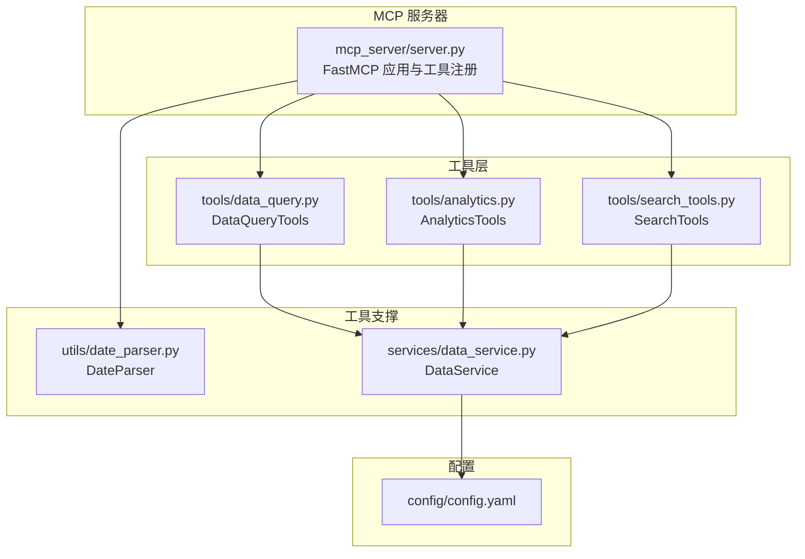
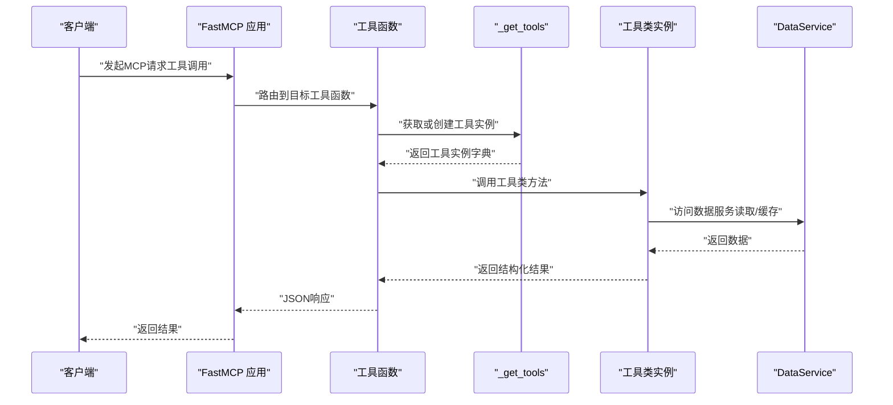
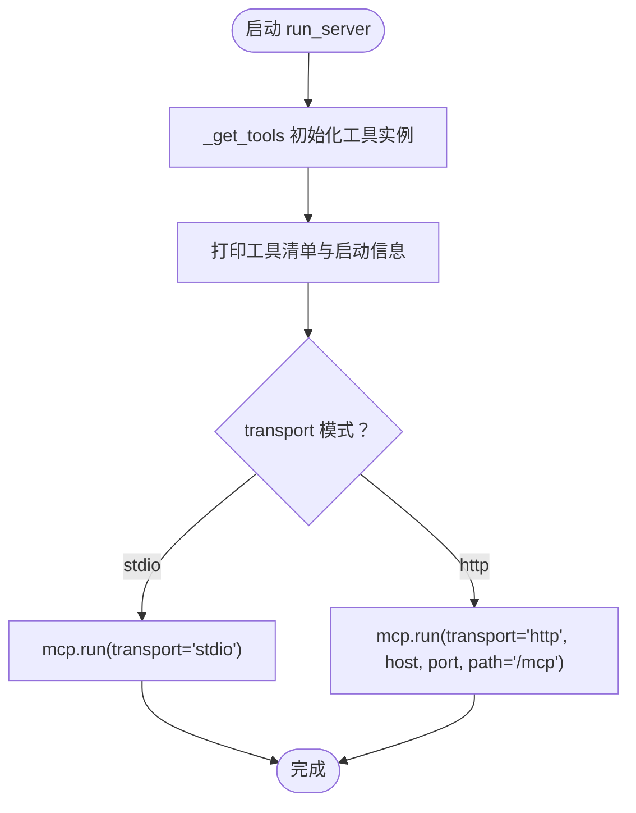
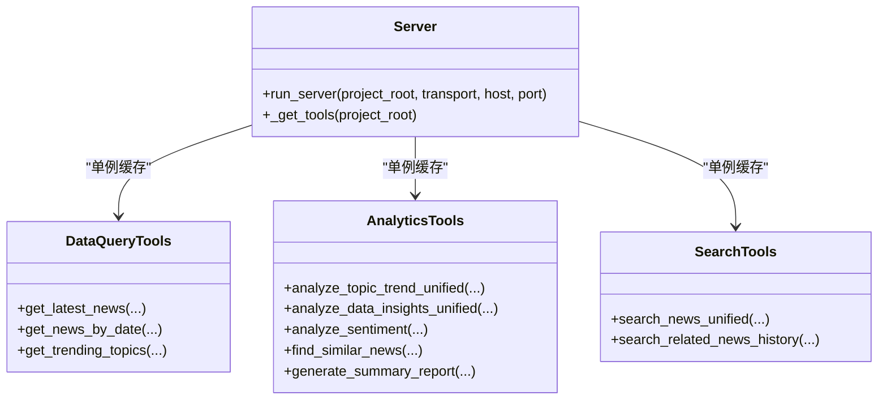
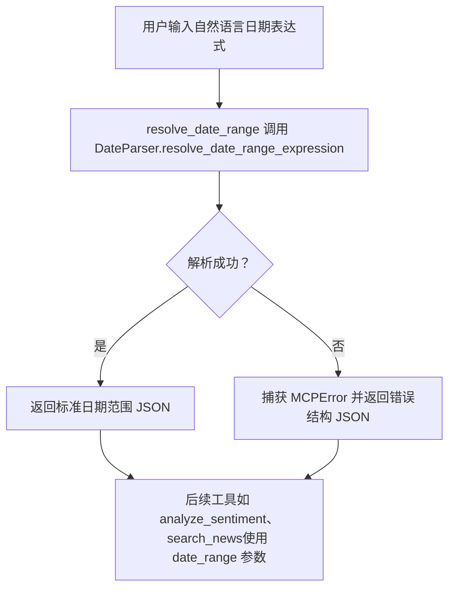
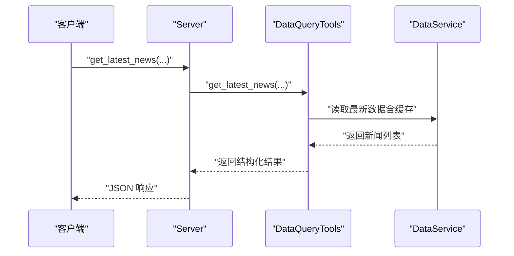
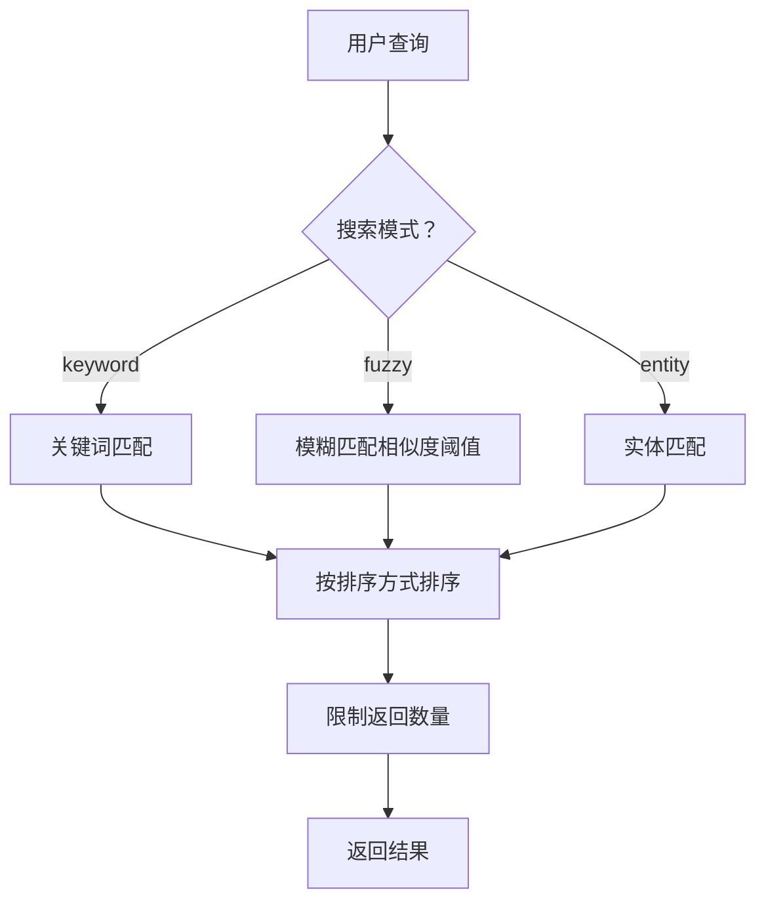
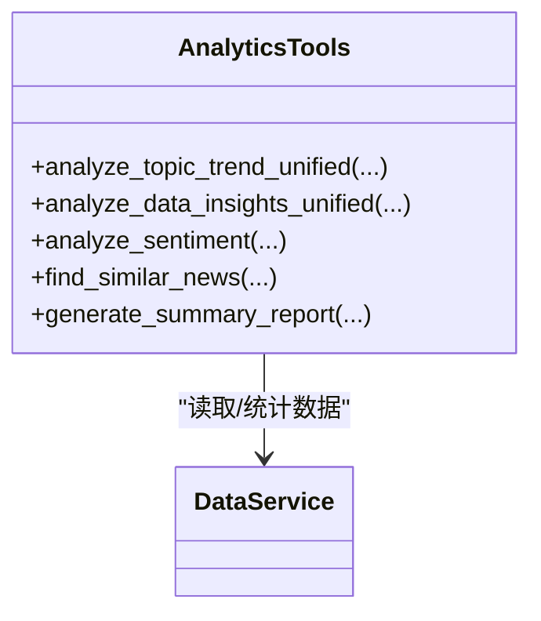
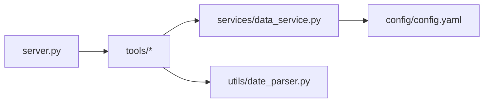

# MCP协议与通信

<cite>
**本文引用的文件**
- [mcp_server/server.py](file://mcp_server/server.py)
- [README-MCP-FAQ.md](file://README-MCP-FAQ.md)
- [mcp_server/tools/data_query.py](file://mcp_server/tools/data_query.py)
- [mcp_server/tools/analytics.py](file://mcp_server/tools/analytics.py)
- [mcp_server/tools/search_tools.py](file://mcp_server/tools/search_tools.py)
- [mcp_server/utils/date_parser.py](file://mcp_server/utils/date_parser.py)
- [mcp_server/services/data_service.py](file://mcp_server/services/data_service.py)
- [config/config.yaml](file://config/config.yaml)
</cite>

## 目录
1. [简介](#简介)
2. [项目结构](#项目结构)
3. [核心组件](#核心组件)
4. [架构总览](#架构总览)
5. [详细组件分析](#详细组件分析)
6. [依赖关系分析](#依赖关系分析)
7. [性能考量](#性能考量)
8. [故障排查指南](#故障排查指南)
9. [结论](#结论)
10. [附录](#附录)

## 简介
本文件围绕 TrendRadar 的 MCP（Model Context Protocol）智能分析功能，系统梳理基于 FastMCP 2.0 的 WebSocket 服务器实现，重点说明：
- 服务器如何作为 MCP 服务端，支持 stdio 和 HTTP 两种传输模式；
- run_server 函数的参数（project_root、transport、host、port）及其在不同部署场景的应用；
- 服务器启动时的工具注册机制，以及通过 _get_tools 初始化 DataQueryTools、AnalyticsTools 等工具实例；
- 结合 README-MCP-FAQ.md 的启动信息，对 13 种已注册工具进行分类说明（日期解析、基础数据查询、智能检索、高级数据分析等）；
- 客户端连接示例与生产环境推荐设置（HTTP 模式下的 /mcp 端点）。

## 项目结构
- mcp_server/server.py：MCP 服务器入口，定义工具函数并通过 FastMCP 注册；提供 run_server 启动函数与 HTTP/stdio 传输模式切换。
- mcp_server/tools/*：工具实现模块，包含数据查询、分析、检索、系统与存储管理等工具类。
- mcp_server/utils/date_parser.py：日期解析工具，提供自然语言日期表达式解析与标准日期范围生成。
- mcp_server/services/data_service.py：数据访问服务，封装数据读取、缓存与解析逻辑。
- config/config.yaml：系统配置，包含平台列表、存储后端、权重配置、通知等，影响工具行为与数据来源。

图示来源
- [mcp_server/server.py](file://mcp_server/server.py#L1-L120)
- [mcp_server/tools/data_query.py](file://mcp_server/tools/data_query.py#L1-L60)
- [mcp_server/tools/analytics.py](file://mcp_server/tools/analytics.py#L1-L60)
- [mcp_server/tools/search_tools.py](file://mcp_server/tools/search_tools.py#L1-L60)
- [mcp_server/utils/date_parser.py](file://mcp_server/utils/date_parser.py#L1-L60)
- [mcp_server/services/data_service.py](file://mcp_server/services/data_service.py#L1-L60)
- [config/config.yaml](file://config/config.yaml#L1-L60)

章节来源
- [mcp_server/server.py](file://mcp_server/server.py#L1-L120)
- [config/config.yaml](file://config/config.yaml#L150-L187)

## 核心组件
- FastMCP 应用与工具注册
  - 服务器创建 FastMCP 应用实例，并通过装饰器注册各类工具函数（如 resolve_date_range、get_latest_news、search_news 等）。
  - 工具函数通过 _get_tools 获取或创建工具实例（单例），再调用对应工具类方法执行业务逻辑。
- 传输模式
  - run_server 支持 stdio 与 http 两种模式。http 模式下默认监听 /mcp 端点，生产环境推荐使用 http 模式。
- 工具分类与职责
  - 日期解析：resolve_date_range，将自然语言日期表达式解析为标准日期范围，确保 AI 一致性。
  - 基础数据查询：get_latest_news、get_news_by_date、get_trending_topics，提供最新、按日、趋势话题等查询能力。
  - 智能检索：search_news、search_related_news_history，支持关键词、模糊、实体搜索与历史相关性检索。
  - 高级数据分析：analyze_topic_trend、analyze_data_insights、analyze_sentiment、find_similar_news、generate_summary_report，提供趋势、洞察、情感、相似新闻与摘要报告。
  - 系统与存储：get_current_config、get_system_status、trigger_crawl、sync_from_remote、get_storage_status、list_available_dates，提供配置、状态、爬取触发与存储同步能力。

章节来源
- [mcp_server/server.py](file://mcp_server/server.py#L1-L120)
- [mcp_server/server.py](file://mcp_server/server.py#L785-L910)
- [README-MCP-FAQ.md](file://README-MCP-FAQ.md#L1-L120)

## 架构总览
MCP 服务器通过 FastMCP 框架暴露工具接口，客户端（如 Cherry Studio 或其他 MCP 客户端）通过 stdio 或 HTTP 与服务器交互。服务器启动时打印工具清单，随后根据 transport 参数选择运行模式。

图示来源
- [mcp_server/server.py](file://mcp_server/server.py#L1-L120)
- [mcp_server/server.py](file://mcp_server/server.py#L785-L910)
- [mcp_server/tools/data_query.py](file://mcp_server/tools/data_query.py#L1-L60)
- [mcp_server/tools/analytics.py](file://mcp_server/tools/analytics.py#L1-L60)
- [mcp_server/tools/search_tools.py](file://mcp_server/tools/search_tools.py#L1-L60)
- [mcp_server/services/data_service.py](file://mcp_server/services/data_service.py#L1-L60)

## 详细组件分析

### 服务器与传输模式
- run_server 参数
  - project_root：项目根目录，用于定位数据与配置。
  - transport：传输模式，'stdio' 或 'http'。
  - host/port：HTTP 模式下的监听地址与端口。
- 启动流程
  - 初始化工具实例（_get_tools）。
  - 打印工具清单与启动信息。
  - 根据 transport 选择运行模式：stdio 或 http（path=/mcp）。

图示来源
- [mcp_server/server.py](file://mcp_server/server.py#L785-L910)

章节来源
- [mcp_server/server.py](file://mcp_server/server.py#L785-L910)

### 工具注册与单例初始化
- 工具注册
  - 服务器通过装饰器将工具函数注册到 FastMCP 应用，形成统一的 MCP 工具集合。
- 单例初始化
  - _get_tools 使用全局字典缓存工具实例，首次调用时创建 DataQueryTools、AnalyticsTools、SearchTools、ConfigManagementTools、SystemManagementTools、StorageSyncTools。
  - 工具函数内部通过 _get_tools 获取对应实例，再调用工具类方法。

图示来源
- [mcp_server/server.py](file://mcp_server/server.py#L1-L120)
- [mcp_server/server.py](file://mcp_server/server.py#L30-L40)
- [mcp_server/tools/data_query.py](file://mcp_server/tools/data_query.py#L1-L60)
- [mcp_server/tools/analytics.py](file://mcp_server/tools/analytics.py#L1-L60)
- [mcp_server/tools/search_tools.py](file://mcp_server/tools/search_tools.py#L1-L60)

章节来源
- [mcp_server/server.py](file://mcp_server/server.py#L1-L120)
- [mcp_server/server.py](file://mcp_server/server.py#L30-L40)

### 日期解析工具（推荐优先调用）
- resolve_date_range
  - 将自然语言日期表达式（如“本周”、“最近7天”、“last week”等）解析为标准日期范围，返回 JSON。
  - 服务器端使用精确当前时间计算，确保所有 AI 模型获得一致的日期范围。
- DateParser
  - 提供 parse_date_query、resolve_date_range_expression 等方法，支持中文/英文、相对/绝对日期、周/月/最近N天等表达式。
  - 工具函数内部调用 DateParser.resolve_date_range_expression，捕获 MCPError 并返回标准错误结构。

图示来源
- [mcp_server/server.py](file://mcp_server/server.py#L42-L111)
- [mcp_server/utils/date_parser.py](file://mcp_server/utils/date_parser.py#L330-L424)

章节来源
- [mcp_server/server.py](file://mcp_server/server.py#L42-L111)
- [mcp_server/utils/date_parser.py](file://mcp_server/utils/date_parser.py#L1-L120)
- [mcp_server/utils/date_parser.py](file://mcp_server/utils/date_parser.py#L330-L424)

### 基础数据查询工具
- get_latest_news
  - 获取最新一批爬取的新闻，支持平台过滤、限制条数、是否包含 URL。
- get_news_by_date
  - 按日期查询新闻，支持自然语言日期（如“昨天”、“3天前”等），默认“今天”。
- get_trending_topics
  - 基于 config/frequency_words.txt 的个人关注词列表，统计词频（支持 daily/current/incremental 模式）。

图示来源
- [mcp_server/server.py](file://mcp_server/server.py#L113-L224)
- [mcp_server/tools/data_query.py](file://mcp_server/tools/data_query.py#L1-L120)
- [mcp_server/services/data_service.py](file://mcp_server/services/data_service.py#L1-L120)

章节来源
- [mcp_server/server.py](file://mcp_server/server.py#L113-L224)
- [mcp_server/tools/data_query.py](file://mcp_server/tools/data_query.py#L1-L120)
- [mcp_server/services/data_service.py](file://mcp_server/services/data_service.py#L1-L120)

### 智能检索工具
- search_news
  - 统一搜索接口，支持 keyword/fuzzy/entity 三种模式；支持按相关度/权重/日期排序；支持阈值与平台过滤。
- search_related_news_history
  - 基于种子新闻，在历史数据中检索相关新闻，综合相似度（关键词重合×0.7 + 文本相似度×0.3）。

图示来源
- [mcp_server/server.py](file://mcp_server/server.py#L462-L585)
- [mcp_server/tools/search_tools.py](file://mcp_server/tools/search_tools.py#L1-L240)

章节来源
- [mcp_server/server.py](file://mcp_server/server.py#L462-L585)
- [mcp_server/tools/search_tools.py](file://mcp_server/tools/search_tools.py#L1-L240)

### 高级数据分析工具
- analyze_topic_trend
  - 统一话题趋势分析，支持 trend/lifecycle/viral/predict 四种模式；默认最近7天；按天粒度统计。
- analyze_data_insights
  - 统一数据洞察分析，支持 platform_compare/platform_activity/keyword_cooccur 三种模式。
- analyze_sentiment
  - 生成用于 AI 情感分析的结构化提示词；支持去重、权重排序、平台过滤、日期范围。
- find_similar_news
  - 查找与指定新闻标题相似的其他新闻，支持阈值与限制。
- generate_summary_report
  - 自动生成每日/每周摘要报告（Markdown 格式）。

图示来源
- [mcp_server/tools/analytics.py](file://mcp_server/tools/analytics.py#L1-L120)
- [mcp_server/tools/analytics.py](file://mcp_server/tools/analytics.py#L120-L240)
- [mcp_server/tools/analytics.py](file://mcp_server/tools/analytics.py#L240-L420)
- [mcp_server/tools/analytics.py](file://mcp_server/tools/analytics.py#L420-L620)
- [mcp_server/tools/analytics.py](file://mcp_server/tools/analytics.py#L620-L800)
- [mcp_server/services/data_service.py](file://mcp_server/services/data_service.py#L1-L120)

章节来源
- [mcp_server/tools/analytics.py](file://mcp_server/tools/analytics.py#L1-L200)
- [mcp_server/tools/analytics.py](file://mcp_server/tools/analytics.py#L200-L420)
- [mcp_server/tools/analytics.py](file://mcp_server/tools/analytics.py#L420-L620)
- [mcp_server/tools/analytics.py](file://mcp_server/tools/analytics.py#L620-L800)

### 系统与存储管理工具
- get_current_config
  - 获取当前系统配置（平台、爬虫、推送、权重等）。
- get_system_status
  - 获取系统运行状态、数据统计、缓存状态等。
- trigger_crawl
  - 手动触发一次爬取任务，支持平台过滤与保存到本地。
- sync_from_remote
  - 从远程存储（S3 兼容）拉取数据到本地，支持 days 参数（0/7/30）。
- get_storage_status
  - 获取本地/远程存储状态与配置。
- list_available_dates
  - 列出本地/远程可用日期范围，支持 local/remote/both 模式。

章节来源
- [mcp_server/server.py](file://mcp_server/server.py#L587-L781)
- [config/config.yaml](file://config/config.yaml#L1-L120)
- [config/config.yaml](file://config/config.yaml#L120-L187)

## 依赖关系分析
- 服务器对工具层的依赖
  - 服务器通过装饰器注册工具函数，工具函数通过 _get_tools 获取工具实例，工具实例依赖 DataService 进行数据访问。
- 工具层对支撑模块的依赖
  - DataQueryTools/AnalyticsTools/SearchTools 依赖 DataService；AnalyticsTools 还依赖 utils/date_parser.py 的权重计算与日期范围生成。
- 配置依赖
  - config/config.yaml 提供平台列表、存储后端、权重配置等，影响工具行为与数据来源。

图示来源
- [mcp_server/server.py](file://mcp_server/server.py#L1-L120)
- [mcp_server/tools/data_query.py](file://mcp_server/tools/data_query.py#L1-L60)
- [mcp_server/tools/analytics.py](file://mcp_server/tools/analytics.py#L1-L60)
- [mcp_server/tools/search_tools.py](file://mcp_server/tools/search_tools.py#L1-L60)
- [mcp_server/services/data_service.py](file://mcp_server/services/data_service.py#L1-L60)
- [mcp_server/utils/date_parser.py](file://mcp_server/utils/date_parser.py#L1-L60)
- [config/config.yaml](file://config/config.yaml#L1-L60)

章节来源
- [mcp_server/server.py](file://mcp_server/server.py#L1-L120)
- [mcp_server/tools/data_query.py](file://mcp_server/tools/data_query.py#L1-L60)
- [mcp_server/tools/analytics.py](file://mcp_server/tools/analytics.py#L1-L60)
- [mcp_server/tools/search_tools.py](file://mcp_server/tools/search_tools.py#L1-L60)
- [mcp_server/services/data_service.py](file://mcp_server/services/data_service.py#L1-L60)
- [mcp_server/utils/date_parser.py](file://mcp_server/utils/date_parser.py#L1-L60)
- [config/config.yaml](file://config/config.yaml#L1-L60)

## 性能考量
- 缓存策略
  - DataService 对最新新闻与按日新闻查询使用缓存（如 15 分钟、30 分钟），减少重复读取与 IO 开销。
- 排序与限制
  - 工具层普遍支持 limit 与排序（相关度/权重/日期），避免返回过多数据导致性能与 token 消耗问题。
- 日期解析一致性
  - resolve_date_range 使用服务器端精确时间计算，避免 AI 模型各自计算导致的重复计算与不一致。

章节来源
- [mcp_server/services/data_service.py](file://mcp_server/services/data_service.py#L1-L120)
- [mcp_server/server.py](file://mcp_server/server.py#L42-L111)

## 故障排查指南
- 常见错误与处理
  - 日期格式不识别：resolve_date_range 会抛出 InvalidParameterError，建议检查表达式是否符合支持列表。
  - 数据不存在：某些工具在无数据时返回标准错误结构或提示可用日期范围。
  - 远程存储未配置：sync_from_remote 需要在 config/config.yaml 中配置 S3 兼容参数或环境变量。
- 建议排查步骤
  - 使用 resolve_date_range 验证日期表达式是否正确。
  - 通过 get_storage_status 与 list_available_dates 检查本地/远程数据可用性。
  - 通过 get_system_status 检查系统状态与数据统计。

章节来源
- [mcp_server/server.py](file://mcp_server/server.py#L42-L111)
- [mcp_server/server.py](file://mcp_server/server.py#L587-L781)
- [config/config.yaml](file://config/config.yaml#L1-L120)

## 结论
本项目基于 FastMCP 2.0 构建了完整的 MCP 服务器，提供 13 类工具，覆盖日期解析、基础数据查询、智能检索、高级数据分析与系统/存储管理。服务器通过 run_server 支持 stdio 与 HTTP 两种传输模式，HTTP 模式默认监听 /mcp 端点，适合生产部署。工具注册与单例初始化保证了稳定的运行与良好的扩展性；日期解析与缓存策略提升了性能与一致性。

## 附录

### 工具清单与分类（13种）
- 日期解析工具（推荐优先调用）
  - resolve_date_range：解析自然语言日期为标准格式
- 基础数据查询（P0核心）
  - get_latest_news：获取最新新闻
  - get_news_by_date：按日期查询新闻（支持自然语言）
  - get_trending_topics：获取趋势话题
- 智能检索工具
  - search_news：统一新闻搜索（关键词/模糊/实体）
  - search_related_news_history：历史相关新闻检索
- 高级数据分析
  - analyze_topic_trend：统一话题趋势分析（热度/生命周期/爆火/预测）
  - analyze_data_insights：统一数据洞察分析（平台对比/活跃度/关键词共现）
  - analyze_sentiment：情感倾向分析
  - find_similar_news：相似新闻查找
  - generate_summary_report：每日/每周摘要生成
- 配置与系统管理
  - get_current_config：获取当前系统配置
  - get_system_status：获取系统运行状态
  - trigger_crawl：手动触发爬取任务
- 存储同步工具
  - sync_from_remote：从远程存储拉取数据到本地
  - get_storage_status：获取存储配置和状态
  - list_available_dates：列出本地/远程可用日期

章节来源
- [mcp_server/server.py](file://mcp_server/server.py#L800-L870)
- [README-MCP-FAQ.md](file://README-MCP-FAQ.md#L1-L120)

### 客户端连接示例与生产环境建议
- HTTP 模式（生产推荐）
  - 服务器监听 host:port，默认 path=/mcp。
  - 客户端通过 HTTP 与 /mcp 端点交互，适合集成到浏览器或服务端应用。
- stdio 模式（开发/测试）
  - 通过标准输入输出与 MCP 客户端通信，便于本地调试。
- 生产环境建议
  - 使用 HTTP 模式并配置反向代理（如 Nginx）与 SSL。
  - 在 config/config.yaml 中配置远程存储（S3 兼容）以便 MCP Server 从云端拉取数据到本地分析。

章节来源
- [mcp_server/server.py](file://mcp_server/server.py#L800-L870)
- [config/config.yaml](file://config/config.yaml#L1-L120)