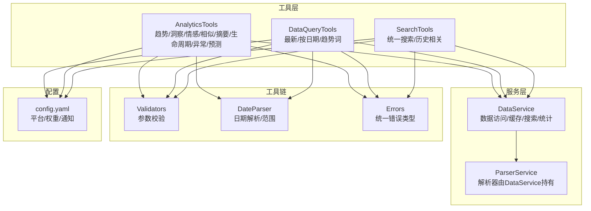
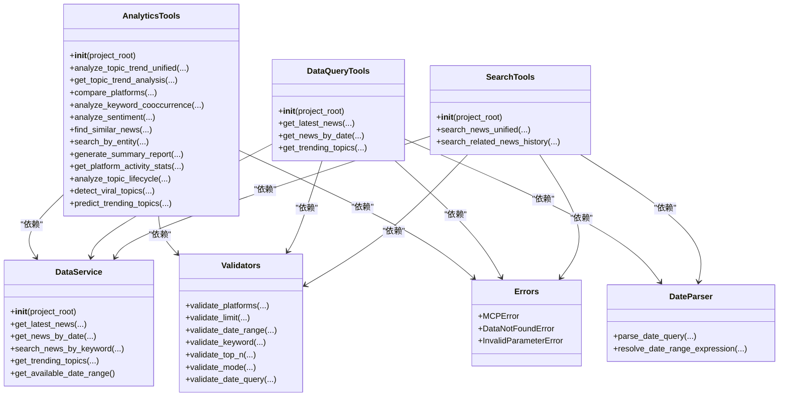
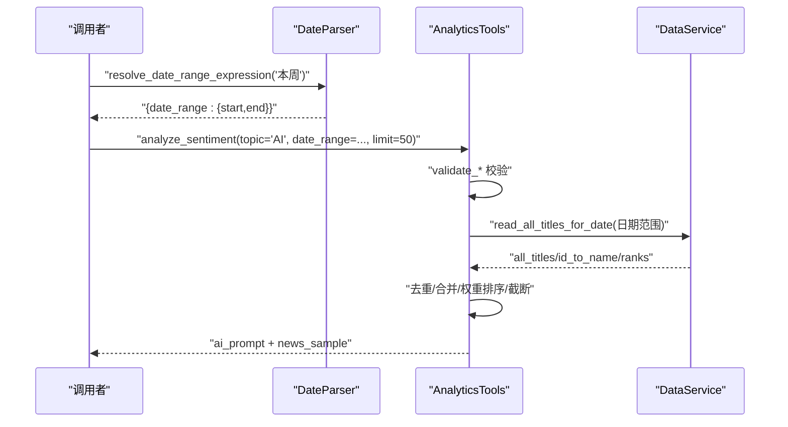
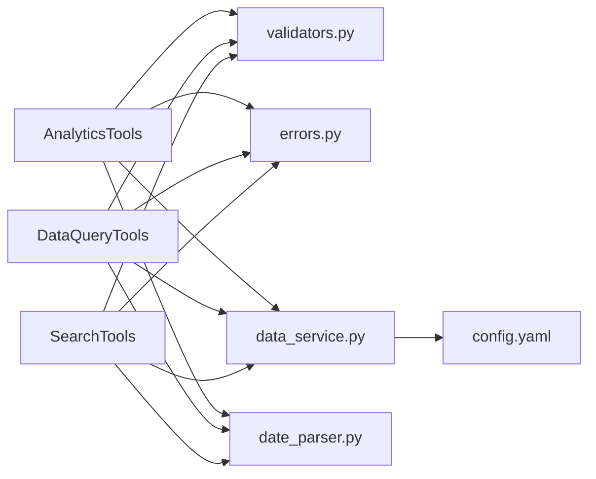

# 分析工具详解

<cite>
**本文引用的文件**
- [analytics.py](file://mcp_server/tools/analytics.py)
- [data_query.py](file://mcp_server/tools/data_query.py)
- [search_tools.py](file://mcp_server/tools/search_tools.py)
- [date_parser.py](file://mcp_server/utils/date_parser.py)
- [validators.py](file://mcp_server/utils/validators.py)
- [data_service.py](file://mcp_server/services/data_service.py)
- [errors.py](file://mcp_server/utils/errors.py)
- [config.yaml](file://config/config.yaml)
</cite>

## 目录
1. [简介](#简介)
2. [项目结构](#项目结构)
3. [核心组件](#核心组件)
4. [架构总览](#架构总览)
5. [详细组件分析](#详细组件分析)
6. [依赖关系分析](#依赖关系分析)
7. [性能考量](#性能考量)
8. [故障排查指南](#故障排查指南)
9. [结论](#结论)
10. [附录](#附录)

## 简介
本文件面向“AI智能分析”功能，系统梳理 mcp_server/tools/ 目录下的分析工具，覆盖以下核心能力：
- 话题趋势分析：analyze_topic_trend_unified、get_topic_trend_analysis、analyze_topic_lifecycle、detect_viral_topics、predict_trending_topics
- 数据洞察分析：analyze_data_insights_unified（整合平台对比、活跃度统计、关键词共现）
- 情感分析：analyze_sentiment（生成AI提示词，便于外部模型进行情感分析）
- 相似新闻查找：find_similar_news
- 摘要生成：generate_summary_report
- 数据查询：get_latest_news、get_news_by_date、get_trending_topics
- 搜索工具：search_news_unified（统一搜索）、search_related_news_history（历史相关新闻检索）

文档重点说明各工具的输入参数、输出格式、典型使用场景与内部实现逻辑，并解释 AppContext 注入方式（通过工具类构造函数注入 DataService，从而访问数据库与配置）。

## 项目结构
- mcp_server/tools/analytics.py：高级分析工具集合，包含趋势、洞察、情感、相似、摘要、生命周期、异常检测、预测等能力
- mcp_server/tools/data_query.py：数据查询工具集合，提供最新新闻、按日期查询、趋势词统计等
- mcp_server/tools/search_tools.py：智能检索工具集合，提供统一搜索、模糊搜索、实体搜索、历史相关新闻检索
- mcp_server/utils/date_parser.py：日期解析与范围推导工具
- mcp_server/utils/validators.py：参数校验工具（平台、日期、关键词、TOP N、模式等）
- mcp_server/services/data_service.py：数据访问服务，封装读取、缓存、搜索、统计等
- mcp_server/utils/errors.py：统一错误类型定义
- config/config.yaml：平台配置、权重配置、通知配置等

图表来源
- [analytics.py](file://mcp_server/tools/analytics.py#L1-L120)
- [data_query.py](file://mcp_server/tools/data_query.py#L1-L60)
- [search_tools.py](file://mcp_server/tools/search_tools.py#L1-L60)
- [data_service.py](file://mcp_server/services/data_service.py#L1-L60)
- [validators.py](file://mcp_server/utils/validators.py#L1-L60)
- [date_parser.py](file://mcp_server/utils/date_parser.py#L1-L60)
- [errors.py](file://mcp_server/utils/errors.py#L1-L40)
- [config.yaml](file://config/config.yaml#L150-L187)

章节来源
- [analytics.py](file://mcp_server/tools/analytics.py#L1-L120)
- [data_query.py](file://mcp_server/tools/data_query.py#L1-L60)
- [search_tools.py](file://mcp_server/tools/search_tools.py#L1-L60)
- [data_service.py](file://mcp_server/services/data_service.py#L1-L60)
- [validators.py](file://mcp_server/utils/validators.py#L1-L60)
- [date_parser.py](file://mcp_server/utils/date_parser.py#L1-L60)
- [errors.py](file://mcp_server/utils/errors.py#L1-L40)
- [config.yaml](file://config/config.yaml#L150-L187)

## 核心组件
- AnalyticsTools：高级分析工具集合，负责话题趋势、平台对比、情感分析、相似新闻、摘要生成、生命周期、异常检测、预测等
- DataQueryTools：数据查询工具集合，负责最新新闻、按日期查询、趋势词统计
- SearchTools：智能检索工具集合，负责统一搜索、模糊搜索、实体搜索、历史相关新闻检索
- DataService：统一数据访问服务，封装解析、缓存、搜索、统计等
- Validators：参数校验工具，统一平台、日期、关键词、TOP N、模式等校验
- DateParser：日期解析与范围推导工具，支持自然语言日期表达式
- 错误类型：统一的MCPError体系，便于工具层捕获与返回

章节来源
- [analytics.py](file://mcp_server/tools/analytics.py#L76-L120)
- [data_query.py](file://mcp_server/tools/data_query.py#L22-L40)
- [search_tools.py](file://mcp_server/tools/search_tools.py#L18-L40)
- [data_service.py](file://mcp_server/services/data_service.py#L17-L40)
- [validators.py](file://mcp_server/utils/validators.py#L1-L60)
- [date_parser.py](file://mcp_server/utils/date_parser.py#L1-L60)
- [errors.py](file://mcp_server/utils/errors.py#L1-L40)

## 架构总览
工具层通过构造函数注入 DataService，从而访问底层数据与缓存；参数校验由 validators 统一处理；日期解析由 date_parser 提供；错误由 errors 统一抛出与转换。

图表来源
- [analytics.py](file://mcp_server/tools/analytics.py#L76-L120)
- [data_query.py](file://mcp_server/tools/data_query.py#L22-L40)
- [search_tools.py](file://mcp_server/tools/search_tools.py#L18-L40)
- [data_service.py](file://mcp_server/services/data_service.py#L17-L40)
- [validators.py](file://mcp_server/utils/validators.py#L1-L60)
- [date_parser.py](file://mcp_server/utils/date_parser.py#L1-L60)
- [errors.py](file://mcp_server/utils/errors.py#L1-L40)

## 详细组件分析

### AnalyticsTools（高级分析工具）
- 构造函数注入：通过 project_root 初始化 DataService，从而访问解析器与缓存
- 关键方法与职责
  - analyze_topic_trend_unified：统一话题趋势分析入口，支持 trend/lifecycle/viral/predict 四种模式
  - get_topic_trend_analysis：按天粒度统计话题出现次数，计算总量、均值、峰值、变化率与趋势方向
  - compare_platforms：对比不同平台对同一话题的关注度，统计覆盖率、唯一标题数、Top关键词、平台独有话题
  - analyze_keyword_cooccurrence：统计关键词共现，过滤最小频次，返回Top N共现对
  - analyze_sentiment：生成AI提示词，按权重排序返回新闻样本，支持按平台过滤、日期范围、限制数量
  - find_similar_news：基于标题相似度查找相似新闻
  - search_by_entity：按实体（人物/地点/组织）搜索相关新闻，支持权重排序
  - generate_summary_report：生成每日/每周摘要报告，包含数据概览、热门关键词、平台活跃度、精选样本
  - get_platform_activity_stats：统计平台活跃度，含更新次数、活跃天数、日均新闻数、最活跃时段
  - analyze_topic_lifecycle：追踪话题从出现到消失的生命周期，判断阶段与类型
  - detect_viral_topics：异常热度检测，比较当前与前一天关键词频次，识别爆火话题
  - predict_trending_topics：基于最近3天趋势预测未来热点，输出置信度与样本

- 输入参数要点
  - topic：话题关键词（部分方法必填）
  - date_range：{"start": "YYYY-MM-DD", "end": "YYYY-MM-DD"}，支持不传则默认最近7天或当天
  - platforms：平台ID列表，支持 None 表示使用配置中的全部平台
  - limit/top_n：返回条数/Top N，带默认值与上限
  - sort_by_weight/include_url：排序与字段控制
  - granularity：时间粒度（趋势分析支持 day）
  - 其他：threshold、lookahead_hours、confidence_threshold 等

- 输出格式
  - 统一返回字典，包含 success、summary/results/news 等字段，必要时包含 error 字典（含 code/message/suggestion）

- 内部实现逻辑
  - 参数校验：使用 validators.validate_* 系列函数
  - 日期处理：使用 validators.validate_date_range 或 date_parser.resolve_date_range_expression
  - 数据读取：通过 DataService.parser.read_all_titles_for_date 读取标题与排名信息
  - 权重计算：calculate_news_weight 基于排名、频次、高排名比例综合评分
  - 相似度计算：_calculate_similarity 使用 SequenceMatcher
  - 关键词提取：_extract_keywords 基于正则与停用词过滤
  - 错误处理：捕获 MCPError 并转换为统一错误字典，其他异常转 INTERNAL_ERROR

- 使用示例（路径引用）
  - 分析“AI本周情感倾向”：结合 resolve_date_range_expression 与 analyze_sentiment
    - [resolve_date_range_expression](file://mcp_server/utils/date_parser.py#L330-L424)
    - [analyze_sentiment](file://mcp_server/tools/analytics.py#L630-L800)
  - 组合 resolve_date_range_expression 与 analyze_sentiment 的流程示意

图表来源
- [date_parser.py](file://mcp_server/utils/date_parser.py#L330-L424)
- [analytics.py](file://mcp_server/tools/analytics.py#L630-L800)
- [data_service.py](file://mcp_server/services/data_service.py#L1-L120)

章节来源
- [analytics.py](file://mcp_server/tools/analytics.py#L76-L120)
- [analytics.py](file://mcp_server/tools/analytics.py#L120-L240)
- [analytics.py](file://mcp_server/tools/analytics.py#L240-L420)
- [analytics.py](file://mcp_server/tools/analytics.py#L420-L620)
- [analytics.py](file://mcp_server/tools/analytics.py#L620-L816)
- [analytics.py](file://mcp_server/tools/analytics.py#L816-L1020)
- [analytics.py](file://mcp_server/tools/analytics.py#L1020-L1200)
- [analytics.py](file://mcp_server/tools/analytics.py#L1200-L1336)
- [analytics.py](file://mcp_server/tools/analytics.py#L1336-L1463)
- [analytics.py](file://mcp_server/tools/analytics.py#L1463-L1621)
- [analytics.py](file://mcp_server/tools/analytics.py#L1621-L1757)
- [analytics.py](file://mcp_server/tools/analytics.py#L1757-L1919)
- [analytics.py](file://mcp_server/tools/analytics.py#L1920-L1996)

### DataQueryTools（数据查询工具）
- 构造函数注入：通过 project_root 初始化 DataService
- 关键方法与职责
  - get_latest_news：获取最新一批爬取的新闻，支持平台过滤与URL字段控制
  - get_news_by_date：按日期查询新闻，支持自然语言日期解析
  - get_trending_topics：基于 config/frequency_words.txt 的个人关注词列表统计频率，支持 daily/current/incremental 模式

- 输入参数要点
  - platforms：平台ID列表，None表示使用配置中的全部平台
  - limit：返回条数限制，带默认值与上限
  - include_url：是否包含URL链接
  - date_query：自然语言日期，如“今天”、“昨天”、“最近7天”等
  - mode：趋势词统计模式（daily/current/incremental）

- 输出格式
  - 统一返回字典，包含 success、results/news/statistics 等字段，必要时包含 error 字典

- 内部实现逻辑
  - 参数校验：validators.validate_platforms/validate_limit/validate_date_range/validate_mode/validate_date_query
  - 日期解析：validators.validate_date_query + date_parser.parse_date_query
  - 数据读取：DataService.get_latest_news/get_news_by_date/get_trending_topics
  - 错误处理：捕获 MCPError 并转换为统一错误字典

- 使用示例（路径引用）
  - 获取最新新闻：[get_latest_news](file://mcp_server/tools/data_query.py#L34-L88)
  - 按日期查询新闻：[get_news_by_date](file://mcp_server/tools/data_query.py#L211-L285)
  - 获取趋势词统计：[get_trending_topics](file://mcp_server/tools/data_query.py#L154-L209)

章节来源
- [data_query.py](file://mcp_server/tools/data_query.py#L22-L40)
- [data_query.py](file://mcp_server/tools/data_query.py#L34-L88)
- [data_query.py](file://mcp_server/tools/data_query.py#L90-L153)
- [data_query.py](file://mcp_server/tools/data_query.py#L154-L209)
- [data_query.py](file://mcp_server/tools/data_query.py#L211-L285)

### SearchTools（智能检索工具）
- 构造函数注入：通过 project_root 初始化 DataService
- 关键方法与职责
  - search_news_unified：统一新闻搜索，支持 keyword/fuzzy/entity 三种模式，支持按相关度/权重/日期排序
  - search_related_news_history：在历史数据中搜索与给定新闻相关的新闻，综合标题相似度与关键词重合度

- 输入参数要点
  - query：查询内容（关键词/内容片段/实体名称）
  - search_mode：keyword/fuzzy/entity
  - date_range：日期范围，支持不传则使用最新可用日期
  - platforms：平台过滤列表
  - limit：返回条数限制
  - sort_by：relevance/weight/date
  - threshold：模糊模式相似度阈值
  - include_url：是否包含URL链接

- 输出格式
  - 统一返回字典，包含 summary/results/statistics 等字段，必要时包含 error 字典

- 内部实现逻辑
  - 参数校验：validators.validate_keyword/validate_limit/validate_date_range
  - 日期范围：若不传则使用 DataService.get_available_date_range 获取最新可用日期
  - 模糊匹配：_fuzzy_match 结合整体相似度与关键词重合度
  - 相似度计算：_calculate_similarity 使用 SequenceMatcher
  - 关键词提取：_extract_keywords 基于正则与停用词过滤
  - 错误处理：捕获 MCPError 并转换为统一错误字典

- 使用示例（路径引用）
  - 统一搜索（关键词/模糊/实体）：[search_news_unified](file://mcp_server/tools/search_tools.py#L38-L240)
  - 历史相关新闻检索：[search_related_news_history](file://mcp_server/tools/search_tools.py#L494-L702)

章节来源
- [search_tools.py](file://mcp_server/tools/search_tools.py#L18-L40)
- [search_tools.py](file://mcp_server/tools/search_tools.py#L38-L240)
- [search_tools.py](file://mcp_server/tools/search_tools.py#L240-L493)
- [search_tools.py](file://mcp_server/tools/search_tools.py#L494-L702)

### AppContext 注入与配置访问
- 注入方式
  - 工具类构造函数接收 project_root，初始化 DataService，从而获得：
    - data_service.parser：用于读取标题、排名、URL等元数据
    - data_service.cache：用于缓存查询结果（如最新新闻、按日期新闻、趋势词等）
    - data_service.get_available_date_range：用于搜索工具在未指定日期时定位最新可用日期
- 配置访问
  - 平台配置：validators.get_supported_platforms 从 config/config.yaml 中读取 platforms 列表
  - 权重配置：config/config.yaml 中 weight.rank_weight/frequency_weight/hotness_weight 影响权重计算
  - 通知配置：config/config.yaml 中 notification.* 与 report.* 影响报告与推送行为（工具层可读取）

章节来源
- [analytics.py](file://mcp_server/tools/analytics.py#L76-L120)
- [data_query.py](file://mcp_server/tools/data_query.py#L22-L40)
- [search_tools.py](file://mcp_server/tools/search_tools.py#L18-L40)
- [validators.py](file://mcp_server/utils/validators.py#L16-L41)
- [config.yaml](file://config/config.yaml#L150-L187)

## 依赖关系分析

图表来源
- [analytics.py](file://mcp_server/tools/analytics.py#L76-L120)
- [data_query.py](file://mcp_server/tools/data_query.py#L22-L40)
- [search_tools.py](file://mcp_server/tools/search_tools.py#L18-L40)
- [data_service.py](file://mcp_server/services/data_service.py#L1-L60)
- [validators.py](file://mcp_server/utils/validators.py#L1-L60)
- [date_parser.py](file://mcp_server/utils/date_parser.py#L1-L60)
- [errors.py](file://mcp_server/utils/errors.py#L1-L40)
- [config.yaml](file://config/config.yaml#L150-L187)

章节来源
- [analytics.py](file://mcp_server/tools/analytics.py#L76-L120)
- [data_query.py](file://mcp_server/tools/data_query.py#L22-L40)
- [search_tools.py](file://mcp_server/tools/search_tools.py#L18-L40)
- [data_service.py](file://mcp_server/services/data_service.py#L1-L60)
- [validators.py](file://mcp_server/utils/validators.py#L1-L60)
- [date_parser.py](file://mcp_server/utils/date_parser.py#L1-L60)
- [errors.py](file://mcp_server/utils/errors.py#L1-L40)
- [config.yaml](file://config/config.yaml#L150-L187)

## 性能考量
- 缓存策略
  - DataService 对最新新闻、按日期新闻、趋势词等进行缓存，减少重复读取
  - 缓存键包含平台、limit、include_url 等维度，避免误命中
- 排序与截断
  - analyze_sentiment/find_similar_news/search_by_entity 等方法在返回前进行权重排序与 limit 截断，控制输出规模
- 相似度计算
  - 使用 SequenceMatcher 计算标题相似度，复杂度与标题长度线性相关；模糊模式额外计算关键词重合度
- 日期范围
  - 未指定 date_range 时默认最近7天或当天，避免全量扫描；SearchTools 在未指定日期时使用最新可用日期，避免跨历史全量遍历

[本节为通用指导，无需列出具体文件来源]

## 故障排查指南
- 常见错误类型
  - INVALID_PARAMETER：参数格式或取值不合法（如日期范围、平台ID、limit超限）
  - DATA_NOT_FOUND：未找到匹配数据（如指定日期无数据、未找到包含关键词的新闻）
  - INTERNAL_ERROR：工具内部异常
- 定位建议
  - 检查 date_range 是否在未来或超出可用范围
  - 检查 platforms 是否在 config.yaml 的 platforms 列表中
  - 检查 output 目录是否存在数据，或使用 DataService.get_available_date_range 获取可用范围
  - 检查 keyword 长度与空白字符
- 错误返回格式
  - 统一包含 code/message/suggestion 字段，便于前端或调用方展示与引导

章节来源
- [errors.py](file://mcp_server/utils/errors.py#L1-L94)
- [validators.py](file://mcp_server/utils/validators.py#L123-L210)
- [data_service.py](file://mcp_server/services/data_service.py#L498-L528)

## 结论
本分析文档系统梳理了 mcp_server/tools/ 目录下的分析工具，明确了各工具的输入输出、使用场景与内部实现逻辑，并解释了 AppContext 注入方式与配置访问机制。通过统一的参数校验、日期解析与错误处理，工具层实现了高内聚、低耦合的分析能力，便于组合使用以满足复杂业务需求（如“本周情感倾向分析”）。

[本节为总结性内容，无需列出具体文件来源]

## 附录

### 使用示例清单（路径引用）
- “分析AI本周情感倾向”
  - [resolve_date_range_expression](file://mcp_server/utils/date_parser.py#L330-L424)
  - [analyze_sentiment](file://mcp_server/tools/analytics.py#L630-L800)
- “统一搜索（关键词/模糊/实体）”
  - [search_news_unified](file://mcp_server/tools/search_tools.py#L38-L240)
- “历史相关新闻检索”
  - [search_related_news_history](file://mcp_server/tools/search_tools.py#L494-L702)
- “获取最新新闻”
  - [get_latest_news](file://mcp_server/tools/data_query.py#L34-L88)
- “按日期查询新闻”
  - [get_news_by_date](file://mcp_server/tools/data_query.py#L211-L285)
- “获取趋势词统计”
  - [get_trending_topics](file://mcp_server/tools/data_query.py#L154-L209)