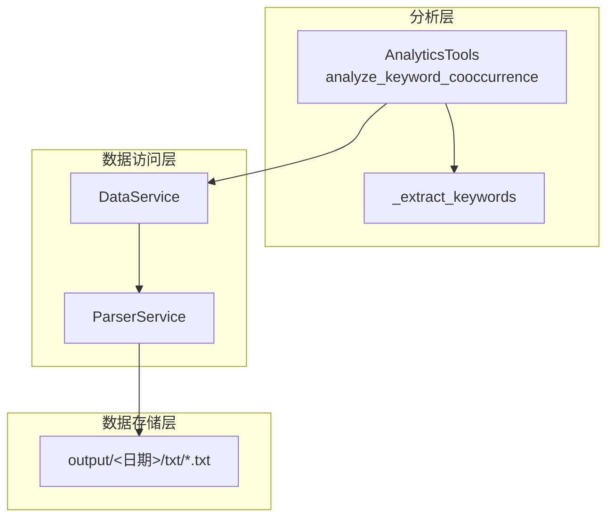
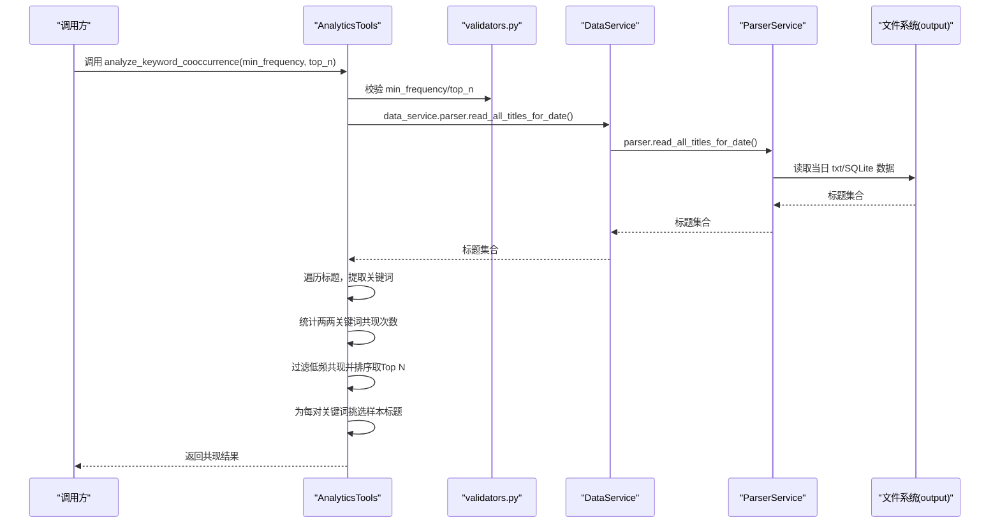
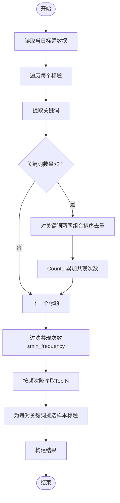
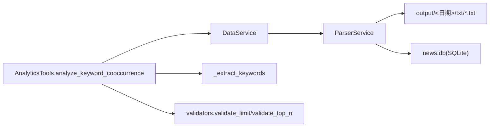

# 关键词共现分析

<cite>
**本文引用的文件**
- [analytics.py](file://mcp_server/tools/analytics.py)
- [validators.py](file://mcp_server/utils/validators.py)
- [parser_service.py](file://mcp_server/services/parser_service.py)
- [data_service.py](file://mcp_server/services/data_service.py)
- [00时31分.txt](file://output/2025年11月15日/txt/00时31分.txt)
</cite>

## 目录
1. [简介](#简介)
2. [项目结构](#项目结构)
3. [核心组件](#核心组件)
4. [架构总览](#架构总览)
5. [详细组件分析](#详细组件分析)
6. [依赖关系分析](#依赖关系分析)
7. [性能考量](#性能考量)
8. [故障排查指南](#故障排查指南)
9. [结论](#结论)
10. [附录](#附录)

## 简介
本文围绕 AnalyticsTools 类中的 analyze_keyword_cooccurrence 方法进行深入文档化，重点解释：
- 参数 min_frequency（最小共现频次）与 top_n（返回前N个结果）的作用及对结果的影响
- 内部实现如何通过 _extract_keywords 提取关键词，并利用 Counter 统计两两关键词的共现次数
- 结果中 cooccurrence_count 的统计逻辑与 sample_titles 的样本标题选取方式
- 具体调用示例：分析“人工智能”与“机器学习”的共现频率
- 如何基于返回结果构建关键词关联网络
- 该方法仅基于当日数据进行分析的技术限制

## 项目结构
- 该方法位于 mcp_server/tools/analytics.py 中，属于 AnalyticsTools 类
- 数据来源通过 DataService 与 ParserService 读取 output 目录下的文本数据
- 参数校验通过 mcp_server/utils/validators.py 提供的 validate_limit、validate_top_n 等函数
- 示例数据位于 output/2025年11月15日/txt/00时31分.txt，展示标题数据的组织形式

图表来源
- [analytics.py](file://mcp_server/tools/analytics.py#L524-L628)
- [parser_service.py](file://mcp_server/services/parser_service.py#L460-L513)
- [data_service.py](file://mcp_server/services/data_service.py#L1-L103)
- [validators.py](file://mcp_server/utils/validators.py#L89-L119)

章节来源
- [analytics.py](file://mcp_server/tools/analytics.py#L524-L628)
- [parser_service.py](file://mcp_server/services/parser_service.py#L460-L513)
- [data_service.py](file://mcp_server/services/data_service.py#L1-L103)
- [validators.py](file://mcp_server/utils/validators.py#L89-L119)

## 核心组件
- AnalyticsTools.analyze_keyword_cooccurrence：关键词共现分析入口
- _extract_keywords：从标题中提取关键词（去除URL、特殊字符、停用词等）
- DataService/ParserService：读取当日标题数据（优先SQLite，否则TXT）
- 参数校验：validate_limit、validate_top_n

章节来源
- [analytics.py](file://mcp_server/tools/analytics.py#L524-L628)
- [analytics.py](file://mcp_server/tools/analytics.py#L1921-L1948)
- [validators.py](file://mcp_server/utils/validators.py#L89-L119)
- [validators.py](file://mcp_server/utils/validators.py#L244-L258)

## 架构总览
下图展示了从调用到产出的关键流程：

图表来源
- [analytics.py](file://mcp_server/tools/analytics.py#L524-L628)
- [validators.py](file://mcp_server/utils/validators.py#L89-L119)
- [validators.py](file://mcp_server/utils/validators.py#L244-L258)
- [parser_service.py](file://mcp_server/services/parser_service.py#L460-L513)
- [data_service.py](file://mcp_server/services/data_service.py#L1-L103)

## 详细组件分析

### 方法：analyze_keyword_cooccurrence
- 功能概述
  - 基于当日所有平台的新闻标题，提取关键词并对两两组合进行共现统计
  - 通过 min_frequency 过滤低频共现，通过 top_n 控制返回数量
  - 为每对关键词返回 sample_titles（最多3条），便于人工核验

- 参数说明
  - min_frequency：最小共现频次，低于该值的共现对会被过滤
  - top_n：返回前N个共现对，用于控制结果规模

- 关键实现步骤
  1) 参数校验：使用 validate_limit/min_frequency、validate_top_n/top_n
  2) 读取当日数据：DataService.parser.read_all_titles_for_date()
  3) 遍历标题，提取关键词：_extract_keywords
  4) 统计两两共现：对每个标题的关键词集合，两两组合并排序去重，使用 Counter 计数
  5) 过滤与排序：仅保留 count ≥ min_frequency 的对，按频次降序取前 top_n
  6) 样本标题：对每对关键词，从 keyword_titles[kw1] 中筛选同时包含 kw2 的标题，取前3条作为 sample_titles
  7) 返回：包含 success、cooccurrence_pairs、total_pairs、min_frequency、generated_at 等字段

- 结果字段说明
  - cooccurrence_pairs：数组，每项包含 keyword1、keyword2、cooccurrence_count、sample_titles
  - total_pairs：实际返回的共现对数量
  - min_frequency：传入的最小共现频次
  - generated_at：生成时间

- 技术限制
  - 仅分析当日数据，不支持跨日聚合；若当日无数据，将抛出 DataNotFoundError

章节来源
- [analytics.py](file://mcp_server/tools/analytics.py#L524-L628)

### 关键词提取：_extract_keywords
- 功能概述
  - 清洗标题（移除URL、特殊字符），按空格与常见分隔符切分，过滤停用词与短词，返回关键词列表
  - min_length 默认2，避免过短无意义词参与共现

- 复杂度与性能
  - 对单标题的关键词提取为 O(n)（n为分词后片段数）
  - 共现统计在标题总数为 M、平均关键词数为 k 的情况下，两两组合为 O(M·k^2)，最坏可达 O(M·k^2)

- 停用词与规则
  - 停用词集合包含常用虚词、助词等，减少噪声
  - 保留长度≥min_length 的词

章节来源
- [analytics.py](file://mcp_server/tools/analytics.py#L1921-L1948)

### 数据读取：DataService/ParserService
- 读取策略
  - 优先从 SQLite（news.db）读取，若不存在则回退到 TXT 文件夹
  - 当日数据缓存 TTL 较短（15分钟），以便及时反映最新内容
  - 支持按平台过滤（platform_ids）

- 数据结构
  - 返回 all_titles: {platform_id: {title: {...}}}，其中 title 对应的值包含 ranks、url、mobileUrl 等字段
  - id_to_name: {platform_id: platform_name}

章节来源
- [parser_service.py](file://mcp_server/services/parser_service.py#L460-L513)
- [data_service.py](file://mcp_server/services/data_service.py#L1-L103)

### 参数校验：validate_limit 与 validate_top_n
- validate_limit
  - 校验数值范围与类型，支持默认值与最大上限
- validate_top_n
  - 基于 validate_limit，限制 top_n 的最大值

章节来源
- [validators.py](file://mcp_server/utils/validators.py#L89-L119)
- [validators.py](file://mcp_server/utils/validators.py#L244-L258)

### 共现统计流程图

图表来源
- [analytics.py](file://mcp_server/tools/analytics.py#L524-L628)

## 依赖关系分析
- AnalyticsTools.analyze_keyword_cooccurrence 依赖：
  - DataService/ParserService：读取当日标题
  - _extract_keywords：关键词提取
  - validators：参数校验
- ParserService 依赖：
  - 文件系统 output/<日期>/txt/*.txt 或 SQLite 数据库
- 数据示例：
  - output/2025年11月15日/txt/00时31分.txt 展示了标题与平台分区的组织方式

图表来源
- [analytics.py](file://mcp_server/tools/analytics.py#L524-L628)
- [parser_service.py](file://mcp_server/services/parser_service.py#L460-L513)
- [validators.py](file://mcp_server/utils/validators.py#L89-L119)

章节来源
- [analytics.py](file://mcp_server/tools/analytics.py#L524-L628)
- [parser_service.py](file://mcp_server/services/parser_service.py#L460-L513)
- [validators.py](file://mcp_server/utils/validators.py#L89-L119)

## 性能考量
- 时间复杂度
  - 共现统计：O(M·k^2)，M 为当日标题数，k 为平均关键词数
  - 过滤与排序：O(P log P)，P 为候选共现对数
- 空间复杂度
  - Counter 存储共现对计数，keyword_titles 存储关键词到标题的映射，空间与候选对数相关
- 优化建议
  - 限制 top_n 与 min_frequency，避免返回过多结果
  - 在标题量极大时，考虑分批处理或增量计算
  - 使用更高效的分词与过滤策略（如正则预处理、停用词表索引）

[本节为通用性能讨论，无需特定文件引用]

## 故障排查指南
- 常见错误
  - DataNotFoundError：当日数据不存在或尚未生成
  - InvalidParameterError：参数类型或范围不合法（如 min_frequency、top_n）
- 排查步骤
  - 确认当日 output/<日期>/txt 或 SQLite 是否存在
  - 检查参数 min_frequency、top_n 是否符合 validate_limit/validate_top_n 的约束
  - 确认平台过滤与日期范围设置是否正确（虽然该方法默认当日）

章节来源
- [parser_service.py](file://mcp_server/services/parser_service.py#L460-L513)
- [validators.py](file://mcp_server/utils/validators.py#L89-L119)

## 结论
- analyze_keyword_cooccurrence 提供了基于当日数据的关键词共现分析能力，适合快速洞察热点话题之间的关联
- 通过 min_frequency 与 top_n 可灵活控制结果质量与规模
- 结果中的 sample_titles 有助于人工验证与进一步分析
- 由于仅分析当日数据，若需跨日趋势或更广范围分析，可结合其他分析方法（如趋势分析、预测分析）使用

[本节为总结性内容，无需特定文件引用]

## 附录

### 调用示例与最佳实践
- 示例场景
  - 分析“人工智能”与“机器学习”的共现频率：调用 analyze_keyword_cooccurrence(min_frequency=3, top_n=20)
  - 若希望更严格筛选，提高 min_frequency（如5），或降低 top_n（如10）
- 结果解读
  - cooccurrence_count 表示两词在同一标题中出现的次数
  - sample_titles 为包含两词的标题样本，便于核验
- 构建关键词关联网络
  - 以 keyword1 与 keyword2 为节点，cooccurrence_count 为边权重，绘制无向图
  - 可使用图可视化工具（如 Graphviz、NetworkX）进行展示
  - 建议对边权重进行阈值过滤，仅保留强关联边

章节来源
- [analytics.py](file://mcp_server/tools/analytics.py#L524-L628)

### 数据结构参考
- 标题数据示例（output/2025年11月15日/txt/00时31分.txt）
  - 平台分区：平台ID | 平台名称
  - 标题行：编号. 标题 [URL:...] [MOBILE:...]
  - 该结构由 ParserService 解析为 {platform_id: {title: {ranks,url,mobileUrl,...}}}

章节来源
- [00时31分.txt](file://output/2025年11月15日/txt/00时31分.txt#L1-L200)
- [parser_service.py](file://mcp_server/services/parser_service.py#L56-L145)