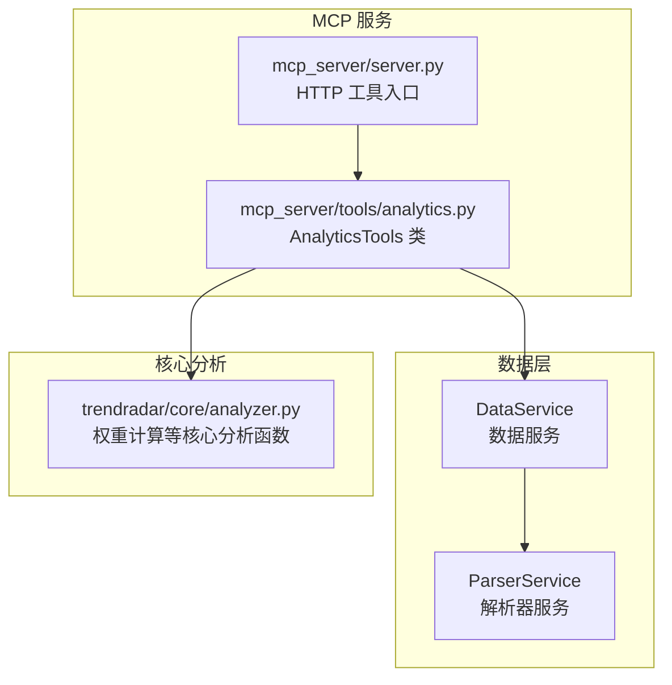
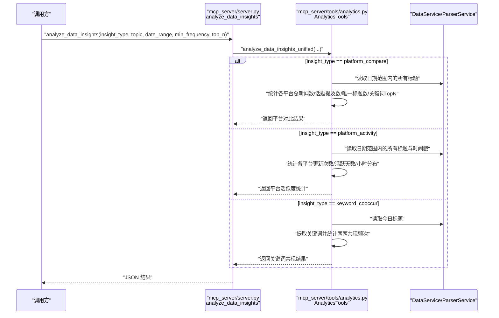
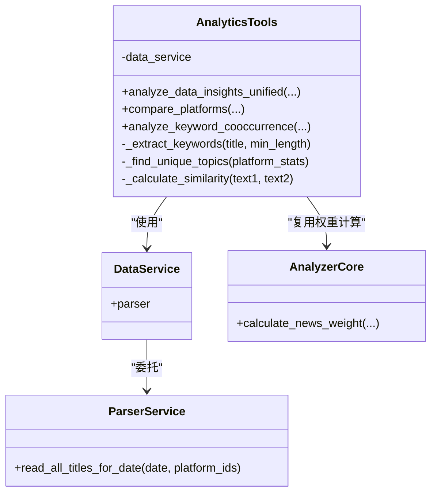

# 平台对比与共现分析工具

<cite>
**本文引用的文件**
- [mcp_server/tools/analytics.py](file://mcp_server/tools/analytics.py)
- [mcp_server/server.py](file://mcp_server/server.py)
- [trendradar/core/analyzer.py](file://trendradar/core/analyzer.py)
</cite>

## 目录
1. [简介](#简介)
2. [项目结构](#项目结构)
3. [核心组件](#核心组件)
4. [架构总览](#架构总览)
5. [详细组件分析](#详细组件分析)
6. [依赖关系分析](#依赖关系分析)
7. [性能考量](#性能考量)
8. [故障排查指南](#故障排查指南)
9. [结论](#结论)

## 简介
本文聚焦于 AnalyticsTools 类中的“平台对比与共现分析”能力，围绕以下三个方法进行深入说明：
- analyze_data_insights_unified（统一数据洞察分析）
- compare_platforms（平台对比分析）
- analyze_keyword_cooccurrence（关键词共现分析）

我们将解释每个方法的输入参数、输出格式、业务逻辑、应用场景，并给出具体使用示例，帮助读者快速掌握如何使用这些工具进行平台对比与共现分析。

## 项目结构
- 分析工具位于 MCP 服务侧，对外提供统一的分析接口，内部通过数据服务访问底层数据。
- 与之配套的 AI 分析入口在 MCP 服务的路由层，负责接收用户请求并转发到工具层。

图表来源
- [mcp_server/server.py](file://mcp_server/server.py#L293-L334)
- [mcp_server/tools/analytics.py](file://mcp_server/tools/analytics.py#L76-L90)
- [trendradar/core/analyzer.py](file://trendradar/core/analyzer.py#L16-L61)

章节来源
- [mcp_server/server.py](file://mcp_server/server.py#L293-L334)
- [mcp_server/tools/analytics.py](file://mcp_server/tools/analytics.py#L76-L90)
- [trendradar/core/analyzer.py](file://trendradar/core/analyzer.py#L16-L61)

## 核心组件
- AnalyticsTools：封装统一分析入口与平台对比、共现分析等核心方法。
- DataService/ParserService：负责从本地/远程存储读取标题数据。
- 核心分析函数：如 calculate_news_weight 等，用于权重计算与排序。

章节来源
- [mcp_server/tools/analytics.py](file://mcp_server/tools/analytics.py#L76-L90)
- [trendradar/core/analyzer.py](file://trendradar/core/analyzer.py#L16-L61)

## 架构总览
统一数据洞察分析的调用链路如下：

图表来源
- [mcp_server/server.py](file://mcp_server/server.py#L293-L334)
- [mcp_server/tools/analytics.py](file://mcp_server/tools/analytics.py#L88-L139)
- [mcp_server/tools/analytics.py](file://mcp_server/tools/analytics.py#L401-L510)
- [mcp_server/tools/analytics.py](file://mcp_server/tools/analytics.py#L525-L615)

## 详细组件分析

### analyze_data_insights_unified（统一数据洞察分析）
- 输入参数
  - insight_type：洞察类型，支持 "platform_compare"、"platform_activity"、"keyword_cooccur"
  - topic：可选，当 insight_type 为 "platform_compare" 时有效
  - date_range：可选，格式 {"start": "YYYY-MM-DD", "end": "YYYY-MM-DD"}
  - min_frequency：可选，当 insight_type 为 "keyword_cooccur" 时有效，最小共现频次
  - top_n：可选，当 insight_type 为 "keyword_cooccur" 时有效，返回 TOP N 结果
- 输出格式
  - 成功时返回字典，包含 success、结果数据（对应不同模式）
  - 失败时返回包含 error 字段的字典
- 业务逻辑
  - 校验 insight_type 合法性
  - 根据类型分派到 compare_platforms、get_platform_activity_stats、analyze_keyword_cooccurrence
  - 统一错误处理，返回标准错误结构
- 应用场景
  - 快速切换不同分析模式，统一对外接口
  - 便于前端/客户端以同一种工具名调用多种分析能力

章节来源
- [mcp_server/tools/analytics.py](file://mcp_server/tools/analytics.py#L88-L139)

### compare_platforms（平台对比分析）
- 输入参数
  - topic：可选，对比不同平台对同一话题的关注度；不指定则对比整体活跃度
  - date_range：可选，日期范围
- 输出格式
  - 成功时返回包含：
    - success、topic、date_range、total_platforms
    - platform_stats：各平台的统计字段
    - unique_topics：各平台独有的热点关键词
- 业务逻辑
  - 校验 topic（若提供）与 date_range
  - 遍历日期范围，读取各平台标题
  - 统计：
    - total_news：平台总新闻数
    - topic_mentions：包含话题的新闻数
    - unique_titles：唯一标题数（去重）
    - top_keywords：关键词 TopN（用于识别平台独有热点）
  - 计算覆盖率：coverage_rate = topic_mentions / total_news（若 total_news>0）
  - 识别各平台独有热点：基于平台 Top 关键词集合差集
- 平台覆盖率计算
  - coverage_rate = topic_mentions / total_news × 100%
  - 用于衡量某平台对特定话题的关注程度
- 关键词共现统计
  - 通过 _extract_keywords 提取关键词，统计各平台 Top 关键词
  - 用于辅助识别“平台独有热点”
- 应用场景
  - 对比不同平台对某一话题的关注度
  - 识别平台独有热点，指导内容运营与选题

章节来源
- [mcp_server/tools/analytics.py](file://mcp_server/tools/analytics.py#L401-L510)
- [mcp_server/tools/analytics.py](file://mcp_server/tools/analytics.py#L1930-L1996)

### analyze_keyword_cooccurrence（关键词共现分析）
- 输入参数
  - min_frequency：最小共现频次（默认3）
  - top_n：返回 TOP N 关键词对（默认20）
- 输出格式
  - 成功时返回包含：
    - success、cooccurrence_pairs、total_pairs、min_frequency、generated_at
- 业务逻辑
  - 校验 min_frequency、top_n
  - 读取今日所有标题
  - 提取关键词（_extract_keywords）
  - 统计两两共现频次（对每条标题中出现的关键词两两组合，排序后去重计数）
  - 过滤低于 min_frequency 的共现对
  - 按频次降序取前 top_n
  - 为每个共现对补充“同时包含两个关键词的标题样本”
- 关键词共现频次统计
  - 对每条标题，若包含 K 个关键词，则产生 C(K,2) 个共现对
  - 通过排序后的二元组作为键，避免重复计数
- 应用场景
  - 发现高频共现的关键词组合，辅助主题建模与标签体系设计
  - 识别热点话题的关键词关联模式

章节来源
- [mcp_server/tools/analytics.py](file://mcp_server/tools/analytics.py#L525-L615)
- [mcp_server/tools/analytics.py](file://mcp_server/tools/analytics.py#L1930-L1949)

### 辅助方法与工具
- _extract_keywords（关键词抽取）
  - 去除 URL 与标点
  - 按空格与常见中文分隔符切分
  - 过滤停用词与短词，返回关键词列表
- _find_unique_topics（平台独有热点）
  - 基于各平台 Top 关键词集合差集，识别独有关键词
- _calculate_similarity（相似度计算）
  - 基于 SequenceMatcher 的相似度评分
- calculate_news_weight（新闻权重）
  - 用于情感分析等场景的排序权重

章节来源
- [mcp_server/tools/analytics.py](file://mcp_server/tools/analytics.py#L1930-L1996)
- [trendradar/core/analyzer.py](file://trendradar/core/analyzer.py#L16-L61)

## 依赖关系分析
- 组件耦合
  - AnalyticsTools 依赖 DataService/ParserService 读取数据
  - AnalyticsTools 内部方法相互复用（如 _extract_keywords、_find_unique_topics）
  - calculate_news_weight 在情感分析等场景被复用
- 外部依赖
  - 正则表达式、Counter、defaultdict、SequenceMatcher 等标准库
  - 验证器与错误类型（来自工具层）

图表来源
- [mcp_server/tools/analytics.py](file://mcp_server/tools/analytics.py#L76-L90)
- [mcp_server/tools/analytics.py](file://mcp_server/tools/analytics.py#L1930-L1996)
- [trendradar/core/analyzer.py](file://trendradar/core/analyzer.py#L16-L61)

## 性能考量
- 时间复杂度
  - compare_platforms：遍历日期范围与各平台标题，统计 O(N)；覆盖率计算与 TopN 关键词统计为线性或近似线性
  - analyze_keyword_cooccurrence：对每条标题提取关键词，若平均关键词数为 K，则产生约 C(K,2) 个共现对，整体复杂度约为 O(N·K^2)
- 空间复杂度
  - 共现统计使用 Counter，空间与不同关键词对数量相关
  - Top 关键词统计使用 Counter.most_common，空间与平台数与关键词数相关
- 优化建议
  - 控制 top_n 与 min_frequency，避免返回过多结果
  - 合理设置 date_range，缩短分析窗口
  - 对超大数据集可考虑分页/采样策略（当前实现按日期逐天读取，建议在上层控制范围）

[本节为通用性能讨论，不直接分析具体文件]

## 故障排查指南
- 常见错误类型
  - 参数非法：insight_type 不在支持列表
  - 日期范围非法：start/end 格式或顺序不正确
  - 数据缺失：指定日期无数据
- 错误返回结构
  - 成功：{"success": true, ...}
  - 失败：{"success": false, "error": {"code": "...", "message": "..."}}
- 排查步骤
  - 确认 insight_type、topic、date_range、min_frequency、top_n 合法
  - 检查日期范围是否包含有效数据
  - 若返回错误，查看 error.code 与 message，按提示调整参数

章节来源
- [mcp_server/tools/analytics.py](file://mcp_server/tools/analytics.py#L117-L154)
- [mcp_server/tools/analytics.py](file://mcp_server/tools/analytics.py#L430-L523)
- [mcp_server/tools/analytics.py](file://mcp_server/tools/analytics.py#L554-L628)

## 结论
- analyze_data_insights_unified 提供统一入口，按洞察类型分派到不同分析方法，简化调用
- compare_platforms 通过覆盖率、唯一标题数与 Top 关键词，量化平台对话题的关注度与独有热点
- analyze_keyword_cooccurrence 基于两两共现统计，识别高频关键词组合，支撑主题建模
- 建议在实际使用中结合业务目标选择合适模式，并合理设置参数以平衡精度与性能

[本节为总结性内容，不直接分析具体文件]

## 附：使用示例与最佳实践

- 使用 analyze_data_insights_unified 进行“平台活跃度统计”
  - 场景：比较各平台在某日期范围内的发布频率与活跃时间段
  - 方法：将 insight_type 设置为 "platform_activity"，传入 date_range
  - 输出：各平台 total_updates、news_count、days_active、avg_news_per_day、most_active_hours、activity_score 等
  - 示例调用路径：[mcp_server/server.py](file://mcp_server/server.py#L293-L334) → [mcp_server/tools/analytics.py](file://mcp_server/tools/analytics.py#L1337-L1462)

- 使用 compare_platforms 进行“平台对比分析”
  - 场景：对比知乎、微博等平台对“人工智能”的关注程度
  - 方法：将 insight_type 设置为 "platform_compare"，传入 topic 与 date_range
  - 输出：各平台 total_news、topic_mentions、coverage_rate、unique_titles、top_keywords、unique_topics
  - 示例调用路径：[mcp_server/server.py](file://mcp_server/server.py#L293-L334) → [mcp_server/tools/analytics.py](file://mcp_server/tools/analytics.py#L401-L510)

- 使用 analyze_keyword_cooccurrence 进行“关键词共现分析”
  - 场景：发现“人工智能”与“芯片”、“大模型”等词的共现关系
  - 方法：将 insight_type 设置为 "keyword_cooccur"，可调整 min_frequency 与 top_n
  - 输出：cooccurrence_pairs（包含 keyword1、keyword2、cooccurrence_count、sample_titles）
  - 示例调用路径：[mcp_server/server.py](file://mcp_server/server.py#L293-L334) → [mcp_server/tools/analytics.py](file://mcp_server/tools/analytics.py#L525-L615)