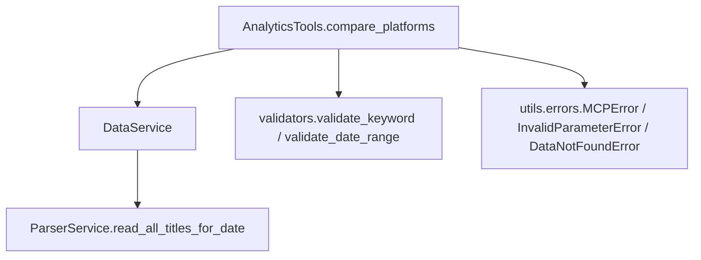
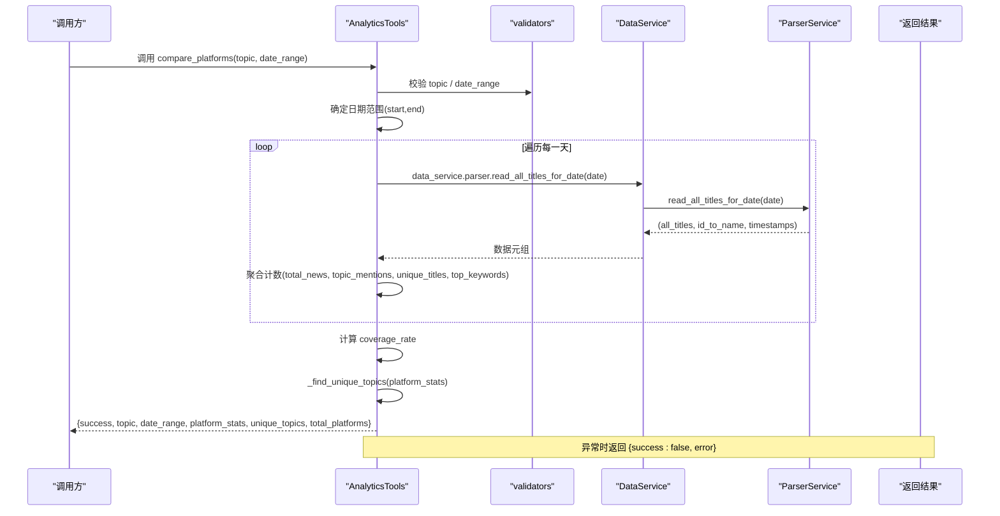
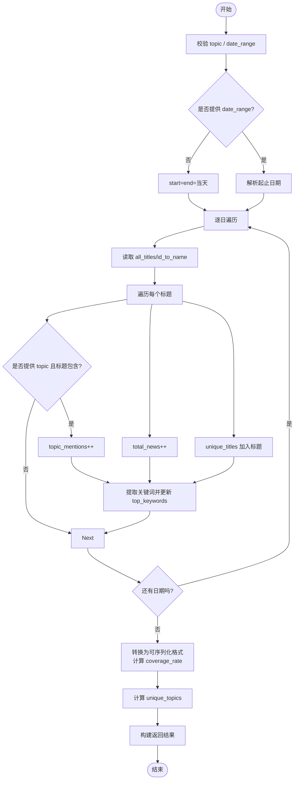
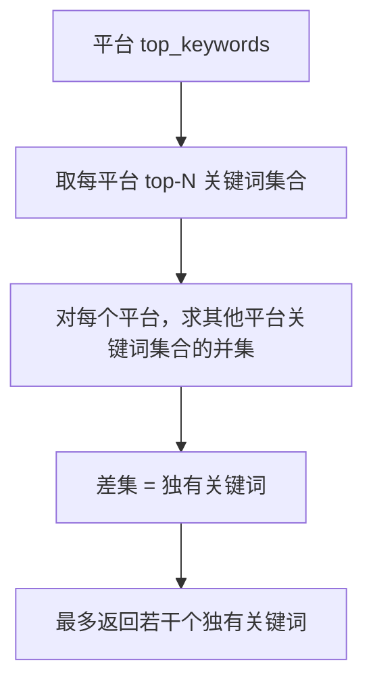
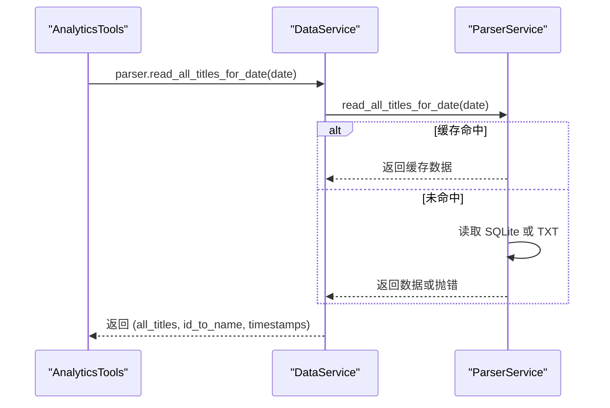
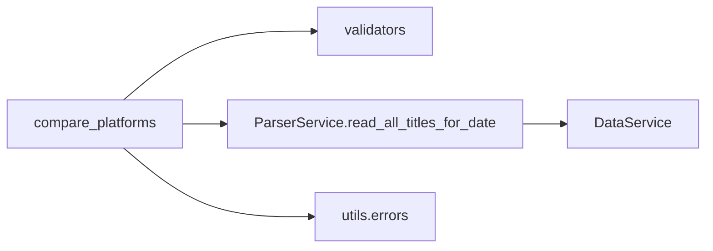

# 平台对比分析

<cite>
**本文引用的文件**
- [analytics.py](file://mcp_server/tools/analytics.py)
- [parser_service.py](file://mcp_server/services/parser_service.py)
- [data_service.py](file://mcp_server/services/data_service.py)
- [validators.py](file://mcp_server/utils/validators.py)
- [errors.py](file://mcp_server/utils/errors.py)
- [README-MCP-FAQ.md](file://README-MCP-FAQ.md)
</cite>

## 目录
1. [简介](#简介)
2. [项目结构](#项目结构)
3. [核心组件](#核心组件)
4. [架构总览](#架构总览)
5. [详细组件分析](#详细组件分析)
6. [依赖关系分析](#依赖关系分析)
7. [性能考量](#性能考量)
8. [故障排查指南](#故障排查指南)
9. [结论](#结论)

## 简介
本文档围绕 AnalyticsTools 类中的 compare_platforms 方法展开，系统性说明其输入参数 topic（可选话题关键词）与 date_range（日期范围）的使用方式，以及输出结果中 platform_stats（平台统计信息）、coverage_rate（覆盖率）、unique_topics（平台独有关键词）与 top_keywords（平台热词）的计算逻辑。文档还解释如何通过 total_news、topic_mentions、unique_titles 等指标评估平台活跃度与话题覆盖能力，并给出实际使用示例与异常处理机制说明。

## 项目结构
- compare_platforms 位于 mcp_server/tools/analytics.py 中，是 AnalyticsTools 类的一个公共方法。
- 数据读取由 DataService 与 ParserService 协作完成，ParserService 提供 read_all_titles_for_date 接口，按日期读取各平台标题数据。
- 参数校验由 validators 模块提供，包括 validate_keyword、validate_date_range 等。
- 错误处理统一由 utils/errors 中的 MCPError/InvalidParameterError/DataNotFoundError 抛出与捕获。

图表来源
- [analytics.py](file://mcp_server/tools/analytics.py#L401-L523)
- [parser_service.py](file://mcp_server/services/parser_service.py#L461-L520)
- [validators.py](file://mcp_server/utils/validators.py#L1-L120)
- [errors.py](file://mcp_server/utils/errors.py#L1-L120)

章节来源
- [analytics.py](file://mcp_server/tools/analytics.py#L401-L523)
- [parser_service.py](file://mcp_server/services/parser_service.py#L461-L520)
- [validators.py](file://mcp_server/utils/validators.py#L1-L120)
- [errors.py](file://mcp_server/utils/errors.py#L1-L120)

## 核心组件
- AnalyticsTools.compare_platforms：对比不同平台对同一话题的关注度，返回平台维度的统计信息与独有关键词。
- ParserService.read_all_titles_for_date：按日期读取各平台标题数据，支持缓存与多数据源回退。
- validators：提供参数校验（关键词、日期范围、平台列表等）。
- errors：统一异常类型，便于上层捕获与返回。

章节来源
- [analytics.py](file://mcp_server/tools/analytics.py#L401-L523)
- [parser_service.py](file://mcp_server/services/parser_service.py#L461-L520)
- [validators.py](file://mcp_server/utils/validators.py#L1-L120)
- [errors.py](file://mcp_server/utils/errors.py#L1-L120)

## 架构总览
compare_platforms 的执行流程如下：
- 参数校验：topic（可选）与 date_range（可选）经 validators 校验。
- 日期范围确定：若未提供 date_range，则默认当天；否则按起止日期遍历。
- 数据读取：逐日调用 ParserService.read_all_titles_for_date 获取 all_titles、id_to_name、timestamps。
- 统计聚合：按平台维度累计 total_news、unique_titles、topic_mentions、top_keywords。
- 结果转换：计算 coverage_rate = topic_mentions / total_news（百分比），并取 top_keywords 的前若干项。
- 独有关键词：调用 _find_unique_topics 基于各平台 top_keywords 计算独有关键词集合。
- 异常处理：捕获 MCPError 与通用异常，返回统一错误结构。

图表来源
- [analytics.py](file://mcp_server/tools/analytics.py#L401-L523)
- [parser_service.py](file://mcp_server/services/parser_service.py#L461-L520)
- [validators.py](file://mcp_server/utils/validators.py#L1-L120)
- [errors.py](file://mcp_server/utils/errors.py#L1-L120)

## 详细组件分析

### compare_platforms 方法详解
- 输入参数
  - topic：可选字符串，作为话题关键词参与匹配。若提供，将用于统计各平台的 topic_mentions。
  - date_range：可选字典，格式为 {"start":"YYYY-MM-DD","end":"YYYY-MM-DD"}。若未提供，则默认当天。
- 数据读取与聚合
  - 逐日读取 all_titles（平台ID->标题映射）、id_to_name（平台ID->平台名）。
  - 对每个标题：
    - total_news：平台维度自增1
    - unique_titles：将标题加入集合（去重）
    - topic_mentions：当标题包含 topic（大小写不敏感）时，平台维度自增1
    - top_keywords：从标题提取关键词并累加 Counter
- 结果计算
  - coverage_rate：若 total_news>0，则 coverage_rate = topic_mentions/total_news×100；否则为0。
  - top_keywords：取 Counter 的 most_common(5) 转为 [{"keyword":k,"count":v}]。
  - unique_topics：调用 _find_unique_topics，基于各平台 top_keywords 的交集差集，得到“独有关键词”。
- 输出字段
  - success：布尔，成功时为 true
  - topic：传入的关键词（若未提供则为 null）
  - date_range：包含 start、end
  - platform_stats：平台维度统计，包含 total_news、topic_mentions、unique_titles、coverage_rate、top_keywords
  - unique_topics：平台独有关键词集合
  - total_platforms：平台总数

图表来源
- [analytics.py](file://mcp_server/tools/analytics.py#L401-L523)

章节来源
- [analytics.py](file://mcp_server/tools/analytics.py#L401-L523)

### 关键词提取与独有话题计算
- 关键词提取（_extract_keywords）
  - 移除 URL 与特殊字符，按空白与常见标点分词。
  - 过滤长度小于阈值与停用词，返回关键词列表。
- 独有话题（_find_unique_topics）
  - 从各平台统计的 top_keywords 中取前若干个，形成集合。
  - 对每个平台，计算其关键词集合与其他平台关键词集合的差集，得到“独有关键词”，最多返回若干个。

图表来源
- [analytics.py](file://mcp_server/tools/analytics.py#L1921-L1996)

章节来源
- [analytics.py](file://mcp_server/tools/analytics.py#L1921-L1996)

### 数据读取与缓存
- ParserService.read_all_titles_for_date
  - 优先从缓存命中；缓存策略：当天数据 TTL 较短，历史数据较长。
  - 优先从 SQLite 读取，若不存在则回退到 TXT 文件。
  - 若均无数据，抛出 DataNotFoundError。
- DataService
  - 作为 AnalyticsTools 的属性，持有 ParserService 实例，负责调用读取接口。

图表来源
- [parser_service.py](file://mcp_server/services/parser_service.py#L461-L520)
- [data_service.py](file://mcp_server/services/data_service.py#L337-L367)

章节来源
- [parser_service.py](file://mcp_server/services/parser_service.py#L461-L520)
- [data_service.py](file://mcp_server/services/data_service.py#L337-L367)

### 参数校验与异常处理
- 参数校验
  - validate_keyword：校验 topic 合法性。
  - validate_date_range：校验 date_range 格式与范围。
- 异常处理
  - 捕获 MCPError（参数错误、数据不存在等）与通用异常，返回统一错误结构 {success:false,error}。
  - DataNotFoundError：当某日无数据时，compare_platforms 内部会忽略该日并继续处理后续日期。

章节来源
- [validators.py](file://mcp_server/utils/validators.py#L1-L120)
- [errors.py](file://mcp_server/utils/errors.py#L1-L120)
- [analytics.py](file://mcp_server/tools/analytics.py#L401-L523)

## 依赖关系分析
- compare_platforms 依赖
  - validators：validate_keyword、validate_date_range
  - ParserService：read_all_titles_for_date
  - utils.errors：MCPError、InvalidParameterError、DataNotFoundError
- 数据流
  - 输入参数 -> 校验 -> 日期遍历 -> 读取 -> 聚合 -> 计算 -> 返回

图表来源
- [analytics.py](file://mcp_server/tools/analytics.py#L401-L523)
- [parser_service.py](file://mcp_server/services/parser_service.py#L461-L520)
- [validators.py](file://mcp_server/utils/validators.py#L1-L120)
- [errors.py](file://mcp_server/utils/errors.py#L1-L120)

章节来源
- [analytics.py](file://mcp_server/tools/analytics.py#L401-L523)
- [parser_service.py](file://mcp_server/services/parser_service.py#L461-L520)
- [validators.py](file://mcp_server/utils/validators.py#L1-L120)
- [errors.py](file://mcp_server/utils/errors.py#L1-L120)

## 性能考量
- 时间复杂度
  - 逐日遍历：O(D)，D 为日期跨度。
  - 逐标题处理：O(N)，N 为当日总标题数。
  - 关键词提取与 Counter 更新：O(K)，K 为标题中词数。
  - 总体近似 O(D×N)。
- 空间复杂度
  - platform_stats：按平台维护计数与集合，空间与平台数与唯一标题数相关。
  - top_keywords：Counter，空间与不同词数相关。
- 缓存与回退
  - ParserService 对 SQLite/TXT 读取进行缓存，减少 IO 开销。
- 去重
  - unique_titles 使用集合去重，避免重复标题影响统计。

[本节为通用性能讨论，无需列出具体文件来源]

## 故障排查指南
- 未找到数据
  - 现象：某日 DataNotFoundError。
  - 处理：compare_platforms 内部会忽略该日并继续处理后续日期。
  - 建议：确认日期是否正确、爬虫是否已抓取该日数据。
- 参数非法
  - 现象：InvalidParameterError。
  - 处理：检查 topic 是否为空或包含非法字符、date_range 格式是否正确。
- 返回结果为空
  - 现象：platform_stats 为空或 coverage_rate 为 0。
  - 原因：所选日期范围内无数据，或 topic 未匹配到任何标题。
  - 建议：扩大日期范围、调整 topic 或检查数据源。

章节来源
- [analytics.py](file://mcp_server/tools/analytics.py#L401-L523)
- [parser_service.py](file://mcp_server/services/parser_service.py#L461-L520)
- [validators.py](file://mcp_server/utils/validators.py#L1-L120)
- [errors.py](file://mcp_server/utils/errors.py#L1-L120)

## 结论
compare_platforms 提供了跨平台、跨日期的对比分析能力，通过 total_news、topic_mentions、unique_titles 等指标，能够直观评估平台活跃度与话题覆盖能力。coverage_rate 作为核心指标，量化了平台对特定话题的关注程度。配合 top_keywords 与 unique_topics，用户可以进一步洞察平台的热点分布与差异化特征。建议在生产环境中结合缓存策略与合理的日期范围，以获得更高效稳定的分析结果。