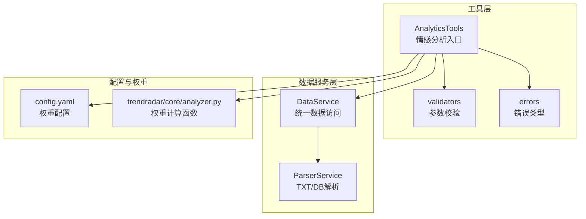
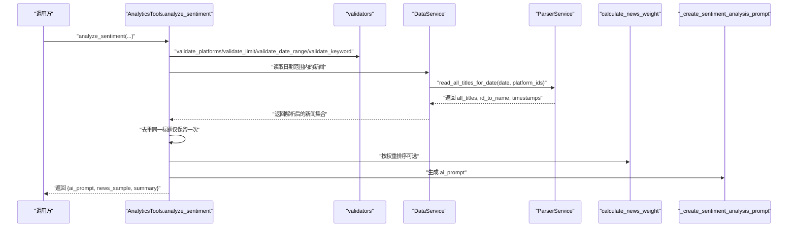
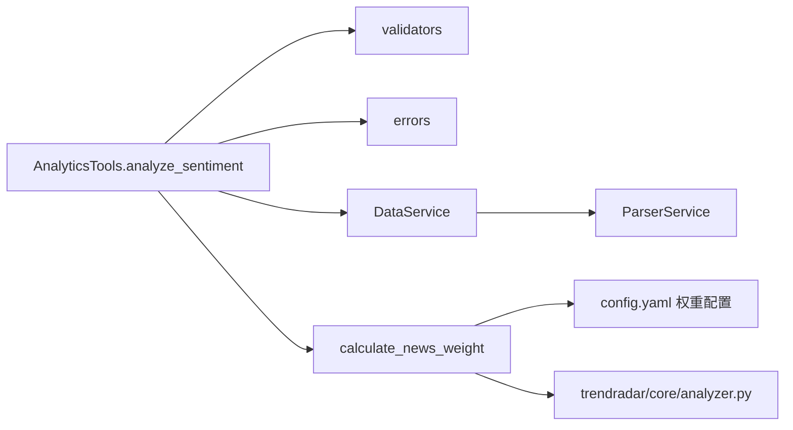

# 情感分析工具

<cite>
**本文引用的文件**
- [mcp_server/tools/analytics.py](file://mcp_server/tools/analytics.py)
- [mcp_server/services/data_service.py](file://mcp_server/services/data_service.py)
- [mcp_server/services/parser_service.py](file://mcp_server/services/parser_service.py)
- [mcp_server/utils/validators.py](file://mcp_server/utils/validators.py)
- [mcp_server/utils/errors.py](file://mcp_server/utils/errors.py)
- [config/config.yaml](file://config/config.yaml)
- [trendradar/core/analyzer.py](file://trendradar/core/analyzer.py)
</cite>

## 目录
1. [简介](#简介)
2. [项目结构](#项目结构)
3. [核心组件](#核心组件)
4. [架构总览](#架构总览)
5. [详细组件分析](#详细组件分析)
6. [依赖关系分析](#依赖关系分析)
7. [性能考量](#性能考量)
8. [故障排查指南](#故障排查指南)
9. [结论](#结论)
10. [附录](#附录)

## 简介
本文件聚焦于 AnalyticsTools 类中的情感分析能力，重点围绕 analyze_sentiment 方法展开，系统阐述其输入参数、输出格式（尤其是 ai_prompt 字段的生成逻辑）、内部实现流程、数据来源与去重策略、排序机制（calculate_news_weight 的应用），并给出具体使用示例，帮助读者快速理解并高效使用“生成 AI 情感分析提示词”的能力。

## 项目结构
情感分析功能位于 MCP 工具层，围绕 AnalyticsTools 类提供统一入口；数据读取由 DataService/ParserService 层负责；参数校验与错误类型由工具层的 validators/errors 模块提供；权重配置来自 config.yaml。

图表来源
- [mcp_server/tools/analytics.py](file://mcp_server/tools/analytics.py#L630-L800)
- [mcp_server/services/data_service.py](file://mcp_server/services/data_service.py#L1-L120)
- [mcp_server/services/parser_service.py](file://mcp_server/services/parser_service.py#L460-L520)
- [mcp_server/utils/validators.py](file://mcp_server/utils/validators.py#L43-L121)
- [mcp_server/utils/errors.py](file://mcp_server/utils/errors.py#L10-L50)
- [config/config.yaml](file://config/config.yaml#L157-L162)
- [trendradar/core/analyzer.py](file://trendradar/core/analyzer.py#L16-L61)

章节来源
- [mcp_server/tools/analytics.py](file://mcp_server/tools/analytics.py#L630-L800)
- [mcp_server/services/data_service.py](file://mcp_server/services/data_service.py#L1-L120)
- [mcp_server/services/parser_service.py](file://mcp_server/services/parser_service.py#L460-L520)
- [mcp_server/utils/validators.py](file://mcp_server/utils/validators.py#L43-L121)
- [mcp_server/utils/errors.py](file://mcp_server/utils/errors.py#L10-L50)
- [config/config.yaml](file://config/config.yaml#L157-L162)
- [trendradar/core/analyzer.py](file://trendradar/core/analyzer.py#L16-L61)

## 核心组件
- AnalyticsTools.analyze_sentiment：情感分析主入口，负责收集新闻、去重、按权重排序、生成 ai_prompt。
- _create_sentiment_analysis_prompt：构建结构化提示词，供外部 AI 进行情感分析。
- calculate_news_weight：计算新闻权重，用于排序（工具层与核心层分别实现，语义一致）。
- DataService/ParserService：从 TXT/DB 读取新闻标题、URL、排名等元数据。
- validators/errors：参数校验与错误封装。
- config.yaml：权重配置项（rank_weight、frequency_weight、hotness_weight）。

章节来源
- [mcp_server/tools/analytics.py](file://mcp_server/tools/analytics.py#L630-L800)
- [mcp_server/tools/analytics.py](file://mcp_server/tools/analytics.py#L817-L908)
- [mcp_server/services/data_service.py](file://mcp_server/services/data_service.py#L1-L120)
- [mcp_server/services/parser_service.py](file://mcp_server/services/parser_service.py#L460-L520)
- [mcp_server/utils/validators.py](file://mcp_server/utils/validators.py#L43-L121)
- [mcp_server/utils/errors.py](file://mcp_server/utils/errors.py#L10-L50)
- [config/config.yaml](file://config/config.yaml#L157-L162)
- [trendradar/core/analyzer.py](file://trendradar/core/analyzer.py#L16-L61)

## 架构总览
情感分析的端到端流程如下：调用 analyze_sentiment → 参数校验 → 读取多日数据 → 去重合并 → 权重排序 → 生成提示词 → 返回结构化结果。

图表来源
- [mcp_server/tools/analytics.py](file://mcp_server/tools/analytics.py#L630-L800)
- [mcp_server/tools/analytics.py](file://mcp_server/tools/analytics.py#L817-L908)
- [mcp_server/services/data_service.py](file://mcp_server/services/data_service.py#L460-L520)
- [mcp_server/services/parser_service.py](file://mcp_server/services/parser_service.py#L460-L520)
- [trendradar/core/analyzer.py](file://trendradar/core/analyzer.py#L16-L61)

## 详细组件分析

### analyze_sentiment 方法详解
- 输入参数
  - topic：可选，限定新闻标题需包含该关键词。
  - platforms：可选，平台过滤列表（如 ["zhihu","weibo"]），默认使用配置中的平台列表。
  - date_range：可选，{"start":"YYYY-MM-DD","end":"YYYY-MM-DD"}，默认查询当天。
  - limit：返回新闻数量上限，默认50，最大100。
  - sort_by_weight：是否按权重排序，默认True。
  - include_url：是否包含URL字段，默认False（节省token）。
- 数据收集与去重
  - 遍历日期范围，逐日读取 all_titles，按平台与标题聚合。
  - 去重策略：以 "platform::title" 为键，若同一标题在不同日期/平台出现，合并其 ranks 并累加 count。
- 排序与截断
  - 若 sort_by_weight=True，则按 calculate_news_weight(x) 降序排序。
  - 截取前 limit 条作为最终样本。
- 提示词生成
  - 调用 _create_sentiment_analysis_prompt(news_data, topic)，按平台分组、统计概览、时间范围、输出格式说明等生成结构化提示词。
- 输出结构
  - success：布尔值。
  - method：固定为 "ai_prompt_generation"。
  - summary：包含 total_found、returned_count、requested_limit、duplicates_removed、topic、time_range、platforms、sorted_by_weight 等。
  - ai_prompt：生成的提示词字符串。
  - news_sample：排序后的新闻样本列表（包含 platform、title、ranks、count、date，可选 url/mobileUrl）。
  - note：当返回数量小于请求或存在去重时的补充说明。

章节来源
- [mcp_server/tools/analytics.py](file://mcp_server/tools/analytics.py#L630-L800)

### _create_sentiment_analysis_prompt 提示词生成逻辑
- 任务说明：根据是否提供 topic 决定分析范围（特定话题或通用新闻）。
- 分析要求：识别每条新闻情感倾向（正面/负面/中性）、统计分布、平台差异、整体趋势、典型样本。
- 数据概览：总新闻数、覆盖平台数、时间范围。
- 平台分类展示：按平台分组，列出新闻标题与日期。
- 输出格式说明：明确要求输出情感分布统计、平台对比、整体趋势、典型样本（正面/负面）。

章节来源
- [mcp_server/tools/analytics.py](file://mcp_server/tools/analytics.py#L817-L908)

### calculate_news_weight 权重计算与排序
- 计算维度（与 config.yaml 中权重配置一致）：
  - 排名权重（Rank Weight）：Σ(11 - min(rank,10)) / 出现次数，反映榜单位置的重要性。
  - 频次权重（Frequency Weight）：min(count,10) × 10，反映出现次数的影响。
  - 热度权重（Hotness Weight）：高排名比例（rank ≤ 5）× 100，反映持续热度。
- 综合权重：加权求和，数值越大越重要。
- 在 analyze_sentiment 中的应用：
  - 当 sort_by_weight=True 时，按 calculate_news_weight(x) 降序排序。
  - 当 sort_by_weight=False 时，按平台内置排序（例如按 rank 排序）。

章节来源
- [mcp_server/tools/analytics.py](file://mcp_server/tools/analytics.py#L24-L74)
- [config/config.yaml](file://config/config.yaml#L157-L162)
- [trendradar/core/analyzer.py](file://trendradar/core/analyzer.py#L16-L61)

### 数据来源与解析
- 数据服务层
  - DataService 提供 get_latest_news/get_news_by_date/search_news_by_keyword 等便捷接口；analyze_sentiment 使用 ParserService.read_all_titles_for_date 读取指定日期范围内的所有标题。
- 解析层
  - ParserService 支持从 SQLite（news.db）或 TXT 文件夹读取，解析标题、URL、移动端URL、排名、首次/最后抓取时间、抓取次数等元数据。
  - 支持按平台过滤与日期范围遍历。
- 去重与合并
  - analyze_sentiment 中以 "platform::title" 为键去重，合并 ranks 并累加 count，保证同一新闻在不同日期/平台出现时只保留一条记录，但保留其历史排名轨迹。

章节来源
- [mcp_server/services/data_service.py](file://mcp_server/services/data_service.py#L104-L183)
- [mcp_server/services/parser_service.py](file://mcp_server/services/parser_service.py#L241-L323)
- [mcp_server/services/parser_service.py](file://mcp_server/services/parser_service.py#L460-L520)

### 参数校验与错误处理
- 参数校验
  - validate_platforms：平台列表校验，支持从 config.yaml 动态加载平台清单。
  - validate_limit：限制数量校验，支持默认值与最大值约束。
  - validate_date_range：日期范围校验，禁止未来日期，提供可用范围提示。
  - validate_keyword：关键词长度与类型校验。
- 错误类型
  - InvalidParameterError：参数无效。
  - DataNotFoundError：数据不存在。
  - 其他工具层错误均封装为 MCPError 并转换为统一字典格式返回。

章节来源
- [mcp_server/utils/validators.py](file://mcp_server/utils/validators.py#L43-L121)
- [mcp_server/utils/validators.py](file://mcp_server/utils/validators.py#L145-L209)
- [mcp_server/utils/validators.py](file://mcp_server/utils/validators.py#L212-L243)
- [mcp_server/utils/errors.py](file://mcp_server/utils/errors.py#L10-L50)

### 使用示例
- 示例1：分析“特斯拉相关新闻”情感倾向（当天）
  - 调用：analyze_sentiment(topic="特斯拉", limit=10)
  - 结果：返回 ai_prompt 与 news_sample，ai_prompt 中包含“请分析关于‘特斯拉’的新闻标题的情感倾向”的任务说明与输出格式要求。
- 示例2：分析一周内的“特斯拉相关新闻”，并包含URL
  - 调用：analyze_sentiment(topic="特斯拉", date_range={"start":"YYYY-MM-DD","end":"YYYY-MM-DD"}, limit=10, include_url=True)
  - 结果：ai_prompt 中包含平台分类与新闻列表，news_sample 中包含 url/mobileUrl 字段。
- 示例3：按平台过滤（仅微博、知乎）
  - 调用：analyze_sentiment(topic="特斯拉", platforms=["weibo","zhihu"], limit=10)
  - 结果：仅包含指定平台的新闻样本与提示词。

章节来源
- [mcp_server/tools/analytics.py](file://mcp_server/tools/analytics.py#L630-L800)

## 依赖关系分析
- 工具层依赖
  - AnalyticsTools 依赖 validators（参数校验）、errors（错误封装）、DataService（数据访问）、ParserService（解析）、calculate_news_weight（权重计算）。
- 配置依赖
  - config.yaml 中的权重配置（rank_weight、frequency_weight、hotness_weight）与权重计算逻辑保持一致。
- 核心层复用
  - trendradar/core/analyzer.py 中的 calculate_news_weight 与工具层实现语义一致，用于统一权重计算。

图表来源
- [mcp_server/tools/analytics.py](file://mcp_server/tools/analytics.py#L630-L800)
- [mcp_server/utils/validators.py](file://mcp_server/utils/validators.py#L43-L121)
- [mcp_server/utils/errors.py](file://mcp_server/utils/errors.py#L10-L50)
- [mcp_server/services/data_service.py](file://mcp_server/services/data_service.py#L1-L120)
- [mcp_server/services/parser_service.py](file://mcp_server/services/parser_service.py#L460-L520)
- [config/config.yaml](file://config/config.yaml#L157-L162)
- [trendradar/core/analyzer.py](file://trendradar/core/analyzer.py#L16-L61)

## 性能考量
- 数据读取
  - read_all_titles_for_date 支持缓存（按日期与平台键缓存），历史数据缓存时间较长，当日数据缓存时间较短，减少重复解析开销。
- 去重与合并
  - 去重采用哈希键 "platform::title"，避免重复记录；合并 ranks 与 count 时按平台维度聚合，复杂度与新闻条目数线性相关。
- 排序
  - 默认按权重排序，排序复杂度 O(n log n)；若关闭权重排序，按平台内置排序，复杂度 O(n log n)。
- 提示词生成
  - _create_sentiment_analysis_prompt 为线性扫描与拼接，复杂度 O(n)。
- 建议
  - 合理设置 limit，避免一次性生成过多文本导致 token 超限。
  - 适当开启 include_url 以提升分析质量，但注意 token 成本。

章节来源
- [mcp_server/services/data_service.py](file://mcp_server/services/data_service.py#L1-L120)
- [mcp_server/tools/analytics.py](file://mcp_server/tools/analytics.py#L630-L800)

## 故障排查指南
- 未找到相关新闻
  - 现象：返回 DataNotFoundError，提示“未找到相关新闻（时间范围）”
  - 处理：检查 topic、date_range、platforms 是否合理；确认爬虫已完成且数据已落盘。
- 日期范围错误
  - 现象：InvalidParameterError，提示开始/结束日期非法或未来日期
  - 处理：修正日期格式与范围；使用可用日期范围提示。
- 平台不支持
  - 现象：InvalidParameterError，提示不支持的平台
  - 处理：核对 config.yaml 中 platforms 配置，或传入空列表使用默认平台。
- 参数越界
  - 现象：InvalidParameterError，limit 超出最大限制
  - 处理：降低 limit 或分页多次请求。

章节来源
- [mcp_server/utils/validators.py](file://mcp_server/utils/validators.py#L145-L209)
- [mcp_server/utils/validators.py](file://mcp_server/utils/validators.py#L90-L121)
- [mcp_server/utils/errors.py](file://mcp_server/utils/errors.py#L30-L50)

## 结论
analyze_sentiment 通过标准化的数据采集、去重与权重排序，结合结构化的提示词生成，为外部 AI 提供高质量的情感分析输入。其参数校验严谨、错误处理统一、权重配置清晰，适合在多平台、多日期范围内快速生成“关于某话题”的情感分析提示词。建议在生产环境中合理设置 limit 与 include_url，并结合平台过滤与日期范围，以获得更聚焦的分析结果。

## 附录
- 权重配置参考
  - config.yaml 中的 rank_weight、frequency_weight、hotness_weight 与 calculate_news_weight 的计算逻辑保持一致，确保工具层与核心层权重一致性。
- 相关实现路径
  - analyze_sentiment：[mcp_server/tools/analytics.py](file://mcp_server/tools/analytics.py#L630-L800)
  - _create_sentiment_analysis_prompt：[mcp_server/tools/analytics.py](file://mcp_server/tools/analytics.py#L817-L908)
  - calculate_news_weight（工具层）：[mcp_server/tools/analytics.py](file://mcp_server/tools/analytics.py#L24-L74)
  - calculate_news_weight（核心层）：[trendradar/core/analyzer.py](file://trendradar/core/analyzer.py#L16-L61)
  - 数据读取：[mcp_server/services/parser_service.py](file://mcp_server/services/parser_service.py#L460-L520)
  - 参数校验：[mcp_server/utils/validators.py](file://mcp_server/utils/validators.py#L43-L121)
  - 错误类型：[mcp_server/utils/errors.py](file://mcp_server/utils/errors.py#L10-L50)
  - 权重配置：[config/config.yaml](file://config/config.yaml#L157-L162)