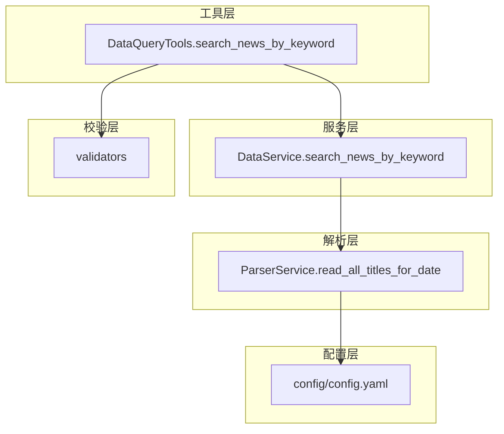
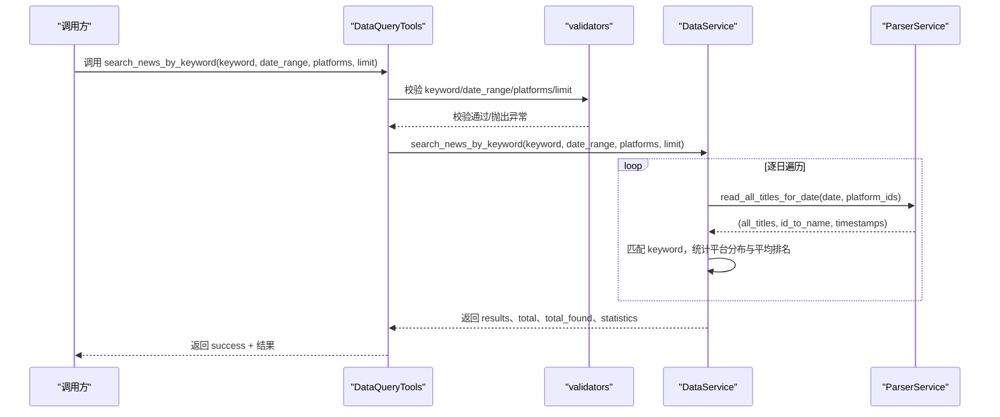
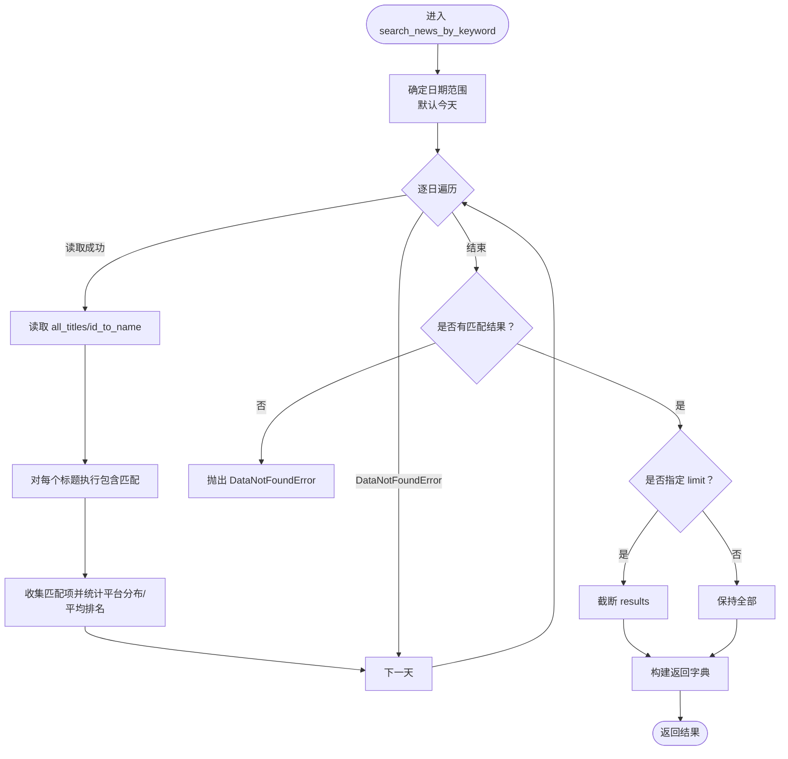
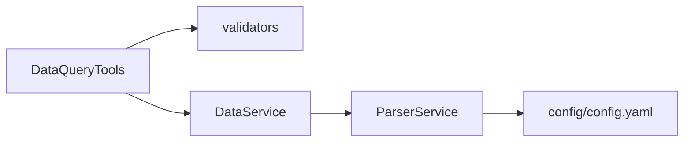

# 关键词搜索

<cite>
**本文引用的文件**
- [mcp_server/tools/data_query.py](file://mcp_server/tools/data_query.py)
- [mcp_server/services/data_service.py](file://mcp_server/services/data_service.py)
- [mcp_server/services/parser_service.py](file://mcp_server/services/parser_service.py)
- [mcp_server/utils/validators.py](file://mcp_server/utils/validators.py)
- [config/config.yaml](file://config/config.yaml)
</cite>

## 目录
1. [简介](#简介)
2. [项目结构](#项目结构)
3. [核心组件](#核心组件)
4. [架构总览](#架构总览)
5. [详细组件分析](#详细组件分析)
6. [依赖关系分析](#依赖关系分析)
7. [性能考量](#性能考量)
8. [故障排查指南](#故障排查指南)
9. [结论](#结论)
10. [附录](#附录)

## 简介
本篇文档围绕关键词搜索能力“search_news_by_keyword”展开，聚焦其全文搜索能力与参数使用方法，包括：
- keyword（必需的搜索关键词）
- date_range（可选的日期范围，格式为{"start": "YYYY-MM-DD", "end": "YYYY-MM-DD"}）
- platforms（平台过滤）
- limit（结果数量限制）

文档解释该方法如何利用DataService.search_news_by_keyword在历史数据中执行关键词匹配，并返回匹配的新闻列表及其总数；提供实用示例，如搜索“人工智能”在最近10天内的所有相关新闻；讨论其在事件追踪和深度分析中的应用，并给出性能建议（如大范围搜索可能较慢）。

## 项目结构
关键词搜索能力由三层协作完成：
- 工具层：DataQueryTools.search_news_by_keyword 负责参数校验与调用服务层
- 服务层：DataService.search_news_by_keyword 负责遍历日期范围、读取标题数据、执行关键词匹配与统计
- 解析层：ParserService.read_all_titles_for_date 负责从 SQLite/TXT 读取指定日期的标题集合
- 校验层：validators 提供 keyword、date_range、platforms、limit 等参数校验
- 配置层：config/config.yaml 提供平台列表与系统配置

图表来源
- [mcp_server/tools/data_query.py](file://mcp_server/tools/data_query.py#L90-L151)
- [mcp_server/services/data_service.py](file://mcp_server/services/data_service.py#L183-L282)
- [mcp_server/services/parser_service.py](file://mcp_server/services/parser_service.py#L461-L514)
- [mcp_server/utils/validators.py](file://mcp_server/utils/validators.py#L43-L88)
- [config/config.yaml](file://config/config.yaml#L164-L187)

章节来源
- [mcp_server/tools/data_query.py](file://mcp_server/tools/data_query.py#L90-L151)
- [mcp_server/services/data_service.py](file://mcp_server/services/data_service.py#L183-L282)
- [mcp_server/services/parser_service.py](file://mcp_server/services/parser_service.py#L461-L514)
- [mcp_server/utils/validators.py](file://mcp_server/utils/validators.py#L43-L88)
- [config/config.yaml](file://config/config.yaml#L164-L187)

## 核心组件
- DataQueryTools.search_news_by_keyword
  - 输入参数：keyword（必需）、date_range（可选）、platforms（可选）、limit（可选）
  - 行为：参数校验后调用 DataService.search_news_by_keyword，并包装返回结果
  - 输出：包含 results、total、total_found、statistics 的字典，以及 success 标志
- DataService.search_news_by_keyword
  - 输入参数：keyword、date_range（可选，默认今天）、platforms（可选）、limit（可选）
  - 行为：确定日期范围，逐日读取标题，执行关键词匹配，统计平台分布与平均排名，按 limit 截断
  - 输出：results 列表（含标题、平台、排名、URL、日期等），total、total_found、statistics
- ParserService.read_all_titles_for_date
  - 输入参数：date（可选，默认今天）、platform_ids（可选）
  - 行为：从 SQLite/TXT 读取指定日期的标题集合，带缓存
  - 输出：(all_titles, id_to_name, all_timestamps)
- validators
  - 提供 validate_keyword、validate_date_range、validate_platforms、validate_limit 等校验
- config/config.yaml
  - 提供平台列表（platforms），用于平台过滤

章节来源
- [mcp_server/tools/data_query.py](file://mcp_server/tools/data_query.py#L90-L151)
- [mcp_server/services/data_service.py](file://mcp_server/services/data_service.py#L183-L282)
- [mcp_server/services/parser_service.py](file://mcp_server/services/parser_service.py#L461-L514)
- [mcp_server/utils/validators.py](file://mcp_server/utils/validators.py#L145-L210)
- [config/config.yaml](file://config/config.yaml#L164-L187)

## 架构总览
关键词搜索的调用链如下：

图表来源
- [mcp_server/tools/data_query.py](file://mcp_server/tools/data_query.py#L90-L151)
- [mcp_server/services/data_service.py](file://mcp_server/services/data_service.py#L183-L282)
- [mcp_server/services/parser_service.py](file://mcp_server/services/parser_service.py#L461-L514)
- [mcp_server/utils/validators.py](file://mcp_server/utils/validators.py#L145-L210)

## 详细组件分析

### DataQueryTools.search_news_by_keyword
- 参数与行为
  - keyword：必需，经 validate_keyword 校验
  - date_range：可选，字典格式 {"start": "YYYY-MM-DD", "end": "YYYY-MM-DD"}，经 validate_date_range 校验
  - platforms：可选，平台过滤列表，经 validate_platforms 校验
  - limit：可选，经 validate_limit 校验（默认上限）
- 调用链
  - 参数校验通过后，调用 DataService.search_news_by_keyword
  - 将返回结果与 success 标志合并后返回
- 错误处理
  - 捕获 MCPError 并返回 error 字典
  - 捕获其他异常并返回 INTERNAL_ERROR

章节来源
- [mcp_server/tools/data_query.py](file://mcp_server/tools/data_query.py#L90-L151)
- [mcp_server/utils/validators.py](file://mcp_server/utils/validators.py#L145-L210)

### DataService.search_news_by_keyword
- 参数与默认值
  - keyword：必需
  - date_range：可选；若未提供，默认搜索“今天”
  - platforms：可选；若未提供，使用配置中的平台列表
  - limit：可选；若未提供，不限制返回数量
- 处理流程
  - 确定日期范围（默认今天）
  - 逐日调用 ParserService.read_all_titles_for_date 获取 all_titles、id_to_name、timestamps
  - 遍历 all_titles，对标题执行 keyword.lower() in title.lower() 的包含匹配
  - 统计平台分布与平均排名
  - 若指定 limit，截断 results
  - 返回 results、total、total_found、statistics
- 异常
  - 若未找到匹配新闻，抛出 DataNotFoundError

图表来源
- [mcp_server/services/data_service.py](file://mcp_server/services/data_service.py#L183-L282)

章节来源
- [mcp_server/services/data_service.py](file://mcp_server/services/data_service.py#L183-L282)

### ParserService.read_all_titles_for_date
- 功能
  - 从 SQLite/TXT 读取指定日期的标题集合，支持平台过滤
  - 带缓存（历史数据缓存更久，今日数据缓存更短）
- 返回
  - (all_titles, id_to_name, all_timestamps)
  - 若无数据，抛出 DataNotFoundError

章节来源
- [mcp_server/services/parser_service.py](file://mcp_server/services/parser_service.py#L461-L514)

### 参数校验与平台配置
- validate_keyword
  - 非空、字符串、长度限制
- validate_date_range
  - 字典格式、start/end 字段、日期先后、不可在未来、超出范围提示
- validate_platforms
  - 从 config/config.yaml 动态读取支持平台列表，校验传入平台是否在支持列表中
- validate_limit
  - 整数、>0、上限限制

章节来源
- [mcp_server/utils/validators.py](file://mcp_server/utils/validators.py#L123-L210)
- [mcp_server/utils/validators.py](file://mcp_server/utils/validators.py#L43-L88)
- [config/config.yaml](file://config/config.yaml#L164-L187)

## 依赖关系分析
- DataQueryTools 依赖 validators 与 DataService
- DataService 依赖 ParserService 与缓存
- ParserService 依赖 SQLite/TXT 数据源与配置
- validators 依赖 config/config.yaml 获取平台列表

图表来源
- [mcp_server/tools/data_query.py](file://mcp_server/tools/data_query.py#L90-L151)
- [mcp_server/services/data_service.py](file://mcp_server/services/data_service.py#L183-L282)
- [mcp_server/services/parser_service.py](file://mcp_server/services/parser_service.py#L461-L514)
- [mcp_server/utils/validators.py](file://mcp_server/utils/validators.py#L43-L88)
- [config/config.yaml](file://config/config.yaml#L164-L187)

章节来源
- [mcp_server/tools/data_query.py](file://mcp_server/tools/data_query.py#L90-L151)
- [mcp_server/services/data_service.py](file://mcp_server/services/data_service.py#L183-L282)
- [mcp_server/services/parser_service.py](file://mcp_server/services/parser_service.py#L461-L514)
- [mcp_server/utils/validators.py](file://mcp_server/utils/validators.py#L43-L88)
- [config/config.yaml](file://config/config.yaml#L164-L187)

## 性能考量
- 时间复杂度
  - 对于日期范围 D 天，逐日读取标题并进行 O(N) 的包含匹配，整体约为 O(D × N)，N 为每日标题数量
- 缓存策略
  - ParserService 对历史数据采用较长缓存，对今日数据采用较短缓存，减少重复 IO
- 限制与优化建议
  - 优先缩小日期范围（如最近7/10/30天）
  - 使用 platforms 过滤减少扫描范围
  - 合理设置 limit，避免一次性返回过多数据
  - 大范围搜索（如跨月/跨季度）可能较慢，建议分批或分主题多次查询

[本节为通用性能建议，不直接分析具体文件]

## 故障排查指南
- 未找到匹配新闻
  - 现象：抛出 DataNotFoundError
  - 排查：确认 keyword 是否拼写正确、是否在目标日期范围内存在；尝试扩大日期范围或调整 platforms
  - 参考路径：[mcp_server/services/data_service.py](file://mcp_server/services/data_service.py#L256-L260)
- 日期范围错误
  - 现象：InvalidParameterError（开始日期晚于结束日期、未来日期、超出可用范围）
  - 排查：使用 validate_date_range 的提示修正 date_range；通过 get_available_date_range 获取可用范围
  - 参考路径：[mcp_server/utils/validators.py](file://mcp_server/utils/validators.py#L145-L210)
- 平台不支持
  - 现象：InvalidParameterError（platforms 中包含不受支持的平台ID）
  - 排查：核对 config/config.yaml 中的 platforms 列表
  - 参考路径：[mcp_server/utils/validators.py](file://mcp_server/utils/validators.py#L43-L88)
- limit 超限或非法
  - 现象：InvalidParameterError（limit 非法或超过上限）
  - 排查：调整 limit 值
  - 参考路径：[mcp_server/utils/validators.py](file://mcp_server/utils/validators.py#L90-L121)
- 数据不存在
  - 现象：DataNotFoundError（未找到某日期的数据）
  - 排查：确认爬虫是否运行、输出目录是否存在、日期是否正确
  - 参考路径：[mcp_server/services/parser_service.py](file://mcp_server/services/parser_service.py#L509-L514)

章节来源
- [mcp_server/services/data_service.py](file://mcp_server/services/data_service.py#L256-L260)
- [mcp_server/utils/validators.py](file://mcp_server/utils/validators.py#L90-L121)
- [mcp_server/utils/validators.py](file://mcp_server/utils/validators.py#L145-L210)
- [mcp_server/services/parser_service.py](file://mcp_server/services/parser_service.py#L509-L514)

## 结论
search_news_by_keyword 提供了稳定、可扩展的历史关键词搜索能力。通过参数校验、逐日遍历与缓存机制，能够在较大时间跨度内高效检索新闻。建议在实际使用中结合平台过滤、日期范围与 limit 控制，以获得最佳性能与体验。

[本节为总结性内容，不直接分析具体文件]

## 附录

### 参数使用说明与示例
- keyword（必需）
  - 说明：搜索关键词，不能为空，长度有限制
  - 示例：搜索“人工智能”
  - 参考路径：[mcp_server/utils/validators.py](file://mcp_server/utils/validators.py#L212-L243)
- date_range（可选）
  - 说明：日期范围字典 {"start": "YYYY-MM-DD", "end": "YYYY-MM-DD"}
  - 示例：最近10天
  - 参考路径：[mcp_server/utils/validators.py](file://mcp_server/utils/validators.py#L145-L210)
- platforms（可选）
  - 说明：平台过滤列表，支持的平台来自 config/config.yaml
  - 示例：["zhihu","weibo"]
  - 参考路径：[mcp_server/utils/validators.py](file://mcp_server/utils/validators.py#L43-L88)
- limit（可选）
  - 说明：返回条数限制，超过上限会被拒绝
  - 示例：50
  - 参考路径：[mcp_server/utils/validators.py](file://mcp_server/utils/validators.py#L90-L121)

### 实用示例
- 搜索“人工智能”在最近10天内的所有相关新闻
  - 步骤：
    1) 计算日期范围（例如：今天至10天前）
    2) 调用 DataQueryTools.search_news_by_keyword(keyword="人工智能", date_range={"start": "...", "end": "..."}, limit=100)
  - 参考路径：
    - [mcp_server/tools/data_query.py](file://mcp_server/tools/data_query.py#L90-L151)
    - [mcp_server/services/data_service.py](file://mcp_server/services/data_service.py#L183-L282)

### 应用场景
- 事件追踪
  - 通过 keyword + date_range + platforms 精准定位事件相关新闻
- 深度分析
  - 使用 statistics 中的平台分布与平均排名辅助分析传播广度与热度变化

[本节为概念性说明，不直接分析具体文件]