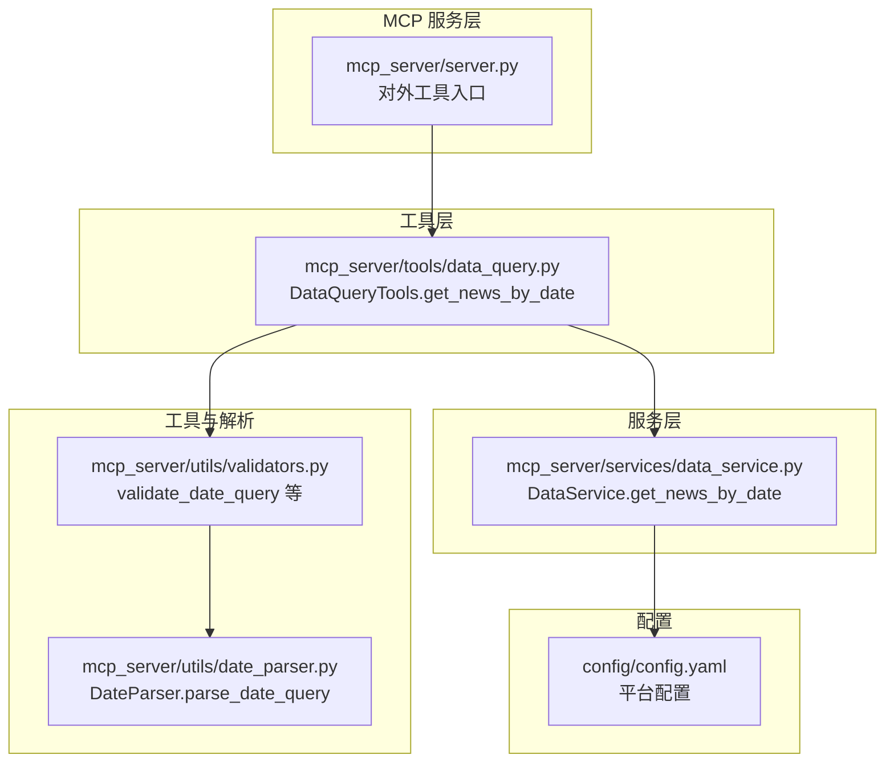
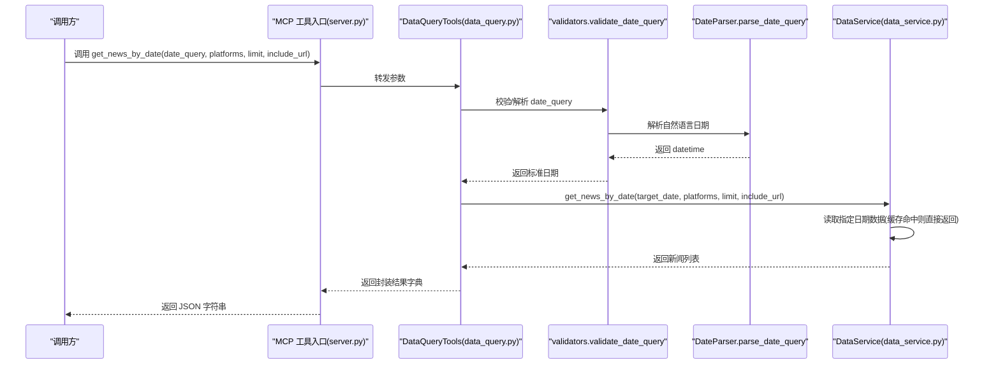
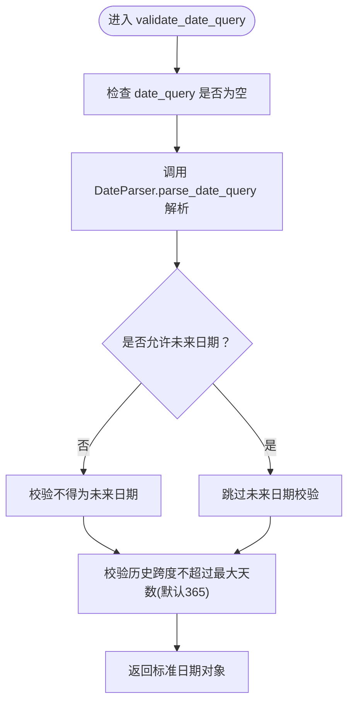
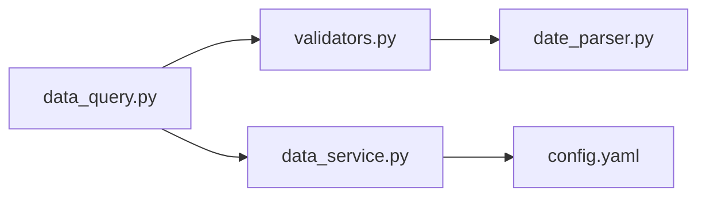

# 历史新闻查询

<cite>
**本文引用的文件**
- [mcp_server/tools/data_query.py](file://mcp_server/tools/data_query.py)
- [mcp_server/services/data_service.py](file://mcp_server/services/data_service.py)
- [mcp_server/utils/date_parser.py](file://mcp_server/utils/date_parser.py)
- [mcp_server/utils/validators.py](file://mcp_server/utils/validators.py)
- [mcp_server/server.py](file://mcp_server/server.py)
- [config/config.yaml](file://config/config.yaml)
</cite>

## 目录
1. [简介](#简介)
2. [项目结构](#项目结构)
3. [核心组件](#核心组件)
4. [架构总览](#架构总览)
5. [详细组件分析](#详细组件分析)
6. [依赖关系分析](#依赖关系分析)
7. [性能考量](#性能考量)
8. [故障排查指南](#故障排查指南)
9. [结论](#结论)
10. [附录](#附录)

## 简介
本文围绕历史新闻查询能力“按日期查询新闻”展开，重点说明 get_news_by_date 方法如何支持自然语言日期查询，涵盖 date_query 参数的格式与解析机制（相对日期、星期、绝对日期），以及 validate_date_query 如何将其解析为标准日期对象；同时解释 platforms、limit、include_url 参数的作用；梳理该方法如何调用 DataService.get_news_by_date 实现按日期检索，并返回包含目标日期、新闻总数和列表的结果字典；最后给出典型使用示例与在趋势回溯、日报生成中的应用场景。

## 项目结构
- 业务入口位于 MCP 服务层，对外暴露 get_news_by_date 工具函数，负责参数校验与结果封装。
- 工具层 DataQueryTools 将自然语言日期转换为标准日期，并委托 DataService 获取数据。
- 数据服务层 DataService 通过解析器读取指定日期的历史数据，按平台与排名排序并返回。
- 日期解析与参数校验分别由 utils/date_parser.py 与 utils/validators.py 提供支持。
- 平台配置来源于 config/config.yaml，工具层在参数校验阶段动态读取以进行平台合法性校验。

图表来源
- [mcp_server/server.py](file://mcp_server/server.py#L178-L223)
- [mcp_server/tools/data_query.py](file://mcp_server/tools/data_query.py#L211-L283)
- [mcp_server/services/data_service.py](file://mcp_server/services/data_service.py#L103-L181)
- [mcp_server/utils/validators.py](file://mcp_server/utils/validators.py#L309-L352)
- [mcp_server/utils/date_parser.py](file://mcp_server/utils/date_parser.py#L92-L249)
- [config/config.yaml](file://config/config.yaml#L164-L187)

章节来源
- [mcp_server/server.py](file://mcp_server/server.py#L178-L223)
- [mcp_server/tools/data_query.py](file://mcp_server/tools/data_query.py#L211-L283)
- [mcp_server/services/data_service.py](file://mcp_server/services/data_service.py#L103-L181)
- [mcp_server/utils/validators.py](file://mcp_server/utils/validators.py#L309-L352)
- [mcp_server/utils/date_parser.py](file://mcp_server/utils/date_parser.py#L92-L249)
- [config/config.yaml](file://config/config.yaml#L164-L187)

## 核心组件
- DataQueryTools.get_news_by_date：对外暴露的工具方法，负责：
  - 默认 date_query 为“今天”
  - 调用 validate_date_query 解析自然语言日期为标准日期
  - 调用 validate_platforms 校验平台列表（支持从 config.yaml 动态读取）
  - 调用 validate_limit 校验返回条数上限
  - 调用 DataService.get_news_by_date 获取数据
  - 统一封装返回字典，包含 news、total、date、date_query、platforms、success 等字段
- DataService.get_news_by_date：服务层实现，负责：
  - 读取指定日期的历史数据
  - 按平台与标题聚合，计算平均排名、条数等
  - 可选地包含 URL 字段
  - 按排名排序并限制返回数量
  - 使用缓存提升性能
- DateParser.parse_date_query：解析自然语言日期，支持相对日期、星期、绝对日期等多种格式
- validators.validate_date_query：对 date_query 进行统一校验（含未来日期与历史跨度限制）

章节来源
- [mcp_server/tools/data_query.py](file://mcp_server/tools/data_query.py#L211-L283)
- [mcp_server/services/data_service.py](file://mcp_server/services/data_service.py#L103-L181)
- [mcp_server/utils/date_parser.py](file://mcp_server/utils/date_parser.py#L92-L249)
- [mcp_server/utils/validators.py](file://mcp_server/utils/validators.py#L309-L352)

## 架构总览
下图展示了从 MCP 工具入口到服务层与解析层的调用链路，以及参数校验与缓存策略。

图表来源
- [mcp_server/server.py](file://mcp_server/server.py#L178-L223)
- [mcp_server/tools/data_query.py](file://mcp_server/tools/data_query.py#L211-L283)
- [mcp_server/utils/validators.py](file://mcp_server/utils/validators.py#L309-L352)
- [mcp_server/utils/date_parser.py](file://mcp_server/utils/date_parser.py#L92-L249)
- [mcp_server/services/data_service.py](file://mcp_server/services/data_service.py#L103-L181)

## 详细组件分析

### get_news_by_date 方法详解
- 输入参数
  - date_query: 可选，自然语言日期，默认“今天”。支持相对日期（如“今天”“昨天”“3天前”“yesterday”“3 days ago”）、星期（如“上周一”“本周三”“last monday”“this friday”）、绝对日期（如“2025-10-10”“10月10日”“2025年10月10日”）
  - platforms: 可选，平台ID列表，默认使用 config.yaml 中配置的所有平台；若配置加载失败则允许所有平台通过
  - limit: 可选，返回条数限制，默认50，最大1000
  - include_url: 可选，是否包含 URL 链接，默认 False（节省 token）
- 处理流程
  - 若未提供 date_query，默认使用“今天”
  - 调用 validate_date_query 解析并校验日期（禁止未来日期、限制最大历史跨度）
  - 调用 validate_platforms 校验平台列表（从 config.yaml 动态读取）
  - 调用 validate_limit 校验 limit
  - 调用 DataService.get_news_by_date 获取数据
  - 统一封装返回字典，包含 news、total、date、date_query、platforms、success 等字段
- 输出
  - 成功时返回包含新闻列表与统计信息的字典
  - 失败时返回包含 success=False 与 error 字段的字典

章节来源
- [mcp_server/tools/data_query.py](file://mcp_server/tools/data_query.py#L211-L283)
- [mcp_server/utils/validators.py](file://mcp_server/utils/validators.py#L309-L352)
- [config/config.yaml](file://config/config.yaml#L164-L187)

### validate_date_query 与 DateParser.parse_date_query 的解析机制
- 支持的 date_query 格式
  - 相对日期：中文“今天”“昨天”“前天”“3天前”，英文“today”“yesterday”“3 days ago”
  - 星期：中文“上周一”“本周三”，英文“last monday”“this friday”
  - 绝对日期：ISO 格式“YYYY-MM-DD”，中文“10月10日”“2025年10月10日”，斜杠“YYYY/MM/DD”“MM/DD”
- 解析与校验
  - validate_date_query 调用 DateParser.parse_date_query 进行解析
  - 校验不允许未来日期（默认），并限制最大历史跨度（默认365天）
  - 返回标准 datetime 对象供服务层使用

图表来源
- [mcp_server/utils/validators.py](file://mcp_server/utils/validators.py#L309-L352)
- [mcp_server/utils/date_parser.py](file://mcp_server/utils/date_parser.py#L92-L249)

章节来源
- [mcp_server/utils/validators.py](file://mcp_server/utils/validators.py#L309-L352)
- [mcp_server/utils/date_parser.py](file://mcp_server/utils/date_parser.py#L92-L249)

### DataService.get_news_by_date 的实现要点
- 读取指定日期的历史数据
- 将标题按平台聚合，计算平均排名、条数等指标
- 可选包含 URL 字段
- 按排名升序排序并限制返回数量
- 使用缓存键包含日期、平台、limit、include_url，命中则直接返回

章节来源
- [mcp_server/services/data_service.py](file://mcp_server/services/data_service.py#L103-L181)

### 参数说明
- platforms
  - 作用：限定查询的平台集合；若为 None 或空列表，则使用 config.yaml 中配置的所有平台
  - 校验：validate_platforms 会从 config.yaml 动态读取支持的平台列表并进行合法性校验
- limit
  - 作用：限制返回的新闻条数
  - 校验：validate_limit 默认 50，最大 1000
- include_url
  - 作用：是否包含 URL 链接字段（默认 False，节省 token）

章节来源
- [mcp_server/utils/validators.py](file://mcp_server/utils/validators.py#L90-L121)
- [mcp_server/utils/validators.py](file://mcp_server/utils/validators.py#L43-L88)
- [config/config.yaml](file://config/config.yaml#L164-L187)

### 返回结果结构
- 成功时返回字典包含：
  - news: 新闻列表（每条包含标题、平台、平台名、排名、平均排名、条数、日期等字段；可选包含 URL）
  - total: 新闻总数
  - date: 目标日期（YYYY-MM-DD）
  - date_query: 原始输入的日期查询字符串
  - platforms: 实际使用的平台列表
  - success: True
- 失败时返回字典包含：
  - success: False
  - error: 错误信息（包含 code 与 message）

章节来源
- [mcp_server/tools/data_query.py](file://mcp_server/tools/data_query.py#L211-L283)

### 使用示例
- 查询“前天”微博平台的20条新闻
  - date_query: “前天”
  - platforms: [“weibo”]
  - limit: 20
  - include_url: 可选，默认 False
- 典型调用路径
  - MCP 工具入口 -> DataQueryTools.get_news_by_date -> validators.validate_date_query -> DateParser.parse_date_query -> DataService.get_news_by_date -> 返回封装结果

章节来源
- [mcp_server/server.py](file://mcp_server/server.py#L178-L223)
- [mcp_server/tools/data_query.py](file://mcp_server/tools/data_query.py#L211-L283)
- [mcp_server/utils/validators.py](file://mcp_server/utils/validators.py#L309-L352)
- [mcp_server/utils/date_parser.py](file://mcp_server/utils/date_parser.py#L92-L249)
- [mcp_server/services/data_service.py](file://mcp_server/services/data_service.py#L103-L181)

### 应用场景
- 趋势回溯
  - 使用自然语言日期快速定位某一天的热搜与热点，便于对比不同日期的传播趋势
  - 结合 include_url 可直接查看原始链接，辅助溯源
- 日报生成
 "今日/昨日/前天”的数据可直接作为日报素材，结合 platforms 限定来源平台，输出结构化摘要
- 对比分析
  - 通过 date_query 指定多个日期，对比同一平台或跨平台的热点变化

[本节为概念性说明，无需列出章节来源]

## 依赖关系分析
- 工具层依赖
  - validators.validate_date_query：统一解析与校验 date_query
  - validators.validate_platforms：平台合法性校验
  - validators.validate_limit：limit 校验
  - services.data_service.DataService：数据读取与缓存
- 解析层依赖
  - utils.date_parser.DateParser：自然语言日期解析
- 配置依赖
  - config/config.yaml：平台配置，工具层动态读取

图表来源
- [mcp_server/tools/data_query.py](file://mcp_server/tools/data_query.py#L211-L283)
- [mcp_server/utils/validators.py](file://mcp_server/utils/validators.py#L309-L352)
- [mcp_server/utils/date_parser.py](file://mcp_server/utils/date_parser.py#L92-L249)
- [mcp_server/services/data_service.py](file://mcp_server/services/data_service.py#L103-L181)
- [config/config.yaml](file://config/config.yaml#L164-L187)

章节来源
- [mcp_server/tools/data_query.py](file://mcp_server/tools/data_query.py#L211-L283)
- [mcp_server/utils/validators.py](file://mcp_server/utils/validators.py#L309-L352)
- [mcp_server/utils/date_parser.py](file://mcp_server/utils/date_parser.py#L92-L249)
- [mcp_server/services/data_service.py](file://mcp_server/services/data_service.py#L103-L181)
- [config/config.yaml](file://config/config.yaml#L164-L187)

## 性能考量
- 缓存策略
  - 服务层对按日期查询结果进行缓存，键包含日期、平台、limit、include_url，命中则直接返回，减少 IO 与解析开销
- 排序与限制
  - 服务层按排名排序并限制返回数量，避免返回过多数据造成传输与渲染压力
- 参数优化
  - include_url 默认 False，减少字段体积，提高传输效率
  - limit 默认 50，最大 1000，避免一次性返回海量数据

章节来源
- [mcp_server/services/data_service.py](file://mcp_server/services/data_service.py#L103-L181)
- [mcp_server/utils/validators.py](file://mcp_server/utils/validators.py#L90-L121)

## 故障排查指南
- 常见错误与处理
  - 日期格式不支持：检查 date_query 是否符合支持格式（相对日期、星期、绝对日期）
  - 未来日期：默认不允许未来日期，如确需查询未来日期请调整 allow_future 参数（工具层默认不允许）
  - 历史跨度过大：默认最大历史跨度为 365 天，超出将被拒绝
  - 平台不支持：确认 platforms 是否在 config.yaml 的 platforms 列表中
  - limit 超限：默认最大 1000，超过将被拒绝
- 返回结构异常
  - success=False 时，检查 error 字段中的 code 与 message
  - total 为 0：可能该日期无数据或平台过滤导致为空

章节来源
- [mcp_server/utils/validators.py](file://mcp_server/utils/validators.py#L309-L352)
- [mcp_server/utils/validators.py](file://mcp_server/utils/validators.py#L43-L88)
- [mcp_server/utils/validators.py](file://mcp_server/utils/validators.py#L90-L121)
- [mcp_server/tools/data_query.py](file://mcp_server/tools/data_query.py#L211-L283)

## 结论
get_news_by_date 方法通过统一的参数校验与自然语言日期解析，实现了灵活的历史新闻查询能力。其支持相对日期、星期与绝对日期的多样化输入，配合平台过滤、数量限制与可选 URL 字段，既满足趋势回溯与日报生成等日常需求，又具备良好的性能与可维护性。建议在生产环境中合理设置 limit 与 include_url，充分利用缓存与平台配置，以获得最佳体验。

[本节为总结性内容，无需列出章节来源]

## 附录

### date_query 支持格式一览
- 相对日期：今天、昨天、前天、3天前、yesterday、3 days ago
- 星期：上周一、本周三、last monday、this friday
- 绝对日期：2025-10-10、10月10日、2025年10月10日、YYYY/MM/DD、MM/DD

章节来源
- [mcp_server/tools/data_query.py](file://mcp_server/tools/data_query.py#L218-L231)
- [mcp_server/utils/date_parser.py](file://mcp_server/utils/date_parser.py#L92-L249)