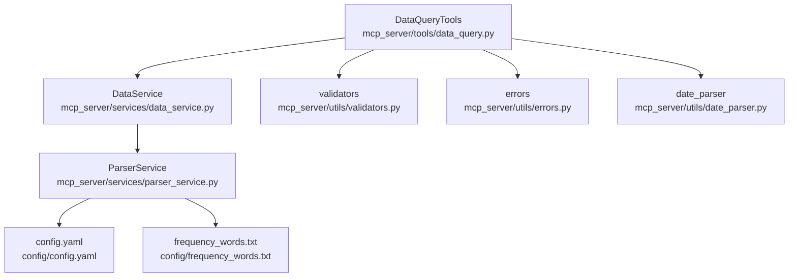
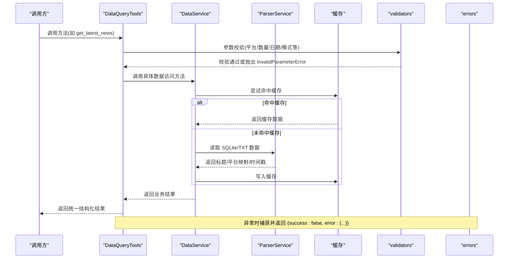
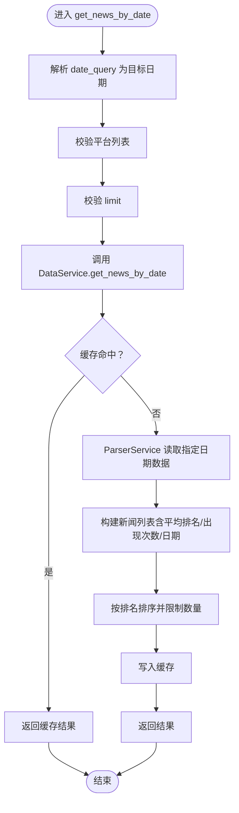
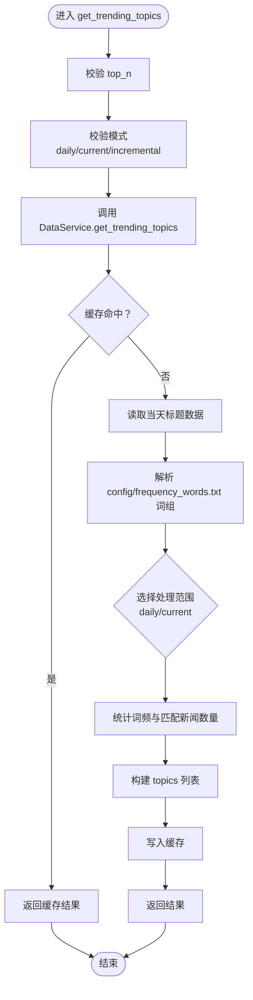
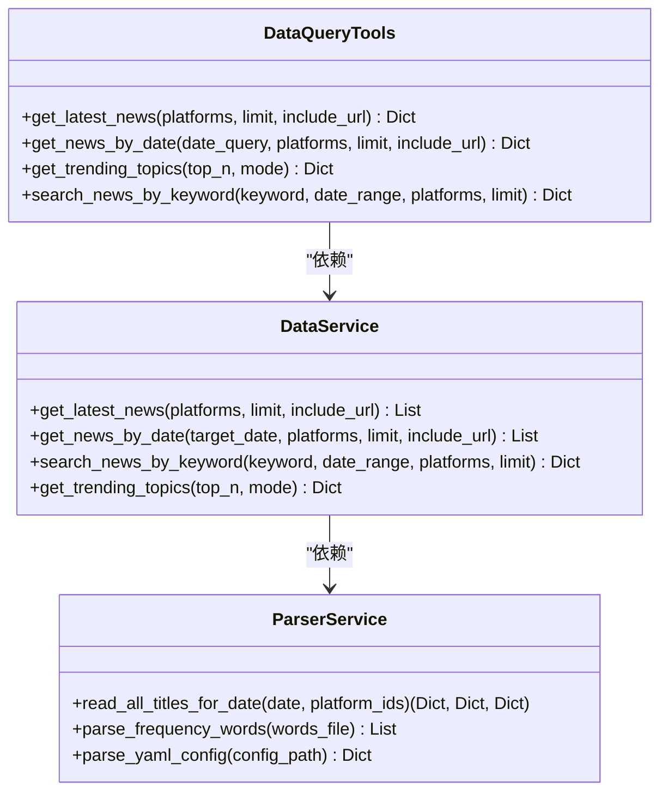
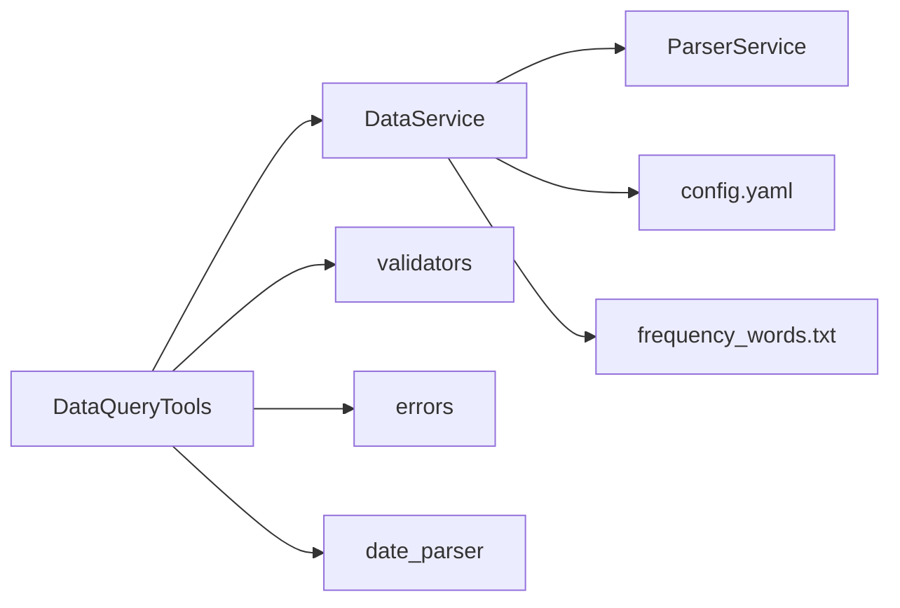

# 数据查询工具

<cite>
**本文引用的文件**
- [mcp_server/tools/data_query.py](file://mcp_server/tools/data_query.py)
- [mcp_server/services/data_service.py](file://mcp_server/services/data_service.py)
- [mcp_server/services/parser_service.py](file://mcp_server/services/parser_service.py)
- [mcp_server/utils/validators.py](file://mcp_server/utils/validators.py)
- [mcp_server/utils/errors.py](file://mcp_server/utils/errors.py)
- [mcp_server/utils/date_parser.py](file://mcp_server/utils/date_parser.py)
- [config/config.yaml](file://config/config.yaml)
- [config/frequency_words.txt](file://config/frequency_words.txt)
</cite>

## 目录
1. [简介](#简介)
2. [项目结构](#项目结构)
3. [核心组件](#核心组件)
4. [架构总览](#架构总览)
5. [详细组件分析](#详细组件分析)
6. [依赖关系分析](#依赖关系分析)
7. [性能考量](#性能考量)
8. [故障排查指南](#故障排查指南)
9. [结论](#结论)
10. [附录](#附录)

## 简介
本文档围绕 DataQueryTools 类展开，系统性说明其四大核心方法：获取最新新闻、按日期查询新闻、趋势话题统计、关键词搜索，并解释其输入参数、输出格式、使用场景与内部实现逻辑。同时阐述 DataService 如何被注入到工具类中以访问存储层数据，以及如何结合 get_news_by_date 与 get_trending_topics 分析“昨日热点趋势”。

## 项目结构
DataQueryTools 位于 mcp_server/tools/data_query.py，负责对外暴露统一的数据查询接口；DataService 位于 mcp_server/services/data_service.py，封装数据访问与缓存；ParserService 位于 mcp_server/services/parser_service.py，负责解析 SQLite/TXT 数据源；参数校验与错误类型分别由 mcp_server/utils/validators.py 与 mcp_server/utils/errors.py 提供；日期解析由 mcp_server/utils/date_parser.py 提供；配置与关键词词组分别来自 config/config.yaml 与 config/frequency_words.txt。

图表来源
- [mcp_server/tools/data_query.py](file://mcp_server/tools/data_query.py#L1-L285)
- [mcp_server/services/data_service.py](file://mcp_server/services/data_service.py#L1-L624)
- [mcp_server/services/parser_service.py](file://mcp_server/services/parser_service.py#L1-L609)
- [mcp_server/utils/validators.py](file://mcp_server/utils/validators.py#L1-L352)
- [mcp_server/utils/errors.py](file://mcp_server/utils/errors.py#L1-L94)
- [mcp_server/utils/date_parser.py](file://mcp_server/utils/date_parser.py#L1-L508)
- [config/config.yaml](file://config/config.yaml#L1-L187)
- [config/frequency_words.txt](file://config/frequency_words.txt#L1-L114)

章节来源
- [mcp_server/tools/data_query.py](file://mcp_server/tools/data_query.py#L1-L285)
- [mcp_server/services/data_service.py](file://mcp_server/services/data_service.py#L1-L624)
- [mcp_server/services/parser_service.py](file://mcp_server/services/parser_service.py#L1-L609)
- [mcp_server/utils/validators.py](file://mcp_server/utils/validators.py#L1-L352)
- [mcp_server/utils/errors.py](file://mcp_server/utils/errors.py#L1-L94)
- [mcp_server/utils/date_parser.py](file://mcp_server/utils/date_parser.py#L1-L508)
- [config/config.yaml](file://config/config.yaml#L1-L187)
- [config/frequency_words.txt](file://config/frequency_words.txt#L1-L114)

## 核心组件
- DataQueryTools：对外提供四个查询方法，统一参数校验、调用 DataService 并返回标准化结果。
- DataService：封装数据访问逻辑，负责缓存、解析与聚合，提供最新新闻、按日期查询、关键词搜索、趋势话题统计等能力。
- ParserService：抽象数据源读取（SQLite/TXT），提供标题数据、平台映射、时间戳等。
- validators：提供平台、数量、日期范围、关键词、模式、日期查询等参数校验。
- errors：统一错误类型，便于工具层捕获并返回结构化错误。
- date_parser：解析自然语言日期，支持相对/绝对/星期/多格式。
- 配置与词组：config.yaml 提供平台与权重等配置；frequency_words.txt 提供关注词组。

章节来源
- [mcp_server/tools/data_query.py](file://mcp_server/tools/data_query.py#L22-L285)
- [mcp_server/services/data_service.py](file://mcp_server/services/data_service.py#L17-L624)
- [mcp_server/services/parser_service.py](file://mcp_server/services/parser_service.py#L1-L609)
- [mcp_server/utils/validators.py](file://mcp_server/utils/validators.py#L1-L352)
- [mcp_server/utils/errors.py](file://mcp_server/utils/errors.py#L1-L94)
- [mcp_server/utils/date_parser.py](file://mcp_server/utils/date_parser.py#L1-L508)
- [config/config.yaml](file://config/config.yaml#L160-L187)
- [config/frequency_words.txt](file://config/frequency_words.txt#L1-L114)

## 架构总览
DataQueryTools 作为门面，将外部请求转交给 DataService；DataService 再委托 ParserService 读取数据源，并通过缓存服务提升性能；validators 在入口处统一校验参数，errors 统一错误返回格式；date_parser 专门处理日期解析与校验。

图表来源
- [mcp_server/tools/data_query.py](file://mcp_server/tools/data_query.py#L34-L283)
- [mcp_server/services/data_service.py](file://mcp_server/services/data_service.py#L30-L182)
- [mcp_server/services/parser_service.py](file://mcp_server/services/parser_service.py#L461-L514)
- [mcp_server/utils/validators.py](file://mcp_server/utils/validators.py#L90-L351)
- [mcp_server/utils/errors.py](file://mcp_server/utils/errors.py#L10-L94)

## 详细组件分析

### DataQueryTools 类与四大方法

#### get_latest_news（获取最新新闻）
- 输入参数
  - platforms: 平台ID列表（可选），默认使用配置中的平台列表
  - limit: 返回条数限制（可选，默认50）
  - include_url: 是否包含URL链接（可选，默认False）
- 输出格式
  - 成功：包含 news 列表、total、platforms、success 字段
  - 失败：包含 success: false 与 error 字段（结构化错误）
- 使用场景
  - 快速查看今日最新榜单，支持按平台过滤与限制数量
- 内部实现要点
  - 参数校验：平台列表与数量限制
  - 调用 DataService.get_latest_news，内部读取当天最新文件时间，按排名排序并限制数量
  - 结果包装：追加 success 字段与基础统计字段
- 错误处理
  - 参数错误：InvalidParameterError
  - 其他异常：INTERNAL_ERROR

章节来源
- [mcp_server/tools/data_query.py](file://mcp_server/tools/data_query.py#L34-L89)
- [mcp_server/services/data_service.py](file://mcp_server/services/data_service.py#L30-L103)
- [mcp_server/utils/validators.py](file://mcp_server/utils/validators.py#L43-L88)
- [mcp_server/utils/validators.py](file://mcp_server/utils/validators.py#L90-L121)
- [mcp_server/utils/errors.py](file://mcp_server/utils/errors.py#L41-L50)

#### get_news_by_date（按日期查询新闻）
- 输入参数
  - date_query: 日期查询字符串（可选，默认“今天”），支持相对日期、星期、绝对日期
  - platforms: 平台ID列表（可选）
  - limit: 返回条数限制（可选，默认50）
  - include_url: 是否包含URL链接（可选，默认False）
- 输出格式
  - 成功：包含 news 列表、total、date、date_query、platforms、success 字段
  - 失败：包含 success: false 与 error 字段
- 使用场景
  - 查询某一天的历史新闻，支持自然语言日期
- 内部实现要点
  - 参数校验：默认“今天”，日期查询解析与校验，平台与数量限制
  - 调用 DataService.get_news_by_date，内部按日期读取数据，计算平均排名与出现次数
  - 结果包装：追加 success 字段与基础统计字段
- 错误处理
  - 参数错误：InvalidParameterError
  - 其他异常：INTERNAL_ERROR

章节来源
- [mcp_server/tools/data_query.py](file://mcp_server/tools/data_query.py#L211-L283)
- [mcp_server/utils/validators.py](file://mcp_server/utils/validators.py#L309-L351)
- [mcp_server/utils/date_parser.py](file://mcp_server/utils/date_parser.py#L92-L248)
- [mcp_server/services/data_service.py](file://mcp_server/services/data_service.py#L104-L182)

#### get_trending_topics（趋势话题统计）
- 输入参数
  - top_n: 返回TOP N关注词（可选，默认10）
  - mode: 模式 - daily（当日累计）、current（最新一批）、incremental（增量）（可选，默认current）
- 输出格式
  - 成功：包含 topics 列表、generated_at、mode、total_keywords、description、success 字段
  - 失败：包含 success: false 与 error 字段
- 使用场景
  - 基于 config/frequency_words.txt 中的个人关注词列表进行统计，帮助追踪关注领域的热点变化
- 内部实现要点
  - 参数校验：top_n 与模式校验
  - 调用 DataService.get_trending_topics，内部读取当天数据，解析词组，按模式选择处理范围（daily/current），统计词频并返回去重后的新闻数量
  - 结果包装：追加 success 字段
- 错误处理
  - 参数错误：InvalidParameterError
  - 数据不存在：DataNotFoundError
  - 其他异常：INTERNAL_ERROR

章节来源
- [mcp_server/tools/data_query.py](file://mcp_server/tools/data_query.py#L154-L209)
- [mcp_server/utils/validators.py](file://mcp_server/utils/validators.py#L245-L289)
- [mcp_server/services/data_service.py](file://mcp_server/services/data_service.py#L285-L401)
- [config/frequency_words.txt](file://config/frequency_words.txt#L1-L114)

#### search_news_by_keyword（关键词搜索）
- 输入参数
  - keyword: 搜索关键词（必需）
  - date_range: 日期范围（可选），格式 {"start": "YYYY-MM-DD", "end": "YYYY-MM-DD"}
  - platforms: 平台过滤列表（可选）
  - limit: 返回条数限制（可选，默认返回全部）
- 输出格式
  - 成功：包含 results、total、total_found、statistics（平台分布、平均排名、关键词）、success 字段
  - 失败：包含 success: false 与 error 字段
- 使用场景
  - 在指定日期范围内检索包含关键词的新闻，支持平台过滤与数量限制
- 内部实现要点
  - 参数校验：关键词、日期范围、平台、数量限制
  - 调用 DataService.search_news_by_keyword，内部遍历日期范围，逐日读取标题，匹配关键词，统计平台分布与平均排名
  - 结果包装：追加 success 字段
- 错误处理
  - 参数错误：InvalidParameterError
  - 数据不存在：DataNotFoundError
  - 其他异常：INTERNAL_ERROR

章节来源
- [mcp_server/tools/data_query.py](file://mcp_server/tools/data_query.py#L90-L153)
- [mcp_server/utils/validators.py](file://mcp_server/utils/validators.py#L145-L243)
- [mcp_server/services/data_service.py](file://mcp_server/services/data_service.py#L184-L284)

### 方法调用流程图（以 get_news_by_date 为例）

图表来源
- [mcp_server/tools/data_query.py](file://mcp_server/tools/data_query.py#L211-L283)
- [mcp_server/services/data_service.py](file://mcp_server/services/data_service.py#L104-L182)
- [mcp_server/services/parser_service.py](file://mcp_server/services/parser_service.py#L461-L514)

### 趋势话题统计流程图（get_trending_topics）

图表来源
- [mcp_server/tools/data_query.py](file://mcp_server/tools/data_query.py#L154-L209)
- [mcp_server/services/data_service.py](file://mcp_server/services/data_service.py#L285-L401)
- [config/frequency_words.txt](file://config/frequency_words.txt#L1-L114)

### 关键类关系图

图表来源
- [mcp_server/tools/data_query.py](file://mcp_server/tools/data_query.py#L22-L285)
- [mcp_server/services/data_service.py](file://mcp_server/services/data_service.py#L17-L624)
- [mcp_server/services/parser_service.py](file://mcp_server/services/parser_service.py#L1-L609)

## 依赖关系分析
- 组件耦合
  - DataQueryTools 仅依赖 DataService 的公共接口，耦合度低，便于扩展与测试
  - DataService 依赖 ParserService 与缓存服务，承担数据聚合与缓存策略
  - validators 与 errors 为横切关注点，被工具层与服务层复用
- 外部依赖
  - 配置与词组文件 config.yaml 与 frequency_words.txt 影响行为（平台列表、权重、关注词）
  - 日期解析依赖 date_parser，支持多语言与多格式
- 潜在循环依赖
  - 未发现循环依赖，模块职责清晰

图表来源
- [mcp_server/tools/data_query.py](file://mcp_server/tools/data_query.py#L1-L285)
- [mcp_server/services/data_service.py](file://mcp_server/services/data_service.py#L1-L624)
- [mcp_server/services/parser_service.py](file://mcp_server/services/parser_service.py#L1-L609)
- [mcp_server/utils/validators.py](file://mcp_server/utils/validators.py#L1-L352)
- [mcp_server/utils/errors.py](file://mcp_server/utils/errors.py#L1-L94)
- [mcp_server/utils/date_parser.py](file://mcp_server/utils/date_parser.py#L1-L508)
- [config/config.yaml](file://config/config.yaml#L160-L187)
- [config/frequency_words.txt](file://config/frequency_words.txt#L1-L114)

章节来源
- [mcp_server/tools/data_query.py](file://mcp_server/tools/data_query.py#L1-L285)
- [mcp_server/services/data_service.py](file://mcp_server/services/data_service.py#L1-L624)
- [mcp_server/services/parser_service.py](file://mcp_server/services/parser_service.py#L1-L609)
- [mcp_server/utils/validators.py](file://mcp_server/utils/validators.py#L1-L352)
- [mcp_server/utils/errors.py](file://mcp_server/utils/errors.py#L1-L94)
- [mcp_server/utils/date_parser.py](file://mcp_server/utils/date_parser.py#L1-L508)
- [config/config.yaml](file://config/config.yaml#L160-L187)
- [config/frequency_words.txt](file://config/frequency_words.txt#L1-L114)

## 性能考量
- 缓存策略
  - 服务层广泛使用缓存，针对不同场景设置 TTL：最新数据（15分钟）、历史数据（1小时）、趋势统计（30分钟）、配置（1小时）
  - 读取顺序优先 SQLite，其次 TXT，减少 IO 开销
- 排序与限制
  - 按排名排序并限制数量，避免返回过多数据
- 日期范围扫描
  - 关键词搜索按日期范围逐日扫描，注意 limit 与日期跨度对性能的影响
- URL 字段按需加载
  - include_url 默认关闭，节省 token 与传输开销

章节来源
- [mcp_server/services/data_service.py](file://mcp_server/services/data_service.py#L50-L103)
- [mcp_server/services/data_service.py](file://mcp_server/services/data_service.py#L134-L182)
- [mcp_server/services/data_service.py](file://mcp_server/services/data_service.py#L184-L284)
- [mcp_server/services/data_service.py](file://mcp_server/services/data_service.py#L285-L401)
- [mcp_server/services/parser_service.py](file://mcp_server/services/parser_service.py#L461-L514)

## 故障排查指南
- 常见错误类型
  - 参数无效：InvalidParameterError（平台不支持、limit 超限、日期格式错误、关键词非法等）
  - 数据不存在：DataNotFoundError（未找到关键词匹配或日期范围无数据）
  - 内部错误：INTERNAL_ERROR（未捕获的异常）
- 排查步骤
  - 检查 date_range 是否包含 start/end，且 start ≤ end，且日期不晚于当前日期
  - 检查 platforms 是否在 config.yaml 的 platforms 列表中
  - 检查 keyword 长度与空白字符
  - 检查 date_query 是否可被 date_parser 正确解析
  - 确认 output 目录存在对应日期文件夹与数据文件
- 建议
  - 使用 limit 控制返回量
  - 在高频查询场景开启 include_url 前评估 token 与网络成本

章节来源
- [mcp_server/utils/validators.py](file://mcp_server/utils/validators.py#L145-L243)
- [mcp_server/utils/validators.py](file://mcp_server/utils/validators.py#L245-L351)
- [mcp_server/utils/errors.py](file://mcp_server/utils/errors.py#L30-L94)
- [mcp_server/services/parser_service.py](file://mcp_server/services/parser_service.py#L461-L514)

## 结论
DataQueryTools 通过统一的参数校验与结果包装，为上层提供了稳定易用的数据查询接口；DataService 以缓存与解析服务为核心，兼顾性能与可维护性；validators 与 errors 提供一致的错误处理体验；配合 config 与 frequency_words.txt，实现了灵活的平台与关注词配置。结合 get_news_by_date 与 get_trending_topics，可高效完成“昨日热点趋势”分析等常见任务。

## 附录

### 使用示例：分析“昨日热点趋势”
- 步骤
  1) 使用 get_news_by_date(date_query="昨天", platforms=[...], limit=N) 获取“昨日”新闻列表
  2) 使用 get_trending_topics(top_n=M, mode="daily" 或 "current") 获取关注词的统计
  3) 对比“昨日”新闻中出现的关注词与其趋势，形成“昨日热点趋势”报告
- 注意事项
  - 若 mode="daily"，统计当日累计；若 mode="current"，统计最新一批数据
  - platforms 与 limit 可按需调整，平衡覆盖面与性能

章节来源
- [mcp_server/tools/data_query.py](file://mcp_server/tools/data_query.py#L211-L283)
- [mcp_server/tools/data_query.py](file://mcp_server/tools/data_query.py#L154-L209)
- [mcp_server/utils/date_parser.py](file://mcp_server/utils/date_parser.py#L92-L248)