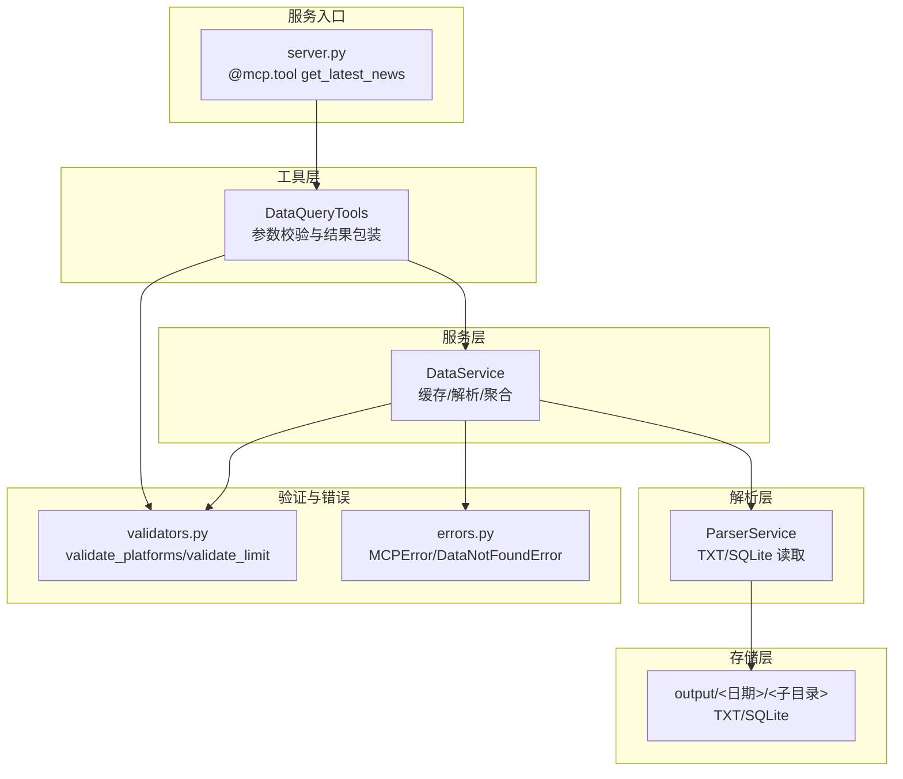
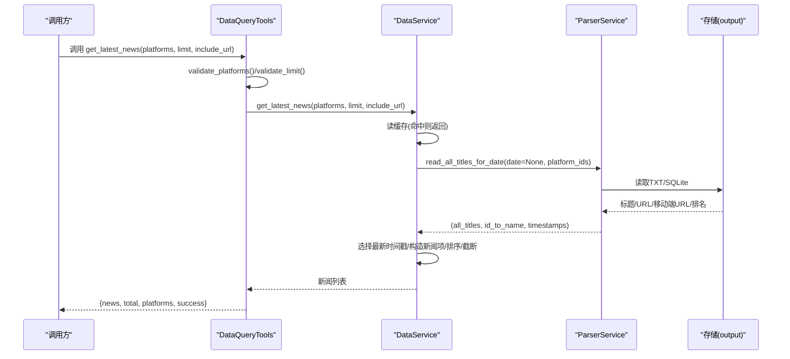
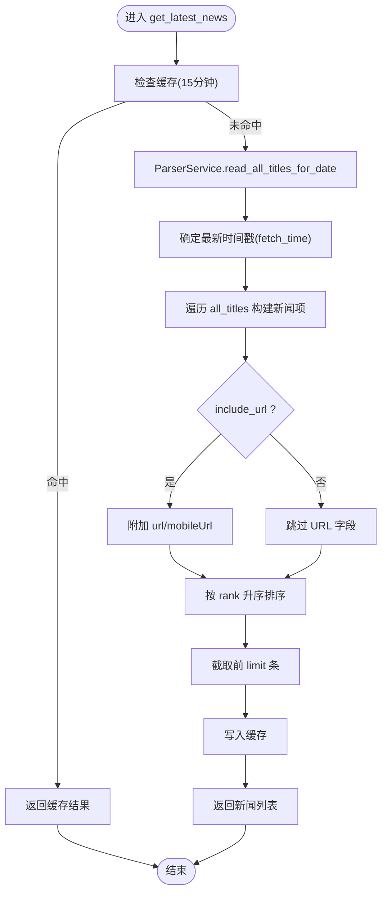
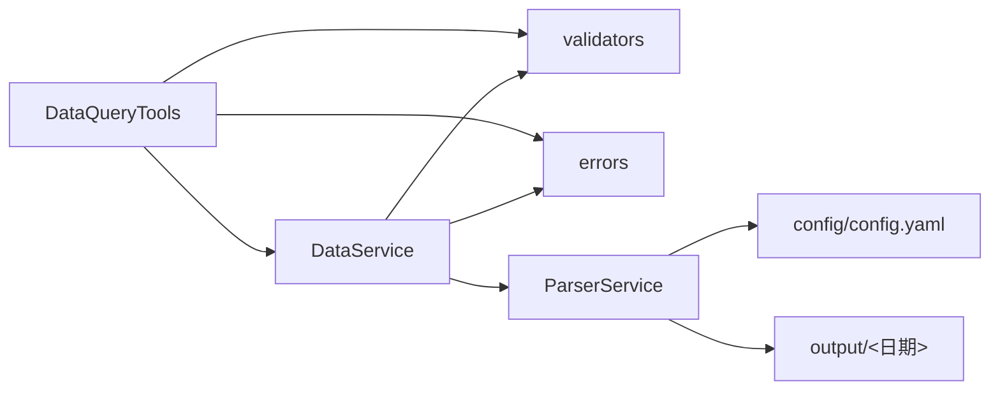

# 最新新闻查询

<cite>
**本文引用的文件**
- [mcp_server/tools/data_query.py](file://mcp_server/tools/data_query.py)
- [mcp_server/services/data_service.py](file://mcp_server/services/data_service.py)
- [mcp_server/services/parser_service.py](file://mcp_server/services/parser_service.py)
- [mcp_server/utils/validators.py](file://mcp_server/utils/validators.py)
- [mcp_server/utils/errors.py](file://mcp_server/utils/errors.py)
- [mcp_server/server.py](file://mcp_server/server.py)
- [config/config.yaml](file://config/config.yaml)
</cite>

## 目录
1. [简介](#简介)
2. [项目结构](#项目结构)
3. [核心组件](#核心组件)
4. [架构总览](#架构总览)
5. [详细组件分析](#详细组件分析)
6. [依赖关系分析](#依赖关系分析)
7. [性能考量](#性能考量)
8. [故障排查指南](#故障排查指南)
9. [结论](#结论)
10. [附录](#附录)

## 简介
本文件围绕 get_latest_news 方法进行深入文档化，重点说明其用于获取“最新一批爬取的新闻数据”的能力。文档覆盖参数语义（platforms、limit、include_url）、内部数据流（通过 DataService 从存储层读取）、返回结构（新闻列表、总数、平台信息）、验证逻辑（validate_platforms、validate_limit）、错误处理（MCPError 捕获）以及典型使用场景（如 AI 客户端获取当前榜单）。

## 项目结构
- 工具层：对外暴露 get_latest_news 的 DataQueryTools 类，负责参数校验与结果包装。
- 服务层：DataService 负责缓存、解析与数据聚合，调用 ParserService 读取存储层数据。
- 解析层：ParserService 从 TXT/SQLite 存储中读取标题、URL、移动端 URL、排名等元信息。
- 验证与错误：validators 提供参数校验；errors 定义统一错误类型。
- 服务入口：server.py 提供 MCP 工具接口，封装 get_latest_news 的参数与返回。

图表来源
- [mcp_server/server.py](file://mcp_server/server.py#L114-L150)
- [mcp_server/tools/data_query.py](file://mcp_server/tools/data_query.py#L33-L87)
- [mcp_server/services/data_service.py](file://mcp_server/services/data_service.py#L29-L101)
- [mcp_server/services/parser_service.py](file://mcp_server/services/parser_service.py#L241-L323)
- [mcp_server/utils/validators.py](file://mcp_server/utils/validators.py#L43-L121)
- [mcp_server/utils/errors.py](file://mcp_server/utils/errors.py#L10-L94)

章节来源
- [mcp_server/server.py](file://mcp_server/server.py#L114-L150)
- [mcp_server/tools/data_query.py](file://mcp_server/tools/data_query.py#L33-L87)
- [mcp_server/services/data_service.py](file://mcp_server/services/data_service.py#L29-L101)
- [mcp_server/services/parser_service.py](file://mcp_server/services/parser_service.py#L241-L323)
- [mcp_server/utils/validators.py](file://mcp_server/utils/validators.py#L43-L121)
- [mcp_server/utils/errors.py](file://mcp_server/utils/errors.py#L10-L94)

## 核心组件
- DataQueryTools.get_latest_news：对外 API，负责参数校验、调用 DataService、组装返回结构。
- DataService.get_latest_news：核心业务逻辑，含缓存、解析、排序、截断与 URL 字段条件性添加。
- ParserService：从 TXT/SQLite 读取标题、URL、移动端 URL、排名等，聚合为统一结构。
- validators：validate_platforms、validate_limit 提供参数合法性校验。
- errors：MCPError 及其子类，统一错误表达。
- server.py：MCP 工具入口，将 DataQueryTools 的结果序列化为 JSON。

章节来源
- [mcp_server/tools/data_query.py](file://mcp_server/tools/data_query.py#L33-L87)
- [mcp_server/services/data_service.py](file://mcp_server/services/data_service.py#L29-L101)
- [mcp_server/services/parser_service.py](file://mcp_server/services/parser_service.py#L241-L323)
- [mcp_server/utils/validators.py](file://mcp_server/utils/validators.py#L43-L121)
- [mcp_server/utils/errors.py](file://mcp_server/utils/errors.py#L10-L94)
- [mcp_server/server.py](file://mcp_server/server.py#L114-L150)

## 架构总览
get_latest_news 的调用链路如下：
- 外部调用（MCP 工具）→ DataQueryTools.get_latest_news → DataService.get_latest_news → ParserService.read_all_titles_for_date → 存储层（TXT/SQLite）→ 返回新闻列表。

图表来源
- [mcp_server/server.py](file://mcp_server/server.py#L114-L150)
- [mcp_server/tools/data_query.py](file://mcp_server/tools/data_query.py#L33-L87)
- [mcp_server/services/data_service.py](file://mcp_server/services/data_service.py#L29-L101)
- [mcp_server/services/parser_service.py](file://mcp_server/services/parser_service.py#L241-L323)

## 详细组件分析

### 参数与默认值说明
- platforms
  - 类型：可选列表（字符串数组），如 ["zhihu", "weibo"]。
  - 语义：平台过滤列表；None 表示使用配置文件中声明的所有平台。
  - 默认行为：当 platforms 为 None 或空列表时，使用 config.yaml 中的 platforms 列表。
  - 支持平台：由 config/config.yaml 的 platforms.id 列表决定。
- limit
  - 类型：可选整数，默认值为 50（工具层默认 20，但服务层默认 50）。
  - 语义：返回条数上限；服务层会对 limit 进行校验，最大值为 1000。
- include_url
  - 类型：布尔，默认 False。
  - 语义：是否包含 URL 与移动端 URL 字段；开启会增加 token 消耗。

章节来源
- [mcp_server/server.py](file://mcp_server/server.py#L114-L150)
- [mcp_server/tools/data_query.py](file://mcp_server/tools/data_query.py#L33-L87)
- [mcp_server/services/data_service.py](file://mcp_server/services/data_service.py#L29-L101)
- [mcp_server/utils/validators.py](file://mcp_server/utils/validators.py#L90-L121)
- [config/config.yaml](file://config/config.yaml#L163-L187)

### 内部数据流与处理逻辑
- 缓存：以 platforms、limit、include_url 为键，缓存 15 分钟；命中直接返回。
- 解析：调用 ParserService.read_all_titles_for_date(date=None, platform_ids)，读取“今天”的所有 TXT/SQLite 数据。
- 时间戳：若存在多个文件，取最新时间戳作为“抓取时间”，否则使用当前时间。
- 结构转换：遍历 all_titles，为每个标题构建新闻项，包含 title、platform、platform_name、rank、timestamp。
- URL 字段：当 include_url=True 时，附加 url 与 mobileUrl。
- 排序与截断：按 rank 升序排序，再截取前 limit 条。
- 返回：服务层返回新闻列表；工具层包装为 {news, total, platforms, success}。

图表来源
- [mcp_server/services/data_service.py](file://mcp_server/services/data_service.py#L29-L101)
- [mcp_server/services/parser_service.py](file://mcp_server/services/parser_service.py#L241-L323)

章节来源
- [mcp_server/services/data_service.py](file://mcp_server/services/data_service.py#L29-L101)
- [mcp_server/services/parser_service.py](file://mcp_server/services/parser_service.py#L241-L323)

### 验证逻辑
- validate_platforms
  - 若 platforms 为 None 或空列表：使用 config.yaml 中的 platforms.id 列表。
  - 若配置加载失败：降级为允许所有平台（打印警告）。
  - 若提供非法平台：抛出 InvalidParameterError。
- validate_limit
  - 若 limit 为 None：使用默认值（服务层默认 50，工具层默认 20）。
  - 若 limit ≤ 0 或 > 1000：抛出 InvalidParameterError。
- 日期范围相关：虽然本方法不涉及日期范围，但同模块的其他方法使用 validate_date_range 等工具，保证日期查询一致性。

章节来源
- [mcp_server/utils/validators.py](file://mcp_server/utils/validators.py#L43-L121)
- [config/config.yaml](file://config/config.yaml#L163-L187)

### 错误处理机制
- MCPError 捕获：DataQueryTools.get_latest_news 捕获 MCPError，返回 {success: false, error: {...}}。
- 其他异常：捕获 Exception，返回 {success: false, error: {code: "INTERNAL_ERROR", message: ...}}。
- DataNotFoundError：DataService 在无数据时抛出，工具层捕获并返回标准错误结构。

章节来源
- [mcp_server/tools/data_query.py](file://mcp_server/tools/data_query.py#L75-L87)
- [mcp_server/utils/errors.py](file://mcp_server/utils/errors.py#L10-L94)

### 返回结构说明
- 服务层返回：List[Dict]，每条新闻包含 title、platform、platform_name、rank、timestamp；当 include_url=True 时包含 url、mobileUrl。
- 工具层包装：返回 {news, total, platforms, success}，其中 total 为 news 的长度，success 为布尔值。

章节来源
- [mcp_server/services/data_service.py](file://mcp_server/services/data_service.py#L29-L101)
- [mcp_server/tools/data_query.py](file://mcp_server/tools/data_query.py#L68-L74)

### 实际使用示例
- 查询知乎平台最新的 10 条新闻
  - 调用 DataQueryTools.get_latest_news(platforms=["zhihu"], limit=10)
  - 返回结构包含 news（10 条）、total=10、platforms=["zhihu"]、success=True
- 开启 URL 字段
  - 调用 include_url=True，返回项将包含 url、mobileUrl
- 实时监控场景
  - AI 客户端在“当前榜单”场景下频繁调用，利用 15 分钟缓存减少延迟与负载

章节来源
- [mcp_server/tools/data_query.py](file://mcp_server/tools/data_query.py#L33-L87)
- [mcp_server/server.py](file://mcp_server/server.py#L114-L150)

## 依赖关系分析
- 组件耦合
  - DataQueryTools 依赖 DataService、validators、errors。
  - DataService 依赖 ParserService、validators、errors、cache。
  - ParserService 依赖存储层（TXT/SQLite）与配置。
- 外部依赖
  - config/config.yaml 提供平台清单与全局配置。
  - 输出目录 output 下的 TXT/SQLite 文件为数据源。

图表来源
- [mcp_server/tools/data_query.py](file://mcp_server/tools/data_query.py#L33-L87)
- [mcp_server/services/data_service.py](file://mcp_server/services/data_service.py#L29-L101)
- [mcp_server/services/parser_service.py](file://mcp_server/services/parser_service.py#L241-L323)
- [config/config.yaml](file://config/config.yaml#L163-L187)

章节来源
- [mcp_server/tools/data_query.py](file://mcp_server/tools/data_query.py#L33-L87)
- [mcp_server/services/data_service.py](file://mcp_server/services/data_service.py#L29-L101)
- [mcp_server/services/parser_service.py](file://mcp_server/services/parser_service.py#L241-L323)
- [config/config.yaml](file://config/config.yaml#L163-L187)

## 性能考量
- 缓存策略：15 分钟 TTL，适合高频查询的实时场景，降低解析与 IO 压力。
- 排序与截断：按 rank 排序后截断，时间复杂度 O(n log n + k)，其中 n 为候选新闻数，k 为 limit。
- URL 字段：默认关闭，避免额外字段带来的 token 与传输成本；仅在需要时开启。
- 存储读取：ParserService 从 TXT/SQLite 读取，建议确保输出目录结构规范与文件命名一致。

[本节为通用性能讨论，无需列出具体文件来源]

## 故障排查指南
- 参数错误
  - platforms 包含不受支持的平台：检查 config/config.yaml 的 platforms.id 列表。
  - limit 非法（≤0 或 >1000）：调整 limit 值。
- 数据不存在
  - 服务层抛出 DataNotFoundError：确认爬虫已运行并生成数据，或检查日期范围。
- 工具层返回错误
  - MCPError：根据返回的 error.code 与 message 定位问题。
  - INTERNAL_ERROR：查看服务端日志定位异常。

章节来源
- [mcp_server/utils/validators.py](file://mcp_server/utils/validators.py#L43-L121)
- [mcp_server/utils/errors.py](file://mcp_server/utils/errors.py#L10-L94)
- [mcp_server/tools/data_query.py](file://mcp_server/tools/data_query.py#L75-L87)

## 结论
get_latest_news 提供了面向实时监控与 AI 客户端的高效新闻查询能力。通过参数校验、缓存、解析与排序，能够在低延迟下返回当前榜单的新闻列表。合理使用 include_url 与 limit 可在准确性与性能之间取得平衡。建议在高频场景下结合缓存策略与平台过滤，以获得最佳体验。

[本节为总结性内容，无需列出具体文件来源]

## 附录

### 参数与默认值速览
- platforms：可选列表；默认使用 config.yaml 中的 platforms.id。
- limit：可选整数；默认 50（服务层），工具层默认 20；最大 1000。
- include_url：布尔，默认 False。

章节来源
- [mcp_server/server.py](file://mcp_server/server.py#L114-L150)
- [mcp_server/tools/data_query.py](file://mcp_server/tools/data_query.py#L33-L87)
- [mcp_server/services/data_service.py](file://mcp_server/services/data_service.py#L29-L101)
- [mcp_server/utils/validators.py](file://mcp_server/utils/validators.py#L90-L121)
- [config/config.yaml](file://config/config.yaml#L163-L187)