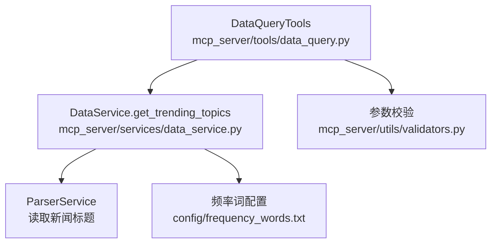
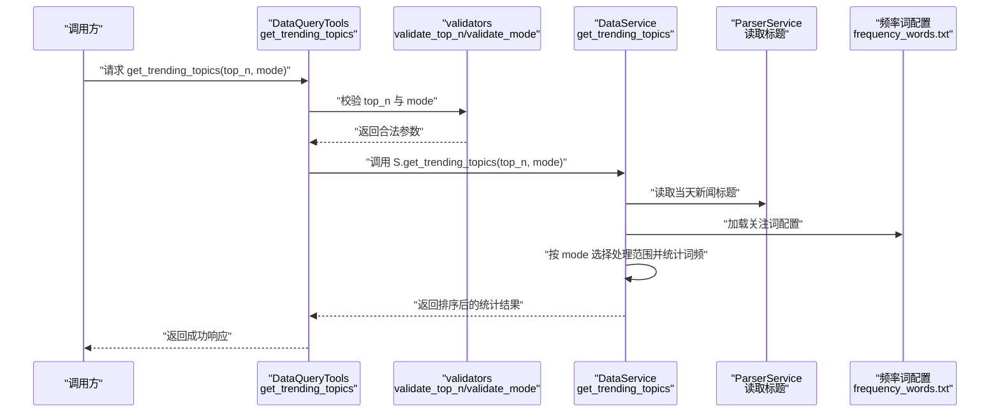
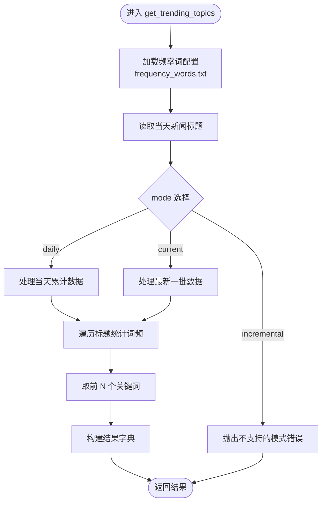
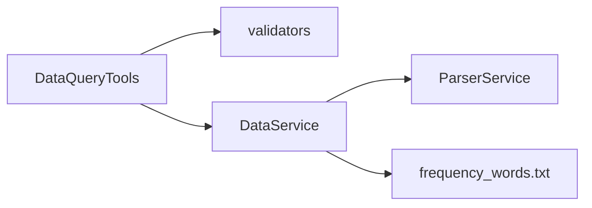

# 趋势话题统计

<cite>
**本文引用的文件**
- [mcp_server/tools/data_query.py](file://mcp_server/tools/data_query.py)
- [mcp_server/services/data_service.py](file://mcp_server/services/data_service.py)
- [mcp_server/utils/validators.py](file://mcp_server/utils/validators.py)
- [config/frequency_words.txt](file://config/frequency_words.txt)
- [README.md](file://README.md)
</cite>

## 目录
1. [简介](#简介)
2. [项目结构](#项目结构)
3. [核心组件](#核心组件)
4. [架构概览](#架构概览)
5. [详细组件分析](#详细组件分析)
6. [依赖关系分析](#依赖关系分析)
7. [性能考量](#性能考量)
8. [故障排查指南](#故障排查指南)
9. [结论](#结论)
10. [附录](#附录)

## 简介
本文件面向使用 TrendRadar 的用户与开发者，系统化阐述 get_trending_topics 方法的工作原理与使用方式。该方法基于用户自定义的 config/frequency_words.txt 文件，统计个人关注词在新闻标题中的出现频率，返回排序后的统计结果。文档明确 top_n（返回前N个关注词，默认10）与 mode（统计模式：daily 当日累计、current 最新一批、incremental 增量）参数的含义与影响，并给出使用示例与最佳实践。

## 项目结构
围绕 get_trending_topics 的关键文件与职责如下：
- mcp_server/tools/data_query.py：对外暴露的工具入口，负责参数校验与调用 DataService 的 get_trending_topics。
- mcp_server/services/data_service.py：核心数据服务，实现 get_trending_topics 的具体统计逻辑，读取新闻标题、加载关注词配置、按模式处理数据并返回统计结果。
- mcp_server/utils/validators.py：参数校验工具，提供 validate_top_n、validate_mode 等校验函数。
- config/frequency_words.txt：用户自定义的关注词配置文件，决定统计的关键词集合。
- README.md：项目文档，包含关键词配置语法、模式说明与使用建议。

图表来源
- [mcp_server/tools/data_query.py](file://mcp_server/tools/data_query.py#L154-L209)
- [mcp_server/services/data_service.py](file://mcp_server/services/data_service.py#L285-L401)
- [mcp_server/utils/validators.py](file://mcp_server/utils/validators.py#L245-L289)
- [config/frequency_words.txt](file://config/frequency_words.txt#L1-L114)

章节来源
- [mcp_server/tools/data_query.py](file://mcp_server/tools/data_query.py#L154-L209)
- [mcp_server/services/data_service.py](file://mcp_server/services/data_service.py#L285-L401)
- [mcp_server/utils/validators.py](file://mcp_server/utils/validators.py#L245-L289)
- [config/frequency_words.txt](file://config/frequency_words.txt#L1-L114)

## 核心组件
- DataQueryTools.get_trending_topics：对外 API，负责接收 top_n 与 mode 参数，调用参数校验器进行校验，再委托 DataService 执行统计。
- DataService.get_trending_topics：核心统计逻辑，读取当天新闻标题，加载频率词配置，按 mode 选择处理范围，统计词频并返回排序结果。
- 参数校验器 validate_top_n、validate_mode：确保 top_n 合法（默认10，上限100），mode 合法（支持 daily、current、incremental）。
- 频率词配置文件 frequency_words.txt：用户自定义关注词列表，决定统计的关键词集合。

章节来源
- [mcp_server/tools/data_query.py](file://mcp_server/tools/data_query.py#L154-L209)
- [mcp_server/services/data_service.py](file://mcp_server/services/data_service.py#L285-L401)
- [mcp_server/utils/validators.py](file://mcp_server/utils/validators.py#L245-L289)
- [config/frequency_words.txt](file://config/frequency_words.txt#L1-L114)

## 架构概览
get_trending_topics 的调用链路如下：

图表来源
- [mcp_server/tools/data_query.py](file://mcp_server/tools/data_query.py#L154-L209)
- [mcp_server/services/data_service.py](file://mcp_server/services/data_service.py#L285-L401)
- [mcp_server/utils/validators.py](file://mcp_server/utils/validators.py#L245-L289)
- [config/frequency_words.txt](file://config/frequency_words.txt#L1-L114)

## 详细组件分析

### 方法签名与行为
- 方法：get_trending_topics(top_n: Optional[int] = None, mode: Optional[str] = None)
- 输入参数
  - top_n：返回前 N 个关注词，默认10；最大100。
  - mode：统计模式，支持 daily（当日累计）、current（最新一批）、incremental（增量）。
- 输出结果：包含 topics 列表（关键词、频率、去重新闻数等）、生成时间、模式描述等字段。

章节来源
- [mcp_server/tools/data_query.py](file://mcp_server/tools/data_query.py#L154-L209)
- [mcp_server/services/data_service.py](file://mcp_server/services/data_service.py#L285-L401)
- [mcp_server/utils/validators.py](file://mcp_server/utils/validators.py#L245-L289)

### 参数校验逻辑
- validate_top_n：将 None 规范化为默认值10，并限制最大100。
- validate_mode：将 None 规范化为默认值 "current"，并校验是否在 ["daily", "current", "incremental"] 内。

章节来源
- [mcp_server/utils/validators.py](file://mcp_server/utils/validators.py#L245-L289)

### 统计逻辑与模式影响
- 数据来源：读取当天新闻标题（ParserService.read_all_titles_for_date）。
- 关注词来源：解析 config/frequency_words.txt，形成词组集合。
- 模式处理：
  - daily：对当天所有累计数据进行统计。
  - current：对最新一批数据进行统计（基于最新时间戳的标题集合）。
  - incremental：当前实现不直接支持该模式（会抛出错误）。注意：此模式在其他模块中存在，但在 get_trending_topics 的实现中不被支持。
- 结果构建：统计每个关键词在新闻标题中的出现次数，按频率降序返回前 N 个；同时记录去重后的新闻数量等信息。

图表来源
- [mcp_server/services/data_service.py](file://mcp_server/services/data_service.py#L285-L401)
- [config/frequency_words.txt](file://config/frequency_words.txt#L1-L114)

章节来源
- [mcp_server/services/data_service.py](file://mcp_server/services/data_service.py#L285-L401)

### 关键词配置文件 frequency_words.txt
- 作用：定义用户关注词集合，决定统计的关键词范围。
- 语法要点（与本方法相关）：
  - 每个词组由空行分隔。
  - 支持普通词、必须词（+前缀）、过滤词（!前缀）、数量限制（@前缀）等。
  - 本方法统计时会匹配配置中的关键词，若配置为空，将无法得到有意义的统计结果。
- 使用建议：先在 config/frequency_words.txt 中添加关注词，再调用 get_trending_topics 获取统计结果。

章节来源
- [config/frequency_words.txt](file://config/frequency_words.txt#L1-L114)
- [README.md](file://README.md#L1705-L2153)

### 使用示例
- 获取当前模式下前5个关注词的频率统计：
  - 调用 DataQueryTools.get_trending_topics(top_n=5, mode="current")
  - 返回结果包含 topics 列表，每个元素包含关键词、频率、去重新闻数等字段。
- 注意事项：
  - 若 config/frequency_words.txt 未配置关注词，将无法得到有意义的统计结果。
  - 若 mode 设置为 "incremental"，当前实现会报错（不支持）。

章节来源
- [mcp_server/tools/data_query.py](file://mcp_server/tools/data_query.py#L154-L209)
- [mcp_server/services/data_service.py](file://mcp_server/services/data_service.py#L285-L401)

## 依赖关系分析
- DataQueryTools 依赖 validators 进行参数校验。
- DataService 依赖 ParserService 读取标题数据，并依赖频率词配置文件进行关键词匹配。
- 频率词配置文件由用户维护，直接影响统计结果。

图表来源
- [mcp_server/tools/data_query.py](file://mcp_server/tools/data_query.py#L154-L209)
- [mcp_server/services/data_service.py](file://mcp_server/services/data_service.py#L285-L401)
- [mcp_server/utils/validators.py](file://mcp_server/utils/validators.py#L245-L289)
- [config/frequency_words.txt](file://config/frequency_words.txt#L1-L114)

章节来源
- [mcp_server/tools/data_query.py](file://mcp_server/tools/data_query.py#L154-L209)
- [mcp_server/services/data_service.py](file://mcp_server/services/data_service.py#L285-L401)
- [mcp_server/utils/validators.py](file://mcp_server/utils/validators.py#L245-L289)
- [config/frequency_words.txt](file://config/frequency_words.txt#L1-L114)

## 性能考量
- 缓存策略：DataService 在 get_trending_topics 中对结果进行缓存（缓存键包含 top_n 与 mode），以减少重复计算开销。
- 数据规模：统计范围取决于当天新闻标题数量与关注词数量，建议合理设置 top_n 与关注词数量，避免结果过大。
- 模式选择：daily 与 current 的处理范围不同，daily 会处理当天累计数据，current 仅处理最新一批，对性能影响略有差异。

章节来源
- [mcp_server/services/data_service.py](file://mcp_server/services/data_service.py#L285-L401)

## 故障排查指南
- 未配置关注词：若 config/frequency_words.txt 为空，将无法得到有意义的统计结果。请先在文件中添加关注词。
- 模式不支持：当 mode 为 "incremental" 时，当前实现会报错（不支持）。请改用 "daily" 或 "current"。
- 参数非法：top_n 超过最大限制或 mode 不在支持列表内，将触发参数校验错误。请检查参数取值。
- 数据缺失：若当天无新闻数据，将抛出数据不存在错误。请确认爬虫已运行并生成数据。

章节来源
- [mcp_server/tools/data_query.py](file://mcp_server/tools/data_query.py#L154-L209)
- [mcp_server/utils/validators.py](file://mcp_server/utils/validators.py#L245-L289)
- [mcp_server/services/data_service.py](file://mcp_server/services/data_service.py#L285-L401)

## 结论
get_trending_topics 方法通过用户自定义的频率词配置，对新闻标题进行关注词匹配与频率统计，返回排序后的结果。top_n 与 mode 参数分别控制返回数量与统计范围。建议用户先在 config/frequency_words.txt 中配置关注词，再根据使用场景选择合适的模式（推荐 current 用于查看当前榜单变化，daily 用于生成日报）。对于增量模式，当前实现不支持，请使用其他模式或关注后续版本更新。

## 附录
- 模式说明（来自 README）：
  - 当日汇总（daily）：适合企业管理者/普通用户，按日推送当日所有匹配新闻。
  - 当前榜单（current）：适合自媒体人/内容创作者，按日推送当前榜单匹配新闻。
  - 增量监控（incremental）：适合投资者/交易员，仅推送新增内容，零重复。
- 关键词配置语法（来自 README）：
  - 普通词、必须词（+）、过滤词（!）、数量限制（@）、全局过滤（[GLOBAL_FILTER]）等。

章节来源
- [README.md](file://README.md#L220-L233)
- [README.md](file://README.md#L1705-L2153)