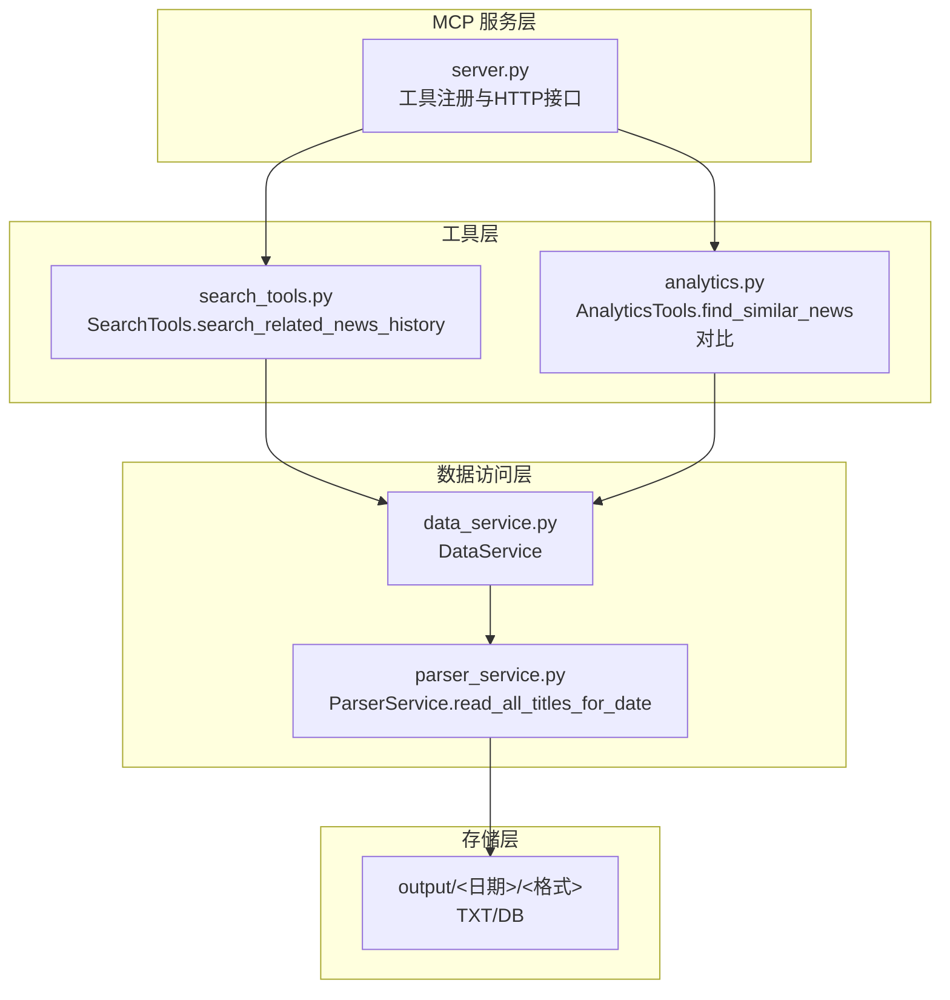
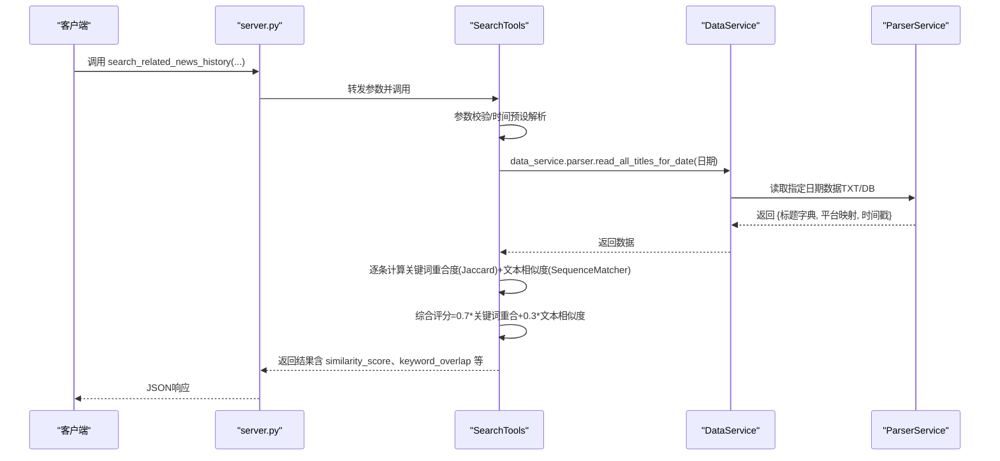
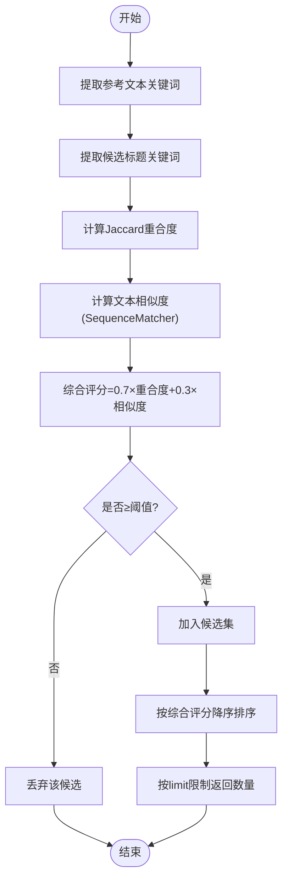
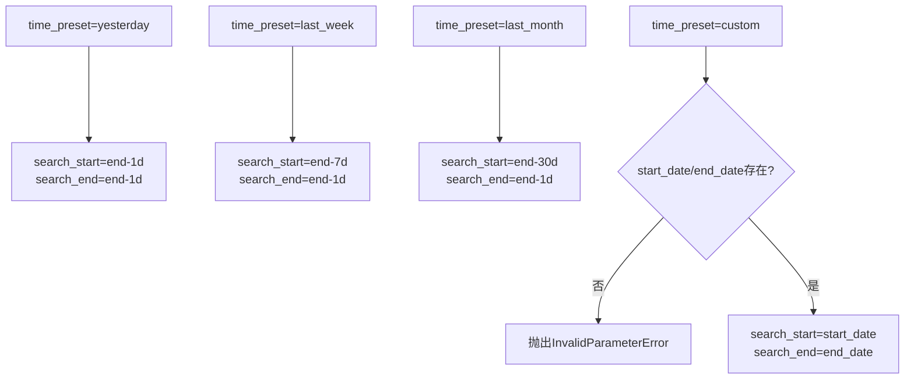

# 历史相关新闻检索

<cite>
**本文引用的文件**
- [search_tools.py](file://mcp_server/tools/search_tools.py)
- [analytics.py](file://mcp_server/tools/analytics.py)
- [data_service.py](file://mcp_server/services/data_service.py)
- [parser_service.py](file://mcp_server/services/parser_service.py)
- [server.py](file://mcp_server/server.py)
- [config.yaml](file://config/config.yaml)
</cite>

## 目录
1. [简介](#简介)
2. [项目结构](#项目结构)
3. [核心组件](#核心组件)
4. [架构总览](#架构总览)
5. [详细组件分析](#详细组件分析)
6. [依赖关系分析](#依赖关系分析)
7. [性能考量](#性能考量)
8. [故障排查指南](#故障排查指南)
9. [结论](#结论)
10. [附录](#附录)

## 简介
本文档围绕 `search_related_news_history` 方法展开，系统性说明其“综合评分机制”（关键词重合度占70% + 文本相似度占30%）、时间范围预设（yesterday、last_week、last_month、custom）的实现逻辑、阈值参数对结果的影响、以及如何通过参考文本提取关键词并计算与候选新闻的 Jaccard 相似度。同时提供使用示例，帮助读者理解如何查找与某主题（例如“AI技术突破”）相关的上周新闻，并解释返回结果中 similarity_score、keyword_overlap 等字段的含义。

## 项目结构
- 搜索工具位于 mcp_server/tools/search_tools.py，提供统一的新闻检索能力，其中包含历史相关新闻检索方法。
- 数据访问层位于 mcp_server/services/data_service.py，负责读取历史数据（TXT/SQLite）。
- 解析层位于 mcp_server/services/parser_service.py，负责解析输出目录下的新闻数据。
- MCP 服务入口位于 mcp_server/server.py，提供 HTTP/STDIO 工具接口，包含 search_related_news_history 的对外暴露。
- 配置位于 config/config.yaml，包含平台、权重等系统配置。

图表来源
- [server.py](file://mcp_server/server.py#L543-L584)
- [search_tools.py](file://mcp_server/tools/search_tools.py#L494-L702)
- [analytics.py](file://mcp_server/tools/analytics.py#L909-L1015)
- [data_service.py](file://mcp_server/services/data_service.py#L461-L514)
- [parser_service.py](file://mcp_server/services/parser_service.py#L461-L514)

章节来源
- [server.py](file://mcp_server/server.py#L543-L584)
- [search_tools.py](file://mcp_server/tools/search_tools.py#L494-L702)
- [data_service.py](file://mcp_server/services/data_service.py#L461-L514)
- [parser_service.py](file://mcp_server/services/parser_service.py#L461-L514)

## 核心组件
- SearchTools.search_related_news_history：实现历史相关新闻检索的核心方法，支持时间预设、阈值、限制返回数量、URL可选返回。
- ParserService.read_all_titles_for_date：按日期读取平台标题集合，支持 SQLite 与 TXT 两种数据源。
- DataService：封装数据访问与缓存，提供日期范围扫描、系统状态等辅助能力。
- MCP Server 工具注册：将 search_related_news_history 暴露为 HTTP 工具接口。

章节来源
- [search_tools.py](file://mcp_server/tools/search_tools.py#L494-L702)
- [parser_service.py](file://mcp_server/services/parser_service.py#L461-L514)
- [data_service.py](file://mcp_server/services/data_service.py#L461-L514)
- [server.py](file://mcp_server/server.py#L543-L584)

## 架构总览
search_related_news_history 的调用链路如下：
- 外部调用（HTTP/STDIO）→ server.py 注册的工具 → SearchTools.search_related_news_history → DataService.ParserService → 输出目录（TXT/DB）

图表来源
- [server.py](file://mcp_server/server.py#L543-L584)
- [search_tools.py](file://mcp_server/tools/search_tools.py#L494-L702)
- [data_service.py](file://mcp_server/services/data_service.py#L461-L514)
- [parser_service.py](file://mcp_server/services/parser_service.py#L461-L514)

## 详细组件分析

### 综合评分机制（关键词重合度×70% + 文本相似度×30%）
- 关键词提取：对参考文本与候选标题分别提取关键词（去除 URL、过滤停用词、最小长度等规则），得到关键词集合。
- 关键词重合度（Jaccard 相似度）：计算参考关键词集合与候选标题关键词集合的交集/并集，作为关键词重合度。
- 文本相似度：使用 SequenceMatcher 计算两个文本的小写版本的相似度分数。
- 综合评分：combined_score = keyword_overlap × 0.7 + text_similarity × 0.3。
- 结果筛选：仅当 combined_score ≥ threshold 时纳入返回结果；最终按 similarity_score 降序排序。

图表来源
- [search_tools.py](file://mcp_server/tools/search_tools.py#L590-L615)
- [search_tools.py](file://mcp_server/tools/search_tools.py#L601-L603)
- [search_tools.py](file://mcp_server/tools/search_tools.py#L649-L652)

章节来源
- [search_tools.py](file://mcp_server/tools/search_tools.py#L590-L615)
- [search_tools.py](file://mcp_server/tools/search_tools.py#L601-L603)
- [search_tools.py](file://mcp_server/tools/search_tools.py#L649-L652)

### 时间范围预设实现逻辑
- yesterday：起止均为“今日-1天”。
- last_week：起止为“今日-7天”到“今日-1天”。
- last_month：起止为“今日-30天”到“今日-1天”。
- custom：需要显式提供 start_date 与 end_date，否则抛出参数错误。
- 日期边界：循环遍历 [start_date, end_date]，逐日读取数据并匹配。

图表来源
- [search_tools.py](file://mcp_server/tools/search_tools.py#L543-L564)

章节来源
- [search_tools.py](file://mcp_server/tools/search_tools.py#L543-L564)

### 阈值参数对结果的影响
- threshold：综合评分阈值，越小召回越多，越大召回越严格。
- 当返回数量小于 limit 时，工具会附加 note 提示“在阈值下仅找到X条相关新闻”。

章节来源
- [search_tools.py](file://mcp_server/tools/search_tools.py#L648-L687)

### 参考文本关键词提取与 Jaccard 相似度
- 参考文本关键词提取：移除 URL、方括号内容，使用正则分词，过滤停用词与短词，得到关键词集合。
- Jaccard 相似度：intersection / union，用于衡量关键词重合程度。
- 该过程用于计算 keyword_overlap 字段，作为综合评分的权重之一。

章节来源
- [search_tools.py](file://mcp_server/tools/search_tools.py#L566-L573)
- [search_tools.py](file://mcp_server/tools/search_tools.py#L596-L600)
- [search_tools.py](file://mcp_server/tools/search_tools.py#L468-L493)

### 返回结果字段说明
- similarity_score：综合评分（0~1），按 0.7×关键词重合 + 0.3×文本相似度 计算。
- keyword_overlap：关键词重合度（Jaccard），0~1。
- text_similarity：文本相似度（SequenceMatcher），0~1。
- common_keywords：参考文本与候选标题的共同关键词集合。
- 其他：平台、标题、日期、排名、URL（可选）等。

章节来源
- [search_tools.py](file://mcp_server/tools/search_tools.py#L604-L622)

### 使用示例：查找与“AI技术突破”相关的上周新闻
- 步骤
  1) 调用 MCP 工具 search_related_news_history，传入 reference_text="AI技术突破"，time_preset="last_week"，threshold=0.4，limit=50。
  2) 服务内部解析上周日期范围，逐日读取标题数据。
  3) 对每个标题计算关键词重合度与文本相似度，综合评分≥0.4 的进入结果集。
  4) 按 similarity_score 降序排序，返回前 limit 条。
- 结果解读
  - similarity_score：越高表示与参考文本越相关。
  - keyword_overlap：关键词重合度越高，表示主题重叠越强。
  - text_similarity：文本相似度越高，表示标题语义越接近。
  - common_keywords：可用于进一步理解重合的主题词。

章节来源
- [server.py](file://mcp_server/server.py#L543-L584)
- [search_tools.py](file://mcp_server/tools/search_tools.py#L543-L652)

### 与其他相似度工具的对比
- AnalyticsTools.find_similar_news：仅基于标题相似度（SequenceMatcher），无关键词重合度参与，且默认阈值更高（0.6）。
- SearchTools.search_related_news_history：融合关键词重合度（Jaccard）与文本相似度，阈值可更低，召回更广。

章节来源
- [analytics.py](file://mcp_server/tools/analytics.py#L909-L1015)
- [search_tools.py](file://mcp_server/tools/search_tools.py#L590-L615)

## 依赖关系分析
- SearchTools 依赖 DataService，DataService 依赖 ParserService，ParserService 读取 output 目录下的 TXT/DB 数据。
- MCP Server 将 SearchTools 的方法注册为工具接口，供外部调用。
- 配置文件 config.yaml 提供平台、权重等系统配置，影响工具行为（如平台映射、权重等）。

图表来源
- [search_tools.py](file://mcp_server/tools/search_tools.py#L494-L702)
- [data_service.py](file://mcp_server/services/data_service.py#L461-L514)
- [parser_service.py](file://mcp_server/services/parser_service.py#L461-L514)
- [server.py](file://mcp_server/server.py#L543-L584)
- [config.yaml](file://config/config.yaml#L158-L187)

章节来源
- [search_tools.py](file://mcp_server/tools/search_tools.py#L494-L702)
- [data_service.py](file://mcp_server/services/data_service.py#L461-L514)
- [parser_service.py](file://mcp_server/services/parser_service.py#L461-L514)
- [server.py](file://mcp_server/server.py#L543-L584)
- [config.yaml](file://config/config.yaml#L158-L187)

## 性能考量
- 数据读取：ParserService 支持 SQLite 与 TXT 两种数据源，优先读取 SQLite；对历史数据使用较长缓存时间，减少 IO。
- 日期遍历：按日遍历时间范围，时间复杂度与“天数×平台数×标题数”相关。
- 相似度计算：关键词提取与 Jaccard 计算为 O(n+m)，文本相似度为 O(n)（n 为字符数）。
- 建议
  - 合理设置 threshold 与 limit，避免过宽召回导致排序开销增大。
  - 使用合适的 time_preset 缩小搜索范围。
  - 如需频繁查询，可结合缓存与索引策略（当前实现已内置缓存）。

章节来源
- [parser_service.py](file://mcp_server/services/parser_service.py#L461-L514)
- [data_service.py](file://mcp_server/services/data_service.py#L461-L514)

## 故障排查指南
- 未找到相关新闻
  - 检查 time_preset 与日期范围是否正确。
  - 适当降低 threshold，提高召回。
  - 确认 reference_text 是否能提取到关键词（如过短或纯数字/符号）。
- 参数错误
  - custom 模式未提供 start_date/end_date 会抛出 InvalidParameterError。
  - threshold 超出 0~1 范围会抛出 InvalidParameterError。
- 数据缺失
  - 若某日无数据，工具会跳过该日继续处理，不会中断。
  - 若整个时间范围内均无数据，返回空结果并提示可用日期范围。

章节来源
- [search_tools.py](file://mcp_server/tools/search_tools.py#L553-L564)
- [search_tools.py](file://mcp_server/tools/search_tools.py#L566-L573)
- [search_tools.py](file://mcp_server/tools/search_tools.py#L634-L647)

## 结论
search_related_news_history 通过“关键词重合度×70% + 文本相似度×30%”的综合评分，兼顾主题一致性与语义接近性，能够在历史数据中高效召回相关新闻。配合时间预设与阈值控制，既能满足快速检索，也能灵活调整召回强度。建议在实际使用中根据业务目标合理设置阈值与时间范围，并结合返回字段进行二次筛选与分析。

## 附录
- 关键词提取与停用词：参考实现中内置中文停用词集合，过滤 URL、方括号内容与短词。
- 平台映射：标题数据包含平台 ID 与名称映射，便于结果展示与统计。
- 配置项：config.yaml 中的 platforms、weight 等配置会影响工具行为与展示。

章节来源
- [search_tools.py](file://mcp_server/tools/search_tools.py#L30-L36)
- [parser_service.py](file://mcp_server/services/parser_service.py#L461-L514)
- [config.yaml](file://config/config.yaml#L158-L187)