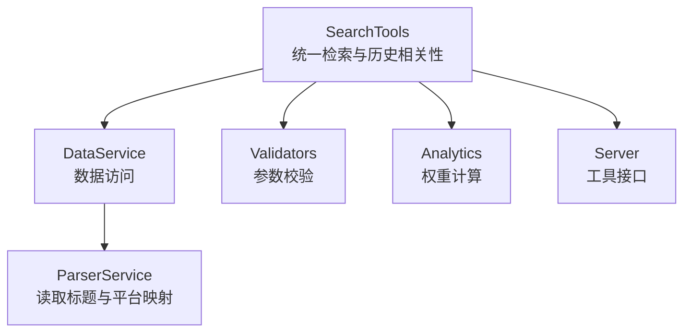
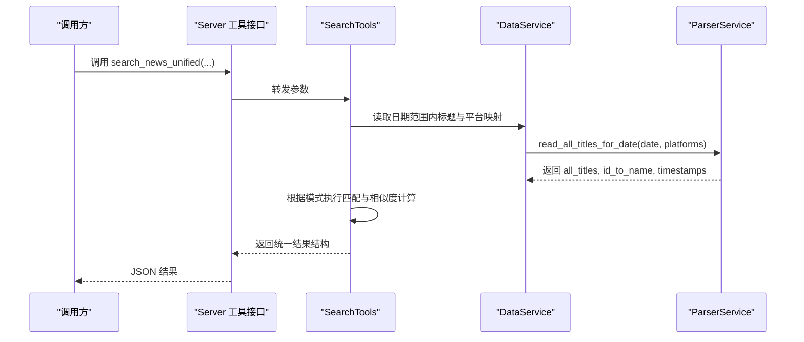
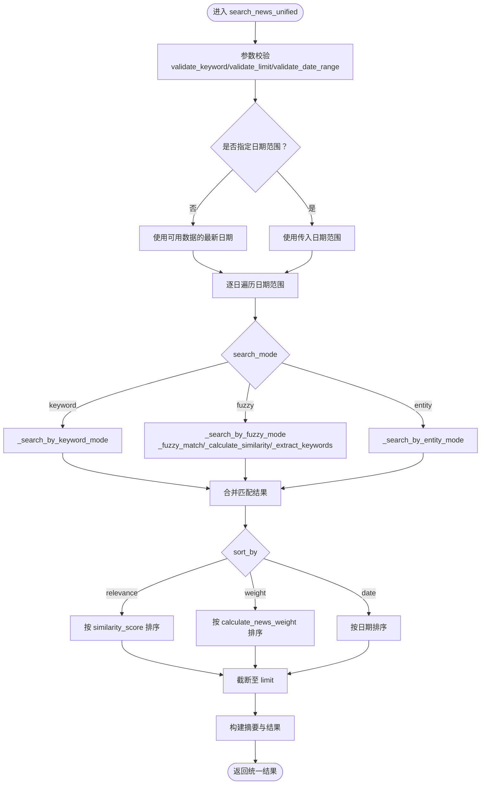
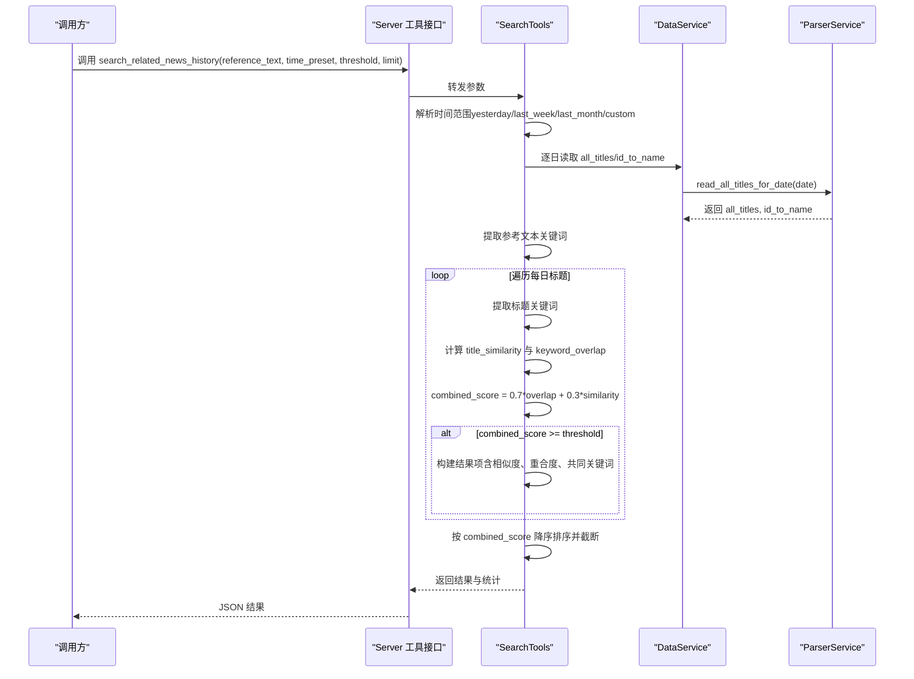
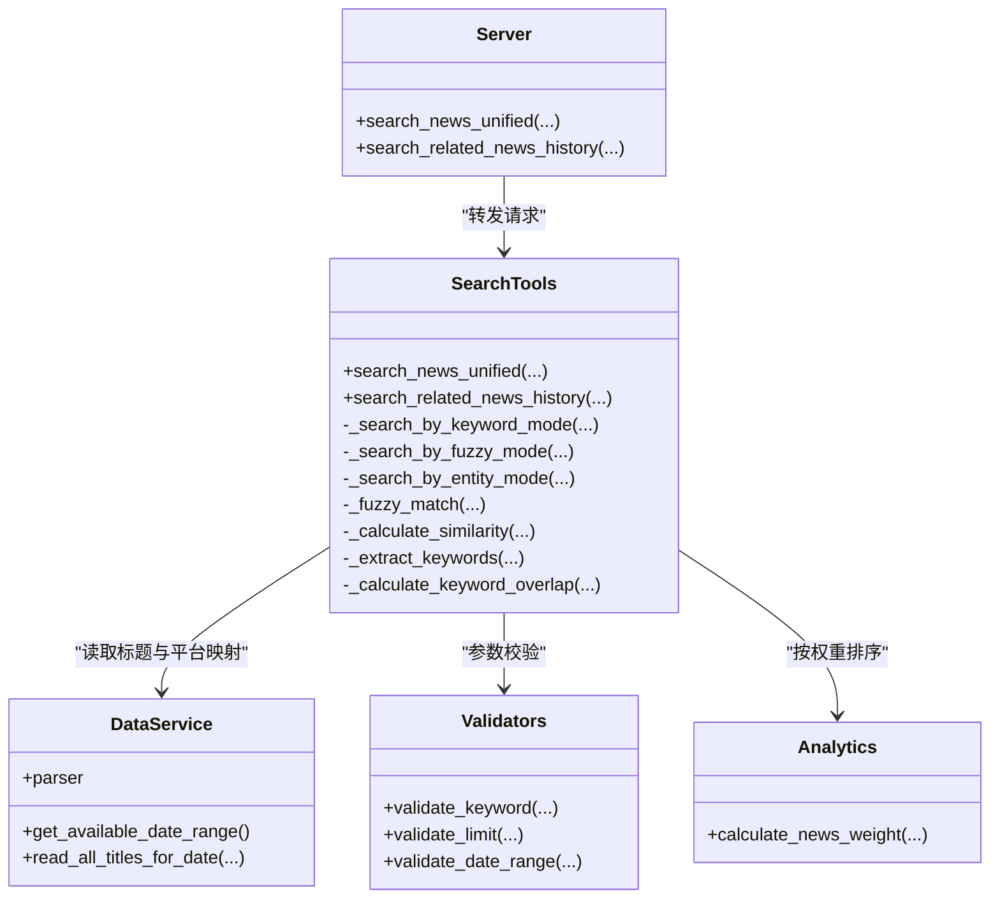

# 智能检索工具

<cite>
**本文引用的文件**
- [mcp_server/tools/search_tools.py](file://mcp_server/tools/search_tools.py)
- [mcp_server/tools/analytics.py](file://mcp_server/tools/analytics.py)
- [mcp_server/services/data_service.py](file://mcp_server/services/data_service.py)
- [mcp_server/utils/validators.py](file://mcp_server/utils/validators.py)
- [mcp_server/server.py](file://mcp_server/server.py)
</cite>

## 目录
1. [简介](#简介)
2. [项目结构](#项目结构)
3. [核心组件](#核心组件)
4. [架构总览](#架构总览)
5. [详细组件分析](#详细组件分析)
6. [依赖关系分析](#依赖关系分析)
7. [性能考量](#性能考量)
8. [故障排查指南](#故障排查指南)
9. [结论](#结论)
10. [附录](#附录)

## 简介
本文件围绕 SearchTools 类的两大核心方法展开：统一新闻搜索 search_news_unified 与历史相关新闻检索 search_related_news_history。文档将系统阐述：
- search_news_unified 的三种搜索模式（keyword、fuzzy、entity）与排序方式（relevance、weight、date），以及模糊匹配中的相似度算法与关键词重合度策略。
- search_related_news_history 如何结合关键词重合度与文本相似度进行综合评分，从而在历史数据中召回相关新闻。
- 提供具体使用示例，帮助快速上手，例如使用模糊搜索模式查找与“AI技术突破”相关的新闻。

## 项目结构
SearchTools 位于 mcp_server/tools/search_tools.py，负责统一检索入口与历史相关性检索；其依赖：
- 数据访问层 DataService：提供按日期读取标题与平台映射的能力。
- 工具层 validators：参数校验（关键字、数量限制、日期范围等）。
- 分析工具 analytics：在 keyword 模式下按权重排序时使用 calculate_news_weight。
- 服务层 server：对外暴露 search_news_unified 与 search_related_news_history 的工具接口。

图表来源
- [mcp_server/tools/search_tools.py](file://mcp_server/tools/search_tools.py#L1-L120)
- [mcp_server/services/data_service.py](file://mcp_server/services/data_service.py#L1-L60)
- [mcp_server/utils/validators.py](file://mcp_server/utils/validators.py#L90-L121)
- [mcp_server/tools/analytics.py](file://mcp_server/tools/analytics.py#L24-L74)
- [mcp_server/server.py](file://mcp_server/server.py#L529-L569)

章节来源
- [mcp_server/tools/search_tools.py](file://mcp_server/tools/search_tools.py#L1-L120)
- [mcp_server/services/data_service.py](file://mcp_server/services/data_service.py#L1-L60)
- [mcp_server/utils/validators.py](file://mcp_server/utils/validators.py#L90-L121)
- [mcp_server/tools/analytics.py](file://mcp_server/tools/analytics.py#L24-L74)
- [mcp_server/server.py](file://mcp_server/server.py#L529-L569)

## 核心组件
- SearchTools：提供统一检索与历史相关性检索能力，内部封装三种搜索模式与相似度算法，并支持按相关度、权重、日期排序。
- DataService：封装 ParserService，提供按日期读取所有标题与平台映射的能力，作为 SearchTools 的数据源。
- Validators：提供 validate_keyword、validate_limit、validate_date_range 等参数校验。
- Analytics.calculate_news_weight：在 keyword 模式下按权重排序时使用，综合考虑排名、频次与热度。

章节来源
- [mcp_server/tools/search_tools.py](file://mcp_server/tools/search_tools.py#L18-L70)
- [mcp_server/services/data_service.py](file://mcp_server/services/data_service.py#L1-L60)
- [mcp_server/utils/validators.py](file://mcp_server/utils/validators.py#L90-L121)
- [mcp_server/tools/analytics.py](file://mcp_server/tools/analytics.py#L24-L74)

## 架构总览
SearchTools 的调用链路如下：
- 对外接口：server.py 中的 search_news_unified 与 search_related_news_history 将请求转发至 SearchTools。
- 内部流程：SearchTools 通过 DataService 读取目标日期范围内的所有标题与平台映射，根据搜索模式执行匹配逻辑，计算相似度或关键词重合度，最终按排序策略返回结果。

图表来源
- [mcp_server/server.py](file://mcp_server/server.py#L529-L569)
- [mcp_server/tools/search_tools.py](file://mcp_server/tools/search_tools.py#L123-L204)
- [mcp_server/services/data_service.py](file://mcp_server/services/data_service.py#L141-L172)

## 详细组件分析

### 统一新闻搜索 search_news_unified
- 功能概述
  - 支持三种搜索模式：
    - keyword：精确关键词匹配，适合强相关场景。
    - fuzzy：模糊匹配，基于相似度算法与关键词重合度，适合语义相近的场景。
    - entity：实体名称搜索，按精确包含实体名返回。
  - 支持排序方式：
    - relevance：按相似度分数排序。
    - weight：按新闻权重排序（综合排名、频次、热度）。
    - date：按日期倒序排序。
  - 支持日期范围与平台过滤，返回统一的结果结构，包含摘要与明细。

- 关键实现要点
  - 参数校验：使用 validate_keyword、validate_limit、validate_date_range 等。
  - 日期范围：若未指定，则使用可用数据的最新日期；若无数据则返回错误提示。
  - 模式分支：分别调用 _search_by_keyword_mode、_search_by_fuzzy_mode、_search_by_entity_mode。
  - 排序策略：relevance 使用 similarity_score；weight 使用 calculate_news_weight；date 使用日期字段。
  - 结果构建：汇总 total_found、returned_count、requested_limit、search_mode、query、platforms、time_range、sort_by 等摘要信息。

- 相似度与关键词重合度
  - _calculate_similarity：使用 difflib.SequenceMatcher 计算两段文本的序列相似度。
  - _fuzzy_match：
    - 若查询词包含于标题，直接命中（相似度1.0）。
    - 否则计算整体相似度，若达到阈值则命中。
    - 否则提取关键词集合，计算关键词重合度（交集大小/查询关键词总数），若达到阈值（例如≥0.5）则命中。
  - _extract_keywords：移除URL与方括号内容，使用正则分词，过滤停用词与短词，得到候选关键词。
  - _calculate_keyword_overlap：采用 Jaccard 相似度计算两个关键词集合的重合度。

- 使用示例（基于文档注释）
  - 精确关键词搜索：search_news_unified(query="人工智能", search_mode="keyword")
  - 模糊搜索（阈值0.4）：search_news_unified(query="特斯拉降价", search_mode="fuzzy", threshold=0.4)
  - 实体搜索（限制20条）：search_news_unified(query="马斯克", search_mode="entity", limit=20)
  - 指定日期范围：search_news_unified(query="iPhone 16", date_range={"start": "2025-01-01", "end": "2025-01-07"})

- 代码路径参考
  - 统一入口与排序逻辑：[search_news_unified](file://mcp_server/tools/search_tools.py#L38-L227)
  - keyword 模式：[_search_by_keyword_mode](file://mcp_server/tools/search_tools.py#L242-L289)
  - fuzzy 模式：[_search_by_fuzzy_mode](file://mcp_server/tools/search_tools.py#L291-L341)
  - entity 模式：[_search_by_entity_mode](file://mcp_server/tools/search_tools.py#L343-L389)
  - 相似度与关键词重合度：[_calculate_similarity/_fuzzy_match/_extract_keywords/_calculate_keyword_overlap](file://mcp_server/tools/search_tools.py#L391-L493)

图表来源
- [mcp_server/tools/search_tools.py](file://mcp_server/tools/search_tools.py#L38-L227)
- [mcp_server/tools/analytics.py](file://mcp_server/tools/analytics.py#L24-L74)

章节来源
- [mcp_server/tools/search_tools.py](file://mcp_server/tools/search_tools.py#L38-L227)
- [mcp_server/tools/analytics.py](file://mcp_server/tools/analytics.py#L24-L74)

### 历史相关新闻检索 search_related_news_history
- 功能概述
  - 在历史数据中搜索与参考新闻（标题或内容）相关的新闻，支持预设时间范围（yesterday、last_week、last_month、custom）。
  - 综合评分：关键词重合度（70%）+ 文本相似度（30%），高于阈值即纳入结果。
  - 返回结果包含相似度分数、关键词重合度、文本相似度、共同关键词、平台分布、日期分布与平均相似度等统计信息。

- 关键实现要点
  - 参数校验：validate_keyword、阈值归一化、limit 校验。
  - 时间范围确定：根据 time_preset 或 custom 参数计算起止日期。
  - 关键词提取：对参考文本与每条标题分别提取关键词。
  - 相似度计算：文本相似度使用 SequenceMatcher；关键词重合度使用 Jaccard 相似度。
  - 综合评分：combined_score = keyword_overlap * 0.7 + title_similarity * 0.3。
  - 排序与截断：按 combined_score 降序，截取 limit 条。
  - 统计信息：平台分布、日期分布、平均相似度。

- 使用示例（基于文档注释）
  - 基于“人工智能技术突破”在上周范围内检索相关新闻，阈值0.4，返回最多50条。

- 代码路径参考
  - 主流程与综合评分：[search_related_news_history](file://mcp_server/tools/search_tools.py#L494-L688)
  - 相似度与重合度：[_calculate_similarity/_calculate_keyword_overlap](file://mcp_server/tools/search_tools.py#L391-L493)
  - 关键词提取：[_extract_keywords](file://mcp_server/tools/search_tools.py#L442-L466)

图表来源
- [mcp_server/server.py](file://mcp_server/server.py#L543-L569)
- [mcp_server/tools/search_tools.py](file://mcp_server/tools/search_tools.py#L494-L688)
- [mcp_server/services/data_service.py](file://mcp_server/services/data_service.py#L141-L172)

章节来源
- [mcp_server/tools/search_tools.py](file://mcp_server/tools/search_tools.py#L494-L688)
- [mcp_server/server.py](file://mcp_server/server.py#L543-L569)

## 依赖关系分析
- SearchTools 依赖
  - DataService：读取每日标题与平台映射。
  - Validators：参数校验（关键字、数量限制、日期范围）。
  - Analytics：在 keyword 模式下按权重排序时使用 calculate_news_weight。
- 外部接口
  - server.py：对外提供 search_news_unified 与 search_related_news_history 的工具接口，将请求转发至 SearchTools 并返回 JSON 结果。

图表来源
- [mcp_server/tools/search_tools.py](file://mcp_server/tools/search_tools.py#L18-L70)
- [mcp_server/services/data_service.py](file://mcp_server/services/data_service.py#L1-L60)
- [mcp_server/utils/validators.py](file://mcp_server/utils/validators.py#L90-L121)
- [mcp_server/tools/analytics.py](file://mcp_server/tools/analytics.py#L24-L74)
- [mcp_server/server.py](file://mcp_server/server.py#L529-L569)

章节来源
- [mcp_server/tools/search_tools.py](file://mcp_server/tools/search_tools.py#L18-L70)
- [mcp_server/services/data_service.py](file://mcp_server/services/data_service.py#L1-L60)
- [mcp_server/utils/validators.py](file://mcp_server/utils/validators.py#L90-L121)
- [mcp_server/tools/analytics.py](file://mcp_server/tools/analytics.py#L24-L74)
- [mcp_server/server.py](file://mcp_server/server.py#L529-L569)

## 性能考量
- 模糊匹配复杂度
  - _fuzzy_match 对每条标题执行相似度计算与关键词重合度计算，整体复杂度约为 O(D×N×(K+logK))，其中 D 为日期跨度、N 为每日标题数、K 为关键词集合大小。
  - 关键词提取与重合度计算使用集合操作，Jaccard 相似度在关键词集合较小时开销可控。
- 排序成本
  - relevance：O(M log M)，M 为匹配结果数。
  - weight：O(M log M)，且每次计算权重涉及 ranks、count 等字段，需确保输入数据结构完整。
  - date：O(M log M)。
- I/O 与缓存
  - DataService 在读取历史数据时具备缓存机制，可减少重复读取带来的开销。
- 建议
  - 合理设置 limit 与阈值，避免返回过多结果导致排序与序列化开销增大。
  - 在高频查询场景下，优先使用 keyword 模式或缩小日期范围。

[本节为通用性能建议，不直接分析具体文件]

## 故障排查指南
- 常见错误与提示
  - 无可用数据：当未指定日期范围且无可用数据时，返回错误提示，建议先运行爬虫生成数据或检查输出目录。
  - 参数非法：search_mode、sort_by、time_preset 等参数不在支持列表时抛出 InvalidParameterError。
  - 日期范围异常：start 早于 end、日期在未来等情况会被拒绝。
  - 参考文本无法提取关键词：当参考文本为空或无法分词时，会提示提供更详细的文本内容。
- 定位方法
  - 查看返回结果中的 success 字段与 error 字段（若有）。
  - 检查 date_range 与 platforms 参数是否符合规范。
  - 调整 threshold 与 limit，观察返回数量变化。
- 代码路径参考
  - 错误处理与返回结构：[search_news_unified](file://mcp_server/tools/search_tools.py#L111-L184)、[search_related_news_history](file://mcp_server/tools/search_tools.py#L534-L573)
  - 参数校验工具：[validators](file://mcp_server/utils/validators.py#L90-L121)

章节来源
- [mcp_server/tools/search_tools.py](file://mcp_server/tools/search_tools.py#L111-L184)
- [mcp_server/tools/search_tools.py](file://mcp_server/tools/search_tools.py#L534-L573)
- [mcp_server/utils/validators.py](file://mcp_server/utils/validators.py#L90-L121)

## 结论
SearchTools 通过统一检索与历史相关性检索两大能力，覆盖了从精确关键词到语义模糊再到实体关联的多种检索需求。其模糊匹配与历史相关性评分策略结合了文本相似度与关键词重合度，既保证召回质量又兼顾效率。配合权重排序与灵活的日期范围控制，能够满足多样化的新闻检索场景。

[本节为总结性内容，不直接分析具体文件]

## 附录

### 使用示例索引
- 模糊搜索模式查找与“AI技术突破”相关的新闻
  - 参考接口：[search_related_news_history](file://mcp_server/server.py#L543-L569)
  - 参考实现：[search_related_news_history](file://mcp_server/tools/search_tools.py#L494-L688)
  - 示例参数：reference_text="AI技术突破"，time_preset="last_week"，threshold=0.4，limit=50

- 统一新闻搜索示例
  - 精确关键词：[search_news_unified](file://mcp_server/server.py#L529-L541)
  - 模糊搜索：[search_news_unified](file://mcp_server/server.py#L529-L541)
  - 实体搜索：[search_news_unified](file://mcp_server/server.py#L529-L541)

章节来源
- [mcp_server/server.py](file://mcp_server/server.py#L529-L569)
- [mcp_server/tools/search_tools.py](file://mcp_server/tools/search_tools.py#L38-L227)
- [mcp_server/tools/search_tools.py](file://mcp_server/tools/search_tools.py#L494-L688)