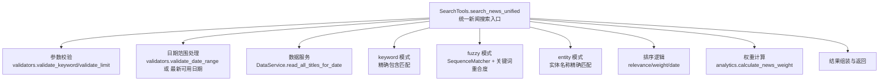
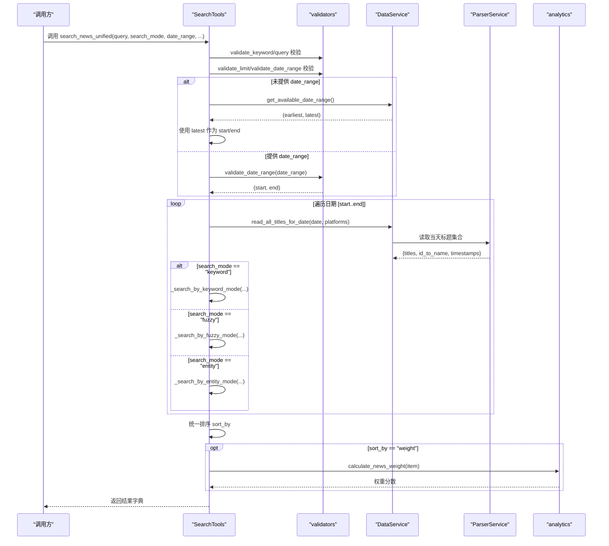
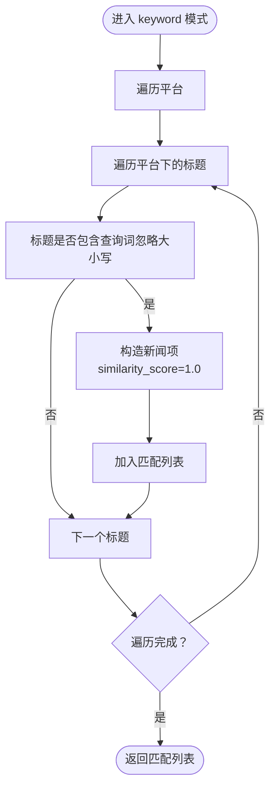
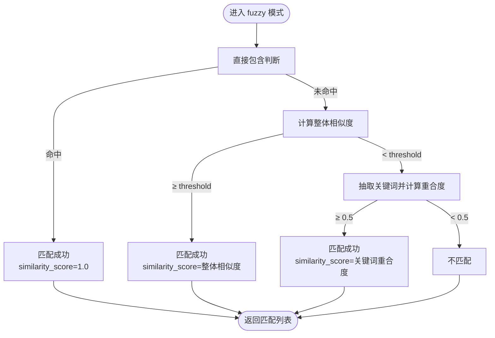
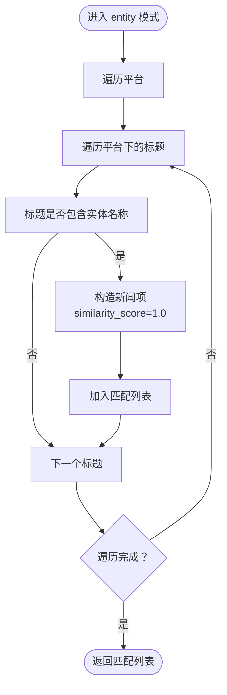
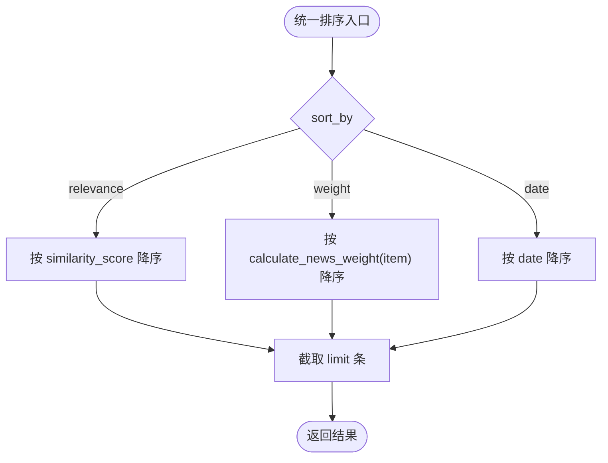
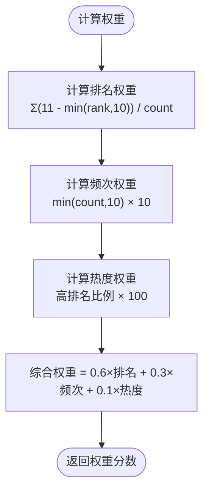
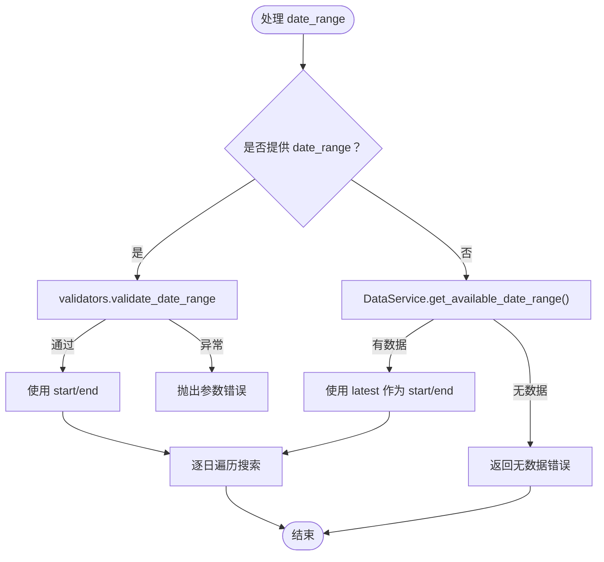
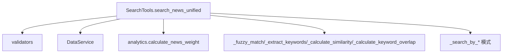

# 统一新闻搜索

<cite>
**本文引用的文件**
- [mcp_server/tools/search_tools.py](file://mcp_server/tools/search_tools.py)
- [mcp_server/tools/analytics.py](file://mcp_server/tools/analytics.py)
- [mcp_server/utils/validators.py](file://mcp_server/utils/validators.py)
- [mcp_server/services/data_service.py](file://mcp_server/services/data_service.py)
- [mcp_server/server.py](file://mcp_server/server.py)
</cite>

## 目录
1. [简介](#简介)
2. [项目结构](#项目结构)
3. [核心组件](#核心组件)
4. [架构总览](#架构总览)
5. [详细组件分析](#详细组件分析)
6. [依赖关系分析](#依赖关系分析)
7. [性能考虑](#性能考虑)
8. [故障排查指南](#故障排查指南)
9. [结论](#结论)
10. [附录](#附录)

## 简介
本文件围绕统一新闻搜索方法 search_news_unified 的工作机制进行深入说明，重点覆盖三种搜索模式（keyword、fuzzy、entity）的实现细节，以及排序参数 sort_by 的三种排序方式（relevance、weight、date）。文档还解释了 date_range 参数的处理逻辑，并给出实际使用示例，如如何使用 fuzzy 模式搜索“特斯拉最新动态”并设置 0.5 的相似度阈值。最后说明默认查询最新可用数据日期而非当前日期的设计考量。

## 项目结构
search_news_unified 位于 mcp_server/tools/search_tools.py 中，作为 SearchTools 类的核心方法，负责：
- 参数校验与规范化
- 日期范围解析与默认策略
- 三种搜索模式的分支执行
- 统一排序与结果构建
- 错误与边界情况处理

图表来源
- [mcp_server/tools/search_tools.py](file://mcp_server/tools/search_tools.py#L37-L239)
- [mcp_server/utils/validators.py](file://mcp_server/utils/validators.py#L145-L210)
- [mcp_server/services/data_service.py](file://mcp_server/services/data_service.py#L497-L568)
- [mcp_server/tools/analytics.py](file://mcp_server/tools/analytics.py#L24-L74)

章节来源
- [mcp_server/tools/search_tools.py](file://mcp_server/tools/search_tools.py#L37-L239)

## 核心组件
- SearchTools.search_news_unified：统一入口，负责参数校验、日期范围处理、模式分支、排序与结果组装。
- _search_by_keyword_mode：keyword 模式，基于标题的精确包含匹配。
- _search_by_fuzzy_mode：fuzzy 模式，复合相似度算法（SequenceMatcher + 关键词重合度）。
- _search_by_entity_mode：entity 模式，基于实体名称的精确匹配。
- _fuzzy_match：模糊匹配核心算法，包含直接包含、整体相似度、关键词重合度三阶段判定。
- _calculate_similarity：基于 difflib.SequenceMatcher 的整体相似度计算。
- _extract_keywords：关键词抽取（移除URL、方括号、正则分词、停用词过滤）。
- _calculate_keyword_overlap：Jaccard 相似度计算关键词重合度。
- analytics.calculate_news_weight：权重计算，用于 sort_by="weight" 的排序依据。
- validators.validate_date_range：日期范围参数校验。
- data_service.get_available_date_range：扫描 output 目录获取可用日期范围，用于默认策略。

章节来源
- [mcp_server/tools/search_tools.py](file://mcp_server/tools/search_tools.py#L37-L239)
- [mcp_server/tools/analytics.py](file://mcp_server/tools/analytics.py#L24-L74)
- [mcp_server/utils/validators.py](file://mcp_server/utils/validators.py#L145-L210)
- [mcp_server/services/data_service.py](file://mcp_server/services/data_service.py#L497-L568)

## 架构总览
search_news_unified 的调用链路如下：

图表来源
- [mcp_server/tools/search_tools.py](file://mcp_server/tools/search_tools.py#L37-L239)
- [mcp_server/utils/validators.py](file://mcp_server/utils/validators.py#L145-L210)
- [mcp_server/services/data_service.py](file://mcp_server/services/data_service.py#L497-L568)
- [mcp_server/tools/analytics.py](file://mcp_server/tools/analytics.py#L24-L74)

## 详细组件分析

### keyword 模式（精确匹配）
- 匹配逻辑：对每个平台的标题进行大小写无关的包含判断，若匹配成功则构造新闻项并记录相似度为 1.0。
- 输出字段：title、platform、platform_name、date、similarity_score、ranks、count、rank；可选包含 url、mobileUrl。
- 特点：简单高效，适合精确关键词检索。

图表来源
- [mcp_server/tools/search_tools.py](file://mcp_server/tools/search_tools.py#L241-L289)

章节来源
- [mcp_server/tools/search_tools.py](file://mcp_server/tools/search_tools.py#L241-L289)

### fuzzy 模式（复合相似度算法）
- 匹配流程：
  1) 直接包含判断：若查询词在标题中出现，则直接匹配成功，相似度为 1.0。
  2) 整体相似度：使用 SequenceMatcher 计算标题与查询词的整体相似度，若达到阈值则匹配成功。
  3) 关键词重合度：对查询词与标题分别抽取关键词，计算 Jaccard 相似度（关键词重合度），若达到阈值则匹配成功。
- 相似度取值：优先采用直接包含的 1.0；否则取整体相似度或关键词重合度中的较大者。
- 输出字段：与 keyword 模式一致，额外记录 similarity_score。

图表来源
- [mcp_server/tools/search_tools.py](file://mcp_server/tools/search_tools.py#L290-L389)
- [mcp_server/tools/search_tools.py](file://mcp_server/tools/search_tools.py#L390-L492)

章节来源
- [mcp_server/tools/search_tools.py](file://mcp_server/tools/search_tools.py#L290-L389)
- [mcp_server/tools/search_tools.py](file://mcp_server/tools/search_tools.py#L390-L492)

### entity 模式（实体名称精确匹配）
- 匹配逻辑：对每个平台的标题进行包含判断，若标题包含实体名称则匹配成功，相似度为 1.0。
- 输出字段：与 keyword 模式一致。
- 排序：默认按 relevance 排序；若 sort_by="weight"，将调用 analytics.calculate_news_weight 进行排序。

图表来源
- [mcp_server/tools/search_tools.py](file://mcp_server/tools/search_tools.py#L342-L389)

章节来源
- [mcp_server/tools/search_tools.py](file://mcp_server/tools/search_tools.py#L342-L389)

### 排序机制（sort_by）
- relevance：按 similarity_score 降序排序。
- weight：按 analytics.calculate_news_weight 计算的权重降序排序。
- date：按 date 字段降序排序（较新的日期排在前面）。

图表来源
- [mcp_server/tools/search_tools.py](file://mcp_server/tools/search_tools.py#L186-L194)
- [mcp_server/tools/analytics.py](file://mcp_server/tools/analytics.py#L24-L74)

章节来源
- [mcp_server/tools/search_tools.py](file://mcp_server/tools/search_tools.py#L186-L194)
- [mcp_server/tools/analytics.py](file://mcp_server/tools/analytics.py#L24-L74)

### 权重自动排序机制（weight）
- 权重计算公式（analytics.calculate_news_weight）：
  - 排名权重（60%）：对每个排名计算 11 - min(rank, 10)，取平均。
  - 频次权重（30%）：min(count, 10) × 10。
  - 热度权重（10%）：高排名比例（rank ≤ 5）占总出现次数的比例。
  - 综合权重 = 排名权重×0.6 + 频次权重×0.3 + 热度权重×0.1。
- 注意：该权重计算依赖 news_data 中的 ranks 与 count 字段。

图表来源
- [mcp_server/tools/analytics.py](file://mcp_server/tools/analytics.py#L24-L74)

章节来源
- [mcp_server/tools/analytics.py](file://mcp_server/tools/analytics.py#L24-L74)

### date_range 参数处理逻辑
- 若传入 date_range：
  - 使用 validators.validate_date_range 校验并解析为 (start, end)。
  - 校验不允许查询未来日期，且会提示可用数据范围。
- 若未传入 date_range：
  - 调用 data_service.get_available_date_range 获取最早与最新可用日期。
  - 使用最新可用日期作为 start 与 end，避免默认查询“当前日期”的潜在问题。
  - 若无可用数据，直接返回错误提示。

图表来源
- [mcp_server/tools/search_tools.py](file://mcp_server/tools/search_tools.py#L99-L122)
- [mcp_server/utils/validators.py](file://mcp_server/utils/validators.py#L145-L210)
- [mcp_server/services/data_service.py](file://mcp_server/services/data_service.py#L497-L568)

章节来源
- [mcp_server/tools/search_tools.py](file://mcp_server/tools/search_tools.py#L99-L122)
- [mcp_server/utils/validators.py](file://mcp_server/utils/validators.py#L145-L210)
- [mcp_server/services/data_service.py](file://mcp_server/services/data_service.py#L497-L568)

### 默认查询最新可用数据日期的设计考量
- 设计目标：避免因“当前日期尚未产生数据”导致空结果，提升用户体验。
- 实施方式：当未提供 date_range 时，使用最新可用日期作为查询范围，确保至少能返回已有数据。
- 与“当前日期”区分：默认策略使用“最新可用日期”，而非严格等于系统当前日期，从而避免跨日数据延迟带来的空结果。

章节来源
- [mcp_server/tools/search_tools.py](file://mcp_server/tools/search_tools.py#L105-L121)
- [mcp_server/services/data_service.py](file://mcp_server/services/data_service.py#L497-L568)

### 实际使用示例
- 使用 fuzzy 模式搜索“特斯拉最新动态”，设置相似度阈值为 0.5：
  - 调用路径：SearchTools.search_news_unified(query="特斯拉最新动态", search_mode="fuzzy", threshold=0.5)
  - 模糊匹配将依次尝试直接包含、整体相似度与关键词重合度，满足任一条件即纳入结果。
  - 若匹配数量小于 limit，会在返回结果中附加 note 提示阈值与匹配数量的关系。
- 使用 keyword 模式搜索“人工智能”：
  - 调用路径：SearchTools.search_news_unified(query="人工智能", search_mode="keyword")
  - 返回结果按 relevance（similarity_score=1.0）排序。
- 使用 entity 模式搜索“马斯克”，并按权重排序：
  - 调用路径：SearchTools.search_news_unified(query="马斯克", search_mode="entity", sort_by="weight")
  - 权重由 analytics.calculate_news_weight 计算，综合考虑排名、频次与热度。

章节来源
- [mcp_server/tools/search_tools.py](file://mcp_server/tools/search_tools.py#L37-L79)
- [mcp_server/tools/analytics.py](file://mcp_server/tools/analytics.py#L24-L74)

## 依赖关系分析
- SearchTools.search_news_unified 依赖：
  - 参数校验：validators.validate_keyword、validate_limit、validate_date_range
  - 数据访问：DataService.read_all_titles_for_date
  - 权重计算：analytics.calculate_news_weight
  - 日期范围：data_service.get_available_date_range
- 内部方法依赖：
  - _fuzzy_match 依赖 _calculate_similarity、_extract_keywords、_calculate_keyword_overlap
  - _search_by_fuzzy_mode 依赖 _fuzzy_match
  - _search_by_keyword_mode/_search_by_entity_mode 依赖平台标题集合

图表来源
- [mcp_server/tools/search_tools.py](file://mcp_server/tools/search_tools.py#L37-L239)
- [mcp_server/tools/analytics.py](file://mcp_server/tools/analytics.py#L24-L74)
- [mcp_server/utils/validators.py](file://mcp_server/utils/validators.py#L145-L210)
- [mcp_server/services/data_service.py](file://mcp_server/services/data_service.py#L497-L568)

章节来源
- [mcp_server/tools/search_tools.py](file://mcp_server/tools/search_tools.py#L37-L239)

## 性能考虑
- 模糊匹配复杂度：
  - _fuzzy_match 对每个标题执行一次整体相似度计算与关键词重合度计算，整体复杂度与标题数量线性相关。
  - 关键词抽取与集合操作在小规模文本上开销较小，但在大量标题场景下建议控制 limit 与阈值。
- 排序成本：
  - relevance 与 date 排序为 O(n log n)，weight 排序同样为 O(n log n)，但每次计算权重为 O(1)（依赖 ranks/count 字段）。
- I/O 与缓存：
  - read_all_titles_for_date 每日调用一次，跨日遍历会多次 I/O；建议合理设置 platforms 与 date_range 以减少扫描范围。
- 建议：
  - 对高频查询开启 include_url 时注意 token 消耗，必要时关闭。
  - 合理设置 limit 与阈值，避免一次性返回过多结果。

[本节为通用指导，不直接分析具体文件]

## 故障排查指南
- 未找到匹配新闻：
  - 若 all_matches 为空，会根据可用日期范围生成提示信息，包含查询范围与可用数据范围。
  - 可能原因：关键词过于宽泛或模糊阈值过高；或当前日期无数据。
- 日期范围错误：
  - validate_date_range 会拒绝未来日期并提示可用范围。
- 参数非法：
  - validate_keyword/validate_limit 会抛出 InvalidParameterError，检查参数类型与取值范围。
- 权重排序异常：
  - 若 news_data 缺失 ranks/count 字段，权重计算可能为 0，需确认数据完整性。

章节来源
- [mcp_server/tools/search_tools.py](file://mcp_server/tools/search_tools.py#L156-L184)
- [mcp_server/utils/validators.py](file://mcp_server/utils/validators.py#L145-L210)

## 结论
search_news_unified 通过 keyword、fuzzy、entity 三种模式覆盖了从精确到模糊再到实体的多样化检索需求，并以 relevance、weight、date 三种排序方式满足不同场景下的排序偏好。其默认使用最新可用数据日期的策略提升了稳定性与可用性。模糊模式结合 SequenceMatcher 与关键词重合度，兼顾准确性与召回率；权重排序则综合排名、频次与热度，为热点事件提供更贴近实际影响力的排序依据。

[本节为总结性内容，不直接分析具体文件]

## 附录
- API 调用入口（MCP 服务层）：
  - server.py 中的 search_news_unified 工具包装，便于外部调用与集成。

章节来源
- [mcp_server/server.py](file://mcp_server/server.py#L507-L540)