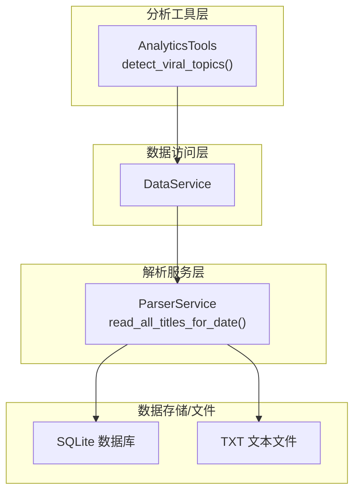
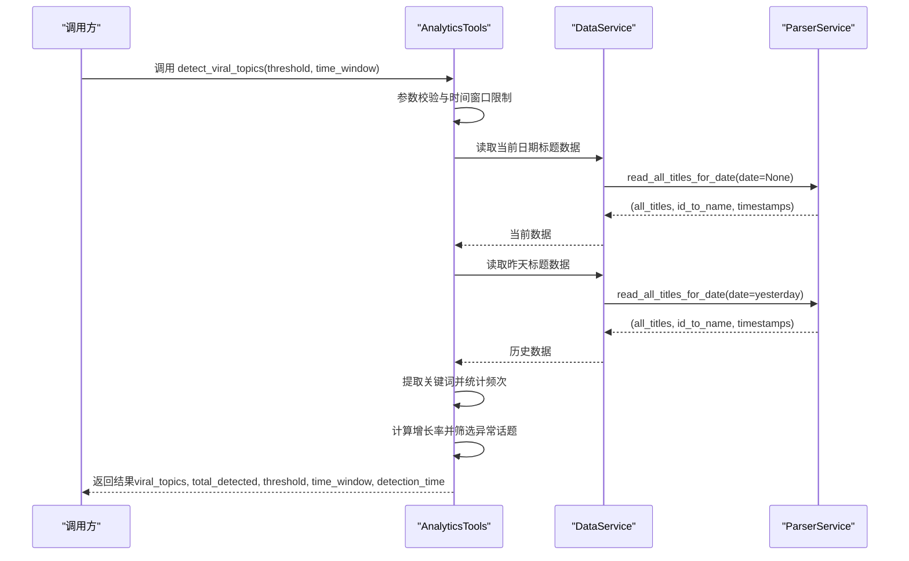
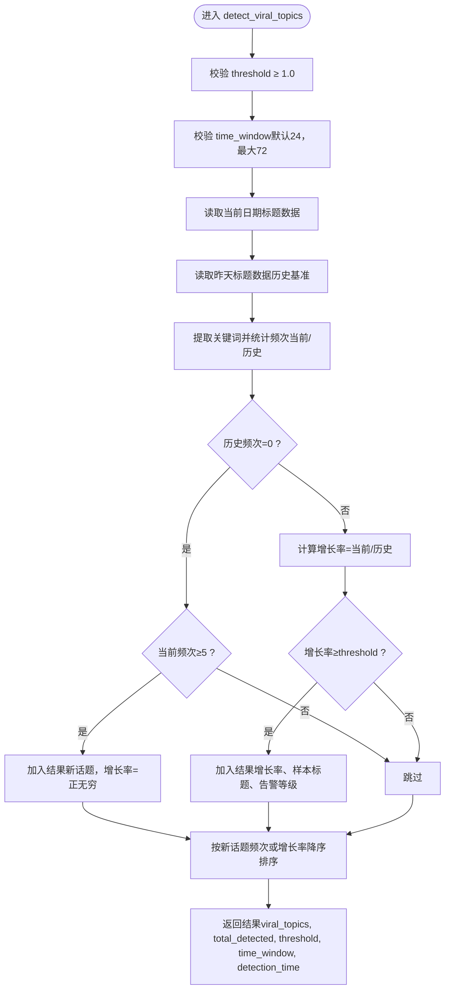
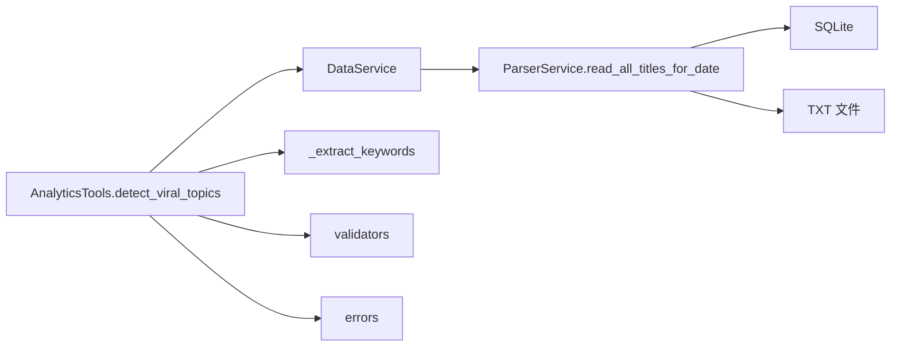

# 异常热度检测

<cite>
**本文引用的文件**
- [analytics.py](file://mcp_server/tools/analytics.py)
- [parser_service.py](file://mcp_server/services/parser_service.py)
- [data_service.py](file://mcp_server/services/data_service.py)
- [validators.py](file://mcp_server/utils/validators.py)
- [errors.py](file://mcp_server/utils/errors.py)
- [_extract_keywords](file://mcp_server/tools/analytics.py#L1921-L1947)
- [detect_viral_topics](file://mcp_server/tools/analytics.py#L1621-L1755)
- [read_all_titles_for_date](file://mcp_server/services/parser_service.py#L460-L520)
</cite>

## 目录
1. [简介](#简介)
2. [项目结构](#项目结构)
3. [核心组件](#核心组件)
4. [架构总览](#架构总览)
5. [详细组件分析](#详细组件分析)
6. [依赖关系分析](#依赖关系分析)
7. [性能考量](#性能考量)
8. [故障排查指南](#故障排查指南)
9. [结论](#结论)

## 简介
本文件围绕 `detect_viral_topics` 方法进行深入技术文档编写，目标是帮助读者理解该方法如何在短时间内识别“病毒式传播”话题（即异常热度突增）。文档将详细解释输入参数 threshold（热度突增倍数阈值，默认3.0）与 time_window（检测时间窗口小时数，默认24）的算法逻辑，说明如何计算当前热度与历史平均热度的比值，如何扫描近期数据并发现增长率超过阈值的话题；同时给出输出结果中突发话题列表、增长率与相关样本标题的含义，并提供使用示例与实时热点捕捉建议。

## 项目结构
- 本方法位于 MCP Server 的分析工具模块中，属于上层业务工具层，负责对外提供统一的分析能力。
- 数据来源由解析服务封装，解析服务会优先从 SQLite 读取，若不存在则回退到本地 TXT 文件；并提供缓存机制以提升性能。
- 参数校验与错误处理由工具层与通用工具模块提供，保证调用方传入参数合法且错误可诊断。

图表来源
- [analytics.py](file://mcp_server/tools/analytics.py#L1621-L1755)
- [data_service.py](file://mcp_server/services/data_service.py#L1-L624)
- [parser_service.py](file://mcp_server/services/parser_service.py#L460-L520)

章节来源
- [analytics.py](file://mcp_server/tools/analytics.py#L1621-L1755)
- [data_service.py](file://mcp_server/services/data_service.py#L1-L624)
- [parser_service.py](file://mcp_server/services/parser_service.py#L460-L520)

## 核心组件
- AnalyticsTools.detect_viral_topics：异常热度检测的核心入口，负责参数校验、数据读取、关键词提取、增长率计算与结果组织。
- DataService：统一的数据访问服务，封装缓存、平台过滤、日期范围等逻辑。
- ParserService.read_all_titles_for_date：按日期读取所有标题数据，支持缓存与回退策略。
- validators：参数校验工具，包括阈值、时间窗口、日期范围等。
- errors：统一错误类型，便于上层捕获与反馈。

章节来源
- [analytics.py](file://mcp_server/tools/analytics.py#L1621-L1755)
- [data_service.py](file://mcp_server/services/data_service.py#L1-L624)
- [parser_service.py](file://mcp_server/services/parser_service.py#L460-L520)
- [validators.py](file://mcp_server/utils/validators.py#L1-L352)
- [errors.py](file://mcp_server/utils/errors.py#L1-L94)

## 架构总览
异常热度检测的整体流程如下：
- 输入参数 threshold 与 time_window 进行校验；
- 读取“当前日期”的全部标题数据；
- 读取“昨天”的全部标题数据作为历史基准；
- 对标题进行关键词提取；
- 统计关键词在当前与历史阶段的出现频次；
- 计算增长率（当前/历史），并根据阈值筛选异常话题；
- 输出包含突发话题列表、增长率、样本标题与检测时间等字段的结果。

图表来源
- [detect_viral_topics](file://mcp_server/tools/analytics.py#L1621-L1755)
- [read_all_titles_for_date](file://mcp_server/services/parser_service.py#L460-L520)
- [data_service.py](file://mcp_server/services/data_service.py#L1-L624)

## 详细组件分析

### detect_viral_topics 方法详解
- 方法签名与职责
  - 方法位于 [detect_viral_topics](file://mcp_server/tools/analytics.py#L1621-L1755)，用于自动识别“突然爆火”的话题。
- 输入参数
  - threshold：热度突增倍数阈值，默认3.0。当增长率≥threshold时，视为异常热点。
  - time_window：检测时间窗口（小时），默认24。方法内部会对其进行上限校验（最大72小时）。
- 参数校验
  - threshold 必须 ≥1.0；否则抛出参数错误。
  - time_window 通过统一校验工具限制默认24、最大72。
- 数据读取
  - 当前数据：调用数据服务读取“今天”的全部标题数据。
  - 历史数据：调用数据服务读取“昨天”的全部标题数据；若历史数据缺失，将被视为空集合。
- 关键词提取与统计
  - 使用内部关键词提取方法对标题进行清洗与分词，得到关键词集合。
  - 统计当前与历史阶段的关键词频次，形成 Counter。
- 增长率计算与筛选
  - 对每个关键词，计算当前频次与历史频次的比值：
    - 若历史频次为0：
      - 若当前频次≥5，则判定为“新话题”，增长率为正无穷，并纳入结果；
      - 否则跳过。
    - 若历史频次>0：增长率为当前/历史，若≥threshold则纳入结果。
  - 结果中还包含“告警等级”字段：若增长率>threshold×2，则标记为“高”，否则为“中”。
- 排序与输出
  - 按“新话题”（当前频次）或“增长率”降序排列；
  - 输出字段包含：
    - viral_topics：突发话题列表，每项包含关键词、当前频次、历史频次、增长率、样本标题、告警等级；
    - total_detected：检测到的异常话题总数；
    - threshold、time_window：本次检测使用的阈值与时间窗口；
    - detection_time：检测时间；
    - 若未检测到异常话题，返回提示信息。

图表来源
- [detect_viral_topics](file://mcp_server/tools/analytics.py#L1621-L1755)

章节来源
- [detect_viral_topics](file://mcp_server/tools/analytics.py#L1621-L1755)

### 关键词提取方法
- 方法位于 [_extract_keywords](file://mcp_server/tools/analytics.py#L1921-L1947)，用于从标题中提取关键词：
  - 去除URL与特殊字符；
  - 按空格与常见中文分隔符切分；
  - 过滤停用词与长度小于最小值的词；
  - 返回关键词列表。
- 该方法直接影响 detect_viral_topics 的关键词覆盖率与稳定性。

章节来源
- [_extract_keywords](file://mcp_server/tools/analytics.py#L1921-L1947)

### 数据读取与缓存
- ParserService.read_all_titles_for_date：
  - 支持按日期读取，优先从 SQLite 读取，不存在则回退到 TXT；
  - 对“今天”与“历史日期”分别设置不同的缓存时间；
  - 返回 all_titles、id_to_name、timestamps 三元组。
- DataService：
  - 封装了 get_latest_news、get_news_by_date、search_news_by_keyword、get_trending_topics 等常用查询；
  - 在 detect_viral_topics 中直接复用 read_all_titles_for_date 的能力。

章节来源
- [read_all_titles_for_date](file://mcp_server/services/parser_service.py#L460-L520)
- [data_service.py](file://mcp_server/services/data_service.py#L1-L624)

### 参数校验与错误处理
- validators：
  - validate_limit：限制 time_window 等数值型参数；
  - validate_date_range：日期范围校验；
  - validate_keyword：关键词校验；
  - validate_mode、validate_platforms 等辅助校验。
- errors：
  - InvalidParameterError：参数非法；
  - DataNotFoundError：数据不存在；
  - MCPError：统一错误基类，提供 to_dict 便于上层处理。

章节来源
- [validators.py](file://mcp_server/utils/validators.py#L1-L352)
- [errors.py](file://mcp_server/utils/errors.py#L1-L94)

## 依赖关系分析
- detect_viral_topics 依赖：
  - 数据服务：读取当前与历史标题数据；
  - 关键词提取：对标题进行分词与过滤；
  - 参数校验：threshold、time_window、日期范围等；
  - 错误处理：统一捕获与返回。
- ParserService 与 SQLite/TXT：
  - 采用“先SQLite后TXT”的回退策略，并带有缓存；
  - 为上层分析工具提供稳定的数据读取能力。

图表来源
- [detect_viral_topics](file://mcp_server/tools/analytics.py#L1621-L1755)
- [read_all_titles_for_date](file://mcp_server/services/parser_service.py#L460-L520)
- [validators.py](file://mcp_server/utils/validators.py#L1-L352)
- [errors.py](file://mcp_server/utils/errors.py#L1-L94)

章节来源
- [detect_viral_topics](file://mcp_server/tools/analytics.py#L1621-L1755)
- [read_all_titles_for_date](file://mcp_server/services/parser_service.py#L460-L520)

## 性能考量
- 缓存策略：
  - ParserService 对“今天”数据使用较短缓存（约15分钟），以适配实时增量；
  - 对历史数据使用较长缓存（约1小时），减少重复IO。
- IO与解析成本：
  - 关键词提取与Counter统计为线性复杂度，与标题数量成正比；
  - 增长率比较与排序为 O(N log N)，N为关键词种类数。
- 建议：
  - 在高频调用场景下，合理设置 time_window 与阈值，避免过度扫描；
  - 对于大规模数据，可考虑分批处理或引入索引（当前实现为纯内存统计）。

[本节为通用性能讨论，不直接分析具体文件，故无章节来源]

## 故障排查指南
- 常见错误与定位
  - 参数错误：threshold<1.0 或 time_window 超限，将抛出 InvalidParameterError；
  - 数据不存在：若指定日期无数据，将抛出 DataNotFoundError；
  - 内部异常：捕获后统一包装为包含错误码与消息的字典返回。
- 排查步骤
  - 确认日期与平台配置正确；
  - 检查 output 目录是否存在对应日期文件夹；
  - 观察返回字典中的 success 与 error 字段，按需参考 suggestion。
- 相关实现参考
  - 参数校验与错误封装：参见 validators 与 errors；
  - 数据读取与回退：参见 ParserService.read_all_titles_for_date；
  - 异常捕获与返回：参见 detect_viral_topics 的 try-except 分支。

章节来源
- [validators.py](file://mcp_server/utils/validators.py#L1-L352)
- [errors.py](file://mcp_server/utils/errors.py#L1-L94)
- [read_all_titles_for_date](file://mcp_server/services/parser_service.py#L460-L520)
- [detect_viral_topics](file://mcp_server/tools/analytics.py#L1621-L1755)

## 结论
- detect_viral_topics 提供了一种简单而稳健的异常热度检测方案：以关键词频次为指标，通过“当前/历史”的比值快速识别短期内显著增长的话题。
- threshold 与 time_window 的组合决定了检测灵敏度与覆盖面，建议结合业务场景调整默认值。
- 该方法与解析服务、数据服务、参数校验与错误处理形成清晰的分层，具备良好的可维护性与扩展性。

[本节为总结性内容，不直接分析具体文件，故无章节来源]