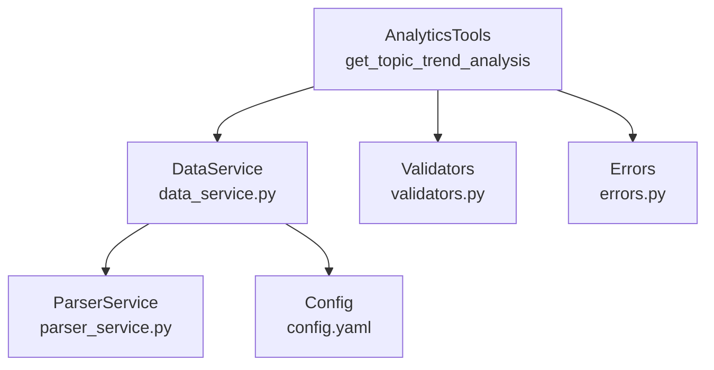
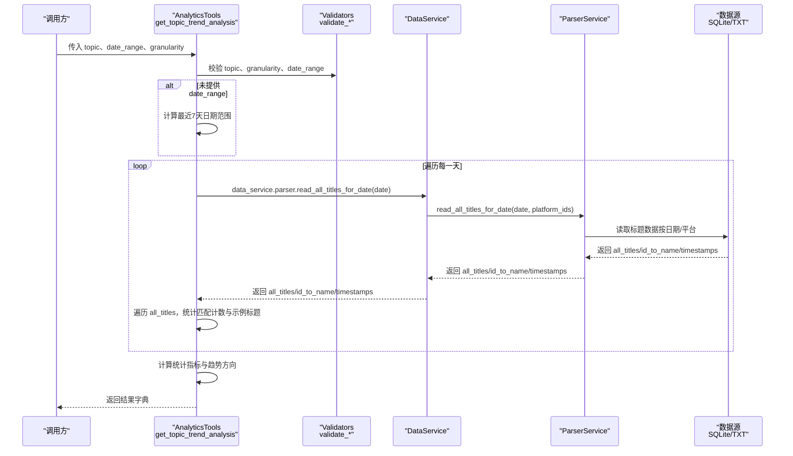
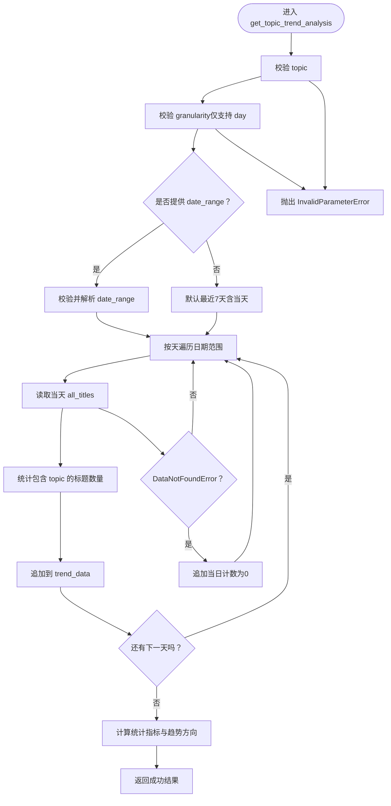
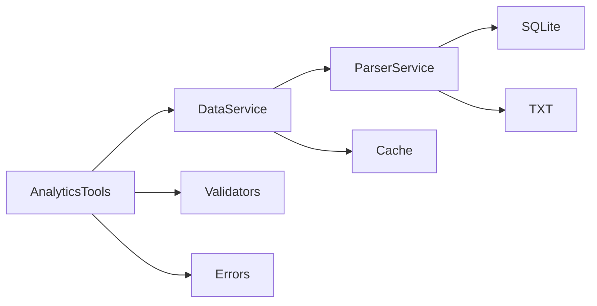

# 热度趋势分析

<cite>
**本文引用的文件**
- [analytics.py](file://mcp_server/tools/analytics.py)
- [data_service.py](file://mcp_server/services/data_service.py)
- [parser_service.py](file://mcp_server/services/parser_service.py)
- [validators.py](file://mcp_server/utils/validators.py)
- [errors.py](file://mcp_server/utils/errors.py)
- [config.yaml](file://config/config.yaml)
</cite>

## 目录
1. [简介](#简介)
2. [项目结构](#项目结构)
3. [核心组件](#核心组件)
4. [架构总览](#架构总览)
5. [详细组件分析](#详细组件分析)
6. [依赖关系分析](#依赖关系分析)
7. [性能考量](#性能考量)
8. [故障排查指南](#故障排查指南)
9. [结论](#结论)
10. [附录](#附录)

## 简介
本文件面向“热度趋势分析”能力，聚焦于方法 get_topic_trend_analysis 的使用说明与实现细节。该方法用于追踪特定话题在指定时间范围内的热度变化趋势，核心输入包括：
- topic：话题关键词
- date_range：日期范围（可选，默认最近7天）
- granularity：时间粒度（当前仅支持“day”，即按天聚合）

输出结果包含：
- trend_data：按天统计的每日计数与少量示例标题
- statistics：统计指标（总提及数、平均提及数、峰值、峰值时间、涨跌幅）
- trend_direction：趋势方向（上升/下降/稳定）

方法通过 DataService 读取历史标题数据，基于关键词匹配进行计数，并在日期范围缺失时自动回填最近7天。

## 项目结构
围绕热度趋势分析的关键文件与职责如下：
- mcp_server/tools/analytics.py：提供 AnalyticsTools 类，包含 get_topic_trend_analysis 方法与统一分析入口 analyze_topic_trend_unified
- mcp_server/services/data_service.py：提供 DataService，封装数据访问与缓存，暴露 get_news_by_date、search_news_by_keyword 等；核心读取入口 read_all_titles_for_date 由解析器服务完成
- mcp_server/services/parser_service.py：提供 ParserService，负责从 SQLite/TXT 等数据源读取标题数据，支持按日期与平台过滤
- mcp_server/utils/validators.py：参数校验工具，如 validate_keyword、validate_date_range、validate_limit 等
- mcp_server/utils/errors.py：自定义错误类型，如 InvalidParameterError、DataNotFoundError 等
- config/config.yaml：平台与权重等配置，影响平台支持与权重计算

图表来源
- [analytics.py](file://mcp_server/tools/analytics.py#L75-L120)
- [data_service.py](file://mcp_server/services/data_service.py#L17-L33)
- [parser_service.py](file://mcp_server/services/parser_service.py#L460-L520)
- [validators.py](file://mcp_server/utils/validators.py#L123-L210)
- [errors.py](file://mcp_server/utils/errors.py#L10-L50)
- [config.yaml](file://config/config.yaml#L163-L187)

章节来源
- [analytics.py](file://mcp_server/tools/analytics.py#L75-L120)
- [data_service.py](file://mcp_server/services/data_service.py#L17-L33)
- [parser_service.py](file://mcp_server/services/parser_service.py#L460-L520)
- [validators.py](file://mcp_server/utils/validators.py#L123-L210)
- [errors.py](file://mcp_server/utils/errors.py#L10-L50)
- [config.yaml](file://config/config.yaml#L163-L187)

## 核心组件
- AnalyticsTools：封装高级分析工具，其中 get_topic_trend_analysis 负责热度趋势分析；analyze_topic_trend_unified 作为统一入口，根据 analysis_type 分派到不同分析模式
- DataService：统一数据访问层，持有 ParserService 与缓存；对外提供 get_latest_news、get_news_by_date、search_news_by_keyword、get_trending_topics 等
- ParserService：具体数据读取实现，read_all_titles_for_date 支持按日期与平台过滤，优先从 SQLite 读取，其次从 TXT 读取，不存在则抛出 DataNotFoundError
- Validators：参数校验，如 validate_keyword、validate_date_range、validate_limit 等
- Errors：统一错误类型，便于上层捕获与返回

章节来源
- [analytics.py](file://mcp_server/tools/analytics.py#L75-L120)
- [data_service.py](file://mcp_server/services/data_service.py#L17-L33)
- [parser_service.py](file://mcp_server/services/parser_service.py#L460-L520)
- [validators.py](file://mcp_server/utils/validators.py#L123-L210)
- [errors.py](file://mcp_server/utils/errors.py#L10-L50)

## 架构总览
下图展示了 get_topic_trend_analysis 的调用链路与数据流：

图表来源
- [analytics.py](file://mcp_server/tools/analytics.py#L242-L398)
- [data_service.py](file://mcp_server/services/data_service.py#L17-L33)
- [parser_service.py](file://mcp_server/services/parser_service.py#L460-L520)
- [validators.py](file://mcp_server/utils/validators.py#L123-L210)

## 详细组件分析

### 方法：get_topic_trend_analysis
- 输入参数
  - topic：话题关键词，必填。将通过 validate_keyword 校验，长度限制与空白字符处理均在此处完成
  - date_range：日期范围，格式 {"start": "YYYY-MM-DD", "end": "YYYY-MM-DD"}，可选。若未提供，默认回填最近7天（包含当天）
  - granularity：时间粒度，当前仅支持 "day"。若传入其他值，将抛出 InvalidParameterError
- 数据读取
  - 通过 DataService.data_service.parser.read_all_titles_for_date 按日期读取标题数据
  - 该方法内部优先从 SQLite 读取，若不存在则回退到 TXT；若仍不存在则抛出 DataNotFoundError
- 统计逻辑
  - 对每一天的 all_titles 遍历，统计标题中包含 topic 的数量，形成每日计数
  - 记录匹配到的示例标题（最多3条），便于快速核验
  - 若某日无数据，按 DataNotFoundError 处理，写入当日计数为0
- 统计指标与趋势方向
  - total_mentions：所有天数计数之和
  - average_mentions：总提及数除以天数（四舍五入两位）
  - peak_count：最高单日计数
  - peak_time：峰值对应的日期
  - change_rate：基于首末非零值计算的涨跌幅百分比
  - trend_direction：当 change_rate > 10 视为“上升”，change_rate < -10 视为“下降”，否则“稳定”
- 输出结构
  - success：布尔值，成功时为 True
  - topic、date_range、granularity：原始输入与推导出的日期范围
  - trend_data：数组，元素包含 date、count、sample_titles
  - statistics：包含 total_mentions、average_mentions、peak_count、peak_time、change_rate
  - trend_direction：字符串（中文）

图表来源
- [analytics.py](file://mcp_server/tools/analytics.py#L242-L398)
- [validators.py](file://mcp_server/utils/validators.py#L123-L210)
- [errors.py](file://mcp_server/utils/errors.py#L41-L50)

章节来源
- [analytics.py](file://mcp_server/tools/analytics.py#L242-L398)
- [validators.py](file://mcp_server/utils/validators.py#L123-L210)
- [errors.py](file://mcp_server/utils/errors.py#L41-L50)

### 统一入口：analyze_topic_trend_unified
- 作用：根据 analysis_type 分派到不同分析模式，其中 trend 模式即调用 get_topic_trend_analysis
- 支持模式：trend、lifecycle、viral、predict
- 参数：topic、analysis_type、date_range、granularity、threshold、time_window、lookahead_hours、confidence_threshold
- 返回：统一的结果字典，包含 success 与 error 字段（当捕获 MCPError 或 Exception 时）

章节来源
- [analytics.py](file://mcp_server/tools/analytics.py#L154-L241)

### 数据读取与缓存：DataService 与 ParserService
- DataService.data_service.parser.read_all_titles_for_date
  - 优先从 SQLite 读取，若不存在则回退到 TXT
  - 支持按日期与平台过滤
  - 今日数据缓存 15 分钟，历史数据缓存 1 小时
  - 若无数据，抛出 DataNotFoundError
- ParserService
  - 提供 get_date_folder_name、_find_date_folder 等辅助方法，确保日期文件夹存在
  - parse_yaml_config、parse_frequency_words 等配置解析能力

章节来源
- [data_service.py](file://mcp_server/services/data_service.py#L460-L520)
- [parser_service.py](file://mcp_server/services/parser_service.py#L460-L520)

### 参数验证与错误处理
- validate_keyword：关键词非空、类型校验、长度限制、空白字符处理
- validate_date_range：start/end 字段存在性、日期格式、起止先后、未来日期限制、可用日期范围提示
- InvalidParameterError：参数非法时抛出，包含 code、message、suggestion
- DataNotFoundError：数据不存在时抛出，包含 code、message、suggestion

章节来源
- [validators.py](file://mcp_server/utils/validators.py#L123-L210)
- [errors.py](file://mcp_server/utils/errors.py#L10-L50)

## 依赖关系分析
- AnalyticsTools 依赖
  - DataService：用于读取标题数据
  - Validators：参数校验
  - Errors：错误类型
- DataService 依赖
  - ParserService：具体数据读取
  - 缓存：提升读取性能
- ParserService 依赖
  - SQLite/TXT 数据源
  - 配置文件解析能力

图表来源
- [analytics.py](file://mcp_server/tools/analytics.py#L75-L120)
- [data_service.py](file://mcp_server/services/data_service.py#L17-L33)
- [parser_service.py](file://mcp_server/services/parser_service.py#L460-L520)

章节来源
- [analytics.py](file://mcp_server/tools/analytics.py#L75-L120)
- [data_service.py](file://mcp_server/services/data_service.py#L17-L33)
- [parser_service.py](file://mcp_server/services/parser_service.py#L460-L520)

## 性能考量
- 缓存策略
  - 今日数据缓存 15 分钟，历史数据缓存 1 小时，减少重复 IO
- 读取顺序
  - 优先 SQLite，其次 TXT，避免跨文件系统扫描
- 循环开销
  - 按天循环读取，注意 date_range 较大时的总 IO 成本
- 建议
  - 合理设置 date_range，避免不必要的长跨度查询
  - 在高频调用场景下，考虑复用结果或增加上层缓存

章节来源
- [data_service.py](file://mcp_server/services/data_service.py#L460-L520)

## 故障排查指南
- 常见错误与处理
  - 参数非法：InvalidParameterError（如 granularity 非 "day"、date_range 格式错误、topic 非法）
  - 数据不存在：DataNotFoundError（如日期未来、无对应数据）
- 定位步骤
  - 检查 date_range 是否在未来或超出可用范围
  - 确认 topic 是否为空或超长
  - 确认目标日期是否存在数据（可通过 get_available_date_range 获取可用范围）
- 建议
  - 使用 analyze_topic_trend_unified 的统一入口，便于集中处理错误
  - 在调用前先调用 get_available_date_range 获取可用日期范围

章节来源
- [validators.py](file://mcp_server/utils/validators.py#L123-L210)
- [errors.py](file://mcp_server/utils/errors.py#L30-L50)
- [data_service.py](file://mcp_server/services/data_service.py#L498-L528)

## 结论
get_topic_trend_analysis 提供了稳定、可扩展的热度趋势分析能力。其关键特性包括：
- 明确的输入约束与默认行为（未提供日期范围时默认最近7天）
- 严谨的参数校验与错误处理
- 基于关键词匹配的每日计数统计与趋势指标计算
- 与数据层的清晰解耦与缓存优化

在实际使用中，建议结合 analyze_topic_trend_unified 的统一入口，配合参数校验与错误处理，获得一致的用户体验。

## 附录

### 输入参数与默认行为
- topic：必填，字符串，长度限制与空白字符处理由 validate_keyword 执行
- date_range：可选，字典 {"start": "YYYY-MM-DD", "end": "YYYY-MM-DD"}，未提供时默认最近7天
- granularity：可选，当前仅支持 "day"

章节来源
- [analytics.py](file://mcp_server/tools/analytics.py#L242-L398)
- [validators.py](file://mcp_server/utils/validators.py#L123-L210)

### 输出字段说明
- trend_data：数组，元素包含
  - date：日期字符串（YYYY-MM-DD）
  - count：该日匹配计数
  - sample_titles：匹配到的标题示例（最多3条）
- statistics：包含
  - total_mentions：总提及数
  - average_mentions：平均提及数（四舍五入两位）
  - peak_count：峰值计数
  - peak_time：峰值日期
  - change_rate：涨跌幅百分比
- trend_direction：趋势方向（上升/下降/稳定）

章节来源
- [analytics.py](file://mcp_server/tools/analytics.py#L344-L398)

### 实际使用示例
- 分析“人工智能”过去一周的热度趋势
  - 输入：topic="人工智能"，date_range={"start": "YYYY-MM-DD", "end": "YYYY-MM-DD"}，granularity="day"
  - 输出：包含 trend_data、statistics、trend_direction 的 JSON 结果
- 分析“特斯拉”2024年12月的热度趋势
  - 输入：topic="特斯拉"，date_range={"start": "2024-12-01", "end": "2024-12-31"}，granularity="day"
  - 输出：同上

章节来源
- [analytics.py](file://mcp_server/tools/analytics.py#L242-L398)

### JSON 返回结构示意
- 成功时返回
  - success: true
  - topic: "话题关键词"
  - date_range: {start: "YYYY-MM-DD", end: "YYYY-MM-DD", total_days: N}
  - granularity: "day"
  - trend_data: [{date: "YYYY-MM-DD", count: N, sample_titles: [...]}, ...]
  - statistics: {total_mentions: N, average_mentions: X.XX, peak_count: N, peak_time: "YYYY-MM-DD", change_rate: ±XX.XX}
  - trend_direction: "上升"/"下降"/"稳定"
- 失败时返回
  - success: false
  - error: {code: "...", message: "...", suggestion?: "..."}

章节来源
- [analytics.py](file://mcp_server/tools/analytics.py#L344-L398)
- [errors.py](file://mcp_server/utils/errors.py#L10-L50)