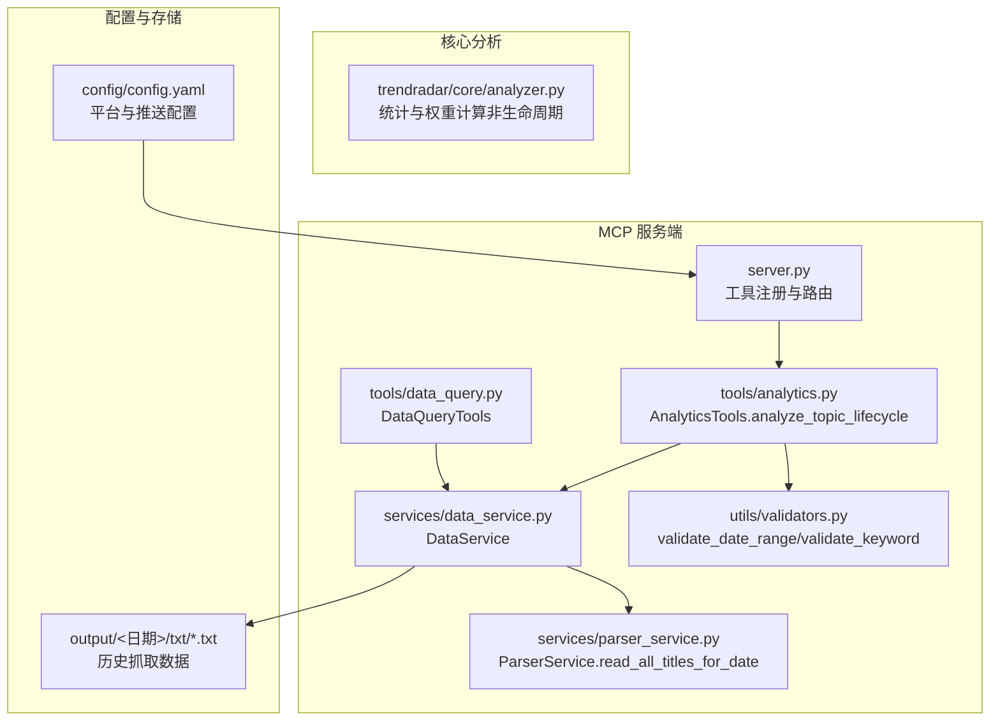
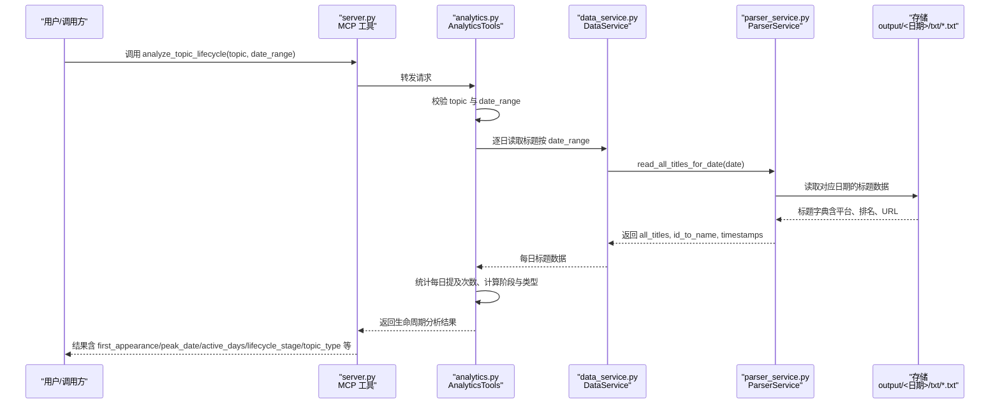
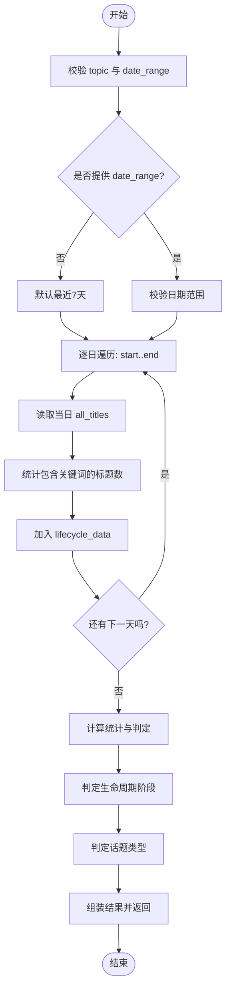
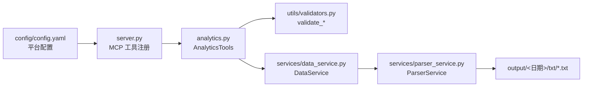

# 生命周期分析

<cite>
**本文引用的文件**
- [mcp_server/tools/analytics.py](file://mcp_server/tools/analytics.py)
- [mcp_server/services/data_service.py](file://mcp_server/services/data_service.py)
- [mcp_server/services/parser_service.py](file://mcp_server/services/parser_service.py)
- [mcp_server/utils/validators.py](file://mcp_server/utils/validators.py)
- [mcp_server/server.py](file://mcp_server/server.py)
- [config/config.yaml](file://config/config.yaml)
</cite>

## 目录
1. [简介](#简介)
2. [项目结构](#项目结构)
3. [核心组件](#核心组件)
4. [架构总览](#架构总览)
5. [详细组件分析](#详细组件分析)
6. [依赖关系分析](#依赖关系分析)
7. [性能考量](#性能考量)
8. [故障排查指南](#故障排查指南)
9. [结论](#结论)
10. [附录](#附录)

## 简介
本文件围绕 `analyze_topic_lifecycle` 方法提供深入、可操作的技术文档，目标是帮助用户理解“话题从出现到消失”的完整生命周期分析能力。文档将详细说明输入参数 topic 与 date_range 的作用、方法如何遍历指定时间范围内的每日数据以识别首次出现、峰值时间与消失时间，以及生命周期阶段（萌芽、上升、高峰、衰退、消失）与话题类型（昙花一现、持续热点、周期性热点）的判定逻辑。同时给出使用示例，如分析“特斯拉”本月的生命周期，并解释如何依据返回的生命周期阶段制定内容策略。

## 项目结构
本仓库采用分层与模块化的组织方式：
- mcp_server：MCP 服务端工具与接口层，包含数据分析工具、数据查询工具、解析与缓存服务、参数校验与错误处理等。
- trendradar：核心分析与统计模块（如词频统计、权重计算等），与 MCP 层解耦。
- config：系统配置，包括平台列表、存储与推送配置等。
- output：历史抓取数据的本地存储目录（按日期组织）。

图表来源
- [mcp_server/server.py](file://mcp_server/server.py#L1-L120)
- [mcp_server/tools/analytics.py](file://mcp_server/tools/analytics.py#L1460-L1659)
- [mcp_server/services/data_service.py](file://mcp_server/services/data_service.py#L1-L200)
- [mcp_server/services/parser_service.py](file://mcp_server/services/parser_service.py#L461-L485)
- [mcp_server/utils/validators.py](file://mcp_server/utils/validators.py#L145-L200)
- [config/config.yaml](file://config/config.yaml#L163-L187)

章节来源
- [mcp_server/server.py](file://mcp_server/server.py#L1-L120)
- [config/config.yaml](file://config/config.yaml#L163-L187)

## 核心组件
- AnalyticsTools.analyze_topic_lifecycle：生命周期分析的核心入口，负责参数校验、日期范围解析、逐日数据采集、统计与阶段/类型判定、结果组装。
- DataService：统一数据访问层，封装缓存与解析服务，提供按日期读取标题的能力。
- ParserService.read_all_titles_for_date：从本地存储按日期读取所有标题（含平台维度、排名、URL 等元信息）。
- Validators.validate_date_range / validate_keyword：参数校验工具，保证日期范围合法与关键词有效。
- DataQueryTools：通用数据查询工具（与生命周期分析同属 MCP 工具集），用于检索新闻、按关键词搜索等。

章节来源
- [mcp_server/tools/analytics.py](file://mcp_server/tools/analytics.py#L1460-L1659)
- [mcp_server/services/data_service.py](file://mcp_server/services/data_service.py#L1-L200)
- [mcp_server/services/parser_service.py](file://mcp_server/services/parser_service.py#L461-L485)
- [mcp_server/utils/validators.py](file://mcp_server/utils/validators.py#L145-L200)

## 架构总览
生命周期分析的调用链路如下：
- 用户通过 MCP 工具调用 analyze_topic_lifecycle(topic, date_range)
- AnalyticsTools 校验参数并解析日期范围
- 通过 DataService 调用 ParserService.read_all_titles_for_date 按日读取标题
- 统计每日包含关键词的新闻数量，得到生命周期序列
- 基于序列计算首次出现、最后出现、峰值、活跃天数、平均提及次数
- 判定生命周期阶段与话题类型
- 返回结构化结果

图表来源
- [mcp_server/server.py](file://mcp_server/server.py#L1-L120)
- [mcp_server/tools/analytics.py](file://mcp_server/tools/analytics.py#L1460-L1659)
- [mcp_server/services/data_service.py](file://mcp_server/services/data_service.py#L1-L200)
- [mcp_server/services/parser_service.py](file://mcp_server/services/parser_service.py#L461-L485)

## 详细组件分析

### analyze_topic_lifecycle 方法详解
- 输入参数
  - topic：话题关键词（必需）。方法会对关键词进行校验，确保输入有效。
  - date_range：可选日期范围，格式为 {"start": "YYYY-MM-DD", "end": "YYYY-MM-DD"}。若未提供，默认回溯最近7天。
- 数据采集
  - 逐日遍历：从起始日期到结束日期，每天调用 DataService.ParserService.read_all_titles_for_date 获取该日所有标题。
  - 统计规则：对每个标题，若标题包含关键词（不区分大小写），则计入当日提及次数。
  - 缺失处理：当某日无数据时，计入 0 次。
- 统计与判定
  - 首次出现/最后出现：分别取第一个与最后一个 count > 0 的日期。
  - 峰值：max(count)，并记录对应日期。
  - 平均提及：仅对 count > 0 的非零天数求平均。
  - 生命周期阶段：
    - 上升期：最近3天的提及总量 > 前3天总量
    - 衰退期：最近3天的总量 < 前3天总量的一半
    - 爆发期：峰值出现在最近3天
    - 否则为稳定期
  - 话题类型：
    - 昙花一现：活跃天数 ≤ 2 且峰值 > 平均值的2倍
    - 持续热点：活跃天数 ≥ 总天数的60%
    - 周期性热点：其余情况
- 输出结果
  - 成功标志与错误包装：成功时返回 success=True；异常时返回 success=False 与错误信息。
  - 结果字段：
    - topic：关键词
    - date_range：包含 start、end、total_days
    - lifecycle_data：每日 count 列表
    - analysis：
      - first_appearance、last_appearance、peak_date、peak_count
      - active_days、avg_daily_mentions
      - lifecycle_stage、topic_type

图表来源
- [mcp_server/tools/analytics.py](file://mcp_server/tools/analytics.py#L1460-L1659)

章节来源
- [mcp_server/tools/analytics.py](file://mcp_server/tools/analytics.py#L1460-L1659)

### 参数与日期范围说明
- topic
  - 作用：作为关键词在标题中进行模糊匹配（不区分大小写），用于统计每日提及次数。
  - 校验：通过 validate_keyword 进行合法性检查，防止注入或非法字符。
- date_range
  - 作用：限定分析的时间窗口；若未提供，默认最近7天。
  - 校验：validate_date_range 要求包含 start 与 end，且 start ≤ end；同时检查日期不得晚于当前可用数据的最后日期。
- 默认行为
  - 若在指定范围内未发现任何提及，抛出 DataNotFoundError 并建议扩大时间范围或更换关键词。

章节来源
- [mcp_server/utils/validators.py](file://mcp_server/utils/validators.py#L145-L200)
- [mcp_server/tools/analytics.py](file://mcp_server/tools/analytics.py#L1460-L1659)

### 生命周期阶段与话题类型的判定逻辑
- 生命周期阶段
  - 上升期：recent_sum > early_sum
  - 衰退期：recent_sum < early_sum * 0.5
  - 爆发期：peak_in_recent = True
  - 否则稳定期
- 话题类型
  - 昙花一现：active_days ≤ 2 且 peak > avg * 2
  - 持续热点：active_days ≥ total_days * 0.6
  - 周期性热点：其他情况

这些规则帮助用户快速识别话题的短期波动与长期趋势，从而制定相应的内容策略。

章节来源
- [mcp_server/tools/analytics.py](file://mcp_server/tools/analytics.py#L1460-L1659)

### 使用示例与策略建议
- 示例：分析“特斯拉”本月的生命周期
  - 步骤建议：
    1) 使用 resolve_date_range("本月") 获取标准日期范围
    2) 调用 analyze_topic_lifecycle(topic="特斯拉", date_range=上一步返回的日期范围)
    3) 查看 lifecycle_stage 与 topic_type，结合 peak_date 与 active_days 制定策略
- 策略建议（基于返回的生命周期阶段）
  - 上升期：加大内容密度，配合热点事件与话题预热，提升曝光
  - 爆发期：集中资源做深度解读与二次传播，延长生命周期
  - 稳定期：维持节奏，沉淀高质量内容，引导讨论
  - 衰退期：减少投入，聚焦沉淀与复盘，为下一轮周期做准备
- 话题类型参考
  - 昙花一现：适合短平快内容，快速收割流量，避免长期投入
  - 持续热点：建立系列化内容，持续跟进，形成长期影响力
  - 周期性热点：把握周期节点，提前布局，形成规律性产出

章节来源
- [mcp_server/server.py](file://mcp_server/server.py#L248-L272)
- [mcp_server/tools/analytics.py](file://mcp_server/tools/analytics.py#L1460-L1659)

## 依赖关系分析
- 组件耦合
  - AnalyticsTools.analyze_topic_lifecycle 依赖 DataService 与 ParserService，实现数据读取与缓存。
  - 参数校验依赖 Validators.validate_date_range 与 validate_keyword。
  - 平台配置来源于 config/config.yaml，影响可用平台与推送等行为。
- 外部依赖
  - 本地存储：output/<日期>/txt/*.txt，按日期组织，解析服务按日期读取。
  - MCP 工具注册：server.py 注册工具，统一对外暴露。

图表来源
- [mcp_server/tools/analytics.py](file://mcp_server/tools/analytics.py#L1460-L1659)
- [mcp_server/utils/validators.py](file://mcp_server/utils/validators.py#L145-L200)
- [mcp_server/services/data_service.py](file://mcp_server/services/data_service.py#L1-L200)
- [mcp_server/services/parser_service.py](file://mcp_server/services/parser_service.py#L461-L485)
- [mcp_server/server.py](file://mcp_server/server.py#L1-L120)
- [config/config.yaml](file://config/config.yaml#L163-L187)

章节来源
- [mcp_server/server.py](file://mcp_server/server.py#L1-L120)
- [config/config.yaml](file://config/config.yaml#L163-L187)

## 性能考量
- 时间复杂度
  - 每日读取标题并遍历统计，整体约为 O(D*N)，其中 D 为天数，N 为当日标题数量。
- 缓存策略
  - DataService 在读取最新新闻与按日期读取新闻时使用缓存，减少重复 IO。
- I/O 优化
  - ParserService.read_all_titles_for_date 支持按日期与平台过滤，避免不必要的全量扫描。
- 建议
  - 合理设置 date_range，避免过大范围导致遍历成本过高。
  - 对频繁查询的日期范围可考虑本地缓存策略（如在业务层增加缓存）。

章节来源
- [mcp_server/services/data_service.py](file://mcp_server/services/data_service.py#L1-L200)
- [mcp_server/services/parser_service.py](file://mcp_server/services/parser_service.py#L461-L485)

## 故障排查指南
- 常见错误
  - 日期范围无效：start > end 或日期格式不正确
  - 日期在未来：超出可用数据范围
  - 未找到关键词：在指定日期范围内无任何提及
- 定位建议
  - 检查 date_range 的 start/end 是否符合 "YYYY-MM-DD" 格式，且 start ≤ end。
  - 使用 resolve_date_range 获取标准日期范围，避免自然语言解析偏差。
  - 若提示未找到关键词，尝试扩大时间范围或调整关键词。
- 错误返回
  - analyze_topic_lifecycle 在捕获 MCPError 或通用异常时，返回 success=False 与错误信息，便于前端或调用方处理。

章节来源
- [mcp_server/utils/validators.py](file://mcp_server/utils/validators.py#L145-L200)
- [mcp_server/server.py](file://mcp_server/server.py#L248-L272)
- [mcp_server/tools/analytics.py](file://mcp_server/tools/analytics.py#L1460-L1659)

## 结论
analyze_topic_lifecycle 提供了从“出现—上升—高峰—衰退—消失”的完整生命周期视角，结合阶段与类型判定，能够帮助用户快速把握话题的短期波动与长期趋势。通过合理的日期范围与关键词设置，用户可以制定更具针对性的内容策略，提升传播效率与影响力。建议在实际使用中结合 resolve_date_range 与平台配置，确保分析结果准确可靠。

## 附录
- 相关工具与接口
  - resolve_date_range：将自然语言日期解析为标准日期范围，推荐优先调用。
  - get_latest_news / get_news_by_date：用于获取最新或指定日期的新闻数据，辅助热点背景分析。
- 配置参考
  - 平台配置：config/config.yaml 中 platforms 定义了可用平台 ID 与名称，影响数据来源与展示。

章节来源
- [mcp_server/server.py](file://mcp_server/server.py#L1-L120)
- [config/config.yaml](file://config/config.yaml#L163-L187)