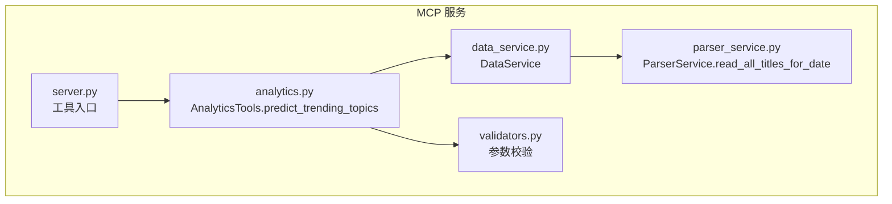
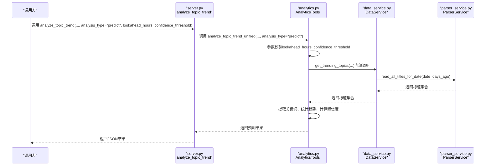
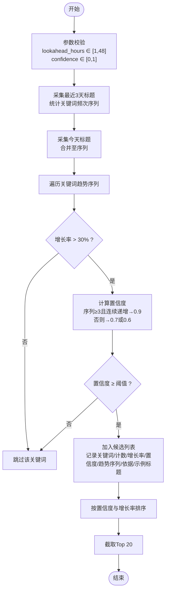
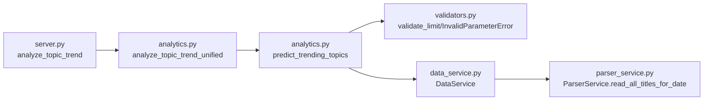

# 话题预测

<cite>
**本文引用的文件**
- [analytics.py](file://mcp_server/tools/analytics.py)
- [server.py](file://mcp_server/server.py)
- [data_service.py](file://mcp_server/services/data_service.py)
- [parser_service.py](file://mcp_server/services/parser_service.py)
- [validators.py](file://mcp_server/utils/validators.py)
</cite>

## 目录
1. [简介](#简介)
2. [项目结构](#项目结构)
3. [核心组件](#核心组件)
4. [架构总览](#架构总览)
5. [详细组件分析](#详细组件分析)
6. [依赖关系分析](#依赖关系分析)
7. [性能考量](#性能考量)
8. [故障排查指南](#故障排查指南)
9. [结论](#结论)
10. [附录](#附录)

## 简介
本文件面向“预测未来可能成为热点的话题”能力，聚焦于 `predict_trending_topics` 方法的使用说明与实现原理。文档将详细解释输入参数 lookahead_hours（预测未来小时数，默认6）与 confidence_threshold（置信度阈值，默认0.7）的作用；阐述预测算法的实现逻辑（基于关键词出现频率的上升趋势、趋势稳定性与置信度评估）；说明输出结果中包含的预测话题列表、预测置信度与趋势依据；并提供使用示例与结合预测结果进行内容预判与资源准备的实践建议。

## 项目结构
- 预测能力位于 MCP 服务的分析工具模块中，通过统一的工具入口暴露。
- 数据读取由数据服务层负责，解析层支持从 SQLite 或 TXT 文件读取标题数据。
- 参数校验由独立的验证工具完成，保证输入合法与安全。

图表来源
- [server.py](file://mcp_server/server.py#L227-L291)
- [analytics.py](file://mcp_server/tools/analytics.py#L1758-L1996)
- [data_service.py](file://mcp_server/services/data_service.py#L461-L514)
- [parser_service.py](file://mcp_server/services/parser_service.py#L461-L514)
- [validators.py](file://mcp_server/utils/validators.py#L90-L121)

章节来源
- [server.py](file://mcp_server/server.py#L227-L291)
- [analytics.py](file://mcp_server/tools/analytics.py#L1758-L1996)
- [data_service.py](file://mcp_server/services/data_service.py#L461-L514)
- [parser_service.py](file://mcp_server/services/parser_service.py#L461-L514)
- [validators.py](file://mcp_server/utils/validators.py#L90-L121)

## 核心组件
- AnalyticsTools.predict_trending_topics：预测未来潜在热点的核心方法，基于关键词频率的历史趋势与稳定性评估，输出置信度与趋势依据。
- DataService：封装数据访问，提供按日期读取标题的能力。
- ParserService：解析 TXT/SQLite 数据源，返回平台维度的标题集合与元信息。
- 参数校验工具：对 lookahead_hours、confidence_threshold 等参数进行范围与类型校验。

章节来源
- [analytics.py](file://mcp_server/tools/analytics.py#L1758-L1996)
- [data_service.py](file://mcp_server/services/data_service.py#L461-L514)
- [parser_service.py](file://mcp_server/services/parser_service.py#L461-L514)
- [validators.py](file://mcp_server/utils/validators.py#L90-L121)

## 架构总览
预测流程从 MCP 工具入口进入，经参数校验后调用分析工具，分析工具通过数据服务读取历史标题，提取关键词并统计趋势，最终输出预测结果。

图表来源
- [server.py](file://mcp_server/server.py#L227-L291)
- [analytics.py](file://mcp_server/tools/analytics.py#L1758-L1996)
- [data_service.py](file://mcp_server/services/data_service.py#L461-L514)
- [parser_service.py](file://mcp_server/services/parser_service.py#L461-L514)

## 详细组件分析

### predict_trending_topics 方法详解
- 输入参数
  - lookahead_hours：预测未来小时数，默认6，最大48。用于指导预测窗口与置信度评估。
  - confidence_threshold：置信度阈值，默认0.7，范围应在0~1之间。
- 数据采集
  - 采集最近3天的历史标题数据，统计每个关键词的出现频次序列。
  - 今天的数据单独处理并加入趋势序列。
- 趋势与置信度评估
  - 计算最近两日的增长率，设定阈值（当前实现为增长超过30%）。
  - 若序列长度≥3，则检查是否连续递增，决定置信度为0.9或0.7；否则置信度为0.6。
  - 仅当置信度不低于阈值时，关键词被纳入候选。
- 输出结果
  - predicted_topics：按置信度与增长率排序的候选话题列表，每项包含关键词、当前计数、增长率、置信度、趋势序列、趋势依据与示例标题。
  - total_predicted：候选总数。
  - lookahead_hours、confidence_threshold：传入参数。
  - prediction_time：预测执行时间。
  - note：预测基于历史趋势，实际结果可能有偏差的提示。

图表来源
- [analytics.py](file://mcp_server/tools/analytics.py#L1758-L1996)

章节来源
- [analytics.py](file://mcp_server/tools/analytics.py#L1758-L1996)

### 关键词提取与数据读取
- 关键词提取
  - 移除URL与特殊字符，按空格与常见分隔符切分，过滤停用词与短词，得到关键词列表。
- 数据读取
  - ParserService.read_all_titles_for_date(date, platform_ids) 优先从 SQLite 读取，不存在则回退到 TXT 文件夹。
  - 返回平台维度的标题集合、平台名称映射与抓取时间戳映射，供趋势统计使用。

章节来源
- [analytics.py](file://mcp_server/tools/analytics.py#L1922-L1949)
- [parser_service.py](file://mcp_server/services/parser_service.py#L461-L514)

### 参数校验
- lookahead_hours：通过 validate_limit 校验范围与类型，默认6，最大48。
- confidence_threshold：需在0~1之间，否则抛出参数错误。

章节来源
- [validators.py](file://mcp_server/utils/validators.py#L90-L121)
- [analytics.py](file://mcp_server/tools/analytics.py#L1788-L1795)

## 依赖关系分析
- predict_trending_topics 依赖
  - 参数校验：validators.validate_limit、validators.InvalidParameterError
  - 数据访问：DataService.get_trending_topics（内部调用）
  - 数据解析：ParserService.read_all_titles_for_date
- 调用链路
  - server.py 的 analyze_topic_trend 将 analysis_type="predict" 的请求转发到 AnalyticsTools.analyze_topic_trend_unified，再调用 predict_trending_topics。

图表来源
- [server.py](file://mcp_server/server.py#L227-L291)
- [analytics.py](file://mcp_server/tools/analytics.py#L155-L241)
- [analytics.py](file://mcp_server/tools/analytics.py#L1758-L1996)
- [data_service.py](file://mcp_server/services/data_service.py#L461-L514)
- [parser_service.py](file://mcp_server/services/parser_service.py#L461-L514)
- [validators.py](file://mcp_server/utils/validators.py#L90-L121)

章节来源
- [server.py](file://mcp_server/server.py#L227-L291)
- [analytics.py](file://mcp_server/tools/analytics.py#L155-L241)
- [analytics.py](file://mcp_server/tools/analytics.py#L1758-L1996)
- [data_service.py](file://mcp_server/services/data_service.py#L461-L514)
- [parser_service.py](file://mcp_server/services/parser_service.py#L461-L514)
- [validators.py](file://mcp_server/utils/validators.py#L90-L121)

## 性能考量
- 数据读取缓存
  - ParserService 对按日期读取的标题数据进行缓存，今天数据缓存时间较短（约15分钟），历史数据缓存时间较长（约1小时），减少重复IO。
- 关键词统计
  - 使用 Counter 与 defaultdict 进行词频统计，时间复杂度与标题数量线性相关。
- 趋势评估
  - 对每个关键词遍历其趋势序列，计算增长率与置信度，整体复杂度与关键词数量与序列长度线性相关。
- 输出限制
  - 最终仅返回Top 20候选，控制输出规模。

章节来源
- [parser_service.py](file://mcp_server/services/parser_service.py#L461-L514)
- [analytics.py](file://mcp_server/tools/analytics.py#L1758-L1996)

## 故障排查指南
- 未找到今天的数据
  - 现象：抛出 DataNotFoundError，提示等待爬虫任务完成。
  - 处理：确认爬虫已完成今日数据抓取，或稍后再试。
- 日期范围或平台参数问题
  - 现象：参数校验异常，提示不支持的平台或日期范围非法。
  - 处理：检查平台ID是否在配置中，日期范围是否在过去且在可用范围内。
- lookahead_hours/阈值范围错误
  - 现象：抛出 InvalidParameterError，提示参数超出范围或类型不符。
  - 处理：将 lookahead_hours 设为1~48之间的整数；将 confidence_threshold 设为0~1之间的数值。

章节来源
- [analytics.py](file://mcp_server/tools/analytics.py#L1840-L1844)
- [validators.py](file://mcp_server/utils/validators.py#L90-L121)
- [parser_service.py](file://mcp_server/services/parser_service.py#L509-L514)

## 结论
predict_trending_topics 通过关键词频率的历史趋势与稳定性评估，给出具有置信度的潜在热点候选。其设计强调可配置（lookahead_hours、confidence_threshold）、可扩展（支持 SQLite/TXT 数据源）与可维护（清晰的参数校验与错误处理）。在实际应用中，建议结合业务场景调整置信度阈值与预测窗口，并将预测结果用于内容预判与资源准备。

## 附录

### 使用示例与最佳实践
- 示例1：预测未来6小时内可能爆发的热点
  - 步骤：调用 analyze_topic_trend(..., analysis_type="predict", lookahead_hours=6)。
  - 输出：predicted_topics 中包含关键词、当前计数、增长率、置信度、趋势依据与示例标题。
- 示例2：提高置信度阈值
  - 步骤：调用 analyze_topic_trend(..., analysis_type="predict", confidence_threshold=0.8)。
  - 说明：仅输出更高置信度的候选，降低误报概率。
- 示例3：缩短预测窗口
  - 步骤：调用 analyze_topic_trend(..., analysis_type="predict", lookahead_hours=3)。
  - 说明：更贴近短期爆发，适合快速响应场景。
- 结合预测结果进行内容预判与资源准备
  - 内容预判：优先关注置信度高、增长率显著的关键词，提前准备相关素材与脚本。
  - 资源准备：为预测热点分配编辑、审核与推送资源，确保快速响应。
  - 风险控制：对置信度较低的候选保持观察，避免过度投入。

章节来源
- [server.py](file://mcp_server/server.py#L227-L291)
- [analytics.py](file://mcp_server/tools/analytics.py#L1758-L1996)