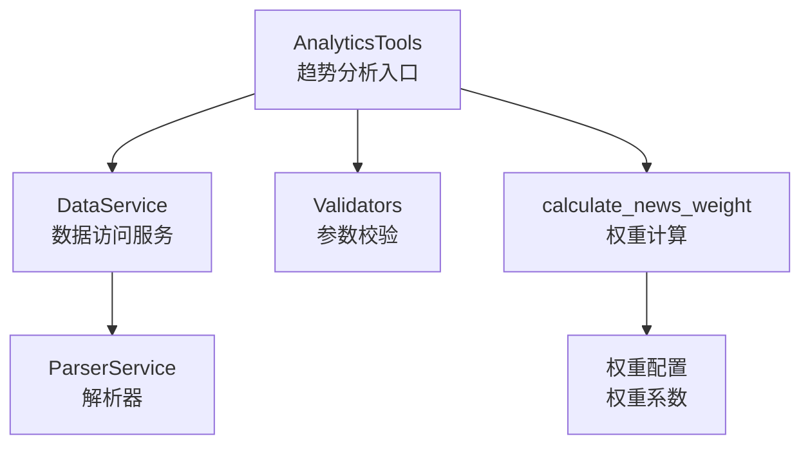
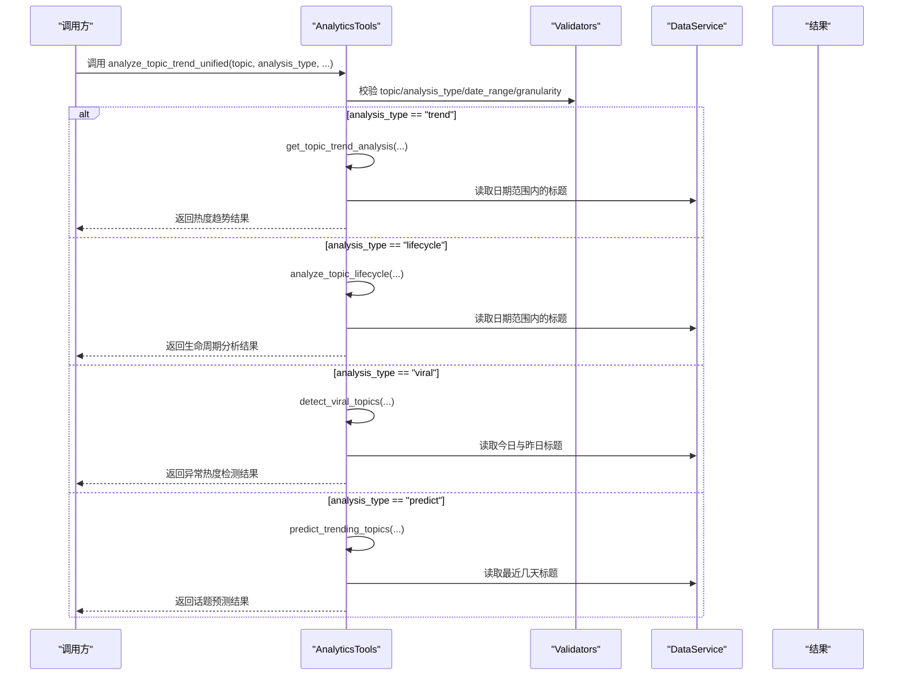
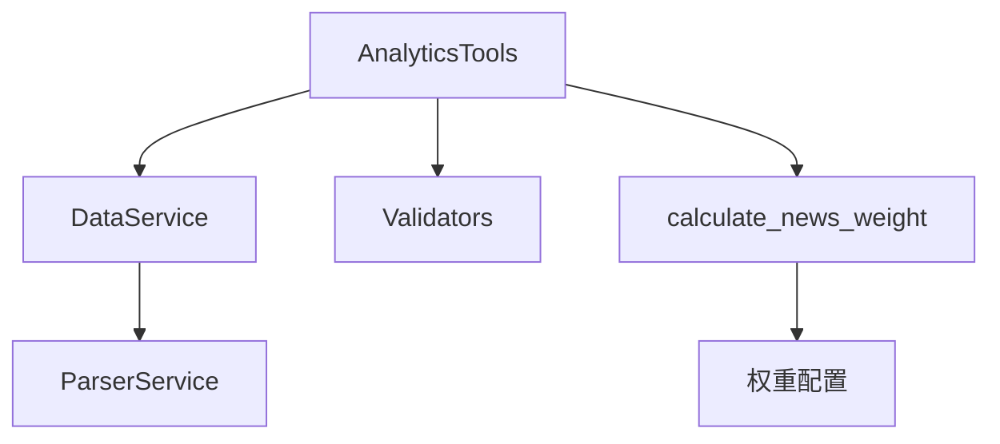

# 趋势分析工具

<cite>
**本文引用的文件**
- [mcp_server/tools/analytics.py](file://mcp_server/tools/analytics.py)
- [mcp_server/services/data_service.py](file://mcp_server/services/data_service.py)
- [mcp_server/utils/validators.py](file://mcp_server/utils/validators.py)
- [trendradar/core/analyzer.py](file://trendradar/core/analyzer.py)
</cite>

## 目录
1. [简介](#简介)
2. [项目结构](#项目结构)
3. [核心组件](#核心组件)
4. [架构总览](#架构总览)
5. [详细组件分析](#详细组件分析)
6. [依赖关系分析](#依赖关系分析)
7. [性能考量](#性能考量)
8. [故障排查指南](#故障排查指南)
9. [结论](#结论)
10. [附录](#附录)

## 简介
本文件聚焦于 AnalyticsTools 类中的趋势分析能力，围绕以下五个方法展开：analyze_topic_trend_unified（统一话题趋势分析入口）、get_topic_trend_analysis（热度趋势分析）、analyze_topic_lifecycle（生命周期分析）、detect_viral_topics（异常热度检测）、predict_trending_topics（话题预测）。文档将说明每个方法的输入参数、输出格式、算法逻辑与适用场景，并重点解释 calculate_news_weight 在趋势分析中的作用与影响路径。最后提供“如何使用 analyze_topic_trend_unified 分析‘AI本周的热度趋势’”的具体示例步骤。

## 项目结构
- 趋势分析主入口位于 mcp_server/tools/analytics.py 的 AnalyticsTools 类中，负责统一调度各类趋势分析模式。
- 数据访问层由 mcp_server/services/data_service.py 提供，封装了按日期读取标题、关键词统计、趋势话题检索等能力。
- 参数校验由 mcp_server/utils/validators.py 提供，保障 topic、date_range、limit 等参数的有效性。
- 权重计算函数 calculate_news_weight 在 trendradar/core/analyzer.py 中实现，被多个模块复用，用于排序与筛选。

图表来源
- [mcp_server/tools/analytics.py](file://mcp_server/tools/analytics.py#L155-L241)
- [mcp_server/services/data_service.py](file://mcp_server/services/data_service.py#L17-L40)
- [mcp_server/utils/validators.py](file://mcp_server/utils/validators.py#L145-L209)
- [trendradar/core/analyzer.py](file://trendradar/core/analyzer.py#L16-L60)

章节来源
- [mcp_server/tools/analytics.py](file://mcp_server/tools/analytics.py#L155-L241)
- [mcp_server/services/data_service.py](file://mcp_server/services/data_service.py#L17-L40)
- [mcp_server/utils/validators.py](file://mcp_server/utils/validators.py#L145-L209)
- [trendradar/core/analyzer.py](file://trendradar/core/analyzer.py#L16-L60)

## 核心组件
- AnalyticsTools：统一趋势分析入口，根据 analysis_type 调用具体分析方法；内置 calculate_news_weight 的使用点用于情感分析与实体搜索等场景的排序。
- DataService：提供按日期读取标题、关键词统计、趋势话题检索等能力，是趋势分析的数据基础。
- Validators：提供 validate_keyword、validate_date_range、validate_limit 等参数校验，保证分析过程的健壮性。
- calculate_news_weight：通用权重计算函数，综合排名、频次与高排名比例，用于排序与筛选。

章节来源
- [mcp_server/tools/analytics.py](file://mcp_server/tools/analytics.py#L76-L114)
- [mcp_server/tools/analytics.py](file://mcp_server/tools/analytics.py#L741-L764)
- [mcp_server/services/data_service.py](file://mcp_server/services/data_service.py#L17-L40)
- [mcp_server/utils/validators.py](file://mcp_server/utils/validators.py#L212-L243)
- [trendradar/core/analyzer.py](file://trendradar/core/analyzer.py#L16-L60)

## 架构总览
下面的序列图展示了 analyze_topic_trend_unified 的统一入口如何根据 analysis_type 分派到具体分析方法，并最终返回结果。

图表来源
- [mcp_server/tools/analytics.py](file://mcp_server/tools/analytics.py#L155-L241)
- [mcp_server/tools/analytics.py](file://mcp_server/tools/analytics.py#L243-L399)
- [mcp_server/tools/analytics.py](file://mcp_server/tools/analytics.py#L1464-L1620)
- [mcp_server/tools/analytics.py](file://mcp_server/tools/analytics.py#L1622-L1756)
- [mcp_server/tools/analytics.py](file://mcp_server/tools/analytics.py#L1758-L1918)
- [mcp_server/utils/validators.py](file://mcp_server/utils/validators.py#L145-L209)
- [mcp_server/services/data_service.py](file://mcp_server/services/data_service.py#L17-L40)

## 详细组件分析

### analyze_topic_trend_unified（统一话题趋势分析入口）
- 输入参数
  - topic：必填，话题关键词，将通过 validate_keyword 校验。
  - analysis_type：必填，可选值包括 trend、lifecycle、viral、predict。
  - date_range：可选，格式 {"start": "YYYY-MM-DD", "end": "YYYY-MM-DD"}，默认最近7天。
  - granularity：仅 trend 模式有效，当前支持 day。
  - threshold/time_window：仅 viral 模式有效，分别控制热度突增倍数阈值与时窗。
  - lookahead_hours/confidence_threshold：仅 predict 模式有效，分别控制预测时长与置信度阈值。
- 输出格式
  - 成功时返回包含 success、topic、date_range、granularity（trend）、trend_data 或 lifecycle_data、statistics、analysis 等字段的结果字典。
  - 失败时返回包含 success=False 与 error 字段的结果字典。
- 适用场景
  - 需要在统一入口下切换不同趋势分析模式时使用。
  - 无需关心内部细节，直接传入 analysis_type 即可获得对应分析结果。
- 算法逻辑要点
  - 根据 analysis_type 分派到具体方法。
  - viral 模式与 predict 模式不依赖 topic 参数，而是基于全站关键词统计进行检测与预测。
- 使用示例（分析“AI本周的热度趋势”）
  - 步骤1：准备日期范围（例如从上周一到本周日）。
  - 步骤2：调用 analyze_topic_trend_unified(topic="AI", analysis_type="trend", date_range=..., granularity="day")。
  - 步骤3：解析返回的 trend_data、statistics、trend_direction 等字段，观察峰值时间、变化率与趋势方向。

章节来源
- [mcp_server/tools/analytics.py](file://mcp_server/tools/analytics.py#L155-L241)

### get_topic_trend_analysis（热度趋势分析）
- 输入参数
  - topic：必填，话题关键词。
  - date_range：可选，格式 {"start": "YYYY-MM-DD", "end": "YYYY-MM-DD"}，默认最近7天。
  - granularity：仅支持 day（当前底层数据按天聚合）。
- 输出格式
  - 返回包含 success、topic、date_range、granularity、trend_data、statistics、trend_direction 的字典。
  - trend_data 为按日统计的列表，包含 date、count、sample_titles。
  - statistics 包含 total_mentions、average_mentions、peak_count、peak_time、change_rate。
  - trend_direction 基于 change_rate 判定为“上升/下降/稳定”。
- 适用场景
  - 追踪某话题在指定时间窗口内的热度变化，适合短期趋势观察。
- 算法逻辑
  - 若未指定 date_range，则默认最近7天。
  - 逐日读取标题，统计包含 topic 的新闻数量，形成趋势数据。
  - 计算首尾非零值的增长率、峰值时间等指标。
- 错误处理
  - 日期范围非法或粒度不支持时抛出 InvalidParameterError。
  - 未找到数据时返回空趋势数据并记录。

章节来源
- [mcp_server/tools/analytics.py](file://mcp_server/tools/analytics.py#L243-L399)
- [mcp_server/utils/validators.py](file://mcp_server/utils/validators.py#L145-L209)

### analyze_topic_lifecycle（生命周期分析）
- 输入参数
  - topic：必填，话题关键词。
  - date_range：可选，格式 {"start": "YYYY-MM-DD", "end": "YYYY-MM-DD"}，默认最近7天。
- 输出格式
  - 返回包含 success、topic、date_range、lifecycle_data、analysis 的字典。
  - analysis 包含 first_appearance、last_appearance、peak_date、peak_count、active_days、avg_daily_mentions、lifecycle_stage、topic_type。
- 适用场景
  - 分析话题从出现到消失的完整周期，判断其是“昙花一现”、“持续热点”还是“周期性热点”，并识别当前所处阶段（上升期/爆发期/稳定期/衰退期）。
- 算法逻辑
  - 逐日统计包含 topic 的新闻数量，得到生命周期数据。
  - 计算首次/末次出现、峰值、活跃天数、平均提及次数。
  - 基于最近与早期的均值比较、峰值是否集中在近期等规则判定生命周期阶段与话题类型。
- 错误处理
  - 若指定范围内未找到该话题，抛出 DataNotFoundError。

章节来源
- [mcp_server/tools/analytics.py](file://mcp_server/tools/analytics.py#L1464-L1620)

### detect_viral_topics（异常热度检测）
- 输入参数
  - threshold：异常热度倍数阈值，默认3.0，必须≥1.0。
  - time_window：检测时间窗口（小时），默认24，最大72。
- 输出格式
  - 返回包含 success、viral_topics、total_detected、threshold、time_window、detection_time 的字典。
  - viral_topics 为按当前/增长倍数排序的异常话题列表，包含 keyword、current_count、previous_count、growth_rate、sample_titles、alert_level。
- 适用场景
  - 实时监控突发热点，快速发现“爆火”话题，辅助预警与内容运营。
- 算法逻辑
  - 读取今日与昨日的标题，统计关键词频次。
  - 计算今日与昨日的关键词增长倍数，若 previous_count=0 且 current_count≥5 则视为“新话题”并纳入预警。
  - 按当前频次或增长倍数排序，返回 TOP 结果。
- 错误处理
  - threshold 必须≥1.0，否则抛出 InvalidParameterError。

章节来源
- [mcp_server/tools/analytics.py](file://mcp_server/tools/analytics.py#L1622-L1756)
- [mcp_server/utils/validators.py](file://mcp_server/utils/validators.py#L90-L121)

### predict_trending_topics（话题预测）
- 输入参数
  - lookahead_hours：预测未来小时数，默认6，最大48。
  - confidence_threshold：置信度阈值，默认0.7，范围[0,1]。
- 输出格式
  - 返回包含 success、predicted_topics、total_predicted、lookahead_hours、confidence_threshold、prediction_time 的字典。
  - predicted_topics 为按置信度与增长率排序的潜在热点列表，包含 keyword、current_count、growth_rate、confidence、trend_data、prediction、sample_titles。
- 适用场景
  - 基于历史趋势提前发现可能成为热点的话题，辅助内容策划与热点预判。
- 算法逻辑
  - 收集最近3天的历史关键词频次，加入今天的频次，形成趋势序列。
  - 计算最近两日的增长率，若增长率>30%，则认为存在上升趋势。
  - 根据趋势连续性与样本量计算置信度，高于阈值即纳入预测。
  - 按置信度与增长率排序，返回 TOP 20。
- 错误处理
  - lookahead_hours 超出范围或 confidence_threshold 不在[0,1]时抛出 InvalidParameterError。

章节来源
- [mcp_server/tools/analytics.py](file://mcp_server/tools/analytics.py#L1758-L1918)
- [mcp_server/utils/validators.py](file://mcp_server/utils/validators.py#L90-L121)
- [mcp_server/utils/validators.py](file://mcp_server/utils/validators.py#L212-L243)

### calculate_news_weight 在趋势分析中的作用
- 作用概述
  - 用于对新闻/标题进行加权排序，综合考虑排名、出现频次与高排名比例，使热点内容在排序中更突出。
- 在趋势分析中的体现
  - 虽然趋势分析的核心指标（热度计数、峰值、变化率）由各分析方法自行计算，但 calculate_news_weight 作为通用权重函数，在以下场景与趋势分析协同工作：
    - 情感分析与实体搜索等场景中，对新闻按权重排序，便于抽取高质量样本。
    - 报告生成时，对新闻样本进行权重排序，确保展示更具代表性的内容。
- 权重构成
  - 排名权重：基于各条新闻的排名集合，计算平均排名得分。
  - 频次权重：基于出现次数（上限10），乘以固定系数。
  - 热度加成：高排名比例（rank≤阈值）占比×100。
- 影响路径
  - AnalyticsTools 内部在情感分析、实体搜索、摘要报告等方法中调用 calculate_news_weight，间接提升趋势相关分析的样本质量与代表性。

章节来源
- [trendradar/core/analyzer.py](file://trendradar/core/analyzer.py#L16-L60)
- [mcp_server/tools/analytics.py](file://mcp_server/tools/analytics.py#L741-L764)
- [mcp_server/tools/analytics.py](file://mcp_server/tools/analytics.py#L1117-L1121)
- [mcp_server/tools/analytics.py](file://mcp_server/tools/analytics.py#L1282-L1301)

## 依赖关系分析
- 组件耦合
  - AnalyticsTools 依赖 DataService 进行数据读取；依赖 Validators 进行参数校验；在部分方法中复用 calculate_news_weight。
  - DataService 依赖 ParserService 读取文件系统中的标题数据，依赖缓存服务提升性能。
- 外部依赖
  - 文件系统：output 目录下的日期子目录与 txt 文件，按日期组织标题与榜单信息。
  - 配置文件：config.yaml 中的平台与权重配置，影响权重计算与平台过滤。
- 循环依赖
  - 未发现循环依赖迹象；模块职责清晰，调用方向单一。

图表来源
- [mcp_server/tools/analytics.py](file://mcp_server/tools/analytics.py#L76-L114)
- [mcp_server/services/data_service.py](file://mcp_server/services/data_service.py#L17-L40)
- [mcp_server/utils/validators.py](file://mcp_server/utils/validators.py#L145-L209)
- [trendradar/core/analyzer.py](file://trendradar/core/analyzer.py#L16-L60)

章节来源
- [mcp_server/tools/analytics.py](file://mcp_server/tools/analytics.py#L76-L114)
- [mcp_server/services/data_service.py](file://mcp_server/services/data_service.py#L17-L40)
- [mcp_server/utils/validators.py](file://mcp_server/utils/validators.py#L145-L209)
- [trendradar/core/analyzer.py](file://trendradar/core/analyzer.py#L16-L60)

## 性能考量
- 数据读取与缓存
  - DataService 对最新新闻、按日期新闻、趋势话题等查询结果进行缓存，减少重复 IO。
- 时间复杂度
  - 热度趋势与生命周期分析：按日遍历，时间复杂度 O(D×N)，D 为天数，N 为当日标题数。
  - 异常热度检测：读取今日与昨日标题，时间复杂度 O(N1+N0)，N1/N0 分别为今日/昨日标题数。
  - 话题预测：读取最近3天+今日标题，时间复杂度 O(4×N)。
- 排序与筛选
  - calculate_news_weight 在情感分析与实体搜索中用于排序，排序复杂度 O(M log M)，M 为样本数。
- 建议
  - 合理设置 date_range 与 lookahead_hours，避免过大范围导致计算开销。
  - 使用缓存友好的调用方式，减少重复请求。

[本节为通用指导，不直接分析具体文件]

## 故障排查指南
- 常见错误与定位
  - 无效的 analysis_type：检查传入值是否为 trend/lifecycle/viral/predict。
  - 无效的粒度参数：trend 模式仅支持 day。
  - 日期范围错误：start 不能晚于 end，且不能查询未来日期。
  - viral 模式的阈值过低：threshold 必须≥1.0。
  - predict 模式的置信度越界：必须在[0,1]。
  - 未找到数据：当指定日期范围内无匹配标题或数据缺失时，抛出 DataNotFoundError。
- 定位方法
  - 使用 validators 的 validate_date_range 与 validate_keyword 进行参数校验。
  - 检查 DataService 的 get_available_date_range，确认可用日期范围。
  - 在 detect_viral_topics 与 predict_trending_topics 中，确认今日数据是否已生成。

章节来源
- [mcp_server/tools/analytics.py](file://mcp_server/tools/analytics.py#L195-L209)
- [mcp_server/utils/validators.py](file://mcp_server/utils/validators.py#L145-L209)
- [mcp_server/utils/validators.py](file://mcp_server/utils/validators.py#L90-L121)
- [mcp_server/utils/validators.py](file://mcp_server/utils/validators.py#L212-L243)
- [mcp_server/services/data_service.py](file://mcp_server/services/data_service.py#L498-L568)

## 结论
AnalyticsTools 的趋势分析体系以 analyze_topic_trend_unified 为统一入口，结合 get_topic_trend_analysis、analyze_topic_lifecycle、detect_viral_topics、predict_trending_topics 四种模式，覆盖从短期热度追踪、生命周期观察、异常预警到潜在热点预测的完整链路。calculate_news_weight 作为通用权重函数，在排序与样本筛选中发挥关键作用，间接提升了趋势分析结果的质量与代表性。通过合理的参数配置与数据范围选择，用户可在不同场景下高效获得所需的趋势洞察。

[本节为总结性内容，不直接分析具体文件]

## 附录

### 使用示例：分析“AI本周的热度趋势”
- 步骤1：准备日期范围
  - 假设今天是 2025-11-17，本周起止日期为 2025-11-10 至 2025-11-17。
- 步骤2：调用统一入口
  - 调用 analyze_topic_trend_unified(topic="AI", analysis_type="trend", date_range={"start": "2025-11-10", "end": "2025-11-17"}, granularity="day")。
- 步骤3：解析结果
  - 查看 trend_data 中每日 count 与 sample_titles，结合 statistics 中的 peak_count、change_rate、trend_direction，判断趋势方向与峰值时间。
- 步骤4：扩展分析
  - 如需了解话题生命周期，可改用 analysis_type="lifecycle"。
  - 如需实时预警，可改用 analysis_type="viral"。
  - 如需预测未来热点，可改用 analysis_type="predict"。

章节来源
- [mcp_server/tools/analytics.py](file://mcp_server/tools/analytics.py#L155-L241)
- [mcp_server/tools/analytics.py](file://mcp_server/tools/analytics.py#L243-L399)
- [mcp_server/tools/analytics.py](file://mcp_server/tools/analytics.py#L1464-L1620)
- [mcp_server/tools/analytics.py](file://mcp_server/tools/analytics.py#L1622-L1756)
- [mcp_server/tools/analytics.py](file://mcp_server/tools/analytics.py#L1758-L1918)