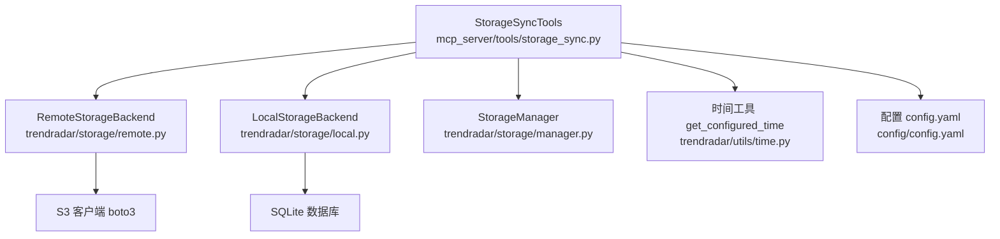
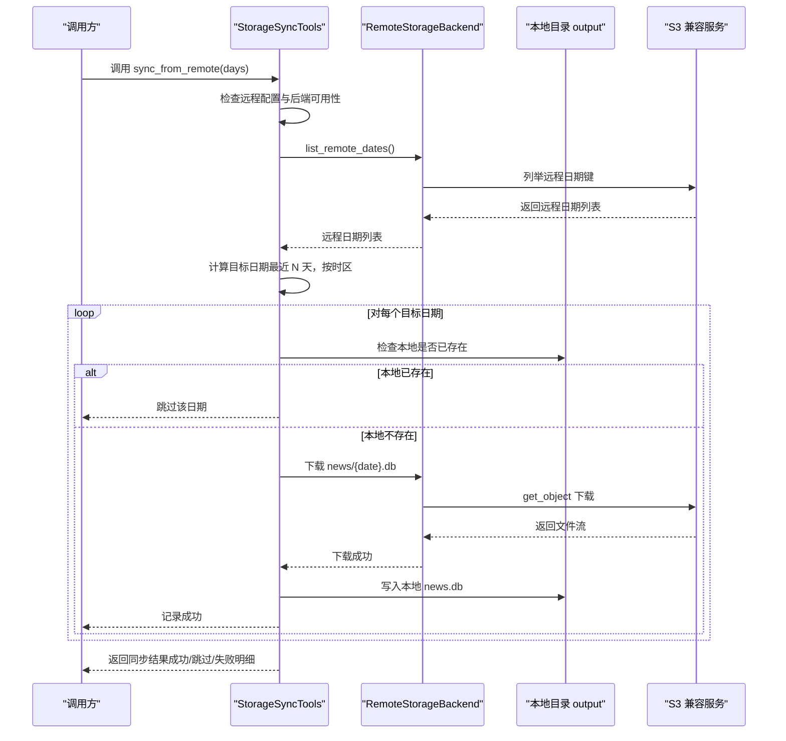
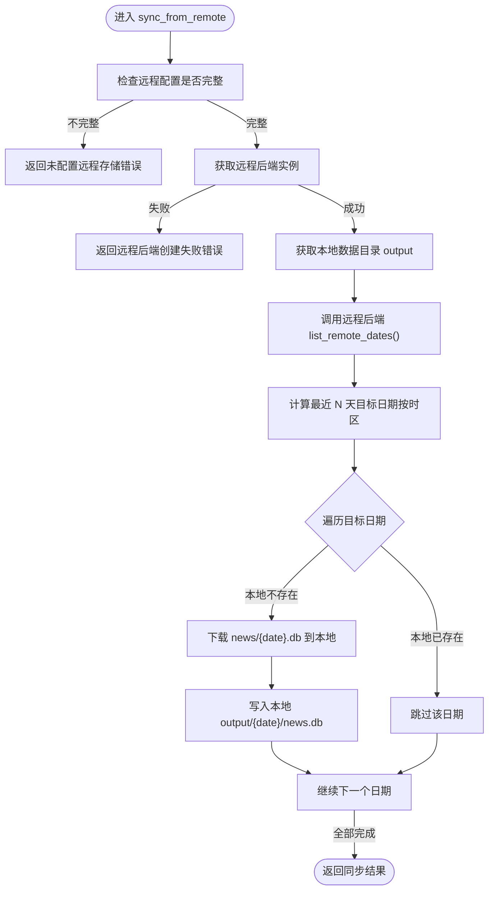
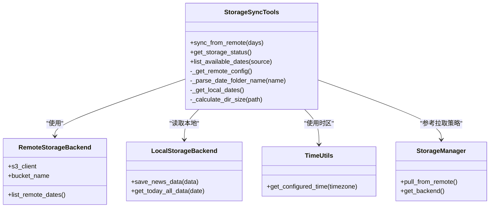

# 存储同步工具

<cite>
**本文引用的文件**
- [storage_sync.py](file://mcp_server/tools/storage_sync.py)
- [remote.py](file://trendradar/storage/remote.py)
- [local.py](file://trendradar/storage/local.py)
- [manager.py](file://trendradar/storage/manager.py)
- [time.py](file://trendradar/utils/time.py)
- [config.yaml](file://config/config.yaml)
- [README-MCP-FAQ.md](file://README-MCP-FAQ.md)
</cite>

## 目录
1. [简介](#简介)
2. [项目结构](#项目结构)
3. [核心组件](#核心组件)
4. [架构总览](#架构总览)
5. [详细组件分析](#详细组件分析)
6. [依赖关系分析](#依赖关系分析)
7. [性能考量](#性能考量)
8. [故障排查指南](#故障排查指南)
9. [结论](#结论)

## 简介
本文件围绕存储同步工具的 StorageSyncTools 类，系统性梳理其三大核心方法：sync_from_remote、get_storage_status、list_available_dates。文档重点解释：
- sync_from_remote 如何通过 S3 兼容协议从远程拉取 .db 数据库文件，涵盖环境变量与配置文件合并逻辑、日期范围计算、冲突跳过机制；
- get_storage_status 如何分别检测本地与远程存储的配置状态、数据量大小及保留策略；
- list_available_dates 的对比功能，展示本地与远程数据集的差异分析；
- _get_remote_config 的优先级策略（环境变量覆盖配置文件）与 _parse_date_folder_name 对中文日期格式的支持；
- 结合 README-MCP-FAQ.md 中 Q14-Q16 的同步失败、配置检查与数据差异排查方案。

## 项目结构
- 存储同步工具位于 mcp_server/tools/storage_sync.py，封装了从远程拉取、状态查询、日期对比等能力；
- 远程存储后端位于 trendradar/storage/remote.py，提供 S3 兼容客户端与对象键命名规则；
- 本地存储后端位于 trendradar/storage/local.py，负责本地 SQLite 数据库与目录结构；
- 存储管理器 trendradar/storage/manager.py 提供后端选择与拉取入口；
- 时间工具 trendradar/utils/time.py 提供时区与日期格式化能力；
- 配置文件 config/config.yaml 定义 storage.remote、storage.local、storage.pull 等关键配置项；
- README-MCP-FAQ.md 提供 Q14-Q16 的使用问答与排障指引。

图示来源
- [storage_sync.py](file://mcp_server/tools/storage_sync.py#L1-L469)
- [remote.py](file://trendradar/storage/remote.py#L1-L200)
- [local.py](file://trendradar/storage/local.py#L1-L120)
- [manager.py](file://trendradar/storage/manager.py#L1-L120)
- [time.py](file://trendradar/utils/time.py#L1-L40)
- [config.yaml](file://config/config.yaml#L1-L60)

章节来源
- [storage_sync.py](file://mcp_server/tools/storage_sync.py#L1-L120)
- [config.yaml](file://config/config.yaml#L1-L60)

## 核心组件
- StorageSyncTools：提供从远程拉取、状态查询、日期对比等能力，内部依赖配置加载、远程后端、本地目录与时间工具。
- RemoteStorageBackend：S3 兼容客户端封装，负责对象键命名、下载/上传、远程日期枚举等。
- LocalStorageBackend：本地 SQLite 存储封装，负责本地目录结构、数据库连接与清理。
- StorageManager：统一后端选择与拉取入口，支持自动拉取策略。
- 时间工具：提供时区感知的时间获取与日期格式化。

章节来源
- [storage_sync.py](file://mcp_server/tools/storage_sync.py#L1-L120)
- [remote.py](file://trendradar/storage/remote.py#L1-L120)
- [local.py](file://trendradar/storage/local.py#L1-L120)
- [manager.py](file://trendradar/storage/manager.py#L1-L120)
- [time.py](file://trendradar/utils/time.py#L1-L40)

## 架构总览
StorageSyncTools 通过配置文件与环境变量合并远程配置，构建 RemoteStorageBackend；随后在本地 output 目录下拉取 news/{date}.db 文件，实现“最近 N 天”的增量同步，并对本地已存在的日期进行跳过。同时提供本地与远程状态查询与日期对比功能。

图示来源
- [storage_sync.py](file://mcp_server/tools/storage_sync.py#L176-L288)
- [remote.py](file://trendradar/storage/remote.py#L140-L220)

章节来源
- [storage_sync.py](file://mcp_server/tools/storage_sync.py#L176-L288)
- [remote.py](file://trendradar/storage/remote.py#L140-L220)

## 详细组件分析

### StorageSyncTools 类与三大方法

#### sync_from_remote
- 功能要点
  - 合并配置：优先使用环境变量（S3_ENDPOINT_URL、S3_BUCKET_NAME、S3_ACCESS_KEY_ID、S3_SECRET_ACCESS_KEY、S3_REGION），若配置文件中对应字段缺失则回退到环境变量。
  - 日期范围：基于配置 app.timezone 计算当前时间，生成最近 N 天的目标日期集合，仅包含远程存在的日期。
  - 冲突跳过：若本地 output/{date}/news.db 已存在，则跳过该日期，避免重复下载。
  - 错误处理：捕获 MCPError 与通用异常，返回结构化错误信息；远程后端创建失败或下载异常均有明确提示。
- 关键实现路径
  - 配置合并与校验：[storage_sync.py](file://mcp_server/tools/storage_sync.py#L54-L77)
  - 远程后端获取与初始化：[storage_sync.py](file://mcp_server/tools/storage_sync.py#L79-L109)
  - 本地目录与日期解析：[storage_sync.py](file://mcp_server/tools/storage_sync.py#L110-L166)
  - 日期范围计算与拉取循环：[storage_sync.py](file://mcp_server/tools/storage_sync.py#L214-L273)
  - 下载与写入：[storage_sync.py](file://mcp_server/tools/storage_sync.py#L244-L257)

图示来源
- [storage_sync.py](file://mcp_server/tools/storage_sync.py#L176-L288)
- [time.py](file://trendradar/utils/time.py#L15-L31)

章节来源
- [storage_sync.py](file://mcp_server/tools/storage_sync.py#L176-L288)
- [time.py](file://trendradar/utils/time.py#L15-L31)

#### get_storage_status
- 功能要点
  - 本地状态：统计 output 目录大小、日期数量、最早/最新日期；读取本地 retention_days。
  - 远程状态：合并配置与环境变量，脱敏显示 endpoint 与 bucket；尝试 list_remote_dates() 获取远程日期数量与范围；若远程不可用则返回错误信息。
  - 拉取配置：读取 storage.pull.enabled 与 days。
- 关键实现路径
  - 本地统计与大小计算：[storage_sync.py](file://mcp_server/tools/storage_sync.py#L290-L358)
  - 远程状态与日期枚举：[storage_sync.py](file://mcp_server/tools/storage_sync.py#L316-L343)
  - 拉取配置读取：[storage_sync.py](file://mcp_server/tools/storage_sync.py#L345-L350)

章节来源
- [storage_sync.py](file://mcp_server/tools/storage_sync.py#L290-L358)

#### list_available_dates
- 功能要点
  - 支持三种模式：local、remote、both。
  - both 模式下计算本地与远程日期差集与交集，输出 only_local、only_remote、both。
- 关键实现路径
  - 本地日期列表：[storage_sync.py](file://mcp_server/tools/storage_sync.py#L151-L166)
  - 远程日期列表与错误兜底：[storage_sync.py](file://mcp_server/tools/storage_sync.py#L401-L441)
  - 差异计算与返回：[storage_sync.py](file://mcp_server/tools/storage_sync.py#L443-L454)

章节来源
- [storage_sync.py](file://mcp_server/tools/storage_sync.py#L373-L468)

### 辅助方法与工具

#### _get_remote_config 优先级策略
- 优先级：配置文件 storage.remote 字段 < 环境变量 S3_*。
- 返回字段：endpoint_url、bucket_name、access_key_id、secret_access_key、region。
- 用途：用于创建 RemoteStorageBackend 与 get_storage_status 的远程配置展示。

章节来源
- [storage_sync.py](file://mcp_server/tools/storage_sync.py#L54-L67)
- [config.yaml](file://config/config.yaml#L31-L46)

#### _parse_date_folder_name 中文日期支持
- 支持格式：ISO 格式（YYYY-MM-DD）与中文格式（YYYY年MM月DD日）。
- 作用：解析 output 目录下的日期文件夹名，统一为 ISO 格式字符串，便于排序与对比。

章节来源
- [storage_sync.py](file://mcp_server/tools/storage_sync.py#L117-L149)

#### RemoteStorageBackend 对象键与下载
- 对象键命名：news/{date}.db（date 由 format_date_folder 生成）。
- 下载流程：head_object 检查存在性，get_object + iter_chunks 下载，写入本地临时目录，再移动至 output/{date}/news.db。
- 上传流程：put_object + 明确 ContentLength，避免 chunked transfer encoding 问题。

章节来源
- [remote.py](file://trendradar/storage/remote.py#L135-L177)
- [remote.py](file://trendradar/storage/remote.py#L178-L224)
- [remote.py](file://trendradar/storage/remote.py#L225-L274)

#### 时区与日期范围
- 时区：app.timezone 从 config.yaml 读取，默认 Asia/Shanghai。
- 日期范围：get_configured_time 保证按配置时区计算“今天”与“最近 N 天”。

章节来源
- [time.py](file://trendradar/utils/time.py#L15-L31)
- [config.yaml](file://config/config.yaml#L1-L12)

## 依赖关系分析

图示来源
- [storage_sync.py](file://mcp_server/tools/storage_sync.py#L1-L120)
- [remote.py](file://trendradar/storage/remote.py#L1-L120)
- [local.py](file://trendradar/storage/local.py#L1-L120)
- [manager.py](file://trendradar/storage/manager.py#L1-L120)
- [time.py](file://trendradar/utils/time.py#L1-L40)

章节来源
- [storage_sync.py](file://mcp_server/tools/storage_sync.py#L1-L120)
- [remote.py](file://trendradar/storage/remote.py#L1-L120)
- [local.py](file://trendradar/storage/local.py#L1-L120)
- [manager.py](file://trendradar/storage/manager.py#L1-L120)
- [time.py](file://trendradar/utils/time.py#L1-L40)

## 性能考量
- 目录扫描与大小统计：_calculate_dir_size 递归遍历 output 目录，O(N) 文件扫描，注意在大数据量时的 I/O 开销。
- 远程枚举：list_remote_dates 依赖远程服务端点，网络延迟与并发下载需考虑；建议批量拉取时控制并发。
- 日期解析：_parse_date_folder_name 仅正则匹配与转换，开销较小。
- 本地去重：同步时跳过本地已存在日期，避免重复 I/O 与网络传输。
- 时区计算：get_configured_time 仅一次时区解析，后续复用。

[本节为通用性能讨论，无需特定文件引用]

## 故障排查指南

### 同步失败（Q14）
- 症状：返回“未配置远程存储”或“无法创建远程存储后端”。
- 排查步骤
  - 确认 config/config.yaml 中 storage.remote 字段或环境变量 S3_* 是否完整配置。
  - 若使用容器/CI 环境，优先检查环境变量注入是否正确。
  - 确认 boto3 已安装，否则远程后端初始化会失败。
- 参考问答
  - Q14：从远程同步最近 N 天数据，需在 config.yaml 或环境变量中配置 S3_ENDPOINT_URL、S3_BUCKET_NAME、S3_ACCESS_KEY_ID、S3_SECRET_ACCESS_KEY。

章节来源
- [storage_sync.py](file://mcp_server/tools/storage_sync.py#L186-L208)
- [README-MCP-FAQ.md](file://README-MCP-FAQ.md#L455-L485)

### 配置检查（Q15）
- 症状：get_storage_status 返回远程未配置或远程错误。
- 排查步骤
  - 使用 get_storage_status 检查 storage.remote 是否配置，以及 remote.retention_days、pull.enabled/pull.days。
  - 若远程不可用，查看 remote.error 字段的具体错误信息。
- 参考问答
  - Q15：查看当前存储状态，包括本地数据目录、总大小、日期数量与范围，以及远程配置与日期数量。

章节来源
- [storage_sync.py](file://mcp_server/tools/storage_sync.py#L290-L358)
- [README-MCP-FAQ.md](file://README-MCP-FAQ.md#L487-L506)

### 数据差异排查（Q16）
- 症状：本地缺少某些日期数据，或远程存在本地缺失的日期。
- 排查步骤
  - 使用 list_available_dates(source="both") 获取 only_local、only_remote、both 三类日期集合。
  - 仅查询 remote 时，若返回 error 字段，检查远程配置与网络连通性。
  - 根据 only_remote 列表，针对性调用 sync_from_remote(days=N) 拉取缺失日期。
- 参考问答
  - Q16：对比本地与远程数据日期，查看 only_local、only_remote、both，辅助决定同步策略。

章节来源
- [storage_sync.py](file://mcp_server/tools/storage_sync.py#L373-L468)
- [README-MCP-FAQ.md](file://README-MCP-FAQ.md#L508-L533)

### 日期格式与时区问题
- 症状：日期解析失败或日期范围不正确。
- 排查步骤
  - 确认 output 目录下日期文件夹命名符合 ISO（YYYY-MM-DD）或中文（YYYY年MM月DD日）。
  - 检查 config/app.timezone 设置是否正确，避免跨时区导致“今天”判断偏差。
- 参考实现
  - _parse_date_folder_name 支持两种格式；get_configured_time 使用时区。

章节来源
- [storage_sync.py](file://mcp_server/tools/storage_sync.py#L117-L149)
- [time.py](file://trendradar/utils/time.py#L15-L31)
- [config.yaml](file://config/config.yaml#L1-L12)

## 结论
StorageSyncTools 通过清晰的配置合并策略、稳健的日期范围计算与冲突跳过机制，实现了从远程 S3 兼容存储高效拉取本地数据的能力。配合 get_storage_status 与 list_available_dates，用户可以快速掌握本地与远程的数据状态与差异，结合 README-MCP-FAQ.md 的 Q14-Q16，能够有效定位并解决同步失败、配置检查与数据差异排查问题。建议在生产环境中：
- 优先使用环境变量配置远程 S3 凭据，确保 CI/CD 安全可控；
- 合理设置 pull.days 与 retention_days，平衡数据完整性与存储成本；
- 使用 list_available_dates 的 both 模式进行差异分析，指导增量同步策略。