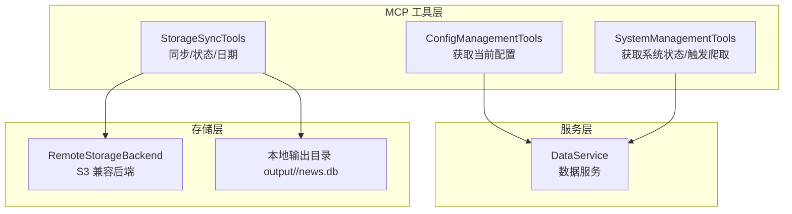
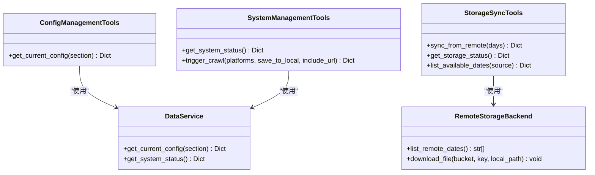
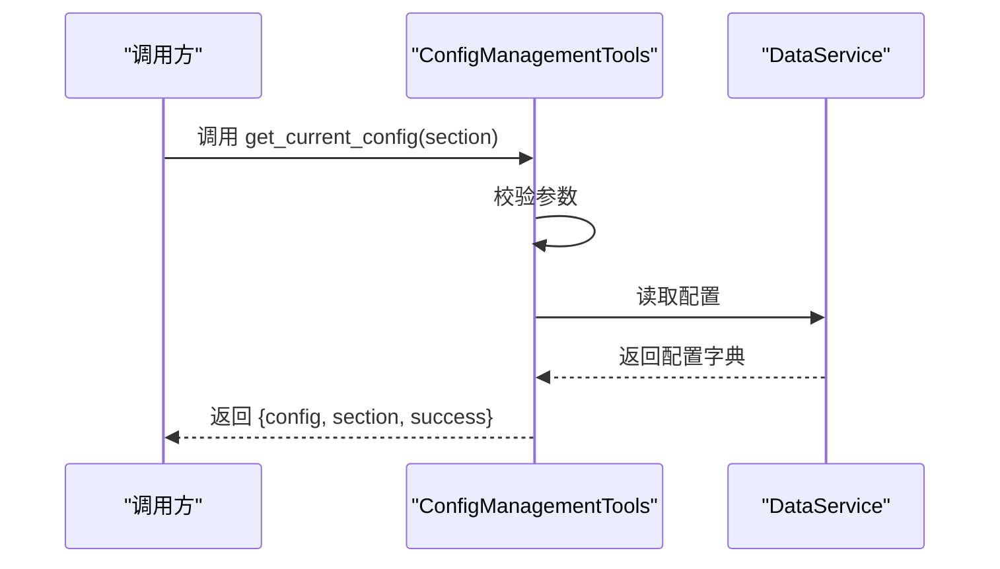
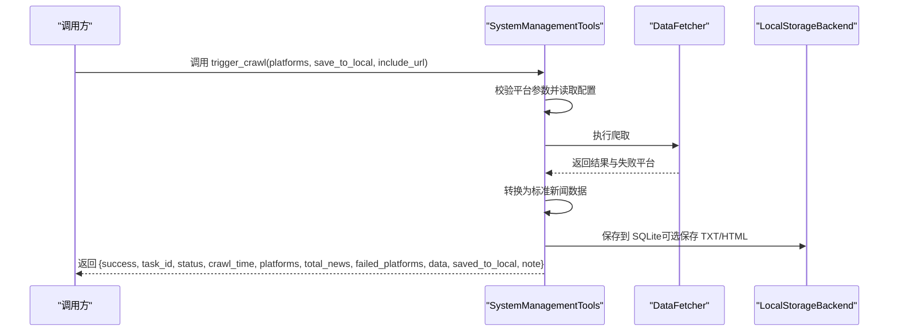
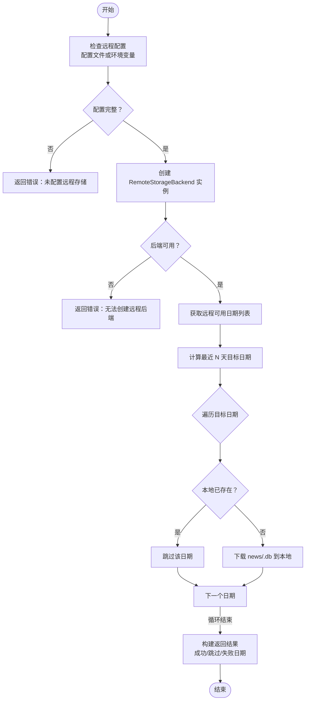
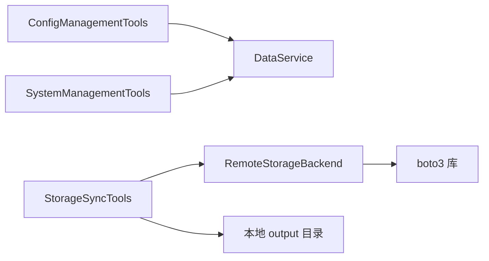

# 系统与配置工具

<cite>
**本文引用的文件**
- [mcp_server/tools/config_mgmt.py](file://mcp_server/tools/config_mgmt.py)
- [mcp_server/tools/system.py](file://mcp_server/tools/system.py)
- [mcp_server/tools/storage_sync.py](file://mcp_server/tools/storage_sync.py)
- [mcp_server/services/data_service.py](file://mcp_server/services/data_service.py)
- [trendradar/storage/remote.py](file://trendradar/storage/remote.py)
- [config/config.yaml](file://config/config.yaml)
- [README-MCP-FAQ.md](file://README-MCP-FAQ.md)
</cite>

## 目录
1. [简介](#简介)
2. [项目结构](#项目结构)
3. [核心组件](#核心组件)
4. [架构总览](#架构总览)
5. [详细组件分析](#详细组件分析)
6. [依赖关系分析](#依赖关系分析)
7. [性能与可靠性考量](#性能与可靠性考量)
8. [故障排查指南](#故障排查指南)
9. [结论](#结论)
10. [附录](#附录)

## 简介
本文件面向“AI智能分析功能”中的系统管理与配置工具，聚焦 mcp_server/tools/ 目录下的三类工具：
- 配置管理工具：ConfigManagementTools
- 系统管理工具：SystemManagementTools
- 存储同步工具：StorageSyncTools

文档将详细说明以下能力：
- 获取当前配置（get_current_config）与获取系统状态（get_system_status）的返回结构
- 手动触发爬取（trigger_crawl）的两种模式：临时查询与持久化数据
- 从远程同步数据（sync_from_remote）、获取存储状态（get_storage_status）与列出可用日期（list_available_dates）的工作流程、使用场景与前提条件（如 S3 环境变量）

同时结合 README-MCP-FAQ.md 中 Q11-Q16 的问答，给出常见问题解答与最佳实践。

## 项目结构
围绕系统管理与配置工具，涉及的关键模块如下：
- mcp_server/tools/config_mgmt.py：封装配置查询与校验，返回当前配置
- mcp_server/tools/system.py：封装系统状态查询与手动触发爬取（含本地持久化）
- mcp_server/tools/storage_sync.py：封装远程存储同步、存储状态与日期列表查询
- mcp_server/services/data_service.py：底层数据服务，供配置与系统状态查询使用
- trendradar/storage/remote.py：远程存储后端（S3 兼容），被存储同步工具调用
- config/config.yaml：系统配置入口，包含存储、爬虫、通知、权重等配置项
- README-MCP-FAQ.md：FAQ 文档，覆盖配置、状态、爬取与存储同步的问答

**图示来源**
- [mcp_server/tools/config_mgmt.py](file://mcp_server/tools/config_mgmt.py#L1-L67)
- [mcp_server/tools/system.py](file://mcp_server/tools/system.py#L1-L369)
- [mcp_server/tools/storage_sync.py](file://mcp_server/tools/storage_sync.py#L1-L469)
- [mcp_server/services/data_service.py](file://mcp_server/services/data_service.py#L1-L200)
- [trendradar/storage/remote.py](file://trendradar/storage/remote.py#L1-L200)

**章节来源**
- [mcp_server/tools/config_mgmt.py](file://mcp_server/tools/config_mgmt.py#L1-L67)
- [mcp_server/tools/system.py](file://mcp_server/tools/system.py#L1-L369)
- [mcp_server/tools/storage_sync.py](file://mcp_server/tools/storage_sync.py#L1-L469)
- [mcp_server/services/data_service.py](file://mcp_server/services/data_service.py#L1-L200)
- [trendradar/storage/remote.py](file://trendradar/storage/remote.py#L1-L200)
- [config/config.yaml](file://config/config.yaml#L1-L187)

## 核心组件
- ConfigManagementTools
  - 职责：读取并返回当前系统配置，支持按节过滤（all/crawler/push/keywords/weights）
  - 返回结构：包含 config、section、success；异常时返回 success=false 与 error 字段
- SystemManagementTools
  - 职责：获取系统状态；手动触发爬取（可选保存到本地 output）
  - 返回结构：系统状态聚合字段 + success；爬取返回包含任务标识、平台列表、总数、失败平台、数据列表、保存标记与备注
- StorageSyncTools
  - 职责：从远程 S3 兼容存储拉取数据到本地；获取存储状态；列出可用日期
  - 返回结构：同步结果包含成功/跳过/失败的日期集合与消息；存储状态包含本地/远程/拉取配置；日期列表包含本地/远程/两者对比

**章节来源**
- [mcp_server/tools/config_mgmt.py](file://mcp_server/tools/config_mgmt.py#L26-L67)
- [mcp_server/tools/system.py](file://mcp_server/tools/system.py#L33-L263)
- [mcp_server/tools/storage_sync.py](file://mcp_server/tools/storage_sync.py#L176-L469)

## 架构总览
系统管理与配置工具通过统一的工具类对外暴露能力，内部依赖数据服务与存储后端，形成清晰的分层：
- 工具层：ConfigManagementTools、SystemManagementTools、StorageSyncTools
- 服务层：DataService（封装数据访问与缓存）
- 存储层：RemoteStorageBackend（S3 兼容）、本地 SQLite 输出目录

**图示来源**
- [mcp_server/tools/config_mgmt.py](file://mcp_server/tools/config_mgmt.py#L1-L67)
- [mcp_server/tools/system.py](file://mcp_server/tools/system.py#L1-L369)
- [mcp_server/tools/storage_sync.py](file://mcp_server/tools/storage_sync.py#L1-L469)
- [mcp_server/services/data_service.py](file://mcp_server/services/data_service.py#L1-L200)
- [trendradar/storage/remote.py](file://trendradar/storage/remote.py#L1-L200)

## 详细组件分析

### 配置管理工具：ConfigManagementTools
- 能力概述
  - 读取当前系统配置，支持按节过滤
  - 返回结构包含 config、section、success；异常时返回 error
- 关键流程
  - 参数校验（节名合法性）
  - 通过 DataService 获取配置
  - 统一包装返回结构
- 使用建议
  - 通过 section 指定节名（如 crawler、push、keywords、weights）
  - 若未指定，返回全量配置

**图示来源**
- [mcp_server/tools/config_mgmt.py](file://mcp_server/tools/config_mgmt.py#L26-L67)
- [mcp_server/services/data_service.py](file://mcp_server/services/data_service.py#L1-L200)

**章节来源**
- [mcp_server/tools/config_mgmt.py](file://mcp_server/tools/config_mgmt.py#L26-L67)

### 系统管理工具：SystemManagementTools
- 能力概述
  - 获取系统状态：返回系统版本、最后爬取时间、历史数据天数、健康检查等
  - 手动触发爬取：可选保存到本地 output 目录，支持包含 URL 与平台过滤
- 返回结构要点
  - get_system_status：success + 系统状态字段
  - trigger_crawl：success、task_id、status、crawl_time、platforms、total_news、failed_platforms、data、saved_to_local、note（保存失败时包含 save_error 与提示）
- 触发流程
  - 读取 config/config.yaml，解析平台配置
  - 初始化 DataFetcher，按配置发起爬取
  - 转换为标准新闻数据模型
  - 保存到 SQLite（核心持久化），可选生成 TXT/HTML 快照
  - 清理缓存，确保下次查询获取最新数据

**图示来源**
- [mcp_server/tools/system.py](file://mcp_server/tools/system.py#L68-L263)

**章节来源**
- [mcp_server/tools/system.py](file://mcp_server/tools/system.py#L33-L263)

### 存储同步工具：StorageSyncTools
- 能力概述
  - 从远程 S3 兼容存储拉取数据到本地（最近 N 天）
  - 获取存储状态（本地/远程/拉取配置）
  - 列出可用日期（本地/远程/两者对比）
- 前提条件（S3 环境变量）
  - S3_ENDPOINT_URL、S3_BUCKET_NAME、S3_ACCESS_KEY_ID、S3_SECRET_ACCESS_KEY、S3_REGION
  - 或在 config/config.yaml 的 storage.remote 中配置
- 工作流程
  - 合并配置与环境变量，检查远程配置完整性
  - 创建 RemoteStorageBackend 实例（boto3 依赖）
  - 获取本地数据目录，计算目标日期范围（最近 N 天）
  - 拉取远程 news/<date>.db 到本地 output/<date>/news.db
  - 统计成功/跳过/失败日期并返回结果
  - 存储状态：统计本地目录大小、日期数量与最早/最晚日期；远程状态：是否配置、端点、桶名、日期数量（可选）
  - 日期列表：支持 local/remote/both 三种模式，both 模式下提供 only_local/only_remote/both 的对比

**图示来源**
- [mcp_server/tools/storage_sync.py](file://mcp_server/tools/storage_sync.py#L176-L287)
- [trendradar/storage/remote.py](file://trendradar/storage/remote.py#L1-L200)

**章节来源**
- [mcp_server/tools/storage_sync.py](file://mcp_server/tools/storage_sync.py#L176-L469)
- [trendradar/storage/remote.py](file://trendradar/storage/remote.py#L1-L200)
- [config/config.yaml](file://config/config.yaml#L1-L187)

## 依赖关系分析
- ConfigManagementTools 依赖 DataService 获取配置
- SystemManagementTools 依赖 DataService 获取系统状态，内部直接调用爬虫与本地存储
- StorageSyncTools 依赖 RemoteStorageBackend（S3 兼容）与本地 output 目录
- RemoteStorageBackend 依赖 boto3，需要安装依赖

**图示来源**
- [mcp_server/tools/config_mgmt.py](file://mcp_server/tools/config_mgmt.py#L1-L67)
- [mcp_server/tools/system.py](file://mcp_server/tools/system.py#L1-L369)
- [mcp_server/tools/storage_sync.py](file://mcp_server/tools/storage_sync.py#L1-L469)
- [trendradar/storage/remote.py](file://trendradar/storage/remote.py#L1-L200)

**章节来源**
- [mcp_server/tools/config_mgmt.py](file://mcp_server/tools/config_mgmt.py#L1-L67)
- [mcp_server/tools/system.py](file://mcp_server/tools/system.py#L1-L369)
- [mcp_server/tools/storage_sync.py](file://mcp_server/tools/storage_sync.py#L1-L469)
- [trendradar/storage/remote.py](file://trendradar/storage/remote.py#L1-L200)

## 性能与可靠性考量
- 缓存与返回规模
  - SystemManagementTools 的 trigger_crawl 默认不包含 URL，以减少 token 消耗；可通过 include_url 开启
  - DataService 对历史查询做了缓存（如 get_news_by_date），有助于降低重复查询成本
- 保存策略
  - 本地持久化默认保存 SQLite（核心），可选生成 TXT/HTML 快照
  - Docker 只读卷可能导致保存失败，工具会返回 save_error 并提示“仅本次返回有效”
- 远程同步
  - 仅拉取远程存在的日期；若本地已存在则跳过，避免重复下载
  - 失败日期会被记录，便于后续重试与诊断

[本节为通用指导，无需特定文件来源]

## 故障排查指南
- 如何检查系统状态
  - 使用 get_system_status 获取系统版本、最后爬取时间、历史数据天数等
  - 参考 FAQ Q12
- 如何查看存储配置
  - 使用 get_current_config（FAQ Q11），或使用 get_storage_status 获取本地/远程/拉取配置详情
- 同步失败怎么办
  - 确认 S3 环境变量或 config/config.yaml 的 storage.remote 配置完整
  - 确认 boto3 已安装
  - 查看 sync_from_remote 返回的 failed_dates，定位具体日期与错误
  - 参考 FAQ Q14-Q16
- 保存失败（Docker 只读卷）
  - 工具会返回 save_error 与提示，数据仅在本次返回中有效
  - 参考 FAQ Q13 的“持久化爬取”说明

**章节来源**
- [README-MCP-FAQ.md](file://README-MCP-FAQ.md#L374-L533)
- [mcp_server/tools/system.py](file://mcp_server/tools/system.py#L68-L263)
- [mcp_server/tools/storage_sync.py](file://mcp_server/tools/storage_sync.py#L176-L287)

## 结论
- ConfigManagementTools 提供统一的配置查询入口，支持按节过滤
- SystemManagementTools 提供系统状态查询与手动触发爬取（可选持久化），适合临时查询与日常维护
- StorageSyncTools 提供从远程同步数据、存储状态与日期列表的能力，满足跨环境数据分析需求
- 建议在生产环境中：
  - 明确配置来源（config.yaml 与环境变量）
  - 使用 get_system_status 与 get_storage_status 定期巡检
  - 通过 trigger_crawl 进行临时验证，必要时开启 include_url
  - 使用 sync_from_remote 拉取远程数据，结合 list_available_dates 对比本地/远程差异

[本节为总结，无需特定文件来源]

## 附录

### 返回信息结构速览
- get_current_config
  - 字段：config、section、success；异常时返回 error
- get_system_status
  - 字段：系统状态聚合 + success
- trigger_crawl
  - 字段：success、task_id、status、crawl_time、platforms、total_news、failed_platforms、data、saved_to_local、note（保存失败时包含 save_error）
- sync_from_remote
  - 字段：success、synced_files、synced_dates、skipped_dates、failed_dates、message
- get_storage_status
  - 字段：success、backend、local（data_dir、retention_days、total_size、date_count、earliest_date、latest_date）、remote（configured、retention_days、endpoint_url、bucket_name、date_count、earliest_date、latest_date、error）、pull（enabled、days）
- list_available_dates
  - 字段：success、local（dates、count、earliest、latest）、remote（configured、dates、count、earliest、latest、error）、both 模式下的 comparison（only_local、only_remote、both）

**章节来源**
- [mcp_server/tools/config_mgmt.py](file://mcp_server/tools/config_mgmt.py#L26-L67)
- [mcp_server/tools/system.py](file://mcp_server/tools/system.py#L33-L263)
- [mcp_server/tools/storage_sync.py](file://mcp_server/tools/storage_sync.py#L176-L469)

### 常见问题（FAQ）对照
- Q11：如何查看系统配置
  - 使用 get_current_config；参考 FAQ Q11
- Q12：如何检查系统运行状态
  - 使用 get_system_status；参考 FAQ Q12
- Q13：如何手动触发爬取任务
  - 使用 trigger_crawl；参考 FAQ Q13
- Q14：如何从远程同步数据到本地
  - 使用 sync_from_remote；参考 FAQ Q14
- Q15：如何查看存储状态
  - 使用 get_storage_status；参考 FAQ Q15
- Q16：如何查看可用的数据日期
  - 使用 list_available_dates；参考 FAQ Q16

**章节来源**
- [README-MCP-FAQ.md](file://README-MCP-FAQ.md#L374-L533)