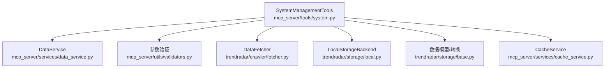
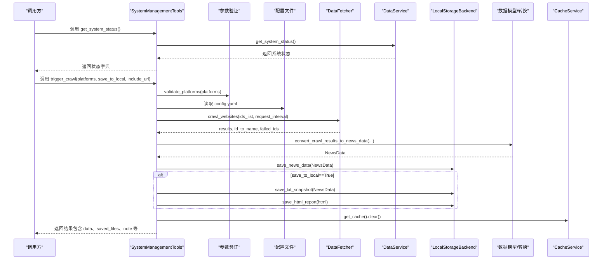
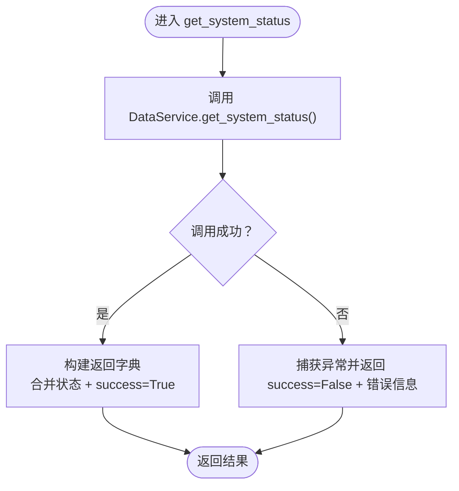
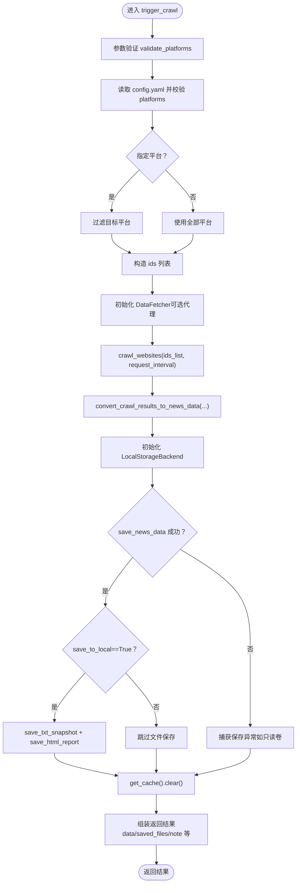
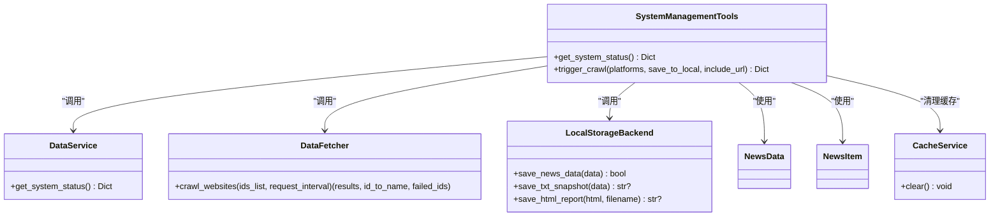

# 系统操作工具

<cite>
**本文引用的文件**
- [mcp_server/tools/system.py](file://mcp_server/tools/system.py)
- [mcp_server/services/data_service.py](file://mcp_server/services/data_service.py)
- [mcp_server/services/cache_service.py](file://mcp_server/services/cache_service.py)
- [mcp_server/utils/validators.py](file://mcp_server/utils/validators.py)
- [trendradar/crawler/fetcher.py](file://trendradar/crawler/fetcher.py)
- [trendradar/storage/base.py](file://trendradar/storage/base.py)
- [trendradar/storage/local.py](file://trendradar/storage/local.py)
- [README-MCP-FAQ.md](file://README-MCP-FAQ.md)
</cite>

## 目录
1. [简介](#简介)
2. [项目结构](#项目结构)
3. [核心组件](#核心组件)
4. [架构总览](#架构总览)
5. [详细组件分析](#详细组件分析)
6. [依赖关系分析](#依赖关系分析)
7. [性能考量](#性能考量)
8. [故障排查指南](#故障排查指南)
9. [结论](#结论)
10. [附录](#附录)

## 简介
本文件面向“系统操作工具”的使用者与维护者，围绕 SystemManagementTools 类的两大核心能力进行深入解析：
- get_system_status：通过 DataService 获取系统健康状态，包括版本、运行时间、数据规模、缓存状态等。
- trigger_crawl：手动触发临时/持久化爬取任务，覆盖参数校验、配置加载、爬虫调用、数据转换、本地存储与缓存清理全流程；并说明 save_to_local 与 include_url 的影响，以及 Docker 只读模式下的容错机制。

同时，结合 README-MCP-FAQ.md 中 Q11-Q13 的问答，解释如何通过该工具进行临时数据抓取与调试。

## 项目结构
- mcp_server/tools/system.py：系统管理工具入口，提供 get_system_status 与 trigger_crawl。
- mcp_server/services/data_service.py：数据服务，封装系统状态查询、数据查询、配置读取等。
- mcp_server/services/cache_service.py：全局缓存服务，提供 TTL 缓存与清理。
- mcp_server/utils/validators.py：参数验证工具，支持平台列表校验。
- trendradar/crawler/fetcher.py：数据获取器，封装对外部 API 的请求与重试。
- trendradar/storage/base.py：存储抽象与数据模型（NewsItem、NewsData、转换函数）。
- trendradar/storage/local.py：本地存储后端（SQLite + TXT/HTML），负责持久化与报告生成。
- README-MCP-FAQ.md：MCP 工具使用说明，包含 Q11-Q13 的临时/持久化爬取示例与行为说明。

图示来源
- [mcp_server/tools/system.py](file://mcp_server/tools/system.py#L1-L279)
- [mcp_server/services/data_service.py](file://mcp_server/services/data_service.py#L569-L624)
- [mcp_server/utils/validators.py](file://mcp_server/utils/validators.py#L43-L88)
- [trendradar/crawler/fetcher.py](file://trendradar/crawler/fetcher.py#L1-L185)
- [trendradar/storage/local.py](file://trendradar/storage/local.py#L1-L200)
- [trendradar/storage/base.py](file://trendradar/storage/base.py#L1-L120)
- [mcp_server/services/cache_service.py](file://mcp_server/services/cache_service.py#L1-L137)

章节来源
- [mcp_server/tools/system.py](file://mcp_server/tools/system.py#L1-L279)

## 核心组件
- SystemManagementTools：系统管理工具类，负责系统状态查询与手动触发爬取。
- DataService：系统状态查询、数据查询、配置读取等。
- DataFetcher：外部 API 爬虫调用器，支持重试与代理。
- LocalStorageBackend：本地存储后端，负责 SQLite 持久化、TXT/HTML 报告生成。
- CacheService：全局缓存，提供 TTL 缓存与清理。
- 参数验证器：校验平台列表等输入参数。

章节来源
- [mcp_server/tools/system.py](file://mcp_server/tools/system.py#L15-L279)
- [mcp_server/services/data_service.py](file://mcp_server/services/data_service.py#L569-L624)
- [mcp_server/utils/validators.py](file://mcp_server/utils/validators.py#L43-L88)
- [trendradar/crawler/fetcher.py](file://trendradar/crawler/fetcher.py#L1-L185)
- [trendradar/storage/local.py](file://trendradar/storage/local.py#L1-L200)
- [mcp_server/services/cache_service.py](file://mcp_server/services/cache_service.py#L1-L137)

## 架构总览
SystemManagementTools 作为入口，协调各子系统完成系统状态查询与爬取任务：
- get_system_status：委托 DataService 获取系统状态（版本、数据规模、缓存统计、健康状态）。
- trigger_crawl：参数校验 → 加载配置 → 爬虫调用 → 数据转换 → 本地存储 → 缓存清理 → 返回结果。

图示来源
- [mcp_server/tools/system.py](file://mcp_server/tools/system.py#L33-L279)
- [mcp_server/services/data_service.py](file://mcp_server/services/data_service.py#L569-L624)
- [mcp_server/utils/validators.py](file://mcp_server/utils/validators.py#L43-L88)
- [trendradar/crawler/fetcher.py](file://trendradar/crawler/fetcher.py#L117-L185)
- [trendradar/storage/base.py](file://trendradar/storage/base.py#L357-L420)
- [trendradar/storage/local.py](file://trendradar/storage/local.py#L113-L200)
- [mcp_server/services/cache_service.py](file://mcp_server/services/cache_service.py#L126-L137)

## 详细组件分析

### SystemManagementTools.get_system_status
- 作用：聚合系统状态信息，包括版本、项目根路径、数据规模、缓存统计与健康状态。
- 实现要点：
  - 调用 DataService.get_system_status() 获取系统状态。
  - 包装返回字段，追加 success 标记。
  - 异常处理：捕获 MCPError 与通用异常，返回 success=False 与错误信息。

图示来源
- [mcp_server/tools/system.py](file://mcp_server/tools/system.py#L33-L66)
- [mcp_server/services/data_service.py](file://mcp_server/services/data_service.py#L569-L624)

章节来源
- [mcp_server/tools/system.py](file://mcp_server/tools/system.py#L33-L66)
- [mcp_server/services/data_service.py](file://mcp_server/services/data_service.py#L569-L624)

### SystemManagementTools.trigger_crawl 完整流程
- 输入参数
  - platforms：平台列表，为空则使用配置文件中的所有平台。
  - save_to_local：是否保存到本地 output 目录（SQLite + TXT/HTML）。
  - include_url：是否在返回中包含 URL 与移动端 URL。
- 流程概览
  1) 参数验证：validate_platforms(platforms)。
  2) 配置加载：读取 config/config.yaml，校验 platforms 配置。
  3) 平台筛选：若未指定平台，则使用配置文件中的全部平台。
  4) 爬虫调用：DataFetcher.crawl_websites(ids_list, request_interval)，返回 results、id_to_name、failed_ids。
  5) 数据转换：convert_crawl_results_to_news_data(...)，生成 NewsData。
  6) 本地存储：
     - 优先保存到 SQLite（核心持久化）。
     - 若 save_to_local==True，再生成 TXT 快照与 HTML 报告。
  7) 缓存清理：get_cache().clear()，确保后续查询获取最新数据。
  8) 结果组装：按 include_url 控制返回字段，包含 data、saved_files、note、failed_platforms 等。
  9) 容错处理：捕获保存异常（如 Docker 只读卷导致的权限错误），区分“保存失败”与“数据库写入失败”，并给出提示。

图示来源
- [mcp_server/tools/system.py](file://mcp_server/tools/system.py#L68-L279)
- [mcp_server/utils/validators.py](file://mcp_server/utils/validators.py#L43-L88)
- [trendradar/crawler/fetcher.py](file://trendradar/crawler/fetcher.py#L117-L185)
- [trendradar/storage/base.py](file://trendradar/storage/base.py#L357-L420)
- [trendradar/storage/local.py](file://trendradar/storage/local.py#L113-L200)
- [mcp_server/services/cache_service.py](file://mcp_server/services/cache_service.py#L126-L137)

章节来源
- [mcp_server/tools/system.py](file://mcp_server/tools/system.py#L68-L279)

### 参数与行为说明
- save_to_local
  - 影响：当为 True 时，除 SQLite 持久化外，还会生成 TXT 快照与 HTML 报告。
  - 容错：若保存失败（如 Docker 只读卷），会返回 save_error 与 note，且 saved_to_local=false。
- include_url
  - 影响：当为 True 时，返回的 data 中每条新闻包含 url 与 mobile_url 字段，有助于调试与链接直达。
- Docker 只读模式容错
  - 若保存失败且包含“只读文件系统/权限拒绝”字样，工具会明确提示“爬取成功但无法写入数据库（Docker只读模式）”，数据仅在本次返回中有效。

章节来源
- [mcp_server/tools/system.py](file://mcp_server/tools/system.py#L181-L210)
- [mcp_server/tools/system.py](file://mcp_server/tools/system.py#L244-L258)

### 返回结果结构分析
- 成功场景
  - success: true
  - task_id: 任务标识
  - status: 任务状态
  - crawl_time: 抓取时间
  - platforms: 抓取的平台列表
  - total_news: 新闻总数
  - failed_platforms: 失败平台列表
  - data: 新闻数组（每条包含 platform_id、platform_name、title、ranks；若 include_url=true，还包含 url、mobile_url）
  - saved_to_local: 是否保存到本地
  - saved_files: 当保存成功且 save_to_local=true 时返回（如 txt、html 路径）
  - note: 说明信息（保存成功/失败、Docker 只读提示等）
- 失败场景
  - success: false
  - error: 错误信息（MCPError 或通用异常）

章节来源
- [mcp_server/tools/system.py](file://mcp_server/tools/system.py#L216-L262)

### 与 README-MCP-FAQ 的结合（Q11-Q13）
- Q11：如何临时抓取数据（不保存）？
  - 使用 trigger_crawl，不传 save_to_local 或显式设为 False，即可临时抓取并在返回中展示 data。
- Q12：如何持久化保存数据（保存到 output）？
  - 使用 trigger_crawl，传入 save_to_local=True，将生成 SQLite 数据与 TXT/HTML 快照。
- Q13：如何手动触发爬取任务？
  - 可以像“爬取当前的今日头条新闻”、“抓取并保存知乎新闻”、“获取 36 氪 的实时数据但不保存”等自然语言指令触发。
  - 工具支持指定平台、保存开关、包含链接等调整项。

章节来源
- [README-MCP-FAQ.md](file://README-MCP-FAQ.md#L416-L463)

## 依赖关系分析
- SystemManagementTools 依赖
  - DataService：系统状态查询。
  - 参数验证器：平台列表校验。
  - DataFetcher：外部 API 爬取。
  - LocalStorageBackend：本地持久化与报告生成。
  - 数据模型/转换：NewsItem、NewsData、convert_crawl_results_to_news_data。
  - CacheService：缓存清理。

图示来源
- [mcp_server/tools/system.py](file://mcp_server/tools/system.py#L15-L279)
- [mcp_server/services/data_service.py](file://mcp_server/services/data_service.py#L569-L624)
- [trendradar/crawler/fetcher.py](file://trendradar/crawler/fetcher.py#L117-L185)
- [trendradar/storage/local.py](file://trendradar/storage/local.py#L113-L200)
- [trendradar/storage/base.py](file://trendradar/storage/base.py#L1-L120)
- [mcp_server/services/cache_service.py](file://mcp_server/services/cache_service.py#L126-L137)

章节来源
- [mcp_server/tools/system.py](file://mcp_server/tools/system.py#L15-L279)

## 性能考量
- 缓存命中：DataService 在多项查询中使用 CacheService，减少重复 IO 与解析开销。
- 爬取间隔：DataFetcher.crawl_websites 支持 request_interval，避免过于频繁请求导致限流或失败。
- 数据转换：convert_crawl_results_to_news_data 采用批量处理，避免重复遍历。
- 存储优化：LocalStorageBackend 使用 SQLite，支持 ON CONFLICT/upsert 与批量插入，减少重复写入。

章节来源
- [mcp_server/services/cache_service.py](file://mcp_server/services/cache_service.py#L1-L137)
- [trendradar/crawler/fetcher.py](file://trendradar/crawler/fetcher.py#L117-L185)
- [trendradar/storage/base.py](file://trendradar/storage/base.py#L357-L420)
- [trendradar/storage/local.py](file://trendradar/storage/local.py#L113-L200)

## 故障排查指南
- 配置文件缺失或格式错误
  - 现象：抛出 CrawlTaskError，提示配置文件不存在或缺少 platforms。
  - 处理：确认 config/config.yaml 存在且包含 platforms 字段。
- 平台列表不合法
  - 现象：validate_platforms 抛出 InvalidParameterError。
  - 处理：检查平台 ID 是否存在于 config.yaml 的 platforms 列表中。
- 外部 API 请求失败
  - 现象：DataFetcher.crawl_websites 返回部分平台失败。
  - 处理：检查网络连通性、代理设置、API 状态；必要时增加重试与等待时间。
- 保存失败（Docker 只读卷）
  - 现象：返回 save_error 与 note，包含“只读文件系统/权限拒绝”提示。
  - 处理：在非只读挂载的目录下运行，或仅使用临时抓取（save_to_local=False）。
- 缓存未刷新导致数据陈旧
  - 现象：查询历史数据与最新数据不一致。
  - 处理：触发 trigger_crawl 后会自动清理缓存；也可手动调用 CacheService.clear()。

章节来源
- [mcp_server/tools/system.py](file://mcp_server/tools/system.py#L101-L131)
- [mcp_server/utils/validators.py](file://mcp_server/utils/validators.py#L43-L88)
- [trendradar/crawler/fetcher.py](file://trendradar/crawler/fetcher.py#L117-L185)
- [mcp_server/tools/system.py](file://mcp_server/tools/system.py#L205-L214)
- [mcp_server/services/cache_service.py](file://mcp_server/services/cache_service.py#L126-L137)

## 结论
SystemManagementTools 将系统状态查询与临时/持久化爬取整合为统一入口，通过参数验证、配置加载、爬虫调用、数据转换与本地存储的完整链路，实现了灵活可控的数据采集与调试能力。其对 Docker 只读模式的容错设计与缓存清理策略，保证了在多样化部署环境下的稳定性与一致性。

## 附录

### 调用示例与建议
- 临时抓取（不保存）
  - 传入 platforms（可选），save_to_local=False，include_url 可按需开启。
- 持久化抓取（保存到 output）
  - 传入 save_to_local=True，工具会在 SQLite 与 output 目录生成快照与报告。
- 指定平台
  - 传入 platforms=['zhihu','weibo'] 等，仅抓取指定平台。
- 包含链接
  - include_url=True 便于调试与直达原文。

章节来源
- [README-MCP-FAQ.md](file://README-MCP-FAQ.md#L416-L463)
- [mcp_server/tools/system.py](file://mcp_server/tools/system.py#L68-L100)