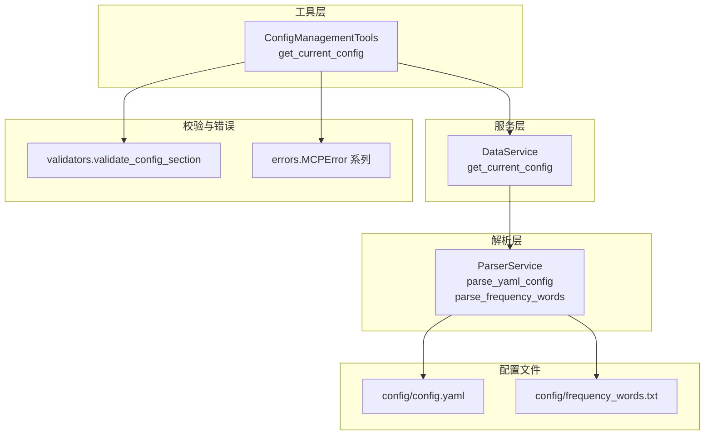
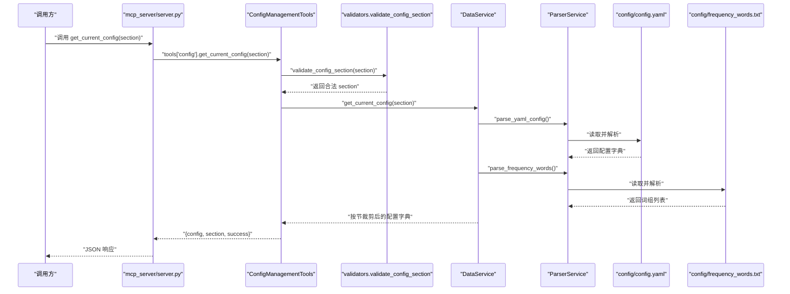
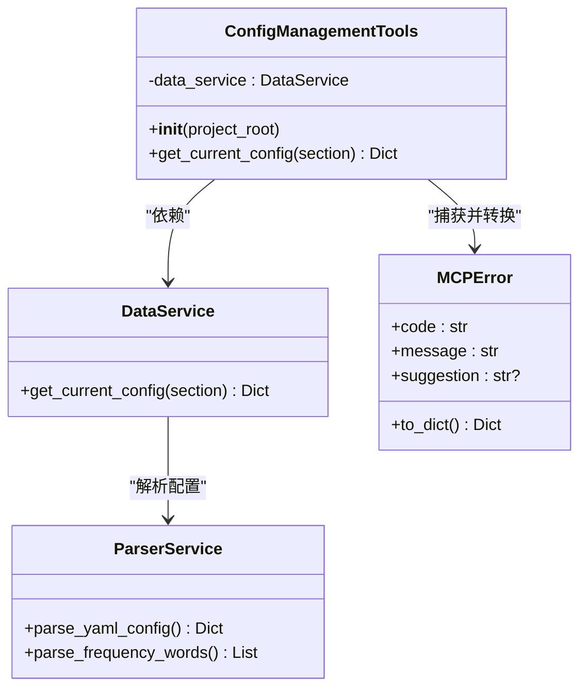
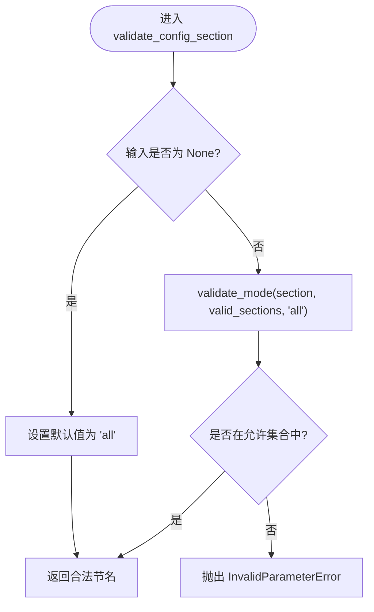
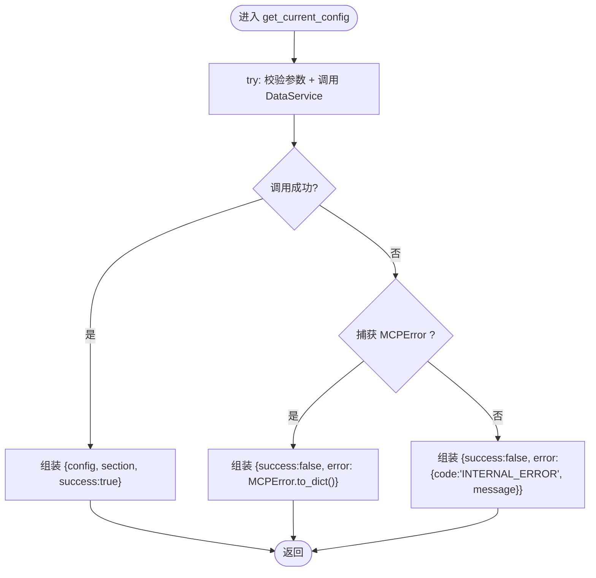
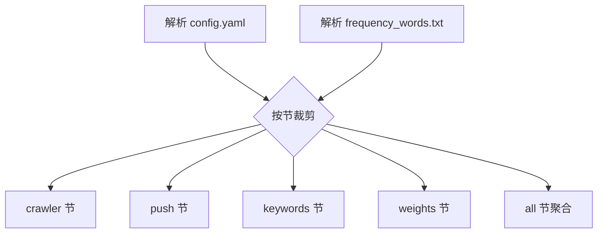
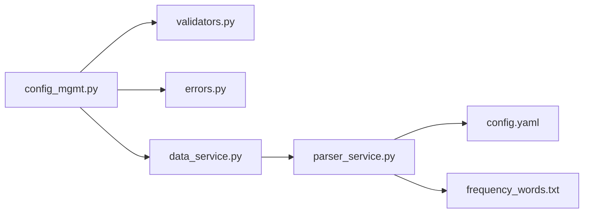

# 配置管理工具

<cite>
**本文引用的文件**
- [mcp_server/tools/config_mgmt.py](file://mcp_server/tools/config_mgmt.py)
- [mcp_server/services/data_service.py](file://mcp_server/services/data_service.py)
- [mcp_server/utils/validators.py](file://mcp_server/utils/validators.py)
- [mcp_server/utils/errors.py](file://mcp_server/utils/errors.py)
- [mcp_server/services/parser_service.py](file://mcp_server/services/parser_service.py)
- [config/config.yaml](file://config/config.yaml)
- [config/frequency_words.txt](file://config/frequency_words.txt)
- [mcp_server/server.py](file://mcp_server/server.py)
</cite>

## 目录
1. [简介](#简介)
2. [项目结构](#项目结构)
3. [核心组件](#核心组件)
4. [架构总览](#架构总览)
5. [详细组件分析](#详细组件分析)
6. [依赖分析](#依赖分析)
7. [性能考虑](#性能考虑)
8. [故障排查指南](#故障排查指南)
9. [结论](#结论)
10. [附录](#附录)

## 简介
本文件面向“配置管理工具”的使用者与维护者，聚焦于 ConfigManagementTools 类与其 get_current_config 方法。文档解释该工具如何通过 DataService 获取系统当前配置，并支持按配置节（section）查询，如 crawler、push、keywords、weights 等。同时详述参数验证机制 validate_config_section 与错误处理流程（MCPError 及内部异常的返回结构），并提供实际调用示例、在 AI 分析上下文中的集成方式以及与 config.yaml 的映射关系。最后给出常见问题排查建议。

## 项目结构
围绕配置管理的关键文件组织如下：
- 工具层：mcp_server/tools/config_mgmt.py
- 服务层：mcp_server/services/data_service.py
- 解析层：mcp_server/services/parser_service.py
- 校验与错误：mcp_server/utils/validators.py、mcp_server/utils/errors.py
- 配置文件：config/config.yaml、config/frequency_words.txt
- 服务入口：mcp_server/server.py（对外暴露 get_current_config 工具）

图表来源
- [mcp_server/tools/config_mgmt.py](file://mcp_server/tools/config_mgmt.py#L14-L67)
- [mcp_server/services/data_service.py](file://mcp_server/services/data_service.py#L411-L496)
- [mcp_server/services/parser_service.py](file://mcp_server/services/parser_service.py#L515-L542)
- [mcp_server/utils/validators.py](file://mcp_server/utils/validators.py#L292-L307)
- [mcp_server/utils/errors.py](file://mcp_server/utils/errors.py#L10-L94)
- [config/config.yaml](file://config/config.yaml#L53-L167)
- [config/frequency_words.txt](file://config/frequency_words.txt#L1-L114)

章节来源
- [mcp_server/tools/config_mgmt.py](file://mcp_server/tools/config_mgmt.py#L14-L67)
- [mcp_server/services/data_service.py](file://mcp_server/services/data_service.py#L411-L496)
- [mcp_server/services/parser_service.py](file://mcp_server/services/parser_service.py#L515-L542)
- [mcp_server/utils/validators.py](file://mcp_server/utils/validators.py#L292-L307)
- [mcp_server/utils/errors.py](file://mcp_server/utils/errors.py#L10-L94)
- [config/config.yaml](file://config/config.yaml#L53-L167)
- [config/frequency_words.txt](file://config/frequency_words.txt#L1-L114)

## 核心组件
- ConfigManagementTools：封装配置查询入口，负责参数校验与错误捕获，统一返回结构。
- DataService.get_current_config：从配置文件解析并按节裁剪返回，内置缓存。
- ParserService.parse_yaml_config / parse_frequency_words：读取 config.yaml 与 frequency_words.txt。
- validators.validate_config_section：限定 section 取值集合。
- errors.MCPError 系列：标准化错误返回结构。

章节来源
- [mcp_server/tools/config_mgmt.py](file://mcp_server/tools/config_mgmt.py#L14-L67)
- [mcp_server/services/data_service.py](file://mcp_server/services/data_service.py#L411-L496)
- [mcp_server/services/parser_service.py](file://mcp_server/services/parser_service.py#L515-L542)
- [mcp_server/utils/validators.py](file://mcp_server/utils/validators.py#L292-L307)
- [mcp_server/utils/errors.py](file://mcp_server/utils/errors.py#L10-L94)

## 架构总览
下图展示了从外部调用到最终返回的完整链路，包括参数校验、服务调用、文件解析与缓存命中。

图表来源
- [mcp_server/server.py](file://mcp_server/server.py#L600-L610)
- [mcp_server/tools/config_mgmt.py](file://mcp_server/tools/config_mgmt.py#L26-L67)
- [mcp_server/services/data_service.py](file://mcp_server/services/data_service.py#L411-L496)
- [mcp_server/services/parser_service.py](file://mcp_server/services/parser_service.py#L515-L542)
- [config/config.yaml](file://config/config.yaml#L53-L167)
- [config/frequency_words.txt](file://config/frequency_words.txt#L1-L114)

## 详细组件分析

### ConfigManagementTools 类与 get_current_config 方法
- 角色定位：对外提供统一的配置查询入口，负责参数校验与错误捕获，保证返回结构一致。
- 关键行为：
  - 参数校验：调用 validate_config_section(section)，限定取值为 all、crawler、push、keywords、weights。
  - 调用服务：委托 DataService.get_current_config(section) 获取配置。
  - 错误处理：捕获 MCPError，将其转换为统一的错误字典；捕获其他异常，返回 INTERNAL_ERROR 结构。
  - 返回结构：包含 config、section、success 字段；错误时包含 success=false 与 error 字段（含 code、message、可选 suggestion）。

图表来源
- [mcp_server/tools/config_mgmt.py](file://mcp_server/tools/config_mgmt.py#L14-L67)
- [mcp_server/services/data_service.py](file://mcp_server/services/data_service.py#L411-L496)
- [mcp_server/services/parser_service.py](file://mcp_server/services/parser_service.py#L515-L542)
- [mcp_server/utils/errors.py](file://mcp_server/utils/errors.py#L10-L28)

章节来源
- [mcp_server/tools/config_mgmt.py](file://mcp_server/tools/config_mgmt.py#L14-L67)
- [mcp_server/utils/errors.py](file://mcp_server/utils/errors.py#L10-L28)

### 参数验证机制 validate_config_section
- 输入：可选的配置节字符串（None 表示默认 all）。
- 输出：规范化后的合法节名（all、crawler、push、keywords、weights）。
- 异常：非法输入将抛出 InvalidParameterError（由 validate_mode 内部构造），最终被 ConfigManagementTools 捕获并转换为统一错误响应。

图表来源
- [mcp_server/utils/validators.py](file://mcp_server/utils/validators.py#L292-L307)

章节来源
- [mcp_server/utils/validators.py](file://mcp_server/utils/validators.py#L292-L307)

### 错误处理流程与返回结构
- MCPError：统一的错误基类，提供 to_dict() 将错误转为标准字典，包含 code、message、可选 suggestion。
- ConfigManagementTools：
  - 捕获 MCPError：返回 success=false，error 字段为 to_dict() 的结果。
  - 捕获其他异常：返回 success=false，error 字段为 {code: "INTERNAL_ERROR", message: str(ex)}。
- 返回结构约定：
  - 成功：{config: {...}, section: "...", success: true}
  - 失败：{success: false, error: {code, message, suggestion?}}

图表来源
- [mcp_server/tools/config_mgmt.py](file://mcp_server/tools/config_mgmt.py#L41-L67)
- [mcp_server/utils/errors.py](file://mcp_server/utils/errors.py#L10-L28)

章节来源
- [mcp_server/tools/config_mgmt.py](file://mcp_server/tools/config_mgmt.py#L41-L67)
- [mcp_server/utils/errors.py](file://mcp_server/utils/errors.py#L10-L28)

### 配置节与 config.yaml 的映射关系
DataService.get_current_config 会解析 config/config.yaml 与 config/frequency_words.txt，并按节裁剪返回：
- crawler 节：来源于 crawler、platforms 配置，包含启用开关、代理、请求间隔、平台列表等。
- push 节：来源于 notification 配置，包含启用开关、消息批次大小、推送窗口、已启用的通知渠道（根据 webhooks 是否配置）。
- keywords 节：来源于 frequency_words.txt，包含词组列表与总数。
- weights 节：来源于 weight 配置，包含 rank_weight、frequency_weight、hotness_weight。
- all 节：返回上述四节的聚合结果。

图表来源
- [mcp_server/services/data_service.py](file://mcp_server/services/data_service.py#L411-L496)
- [config/config.yaml](file://config/config.yaml#L53-L167)
- [config/frequency_words.txt](file://config/frequency_words.txt#L1-L114)

章节来源
- [mcp_server/services/data_service.py](file://mcp_server/services/data_service.py#L411-L496)
- [config/config.yaml](file://config/config.yaml#L53-L167)
- [config/frequency_words.txt](file://config/frequency_words.txt#L1-L114)

### 实际调用示例与在 AI 分析上下文中的集成
- 外部调用入口：mcp_server/server.py 中的 get_current_config 工具函数会转发调用 ConfigManagementTools.get_current_config，并返回 JSON。
- 在 AI 分析上下文中，可将返回的 config 字段直接用于提示词工程或决策分支，例如：
  - 读取 crawler.enable_crawler 判断是否允许爬取；
  - 读取 push.enabled_channels 选择合适的推送渠道；
  - 读取 keywords.word_groups 作为关键词池；
  - 读取 weights.* 作为加权策略输入。

章节来源
- [mcp_server/server.py](file://mcp_server/server.py#L600-L610)
- [mcp_server/tools/config_mgmt.py](file://mcp_server/tools/config_mgmt.py#L26-L67)
- [mcp_server/services/data_service.py](file://mcp_server/services/data_service.py#L411-L496)

## 依赖分析
- ConfigManagementTools 依赖：
  - validators.validate_config_section：参数合法性校验。
  - utils.errors.MCPError：统一错误结构。
  - services.data_service.DataService：配置读取与缓存。
- DataService 依赖：
  - services.parser_service.ParserService：解析 YAML 与词组文件。
  - utils.errors.DataNotFoundError/FileParseError：数据/文件解析异常。
- ParserService 依赖：
  - config/config.yaml、config/frequency_words.txt。

图表来源
- [mcp_server/tools/config_mgmt.py](file://mcp_server/tools/config_mgmt.py#L14-L67)
- [mcp_server/utils/validators.py](file://mcp_server/utils/validators.py#L292-L307)
- [mcp_server/utils/errors.py](file://mcp_server/utils/errors.py#L10-L94)
- [mcp_server/services/data_service.py](file://mcp_server/services/data_service.py#L411-L496)
- [mcp_server/services/parser_service.py](file://mcp_server/services/parser_service.py#L515-L542)
- [config/config.yaml](file://config/config.yaml#L53-L167)
- [config/frequency_words.txt](file://config/frequency_words.txt#L1-L114)

章节来源
- [mcp_server/tools/config_mgmt.py](file://mcp_server/tools/config_mgmt.py#L14-L67)
- [mcp_server/utils/validators.py](file://mcp_server/utils/validators.py#L292-L307)
- [mcp_server/utils/errors.py](file://mcp_server/utils/errors.py#L10-L94)
- [mcp_server/services/data_service.py](file://mcp_server/services/data_service.py#L411-L496)
- [mcp_server/services/parser_service.py](file://mcp_server/services/parser_service.py#L515-L542)
- [config/config.yaml](file://config/config.yaml#L53-L167)
- [config/frequency_words.txt](file://config/frequency_words.txt#L1-L114)

## 性能考虑
- 缓存策略：
  - DataService.get_current_config 对配置读取结果进行缓存，键为 "config:{section}"，TTL 1 小时，减少频繁解析 YAML 的开销。
  - ParserService.read_all_titles_for_date 对历史数据采用 1 小时缓存，今日数据 15 分钟缓存，提升查询性能。
- I/O 优化：
  - 优先解析 YAML 与词组文件，避免重复 IO。
  - 词组解析按行处理，忽略注释与空行，提高健壮性。
- 建议：
  - 在高频查询场景下，尽量复用同一实例，避免重复初始化。
  - 合理设置 section，避免不必要的全量返回。

章节来源
- [mcp_server/services/data_service.py](file://mcp_server/services/data_service.py#L411-L496)
- [mcp_server/services/parser_service.py](file://mcp_server/services/parser_service.py#L482-L514)

## 故障排查指南
- 常见问题与排查步骤：
  - 配置未生效或返回空值：
    - 检查 config/config.yaml 是否存在且可读；ParserService.parse_yaml_config 会在文件缺失时报 FileParseError。
    - 检查 section 是否正确（all、crawler、push、keywords、weights）；非法值会被 validate_config_section 抛出 InvalidParameterError。
    - 检查 frequency_words.txt 是否存在；若缺失，keywords 节将返回空词组列表。
  - 返回错误结构：
    - MCPError.to_dict() 会包含 code、message、可选 suggestion；根据 code 与 message 定位问题。
    - 内部异常会返回 INTERNAL_ERROR，message 为异常字符串，建议查看服务日志定位具体原因。
  - 推送渠道未识别：
    - push.enabled_channels 由 notification.webhooks 中的 feishu_url、dingtalk_url、wework_url 是否存在决定；确认这些字段是否配置。
  - 权重配置未生效：
    - 确认 weight 节下的 rank_weight、frequency_weight、hotness_weight 是否存在于 config.yaml。
  - 平台列表不匹配：
    - crawler.platforms 来源于 config.yaml 的 platforms 列表；若校验失败，会提示支持的平台列表。

章节来源
- [mcp_server/utils/errors.py](file://mcp_server/utils/errors.py#L10-L94)
- [mcp_server/utils/validators.py](file://mcp_server/utils/validators.py#L292-L307)
- [mcp_server/services/parser_service.py](file://mcp_server/services/parser_service.py#L515-L542)
- [mcp_server/services/data_service.py](file://mcp_server/services/data_service.py#L411-L496)
- [config/config.yaml](file://config/config.yaml#L53-L167)
- [config/frequency_words.txt](file://config/frequency_words.txt#L1-L114)

## 结论
ConfigManagementTools 通过清晰的参数校验与错误处理，将配置查询抽象为统一的返回结构，便于在 AI 分析与自动化流程中稳定使用。其与 DataService、ParserService 的协作实现了对 config.yaml 与 frequency_words.txt 的高效解析与缓存，满足多节查询需求。遵循本文的调用示例与故障排查建议，可快速定位配置相关问题并提升系统稳定性。

## 附录
- 调用入口参考：mcp_server/server.py 中的 get_current_config 工具函数。
- 配置节说明：
  - all：返回 crawler、push、keywords、weights 四节聚合。
  - crawler：爬取相关配置与平台列表。
  - push：通知与推送配置，含启用的渠道检测。
  - keywords：关键词词组列表与总数。
  - weights：排名、频次、热度权重。

章节来源
- [mcp_server/server.py](file://mcp_server/server.py#L600-L610)
- [mcp_server/services/data_service.py](file://mcp_server/services/data_service.py#L411-L496)
- [config/config.yaml](file://config/config.yaml#L53-L167)
- [config/frequency_words.txt](file://config/frequency_words.txt#L1-L114)