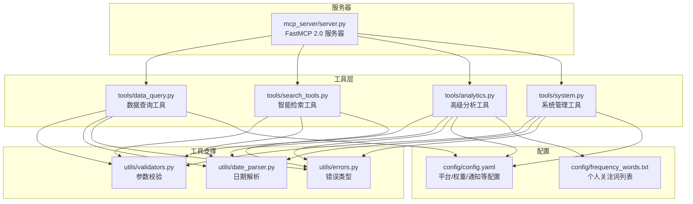
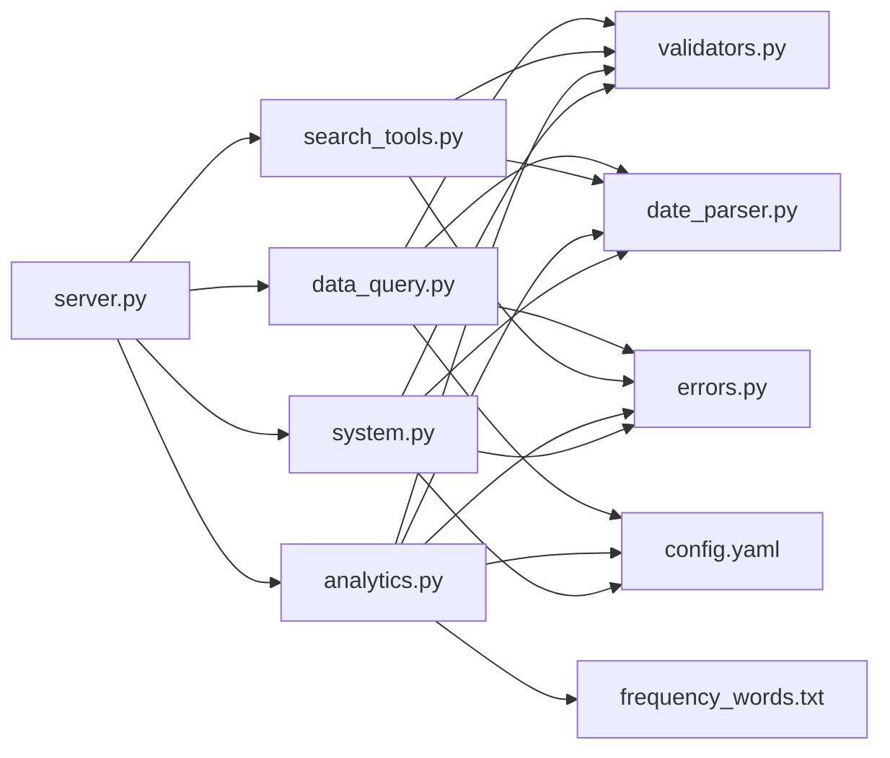

# API 参考文档

<cite>
**本文引用的文件**
- [docs/MCP-API-Reference.md](file://docs/MCP-API-Reference.md)
- [mcp_server/server.py](file://mcp_server/server.py)
- [mcp_server/tools/data_query.py](file://mcp_server/tools/data_query.py)
- [mcp_server/tools/analytics.py](file://mcp_server/tools/analytics.py)
- [mcp_server/tools/search_tools.py](file://mcp_server/tools/search_tools.py)
- [mcp_server/tools/system.py](file://mcp_server/tools/system.py)
- [mcp_server/utils/validators.py](file://mcp_server/utils/validators.py)
- [mcp_server/utils/date_parser.py](file://mcp_server/utils/date_parser.py)
- [mcp_server/utils/errors.py](file://mcp_server/utils/errors.py)
- [config/config.yaml](file://config/config.yaml)
- [config/frequency_words.txt](file://config/frequency_words.txt)
- [requirements.txt](file://requirements.txt)
</cite>

## 目录
1. [简介](#简介)
2. [项目结构](#项目结构)
3. [核心组件](#核心组件)
4. [架构总览](#架构总览)
5. [详细组件分析](#详细组件分析)
6. [依赖关系分析](#依赖关系分析)
7. [性能与使用建议](#性能与使用建议)
8. [故障排查指南](#故障排查指南)
9. [结论](#结论)
10. [附录](#附录)

## 简介
本文件为 TrendRadar MCP 服务器的正式 API 参考文档，聚焦于 AI 分析接口。文档基于 MCP-API-Reference.md 的定义，系统化列出 16 个工具接口（基础查询、智能检索、高级分析、系统管理），并提供：
- 方法名、输入参数类型与约束、返回数据结构
- 可能的错误码及含义
- WebSocket/STDIO 连接与消息序列、会话管理机制
- 客户端调用示例（Python/JavaScript）
- 速率限制策略、认证机制（如有）、向后兼容性说明

## 项目结构
- 服务器入口与工具注册集中在 mcp_server/server.py，通过 FastMCP 注册工具函数
- 工具实现按功能拆分为 tools 子模块：data_query、search_tools、analytics、system
- 参数校验与日期解析位于 utils 子模块；错误类型集中于 utils/errors.py
- 配置与关注词列表位于 config 目录



图表来源
- [mcp_server/server.py](file://mcp_server/server.py#L1-L120)
- [mcp_server/tools/data_query.py](file://mcp_server/tools/data_query.py#L1-L60)
- [mcp_server/tools/search_tools.py](file://mcp_server/tools/search_tools.py#L1-L60)
- [mcp_server/tools/analytics.py](file://mcp_server/tools/analytics.py#L1-L60)
- [mcp_server/tools/system.py](file://mcp_server/tools/system.py#L1-L40)
- [mcp_server/utils/validators.py](file://mcp_server/utils/validators.py#L1-L60)
- [mcp_server/utils/date_parser.py](file://mcp_server/utils/date_parser.py#L1-L60)
- [mcp_server/utils/errors.py](file://mcp_server/utils/errors.py#L1-L40)
- [config/config.yaml](file://config/config.yaml#L110-L140)
- [config/frequency_words.txt](file://config/frequency_words.txt#L1-L40)

章节来源
- [mcp_server/server.py](file://mcp_server/server.py#L1-L120)
- [config/config.yaml](file://config/config.yaml#L110-L140)

## 核心组件
- FastMCP 2.0 服务器：负责工具注册、消息路由与传输（STDIO/HTTP）
- 工具分类：
  - 基础查询：get_latest_news、get_news_by_date、get_trending_topics
  - 智能检索：search_news、search_related_news_history
  - 高级分析：analyze_topic_trend、analyze_data_insights、analyze_sentiment、find_similar_news、generate_summary_report、detect_viral_topics、predict_trending_topics
  - 系统管理：resolve_date_range、get_current_config、get_system_status、trigger_crawl

章节来源
- [docs/MCP-API-Reference.md](file://docs/MCP-API-Reference.md#L1-L120)
- [mcp_server/server.py](file://mcp_server/server.py#L110-L220)

## 架构总览
MCP 服务器通过 FastMCP 注册工具函数，客户端通过 STDIO 或 HTTP 与服务器交互。工具内部依赖 validators、date_parser、errors 等模块进行参数校验、日期解析与错误处理，并通过 services 访问数据。

```mermaid
sequenceDiagram
participant C as "客户端"
participant M as "FastMCP 服务器"
participant T as "工具实现"
participant V as "参数校验/日期解析"
participant E as "错误类型"
C->>M : "call_tool(方法名, 参数)"
M->>T : "调用对应工具函数"
T->>V : "参数校验/日期解析"
V-->>T : "校验结果/解析结果"
T-->>M : "JSON 结果或错误"
M-->>C : "返回结果"
Note over T,V,E : "错误通过统一结构返回"
```

图表来源
- [mcp_server/server.py](file://mcp_server/server.py#L110-L220)
- [mcp_server/utils/validators.py](file://mcp_server/utils/validators.py#L90-L140)
- [mcp_server/utils/date_parser.py](file://mcp_server/utils/date_parser.py#L330-L424)
- [mcp_server/utils/errors.py](file://mcp_server/utils/errors.py#L1-L40)

## 详细组件分析

### 1. 连接与传输
- 协议版本：MCP 2.0
- 传输模式：STDIO（推荐）/ HTTP
- HTTP 端点：/mcp
- 启动参数：
  - --transport: stdio/http
  - --host: HTTP 监听地址
  - --port: HTTP 监听端口
  - --project-root: 项目根目录

章节来源
- [docs/MCP-API-Reference.md](file://docs/MCP-API-Reference.md#L7-L13)
- [mcp_server/server.py](file://mcp_server/server.py#L660-L782)

### 2. 日期解析工具（推荐优先调用）
- 方法：resolve_date_range(expression)
- 作用：将自然语言日期表达式解析为标准日期范围，避免 AI 自行计算导致不一致
- 输入：expression（字符串，支持“今天/昨天/本周/上周/本月/上月/最近N天/last N days 等）
- 输出：包含 date_range、current_date、description 的 JSON
- 使用建议：在调用带 date_range 参数的工具前，先调用该工具获取精确日期范围

章节来源
- [mcp_server/server.py](file://mcp_server/server.py#L40-L110)
- [mcp_server/utils/date_parser.py](file://mcp_server/utils/date_parser.py#L330-L424)

### 3. 基础查询工具

#### 3.1 get_latest_news
- 功能：获取最新一批爬取的新闻数据
- 输入参数：
  - platforms（可选，数组）：平台ID列表
  - limit（可选，整数，默认50，最大1000）
  - include_url（可选，布尔，默认false）
- 输出：包含 news、total、platforms、success 的 JSON
- 约束与行为：
  - 若 limit 超过上限，将被拒绝
  - include_url 为 false 时减少 token 开销
  - 返回数量可能少于 limit（取决于可用数据）

章节来源
- [docs/MCP-API-Reference.md](file://docs/MCP-API-Reference.md#L18-L68)
- [mcp_server/server.py](file://mcp_server/server.py#L112-L149)
- [mcp_server/tools/data_query.py](file://mcp_server/tools/data_query.py#L34-L89)

#### 3.2 get_news_by_date
- 功能：按日期查询新闻，支持自然语言日期
- 输入参数：
  - date_query（可选，字符串，默认“今天”）
  - platforms（可选，数组）
  - limit（可选，整数，默认50，最大1000）
  - include_url（可选，布尔，默认false）
- 输出：包含 news、total、date、date_query、platforms、success 的 JSON
- 约束与行为：
  - 支持“今天/昨天/前天/3天前/2025-10-10/10月10日/2025年10月10日”等
  - 日期不可为未来或过久远（受 validators 与 date_parser 约束）

章节来源
- [docs/MCP-API-Reference.md](file://docs/MCP-API-Reference.md#L48-L118)
- [mcp_server/server.py](file://mcp_server/server.py#L176-L222)
- [mcp_server/tools/data_query.py](file://mcp_server/tools/data_query.py#L211-L285)
- [mcp_server/utils/validators.py](file://mcp_server/utils/validators.py#L309-L352)
- [mcp_server/utils/date_parser.py](file://mcp_server/utils/date_parser.py#L92-L248)

#### 3.3 get_trending_topics
- 功能：获取个人关注词的出现频率统计（基于 config/frequency_words.txt）
- 输入参数：
  - top_n（可选，整数，默认10，最大100）
  - mode（可选，字符串，默认“current”，可选“daily/current/incremental”）
- 输出：包含 topics、total_words、mode、success 的 JSON
- 约束与行为：
  - topics 中包含 word、count、platforms、sample_titles
  - 关注词列表来自 frequency_words.txt

章节来源
- [docs/MCP-API-Reference.md](file://docs/MCP-API-Reference.md#L69-L118)
- [mcp_server/server.py](file://mcp_server/server.py#L151-L174)
- [mcp_server/tools/data_query.py](file://mcp_server/tools/data_query.py#L154-L209)
- [config/frequency_words.txt](file://config/frequency_words.txt#L1-L114)

### 4. 智能检索工具

#### 4.1 search_news（统一新闻搜索）
- 功能：统一新闻搜索，支持关键词/模糊/实体三种模式
- 输入参数：
  - query（必需，字符串）
  - search_mode（可选，默认“keyword”，可选“keyword/fuzzy/entity”）
  - date_range（可选，对象 {"start":"YYYY-MM-DD","end":"YYYY-MM-DD"}）
  - platforms（可选，数组）
  - limit（可选，默认50，最大1000）
  - sort_by（可选，默认“relevance”，可选“relevance/weight/date”）
  - threshold（可选，0-1，默认0.6，仅 fuzzy 模式有效）
  - include_url（可选，默认false）
- 输出：包含 results、summary、success 的 JSON
- 约束与行为：
  - fuzzy 模式下 threshold 过高可能导致返回数量较少
  - weight 排序依赖 calculate_news_weight

章节来源
- [docs/MCP-API-Reference.md](file://docs/MCP-API-Reference.md#L119-L218)
- [mcp_server/server.py](file://mcp_server/server.py#L462-L539)
- [mcp_server/tools/search_tools.py](file://mcp_server/tools/search_tools.py#L38-L240)
- [mcp_server/tools/analytics.py](file://mcp_server/tools/analytics.py#L24-L75)

#### 4.2 search_related_news_history（历史相关新闻检索）
- 功能：基于种子新闻，在历史数据中搜索相关新闻
- 输入参数：
  - reference_text（必需，字符串）
  - time_preset（可选，默认“yesterday”，可选“yesterday/last_week/last_month/custom”）
  - start_date/end_date（可选，仅 custom 时有效）
  - threshold（可选，默认0.4，0-1）
  - limit（可选，默认50，最大100）
  - include_url（可选，默认false）
- 输出：包含 results、statistics、summary、success 的 JSON
- 约束与行为：
  - 综合相似度 = 关键词重合度×0.7 + 文本相似度×0.3

章节来源
- [docs/MCP-API-Reference.md](file://docs/MCP-API-Reference.md#L219-L285)
- [mcp_server/server.py](file://mcp_server/server.py#L541-L583)
- [mcp_server/tools/search_tools.py](file://mcp_server/tools/search_tools.py#L494-L702)

### 5. 高级分析工具

#### 5.1 analyze_topic_trend（统一话题趋势分析）
- 功能：整合趋势/生命周期/异常检测/预测四种分析
- 输入参数：
  - topic（可选，字符串；viral/predict 模式不需要）
  - analysis_type（可选，默认“trend”，可选“trend/lifecycle/viral/predict”）
  - date_range（可选，对象）
  - granularity（可选，默认“day”，当前仅支持 day）
  - threshold（可选，默认3.0，仅 viral 模式）
  - time_window（可选，默认24，仅 viral 模式）
  - lookahead_hours（可选，默认6，仅 predict 模式）
  - confidence_threshold（可选，默认0.7，仅 predict 模式）
- 输出：包含 trend_data、statistics、date_range、topic 等的 JSON
- 约束与行为：
  - 建议先调用 resolve_date_range 获取精确日期范围

章节来源
- [docs/MCP-API-Reference.md](file://docs/MCP-API-Reference.md#L150-L218)
- [mcp_server/server.py](file://mcp_server/server.py#L225-L289)
- [mcp_server/tools/analytics.py](file://mcp_server/tools/analytics.py#L156-L242)

#### 5.2 analyze_data_insights（统一数据洞察分析）
- 功能：平台对比/活跃度统计/关键词共现
- 输入参数：
  - insight_type（必需，“platform_compare/platform_activity/keyword_cooccur”）
  - topic（可选，仅 platform_compare）
  - date_range（可选，对象）
  - min_frequency（可选，默认3，最大100）
  - top_n（可选，默认20）
- 输出：根据类型返回平台对比/活跃度/共现结果的 JSON

章节来源
- [docs/MCP-API-Reference.md](file://docs/MCP-API-Reference.md#L183-L225)
- [mcp_server/server.py](file://mcp_server/server.py#L291-L332)
- [mcp_server/tools/analytics.py](file://mcp_server/tools/analytics.py#L89-L155)

#### 5.3 analyze_sentiment（情感倾向分析）
- 功能：生成用于 AI 情感分析的结构化提示词
- 输入参数：
  - topic（可选）
  - platforms（可选）
  - date_range（可选）
  - limit（可选，默认50，最大100）
  - sort_by_weight（可选，默认true）
  - include_url（可选，默认false）
- 输出：包含 ai_prompt、news_sample、summary、usage_note 的 JSON
- 约束与行为：
  - 返回前会去重（同一标题在不同平台只保留一次）

章节来源
- [docs/MCP-API-Reference.md](file://docs/MCP-API-Reference.md#L198-L275)
- [mcp_server/server.py](file://mcp_server/server.py#L334-L396)
- [mcp_server/tools/analytics.py](file://mcp_server/tools/analytics.py#L631-L800)

#### 5.4 find_similar_news（相似新闻查找）
- 功能：基于标题相似度查找相关新闻
- 输入参数：
  - reference_title（必需）
  - threshold（可选，默认0.6，0-1）
  - limit（可选，默认50，最大100）
  - include_url（可选，默认false）
- 输出：包含 results、summary、success 的 JSON

章节来源
- [docs/MCP-API-Reference.md](file://docs/MCP-API-Reference.md#L226-L249)
- [mcp_server/server.py](file://mcp_server/server.py#L398-L432)
- [mcp_server/tools/analytics.py](file://mcp_server/tools/analytics.py#L1-L23)

#### 5.5 generate_summary_report（生成摘要报告）
- 功能：自动生成每日/每周摘要报告
- 输入参数：
  - report_type（可选，默认“daily”，可选“daily/weekly”）
  - date_range（可选，对象）
- 输出：包含 markdown_report、statistics、date_range 的 JSON

章节来源
- [docs/MCP-API-Reference.md](file://docs/MCP-API-Reference.md#L250-L303)
- [mcp_server/server.py](file://mcp_server/server.py#L434-L458)
- [mcp_server/tools/analytics.py](file://mcp_server/tools/analytics.py#L1-L23)

#### 5.6 detect_viral_topics（异常热度检测）
- 功能：识别突然爆火的话题
- 输入参数：
  - threshold（可选，默认3.0）
  - time_window（可选，默认24，最大72）
- 输出：包含 viral_topics、total_detected、threshold、detection_time 的 JSON

章节来源
- [docs/MCP-API-Reference.md](file://docs/MCP-API-Reference.md#L277-L303)
- [mcp_server/server.py](file://mcp_server/server.py#L225-L289)
- [mcp_server/tools/analytics.py](file://mcp_server/tools/analytics.py#L156-L242)

#### 5.7 predict_trending_topics（预测未来热点）
- 功能：基于历史数据预测未来热点
- 输入参数：
  - lookahead_hours（可选，默认6，最大48）
  - confidence_threshold（可选，默认0.7）
- 输出：包含预测结果与置信度的 JSON

章节来源
- [docs/MCP-API-Reference.md](file://docs/MCP-API-Reference.md#L305-L313)
- [mcp_server/server.py](file://mcp_server/server.py#L225-L289)
- [mcp_server/tools/analytics.py](file://mcp_server/tools/analytics.py#L156-L242)

### 6. 系统管理工具

#### 6.1 get_current_config
- 功能：获取当前系统配置
- 输入参数：
  - section（可选，默认“all”，可选“all/crawler/push/keywords/weights”）
- 输出：配置信息 JSON

章节来源
- [docs/MCP-API-Reference.md](file://docs/MCP-API-Reference.md#L315-L326)
- [mcp_server/server.py](file://mcp_server/server.py#L587-L608)
- [mcp_server/tools/system.py](file://mcp_server/tools/system.py#L1-L46)

#### 6.2 get_system_status
- 功能：获取系统运行状态和健康检查
- 输出：包含 system、data、cache 等信息的 JSON

章节来源
- [docs/MCP-API-Reference.md](file://docs/MCP-API-Reference.md#L327-L354)
- [mcp_server/server.py](file://mcp_server/server.py#L610-L623)
- [mcp_server/tools/system.py](file://mcp_server/tools/system.py#L33-L67)

#### 6.3 trigger_crawl
- 功能：手动触发爬取任务（可选持久化）
- 输入参数：
  - platforms（可选，数组）
  - save_to_local（可选，默认false）
  - include_url（可选，默认false）
- 输出：包含 task_id、status、platforms、failed_platforms、total_news、data、saved_files 等的 JSON
- 约束与行为：
  - 会读取 config/config.yaml 的 platforms 配置
  - 支持本地保存 output 目录

章节来源
- [docs/MCP-API-Reference.md](file://docs/MCP-API-Reference.md#L356-L382)
- [mcp_server/server.py](file://mcp_server/server.py#L625-L658)
- [mcp_server/tools/system.py](file://mcp_server/tools/system.py#L68-L376)
- [config/config.yaml](file://config/config.yaml#L116-L140)

### 7. 错误处理与返回格式
- 统一错误响应格式：
  - {"success": false, "error": {"code": "...", "message": "...", "suggestion": "...", "details": {...}}}
- 常见错误码：
  - INVALID_PARAMETER：参数无效
  - DATA_NOT_FOUND：数据未找到
  - CRAWL_TASK_ERROR：爬虫任务错误
  - INTERNAL_ERROR：内部错误
  - NO_DATA_AVAILABLE：没有可用数据

章节来源
- [docs/MCP-API-Reference.md](file://docs/MCP-API-Reference.md#L384-L408)
- [mcp_server/utils/errors.py](file://mcp_server/utils/errors.py#L1-L94)

### 8. 客户端调用示例

#### 8.1 Python 客户端（STDIO）
- 使用 fastmcp 客户端连接到 mcp_server.server
- 示例调用：
  - get_latest_news
  - analyze_topic_trend_unified
- 参考示例路径：
  - [docs/MCP-API-Reference.md](file://docs/MCP-API-Reference.md#L410-L437)

#### 8.2 JavaScript 客户端（HTTP）
- 使用 @modelcontextprotocol/client 连接到 HTTP 端点
- 示例调用：
  - get_system_status
  - search_news_unified
- 参考示例路径：
  - [docs/MCP-API-Reference.md](file://docs/MCP-API-Reference.md#L438-L458)

章节来源
- [docs/MCP-API-Reference.md](file://docs/MCP-API-Reference.md#L410-L458)
- [requirements.txt](file://requirements.txt#L1-L6)

### 9. 会话与消息序列
- 会话管理：MCP 2.0 通过 FastMCP 管理工具调用生命周期
- 消息序列（概念示意）：
  1) 客户端连接（STDIO/HTTP）
  2) 客户端发送 call_tool 请求（方法名+参数）
  3) 服务器路由至对应工具函数
  4) 工具函数执行参数校验与业务逻辑
  5) 返回 JSON 结果或错误结构
- 会话状态：工具函数无显式会话状态，按请求独立处理

章节来源
- [mcp_server/server.py](file://mcp_server/server.py#L110-L220)

### 10. 速率限制与性能建议
- 速率限制：未发现内置限流策略
- 性能建议：
  - 合理使用 limit 参数，避免一次性获取过多数据
  - 启用缓存（系统会自动缓存常用查询结果）
  - 分批处理大数据：使用 date_range 分批查询历史数据
  - 选择合适的搜索模式：keyword/fuzzy/entity
  - 定期清理缓存（系统会自动清理过期缓存）

章节来源
- [docs/MCP-API-Reference.md](file://docs/MCP-API-Reference.md#L459-L475)

### 11. 认证机制
- 未发现内置认证机制
- 建议：在生产环境中通过反向代理或网关层添加认证与访问控制

章节来源
- [docs/MCP-API-Reference.md](file://docs/MCP-API-Reference.md#L7-L13)
- [mcp_server/server.py](file://mcp_server/server.py#L660-L782)

### 12. 向后兼容性
- 版本更新日志：
  - v1.0.0：初始版本，提供16种分析工具
  - v1.1.0：新增HTTP传输模式支持
  - v1.2.0：增强缓存机制和性能优化
  - v1.3.0：添加预测和异常检测功能
- 影响评估：新增工具与参数不影响既有接口签名，保持向后兼容

章节来源
- [docs/MCP-API-Reference.md](file://docs/MCP-API-Reference.md#L470-L475)

## 依赖关系分析



图表来源
- [mcp_server/server.py](file://mcp_server/server.py#L1-L120)
- [mcp_server/tools/data_query.py](file://mcp_server/tools/data_query.py#L1-L60)
- [mcp_server/tools/search_tools.py](file://mcp_server/tools/search_tools.py#L1-L60)
- [mcp_server/tools/analytics.py](file://mcp_server/tools/analytics.py#L1-L60)
- [mcp_server/tools/system.py](file://mcp_server/tools/system.py#L1-L40)
- [mcp_server/utils/validators.py](file://mcp_server/utils/validators.py#L1-L60)
- [mcp_server/utils/date_parser.py](file://mcp_server/utils/date_parser.py#L1-L60)
- [mcp_server/utils/errors.py](file://mcp_server/utils/errors.py#L1-L40)
- [config/config.yaml](file://config/config.yaml#L110-L140)
- [config/frequency_words.txt](file://config/frequency_words.txt#L1-L40)

章节来源
- [mcp_server/server.py](file://mcp_server/server.py#L1-L120)

## 性能与使用建议
- 合理使用 limit 参数，避免一次性获取过多数据
- 启用缓存（系统会自动缓存常用查询结果）
- 分批处理大数据：使用 date_range 分批查询历史数据
- 选择合适的搜索模式：精确匹配使用“keyword”模式；模糊搜索使用“fuzzy”模式；实体搜索使用“entity”模式
- 定期清理缓存（系统会自动清理过期缓存）

章节来源
- [docs/MCP-API-Reference.md](file://docs/MCP-API-Reference.md#L459-L475)

## 故障排查指南
- 常见错误码与含义：
  - INVALID_PARAMETER：参数无效
  - DATA_NOT_FOUND：数据未找到
  - CRAWL_TASK_ERROR：爬虫任务错误
  - INTERNAL_ERROR：内部错误
  - NO_DATA_AVAILABLE：没有可用数据
- 参数校验失败：
  - 检查 platforms 是否在 config/config.yaml 中配置
  - 检查 date_range 的 start/end 格式与先后顺序
  - 检查 limit 是否超过最大限制
- 爬取失败：
  - 检查 config/config.yaml 的 platforms 配置是否存在
  - 检查网络连通性与目标 API 状态
- 建议：
  - 使用 resolve_date_range 获取精确日期范围
  - 逐步缩小查询范围（减少 platforms、缩短 date_range、降低 limit）

章节来源
- [docs/MCP-API-Reference.md](file://docs/MCP-API-Reference.md#L384-L408)
- [mcp_server/utils/errors.py](file://mcp_server/utils/errors.py#L1-L94)
- [mcp_server/utils/validators.py](file://mcp_server/utils/validators.py#L90-L140)
- [mcp_server/server.py](file://mcp_server/server.py#L40-L110)

## 结论
本参考文档系统化梳理了 TrendRadar MCP 服务器的 16 个 AI 分析接口，覆盖连接方式、参数约束、返回结构、错误处理、性能建议与客户端示例。通过统一的工具注册与参数校验机制，开发者可稳定地将这些能力集成到第三方应用中。

## 附录

### A. 工具清单与分类
- 基础查询：get_latest_news、get_news_by_date、get_trending_topics
- 智能检索：search_news、search_related_news_history
- 高级分析：analyze_topic_trend、analyze_data_insights、analyze_sentiment、find_similar_news、generate_summary_report、detect_viral_topics、predict_trending_topics
- 系统管理：resolve_date_range、get_current_config、get_system_status、trigger_crawl

章节来源
- [docs/MCP-API-Reference.md](file://docs/MCP-API-Reference.md#L14-L120)
- [mcp_server/server.py](file://mcp_server/server.py#L700-L740)

### B. 配置与关注词
- 平台配置：config/config.yaml 的 platforms 列表
- 关注词列表：config/frequency_words.txt

章节来源
- [config/config.yaml](file://config/config.yaml#L116-L140)
- [config/frequency_words.txt](file://config/frequency_words.txt#L1-L114)