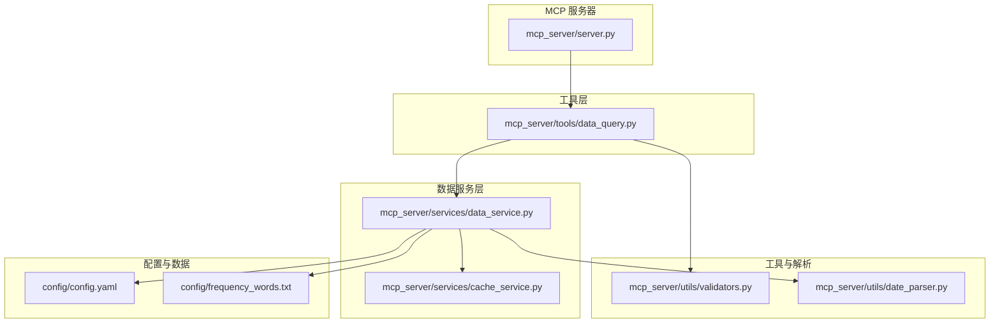
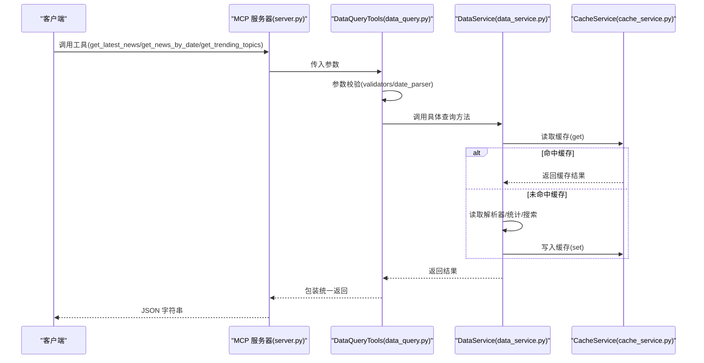
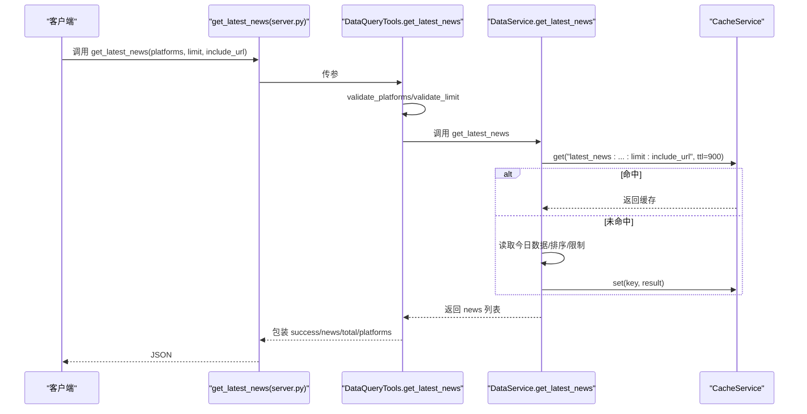
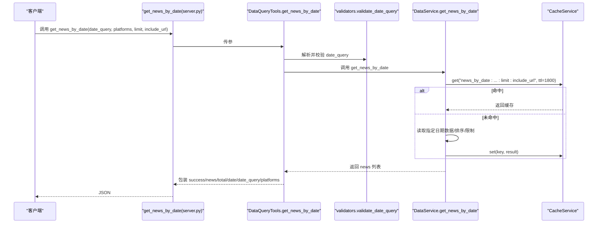
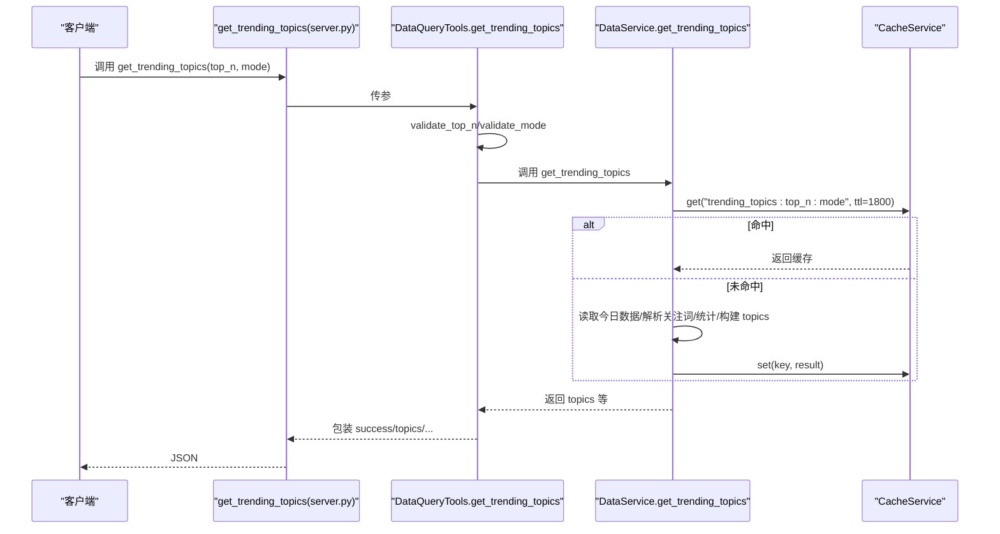
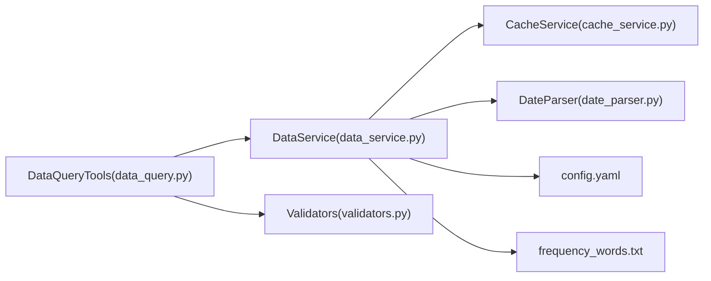

# 基础查询工具

<cite>
**本文引用的文件**
- [mcp_server/server.py](file://mcp_server/server.py)
- [mcp_server/tools/data_query.py](file://mcp_server/tools/data_query.py)
- [mcp_server/services/data_service.py](file://mcp_server/services/data_service.py)
- [mcp_server/services/cache_service.py](file://mcp_server/services/cache_service.py)
- [mcp_server/utils/validators.py](file://mcp_server/utils/validators.py)
- [mcp_server/utils/date_parser.py](file://mcp_server/utils/date_parser.py)
- [config/config.yaml](file://config/config.yaml)
- [config/frequency_words.txt](file://config/frequency_words.txt)
- [docs/MCP-API-Reference.md](file://docs/MCP-API-Reference.md)
</cite>

## 目录
1. [简介](#简介)
2. [项目结构](#项目结构)
3. [核心组件](#核心组件)
4. [架构总览](#架构总览)
5. [详细组件分析](#详细组件分析)
6. [依赖关系分析](#依赖关系分析)
7. [性能考量](#性能考量)
8. [故障排查指南](#故障排查指南)
9. [结论](#结论)
10. [附录](#附录)

## 简介
本文件面向使用 TrendRadar MCP 服务器的开发者与集成者，聚焦 P0 核心基础数据查询工具：get_latest_news、get_news_by_date、get_trending_topics。文档覆盖参数约束、返回数据结构、错误处理机制、与数据采集系统及缓存服务的交互方式，并提供 Python/JavaScript 的调用示例与自然语言处理场景的最佳实践建议。同时给出性能优化建议，包括合理使用 limit 参数与缓存策略。

## 项目结构
- MCP 服务器入口与工具注册位于 mcp_server/server.py，其中通过装饰器注册 get_latest_news、get_news_by_date、get_trending_topics 等工具。
- 工具层实现位于 mcp_server/tools/data_query.py，负责参数校验与调用数据服务。
- 数据服务位于 mcp_server/services/data_service.py，封装读取解析、缓存、统计等核心逻辑。
- 缓存服务位于 mcp_server/services/cache_service.py，提供 TTL 缓存能力。
- 参数校验与日期解析分别位于 mcp_server/utils/validators.py 与 mcp_server/utils/date_parser.py。
- 配置与关注词列表分别来自 config/config.yaml 与 config/frequency_words.txt。
- API 参考文档位于 docs/MCP-API-Reference.md，包含工具参数、返回示例与调用示例。

图表来源
- [mcp_server/server.py](file://mcp_server/server.py#L113-L200)
- [mcp_server/tools/data_query.py](file://mcp_server/tools/data_query.py#L1-L285)
- [mcp_server/services/data_service.py](file://mcp_server/services/data_service.py#L1-L605)
- [mcp_server/services/cache_service.py](file://mcp_server/services/cache_service.py#L1-L137)
- [mcp_server/utils/validators.py](file://mcp_server/utils/validators.py#L1-L352)
- [mcp_server/utils/date_parser.py](file://mcp_server/utils/date_parser.py#L1-L508)
- [config/config.yaml](file://config/config.yaml#L110-L140)
- [config/frequency_words.txt](file://config/frequency_words.txt#L1-L114)

章节来源
- [mcp_server/server.py](file://mcp_server/server.py#L113-L200)
- [docs/MCP-API-Reference.md](file://docs/MCP-API-Reference.md#L1-L71)

## 核心组件
- DataQueryTools：封装 get_latest_news、get_news_by_date、get_trending_topics 三个工具，负责参数校验与调用 DataService。
- DataService：统一数据访问层，实现 get_latest_news、get_news_by_date、get_trending_topics 的业务逻辑，内置缓存与解析器。
- CacheService：提供内存级 TTL 缓存，支持 get/set/delete/clear/cleanup_expired/get_stats。
- Validators：参数校验工具，涵盖平台、limit、日期范围、关键词、top_n、mode、date_query 等。
- DateParser：自然语言日期解析器，支持相对日期、绝对日期、星期、最近N天等表达式。
- 配置与关注词：config/config.yaml 提供平台列表与权重配置；config/frequency_words.txt 提供个人关注词列表。

章节来源
- [mcp_server/tools/data_query.py](file://mcp_server/tools/data_query.py#L22-L285)
- [mcp_server/services/data_service.py](file://mcp_server/services/data_service.py#L1-L605)
- [mcp_server/services/cache_service.py](file://mcp_server/services/cache_service.py#L1-L137)
- [mcp_server/utils/validators.py](file://mcp_server/utils/validators.py#L1-L352)
- [mcp_server/utils/date_parser.py](file://mcp_server/utils/date_parser.py#L1-L508)
- [config/config.yaml](file://config/config.yaml#L110-L140)
- [config/frequency_words.txt](file://config/frequency_words.txt#L1-L114)

## 架构总览
MCP 服务器通过装饰器注册工具函数，工具函数内部委托 DataQueryTools，后者再调用 DataService。DataService 读取解析器 ParserService 的输出，结合缓存服务 CacheService 提升性能，并在必要时抛出 DataNotFoundError。参数校验由 Validators 与 DateParser 负责，确保输入合法与日期解析准确。

图表来源
- [mcp_server/server.py](file://mcp_server/server.py#L113-L200)
- [mcp_server/tools/data_query.py](file://mcp_server/tools/data_query.py#L34-L285)
- [mcp_server/services/data_service.py](file://mcp_server/services/data_service.py#L30-L182)
- [mcp_server/services/cache_service.py](file://mcp_server/services/cache_service.py#L21-L54)

## 详细组件分析

### get_latest_news
- 作用：获取最新一批爬取的新闻数据，快速了解当前热点。
- 参数约束
  - platforms: 可选，平台ID列表；若为空或 None，则使用 config.yaml 中配置的所有平台。
  - limit: 可选，返回条数限制，默认50，最大1000。
  - include_url: 可选，是否包含 URL 链接，默认 False（节省 token）。
- 返回结构
  - success: 布尔值，表示请求是否成功。
  - news: 新闻列表，每条包含 title、platform、platform_name、rank、timestamp（以及可选 url/mobileUrl）。
  - total: 返回条数。
  - platforms: 实际使用的平台列表。
- 错误处理
  - 参数校验失败：返回统一错误结构，包含 code/message/suggestion。
  - 其他异常：返回 INTERNAL_ERROR。
- 与数据采集/缓存交互
  - 读取 today 的数据，按最新文件时间确定抓取时间戳，按 rank 排序，限制数量并写入缓存（15分钟 TTL）。
- 调用示例
  - Python 客户端示例参见 API 参考文档。
  - JavaScript 客户端示例参见 API 参考文档。

图表来源
- [mcp_server/server.py](file://mcp_server/server.py#L113-L149)
- [mcp_server/tools/data_query.py](file://mcp_server/tools/data_query.py#L34-L89)
- [mcp_server/services/data_service.py](file://mcp_server/services/data_service.py#L30-L103)
- [mcp_server/services/cache_service.py](file://mcp_server/services/cache_service.py#L21-L54)

章节来源
- [mcp_server/server.py](file://mcp_server/server.py#L113-L149)
- [mcp_server/tools/data_query.py](file://mcp_server/tools/data_query.py#L34-L89)
- [mcp_server/services/data_service.py](file://mcp_server/services/data_service.py#L30-L103)
- [docs/MCP-API-Reference.md](file://docs/MCP-API-Reference.md#L18-L47)

### get_news_by_date
- 作用：按日期查询新闻，支持自然语言日期（如“今天”、“昨天”、“上周一”、“3天前”、“2025-10-10”等）。
- 参数约束
  - date_query: 可选，默认“今天”，支持相对日期、星期、绝对日期。
  - platforms: 可选，平台ID列表；若为空或 None，则使用 config.yaml 中配置的所有平台。
  - limit: 可选，返回条数限制，默认50，最大1000。
  - include_url: 可选，是否包含 URL 链接，默认 False（节省 token）。
- 返回结构
  - success: 布尔值。
  - news: 新闻列表，每条包含 title、platform、platform_name、rank、avg_rank、count、date（以及可选 url/mobileUrl）。
  - total: 返回条数。
  - date: 查询目标日期（YYYY-MM-DD）。
  - date_query: 实际使用的日期查询字符串。
  - platforms: 实际使用的平台列表。
- 错误处理
  - 参数校验失败：返回统一错误结构。
  - 日期解析失败或超出允许范围：返回 INVALID_PARAMETER。
  - 其他异常：返回 INTERNAL_ERROR。
- 与数据采集/缓存交互
  - 使用 DateParser 解析 date_query，读取指定日期数据，按 rank 排序并限制数量，写入缓存（30分钟 TTL）。
- 调用示例
  - Python/JavaScript 客户端示例参见 API 参考文档。

图表来源
- [mcp_server/server.py](file://mcp_server/server.py#L176-L200)
- [mcp_server/tools/data_query.py](file://mcp_server/tools/data_query.py#L211-L285)
- [mcp_server/utils/validators.py](file://mcp_server/utils/validators.py#L309-L352)
- [mcp_server/services/data_service.py](file://mcp_server/services/data_service.py#L104-L182)
- [mcp_server/services/cache_service.py](file://mcp_server/services/cache_service.py#L21-L54)

章节来源
- [mcp_server/server.py](file://mcp_server/server.py#L176-L200)
- [mcp_server/tools/data_query.py](file://mcp_server/tools/data_query.py#L211-L285)
- [mcp_server/utils/date_parser.py](file://mcp_server/utils/date_parser.py#L92-L248)
- [mcp_server/utils/validators.py](file://mcp_server/utils/validators.py#L309-L352)
- [mcp_server/services/data_service.py](file://mcp_server/services/data_service.py#L104-L182)
- [docs/MCP-API-Reference.md](file://docs/MCP-API-Reference.md#L48-L68)

### get_trending_topics
- 作用：获取个人关注词的新闻出现频率统计。注意：本工具基于 config/frequency_words.txt 中的个人关注词列表进行统计，而非自动提取新闻热点。
- 参数约束
  - top_n: 可选，返回 TOP N 关注词，默认10，最大50。
  - mode: 可选，统计模式，默认 current，支持 daily/current。
- 返回结构
  - success: 布尔值。
  - topics: 话题列表，每项包含 keyword、frequency、matched_news、trend、weight_score。
  - generated_at: 统计生成时间。
  - mode: 实际使用的模式。
  - total_keywords: 关注词总数。
  - description: 模式描述。
- 错误处理
  - 参数校验失败：返回统一错误结构。
  - 无数据：返回 DATA_NOT_FOUND。
  - 其他异常：返回 INTERNAL_ERROR。
- 与数据采集/缓存交互
  - 读取 today 的数据，加载关注词组，按 mode 选择处理范围（daily/current），统计词频并写入缓存（30分钟 TTL）。
- 调用示例
  - Python/JavaScript 客户端示例参见 API 参考文档。

图表来源
- [mcp_server/server.py](file://mcp_server/server.py#L151-L174)
- [mcp_server/tools/data_query.py](file://mcp_server/tools/data_query.py#L154-L209)
- [mcp_server/services/data_service.py](file://mcp_server/services/data_service.py#L285-L401)
- [mcp_server/services/cache_service.py](file://mcp_server/services/cache_service.py#L21-L54)

章节来源
- [mcp_server/server.py](file://mcp_server/server.py#L151-L174)
- [mcp_server/tools/data_query.py](file://mcp_server/tools/data_query.py#L154-L209)
- [mcp_server/services/data_service.py](file://mcp_server/services/data_service.py#L285-L401)
- [config/frequency_words.txt](file://config/frequency_words.txt#L1-L114)
- [docs/MCP-API-Reference.md](file://docs/MCP-API-Reference.md#L69-L95)

## 依赖关系分析
- 工具层依赖数据服务层，数据服务层依赖缓存服务与解析器。
- 参数校验与日期解析贯穿工具层与数据服务层，确保输入合法与日期解析准确。
- 配置与关注词列表为数据服务层提供平台与关键词依据。

图表来源
- [mcp_server/tools/data_query.py](file://mcp_server/tools/data_query.py#L1-L285)
- [mcp_server/services/data_service.py](file://mcp_server/services/data_service.py#L1-L605)
- [mcp_server/services/cache_service.py](file://mcp_server/services/cache_service.py#L1-L137)
- [mcp_server/utils/validators.py](file://mcp_server/utils/validators.py#L1-L352)
- [mcp_server/utils/date_parser.py](file://mcp_server/utils/date_parser.py#L1-L508)
- [config/config.yaml](file://config/config.yaml#L110-L140)
- [config/frequency_words.txt](file://config/frequency_words.txt#L1-L114)

章节来源
- [mcp_server/tools/data_query.py](file://mcp_server/tools/data_query.py#L1-L285)
- [mcp_server/services/data_service.py](file://mcp_server/services/data_service.py#L1-L605)
- [mcp_server/utils/validators.py](file://mcp_server/utils/validators.py#L1-L352)
- [mcp_server/utils/date_parser.py](file://mcp_server/utils/date_parser.py#L1-L508)

## 性能考量
- 合理使用 limit 参数
  - 三个工具均支持 limit，最大值分别为 1000（工具层默认上限，实际受数据总量限制）。建议根据下游展示需求设置较小的 limit，避免一次性传输过多数据。
- 缓存策略
  - get_latest_news：15 分钟 TTL；get_news_by_date、get_trending_topics：30 分钟 TTL。缓存键包含关键参数（如平台、limit、include_url、日期等），避免重复计算。
  - CacheService 提供清理过期缓存与统计信息接口，便于运维观察。
- 数据读取与排序
  - 服务层按 rank 排序并限制数量，减少后续处理开销。
- 历史数据与缓存
  - get_news_by_date 对历史日期数据采用较长 TTL，且会缓存结果，提升重复查询效率。
- 建议
  - 对频繁查询的组合参数（如平台+limit+include_url）尽量复用，以充分利用缓存。
  - 在自然语言处理场景中，优先使用 resolve_date_range 获取标准日期范围，避免模型自行计算导致不一致与重复请求。

章节来源
- [mcp_server/services/data_service.py](file://mcp_server/services/data_service.py#L30-L103)
- [mcp_server/services/data_service.py](file://mcp_server/services/data_service.py#L104-L182)
- [mcp_server/services/data_service.py](file://mcp_server/services/data_service.py#L285-L401)
- [mcp_server/services/cache_service.py](file://mcp_server/services/cache_service.py#L21-L54)
- [mcp_server/services/cache_service.py](file://mcp_server/services/cache_service.py#L78-L100)
- [docs/MCP-API-Reference.md](file://docs/MCP-API-Reference.md#L459-L475)

## 故障排查指南
- 常见错误码
  - INVALID_PARAMETER：参数无效（如 limit 超限、日期格式错误、平台不支持等）。
  - DATA_NOT_FOUND：未找到数据（如关键词搜索无结果、今日无数据）。
  - INTERNAL_ERROR：内部错误。
- 参数校验失败
  - platforms：若配置加载失败，将允许所有平台通过（降级策略）。
  - limit/top_n：超过最大值将被拒绝。
  - date_range：开始日期不得晚于结束日期，且不得查询未来日期；超出允许范围会提示可用日期范围。
  - date_query：不支持的日期表达式或日期过久远会被拒绝。
- 日期解析失败
  - DateParser 支持多种自然语言日期格式，若无法识别会返回详细提示。
- 缓存问题
  - 若怀疑缓存污染，可调用 CacheService 的清理接口或清空缓存，再重试。
- 配置问题
  - platforms 列表来自 config/config.yaml；关注词来自 config/frequency_words.txt。请确认配置文件存在且格式正确。

章节来源
- [mcp_server/utils/validators.py](file://mcp_server/utils/validators.py#L90-L121)
- [mcp_server/utils/validators.py](file://mcp_server/utils/validators.py#L145-L209)
- [mcp_server/utils/validators.py](file://mcp_server/utils/validators.py#L212-L243)
- [mcp_server/utils/validators.py](file://mcp_server/utils/validators.py#L245-L259)
- [mcp_server/utils/validators.py](file://mcp_server/utils/validators.py#L262-L289)
- [mcp_server/utils/validators.py](file://mcp_server/utils/validators.py#L292-L307)
- [mcp_server/utils/validators.py](file://mcp_server/utils/validators.py#L309-L352)
- [mcp_server/utils/date_parser.py](file://mcp_server/utils/date_parser.py#L92-L248)
- [mcp_server/utils/date_parser.py](file://mcp_server/utils/date_parser.py#L278-L329)
- [mcp_server/services/cache_service.py](file://mcp_server/services/cache_service.py#L78-L100)

## 结论
get_latest_news、get_news_by_date、get_trending_topics 三个基础查询工具通过清晰的参数约束、统一的返回结构与完善的错误处理，为自然语言处理场景提供了稳定可靠的数据入口。配合内置缓存与参数校验，能够在保证一致性的同时显著提升性能。建议在实际集成中遵循 limit 与缓存的最佳实践，并结合 resolve_date_range 等工具确保日期解析的一致性。

## 附录
- 调用示例（Python/JavaScript）
  - 参考 API 参考文档中的示例与配置说明。
- 配置参考
  - 平台列表与权重配置：config/config.yaml。
  - 关注词列表：config/frequency_words.txt。

章节来源
- [docs/MCP-API-Reference.md](file://docs/MCP-API-Reference.md#L408-L458)
- [config/config.yaml](file://config/config.yaml#L110-L140)
- [config/frequency_words.txt](file://config/frequency_words.txt#L1-L114)