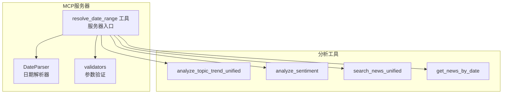
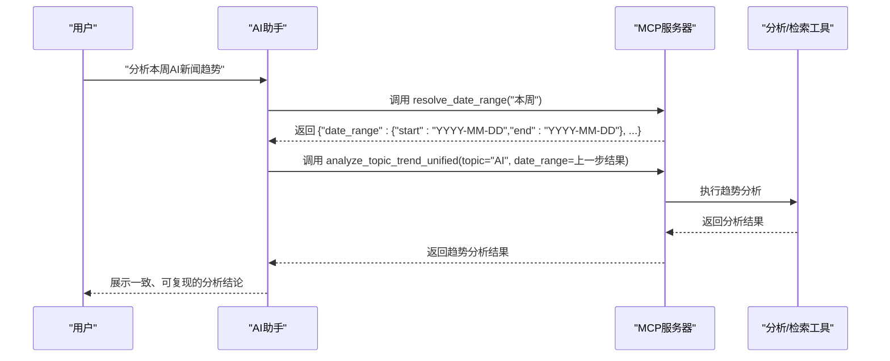
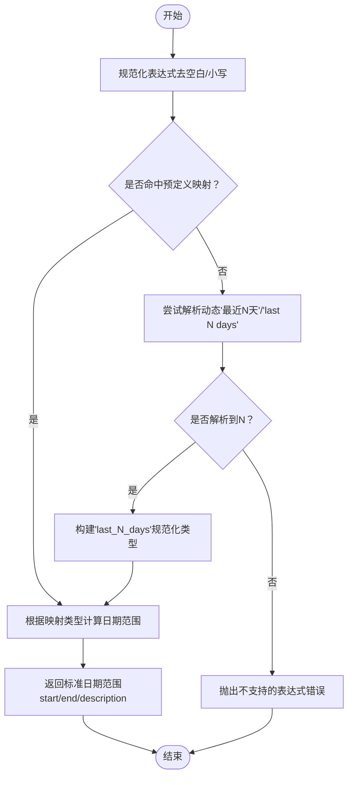
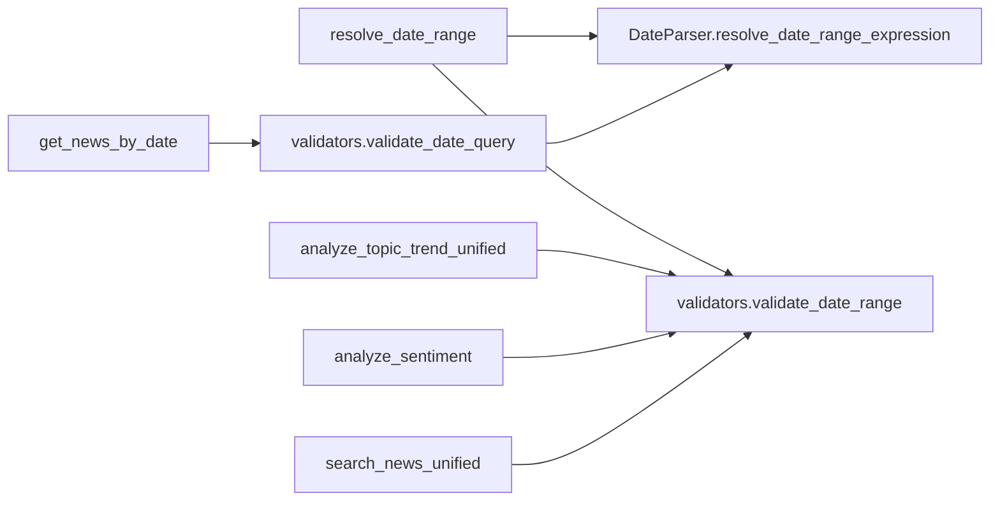

# 日期解析工具

<cite>
**本文引用的文件**
- [mcp_server/server.py](file://mcp_server/server.py)
- [mcp_server/utils/date_parser.py](file://mcp_server/utils/date_parser.py)
- [mcp_server/utils/validators.py](file://mcp_server/utils/validators.py)
- [mcp_server/tools/analytics.py](file://mcp_server/tools/analytics.py)
- [mcp_server/tools/search_tools.py](file://mcp_server/tools/search_tools.py)
- [mcp_server/tools/data_query.py](file://mcp_server/tools/data_query.py)
- [docs/MCP-API-Reference.md](file://docs/MCP-API-Reference.md)
- [config/config.yaml](file://config/config.yaml)
</cite>

## 目录
1. [简介](#简介)
2. [项目结构](#项目结构)
3. [核心组件](#核心组件)
4. [架构总览](#架构总览)
5. [详细组件分析](#详细组件分析)
6. [依赖关系分析](#依赖关系分析)
7. [性能考量](#性能考量)
8. [故障排查指南](#故障排查指南)
9. [结论](#结论)
10. [附录](#附录)

## 简介
本文件聚焦于MCP服务器的“日期解析工具”，即resolve_date_range工具，旨在帮助AI对话系统将自然语言日期表达（如“本周”、“最近7天”）稳定地转换为标准日期范围，从而确保所有后续分析工具（如话题趋势分析、新闻检索等）使用一致的基准时间，显著提升AI响应的准确性与一致性。

## 项目结构
- 日期解析工具位于MCP服务器入口文件中，作为首个推荐调用的工具，负责把自然语言日期表达解析为标准的{"start":"YYYY-MM-DD","end":"YYYY-MM-DD"}格式。
- 解析逻辑的核心实现位于日期解析器模块，配套参数校验与错误处理在验证器模块中。
- 后续分析工具（趋势分析、情感分析、检索等）均通过统一的日期范围参数接收解析结果，保证跨工具的一致性。

图表来源
- [mcp_server/server.py](file://mcp_server/server.py#L40-L110)
- [mcp_server/utils/date_parser.py](file://mcp_server/utils/date_parser.py#L330-L491)
- [mcp_server/utils/validators.py](file://mcp_server/utils/validators.py#L145-L210)
- [mcp_server/tools/analytics.py](file://mcp_server/tools/analytics.py#L156-L242)
- [mcp_server/tools/search_tools.py](file://mcp_server/tools/search_tools.py#L38-L118)
- [mcp_server/tools/data_query.py](file://mcp_server/tools/data_query.py#L211-L285)

章节来源
- [mcp_server/server.py](file://mcp_server/server.py#L40-L110)
- [mcp_server/utils/date_parser.py](file://mcp_server/utils/date_parser.py#L330-L491)
- [mcp_server/utils/validators.py](file://mcp_server/utils/validators.py#L145-L210)
- [mcp_server/tools/analytics.py](file://mcp_server/tools/analytics.py#L156-L242)
- [mcp_server/tools/search_tools.py](file://mcp_server/tools/search_tools.py#L38-L118)
- [mcp_server/tools/data_query.py](file://mcp_server/tools/data_query.py#L211-L285)

## 核心组件
- resolve_date_range：MCP工具入口，接收自然语言日期表达，调用DateParser解析为标准日期范围，并返回JSON结果。
- DateParser.resolve_date_range_expression：核心解析器，支持中文/英文常见表达、动态“最近N天”、以及“本周/上周/本月/上月”等固定周期。
- validators.validate_date_range：统一的日期范围校验器，确保start≤end且不为未来日期，配合解析器保障数据有效性。
- 后续分析工具（趋势分析、情感分析、检索、按日期查询）均以date_range参数接收解析结果，形成统一的日期基准。

章节来源
- [mcp_server/server.py](file://mcp_server/server.py#L40-L110)
- [mcp_server/utils/date_parser.py](file://mcp_server/utils/date_parser.py#L330-L491)
- [mcp_server/utils/validators.py](file://mcp_server/utils/validators.py#L145-L210)
- [mcp_server/tools/analytics.py](file://mcp_server/tools/analytics.py#L156-L242)
- [mcp_server/tools/search_tools.py](file://mcp_server/tools/search_tools.py#L38-L118)
- [mcp_server/tools/data_query.py](file://mcp_server/tools/data_query.py#L211-L285)

## 架构总览
resolve_date_range在MCP调用链中的位置与职责如下：
- 作为“首选工具”，在用户提出自然语言日期需求时，AI应先调用resolve_date_range获取标准日期范围。
- 后续工具（趋势分析、情感分析、检索、按日期查询）均以该标准范围作为输入，避免因AI模型自行计算导致的不一致。

图表来源
- [mcp_server/server.py](file://mcp_server/server.py#L224-L289)
- [mcp_server/tools/analytics.py](file://mcp_server/tools/analytics.py#L156-L242)

章节来源
- [mcp_server/server.py](file://mcp_server/server.py#L224-L289)
- [mcp_server/tools/analytics.py](file://mcp_server/tools/analytics.py#L156-L242)

## 详细组件分析

### resolve_date_range工具
- 作用：将自然语言日期表达解析为标准日期范围，确保后续工具使用一致的基准时间。
- 输入：expression（字符串，如“本周”、“最近7天”、“last 7 days”等）。
- 输出：JSON对象，包含success、expression、normalized、date_range、current_date、description等字段；date_range为{"start":"YYYY-MM-DD","end":"YYYY-MM-DD"}。
- 调用建议：在涉及“本周/上周/本月/上月/最近N天”的场景中，AI应先调用resolve_date_range，再将返回的date_range传入后续工具。

章节来源
- [mcp_server/server.py](file://mcp_server/server.py#L40-L110)

### DateParser.resolve_date_range_expression解析规则
- 支持的表达式类别与示例：
  - 单日：今天、昨天、today、yesterday
  - 周：本周、上周、this week、last week
  - 月：本月、上月、this month、last month
  - 最近N天：最近7天、最近30天、last 7 days、last 30 days
  - 动态N天：最近N天、last N days（任意天数）
- 解析流程：
  1) 规范化表达式（大小写、空白处理）；
  2) 优先匹配预定义映射表；
  3) 若未匹配，尝试解析“最近N天/last N days”模式；
  4) 根据规范化类型计算起止日期（考虑今天、周起始日、月起始日等）；
  5) 返回包含start、end、description等字段的标准日期范围。
- 特殊规则：
  - 本周/上周：周一至周日；若本周尚未结束，end不会超过今天。
  - 本月/上月：本月从1日到今天；上月从上月1日到上月最后一天。
  - 最近N天：包含今天，跨度为N天。

图表来源
- [mcp_server/utils/date_parser.py](file://mcp_server/utils/date_parser.py#L330-L491)

章节来源
- [mcp_server/utils/date_parser.py](file://mcp_server/utils/date_parser.py#L330-L491)

### 与analyze_topic_trend的协同调用
- analyze_topic_trend_unified支持analysis_type（trend/lifecycle/viral/predict），默认最近7天；当用户提供“本周/最近N天”等自然语言时，应先调用resolve_date_range获取date_range，再传入该工具。
- 该工具内部对date_range进行参数校验（validate_date_range），确保start≤end且不为未来日期。

章节来源
- [mcp_server/server.py](file://mcp_server/server.py#L224-L289)
- [mcp_server/tools/analytics.py](file://mcp_server/tools/analytics.py#L156-L242)
- [mcp_server/utils/validators.py](file://mcp_server/utils/validators.py#L145-L210)

### 与search_news的协同调用
- search_news_unified支持date_range参数；当用户未指定date_range时，默认使用最新可用数据日期（非datetime.now()），但若用户使用“本周/最近7天”等自然语言，应先resolve_date_range再传入。
- 该工具内部同样对date_range进行校验，确保范围有效。

章节来源
- [mcp_server/server.py](file://mcp_server/server.py#L460-L539)
- [mcp_server/tools/search_tools.py](file://mcp_server/tools/search_tools.py#L38-L118)
- [mcp_server/utils/validators.py](file://mcp_server/utils/validators.py#L145-L210)

### 与get_news_by_date的协同调用
- get_news_by_date支持date_query（自然语言日期），内部通过validate_date_query委托DateParser.parse_date_query解析；若未提供date_query，默认“今天”。
- 该工具内部对date_query进行校验，确保不为未来日期且不超过最大天数限制。

章节来源
- [mcp_server/server.py](file://mcp_server/server.py#L176-L223)
- [mcp_server/tools/data_query.py](file://mcp_server/tools/data_query.py#L211-L285)
- [mcp_server/utils/validators.py](file://mcp_server/utils/validators.py#L309-L352)

### 与analyze_sentiment的协同调用
- analyze_sentiment支持date_range参数；当用户使用“本周/最近7天”等自然语言时，应先resolve_date_range再传入。
- 该工具内部对date_range进行校验，确保范围有效。

章节来源
- [mcp_server/server.py](file://mcp_server/server.py#L334-L396)
- [mcp_server/tools/analytics.py](file://mcp_server/tools/analytics.py#L631-L800)
- [mcp_server/utils/validators.py](file://mcp_server/utils/validators.py#L145-L210)

## 依赖关系分析
- resolve_date_range依赖DateParser.resolve_date_range_expression进行解析。
- 各分析/检索工具依赖validators.validate_date_range进行日期范围校验。
- get_news_by_date依赖validators.validate_date_query，后者内部调用DateParser.parse_date_query解析date_query。
- 服务器入口文件集中注册工具，统一对外暴露API。

图表来源
- [mcp_server/server.py](file://mcp_server/server.py#L40-L110)
- [mcp_server/utils/date_parser.py](file://mcp_server/utils/date_parser.py#L330-L491)
- [mcp_server/utils/validators.py](file://mcp_server/utils/validators.py#L145-L210)
- [mcp_server/tools/analytics.py](file://mcp_server/tools/analytics.py#L156-L242)
- [mcp_server/tools/search_tools.py](file://mcp_server/tools/search_tools.py#L38-L118)
- [mcp_server/tools/data_query.py](file://mcp_server/tools/data_query.py#L211-L285)

章节来源
- [mcp_server/server.py](file://mcp_server/server.py#L40-L110)
- [mcp_server/utils/date_parser.py](file://mcp_server/utils/date_parser.py#L330-L491)
- [mcp_server/utils/validators.py](file://mcp_server/utils/validators.py#L145-L210)
- [mcp_server/tools/analytics.py](file://mcp_server/tools/analytics.py#L156-L242)
- [mcp_server/tools/search_tools.py](file://mcp_server/tools/search_tools.py#L38-L118)
- [mcp_server/tools/data_query.py](file://mcp_server/tools/data_query.py#L211-L285)

## 性能考量
- 日期解析为纯逻辑计算，开销极低，主要成本在于后续工具的数据读取与处理。
- 建议在AI对话流程中优先调用resolve_date_range，减少重复计算与不一致风险。
- 对于历史数据查询，建议结合平台过滤与limit限制，避免一次性拉取过多数据。

## 故障排查指南
- 表达式不支持
  - 现象：resolve_date_range返回错误，提示不支持的日期表达式。
  - 处理：确认表达式是否属于支持列表（单日、周、月、最近N天、动态N天）。
- 日期范围无效
  - 现象：validate_date_range报错，提示start≤end或未来日期。
  - 处理：检查start/end是否正确，确保不晚于当前日期。
- 日期查询无效
  - 现象：validate_date_query报错，提示日期格式或未来日期。
  - 处理：确认date_query格式（如“今天”、“昨天”、“YYYY-MM-DD”等），避免未来日期。

章节来源
- [mcp_server/server.py](file://mcp_server/server.py#L40-L110)
- [mcp_server/utils/validators.py](file://mcp_server/utils/validators.py#L145-L210)
- [mcp_server/utils/validators.py](file://mcp_server/utils/validators.py#L309-L352)

## 结论
resolve_date_range工具通过将自然语言日期表达标准化为稳定的日期范围，为AI对话系统提供了可靠的时间基准。它与analyze_topic_trend、search_news等工具的协同调用，确保了跨工具的一致性与可复现性，显著提升了AI响应的准确性与用户体验。

## 附录

### 支持的表达式清单
- 单日：今天、昨天、today、yesterday
- 周：本周、上周、this week、last week
- 月：本月、上月、this month、last month
- 最近N天：最近7天、最近30天、last 7 days、last 30 days
- 动态N天：最近N天、last N days（任意天数）

章节来源
- [mcp_server/utils/date_parser.py](file://mcp_server/utils/date_parser.py#L493-L508)

### API参考要点
- resolve_date_range
  - 输入：expression（字符串）
  - 输出：包含date_range的标准JSON对象
- analyze_topic_trend_unified
  - 输入：topic、analysis_type、date_range、granularity等
  - 输出：趋势分析结果
- search_news_unified
  - 输入：query、search_mode、date_range、platforms、limit、sort_by、threshold等
  - 输出：搜索结果
- get_news_by_date
  - 输入：date_query、platforms、limit、include_url
  - 输出：指定日期的新闻列表

章节来源
- [mcp_server/server.py](file://mcp_server/server.py#L224-L289)
- [mcp_server/server.py](file://mcp_server/server.py#L460-L539)
- [mcp_server/server.py](file://mcp_server/server.py#L176-L223)
- [docs/MCP-API-Reference.md](file://docs/MCP-API-Reference.md#L1-L475)