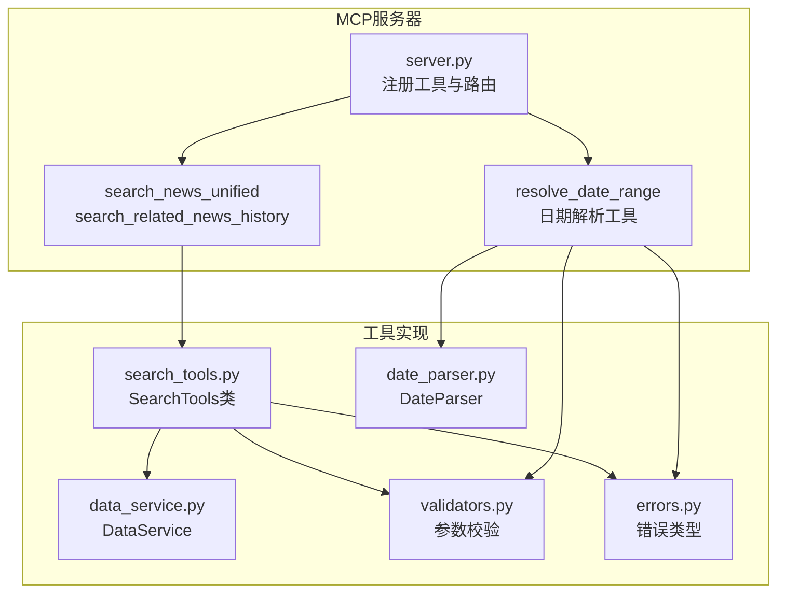
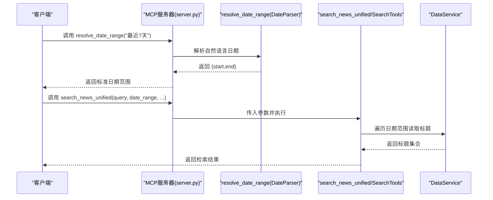
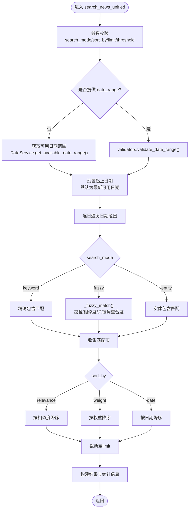
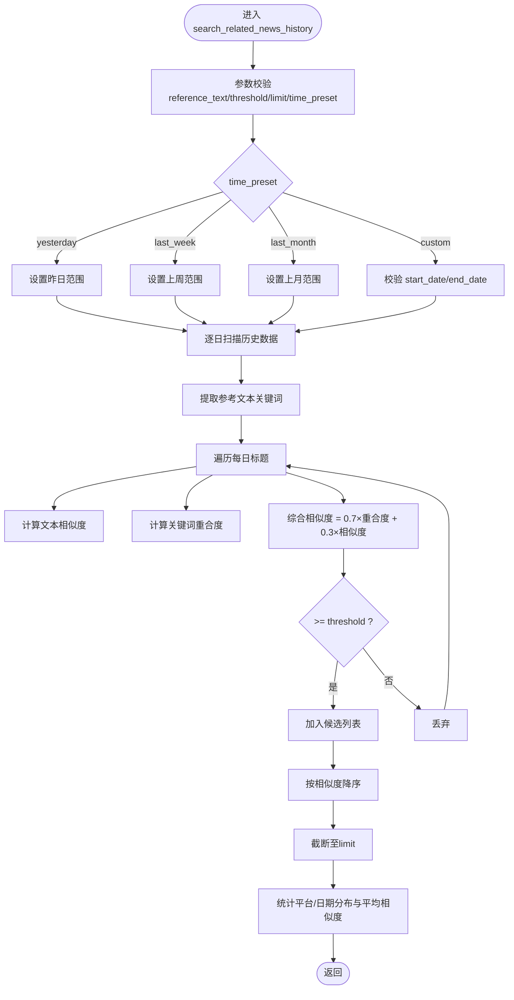
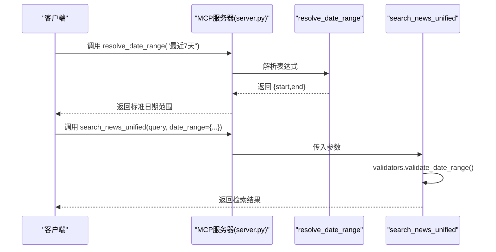
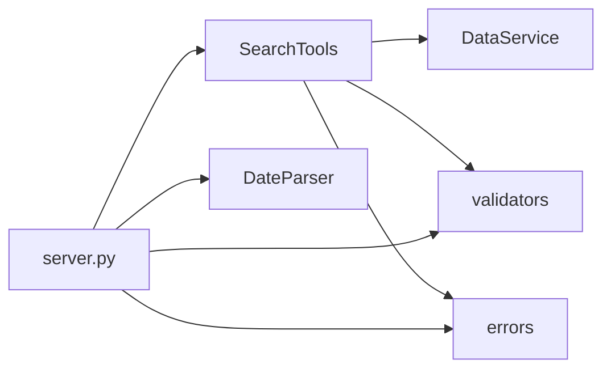

# 智能检索工具

<cite>
**本文引用的文件**
- [mcp_server/tools/search_tools.py](file://mcp_server/tools/search_tools.py)
- [mcp_server/utils/date_parser.py](file://mcp_server/utils/date_parser.py)
- [mcp_server/server.py](file://mcp_server/server.py)
- [docs/MCP-API-Reference.md](file://docs/MCP-API-Reference.md)
- [mcp_server/services/data_service.py](file://mcp_server/services/data_service.py)
- [mcp_server/utils/validators.py](file://mcp_server/utils/validators.py)
- [mcp_server/utils/errors.py](file://mcp_server/utils/errors.py)
</cite>

## 目录
1. [简介](#简介)
2. [项目结构](#项目结构)
3. [核心组件](#核心组件)
4. [架构总览](#架构总览)
5. [详细组件分析](#详细组件分析)
6. [依赖关系分析](#依赖关系分析)
7. [性能考量](#性能考量)
8. [故障排查指南](#故障排查指南)
9. [结论](#结论)
10. [附录](#附录)

## 简介
本文件面向MCP服务器的智能检索能力，系统化梳理search_news_unified与search_related_news_history两个工具的实现原理、搜索模式差异、相关性计算算法、date_range参数处理逻辑以及与resolve_date_range工具的协同流程。文档同时提供不同搜索模式的应用场景示例、相似度阈值对结果的影响说明，并给出错误处理与性能调优建议，帮助开发者与使用者高效、准确地使用智能检索功能。

## 项目结构
- 智能检索工具位于mcp_server/tools/search_tools.py，提供统一搜索与历史相关新闻检索两大能力。
- 日期解析与规范化由mcp_server/utils/date_parser.py负责，MCP服务器端提供resolve_date_range工具，统一将自然语言日期表达式解析为标准日期范围。
- 服务器入口mcp_server/server.py注册并暴露search_news与search_related_news_history工具，同时提供resolve_date_range工具。
- 数据访问层mcp_server/services/data_service.py提供跨日期遍历、缓存与基础数据读取能力。
- 参数校验与错误类型由mcp_server/utils/validators.py与mcp_server/utils/errors.py提供。

图表来源
- [mcp_server/server.py](file://mcp_server/server.py#L40-L109)
- [mcp_server/tools/search_tools.py](file://mcp_server/tools/search_tools.py#L38-L702)
- [mcp_server/utils/date_parser.py](file://mcp_server/utils/date_parser.py#L330-L423)
- [mcp_server/services/data_service.py](file://mcp_server/services/data_service.py#L498-L537)
- [mcp_server/utils/validators.py](file://mcp_server/utils/validators.py#L145-L210)
- [mcp_server/utils/errors.py](file://mcp_server/utils/errors.py#L10-L94)

章节来源
- [mcp_server/server.py](file://mcp_server/server.py#L40-L109)
- [mcp_server/tools/search_tools.py](file://mcp_server/tools/search_tools.py#L38-L702)
- [mcp_server/utils/date_parser.py](file://mcp_server/utils/date_parser.py#L330-L423)
- [mcp_server/services/data_service.py](file://mcp_server/services/data_service.py#L498-L537)
- [mcp_server/utils/validators.py](file://mcp_server/utils/validators.py#L145-L210)
- [mcp_server/utils/errors.py](file://mcp_server/utils/errors.py#L10-L94)

## 核心组件
- SearchTools：提供search_news_unified与search_related_news_history两大检索工具，内置关键词、模糊、实体三种搜索模式；支持按相关度、权重、日期排序；支持相似度阈值控制；支持按平台过滤与URL字段条件性返回。
- DateParser：提供resolve_date_range_expression方法，将自然语言日期表达式解析为标准日期范围，保证AI模型与服务器端日期一致性。
- server.py：注册resolve_date_range与search相关工具，提供统一的MCP工具接口。
- DataService：提供跨日期遍历、缓存与基础数据读取能力，支撑SearchTools的日期范围扫描与数据读取。
- validators与errors：提供参数校验与统一错误类型，保障工具健壮性。

章节来源
- [mcp_server/tools/search_tools.py](file://mcp_server/tools/search_tools.py#L38-L702)
- [mcp_server/utils/date_parser.py](file://mcp_server/utils/date_parser.py#L330-L423)
- [mcp_server/server.py](file://mcp_server/server.py#L40-L109)
- [mcp_server/services/data_service.py](file://mcp_server/services/data_service.py#L498-L537)
- [mcp_server/utils/validators.py](file://mcp_server/utils/validators.py#L145-L210)
- [mcp_server/utils/errors.py](file://mcp_server/utils/errors.py#L10-L94)

## 架构总览
- 工具调用链路：客户端通过MCP调用resolve_date_range获取标准日期范围，随后调用search_news或search_related_news_history进行检索。
- 检索执行链路：SearchTools根据search_mode选择关键词、模糊或实体匹配；模糊模式采用整体相似度、关键词重合度与直接包含三重判定；历史相关性模式综合关键词重合与文本相似度。
- 日期范围处理：若用户使用自然语言日期，优先调用resolve_date_range；若直接传入date_range对象，则由validators.validate_date_range进行格式与边界校验。

图表来源
- [mcp_server/server.py](file://mcp_server/server.py#L40-L109)
- [mcp_server/utils/date_parser.py](file://mcp_server/utils/date_parser.py#L330-L423)
- [mcp_server/tools/search_tools.py](file://mcp_server/tools/search_tools.py#L38-L241)
- [mcp_server/services/data_service.py](file://mcp_server/services/data_service.py#L184-L284)

## 详细组件分析

### search_news_unified 统一新闻搜索
- 搜索模式
  - keyword：精确关键词包含匹配，相似度固定为1.0，适合确定性强的关键词检索。
  - fuzzy：模糊匹配，包含“直接包含”“整体相似度”“关键词重合度”三重判定，最终相似度阈值可调。
  - entity：实体名称搜索，精确包含实体名，适合人物、地点、机构等命名实体检索。
- 相关性计算与阈值
  - fuzzy模式下，相似度阈值用于过滤低相关结果；阈值越高，匹配越严格，返回结果越少。
  - 结果排序支持relevance、weight、date三种方式；weight排序依赖外部权重计算函数。
- date_range参数处理
  - 若传入date_range对象，经validators.validate_date_range校验后使用；否则使用DataService.get_available_date_range()获取可用日期范围，若无数据则返回“无可用数据”的错误提示。
- 平台过滤与URL返回
  - 支持platforms过滤；include_url为True时返回URL与移动端URL字段。
- 错误处理
  - 参数非法、数据不存在、内部异常均以统一错误格式返回。

图表来源
- [mcp_server/tools/search_tools.py](file://mcp_server/tools/search_tools.py#L38-L241)
- [mcp_server/utils/validators.py](file://mcp_server/utils/validators.py#L145-L210)
- [mcp_server/services/data_service.py](file://mcp_server/services/data_service.py#L498-L537)

章节来源
- [mcp_server/tools/search_tools.py](file://mcp_server/tools/search_tools.py#L38-L241)
- [mcp_server/utils/validators.py](file://mcp_server/utils/validators.py#L145-L210)
- [mcp_server/services/data_service.py](file://mcp_server/services/data_service.py#L498-L537)

### search_related_news_history 历史相关新闻检索
- 相关性计算
  - 对每条候选标题计算两部分相似度：
    - 标题整体相似度（文本相似度）
    - 关键词重合度（Jaccard相似度）
  - 综合相似度 = 关键词重合度×0.7 + 文本相似度×0.3
  - threshold用于过滤低相关结果，阈值越高匹配越严格。
- 时间范围预设
  - 支持yesterday、last_week、last_month、custom四种预设；custom需提供start_date与end_date。
- 输出统计
  - 返回平台分布、日期分布与平均相似度等统计信息，便于理解结果构成。

图表来源
- [mcp_server/tools/search_tools.py](file://mcp_server/tools/search_tools.py#L494-L702)

章节来源
- [mcp_server/tools/search_tools.py](file://mcp_server/tools/search_tools.py#L494-L702)

### date_range参数与resolve_date_range协同
- resolve_date_range作用
  - 将自然语言日期表达式（如“本周”“最近7天”）解析为标准日期范围{"start":"YYYY-MM-DD","end":"YYYY-MM-DD"}，确保AI模型与服务器端日期一致。
- 协同流程
  - 客户端先调用resolve_date_range获取标准日期范围；
  - 再调用search_news或search_related_news_history，将返回的date_range对象作为参数传入；
  - 若直接传入date_range对象，服务器侧通过validators.validate_date_range进行格式与边界校验。
- 未提供date_range时的行为
  - search_news_unified会回退到可用日期范围的最新日期；若无可用数据则返回“无可用数据”的错误提示。

图表来源
- [mcp_server/server.py](file://mcp_server/server.py#L40-L109)
- [mcp_server/utils/date_parser.py](file://mcp_server/utils/date_parser.py#L330-L423)
- [mcp_server/tools/search_tools.py](file://mcp_server/tools/search_tools.py#L100-L122)
- [mcp_server/utils/validators.py](file://mcp_server/utils/validators.py#L145-L210)

章节来源
- [mcp_server/server.py](file://mcp_server/server.py#L40-L109)
- [mcp_server/utils/date_parser.py](file://mcp_server/utils/date_parser.py#L330-L423)
- [mcp_server/tools/search_tools.py](file://mcp_server/tools/search_tools.py#L100-L122)
- [mcp_server/utils/validators.py](file://mcp_server/utils/validators.py#L145-L210)

### 搜索模式应用场景与阈值影响
- keyword模式
  - 适用于精确关键词检索，如“人工智能”“特斯拉”；结果高度相关，适合精准定位。
- fuzzy模式
  - 适用于内容片段或近似表达，如“AI技术突破”“iPhone 16发布”；相似度阈值越低，召回越多但噪音越大；阈值越高，召回越少但更精准。
- entity模式
  - 适用于人物、地点、机构等命名实体检索，如“马斯克”“北京”“阿里巴巴”；适合事件主体识别与关联分析。
- 相似度阈值对结果的影响
  - 阈值提高：匹配更严格，返回结果减少，相关性更高。
  - 阈值降低：召回更多，可能包含噪声，适合探索性检索。

章节来源
- [mcp_server/tools/search_tools.py](file://mcp_server/tools/search_tools.py#L38-L241)
- [mcp_server/tools/search_tools.py](file://mcp_server/tools/search_tools.py#L494-L702)

## 依赖关系分析
- SearchTools依赖
  - DataService：跨日期读取标题集合、平台映射与时间戳。
  - validators：参数校验（关键词、limit、date_range、模式等）。
  - errors：统一错误类型，便于客户端处理。
- resolve_date_range依赖
  - DateParser.resolve_date_range_expression：将自然语言表达式标准化为日期范围。
  - validators与errors：参数校验与错误处理。
- server.py注册
  - 将resolve_date_range与search相关工具注册为MCP工具，提供统一调用入口。

图表来源
- [mcp_server/tools/search_tools.py](file://mcp_server/tools/search_tools.py#L38-L702)
- [mcp_server/server.py](file://mcp_server/server.py#L40-L109)
- [mcp_server/utils/date_parser.py](file://mcp_server/utils/date_parser.py#L330-L423)
- [mcp_server/utils/validators.py](file://mcp_server/utils/validators.py#L145-L210)
- [mcp_server/utils/errors.py](file://mcp_server/utils/errors.py#L10-L94)

章节来源
- [mcp_server/tools/search_tools.py](file://mcp_server/tools/search_tools.py#L38-L702)
- [mcp_server/server.py](file://mcp_server/server.py#L40-L109)
- [mcp_server/utils/date_parser.py](file://mcp_server/utils/date_parser.py#L330-L423)
- [mcp_server/utils/validators.py](file://mcp_server/utils/validators.py#L145-L210)
- [mcp_server/utils/errors.py](file://mcp_server/utils/errors.py#L10-L94)

## 性能考量
- 合理使用limit：避免一次性获取过多数据，建议按需分页或缩小日期范围。
- 启用缓存：DataService对常用查询结果进行缓存，减少重复扫描与解析开销。
- 选择合适模式：keyword模式匹配最快；fuzzy模式计算成本较高，建议适当提高阈值减少候选集。
- 分批处理大数据：使用date_range分批查询历史数据，避免全库扫描。
- 平台过滤：通过platforms参数缩小扫描范围，提升效率。
- 相似度阈值权衡：在召回与精度间折中，避免过低阈值导致大量低质量结果。

[本节为通用指导，不直接分析具体文件]

## 故障排查指南
- 无可用数据
  - 现象：search_news_unified返回“无可用数据”错误。
  - 原因：output目录无数据或date_range超出可用范围。
  - 处理：确认爬虫已运行并生成数据；使用resolve_date_range获取可用范围；或缩小date_range。
- 日期范围错误
  - 现象：报错“开始日期不能晚于结束日期”“不允许查询未来日期”。
  - 原因：date_range格式不合法或包含未来日期。
  - 处理：使用validators.validate_date_range进行校验；或改用resolve_date_range生成标准范围。
- 参数无效
  - 现象：报错“无效的搜索模式/排序方式/模式参数无效”。
  - 处理：核对search_mode、sort_by、mode等参数取值是否在支持列表内。
- 内部错误
  - 现象：返回“内部错误”。
  - 处理：检查服务器日志，确认依赖组件（如文件系统、网络）状态正常。

章节来源
- [mcp_server/tools/search_tools.py](file://mcp_server/tools/search_tools.py#L100-L122)
- [mcp_server/utils/validators.py](file://mcp_server/utils/validators.py#L145-L210)
- [mcp_server/utils/errors.py](file://mcp_server/utils/errors.py#L10-L94)

## 结论
search_news_unified与search_related_news_history共同构成了MCP服务器的智能检索能力。前者提供统一的多模式检索与灵活的排序选项，后者提供基于历史数据的相关性发现。通过resolve_date_range与validators.validate_date_range的配合，系统实现了自然语言日期与标准日期范围的无缝衔接。合理设置相似度阈值与limit、利用缓存与平台过滤，可在保证检索质量的同时显著提升性能与用户体验。

[本节为总结性内容，不直接分析具体文件]

## 附录
- API参考要点
  - search_news_unified：支持keyword/fuzzy/entity模式，支持按relevance/weight/date排序，支持相似度阈值与平台过滤。
  - search_related_news_history：支持yesterday/last_week/last_month/custom预设，综合相似度=关键词重合度×0.7+文本相似度×0.3。
  - resolve_date_range：将自然语言日期表达式解析为标准日期范围，推荐优先调用。

章节来源
- [docs/MCP-API-Reference.md](file://docs/MCP-API-Reference.md#L97-L148)
- [mcp_server/server.py](file://mcp_server/server.py#L40-L109)
- [mcp_server/tools/search_tools.py](file://mcp_server/tools/search_tools.py#L38-L241)
- [mcp_server/tools/search_tools.py](file://mcp_server/tools/search_tools.py#L494-L702)