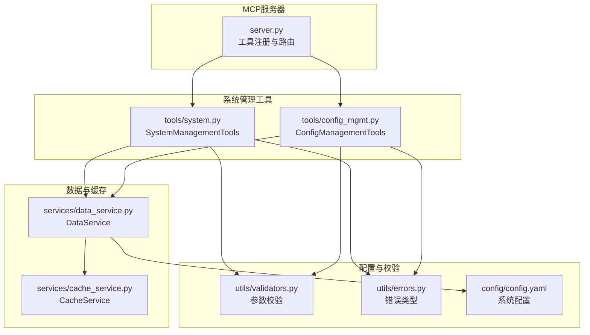
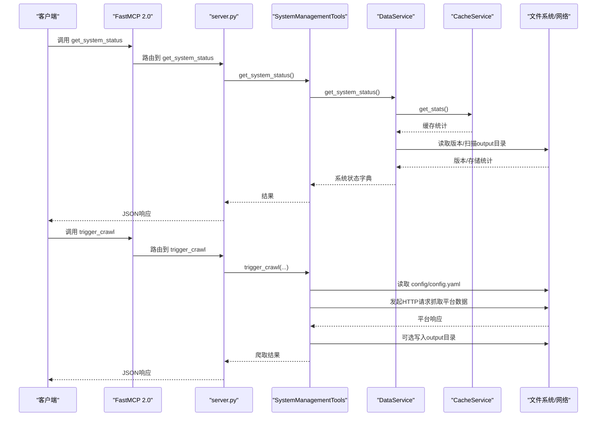
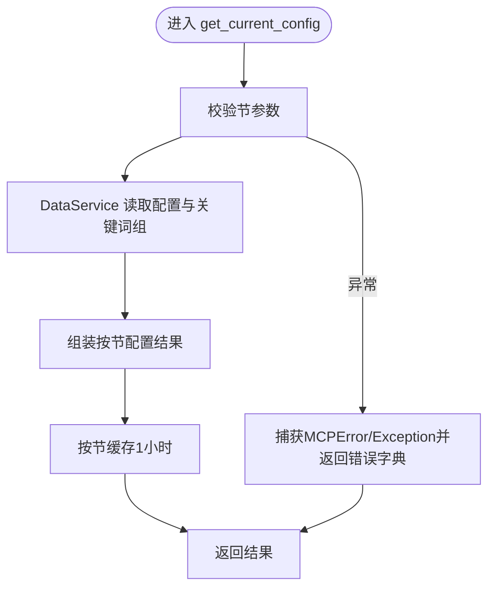
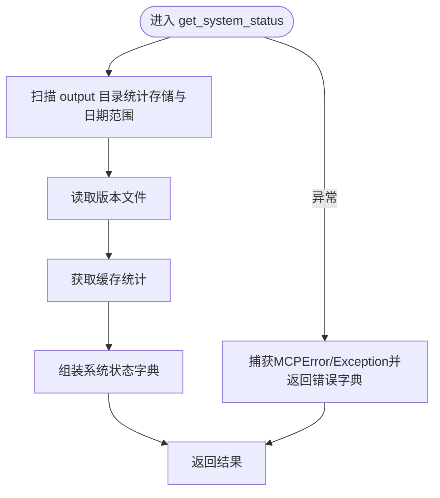
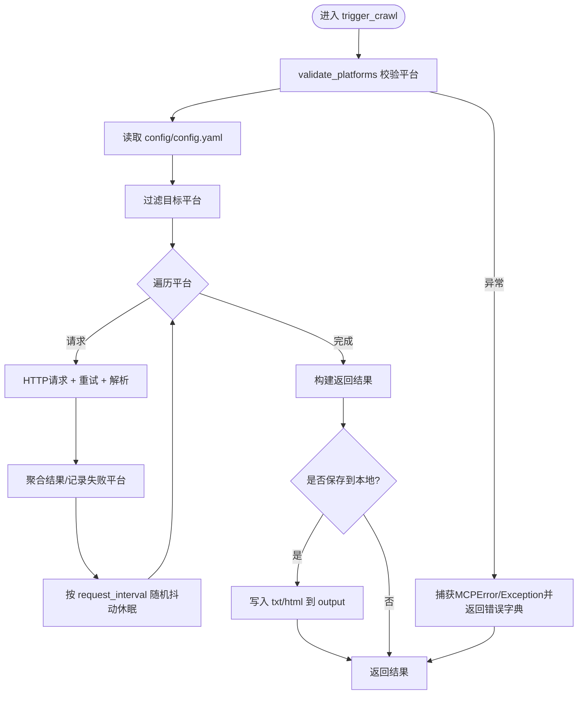
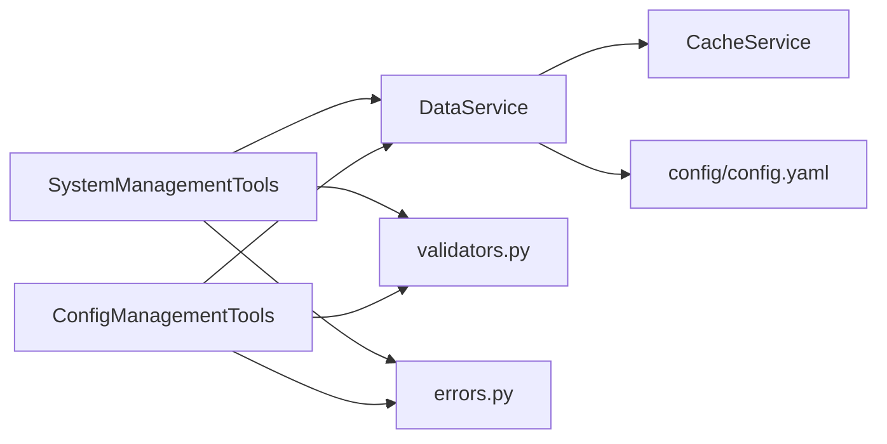

# 系统管理工具

<cite>
**本文引用的文件**
- [mcp_server/server.py](file://mcp_server/server.py)
- [mcp_server/tools/system.py](file://mcp_server/tools/system.py)
- [mcp_server/tools/config_mgmt.py](file://mcp_server/tools/config_mgmt.py)
- [mcp_server/services/data_service.py](file://mcp_server/services/data_service.py)
- [mcp_server/services/cache_service.py](file://mcp_server/services/cache_service.py)
- [mcp_server/utils/validators.py](file://mcp_server/utils/validators.py)
- [mcp_server/utils/errors.py](file://mcp_server/utils/errors.py)
- [config/config.yaml](file://config/config.yaml)
</cite>

## 目录
1. [简介](#简介)
2. [项目结构](#项目结构)
3. [核心组件](#核心组件)
4. [架构总览](#架构总览)
5. [详细组件分析](#详细组件分析)
6. [依赖关系分析](#依赖关系分析)
7. [性能考量](#性能考量)
8. [故障排查指南](#故障排查指南)
9. [结论](#结论)
10. [附录](#附录)

## 简介
本文件聚焦于MCP服务器的系统级管理接口，围绕以下三个工具展开：
- get_current_config：动态读取并返回当前系统配置（按节拆分），便于运维人员快速核对爬虫、推送、关键词与权重等配置。
- get_system_status：采集系统运行时指标（版本、数据存储、缓存统计、健康状态等），用于监控与健康检查。
- trigger_crawl：手动触发一次性临时爬取任务，并可选持久化到本地output目录，支持重试与失败平台回显。

文档将深入解释这些工具的实现细节、数据流、错误处理与运维价值，并给出在监控、故障排查与自动化运维中的实际应用案例。

## 项目结构
系统管理工具位于mcp_server模块中，通过FastMCP 2.0框架暴露为MCP工具。其核心文件组织如下：
- 服务器入口与工具注册：mcp_server/server.py
- 系统管理工具实现：mcp_server/tools/system.py
- 配置管理工具实现：mcp_server/tools/config_mgmt.py
- 数据服务层：mcp_server/services/data_service.py
- 缓存服务：mcp_server/services/cache_service.py
- 参数校验与错误类型：mcp_server/utils/validators.py、mcp_server/utils/errors.py
- 配置文件：config/config.yaml

图表来源
- [mcp_server/server.py](file://mcp_server/server.py#L585-L658)
- [mcp_server/tools/system.py](file://mcp_server/tools/system.py#L1-L120)
- [mcp_server/tools/config_mgmt.py](file://mcp_server/tools/config_mgmt.py#L1-L67)
- [mcp_server/services/data_service.py](file://mcp_server/services/data_service.py#L1-L120)
- [mcp_server/services/cache_service.py](file://mcp_server/services/cache_service.py#L1-L137)
- [mcp_server/utils/validators.py](file://mcp_server/utils/validators.py#L1-L120)
- [mcp_server/utils/errors.py](file://mcp_server/utils/errors.py#L1-L94)
- [config/config.yaml](file://config/config.yaml#L1-L140)

章节来源
- [mcp_server/server.py](file://mcp_server/server.py#L585-L658)
- [mcp_server/tools/system.py](file://mcp_server/tools/system.py#L1-L120)
- [mcp_server/tools/config_mgmt.py](file://mcp_server/tools/config_mgmt.py#L1-L67)
- [mcp_server/services/data_service.py](file://mcp_server/services/data_service.py#L1-L120)
- [mcp_server/services/cache_service.py](file://mcp_server/services/cache_service.py#L1-L137)
- [mcp_server/utils/validators.py](file://mcp_server/utils/validators.py#L1-L120)
- [mcp_server/utils/errors.py](file://mcp_server/utils/errors.py#L1-L94)
- [config/config.yaml](file://config/config.yaml#L1-L140)

## 核心组件
- SystemManagementTools：提供get_system_status与trigger_crawl两大系统管理能力。
- ConfigManagementTools：提供get_current_config能力，按节返回配置。
- DataService：封装数据访问与缓存，负责系统状态统计与配置读取。
- CacheService：提供TTL缓存，支撑系统状态与配置的快速读取。
- Validators与Errors：统一参数校验与错误类型，保障工具健壮性。
- config.yaml：系统配置源，包含爬虫、推送、权重与平台列表等。

章节来源
- [mcp_server/tools/system.py](file://mcp_server/tools/system.py#L1-L120)
- [mcp_server/tools/config_mgmt.py](file://mcp_server/tools/config_mgmt.py#L1-L67)
- [mcp_server/services/data_service.py](file://mcp_server/services/data_service.py#L538-L605)
- [mcp_server/services/cache_service.py](file://mcp_server/services/cache_service.py#L1-L137)
- [mcp_server/utils/validators.py](file://mcp_server/utils/validators.py#L1-L120)
- [mcp_server/utils/errors.py](file://mcp_server/utils/errors.py#L1-L94)
- [config/config.yaml](file://config/config.yaml#L1-L140)

## 架构总览
MCP服务器通过装饰器注册工具，工具内部委托DataService与缓存服务完成数据读取与统计；系统管理工具在触发爬取时，直接读取config.yaml并发起外部HTTP请求，再将结果持久化到本地output目录。

图表来源
- [mcp_server/server.py](file://mcp_server/server.py#L610-L658)
- [mcp_server/tools/system.py](file://mcp_server/tools/system.py#L33-L120)
- [mcp_server/services/data_service.py](file://mcp_server/services/data_service.py#L538-L605)
- [mcp_server/services/cache_service.py](file://mcp_server/services/cache_service.py#L101-L120)
- [config/config.yaml](file://config/config.yaml#L1-L140)

## 详细组件分析

### get_current_config（配置管理）
- 作用：按节返回当前系统配置，支持all、crawler、push、keywords、weights五种节。
- 实现要点：
  - 参数校验：通过validate_config_section限定节范围。
  - 配置读取：DataService.parse_yaml_config与parse_frequency_words解析配置与关键词组。
  - 缓存策略：按节缓存1小时，减少磁盘IO与解析开销。
  - 返回结构：包含config节内容、节名与success标志；异常时返回错误字典。
- 运维价值：
  - 快速核对爬虫开关、请求间隔、代理、通知渠道、推送窗口等关键配置。
  - 便于在CI/CD或自动化巡检中拉取配置并做一致性校验。

图表来源
- [mcp_server/tools/config_mgmt.py](file://mcp_server/tools/config_mgmt.py#L26-L67)
- [mcp_server/services/data_service.py](file://mcp_server/services/data_service.py#L411-L496)
- [mcp_server/utils/validators.py](file://mcp_server/utils/validators.py#L292-L307)

章节来源
- [mcp_server/tools/config_mgmt.py](file://mcp_server/tools/config_mgmt.py#L1-L67)
- [mcp_server/services/data_service.py](file://mcp_server/services/data_service.py#L411-L496)
- [mcp_server/utils/validators.py](file://mcp_server/utils/validators.py#L292-L307)

### get_system_status（系统状态）
- 作用：返回系统版本、数据存储统计、缓存统计与健康状态，用于监控与健康检查。
- 实现要点：
  - 数据统计：遍历output目录，统计总存储、最早/最新记录日期。
  - 版本信息：读取项目根目录version文件。
  - 缓存统计：调用CacheService.get_stats获取条目数与最老/ newest条目年龄。
  - 返回结构：包含system、data、cache、health与success标志；异常时返回错误字典。
- 运维价值：
  - 监控数据增长趋势与存储占用，辅助容量规划。
  - 通过health字段与缓存统计判断系统健康状况。

图表来源
- [mcp_server/tools/system.py](file://mcp_server/tools/system.py#L33-L66)
- [mcp_server/services/data_service.py](file://mcp_server/services/data_service.py#L538-L605)
- [mcp_server/services/cache_service.py](file://mcp_server/services/cache_service.py#L101-L120)

章节来源
- [mcp_server/tools/system.py](file://mcp_server/tools/system.py#L33-L66)
- [mcp_server/services/data_service.py](file://mcp_server/services/data_service.py#L538-L605)
- [mcp_server/services/cache_service.py](file://mcp_server/services/cache_service.py#L101-L120)

### trigger_crawl（触发爬取）
- 作用：手动触发一次性临时爬取任务，可选保存到本地output目录。
- 实现要点：
  - 参数校验：validate_platforms根据config.yaml动态校验平台ID。
  - 配置读取：直接读取config/config.yaml，获取平台列表与请求间隔。
  - 平台过滤：支持指定平台或默认使用配置中的全部平台。
  - 爬取流程：逐平台发起HTTP请求，内置重试与随机退避，解析响应并聚合结果。
  - 请求间隔：按配置的request_interval动态调整，避免过于频繁。
  - 结果持久化：可选保存为txt与html，按日期/时间命名，失败平台回显。
  - 返回结构：包含任务ID、状态、时间、平台列表、失败平台、数据总量、可选保存路径与note。
- 运维价值：
  - 在配置变更后快速验证平台连通性与数据可用性。
  - 临时抓取用于离线分析或导出，无需长期运行。
  - 通过failed_platforms定位网络/平台异常，辅助故障排查。

图表来源
- [mcp_server/tools/system.py](file://mcp_server/tools/system.py#L68-L375)
- [mcp_server/utils/validators.py](file://mcp_server/utils/validators.py#L43-L88)
- [config/config.yaml](file://config/config.yaml#L1-L140)

章节来源
- [mcp_server/tools/system.py](file://mcp_server/tools/system.py#L68-L375)
- [mcp_server/utils/validators.py](file://mcp_server/utils/validators.py#L43-L88)
- [config/config.yaml](file://config/config.yaml#L1-L140)

## 依赖关系分析
- 工具到服务层：
  - SystemManagementTools依赖DataService进行系统状态与配置读取。
  - ConfigManagementTools依赖DataService解析配置与关键词组。
- 服务层到缓存：
  - DataService通过get_cache获取全局缓存实例，对常用查询进行缓存。
- 服务层到配置：
  - DataService.parse_yaml_config与parse_frequency_words读取config/config.yaml。
- 工具到校验与错误：
  - SystemManagementTools与ConfigManagementTools均使用validators与errors保障参数合法性与错误统一化。

图表来源
- [mcp_server/tools/system.py](file://mcp_server/tools/system.py#L1-L120)
- [mcp_server/tools/config_mgmt.py](file://mcp_server/tools/config_mgmt.py#L1-L67)
- [mcp_server/services/data_service.py](file://mcp_server/services/data_service.py#L1-L120)
- [mcp_server/services/cache_service.py](file://mcp_server/services/cache_service.py#L126-L137)
- [mcp_server/utils/validators.py](file://mcp_server/utils/validators.py#L1-L120)
- [mcp_server/utils/errors.py](file://mcp_server/utils/errors.py#L1-L94)
- [config/config.yaml](file://config/config.yaml#L1-L140)

章节来源
- [mcp_server/tools/system.py](file://mcp_server/tools/system.py#L1-L120)
- [mcp_server/tools/config_mgmt.py](file://mcp_server/tools/config_mgmt.py#L1-L67)
- [mcp_server/services/data_service.py](file://mcp_server/services/data_service.py#L1-L120)
- [mcp_server/services/cache_service.py](file://mcp_server/services/cache_service.py#L126-L137)
- [mcp_server/utils/validators.py](file://mcp_server/utils/validators.py#L1-L120)
- [mcp_server/utils/errors.py](file://mcp_server/utils/errors.py#L1-L94)
- [config/config.yaml](file://config/config.yaml#L1-L140)

## 性能考量
- 缓存策略：
  - DataService对常用查询（如最新新闻、按日期查询、趋势话题、配置）进行缓存，显著降低I/O与解析成本。
  - CacheService提供TTL与清理机制，避免内存膨胀。
- 爬取并发与抖动：
  - trigger_crawl按平台循环请求，内置重试与随机抖动，降低对上游平台的压力与被限流风险。
- 输出持久化：
  - 仅在save_to_local为真时写入文件，避免不必要的磁盘IO。

章节来源
- [mcp_server/services/data_service.py](file://mcp_server/services/data_service.py#L50-L102)
- [mcp_server/services/data_service.py](file://mcp_server/services/data_service.py#L134-L182)
- [mcp_server/services/data_service.py](file://mcp_server/services/data_service.py#L285-L401)
- [mcp_server/services/data_service.py](file://mcp_server/services/data_service.py#L411-L496)
- [mcp_server/services/cache_service.py](file://mcp_server/services/cache_service.py#L1-L137)
- [mcp_server/tools/system.py](file://mcp_server/tools/system.py#L132-L223)

## 故障排查指南
- get_current_config返回错误：
  - 检查config/config.yaml是否存在且格式正确。
  - 使用validators.validate_config_section确认节名合法。
- get_system_status返回错误：
  - 确认项目根目录存在version文件。
  - 检查output目录权限与可读性。
- trigger_crawl返回错误或失败平台：
  - 校验平台ID是否在config/config.yaml的platforms中。
  - 检查网络连通性与上游平台状态。
  - 查看failed_platforms定位问题平台。
- 缓存异常：
  - 使用CacheService.get_stats检查缓存命中与老化情况。
  - 必要时调用cleanup_expired清理过期项。

章节来源
- [mcp_server/utils/errors.py](file://mcp_server/utils/errors.py#L1-L94)
- [mcp_server/utils/validators.py](file://mcp_server/utils/validators.py#L43-L88)
- [mcp_server/services/cache_service.py](file://mcp_server/services/cache_service.py#L101-L120)
- [mcp_server/tools/system.py](file://mcp_server/tools/system.py#L101-L143)

## 结论
- get_current_config、get_system_status与trigger_crawl构成了MCP服务器的系统级管理闭环：配置可视化、状态可观测、任务可触发。
- 通过缓存与参数校验，工具具备良好的性能与健壮性。
- 在监控、故障排查与自动化运维中，上述工具可作为标准化手段，提升运维效率与稳定性。

## 附录
- 实际应用案例（概念性说明，不绑定具体代码）：
  - 监控：定期调用get_system_status，结合缓存统计与存储占用，设定阈值告警。
  - 故障排查：trigger_crawl用于快速验证平台连通性，结合failed_platforms定位问题。
  - 自动化运维：在CI/CD中调用get_current_config核对配置一致性，触发trigger_crawl进行离线导出。