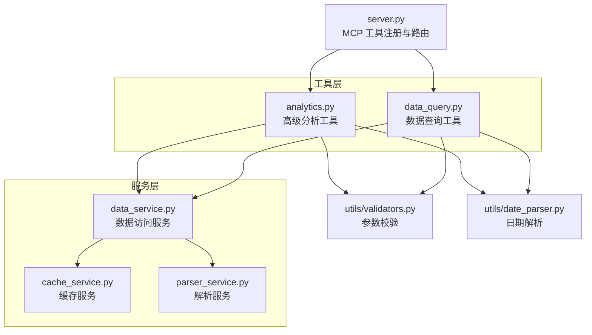
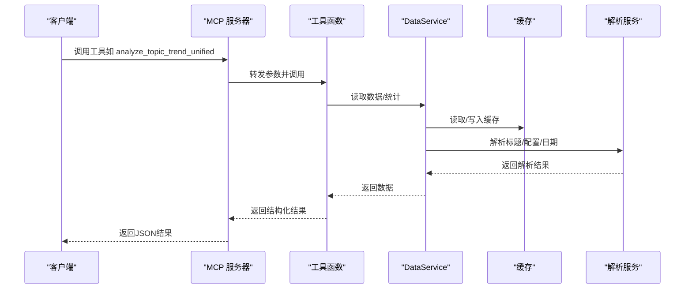
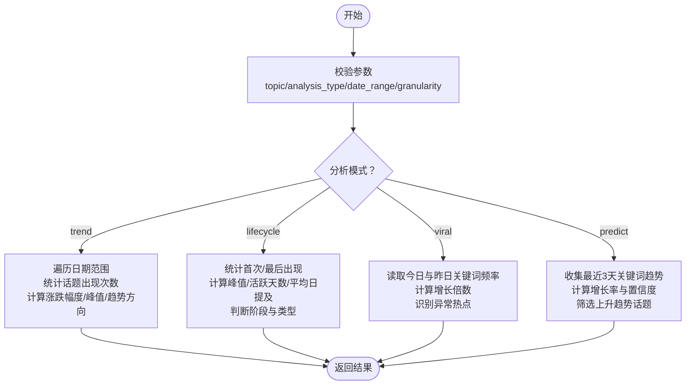
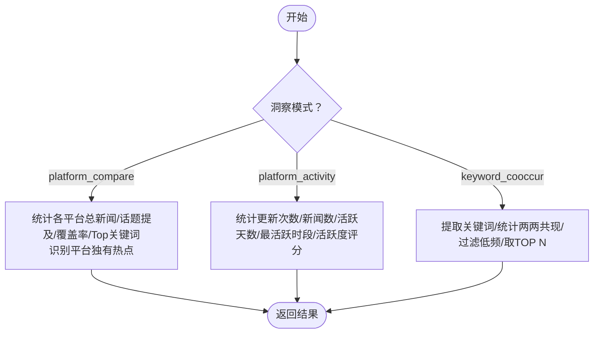
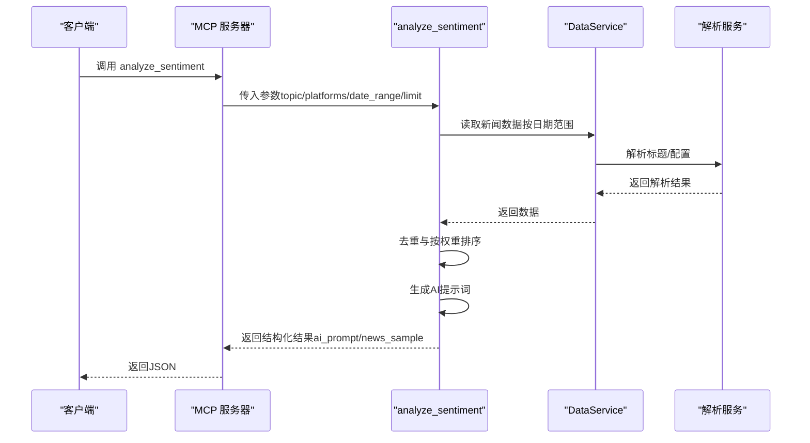
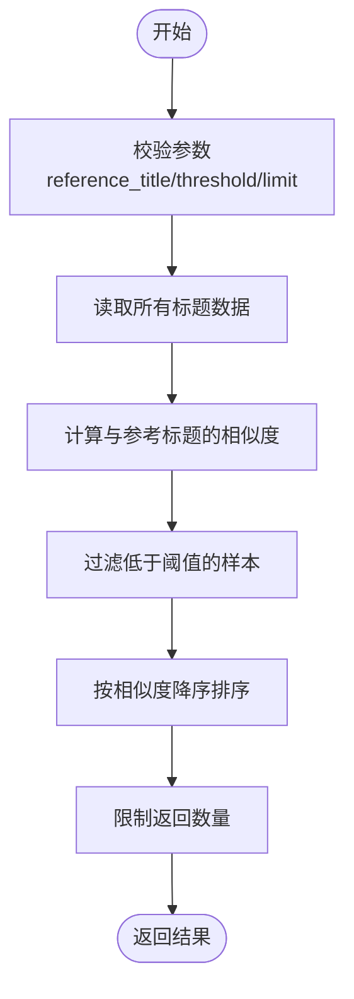
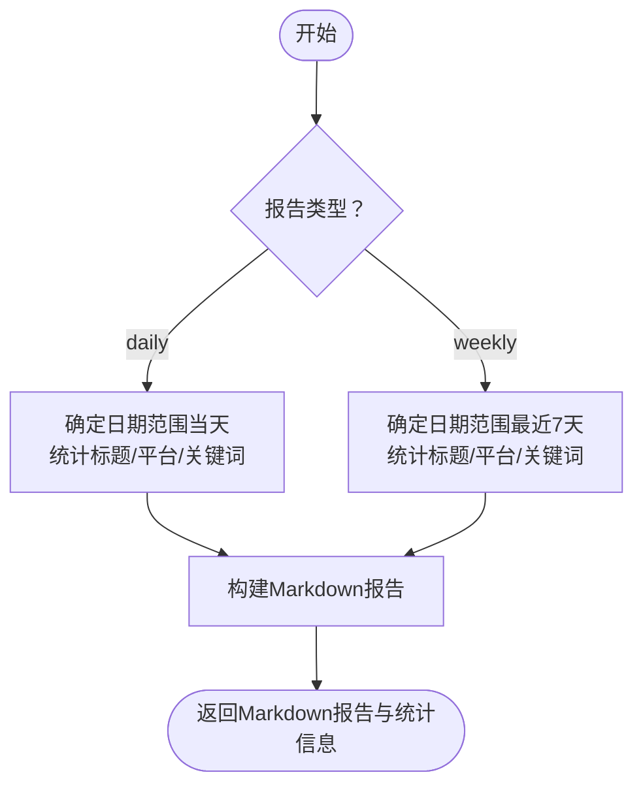
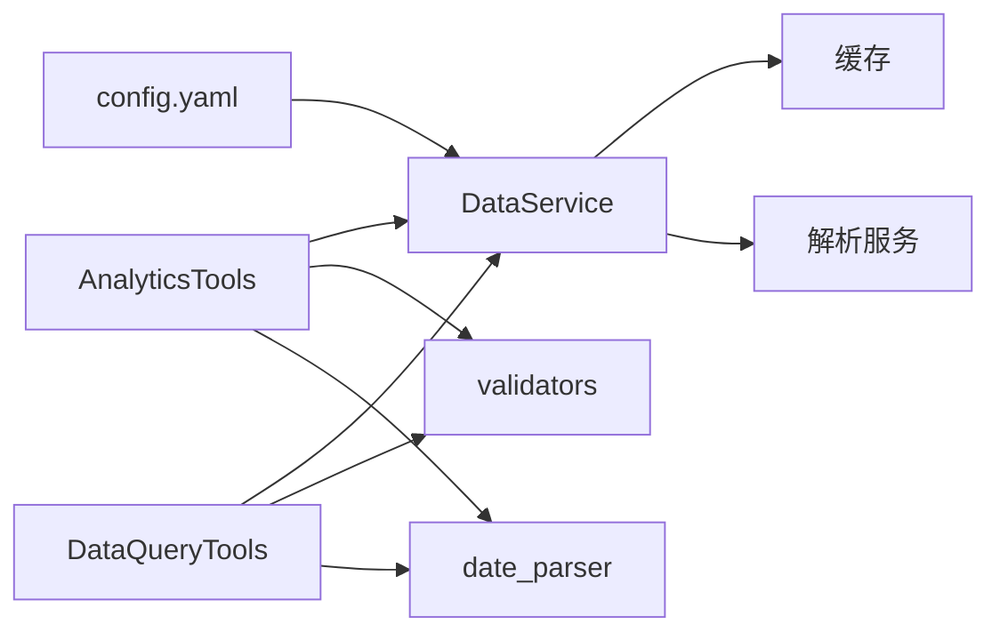

# 高级分析工具

<cite>
**本文引用的文件**
- [mcp_server/server.py](file://mcp_server/server.py)
- [mcp_server/tools/analytics.py](file://mcp_server/tools/analytics.py)
- [mcp_server/tools/data_query.py](file://mcp_server/tools/data_query.py)
- [mcp_server/services/data_service.py](file://mcp_server/services/data_service.py)
- [mcp_server/utils/validators.py](file://mcp_server/utils/validators.py)
- [mcp_server/utils/date_parser.py](file://mcp_server/utils/date_parser.py)
- [docs/MCP-API-Reference.md](file://docs/MCP-API-Reference.md)
- [config/config.yaml](file://config/config.yaml)
</cite>

## 目录
1. [简介](#简介)
2. [项目结构](#项目结构)
3. [核心组件](#核心组件)
4. [架构总览](#架构总览)
5. [详细组件分析](#详细组件分析)
6. [依赖关系分析](#依赖关系分析)
7. [性能考量](#性能考量)
8. [故障排查指南](#故障排查指南)
9. [结论](#结论)
10. [附录](#附录)

## 简介
本文件面向使用 TrendRadar MCP 服务器的开发者与产品团队，聚焦高级数据分析能力，系统梳理并解读以下工具的算法逻辑、业务价值与最佳实践：
- analyze_topic_trend_unified：统一话题趋势分析（趋势/生命周期/异常检测/预测）
- analyze_data_insights_unified：统一数据洞察分析（平台对比/活跃度/关键词共现）
- analyze_sentiment：情感倾向分析（生成AI提示词）
- find_similar_news：相似新闻查找
- generate_summary_report：每日/每周摘要报告

文档同时给出不同分析类型的适用场景、参数配置要点、调用流程示例与多工具协同的最佳实践，帮助读者在真实业务中高效落地。

## 项目结构
TrendRadar MCP 服务器采用模块化设计，核心围绕“工具层”和“服务层”展开：
- 工具层（tools）：封装具体分析与检索能力，如 analytics、data_query、search_tools、config_mgmt、system 等
- 服务层（services）：封装数据访问与缓存，如 data_service、cache_service、parser_service
- 工具注册与对外暴露：server.py 将工具函数注册为 MCP 工具，统一对外提供 API

图表来源
- [mcp_server/server.py](file://mcp_server/server.py#L1-L120)
- [mcp_server/tools/analytics.py](file://mcp_server/tools/analytics.py#L1-L120)
- [mcp_server/tools/data_query.py](file://mcp_server/tools/data_query.py#L1-L60)
- [mcp_server/services/data_service.py](file://mcp_server/services/data_service.py#L1-L60)

章节来源
- [mcp_server/server.py](file://mcp_server/server.py#L1-L120)
- [mcp_server/tools/analytics.py](file://mcp_server/tools/analytics.py#L1-L120)
- [mcp_server/tools/data_query.py](file://mcp_server/tools/data_query.py#L1-L60)
- [mcp_server/services/data_service.py](file://mcp_server/services/data_service.py#L1-L60)

## 核心组件
- AnalyticsTools：高级分析工具集合，负责趋势分析、平台对比、关键词共现、情感分析、相似新闻、摘要报告、异常检测、预测等
- DataQueryTools：基础数据查询工具集合，负责最新新闻、按日期查询、关键词搜索、趋势话题等
- DataService：统一数据访问层，封装缓存、解析与数据读取逻辑
- 参数校验与日期解析：validators、date_parser 提供统一的参数校验与日期解析能力

章节来源
- [mcp_server/tools/analytics.py](file://mcp_server/tools/analytics.py#L77-L120)
- [mcp_server/tools/data_query.py](file://mcp_server/tools/data_query.py#L22-L60)
- [mcp_server/services/data_service.py](file://mcp_server/services/data_service.py#L17-L40)
- [mcp_server/utils/validators.py](file://mcp_server/utils/validators.py#L1-L60)
- [mcp_server/utils/date_parser.py](file://mcp_server/utils/date_parser.py#L1-L60)

## 架构总览
MCP 工具通过 server.py 注册，对外提供统一 API；工具内部依赖 DataService 进行数据读取与缓存，参数校验与日期解析由 validators 与 date_parser 统一处理。

图表来源
- [mcp_server/server.py](file://mcp_server/server.py#L225-L332)
- [mcp_server/tools/analytics.py](file://mcp_server/tools/analytics.py#L156-L243)
- [mcp_server/services/data_service.py](file://mcp_server/services/data_service.py#L30-L120)

章节来源
- [mcp_server/server.py](file://mcp_server/server.py#L225-L332)
- [mcp_server/tools/analytics.py](file://mcp_server/tools/analytics.py#L156-L243)
- [mcp_server/services/data_service.py](file://mcp_server/services/data_service.py#L30-L120)

## 详细组件分析

### analyze_topic_trend_unified（统一话题趋势分析）
- 功能概述
  - 整合四种分析模式：trend（热度趋势）、lifecycle（生命周期）、viral（异常热度检测）、predict（话题预测）
  - 支持按日期范围、时间粒度、阈值、预测窗口等参数灵活配置
- 算法与流程
  - 参数校验：topic、analysis_type、date_range、granularity、阈值与置信度等
  - 按模式分派：
    - trend：遍历日期范围，统计话题出现次数，计算涨跌幅度、峰值时间、趋势方向
    - lifecycle：计算首次/最后出现、峰值、活跃天数、平均日提及、阶段与类型判断
    - viral：比较当前与前一日关键词频率，计算增长倍数，识别异常热点
    - predict：基于最近3天趋势，计算增长率与置信度，筛选上升趋势话题
- 适用场景
  - 趋势：追踪热点波动、评估传播强度
  - 生命周期：判断话题是昙花一现、持续热点还是周期性热点
  - 异常检测：及时发现爆火事件与潜在风险
  - 预测：提前布局内容与资源
- 参数配置要点
  - date_range：建议通过 resolve_date_range 工具解析自然语言日期，保证一致性
  - granularity：当前仅支持 day（底层数据按天聚合）
  - threshold/time_window：异常检测阈值与时间窗口
  - lookahead_hours/confidence_threshold：预测窗口与置信度阈值
- 调用流程示例
  - 先解析日期范围，再调用趋势分析
  - 结合生命周期与异常检测，形成“发现—确认—预测”的闭环

图表来源
- [mcp_server/tools/analytics.py](file://mcp_server/tools/analytics.py#L156-L243)
- [mcp_server/tools/analytics.py](file://mcp_server/tools/analytics.py#L1465-L1621)
- [mcp_server/tools/analytics.py](file://mcp_server/tools/analytics.py#L1623-L1757)
- [mcp_server/tools/analytics.py](file://mcp_server/tools/analytics.py#L1759-L1919)

章节来源
- [mcp_server/tools/analytics.py](file://mcp_server/tools/analytics.py#L156-L243)
- [mcp_server/tools/analytics.py](file://mcp_server/tools/analytics.py#L1465-L1621)
- [mcp_server/tools/analytics.py](file://mcp_server/tools/analytics.py#L1623-L1757)
- [mcp_server/tools/analytics.py](file://mcp_server/tools/analytics.py#L1759-L1919)

### analyze_data_insights_unified（统一数据洞察分析）
- 功能概述
  - 整合三种洞察模式：platform_compare（平台对比）、platform_activity（平台活跃度）、keyword_cooccur（关键词共现）
- 算法与流程
  - platform_compare：按日期范围统计各平台总新闻数、话题提及数、覆盖率、Top关键词，并识别平台独有热点
  - platform_activity：统计各平台更新次数、新闻数、活跃天数、日均新闻数、最活跃时段与活跃度评分
  - keyword_cooccur：提取关键词，统计两两共现频次，过滤低频，取TOP N并返回样本标题
- 适用场景
  - 平台对比：评估不同平台对同一话题的关注度差异
  - 平台活跃度：识别平台更新节奏与高峰时段
  - 关键词共现：发现话题背后的关联词与潜在主题网络
- 参数配置要点
  - min_frequency/top_n：共现分析的最小频次与返回数量
  - date_range：建议通过 resolve_date_range 解析
- 调用流程示例
  - 先对比平台，再分析活跃度，最后做关键词共现，形成“广度—深度—关联”的分析链路

图表来源
- [mcp_server/tools/analytics.py](file://mcp_server/tools/analytics.py#L398-L525)
- [mcp_server/tools/analytics.py](file://mcp_server/tools/analytics.py#L1338-L1463)
- [mcp_server/tools/analytics.py](file://mcp_server/tools/analytics.py#L526-L630)

章节来源
- [mcp_server/tools/analytics.py](file://mcp_server/tools/analytics.py#L398-L525)
- [mcp_server/tools/analytics.py](file://mcp_server/tools/analytics.py#L1338-L1463)
- [mcp_server/tools/analytics.py](file://mcp_server/tools/analytics.py#L526-L630)

### analyze_sentiment（情感倾向分析）
- 功能概述
  - 生成用于 AI 情感分析的结构化提示词，支持按权重排序与去重
- 算法与流程
  - 参数校验：topic、platforms、date_range、limit、sort_by_weight、include_url
  - 数据收集：按日期范围遍历，收集新闻标题、排名、频次、URL（可选）
  - 去重与排序：同一标题在不同平台只保留一次，并按权重排序
  - 提示词生成：按平台分组，构建结构化提示词，包含任务说明、分析要求、数据概览、平台新闻列表与输出格式说明
- 适用场景
  - 快速生成高质量情感分析提示词，提升AI分析效率与一致性
  - 支持按话题、平台、时间范围精细化分析
- 参数配置要点
  - limit：建议根据分析目标调整，注意去重后可能少于请求值
  - sort_by_weight：默认开启，有助于筛选更具代表性的样本
  - include_url：默认关闭，节省token
- 调用流程示例
  - 先解析日期范围，再调用情感分析，最后将 ai_prompt 发送给 AI 进行深度分析

图表来源
- [mcp_server/server.py](file://mcp_server/server.py#L334-L396)
- [mcp_server/tools/analytics.py](file://mcp_server/tools/analytics.py#L631-L809)
- [mcp_server/services/data_service.py](file://mcp_server/services/data_service.py#L104-L182)

章节来源
- [mcp_server/server.py](file://mcp_server/server.py#L334-L396)
- [mcp_server/tools/analytics.py](file://mcp_server/tools/analytics.py#L631-L809)
- [mcp_server/services/data_service.py](file://mcp_server/services/data_service.py#L104-L182)

### find_similar_news（相似新闻查找）
- 功能概述
  - 基于标题相似度查找相关新闻，支持阈值与返回数量控制
- 算法与流程
  - 参数校验：reference_title、threshold、limit、include_url
  - 相似度计算：使用 SequenceMatcher 计算标题相似度
  - 排序与截断：按相似度降序，限制返回数量
- 适用场景
  - 内容复用与二次创作、竞品监测、事件关联分析
- 参数配置要点
  - threshold：0-1之间，越高匹配越严格
  - limit：建议结合业务目标调整
- 调用流程示例
  - 以某条新闻为参考，查找相似新闻，再进行内容对比与扩展

图表来源
- [mcp_server/tools/analytics.py](file://mcp_server/tools/analytics.py#L910-L1015)

章节来源
- [mcp_server/tools/analytics.py](file://mcp_server/tools/analytics.py#L910-L1015)

### generate_summary_report（摘要报告）
- 功能概述
  - 自动生成每日/每周摘要报告，包含数据概览、热门关键词、平台活跃度、精选样本等
- 算法与流程
  - 参数校验：report_type（daily/weekly）、date_range
  - 数据收集：按日期范围遍历，统计标题、平台、关键词
  - 报告生成：构建Markdown内容，包含概览、TOP关键词、平台活跃度、趋势分析（周报）、精选样本
- 适用场景
  - 日报/周报自动化、内容运营与热点盘点
- 参数配置要点
  - date_range：建议通过 resolve_date_range 解析
  - report_type：daily 或 weekly
- 调用流程示例
  - 按周生成报告，结合趋势分析与平台活跃度，形成完整运营视角

图表来源
- [mcp_server/tools/analytics.py](file://mcp_server/tools/analytics.py#L1158-L1336)

章节来源
- [mcp_server/tools/analytics.py](file://mcp_server/tools/analytics.py#L1158-L1336)

## 依赖关系分析
- 工具与服务
  - AnalyticsTools 与 DataQueryTools 均依赖 DataService 进行数据读取与缓存
  - DataService 依赖缓存与解析服务，提供统一的数据访问接口
- 参数校验与日期解析
  - 所有工具在进入核心逻辑前，均通过 validators 与 date_parser 进行参数校验与日期解析
- 配置与权重
  - config.yaml 中的权重配置（rank_weight、frequency_weight、hotness_weight）影响新闻权重计算与排序

图表来源
- [mcp_server/tools/analytics.py](file://mcp_server/tools/analytics.py#L1-L120)
- [mcp_server/tools/data_query.py](file://mcp_server/tools/data_query.py#L1-L60)
- [mcp_server/services/data_service.py](file://mcp_server/services/data_service.py#L1-L60)
- [mcp_server/utils/validators.py](file://mcp_server/utils/validators.py#L1-L60)
- [mcp_server/utils/date_parser.py](file://mcp_server/utils/date_parser.py#L1-L60)
- [config/config.yaml](file://config/config.yaml#L110-L115)

章节来源
- [mcp_server/tools/analytics.py](file://mcp_server/tools/analytics.py#L1-L120)
- [mcp_server/tools/data_query.py](file://mcp_server/tools/data_query.py#L1-L60)
- [mcp_server/services/data_service.py](file://mcp_server/services/data_service.py#L1-L60)
- [mcp_server/utils/validators.py](file://mcp_server/utils/validators.py#L1-L60)
- [mcp_server/utils/date_parser.py](file://mcp_server/utils/date_parser.py#L1-L60)
- [config/config.yaml](file://config/config.yaml#L110-L115)

## 性能考量
- 缓存策略
  - DataService 对常用查询（最新新闻、按日期查询、趋势话题、配置）进行缓存，减少重复读取
- 数据粒度与范围
  - 趋势分析默认按天粒度，避免高频聚合带来的开销
  - 合理使用 date_range 与 limit，避免一次性拉取过多数据
- 排序与去重
  - analyze_sentiment 默认按权重排序并去重，减少后续处理成本
- 平台与URL
  - include_url 默认关闭，减少JSON体积与传输开销

章节来源
- [mcp_server/services/data_service.py](file://mcp_server/services/data_service.py#L50-L120)
- [mcp_server/tools/analytics.py](file://mcp_server/tools/analytics.py#L742-L809)

## 故障排查指南
- 常见错误与定位
  - INVALID_PARAMETER：参数格式或取值不合法（如日期范围、阈值、limit等）
  - DATA_NOT_FOUND：未找到匹配数据（如情感分析无匹配新闻、相似新闻无匹配、预测无数据）
  - INTERNAL_ERROR：内部异常，检查日志与依赖服务
- 参数校验与建议
  - 使用 validators 与 date_parser 的错误信息与建议，修正参数
  - 对于日期范围，优先使用 resolve_date_range 工具，避免AI模型自行计算导致不一致
- 数据可用性
  - 通过 get_system_status 与 get_available_date_range 检查数据可用范围与系统状态

章节来源
- [mcp_server/utils/validators.py](file://mcp_server/utils/validators.py#L145-L210)
- [mcp_server/utils/validators.py](file://mcp_server/utils/validators.py#L212-L243)
- [mcp_server/utils/date_parser.py](file://mcp_server/utils/date_parser.py#L330-L424)
- [mcp_server/services/data_service.py](file://mcp_server/services/data_service.py#L498-L537)

## 结论
TrendRadar MCP 的高级分析工具以统一的工具注册与数据访问层为基础，提供了从趋势、生命周期、异常检测到预测的全链路分析能力；配合情感分析与摘要报告，能够支撑内容运营、舆情监控与热点策划的全流程需求。通过合理的参数配置、日期解析与多工具协同，可在保证性能的同时，显著提升分析效率与决策质量。

## 附录

### API 参考与调用示例（基于 MCP 工具）
- resolve_date_range：解析自然语言日期为标准日期范围，推荐优先调用
- analyze_topic_trend_unified：统一话题趋势分析（trend/lifecycle/viral/predict）
- analyze_data_insights_unified：统一数据洞察分析（platform_compare/platform_activity/keyword_cooccur）
- analyze_sentiment：情感倾向分析（生成AI提示词）
- find_similar_news：相似新闻查找
- generate_summary_report：每日/每周摘要报告

章节来源
- [docs/MCP-API-Reference.md](file://docs/MCP-API-Reference.md#L1-L120)
- [docs/MCP-API-Reference.md](file://docs/MCP-API-Reference.md#L149-L276)
- [docs/MCP-API-Reference.md](file://docs/MCP-API-Reference.md#L277-L382)
- [mcp_server/server.py](file://mcp_server/server.py#L40-L109)
- [mcp_server/server.py](file://mcp_server/server.py#L225-L332)
- [mcp_server/server.py](file://mcp_server/server.py#L334-L458)

### 参数配置要点（权重与平台）
- 权重配置（config.yaml）
  - rank_weight、frequency_weight、hotness_weight：影响新闻权重计算与排序
- 平台配置（config.yaml）
  - platforms：支持的平台ID与名称，工具层通过 validators 动态读取并校验

章节来源
- [config/config.yaml](file://config/config.yaml#L110-L115)
- [config/config.yaml](file://config/config.yaml#L116-L140)
- [mcp_server/utils/validators.py](file://mcp_server/utils/validators.py#L16-L41)