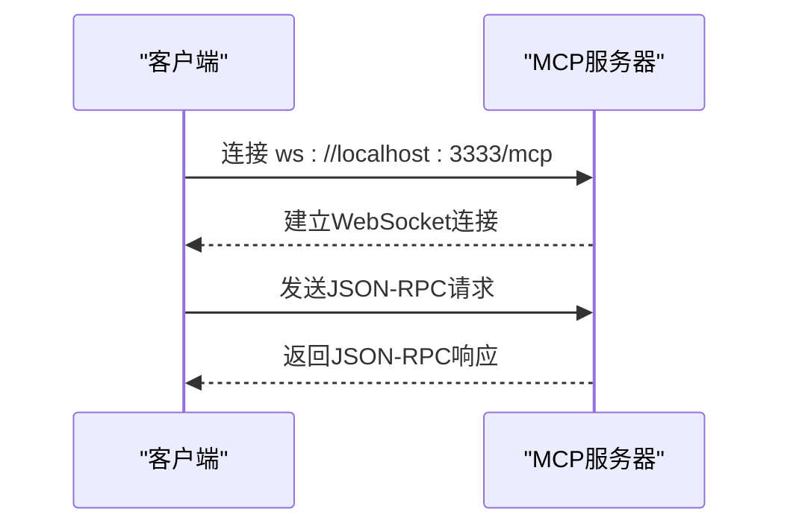

# API参考

<cite>
**本文档引用的文件**   
- [server.py](file://mcp_server/server.py)
- [fetcher.py](file://trendradar/crawler/fetcher.py)
- [manager.py](file://trendradar/storage/manager.py)
- [data_query.py](file://mcp_server/tools/data_query.py)
- [analytics.py](file://mcp_server/tools/analytics.py)
- [search_tools.py](file://mcp_server/tools/search_tools.py)
- [storage_sync.py](file://mcp_server/tools/storage_sync.py)
- [config.yaml](file://config/config.yaml)
</cite>

## 目录
1. [MCP服务器WebSocket API](#mcp服务器websocket-api)
2. [内部模块API](#内部模块api)
3. [代码示例](#代码示例)

## MCP服务器WebSocket API

TrendRadar的MCP（Model Context Protocol）服务器提供了一个基于WebSocket的API，用于与AI模型进行交互。该API遵循JSON-RPC 2.0规范，允许客户端通过WebSocket连接调用服务器上的各种工具。

### 连接URL与握手协议

MCP服务器的WebSocket连接URL为 `ws://localhost:3333/mcp`。客户端需要通过此URL建立WebSocket连接。服务器默认在本地监听3333端口，可通过环境变量或配置文件修改。



**Diagram sources**
- [server.py](file://mcp_server/server.py#L785-L799)

### 消息格式（JSON-RPC 2.0）

所有与MCP服务器的通信均采用JSON-RPC 2.0格式。客户端发送请求，服务器返回响应。

**请求格式：**
```json
{
  "jsonrpc": "2.0",
  "method": "方法名",
  "params": { "参数名": "参数值" },
  "id": 1
}
```

**响应格式：**
```json
{
  "jsonrpc": "2.0",
  "result": "返回结果",
  "id": 1
}
```

**错误响应格式：**
```json
{
  "jsonrpc": "2.0",
  "error": {
    "code": "错误码",
    "message": "错误信息",
    "suggestion": "建议"
  },
  "id": 1
}
```

### 支持的事件类型

MCP服务器支持多种工具调用，这些调用通过`method`字段指定。核心事件类型包括：

- `resolve_date_range`: 解析自然语言日期表达式。
- `get_latest_news`: 获取最新新闻。
- `get_trending_topics`: 获取趋势话题。
- `analyze_topic_trend`: 分析话题趋势。
- `analyze_sentiment`: 分析情感倾向。
- `search_news`: 搜索新闻。
- `get_current_config`: 获取当前配置。
- `get_system_status`: 获取系统状态。
- `trigger_crawl`: 触发爬取任务。
- `sync_from_remote`: 从远程同步数据。
- `get_storage_status`: 获取存储状态。
- `list_available_dates`: 列出可用日期。

### 错误码

MCP服务器定义了多种错误码，用于指示请求失败的原因。

| 错误码 | 含义 | 建议 |
| :--- | :--- | :--- |
| `DATA_NOT_FOUND` | 数据不存在 | 检查日期范围或等待爬取任务完成 |
| `INVALID_PARAMETER` | 参数无效 | 检查参数格式是否正确 |
| `CONFIGURATION_ERROR` | 配置错误 | 检查配置文件是否正确 |
| `PLATFORM_NOT_SUPPORTED` | 平台不支持 | 使用支持的平台ID |
| `CRAWL_TASK_ERROR` | 爬取任务错误 | 稍后重试或查看日志 |
| `FILE_PARSE_ERROR` | 文件解析错误 | 检查文件格式是否正确 |
| `INTERNAL_ERROR` | 内部错误 | 服务器内部发生错误 |

**Section sources**
- [errors.py](file://mcp_server/utils/errors.py#L10-L94)

## 内部模块API

除了对外的MCP API，TrendRadar还提供了丰富的内部模块API，用于数据获取、存储管理等核心功能。

### CrawlerFetcher类

`CrawlerFetcher`类（在代码中为`DataFetcher`）负责从NewsNow API获取数据。

#### fetch方法

`fetch`方法用于获取指定平台的新闻数据。

**方法签名：**
```python
def fetch_data(
    self,
    id_info: Union[str, Tuple[str, str]],
    max_retries: int = 2,
    min_retry_wait: int = 3,
    max_retry_wait: int = 5,
) -> Tuple[Optional[str], str, str]:
```

**参数说明：**
- `id_info`: 平台ID或包含平台ID和别名的元组。
- `max_retries`: 最大重试次数，默认2次。
- `min_retry_wait`: 最小重试等待时间（秒），默认3秒。
- `max_retry_wait`: 最大重试等待时间（秒），默认5秒。

**返回值：**
返回一个元组，包含：
- 响应文本（成功时）或`None`（失败时）。
- 平台ID。
- 别名。

**功能说明：**
该方法会向 `https://newsnow.busiyi.world/api/s` 发送GET请求，获取指定平台的最新新闻数据。它内置了重试机制，在请求失败时会自动重试，并在每次重试之间随机等待一段时间以避免被封禁。

**Section sources**
- [fetcher.py](file://trendradar/crawler/fetcher.py#L50-L115)

### StorageManager类

`StorageManager`是统一的存储管理器，负责管理数据的持久化，支持本地和远程（如Cloudflare R2）存储。

#### 公共接口

##### save_news

`save_news`方法用于保存新闻数据到存储后端。

**方法签名：**
```python
def save_news_data(self, data: NewsData) -> bool:
```

**参数说明：**
- `data`: 一个`NewsData`对象，包含要保存的新闻数据。

**返回值：**
- `True` 如果保存成功。
- `False` 如果保存失败。

**功能说明：**
该方法会将`NewsData`对象中的数据保存到当前配置的存储后端（本地SQLite数据库或远程S3兼容存储）。

##### get_daily_news

`get_daily_news`方法用于获取指定日期的所有新闻数据。

**方法签名：**
```python
def get_today_all_data(self, date: Optional[str] = None) -> Optional[NewsData]:
```

**参数说明：**
- `date`: 日期字符串（YYYY-MM-DD），可选。如果未指定，则获取今天的数据。

**返回值：**
- 一个`NewsData`对象，包含指定日期的所有新闻数据。
- 如果没有数据，则返回`None`。

**功能说明：**
该方法会从存储后端读取指定日期的全部新闻数据，并将其合并成一个`NewsData`对象返回。

##### list_dates

`list_dates`方法用于列出本地和远程可用的日期范围。

**方法签名：**
```python
def list_available_dates(
    self,
    source: str = "both"
) -> str:
```

**参数说明：**
- `source`: 数据来源，可选值为`"local"`（仅本地）、`"remote"`（仅远程）或`"both"`（两者都列出，默认值）。

**返回值：**
返回一个JSON格式的字符串，包含可用的日期列表。

**功能说明：**
该方法会扫描本地`output`目录和远程存储桶，列出所有可用的日期数据，并可以进行对比，显示哪些日期只在本地、只在远程或两者都有。

**Section sources**
- [manager.py](file://trendradar/storage/manager.py#L200-L207)
- [manager.py](file://trendradar/storage/manager.py#L204-L206)
- [manager.py](file://trendradar/storage/manager.py#L740-L777)

## 代码示例

以下是在Python脚本中调用TrendRadar API的示例。

### 调用MCP API

```python
import asyncio
import json
import websockets

async def call_mcp_tool():
    # 连接到MCP服务器
    async with websockets.connect("ws://localhost:3333/mcp") as websocket:
        # 构造JSON-RPC请求
        request = {
            "jsonrpc": "2.0",
            "method": "get_latest_news",
            "params": {
                "platforms": ["zhihu", "weibo"],
                "limit": 10
            },
            "id": 1
        }
        
        # 发送请求
        await websocket.send(json.dumps(request))
        
        # 接收响应
        response = await websocket.recv()
        result = json.loads(response)
        
        # 处理结果
        if "result" in result:
            news_list = json.loads(result["result"])["news"]
            for news in news_list:
                print(f"{news['rank']}. {news['title']} ({news['platform_name']})")
        elif "error" in result:
            print(f"Error: {result['error']['message']}")

# 运行异步函数
asyncio.run(call_mcp_tool())
```

### 调用内部模块API

```python
from trendradar.crawler.fetcher import DataFetcher
from trendradar.storage.manager import get_storage_manager

# 1. 使用CrawlerFetcher获取数据
fetcher = DataFetcher()
# 获取知乎数据
data_text, platform_id, alias = fetcher.fetch_data("zhihu")
if data_text:
    print(f"成功获取 {alias} 数据")
    # 解析JSON数据
    import json
    data = json.loads(data_text)
    print(f"获取到 {len(data.get('items', []))} 条新闻")

# 2. 使用StorageManager保存和读取数据
storage_manager = get_storage_manager()

# 假设我们有一个NewsData对象（此处为简化示例）
# 在实际应用中，这个对象通常由爬虫生成
from trendradar.storage.base import NewsData, NewsItem
sample_data = NewsData(
    date="2025-11-26",
    crawl_time="10:30",
    items={
        "zhihu": [
            NewsItem(title="AI最新进展", source_id="zhihu", rank=1)
        ]
    },
    id_to_name={"zhihu": "知乎"}
)

# 保存数据
success = storage_manager.save_news_data(sample_data)
print(f"数据保存 {'成功' if success else '失败'}")

# 读取数据
retrieved_data = storage_manager.get_today_all_data("2025-11-26")
if retrieved_data:
    print(f"读取到 {retrieved_data.get_total_count()} 条新闻")
```