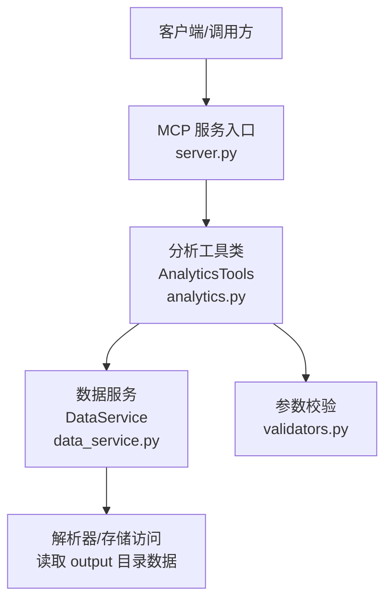
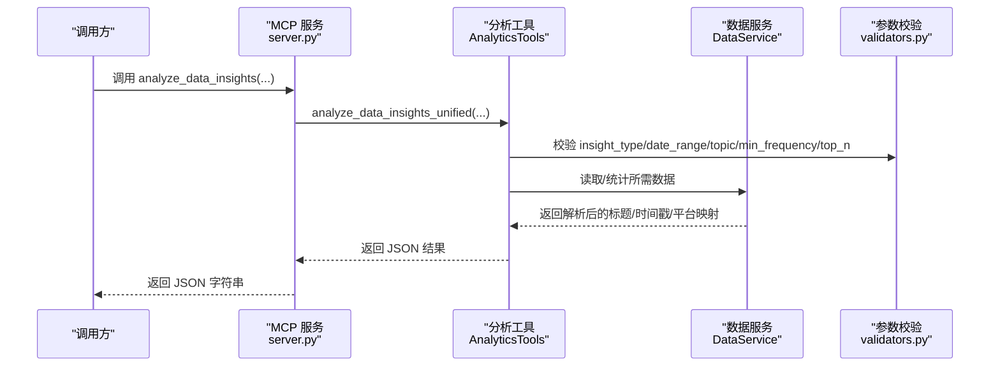
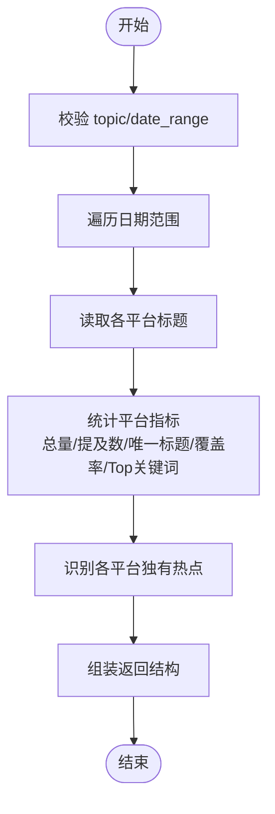
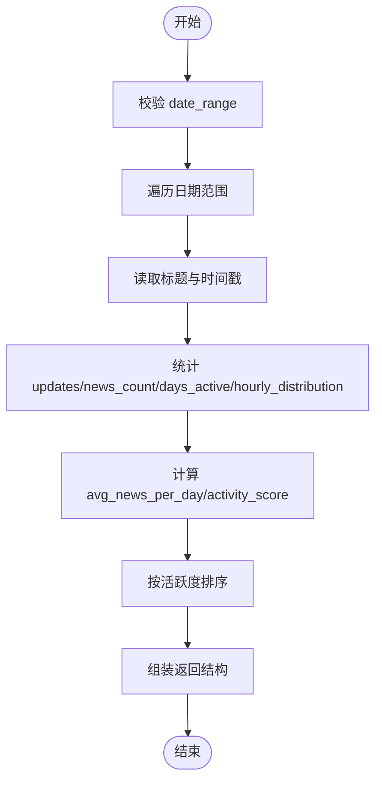
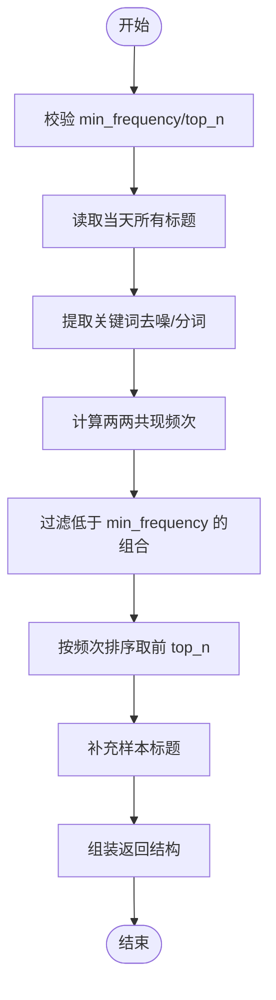
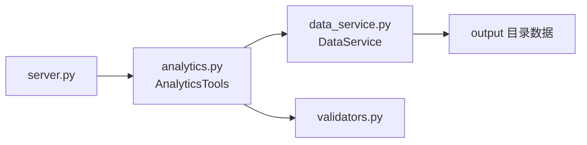

# analyze_data_insights 工具

<cite>
**本文引用的文件**
- [mcp_server/tools/analytics.py](file://mcp_server/tools/analytics.py)
- [mcp_server/server.py](file://mcp_server/server.py)
- [mcp_server/utils/validators.py](file://mcp_server/utils/validators.py)
- [mcp_server/services/data_service.py](file://mcp_server/services/data_service.py)
- [README-MCP-FAQ-EN.md](file://README-MCP-FAQ-EN.md)
</cite>

## 目录
1. [简介](#简介)
2. [项目结构](#项目结构)
3. [核心组件](#核心组件)
4. [架构总览](#架构总览)
5. [详细组件分析](#详细组件分析)
6. [依赖关系分析](#依赖关系分析)
7. [性能考量](#性能考量)
8. [故障排查指南](#故障排查指南)
9. [结论](#结论)
10. [附录](#附录)

## 简介
本文件面向使用者与开发者，系统化文档化 analyze_data_insights 统一数据洞察分析工具。该工具整合三种洞察模式：平台对比分析（platform_compare）、平台活跃度统计（platform_activity）、关键词共现分析（keyword_cooccur）。文档将详细说明：
- insight_type 参数的三种模式及其适用场景
- topic 参数在 platform_compare 模式下的作用
- date_range 参数的对象格式要求与重要性
- min_frequency（最小共现频次，默认3）与 top_n（返回TOP N结果，默认20）在 keyword_cooccur 模式下的应用
- 每种洞察类型的返回 JSON 结构
- 具体调用示例与最佳实践
- 如何利用该工具发现跨平台传播模式与内容关联性

## 项目结构
analyze_data_insights 位于 MCP 服务层，通过统一入口 server.py 的 @mcp.tool 注册，内部委托 AnalyticsTools 类完成具体分析逻辑；数据访问由 DataService 封装，参数校验由 validators 工具完成。

图表来源
- [mcp_server/server.py](file://mcp_server/server.py#L300-L333)
- [mcp_server/tools/analytics.py](file://mcp_server/tools/analytics.py#L88-L116)
- [mcp_server/services/data_service.py](file://mcp_server/services/data_service.py#L17-L40)
- [mcp_server/utils/validators.py](file://mcp_server/utils/validators.py#L145-L209)

章节来源
- [mcp_server/server.py](file://mcp_server/server.py#L300-L333)
- [mcp_server/tools/analytics.py](file://mcp_server/tools/analytics.py#L88-L116)
- [mcp_server/services/data_service.py](file://mcp_server/services/data_service.py#L17-L40)
- [mcp_server/utils/validators.py](file://mcp_server/utils/validators.py#L145-L209)

## 核心组件
- 统一入口：@mcp.tool analyze_data_insights，负责接收参数、调用工具并返回 JSON
- 工具类：AnalyticsTools.analyze_data_insights_unified，根据 insight_type 分派到具体分析方法
- 数据服务：DataService，封装读取 output 目录数据、缓存与统计
- 参数校验：validators.validate_date_range、validate_keyword、validate_limit、validate_top_n 等

章节来源
- [mcp_server/server.py](file://mcp_server/server.py#L300-L333)
- [mcp_server/tools/analytics.py](file://mcp_server/tools/analytics.py#L88-L116)
- [mcp_server/utils/validators.py](file://mcp_server/utils/validators.py#L145-L209)
- [mcp_server/services/data_service.py](file://mcp_server/services/data_service.py#L17-L40)

## 架构总览
analyze_data_insights 的调用链路如下：

图表来源
- [mcp_server/server.py](file://mcp_server/server.py#L300-L333)
- [mcp_server/tools/analytics.py](file://mcp_server/tools/analytics.py#L88-L116)
- [mcp_server/utils/validators.py](file://mcp_server/utils/validators.py#L145-L209)
- [mcp_server/services/data_service.py](file://mcp_server/services/data_service.py#L17-L40)

## 详细组件分析

### 统一入口与参数规范
- 入口函数：@mcp.tool analyze_data_insights
- 关键参数：
  - insight_type：平台对比（platform_compare）、平台活跃度（platform_activity）、关键词共现（keyword_cooccur）
  - topic：平台对比模式下的可选话题关键词
  - date_range：对象格式 {"start": "YYYY-MM-DD", "end": "YYYY-MM-DD"}，必须为对象类型
  - min_frequency：关键词共现模式下的最小共现频次，默认3
  - top_n：关键词共现模式下返回的 TOP N 结果，默认20
- 返回：JSON 字符串，包含 success/error 与具体分析结果

章节来源
- [mcp_server/server.py](file://mcp_server/server.py#L300-L333)
- [README-MCP-FAQ-EN.md](file://README-MCP-FAQ-EN.md#L270-L292)

### 平台对比分析（platform_compare）
- 作用：对比不同平台对同一话题的关注度，或在未指定话题时对比整体活跃度
- 输入：
  - insight_type = "platform_compare"
  - topic：可选，用于限定统计范围
  - date_range：可选，若不提供则默认当天
- 处理逻辑要点：
  - 校验 topic（如提供）与 date_range
  - 遍历日期范围，读取各平台标题
  - 统计各平台的新闻总量、话题提及数、唯一标题数、话题覆盖率、Top 关键词
  - 识别各平台独有热点（基于 Top 关键词集合差集）
- 返回结构（简化说明）：
  - success：布尔
  - topic/date_range/platform_stats/unique_topics/total_platforms
  - platform_stats：平台维度指标（total_news、topic_mentions、unique_titles、coverage_rate、top_keywords）
  - unique_topics：各平台独有的 Top 关键词列表
  - total_platforms：平台总数

图表来源
- [mcp_server/tools/analytics.py](file://mcp_server/tools/analytics.py#L401-L510)

章节来源
- [mcp_server/tools/analytics.py](file://mcp_server/tools/analytics.py#L401-L510)

### 平台活跃度统计（platform_activity）
- 作用：统计各平台发布频率、活跃天数、平均每日新闻数、最活跃时段等
- 输入：
  - insight_type = "platform_activity"
  - date_range：可选，若不提供则默认当天
- 处理逻辑要点：
  - 校验 date_range
  - 遍历日期范围，读取各平台标题与文件时间戳
  - 统计 total_updates（基于文件数量）、news_count、days_active、hourly_distribution
  - 计算 avg_news_per_day 与 activity_score，并按活跃度排序
- 返回结构（简化说明）：
  - success：布尔
  - date_range/start/end/total_platforms
  - platform_activity：平台维度指标（total_updates、news_count、days_active、avg_news_per_day、most_active_hours、activity_score）
  - most_active_platform：活跃度最高平台

图表来源
- [mcp_server/tools/analytics.py](file://mcp_server/tools/analytics.py#L1337-L1462)

章节来源
- [mcp_server/tools/analytics.py](file://mcp_server/tools/analytics.py#L1337-L1462)

### 关键词共现分析（keyword_cooccur）
- 作用：分析标题中关键词同时出现的模式，识别高频共现组合
- 输入：
  - insight_type = "keyword_cooccur"
  - min_frequency：最小共现频次，默认3
  - top_n：返回 TOP N 结果，默认20
- 处理逻辑要点：
  - 校验 min_frequency 与 top_n
  - 读取当天所有标题，提取关键词（简单分词与停用词过滤）
  - 计算两两关键词共现频次，过滤低于 min_frequency 的组合
  - 按频次排序取前 top_n，补充样本标题
- 返回结构（简化说明）：
  - success：布尔
  - cooccurrence_pairs：包含 keyword1、keyword2、cooccurrence_count、sample_titles
  - total_pairs/min_frequency/generated_at

图表来源
- [mcp_server/tools/analytics.py](file://mcp_server/tools/analytics.py#L525-L628)

章节来源
- [mcp_server/tools/analytics.py](file://mcp_server/tools/analytics.py#L525-L628)

### 参数校验与错误处理
- 日期范围校验 validate_date_range：必须为对象 {"start": "YYYY-MM-DD", "end": "YYYY-MM-DD"}，且 start ≤ end，不可查询未来日期
- 关键词校验 validate_keyword：非空、长度限制
- 数量限制 validate_limit/validate_top_n：默认与上限约束
- 统一错误包装：InvalidParameterError/DataNotFoundError/MCPError，最终返回包含 success 与 error 字段的 JSON

章节来源
- [mcp_server/utils/validators.py](file://mcp_server/utils/validators.py#L145-L209)
- [mcp_server/utils/validators.py](file://mcp_server/utils/validators.py#L212-L242)
- [mcp_server/utils/validators.py](file://mcp_server/utils/validators.py#L90-L121)
- [mcp_server/utils/validators.py](file://mcp_server/utils/validators.py#L245-L259)

## 依赖关系分析
- 服务入口依赖工具类：server.py 调用 AnalyticsTools.analyze_data_insights_unified
- 工具类依赖数据服务：DataService 读取 output 目录数据并提供缓存
- 工具类依赖参数校验：validators 提供统一参数校验
- 返回 JSON 结构遵循统一约定：success/error 与业务字段

图表来源
- [mcp_server/server.py](file://mcp_server/server.py#L300-L333)
- [mcp_server/tools/analytics.py](file://mcp_server/tools/analytics.py#L88-L116)
- [mcp_server/services/data_service.py](file://mcp_server/services/data_service.py#L17-L40)
- [mcp_server/utils/validators.py](file://mcp_server/utils/validators.py#L145-L209)

章节来源
- [mcp_server/server.py](file://mcp_server/server.py#L300-L333)
- [mcp_server/tools/analytics.py](file://mcp_server/tools/analytics.py#L88-L116)
- [mcp_server/services/data_service.py](file://mcp_server/services/data_service.py#L17-L40)
- [mcp_server/utils/validators.py](file://mcp_server/utils/validators.py#L145-L209)

## 性能考量
- 缓存策略：DataService 在读取最新/历史数据时使用缓存，减少重复 IO
- 时间复杂度：
  - 平台对比：对日期范围与平台进行双重遍历，时间复杂度约 O(D×P×T)，其中 D 为天数、P 为平台数、T 为当日标题数
  - 关键词共现：两两组合计数，最坏 O(T×K^2)，K 为关键词数；通过 min_frequency 过滤与 top_n 限制可显著降低
- I/O 优化：按天读取，避免一次性加载过多数据；缓存命中可大幅提速

章节来源
- [mcp_server/services/data_service.py](file://mcp_server/services/data_service.py#L50-L102)
- [mcp_server/tools/analytics.py](file://mcp_server/tools/analytics.py#L525-L628)

## 故障排查指南
- 日期范围格式错误
  - 现象：抛出 InvalidParameterError，提示 date_range 必须是字典且包含 start/end
  - 处理：确认传入对象格式，且 start ≤ end，不可查询未来日期
- 话题关键词为空或格式不符
  - 现象：抛出 InvalidParameterError，提示 keyword 不能为空
  - 处理：确保 topic 为非空字符串，长度不超过限制
- 返回 error 字段
  - 现象：success=false，error 包含 code/message/suggestion
  - 处理：根据错误提示调整参数或等待数据生成

章节来源
- [mcp_server/utils/validators.py](file://mcp_server/utils/validators.py#L145-L209)
- [mcp_server/utils/validators.py](file://mcp_server/utils/validators.py#L212-L242)
- [mcp_server/tools/analytics.py](file://mcp_server/tools/analytics.py#L117-L154)

## 结论
analyze_data_insights 工具通过统一入口与清晰的参数规范，将平台对比、活跃度统计与关键词共现三大分析能力整合在一起。借助 validators 的强校验与 DataService 的缓存，工具在准确性和性能方面均有保障。用户可据此快速发现跨平台传播模式与内容关联性，支撑更深入的数据洞察与决策。

## 附录

### 参数与返回结构对照表
- 平台对比（platform_compare）
  - 输入：insight_type="platform_compare"、topic（可选）、date_range（可选）
  - 返回：success、topic、date_range、platform_stats、unique_topics、total_platforms
- 平台活跃度（platform_activity）
  - 输入：insight_type="platform_activity"、date_range（可选）
  - 返回：success、date_range、platform_activity、most_active_platform、total_platforms
- 关键词共现（keyword_cooccur）
  - 输入：insight_type="keyword_cooccur"、min_frequency（默认3）、top_n（默认20）
  - 返回：success、cooccurrence_pairs、total_pairs、min_frequency、generated_at

章节来源
- [mcp_server/tools/analytics.py](file://mcp_server/tools/analytics.py#L401-L510)
- [mcp_server/tools/analytics.py](file://mcp_server/tools/analytics.py#L1337-L1462)
- [mcp_server/tools/analytics.py](file://mcp_server/tools/analytics.py#L525-L628)

### 调用示例与最佳实践
- 对比“人工智能”话题在各平台的关注度
  - 调用：analyze_data_insights(insight_type="platform_compare", topic="人工智能", date_range={"start": "YYYY-MM-DD", "end": "YYYY-MM-DD"})
  - 用途：识别平台间话题偏好差异与传播强度
- 分析各平台活跃度与发布时间规律
  - 调用：analyze_data_insights(insight_type="platform_activity", date_range={"start": "YYYY-MM-DD", "end": "YYYY-MM-DD"})
  - 用途：发现最活跃平台与高峰时段，优化内容投放节奏
- 分析高频共现的关键词组合
  - 调用：analyze_data_insights(insight_type="keyword_cooccur", min_frequency=3, top_n=20)
  - 用途：发现内容关联性与潜在话题组合，辅助选题与交叉传播

章节来源
- [mcp_server/server.py](file://mcp_server/server.py#L300-L333)
- [README-MCP-FAQ-EN.md](file://README-MCP-FAQ-EN.md#L270-L292)