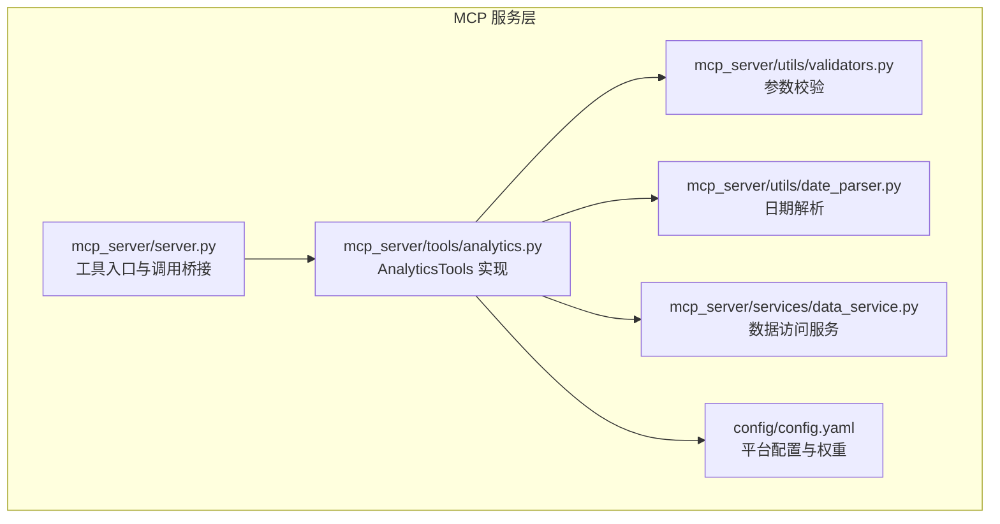
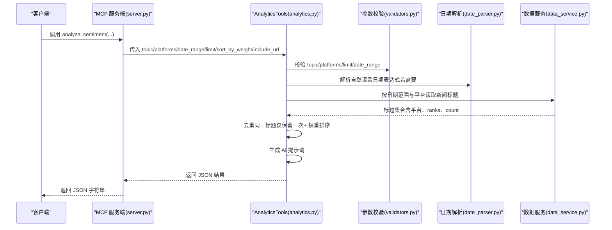
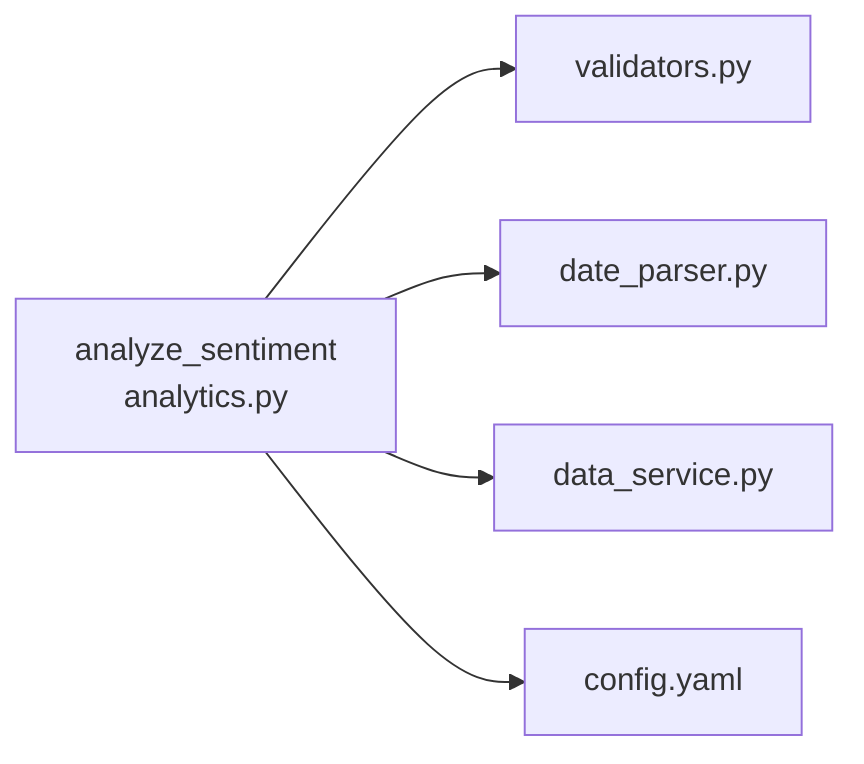

# analyze_sentiment 工具

<cite>
**本文引用的文件**
- [mcp_server/server.py](file://mcp_server/server.py)
- [mcp_server/tools/analytics.py](file://mcp_server/tools/analytics.py)
- [mcp_server/utils/date_parser.py](file://mcp_server/utils/date_parser.py)
- [mcp_server/utils/validators.py](file://mcp_server/utils/validators.py)
- [mcp_server/services/data_service.py](file://mcp_server/services/data_service.py)
- [config/config.yaml](file://config/config.yaml)
- [README-MCP-FAQ-EN.md](file://README-MCP-FAQ-EN.md)
</cite>

## 目录
1. [简介](#简介)
2. [项目结构](#项目结构)
3. [核心组件](#核心组件)
4. [架构总览](#架构总览)
5. [详细组件分析](#详细组件分析)
6. [依赖关系分析](#依赖关系分析)
7. [性能考量](#性能考量)
8. [故障排查指南](#故障排查指南)
9. [结论](#结论)
10. [附录](#附录)

## 简介
analyze_sentiment 是一个用于分析新闻情感倾向与热度趋势的工具。它会根据用户提供的关键词、平台过滤条件与日期范围，抓取相关新闻标题，并生成结构化的 AI 提示词，交由 AI 深度分析情感分布、平台对比与整体趋势。工具强调“先解析日期再分析”的最佳实践，支持按热度权重排序、标题去重与可选 URL 展示，返回结构化 JSON 结果，便于前端或下游系统直接渲染。

## 项目结构
analyze_sentiment 工具位于 MCP 服务层，通过统一入口暴露为工具函数；其核心逻辑集中在 AnalyticsTools 类中，配合参数校验器、日期解析器与数据服务完成数据采集与加工。

图示来源
- [mcp_server/server.py](file://mcp_server/server.py#L336-L398)
- [mcp_server/tools/analytics.py](file://mcp_server/tools/analytics.py#L630-L816)
- [mcp_server/utils/validators.py](file://mcp_server/utils/validators.py#L43-L121)
- [mcp_server/utils/date_parser.py](file://mcp_server/utils/date_parser.py#L330-L424)
- [mcp_server/services/data_service.py](file://mcp_server/services/data_service.py#L1-L120)
- [config/config.yaml](file://config/config.yaml#L157-L187)

章节来源
- [mcp_server/server.py](file://mcp_server/server.py#L336-L398)
- [mcp_server/tools/analytics.py](file://mcp_server/tools/analytics.py#L630-L816)
- [mcp_server/utils/validators.py](file://mcp_server/utils/validators.py#L43-L121)
- [mcp_server/utils/date_parser.py](file://mcp_server/utils/date_parser.py#L330-L424)
- [mcp_server/services/data_service.py](file://mcp_server/services/data_service.py#L1-L120)
- [config/config.yaml](file://config/config.yaml#L157-L187)

## 核心组件
- 工具入口与调用桥接：MCP 服务端将 analyze_sentiment 暴露为工具，负责参数透传与结果序列化。
- AnalyticsTools.analyze_sentiment：核心分析逻辑，负责参数校验、日期范围处理、数据采集、去重、权重排序、提示词生成与结果组装。
- 参数校验器：统一校验平台、数量限制、日期范围、关键词等。
- 日期解析器：将自然语言日期表达式标准化为标准日期范围。
- 数据服务：封装数据读取与缓存，按日期与平台聚合新闻标题。
- 平台配置：从配置文件读取支持的平台列表与权重配置。

章节来源
- [mcp_server/server.py](file://mcp_server/server.py#L336-L398)
- [mcp_server/tools/analytics.py](file://mcp_server/tools/analytics.py#L630-L816)
- [mcp_server/utils/validators.py](file://mcp_server/utils/validators.py#L43-L121)
- [mcp_server/utils/date_parser.py](file://mcp_server/utils/date_parser.py#L330-L424)
- [mcp_server/services/data_service.py](file://mcp_server/services/data_service.py#L1-L120)
- [config/config.yaml](file://config/config.yaml#L157-L187)

## 架构总览
analyze_sentiment 的调用链路如下：客户端调用 MCP 工具 → 服务端解析参数 → 调用 AnalyticsTools → 参数校验 → 日期解析 → 数据服务读取 → 去重与权重排序 → 生成提示词 → 返回 JSON。

图示来源
- [mcp_server/server.py](file://mcp_server/server.py#L336-L398)
- [mcp_server/tools/analytics.py](file://mcp_server/tools/analytics.py#L630-L816)
- [mcp_server/utils/validators.py](file://mcp_server/utils/validators.py#L43-L121)
- [mcp_server/utils/date_parser.py](file://mcp_server/utils/date_parser.py#L330-L424)
- [mcp_server/services/data_service.py](file://mcp_server/services/data_service.py#L104-L182)

## 详细组件分析

### analyze_sentiment 参数与行为
- topic（可选）：关键词过滤，仅分析包含该关键词的新闻标题。
- platforms（可选）：平台过滤列表，如 ['zhihu', 'weibo']；未指定时使用配置文件中的平台列表。
- date_range（可选）：日期范围 {"start": "YYYY-MM-DD", "end": "YYYY-MM-DD"}；未指定时默认查询今天。
- limit（默认50，最大100）：返回新闻数量上限；受去重与可用数据影响，实际返回可能少于请求值。
- sort_by_weight（默认True）：是否按热度权重排序；开启可优先展示更热新闻。
- include_url（默认False）：是否包含 URL 字段；关闭可节省 token。

返回结构要点（JSON 字段说明）
- success：布尔，表示请求是否成功。
- method：字符串，当前采用的分析方法标识。
- summary：概要信息
  - total_found：去重前匹配到的新闻总数
  - returned_count：最终返回的新闻数量
  - requested_limit：请求的 limit
  - duplicates_removed：去重移除的数量
  - topic/time_range/platforms/sorted_by_weight：本次分析的关键上下文
- ai_prompt：用于 AI 情感分析的结构化提示词
- news_sample：按权重排序后的新闻样本列表（含平台、标题、ranks、count、日期等）
- note（可选）：当返回数量小于请求值时，给出原因说明（去重或数据不足）

章节来源
- [mcp_server/server.py](file://mcp_server/server.py#L353-L398)
- [mcp_server/tools/analytics.py](file://mcp_server/tools/analytics.py#L630-L816)

### 日期范围处理的最佳实践
- 强烈建议先调用 resolve_date_range 将自然语言日期表达式解析为标准日期范围，再传入 analyze_sentiment。
- 支持的表达式包括：今天/昨天、本周/上周、本月/上月、最近N天、last N days 等。
- 服务端使用精确的当前时间计算，保证所有 AI 模型得到一致的日期范围。

章节来源
- [mcp_server/server.py](file://mcp_server/server.py#L42-L87)
- [mcp_server/utils/date_parser.py](file://mcp_server/utils/date_parser.py#L330-L424)
- [README-MCP-FAQ-EN.md](file://README-MCP-FAQ-EN.md#L533-L566)

### 标题去重与返回数量说明
- 去重规则：以“平台::标题”为键，同一标题在不同平台只保留一次；若同一标题跨多天出现，会合并其 ranks 并更新 count。
- 实际返回数量可能少于 limit 的原因：
  - 去重后总量不足
  - 指定日期范围内无匹配新闻
- 若返回数量小于请求值，工具会在结果中附加 note 说明原因。

章节来源
- [mcp_server/tools/analytics.py](file://mcp_server/tools/analytics.py#L741-L764)
- [mcp_server/server.py](file://mcp_server/server.py#L363-L366)

### 热度权重排序与权重构成
- 权重计算综合考虑：排名权重（60%）、频次权重（30%）、热度权重（10%）。
- 排名权重：基于各条新闻在榜单中的排名得分。
- 频次权重：新闻出现次数的上限化处理。
- 热度权重：高排名出现比例的加成。
- 默认按权重降序排序，提升热点新闻的可见性。

章节来源
- [mcp_server/tools/analytics.py](file://mcp_server/tools/analytics.py#L24-L74)
- [config/config.yaml](file://config/config.yaml#L157-L162)

### 平台过滤与配置
- platforms 未指定时，使用 config/config.yaml 中的 platforms 列表。
- 平台 ID 与名称来自配置文件，便于 AI 识别与展示。
- 参数校验会确保平台 ID 在配置中存在，否则抛出错误。

章节来源
- [mcp_server/utils/validators.py](file://mcp_server/utils/validators.py#L43-L88)
- [config/config.yaml](file://config/config.yaml#L163-L187)

### 数据来源与缓存
- 数据服务按日期与平台读取标题集合，支持缓存与历史数据扫描。
- analyze_sentiment 会遍历日期范围，逐日读取并聚合，再进行去重与排序。

章节来源
- [mcp_server/services/data_service.py](file://mcp_server/services/data_service.py#L104-L182)

### 调用示例：分析“特斯拉”最近7天新闻情感的完整流程
- 第一步：调用 resolve_date_range("最近7天")，获取标准日期范围。
- 第二步：调用 analyze_sentiment(topic="特斯拉", date_range=上一步返回的日期范围)。
- 第三步：在返回的 JSON 中，使用 ai_prompt 字段交给 AI 进行情感分析；同时可直接展示 news_sample 与 summary。

章节来源
- [mcp_server/server.py](file://mcp_server/server.py#L373-L382)
- [README-MCP-FAQ-EN.md](file://README-MCP-FAQ-EN.md#L533-L566)

## 依赖关系分析
- analyze_sentiment 依赖参数校验器进行平台、数量、日期与关键词的合法性检查。
- 依赖日期解析器将自然语言表达式转换为标准日期范围。
- 依赖数据服务读取指定日期范围内的新闻标题集合。
- 依赖配置文件提供平台列表与权重配置。

图示来源
- [mcp_server/tools/analytics.py](file://mcp_server/tools/analytics.py#L630-L816)
- [mcp_server/utils/validators.py](file://mcp_server/utils/validators.py#L43-L121)
- [mcp_server/utils/date_parser.py](file://mcp_server/utils/date_parser.py#L330-L424)
- [mcp_server/services/data_service.py](file://mcp_server/services/data_service.py#L1-L120)
- [config/config.yaml](file://config/config.yaml#L157-L187)

## 性能考量
- 去重与排序：对去重后的新闻列表进行排序，时间复杂度与去重后数量相关；建议合理设置 limit。
- 日期范围遍历：按天遍历日期范围读取数据，时间复杂度与天数成正比；尽量使用 resolve_date_range 缩短范围。
- 缓存：数据服务对读取结果进行缓存，减少重复 IO；注意缓存 TTL 设置。
- URL 字段：关闭 include_url 可显著减少 token 消耗，提高提示词生成效率。

[本节为通用指导，不涉及具体文件分析]

## 故障排查指南
- 日期范围错误：检查 date_range 的 start/end 格式与先后顺序；确保未查询未来日期。
- 平台不支持：确认 platforms 是否存在于 config.yaml 的 platforms 列表中。
- 关键词非法：确保 topic 非空且长度合理。
- 无匹配数据：缩小日期范围或放宽关键词；确认目标日期范围内确实存在相关新闻。
- 返回数量不足：确认是否触发了去重逻辑或数据本身较少。

章节来源
- [mcp_server/utils/validators.py](file://mcp_server/utils/validators.py#L145-L209)
- [mcp_server/utils/validators.py](file://mcp_server/utils/validators.py#L212-L242)
- [mcp_server/utils/validators.py](file://mcp_server/utils/validators.py#L43-L88)
- [mcp_server/server.py](file://mcp_server/server.py#L363-L366)

## 结论
analyze_sentiment 工具通过严格的参数校验、标准化的日期范围处理与高效的去重排序，为情感分析提供了高质量的输入数据与结构化提示词。遵循“先解析日期、再分析”的最佳实践，结合合理的平台与关键词过滤，可稳定产出可直接用于 AI 深度分析的结果。默认应展示完整分析结果与新闻列表，仅在用户明确要求“总结/挑重点”时进行筛选。

[本节为总结性内容，不涉及具体文件分析]

## 附录

### 返回 JSON 结构说明
- success：布尔，请求是否成功
- method：字符串，分析方法标识
- summary：概要信息
  - total_found：去重前匹配到的新闻总数
  - returned_count：最终返回的新闻数量
  - requested_limit：请求的 limit
  - duplicates_removed：去重移除的数量
  - topic/time_range/platforms/sorted_by_weight：本次分析的关键上下文
- ai_prompt：用于 AI 情感分析的结构化提示词
- news_sample：按权重排序后的新闻样本列表（含平台、标题、ranks、count、日期等）
- note（可选）：当返回数量小于请求值时，给出原因说明

章节来源
- [mcp_server/tools/analytics.py](file://mcp_server/tools/analytics.py#L777-L800)