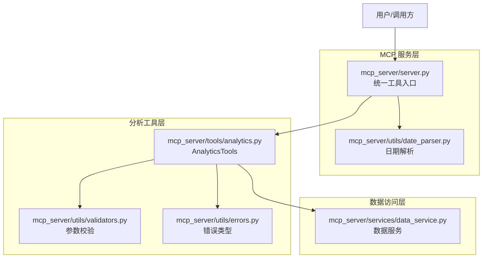
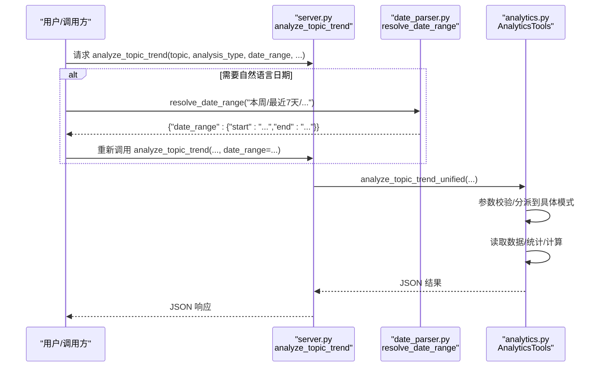
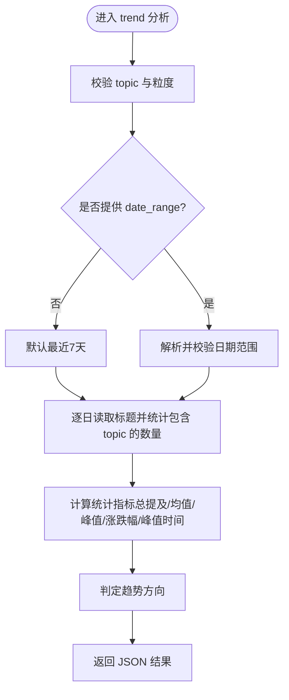
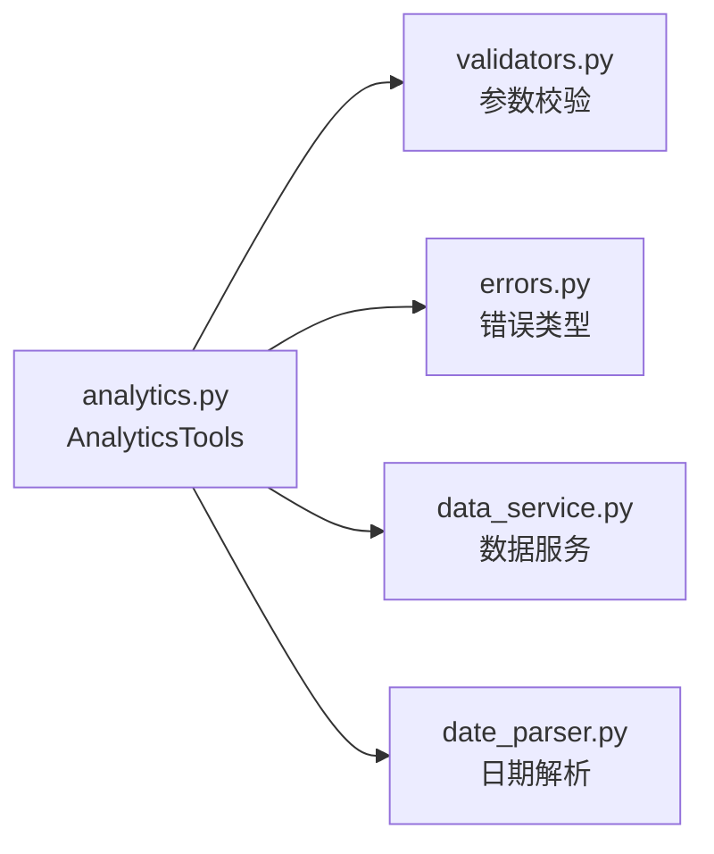

# analyze_topic_trend 工具

<cite>
**本文引用的文件**
- [mcp_server/server.py](file://mcp_server/server.py)
- [mcp_server/tools/analytics.py](file://mcp_server/tools/analytics.py)
- [mcp_server/utils/date_parser.py](file://mcp_server/utils/date_parser.py)
- [mcp_server/services/data_service.py](file://mcp_server/services/data_service.py)
- [mcp_server/utils/validators.py](file://mcp_server/utils/validators.py)
- [mcp_server/utils/errors.py](file://mcp_server/utils/errors.py)
</cite>

## 目录
1. [简介](#简介)
2. [项目结构](#项目结构)
3. [核心组件](#核心组件)
4. [架构总览](#架构总览)
5. [详细组件分析](#详细组件分析)
6. [依赖关系分析](#依赖关系分析)
7. [性能考量](#性能考量)
8. [故障排查指南](#故障排查指南)
9. [结论](#结论)
10. [附录](#附录)

## 简介
analyze_topic_trend 是统一话题趋势分析接口，提供四种分析模式：
- trend：热度趋势分析（追踪话题的热度变化）
- lifecycle：生命周期分析（从出现到消失的完整周期）
- viral：异常热度检测（识别突然爆火的话题）
- predict：话题预测（预测未来可能的热点）

本工具强调最佳实践：必须先调用 resolve_date_range 获取精确日期范围，再将 date_range 传入本工具。本文档详细说明 topic 参数（必需的话题关键词）、analysis_type 参数的四种模式、date_range 的 JSON 对象格式及默认行为、以及 granular、threshold、time_window、lookahead_hours、confidence_threshold 等高级参数的用途；并文档化不同分析类型的返回结构差异，给出完整调用流程示例（如分析“AI”本周趋势的两步调用过程），最后说明各模式的适用场景与业务价值。

## 项目结构
- 工具入口与统一接口位于 mcp_server/server.py，负责接收用户请求、校验参数、调用 AnalyticsTools 并返回 JSON 结果。
- 核心实现位于 mcp_server/tools/analytics.py，包含 AnalyticsTools 类及其四个分析方法：analyze_topic_trend_unified、get_topic_trend_analysis、analyze_topic_lifecycle、detect_viral_topics、predict_trending_topics。
- 日期解析由 mcp_server/utils/date_parser.py 提供，支持“本周”、“最近7天”等自然语言表达式解析为标准日期范围。
- 数据访问通过 mcp_server/services/data_service.py 与解析器交互，读取每日标题数据进行统计分析。
- 参数校验与错误处理由 mcp_server/utils/validators.py 与 mcp_server/utils/errors.py 提供。

图表来源
- [mcp_server/server.py](file://mcp_server/server.py#L240-L290)
- [mcp_server/tools/analytics.py](file://mcp_server/tools/analytics.py#L155-L241)
- [mcp_server/utils/date_parser.py](file://mcp_server/utils/date_parser.py#L331-L423)
- [mcp_server/services/data_service.py](file://mcp_server/services/data_service.py#L1-L50)

章节来源
- [mcp_server/server.py](file://mcp_server/server.py#L240-L290)
- [mcp_server/tools/analytics.py](file://mcp_server/tools/analytics.py#L155-L241)

## 核心组件
- analyze_topic_trend_unified：统一入口，根据 analysis_type 分派到具体分析方法，负责参数校验与错误包装。
- get_topic_trend_analysis：trend 模式，按天统计话题出现次数，计算趋势指标（总提及、均值、峰值、峰值时间、涨跌幅、趋势方向）。
- analyze_topic_lifecycle：lifecycle 模式，统计话题在时间轴上的出现情况，判断首次/末次出现、峰值、活跃天数、平均日提及、生命周期阶段与话题类型。
- detect_viral_topics：viral 模式，比较今日与昨日关键词频率，识别异常增长话题（支持阈值与时间窗口）。
- predict_trending_topics：predict 模式，基于最近3天关键词趋势，计算增长率与置信度，预测潜在热点。

章节来源
- [mcp_server/tools/analytics.py](file://mcp_server/tools/analytics.py#L155-L241)
- [mcp_server/tools/analytics.py](file://mcp_server/tools/analytics.py#L243-L385)
- [mcp_server/tools/analytics.py](file://mcp_server/tools/analytics.py#L1464-L1606)
- [mcp_server/tools/analytics.py](file://mcp_server/tools/analytics.py#L1622-L1743)
- [mcp_server/tools/analytics.py](file://mcp_server/tools/analytics.py#L1758-L1904)

## 架构总览
统一入口 analyze_topic_trend 在 server.py 中被注册为 MCP 工具，接收用户请求后：
1) 若 analysis_type 为 trend 或 lifecycle，建议先调用 resolve_date_range 获取精确日期范围；
2) 将 topic、analysis_type、date_range、granularity、threshold、time_window、lookahead_hours、confidence_threshold 等参数传入 AnalyticsTools；
3) AnalyticsTools 内部根据 analysis_type 调用对应方法，读取数据并返回结构化 JSON。

图表来源
- [mcp_server/server.py](file://mcp_server/server.py#L240-L290)
- [mcp_server/utils/date_parser.py](file://mcp_server/utils/date_parser.py#L331-L423)
- [mcp_server/tools/analytics.py](file://mcp_server/tools/analytics.py#L155-L241)

## 详细组件分析

### 统一入口 analyze_topic_trend_unified
- 必填参数：topic（必需）
- 可选参数：analysis_type（trend/lifecycle/viral/predict）、date_range（JSON 对象 {"start":"YYYY-MM-DD","end":"YYYY-MM-DD"}）、granularity（trend 模式，默认 day）、threshold（viral 模式，默认 3.0）、time_window（viral 模式，默认 24）、lookahead_hours（predict 模式，默认 6）、confidence_threshold（predict 模式，默认 0.7）
- 行为：校验 topic 与 analysis_type，按模式分派到具体分析方法；捕获 MCPError 与通用异常，返回 success 与 error 字段。

章节来源
- [mcp_server/tools/analytics.py](file://mcp_server/tools/analytics.py#L155-L241)

### trend 模式：get_topic_trend_analysis
- 作用：追踪特定话题的热度变化趋势，按天统计包含 topic 的新闻标题数量，输出趋势数据与统计指标。
- 参数：
  - topic：必填
  - date_range：可选，格式 {"start":"YYYY-MM-DD","end":"YYYY-MM-DD"}；未提供时默认最近7天
  - granularity：仅支持 "day"（底层数据按天聚合）
- 返回结构要点：
  - success、topic、date_range（含 total_days）、granularity、trend_data（按日的 count 与少量样本标题）、statistics（总提及、均值、峰值、峰值时间、涨跌幅）、trend_direction（上升/下降/稳定）

图表来源
- [mcp_server/tools/analytics.py](file://mcp_server/tools/analytics.py#L243-L385)

章节来源
- [mcp_server/tools/analytics.py](file://mcp_server/tools/analytics.py#L243-L385)

### lifecycle 模式：analyze_topic_lifecycle
- 作用：分析话题从出现到消失的完整周期，识别首次/末次出现、峰值、活跃天数、平均日提及、生命周期阶段与话题类型。
- 参数：
  - topic：必填
  - date_range：可选，格式 {"start":"YYYY-MM-DD","end":"YYYY-MM-DD"}；未提供时默认最近7天
- 返回结构要点：
  - success、topic、date_range（含 total_days）、lifecycle_data（按日 count）、analysis（first_appearance、last_appearance、peak_date、peak_count、active_days、avg_daily_mentions、lifecycle_stage、topic_type）

章节来源
- [mcp_server/tools/analytics.py](file://mcp_server/tools/analytics.py#L1464-L1606)

### viral 模式：detect_viral_topics
- 作用：自动识别异常热度话题，比较今日与昨日关键词频率，按阈值与时间窗口筛选。
- 参数：
  - threshold：热度突增倍数阈值（默认 3.0，必须 ≥ 1.0）
  - time_window：检测时间窗口（小时，默认 24，上限 72）
- 返回结构要点：
  - success、viral_topics（keyword、current_count、previous_count、growth_rate、sample_titles、alert_level）、threshold、time_window、detection_time；若无异常则 total_detected=0

章节来源
- [mcp_server/tools/analytics.py](file://mcp_server/tools/analytics.py#L1622-L1743)

### predict 模式：predict_trending_topics
- 作用：基于最近3天关键词趋势预测未来热点，计算增长率与置信度。
- 参数：
  - lookahead_hours：预测未来小时数（默认 6，上限 48）
  - confidence_threshold：置信度阈值（默认 0.7，范围 0-1）
- 返回结构要点：
  - success、predicted_topics（keyword、current_count、growth_rate、confidence、trend_data、prediction、sample_titles）、total_predicted、lookahead_hours、confidence_threshold、prediction_time、note（预测说明）

章节来源
- [mcp_server/tools/analytics.py](file://mcp_server/tools/analytics.py#L1758-L1904)

### 统一入口与最佳实践
- 日期范围处理：强烈建议用户使用 resolve_date_range 将“本周”、“最近7天”等自然语言表达解析为标准日期范围，再传入 analyze_topic_trend。
- 调用流程示例（分析“AI”本周趋势）：
  1) resolve_date_range("本周") → {"date_range": {"start": "YYYY-MM-DD","end": "YYYY-MM-DD"}}
  2) analyze_topic_trend(topic="AI", date_range=上一步返回的 date_range)
- trend 与 lifecycle 模式默认最近7天；viral 与 predict 模式无需 topic 参数。

章节来源
- [mcp_server/server.py](file://mcp_server/server.py#L240-L290)
- [mcp_server/utils/date_parser.py](file://mcp_server/utils/date_parser.py#L331-L423)

## 依赖关系分析
- analyze_topic_trend_unified 依赖：
  - 参数校验：validate_keyword、validate_date_range、validate_limit 等
  - 错误类型：InvalidParameterError、DataNotFoundError 等
  - 数据服务：DataService（parser 读取标题数据）
- trend/lifecycle 模式依赖：
  - 逐日读取标题并统计包含 topic 的数量
  - 计算趋势指标与生命周期阶段
- viral 模式依赖：
  - 今日与昨日关键词频率对比
  - 增长率与 alert_level 判定
- predict 模式依赖：
  - 最近3天关键词趋势统计
  - 增长率与置信度计算

图表来源
- [mcp_server/tools/analytics.py](file://mcp_server/tools/analytics.py#L155-L241)
- [mcp_server/utils/validators.py](file://mcp_server/utils/validators.py#L1-L120)
- [mcp_server/utils/errors.py](file://mcp_server/utils/errors.py#L1-L120)
- [mcp_server/services/data_service.py](file://mcp_server/services/data_service.py#L1-L50)
- [mcp_server/utils/date_parser.py](file://mcp_server/utils/date_parser.py#L331-L423)

章节来源
- [mcp_server/tools/analytics.py](file://mcp_server/tools/analytics.py#L155-L241)
- [mcp_server/utils/validators.py](file://mcp_server/utils/validators.py#L1-L120)
- [mcp_server/utils/errors.py](file://mcp_server/utils/errors.py#L1-L120)
- [mcp_server/services/data_service.py](file://mcp_server/services/data_service.py#L1-L50)
- [mcp_server/utils/date_parser.py](file://mcp_server/utils/date_parser.py#L331-L423)

## 性能考量
- trend 与 lifecycle 模式按天遍历日期范围，逐日读取标题并统计，时间复杂度与天数线性相关；建议合理设置 date_range，避免过长区间。
- viral 模式读取今日与昨日数据，进行关键词频率统计与对比，注意关键词提取与计数开销。
- predict 模式读取最近3天数据，统计关键词趋势并计算增长率与置信度，注意关键词提取与趋势稳定性判断的计算成本。
- 建议：
  - 使用 resolve_date_range 精确控制时间范围，减少不必要的数据扫描。
  - 对于高频调用，可在应用侧缓存解析后的 date_range。
  - 控制返回样本数量与排序逻辑，避免过度计算。

## 故障排查指南
- 无效的 analysis_type：返回错误，提示支持的类型为 trend、lifecycle、viral、predict。
- 无效的粒度参数（trend 模式）：仅支持 "day"，否则抛出 InvalidParameterError。
- 无效的阈值或置信度：viral 的 threshold 必须 ≥ 1.0；predict 的 confidence_threshold 必须在 0-1 之间。
- 日期范围解析失败：resolve_date_range 对不支持的自然语言表达式抛出 InvalidParameterError，并提供支持列表。
- 未找到数据：当某日无数据或目标话题在指定范围内未出现时，抛出 DataNotFoundError 或返回空结果。
- 通用异常：捕获后以 error 字段返回 INTERNAL_ERROR。

章节来源
- [mcp_server/tools/analytics.py](file://mcp_server/tools/analytics.py#L198-L241)
- [mcp_server/tools/analytics.py](file://mcp_server/tools/analytics.py#L290-L306)
- [mcp_server/tools/analytics.py](file://mcp_server/tools/analytics.py#L1653-L1660)
- [mcp_server/tools/analytics.py](file://mcp_server/tools/analytics.py#L1789-L1795)
- [mcp_server/utils/date_parser.py](file://mcp_server/utils/date_parser.py#L399-L406)
- [mcp_server/utils/errors.py](file://mcp_server/utils/errors.py#L1-L120)

## 结论
analyze_topic_trend 提供统一入口与四种分析模式，满足从趋势追踪、生命周期观察、异常检测到热点预测的全链路需求。遵循“先解析日期范围再调用”的最佳实践，可显著提升结果一致性与准确性。不同模式面向不同业务场景：trend 适合日常监控与趋势解读，lifecycle 适合评估话题持久性，viral 适合预警重大事件，predict 适合提前布局内容与资源。通过合理的参数配置与性能优化，可高效支撑运营与产品决策。

## 附录

### 参数与默认值一览
- topic：必需，话题关键词
- analysis_type：可选，trend/lifecycle/viral/predict
- date_range：可选，JSON 对象 {"start":"YYYY-MM-DD","end":"YYYY-MM-DD"}；未提供时 trend/lifecycle 默认最近7天
- granularity：trend 模式，默认 "day"（仅支持 day）
- threshold：viral 模式，默认 3.0（必须 ≥ 1.0）
- time_window：viral 模式，默认 24（上限 72）
- lookahead_hours：predict 模式，默认 6（上限 48）
- confidence_threshold：predict 模式，默认 0.7（范围 0-1）

章节来源
- [mcp_server/server.py](file://mcp_server/server.py#L240-L290)
- [mcp_server/tools/analytics.py](file://mcp_server/tools/analytics.py#L155-L241)
- [mcp_server/tools/analytics.py](file://mcp_server/tools/analytics.py#L243-L385)
- [mcp_server/tools/analytics.py](file://mcp_server/tools/analytics.py#L1464-L1606)
- [mcp_server/tools/analytics.py](file://mcp_server/tools/analytics.py#L1622-L1743)
- [mcp_server/tools/analytics.py](file://mcp_server/tools/analytics.py#L1758-L1904)

### 调用流程示例（分析“AI”本周趋势）
- 第一步：resolve_date_range("本周")
- 第二步：analyze_topic_trend(topic="AI", date_range=上一步返回的 date_range)

章节来源
- [mcp_server/server.py](file://mcp_server/server.py#L269-L278)
- [mcp_server/utils/date_parser.py](file://mcp_server/utils/date_parser.py#L331-L423)

### 各模式适用场景与业务价值
- trend：日常热点监测、趋势解读、内容排期参考
- lifecycle：话题持久性评估、内容生命周期管理、资源投入节奏规划
- viral：异常事件预警、危机公关准备、热点捕捉
- predict：内容提前布局、热点预判、资源与预算分配

章节来源
- [mcp_server/server.py](file://mcp_server/server.py#L240-L290)
- [mcp_server/tools/analytics.py](file://mcp_server/tools/analytics.py#L155-L241)