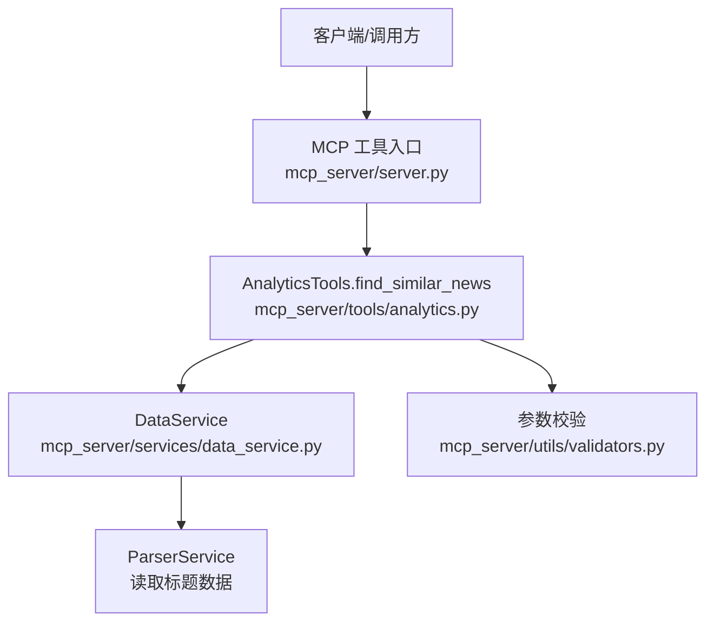
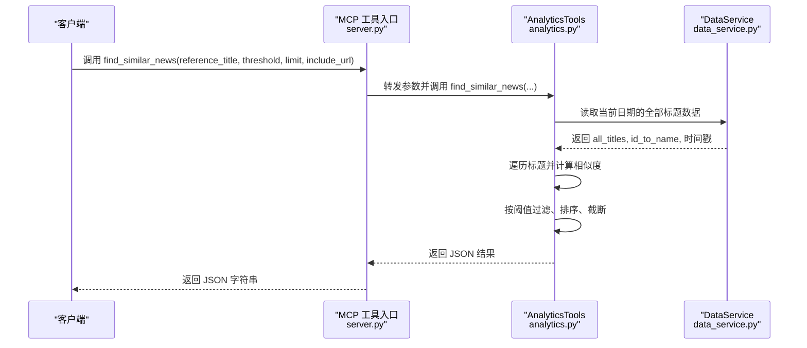
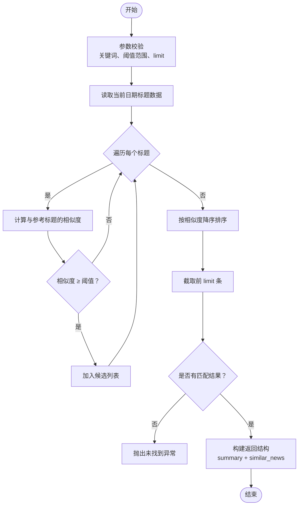
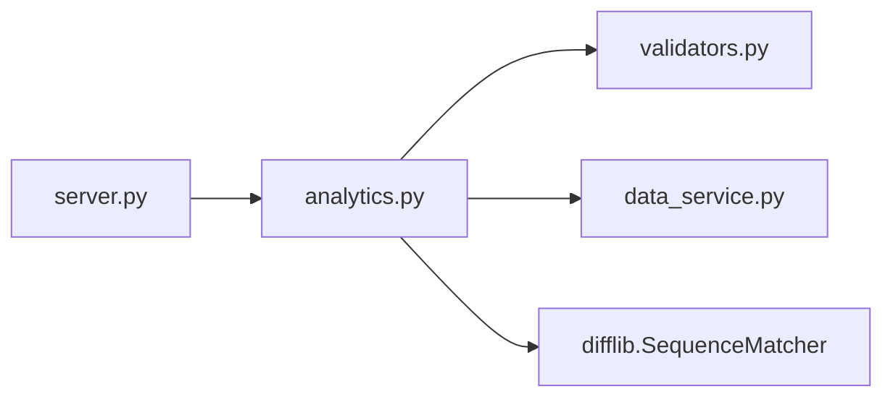

# find_similar_news 工具

<cite>
**本文引用的文件**
- [mcp_server/server.py](file://mcp_server/server.py)
- [mcp_server/tools/analytics.py](file://mcp_server/tools/analytics.py)
- [mcp_server/utils/validators.py](file://mcp_server/utils/validators.py)
- [mcp_server/services/data_service.py](file://mcp_server/services/data_service.py)
</cite>

## 目录
1. [简介](#简介)
2. [项目结构](#项目结构)
3. [核心组件](#核心组件)
4. [架构总览](#架构总览)
5. [详细组件分析](#详细组件分析)
6. [依赖关系分析](#依赖关系分析)
7. [性能考量](#性能考量)
8. [故障排查指南](#故障排查指南)
9. [结论](#结论)
10. [附录](#附录)

## 简介
find_similar_news 是一个用于在当前数据集中查找与指定新闻标题相似的其他新闻的工具。它基于标题相似度计算，返回与参考标题具有较高相似度的新闻列表，并附带相似度分数。该工具支持设置相似度阈值、返回数量上限、以及是否包含URL等选项，适用于追踪话题演变、发现关联报道、辅助交叉验证等场景。

## 项目结构
该工具位于 MCP 服务端的工具层，通过 HTTP/MCP 工具接口对外提供能力；内部由 AnalyticsTools 类实现具体逻辑，并依赖数据服务与参数校验模块。

图表来源
- [mcp_server/server.py](file://mcp_server/server.py#L400-L433)
- [mcp_server/tools/analytics.py](file://mcp_server/tools/analytics.py#L909-L1027)
- [mcp_server/utils/validators.py](file://mcp_server/utils/validators.py#L90-L121)
- [mcp_server/services/data_service.py](file://mcp_server/services/data_service.py#L1-L100)

章节来源
- [mcp_server/server.py](file://mcp_server/server.py#L400-L433)
- [mcp_server/tools/analytics.py](file://mcp_server/tools/analytics.py#L909-L1027)
- [mcp_server/utils/validators.py](file://mcp_server/utils/validators.py#L90-L121)
- [mcp_server/services/data_service.py](file://mcp_server/services/data_service.py#L1-L100)

## 核心组件
- MCP 工具入口：负责接收外部调用，解析参数，转发至 AnalyticsTools，并将结果以 JSON 形式返回。
- AnalyticsTools.find_similar_news：核心算法实现，读取当前数据集，计算标题相似度，按阈值过滤与排序，限制返回数量，并构造最终结果。
- 参数校验：对阈值、limit、关键词等参数进行合法性与范围校验。
- 数据服务：封装数据读取逻辑，提供标题集合与平台映射。

章节来源
- [mcp_server/server.py](file://mcp_server/server.py#L400-L433)
- [mcp_server/tools/analytics.py](file://mcp_server/tools/analytics.py#L909-L1027)
- [mcp_server/utils/validators.py](file://mcp_server/utils/validators.py#L90-L121)
- [mcp_server/services/data_service.py](file://mcp_server/services/data_service.py#L1-L100)

## 架构总览
下面的序列图展示了从客户端调用到返回结果的完整流程。

图表来源
- [mcp_server/server.py](file://mcp_server/server.py#L400-L433)
- [mcp_server/tools/analytics.py](file://mcp_server/tools/analytics.py#L909-L1027)
- [mcp_server/services/data_service.py](file://mcp_server/services/data_service.py#L1-L100)

## 详细组件分析

### 参数说明与行为
- reference_title（参考新闻标题）
  - 类型：字符串
  - 含义：作为“种子”标题，用于与当前数据集中的所有标题进行相似度比较
  - 行为：支持完整标题或部分标题；算法会忽略与参考标题完全相同的条目
- threshold（相似度阈值）
  - 类型：数值（0-1之间）
  - 含义：仅返回相似度不低于该阈值的新闻
  - 行为：阈值越高，匹配越严格，返回结果越少；工具会对阈值进行范围校验
- limit（返回条数限制）
  - 类型：整数，默认50，最大100
  - 含义：最多返回的新闻条数
  - 行为：实际返回数量可能小于请求值，取决于满足阈值条件的匹配数量
- include_url（是否包含URL）
  - 类型：布尔，默认False
  - 含义：控制是否在结果中包含URL字段以节省token
  - 行为：开启后会在每条新闻中附加URL信息

章节来源
- [mcp_server/server.py](file://mcp_server/server.py#L400-L433)
- [mcp_server/tools/analytics.py](file://mcp_server/tools/analytics.py#L909-L1027)
- [mcp_server/utils/validators.py](file://mcp_server/utils/validators.py#L90-L121)

### 相似度计算与匹配流程
- 相似度计算
  - 使用 SequenceMatcher 计算两个标题的相似度，返回0-1之间的分数
- 匹配与过滤
  - 遍历当前数据集中的所有标题
  - 跳过与参考标题完全相同的条目
  - 仅保留相似度不低于阈值的条目
- 排序与截断
  - 按相似度降序排序
  - 截取前 limit 条作为最终结果
- 结果构造
  - 返回包含 success、summary、similar_news 的结构
  - summary 中包含 total_found、returned_count、requested_limit、threshold、reference_title 等统计信息
  - similar_news 中每条记录包含 title、platform、platform_name、similarity、rank 等字段
  - 若 include_url 为真，则追加 url 字段

图表来源
- [mcp_server/tools/analytics.py](file://mcp_server/tools/analytics.py#L909-L1027)
- [mcp_server/utils/validators.py](file://mcp_server/utils/validators.py#L90-L121)

章节来源
- [mcp_server/tools/analytics.py](file://mcp_server/tools/analytics.py#L909-L1027)
- [mcp_server/utils/validators.py](file://mcp_server/utils/validators.py#L90-L121)

### 返回结构说明
- 成功响应
  - success: true
  - summary:
    - total_found: 满足阈值条件的总数
    - returned_count: 实际返回数量
    - requested_limit: 请求的limit
    - threshold: 使用的阈值
    - reference_title: 参考标题
  - similar_news: 数组，元素为字典，包含
    - title: 新闻标题
    - platform: 平台ID
    - platform_name: 平台名称
    - similarity: 相似度分数（保留三位小数）
    - rank: 首个排名（若存在）
    - url: 当 include_url 为真时包含
- 失败响应
  - success: false
  - error: 错误码与消息（如参数非法、数据缺失等）

章节来源
- [mcp_server/tools/analytics.py](file://mcp_server/tools/analytics.py#L909-L1027)

### 调用示例
- 查找与“AI大模型突破”相似的新闻
  - 参考调用路径：[mcp_server/server.py](file://mcp_server/server.py#L400-L433)
  - 参数建议：threshold 可从 0.6 开始尝试；limit 可根据需要调整；include_url 可按需开启
  - 返回结构：参见“返回结构说明”

章节来源
- [mcp_server/server.py](file://mcp_server/server.py#L400-L433)
- [mcp_server/tools/analytics.py](file://mcp_server/tools/analytics.py#L909-L1027)

### 数据展示策略
- 默认展示：工具返回完整的相似新闻列表（包含相似度分数）
- 仅在用户明确要求“总结”或“挑重点”时才进行筛选
- 该策略有助于用户全面了解相似度分布与潜在关联，便于进一步人工判断

章节来源
- [mcp_server/server.py](file://mcp_server/server.py#L400-L433)

### 应用价值
- 追踪话题演变：通过相似度排序，快速定位与参考标题高度相关的后续报道或变体表述
- 发现关联报道：在参考标题基础上，发现不同平台、不同表达方式的同类新闻
- 辅助交叉验证：结合相似度分数与平台信息，评估不同来源的报道一致性与覆盖面

## 依赖关系分析
- MCP 工具入口依赖 AnalyticsTools
- AnalyticsTools 依赖 DataService 读取标题数据
- AnalyticsTools 依赖参数校验模块进行阈值、limit、关键词等校验
- 相似度计算依赖 difflib.SequenceMatcher

图表来源
- [mcp_server/server.py](file://mcp_server/server.py#L400-L433)
- [mcp_server/tools/analytics.py](file://mcp_server/tools/analytics.py#L909-L1027)
- [mcp_server/utils/validators.py](file://mcp_server/utils/validators.py#L90-L121)
- [mcp_server/services/data_service.py](file://mcp_server/services/data_service.py#L1-L100)

章节来源
- [mcp_server/server.py](file://mcp_server/server.py#L400-L433)
- [mcp_server/tools/analytics.py](file://mcp_server/tools/analytics.py#L909-L1027)
- [mcp_server/utils/validators.py](file://mcp_server/utils/validators.py#L90-L121)
- [mcp_server/services/data_service.py](file://mcp_server/services/data_service.py#L1-L100)

## 性能考量
- 时间复杂度：O(N^2)，其中 N 为当前数据集中的标题数量（双重循环遍历）
- 空间复杂度：O(N)，用于存储候选结果
- 优化建议
  - 合理设置 threshold 与 limit，减少不必要的计算与传输
  - 仅在必要时开启 include_url，避免额外字段带来的开销
  - 对于大规模数据，可在上游做预过滤（如按平台或日期分区）

[本节为通用性能讨论，不直接分析具体文件]

## 故障排查指南
- 参数非法
  - 阈值不在 0-1 范围内：抛出 InvalidParameterError
  - limit 非法或超出上限：抛出 InvalidParameterError
  - 关键词为空或过长：抛出 InvalidParameterError
- 未找到匹配
  - 当满足阈值条件的新闻数量为0时，抛出 DataNotFoundError
  - 建议：适当降低阈值或更换参考标题
- 内部错误
  - 捕获异常并返回包含错误码与消息的结构

章节来源
- [mcp_server/tools/analytics.py](file://mcp_server/tools/analytics.py#L909-L1027)
- [mcp_server/utils/validators.py](file://mcp_server/utils/validators.py#L90-L121)

## 结论
find_similar_news 工具通过标题相似度计算，为用户提供了一种高效、可控的相似新闻检索能力。其参数设计清晰、返回结构完整，配合默认全量展示策略，能够帮助用户在追踪话题演变与发现关联报道方面获得高质量的辅助信息。建议在实际使用中根据业务需求合理设置阈值与返回数量，并按需开启 URL 字段。

[本节为总结性内容，不直接分析具体文件]

## 附录

### API 定义
- 工具名称：find_similar_news
- 入口：MCP 工具入口
- 参数
  - reference_title: 字符串，必填
  - threshold: 数值（0-1），默认0.6
  - limit: 整数，默认50，最大100
  - include_url: 布尔，默认False
- 返回
  - JSON 结构，包含 success、summary、similar_news 或 error

章节来源
- [mcp_server/server.py](file://mcp_server/server.py#L400-L433)
- [mcp_server/tools/analytics.py](file://mcp_server/tools/analytics.py#L909-L1027)