# generate_summary_report 工具

<cite>
**本文引用的文件**
- [mcp_server/server.py](file://mcp_server/server.py)
- [mcp_server/tools/analytics.py](file://mcp_server/tools/analytics.py)
- [mcp_server/utils/validators.py](file://mcp_server/utils/validators.py)
- [mcp_server/utils/date_parser.py](file://mcp_server/utils/date_parser.py)
- [config/config.yaml](file://config/config.yaml)
- [README.md](file://README.md)
- [README-EN.md](file://README-EN.md)
- [docker/entrypoint.sh](file://docker/entrypoint.sh)
- [docker/manage.py](file://docker/manage.py)
</cite>

## 目录
1. [简介](#简介)
2. [项目结构](#项目结构)
3. [核心组件](#核心组件)
4. [架构总览](#架构总览)
5. [详细组件分析](#详细组件分析)
6. [依赖关系分析](#依赖关系分析)
7. [性能考量](#性能考量)
8. [故障排查指南](#故障排查指南)
9. [结论](#结论)
10. [附录](#附录)

## 简介
本文件面向“generate_summary_report”工具，系统化说明其功能定位、参数规范、返回结构、调用流程与集成方式，并阐述其与系统定时任务的关系及在热点趋势回顾中的应用价值。该工具支持两类报告类型：daily（每日摘要）与 weekly（每周摘要），并可结合可选的 date_range 参数生成自定义日期范围内的结构化 Markdown 报告，便于阅读与分享。

## 项目结构
- MCP 服务入口提供 generate_summary_report 工具接口，负责参数校验与结果序列化。
- Analytics 工具实现具体的数据采集、统计与 Markdown 报告生成逻辑。
- 日期范围校验与解析由 validators 与 date_parser 模块共同完成。
- 定时任务与运行模式由 Docker 容器脚本与管理脚本控制，便于自动化周期性生成报告。

```mermaid
graph TB
Client["客户端/调用方"] --> MCP["MCP 服务入口<br/>mcp_server/server.py"]
MCP --> Tools["Analytics 工具<br/>mcp_server/tools/analytics.py"]
Tools --> Validators["日期范围校验<br/>mcp_server/utils/validators.py"]
Tools --> DateParser["日期解析器<br/>mcp_server/utils/date_parser.py"]
Tools --> Config["系统配置<br/>config/config.yaml"]
MCP --> Output["JSON 结果含 Markdown"]
```

图表来源
- [mcp_server/server.py](file://mcp_server/server.py#L436-L460)
- [mcp_server/tools/analytics.py](file://mcp_server/tools/analytics.py#L1157-L1356)
- [mcp_server/utils/validators.py](file://mcp_server/utils/validators.py#L144-L208)
- [mcp_server/utils/date_parser.py](file://mcp_server/utils/date_parser.py#L330-L424)
- [config/config.yaml](file://config/config.yaml#L1-L187)

章节来源
- [mcp_server/server.py](file://mcp_server/server.py#L436-L460)
- [mcp_server/tools/analytics.py](file://mcp_server/tools/analytics.py#L1157-L1356)
- [mcp_server/utils/validators.py](file://mcp_server/utils/validators.py#L144-L208)
- [mcp_server/utils/date_parser.py](file://mcp_server/utils/date_parser.py#L330-L424)
- [config/config.yaml](file://config/config.yaml#L1-L187)

## 核心组件
- MCP 服务入口：提供 generate_summary_report 工具接口，接收 report_type 与 date_range，调用 Analytics 工具并返回 JSON。
- Analytics 工具：根据 report_type 与 date_range 生成摘要报告，构建包含统计数据与 Markdown 内容的结构化 JSON。
- 日期范围校验：validate_date_range 负责校验对象格式、字段完整性、起止先后关系与未来日期限制。
- 日期解析器：resolve_date_range_expression 支持“本周”、“最近7天”等自然语言表达式解析为标准日期范围，便于前端/调用方快速生成 date_range。
- 定时任务与运行模式：通过 Docker 入口脚本与管理脚本，支持 cron 定时执行与 Web 服务器模式，便于周期性生成报告。

章节来源
- [mcp_server/server.py](file://mcp_server/server.py#L436-L460)
- [mcp_server/tools/analytics.py](file://mcp_server/tools/analytics.py#L1157-L1356)
- [mcp_server/utils/validators.py](file://mcp_server/utils/validators.py#L144-L208)
- [mcp_server/utils/date_parser.py](file://mcp_server/utils/date_parser.py#L330-L424)
- [docker/entrypoint.sh](file://docker/entrypoint.sh#L1-L50)
- [docker/manage.py](file://docker/manage.py#L46-L124)

## 架构总览
下图展示了 generate_summary_report 的端到端调用链路与关键交互点。

图表来源
- [mcp_server/server.py](file://mcp_server/server.py#L436-L460)
- [mcp_server/tools/analytics.py](file://mcp_server/tools/analytics.py#L1157-L1356)
- [mcp_server/utils/validators.py](file://mcp_server/utils/validators.py#L144-L208)
- [mcp_server/utils/date_parser.py](file://mcp_server/utils/date_parser.py#L330-L424)

## 详细组件分析

### 参数与调用规范
- report_type
  - 取值：daily 或 weekly
  - 语义：决定报告粒度与日期范围推导策略
- date_range（可选）
  - 类型：对象
  - 格式：{"start": "YYYY-MM-DD", "end": "YYYY-MM-DD"}
  - 约束：
    - 必须包含 start 与 end 字段
    - start ≤ end
    - 不允许查询未来日期（当前日期为基准）
  - 用途：当未提供时，daily 默认当天，weekly 默认最近7天

章节来源
- [mcp_server/server.py](file://mcp_server/server.py#L436-L460)
- [mcp_server/tools/analytics.py](file://mcp_server/tools/analytics.py#L1157-L1214)
- [mcp_server/utils/validators.py](file://mcp_server/utils/validators.py#L144-L208)

### 返回结构（JSON）
- 字段说明
  - success: 布尔，表示生成是否成功
  - report_type: 字符串，与输入一致
  - date_range: 对象，包含 start 与 end
  - markdown_report: 字符串，Markdown 格式的摘要报告正文
  - statistics: 对象，包含以下统计指标
    - total_news: 整数，总新闻数
    - platforms_count: 整数，覆盖平台数
    - keywords_count: 整数，热门关键词数
    - top_keyword: 二元组或 null，最热关键词及其出现次数

章节来源
- [mcp_server/tools/analytics.py](file://mcp_server/tools/analytics.py#L1307-L1335)

### 报告内容结构（Markdown）
- 标题与时间
  - 报告标题：每日/每周新闻热点摘要
  - 报告日期：按 report_type 展示单日或日期区间
  - 生成时间：当前时间
- 数据概览
  - 总新闻数、覆盖平台、热门关键词数
- 热门话题
  - TOP 10 热门关键词（按出现频次）
- 平台活跃度
  - 各平台新闻数量（降序）
- 趋势分析（weekly）
  - 对本周持续热门话题的简要分析
- 精选新闻样本
  - 基于关键词权重的确定性选取（前5条），确保相同输入返回稳定结果

章节来源
- [mcp_server/tools/analytics.py](file://mcp_server/tools/analytics.py#L1236-L1306)

### 调用示例
- 生成本周的每日摘要报告
  - 步骤
    1) 使用 resolve_date_range_expression("本周") 获取标准日期范围
    2) 调用 generate_summary_report(report_type="daily", date_range={"start": "...", "end": "..."})
  - 说明
    - 若未提供 date_range，daily 将默认使用当天；weekly 将默认使用最近7天
- 生成自定义日期范围的周报
  - 调用 generate_summary_report(report_type="weekly", date_range={"start": "YYYY-MM-DD", "end": "YYYY-MM-DD"})

章节来源
- [mcp_server/server.py](file://mcp_server/server.py#L436-L460)
- [mcp_server/utils/date_parser.py](file://mcp_server/utils/date_parser.py#L330-L424)

### 与系统定时任务的关联
- Docker 容器模式
  - 通过 CRON_SCHEDULE 环境变量配置定时任务，入口脚本生成 crontab 并交由 supercronic 执行
  - 支持立即执行一次（IMMEDIATE_RUN）、Web 服务器模式（ENABLE_WEBSERVER）
- 定时频率建议
  - GitHub Actions 使用 UTC，需按北京时间反推
  - 建议频率不低于每小时，避免过于频繁触发
- 运行模式
  - cron 模式：按计划执行 trendradar 主程序
  - once 模式：单次执行

章节来源
- [docker/entrypoint.sh](file://docker/entrypoint.sh#L1-L50)
- [docker/manage.py](file://docker/manage.py#L46-L124)
- [README.md](file://README.md#L2696-L2747)
- [README-EN.md](file://README-EN.md#L2660-L2711)

## 依赖关系分析
- 组件耦合
  - MCP 服务入口仅负责参数透传与结果序列化，耦合度低
  - Analytics 工具内部依赖 validators 与 date_parser，但对外暴露简洁接口
- 外部依赖
  - 配置文件 config.yaml 影响系统行为（如平台列表、推送模式等）
  - 输出目录 output 用于存放报告与数据（与报告生成流程相关）

图表来源
- [mcp_server/server.py](file://mcp_server/server.py#L436-L460)
- [mcp_server/tools/analytics.py](file://mcp_server/tools/analytics.py#L1157-L1356)
- [mcp_server/utils/validators.py](file://mcp_server/utils/validators.py#L144-L208)
- [mcp_server/utils/date_parser.py](file://mcp_server/utils/date_parser.py#L330-L424)
- [config/config.yaml](file://config/config.yaml#L1-L187)

章节来源
- [mcp_server/server.py](file://mcp_server/server.py#L436-L460)
- [mcp_server/tools/analytics.py](file://mcp_server/tools/analytics.py#L1157-L1356)
- [mcp_server/utils/validators.py](file://mcp_server/utils/validators.py#L144-L208)
- [mcp_server/utils/date_parser.py](file://mcp_server/utils/date_parser.py#L330-L424)
- [config/config.yaml](file://config/config.yaml#L1-L187)

## 性能考量
- 数据遍历
  - 按日遍历日期范围，逐日读取标题并统计关键词与平台分布，时间复杂度与总新闻数近似线性
- 确定性排序
  - 为保证相同输入返回稳定结果，采用权重排序并辅以标题字母顺序排序
- I/O 与存储
  - 读取 output 目录下的标题数据，建议合理设置数据保留策略，避免磁盘压力

[本节为通用指导，不直接分析具体文件]

## 故障排查指南
- 常见错误与处理
  - 日期范围格式错误：确认 date_range 为对象且包含 start/end 字段
  - 起止日期顺序错误：确保 start ≤ end
  - 查询未来日期：检查当前日期基准与可用数据范围提示
  - 报告为空：确认日期范围内是否存在数据，或调整 report_type 与 date_range
- 定时任务不执行
  - 检查 CRON_SCHEDULE 格式与时区设置
  - 确认容器 PID 1 为 supercronic，查看日志定位问题

章节来源
- [mcp_server/utils/validators.py](file://mcp_server/utils/validators.py#L144-L208)
- [docker/entrypoint.sh](file://docker/entrypoint.sh#L1-L50)
- [docker/manage.py](file://docker/manage.py#L127-L263)

## 结论
generate_summary_report 工具以简洁的接口实现了多维度数据分析与结构化 Markdown 报告生成，支持 daily 与 weekly 两种粒度，并可通过可选的 date_range 精准控制分析范围。结合系统定时任务，可实现周期性回顾热点趋势，满足日常运营与内容监测需求。建议在生产环境中配合合理的 cron 配置与数据保留策略，确保报告生成的稳定性与可维护性。

[本节为总结性内容，不直接分析具体文件]

## 附录

### 参数与返回字段速查
- 输入
  - report_type: daily | weekly
  - date_range: {"start": "YYYY-MM-DD", "end": "YYYY-MM-DD"}（可选）
- 输出
  - success: 布尔
  - report_type: 字符串
  - date_range: {"start": "YYYY-MM-DD", "end": "YYYY-MM-DD"}
  - markdown_report: 字符串（Markdown）
  - statistics: {total_news, platforms_count, keywords_count, top_keyword}

章节来源
- [mcp_server/server.py](file://mcp_server/server.py#L436-L460)
- [mcp_server/tools/analytics.py](file://mcp_server/tools/analytics.py#L1157-L1335)