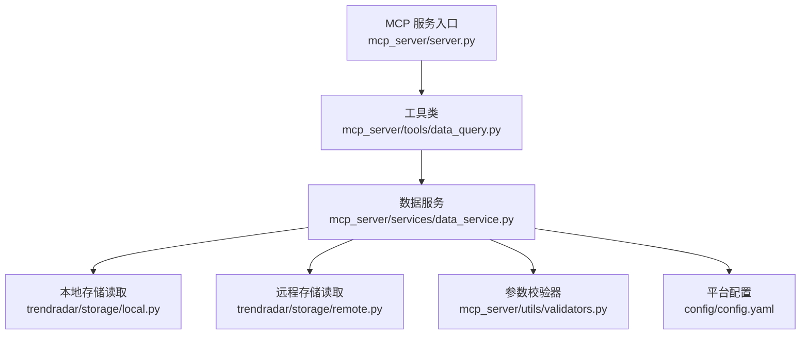
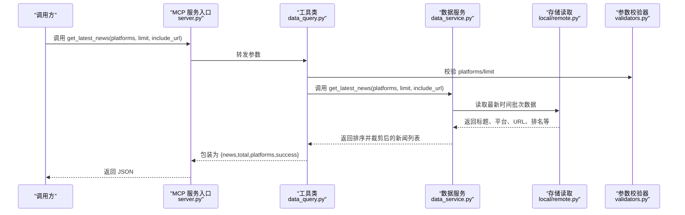
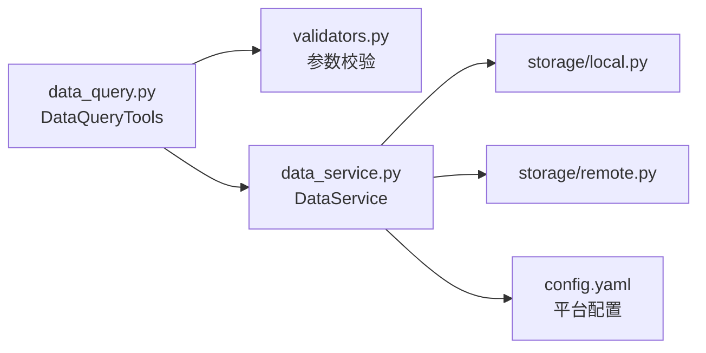

# get_latest_news 工具

<cite>
**本文引用的文件**
- [mcp_server/tools/data_query.py](file://mcp_server/tools/data_query.py)
- [mcp_server/services/data_service.py](file://mcp_server/services/data_service.py)
- [mcp_server/utils/validators.py](file://mcp_server/utils/validators.py)
- [mcp_server/server.py](file://mcp_server/server.py)
- [config/config.yaml](file://config/config.yaml)
- [trendradar/storage/local.py](file://trendradar/storage/local.py)
- [trendradar/storage/remote.py](file://trendradar/storage/remote.py)
</cite>

## 目录
1. [简介](#简介)
2. [项目结构](#项目结构)
3. [核心组件](#核心组件)
4. [架构总览](#架构总览)
5. [组件详解](#组件详解)
6. [依赖关系分析](#依赖关系分析)
7. [性能与缓存特性](#性能与缓存特性)
8. [故障排查指南](#故障排查指南)
9. [结论](#结论)
10. [附录](#附录)

## 简介
get_latest_news 是 P0 核心数据查询工具之一，用于快速获取“最新一批”爬取的新闻数据，帮助用户第一时间掌握当前热点。该工具支持：
- 指定平台过滤（如 ['zhihu','weibo','douyin']）
- 限制返回条数（默认50，最大1000）
- 可选包含 URL 链接（默认不包含，以节省 token）
- 返回完整 JSON 结构，便于前端/助手直接展示

此外，工具与系统爬虫频率密切相关：它读取“最新一次抓取时间”的数据，因此越接近爬虫完成一轮抓取，返回的热点越新鲜；若爬虫尚未抓取，返回数量可能为0。

## 项目结构
围绕 get_latest_news 的关键文件与职责如下：
- mcp_server/server.py：对外暴露的 MCP 工具入口，包含参数说明与展示建议
- mcp_server/tools/data_query.py：工具类 DataQueryTools 的实现，负责参数校验与调用数据服务
- mcp_server/services/data_service.py：DataService 的 get_latest_news 实现，负责从存储层读取最新数据、排序与裁剪
- mcp_server/utils/validators.py：参数校验器，包括平台列表、limit、日期等
- config/config.yaml：平台清单与系统配置，决定默认平台集合
- trendradar/storage/local.py 与 trendradar/storage/remote.py：底层存储读取最新时间批次的数据

图表来源
- [mcp_server/server.py](file://mcp_server/server.py#L120-L150)
- [mcp_server/tools/data_query.py](file://mcp_server/tools/data_query.py#L34-L89)
- [mcp_server/services/data_service.py](file://mcp_server/services/data_service.py#L30-L103)
- [mcp_server/utils/validators.py](file://mcp_server/utils/validators.py#L43-L121)
- [config/config.yaml](file://config/config.yaml#L163-L187)
- [trendradar/storage/local.py](file://trendradar/storage/local.py#L435-L456)
- [trendradar/storage/remote.py](file://trendradar/storage/remote.py#L631-L661)

章节来源
- [mcp_server/server.py](file://mcp_server/server.py#L120-L150)
- [mcp_server/tools/data_query.py](file://mcp_server/tools/data_query.py#L34-L89)
- [mcp_server/services/data_service.py](file://mcp_server/services/data_service.py#L30-L103)
- [mcp_server/utils/validators.py](file://mcp_server/utils/validators.py#L43-L121)
- [config/config.yaml](file://config/config.yaml#L163-L187)
- [trendradar/storage/local.py](file://trendradar/storage/local.py#L435-L456)
- [trendradar/storage/remote.py](file://trendradar/storage/remote.py#L631-L661)

## 核心组件
- DataQueryTools.get_latest_news：对外参数入口，负责参数校验与调用数据服务，并包装返回结构
- DataService.get_latest_news：核心实现，读取最新时间批次的数据，按平台与排名排序，限制返回数量
- 参数校验器：validate_platforms、validate_limit 等，保证输入合法
- 平台配置：config/config.yaml 中的 platforms 列表决定默认平台集合

章节来源
- [mcp_server/tools/data_query.py](file://mcp_server/tools/data_query.py#L34-L89)
- [mcp_server/services/data_service.py](file://mcp_server/services/data_service.py#L30-L103)
- [mcp_server/utils/validators.py](file://mcp_server/utils/validators.py#L43-L121)
- [config/config.yaml](file://config/config.yaml#L163-L187)

## 架构总览
get_latest_news 的调用链路如下：

图表来源
- [mcp_server/server.py](file://mcp_server/server.py#L120-L150)
- [mcp_server/tools/data_query.py](file://mcp_server/tools/data_query.py#L34-L89)
- [mcp_server/services/data_service.py](file://mcp_server/services/data_service.py#L30-L103)
- [mcp_server/utils/validators.py](file://mcp_server/utils/validators.py#L43-L121)
- [trendradar/storage/local.py](file://trendradar/storage/local.py#L435-L456)
- [trendradar/storage/remote.py](file://trendradar/storage/remote.py#L631-L661)

## 组件详解

### 参数与行为说明
- platforms
  - 类型：可选字符串数组
  - 作用：限定查询的平台集合
  - 默认行为：不指定或传空列表时，使用 config.yaml 中配置的所有平台
  - 支持平台：来自 config/config.yaml 的 platforms 列表
- limit
  - 类型：整数
  - 默认值：50
  - 最大值：1000
  - 行为：返回最多 limit 条记录；实际返回可能少于 limit，取决于当前可用数据总量
- include_url
  - 类型：布尔
  - 默认值：False
  - 影响：是否包含 url 与 mobileUrl 字段（默认不包含以节省 token）

章节来源
- [mcp_server/server.py](file://mcp_server/server.py#L120-L150)
- [mcp_server/tools/data_query.py](file://mcp_server/tools/data_query.py#L34-L89)
- [mcp_server/utils/validators.py](file://mcp_server/utils/validators.py#L90-L121)
- [config/config.yaml](file://config/config.yaml#L163-L187)

### 返回结构
get_latest_news 返回的 JSON 字典包含以下字段：
- success：布尔，表示调用是否成功
- total：整数，实际返回的新闻条数
- platforms：字符串数组，本次查询使用的平台列表
- news：数组，每项为一条新闻，字段如下：
  - title：字符串，新闻标题
  - platform：字符串，平台ID（如 zhihu、weibo、douyin 等）
  - platform_name：字符串，平台中文名称（来自配置）
  - rank：整数，当前排名（越小越热）
  - timestamp：字符串，本次抓取时间（格式为“年-月-日 时:分:秒”）
  - url：字符串（可选），移动端链接（当 include_url=True 时）
  - mobileUrl：字符串（可选），移动端链接（当 include_url=True 时）

章节来源
- [mcp_server/tools/data_query.py](file://mcp_server/tools/data_query.py#L69-L89)
- [mcp_server/services/data_service.py](file://mcp_server/services/data_service.py#L78-L92)

### 数据来源与排序
- 数据来源：读取“最新一次抓取时间”的数据，按平台与标题聚合
- 排序规则：按 rank 升序排列（越小越热）
- 裁剪策略：取前 limit 条
- URL 字段：仅在 include_url=True 时附加

章节来源
- [mcp_server/services/data_service.py](file://mcp_server/services/data_service.py#L56-L103)

### 平台 ID 列表与默认行为
- 平台 ID 列表由 config/config.yaml 的 platforms 节点提供
- 不指定 platforms 或传空列表时，工具会使用该配置中的全部平台
- 参数校验器会验证传入的平台是否在配置中存在，若配置加载失败则允许通过（降级策略）

章节来源
- [config/config.yaml](file://config/config.yaml#L163-L187)
- [mcp_server/utils/validators.py](file://mcp_server/utils/validators.py#L43-L88)

### 调用示例
- 获取抖音和微博平台最新30条新闻且不包含 URL 的请求
  - platforms: ['douyin','weibo']
  - limit: 30
  - include_url: False
- 说明：该调用将返回包含 title、platform、platform_name、rank、timestamp 的新闻列表；若 include_url=True，还将包含 url 与 mobileUrl 字段

章节来源
- [mcp_server/server.py](file://mcp_server/server.py#L120-L150)
- [mcp_server/tools/data_query.py](file://mcp_server/tools/data_query.py#L34-L89)
- [mcp_server/services/data_service.py](file://mcp_server/services/data_service.py#L78-L92)

### 与系统爬虫频率的关系
- get_latest_news 读取“最新一次抓取时间”的数据，因此其返回的新鲜度与爬虫运行频率直接相关
- 若爬虫尚未完成本轮抓取，返回数量可能为0或不足预期
- 建议在爬虫完成后稍作等待再调用，以获得更完整的热点数据

章节来源
- [mcp_server/services/data_service.py](file://mcp_server/services/data_service.py#L56-L68)
- [trendradar/storage/local.py](file://trendradar/storage/local.py#L435-L456)
- [trendradar/storage/remote.py](file://trendradar/storage/remote.py#L631-L661)

### 数据展示建议
- 工具返回完整列表（默认约50条），建议默认向用户展示全部内容，除非用户明确要求总结
- 当用户询问“为什么只显示了部分”，说明他们需要完整数据，应引导其调整 limit 或取消总结

章节来源
- [mcp_server/server.py](file://mcp_server/server.py#L136-L147)

## 依赖关系分析
- 工具层依赖参数校验器，确保 platforms 与 limit 合法
- 数据服务层依赖存储读取模块，按最新抓取时间获取数据
- 存储读取模块依赖数据库 schema，查询最新时间批次的新闻项
- 平台配置来源于 config/config.yaml，影响默认平台集合与平台名称映射

图表来源
- [mcp_server/tools/data_query.py](file://mcp_server/tools/data_query.py#L34-L89)
- [mcp_server/utils/validators.py](file://mcp_server/utils/validators.py#L43-L121)
- [mcp_server/services/data_service.py](file://mcp_server/services/data_service.py#L30-L103)
- [config/config.yaml](file://config/config.yaml#L163-L187)
- [trendradar/storage/local.py](file://trendradar/storage/local.py#L435-L456)
- [trendradar/storage/remote.py](file://trendradar/storage/remote.py#L631-L661)

章节来源
- [mcp_server/tools/data_query.py](file://mcp_server/tools/data_query.py#L34-L89)
- [mcp_server/utils/validators.py](file://mcp_server/utils/validators.py#L43-L121)
- [mcp_server/services/data_service.py](file://mcp_server/services/data_service.py#L30-L103)
- [config/config.yaml](file://config/config.yaml#L163-L187)
- [trendradar/storage/local.py](file://trendradar/storage/local.py#L435-L456)
- [trendradar/storage/remote.py](file://trendradar/storage/remote.py#L631-L661)

## 性能与缓存特性
- 缓存策略：DataService 在读取最新数据时使用缓存，键包含平台、limit、include_url 等维度，缓存 TTL 为 15 分钟
- 优点：减少重复读取，提升响应速度
- 注意：若频繁变更 include_url 或平台列表，建议等待缓存过期后再观察效果

章节来源
- [mcp_server/services/data_service.py](file://mcp_server/services/data_service.py#L50-L55)
- [mcp_server/services/data_service.py](file://mcp_server/services/data_service.py#L99-L102)

## 故障排查指南
- 参数错误
  - platforms 非列表或包含不支持的平台ID：校验器会抛出参数错误
  - limit 非正整数或超过最大值：校验器会抛出参数错误
- 数据为空
  - 当前可用数据总量不足 limit：返回数量可能小于请求值
  - 爬虫尚未抓取：返回数量可能为0
- URL 字段缺失
  - include_url 未设置为 True：不会包含 url 与 mobileUrl 字段
- 平台配置异常
  - config.yaml 加载失败：校验器允许通过（降级策略），可能导致平台校验失效

章节来源
- [mcp_server/utils/validators.py](file://mcp_server/utils/validators.py#L90-L121)
- [mcp_server/utils/validators.py](file://mcp_server/utils/validators.py#L43-L88)
- [mcp_server/services/data_service.py](file://mcp_server/services/data_service.py#L56-L103)

## 结论
get_latest_news 提供了快速了解当前热点的能力，具备灵活的平台过滤、数量限制与 URL 控制。结合系统爬虫频率与缓存机制，可在保证时效性的前提下获得稳定体验。建议在默认展示策略下优先呈现完整列表，尊重用户对完整数据的需求。

## 附录

### 参数与返回字段一览
- 输入参数
  - platforms: 可选字符串数组；默认使用 config.yaml 中配置的所有平台
  - limit: 可选整数；默认50；最大1000
  - include_url: 布尔；默认False
- 返回字段
  - success: 布尔
  - total: 整数
  - platforms: 字符串数组
  - news: 数组，每项包含 title、platform、platform_name、rank、timestamp、url（可选）、mobileUrl（可选）

章节来源
- [mcp_server/server.py](file://mcp_server/server.py#L120-L150)
- [mcp_server/tools/data_query.py](file://mcp_server/tools/data_query.py#L69-L89)
- [mcp_server/services/data_service.py](file://mcp_server/services/data_service.py#L78-L92)