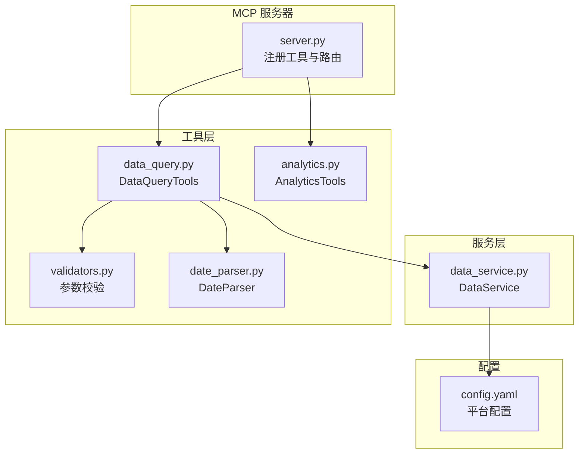
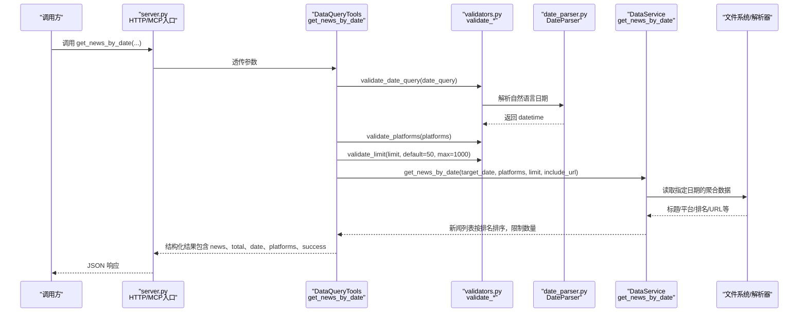
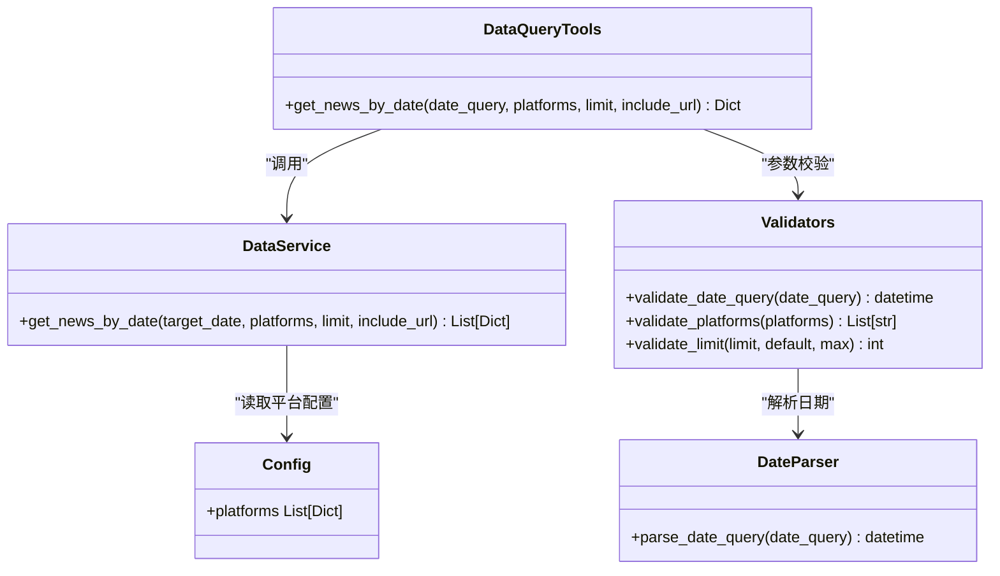

# get_news_by_date 工具

<cite>
**本文引用的文件**
- [data_query.py](file://mcp_server/tools/data_query.py)
- [data_service.py](file://mcp_server/services/data_service.py)
- [validators.py](file://mcp_server/utils/validators.py)
- [date_parser.py](file://mcp_server/utils/date_parser.py)
- [server.py](file://mcp_server/server.py)
- [config.yaml](file://config/config.yaml)
- [analytics.py](file://mcp_server/tools/analytics.py)
</cite>

## 目录
1. [简介](#简介)
2. [项目结构](#项目结构)
3. [核心组件](#核心组件)
4. [架构总览](#架构总览)
5. [详细组件分析](#详细组件分析)
6. [依赖关系分析](#依赖关系分析)
7. [性能考量](#性能考量)
8. [故障排查指南](#故障排查指南)
9. [结论](#结论)
10. [附录](#附录)

## 简介
本文件为 get_news_by_date 工具的详细文档，目标是帮助使用者准确理解并高效使用该工具，用于获取指定日期的历史新闻数据，支撑跨时间对比分析与趋势研究。文档覆盖以下要点：
- date_query 参数支持的格式与默认行为
- platforms 参数的使用方式与默认策略
- limit 参数的限制与 include_url 的作用
- 返回的 JSON 新闻列表结构
- 数据展示策略（与 get_latest_news 保持一致）
- 调用示例与最佳实践
- 与 analyze_topic_trend 等工具的协同使用

## 项目结构
get_news_by_date 属于 MCP 服务器的工具集合，位于 mcp_server/tools/data_query.py 中，通过 mcp_server/server.py 暴露为 HTTP/MCP 工具；其数据访问由 mcp_server/services/data_service.py 提供，参数校验由 mcp_server/utils/validators.py 与 mcp_server/utils/date_parser.py 负责。

图表来源
- [server.py](file://mcp_server/server.py#L178-L224)
- [data_query.py](file://mcp_server/tools/data_query.py#L211-L284)
- [data_service.py](file://mcp_server/services/data_service.py#L104-L182)
- [validators.py](file://mcp_server/utils/validators.py#L90-L121)
- [date_parser.py](file://mcp_server/utils/date_parser.py#L92-L248)
- [config.yaml](file://config/config.yaml#L164-L187)

章节来源
- [server.py](file://mcp_server/server.py#L178-L224)
- [data_query.py](file://mcp_server/tools/data_query.py#L211-L284)

## 核心组件
- DataQueryTools.get_news_by_date：对外暴露的工具函数，负责参数校验、调用数据服务并返回结构化结果。
- DataService.get_news_by_date：底层数据服务，按日期读取聚合数据，按平台与排名排序，支持 limit 与 include_url。
- validators.validate_date_query：将自然语言日期解析为 datetime，并进行未来日期与时间跨度限制校验。
- validators.validate_platforms：平台列表校验，支持默认使用 config.yaml 中配置的平台。
- validators.validate_limit：limit 参数校验，默认 50，最大 1000。
- config.yaml.platforms：平台 ID 列表，决定默认平台集合与支持的平台范围。

章节来源
- [data_query.py](file://mcp_server/tools/data_query.py#L211-L284)
- [data_service.py](file://mcp_server/services/data_service.py#L104-L182)
- [validators.py](file://mcp_server/utils/validators.py#L90-L121)
- [validators.py](file://mcp_server/utils/validators.py#L309-L351)
- [config.yaml](file://config/config.yaml#L164-L187)

## 架构总览
get_news_by_date 的调用链路如下：

图表来源
- [server.py](file://mcp_server/server.py#L178-L224)
- [data_query.py](file://mcp_server/tools/data_query.py#L211-L284)
- [validators.py](file://mcp_server/utils/validators.py#L309-L351)
- [date_parser.py](file://mcp_server/utils/date_parser.py#L92-L248)
- [data_service.py](file://mcp_server/services/data_service.py#L104-L182)

## 详细组件分析

### 参数说明与默认值
- date_query
  - 支持格式：自然语言（今天、昨天、3天前、yesterday、3 days ago、上周一、本周三、last monday、this friday 等）、标准日期（YYYY-MM-DD、MM月DD日、YYYY年MM月DD日、YYYY/MM/DD）。
  - 默认值：若未提供，使用“今天”。
  - 校验：validate_date_query 会解析并校验日期不得在未来，且不得超过最大允许天数（默认 365 天以内）。
- platforms
  - 支持传入平台 ID 列表，如 ['zhihu', 'weibo']。
  - 默认策略：若未提供或为空列表，使用 config.yaml 中配置的所有平台。
  - 校验：validate_platforms 会验证平台 ID 是否存在于 config.yaml 的 platforms 列表中。
- limit
  - 返回条数限制，默认 50，最大 1000。
  - 若请求值超过上限，将抛出参数错误。
- include_url
  - 是否包含 URL 字段（url、mobileUrl），默认 False（节省 token）。

章节来源
- [data_query.py](file://mcp_server/tools/data_query.py#L211-L284)
- [validators.py](file://mcp_server/utils/validators.py#L90-L121)
- [validators.py](file://mcp_server/utils/validators.py#L309-L351)
- [date_parser.py](file://mcp_server/utils/date_parser.py#L92-L248)
- [config.yaml](file://config/config.yaml#L164-L187)

### 返回的 JSON 新闻列表结构
get_news_by_date 返回的顶层字段包含：
- success：布尔值，表示调用是否成功。
- news：数组，每条新闻对象包含：
  - title：标题
  - platform：平台 ID
  - platform_name：平台名称（来自 config.yaml）
  - rank：该日期该平台该标题的初始排名
  - avg_rank：该标题在所有出现日期上的平均排名（保留两位小数）
  - count：该标题出现的总次数（等于出现的日期数）
  - date：查询的目标日期（YYYY-MM-DD）
  - url、mobileUrl：当 include_url=True 时包含
- total：返回的新闻条数
- date：目标日期（YYYY-MM-DD）
- date_query：原始 date_query 输入
- platforms：最终使用的平台列表
- error：当失败时包含错误信息（结构化）

注意：返回的 news 列表按 rank 升序排序，count 降序排序（内部实现细节）。

章节来源
- [data_service.py](file://mcp_server/services/data_service.py#L104-L182)
- [data_query.py](file://mcp_server/tools/data_query.py#L211-L284)

### 数据展示策略
- 与 get_latest_news 保持一致：工具返回完整的新闻列表（默认 50 条，受 limit 与实际数据总量约束），建议默认展示全部数据，除非用户明确要求总结或筛选。
- 当用户询问“为什么只显示了部分”，说明他们需要完整数据，应引导其增大 limit 或减少平台过滤。

章节来源
- [server.py](file://mcp_server/server.py#L178-L224)
- [data_query.py](file://mcp_server/tools/data_query.py#L211-L284)

### 调用示例
- 获取 2025-11-15 日百度和微博平台的最新 20 条新闻（默认按最新榜单排序，返回完整列表）：
  - 请求参数：date_query="2025-11-15"，platforms=["baidu","weibo"]，limit=20，include_url=false
  - 返回：news 数组包含 20 条新闻，total=20，date="2025-11-15"，platforms=["baidu","weibo"]

- 获取“昨天”的新闻（默认返回 50 条，受实际数据总量约束）：
  - 请求参数：date_query="昨天"，platforms=null（使用默认平台），limit=50，include_url=false
  - 返回：news 数组包含若干条新闻，total 为实际数量

- 获取“3天前”的新闻（支持自然语言）：
  - 请求参数：date_query="3天前"，platforms=["zhihu","douyin"]，limit=100，include_url=true
  - 返回：news 数组包含若干条新闻，包含 url、mobileUrl 字段

章节来源
- [data_query.py](file://mcp_server/tools/data_query.py#L211-L284)
- [data_service.py](file://mcp_server/services/data_service.py#L104-L182)

### 与趋势分析工具的协同使用
- 与 analyze_topic_trend 的关系：
  - get_news_by_date 用于获取某一天的历史新闻快照，适合进行“单日对比”或“固定日期对比”。
  - analyze_topic_trend 用于追踪某个关键词在一段时间内的热度变化，适合进行“时间序列趋势分析”。
- 协同建议：
  - 使用 get_news_by_date 获取某一天的完整新闻列表，再结合 analyze_topic_trend 对同一关键词在多日内的趋势进行分析。
  - 若需跨周/跨月对比，可先用 resolve_date_range 获取标准日期范围，再用 get_news_by_date 在多个日期点抓取数据，最后用 analyze_topic_trend 进行趋势拟合与预测。

章节来源
- [server.py](file://mcp_server/server.py#L227-L290)
- [analytics.py](file://mcp_server/tools/analytics.py#L243-L386)

## 依赖关系分析

图表来源
- [data_query.py](file://mcp_server/tools/data_query.py#L211-L284)
- [data_service.py](file://mcp_server/services/data_service.py#L104-L182)
- [validators.py](file://mcp_server/utils/validators.py#L90-L121)
- [validators.py](file://mcp_server/utils/validators.py#L309-L351)
- [date_parser.py](file://mcp_server/utils/date_parser.py#L92-L248)
- [config.yaml](file://config/config.yaml#L164-L187)

章节来源
- [data_query.py](file://mcp_server/tools/data_query.py#L211-L284)
- [data_service.py](file://mcp_server/services/data_service.py#L104-L182)
- [validators.py](file://mcp_server/utils/validators.py#L90-L121)
- [validators.py](file://mcp_server/utils/validators.py#L309-L351)
- [date_parser.py](file://mcp_server/utils/date_parser.py#L92-L248)
- [config.yaml](file://config/config.yaml#L164-L187)

## 性能考量
- 缓存策略：
  - get_news_by_date 在服务层对历史日期数据使用缓存（缓存键包含日期、平台、limit、include_url），可显著降低重复查询的延迟。
- 排序与限制：
  - 返回前按 rank 排序，再按 limit 截断，避免过多数据传输。
- include_url：
  - 默认关闭，可减少响应体积；如需链接，可显式开启。
- limit 与 max：
  - 默认 50，最大 1000，避免一次性返回过多数据导致性能与网络开销问题。

章节来源
- [data_service.py](file://mcp_server/services/data_service.py#L104-L182)
- [validators.py](file://mcp_server/utils/validators.py#L90-L121)

## 故障排查指南
- 日期格式错误
  - 现象：InvalidParameterError，提示日期格式不支持或无法识别。
  - 处理：确认 date_query 是否符合支持格式（自然语言或标准日期），必要时使用 resolve_date_range 获取标准日期范围。
- 未来日期查询
  - 现象：InvalidParameterError，提示不能查询未来日期。
  - 处理：使用“今天”、“昨天”等相对日期，或指定过去日期。
- 平台不支持
  - 现象：InvalidParameterError，提示不支持的平台 ID。
  - 处理：检查 config.yaml 中的 platforms 配置，确保平台 ID 存在。
- limit 超限
  - 现象：InvalidParameterError，提示 limit 不能超过最大值。
  - 处理：将 limit 调整为不超过 1000。
- 数据不存在
  - 现象：DataNotFoundError，提示未找到数据。
  - 处理：确认目标日期是否存在数据，或调整日期范围；可通过 list_available_dates 查看可用日期。

章节来源
- [validators.py](file://mcp_server/utils/validators.py#L145-L209)
- [validators.py](file://mcp_server/utils/validators.py#L309-L351)
- [server.py](file://mcp_server/server.py#L740-L781)

## 结论
get_news_by_date 工具提供了灵活、稳定的指定日期新闻查询能力，支持自然语言与标准日期输入、默认平台策略、严格的参数校验与缓存优化。其返回的完整新闻列表与一致的数据展示策略，使其非常适合用于跨时间对比分析与趋势研究。结合 analyze_topic_trend 等工具，可实现从“单日快照”到“时间序列趋势”的完整分析闭环。

## 附录

### 参数与默认值一览
- date_query：支持自然语言与标准日期，默认“今天”
- platforms：默认使用 config.yaml 中配置的所有平台
- limit：默认 50，最大 1000
- include_url：默认 false

章节来源
- [data_query.py](file://mcp_server/tools/data_query.py#L211-L284)
- [validators.py](file://mcp_server/utils/validators.py#L90-L121)
- [validators.py](file://mcp_server/utils/validators.py#L309-L351)
- [config.yaml](file://config/config.yaml#L164-L187)