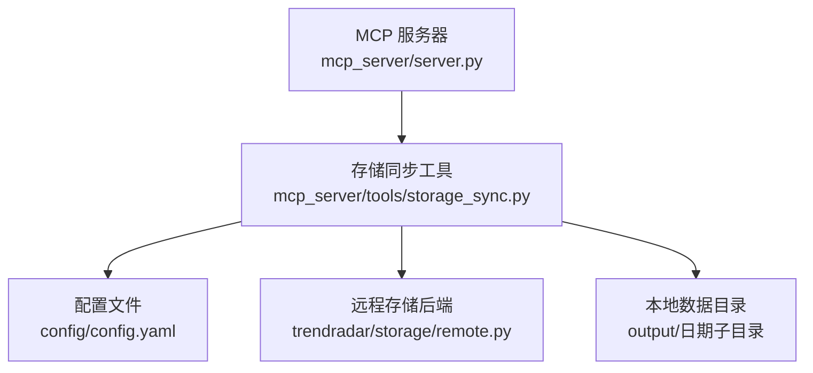
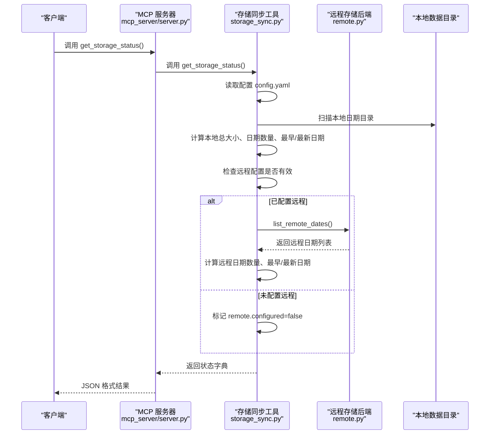
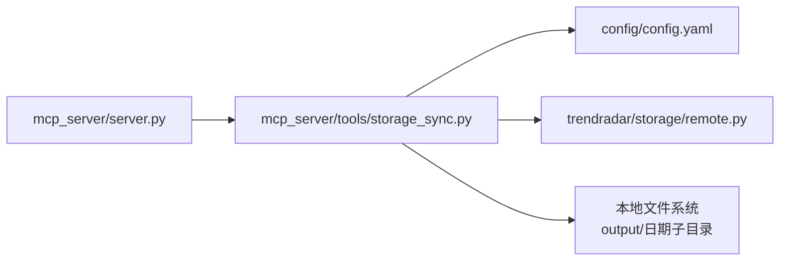

# get_storage_status 工具

<cite>
**本文引用的文件**
- [mcp_server/server.py](file://mcp_server/server.py)
- [mcp_server/tools/storage_sync.py](file://mcp_server/tools/storage_sync.py)
- [config/config.yaml](file://config/config.yaml)
- [trendradar/storage/remote.py](file://trendradar/storage/remote.py)
</cite>

## 目录
1. [简介](#简介)
2. [项目结构](#项目结构)
3. [核心组件](#核心组件)
4. [架构概览](#架构概览)
5. [详细组件分析](#详细组件分析)
6. [依赖关系分析](#依赖关系分析)
7. [性能考量](#性能考量)
8. [故障排查指南](#故障排查指南)
9. [结论](#结论)
10. [附录](#附录)

## 简介
get_storage_status 是一个用于获取当前存储配置与状态的工具，无需输入参数，返回全面的存储状态信息。它能够帮助用户快速了解：
- 当前使用的存储后端类型（local/remote/auto）
- 本地存储状态（数据目录、保留天数、总大小、日期数量、最早/最新日期等）
- 远程存储状态（是否已配置、服务端点、存储桶名称、远程日期数量等）
- 拉取配置（是否启用自动拉取、拉取天数）

该工具在理解当前存储架构、诊断存储问题、验证远程存储配置以及判断数据存储位置与同步设置是否正确方面具有核心价值。

## 项目结构
与 get_storage_status 相关的主要文件与职责如下：
- mcp_server/server.py：MCP 服务器入口，注册并暴露 get_storage_status 工具，负责将工具调用转发给具体实现，并将结果序列化为 JSON 返回。
- mcp_server/tools/storage_sync.py：存储同步与状态工具的具体实现，包含 get_storage_status 的完整逻辑。
- config/config.yaml：存储相关配置的来源，包括 backend、local、remote、pull 等字段。
- trendradar/storage/remote.py：远程存储后端实现，提供 list_remote_dates 等能力，供 get_storage_status 获取远程日期列表。

图表来源
- [mcp_server/server.py](file://mcp_server/server.py#L705-L737)
- [mcp_server/tools/storage_sync.py](file://mcp_server/tools/storage_sync.py#L289-L371)
- [config/config.yaml](file://config/config.yaml#L12-L52)
- [trendradar/storage/remote.py](file://trendradar/storage/remote.py#L1099-L1129)

章节来源
- [mcp_server/server.py](file://mcp_server/server.py#L705-L737)
- [mcp_server/tools/storage_sync.py](file://mcp_server/tools/storage_sync.py#L289-L371)
- [config/config.yaml](file://config/config.yaml#L12-L52)

## 核心组件
- MCP 工具函数：get_storage_status 在 mcp_server/server.py 中注册为工具，负责接收调用、调用工具实现并返回 JSON 结果。
- 存储状态工具：StorageSyncTools.get_storage_status 在 mcp_server/tools/storage_sync.py 中实现，负责读取配置、扫描本地目录、探测远程配置并获取远程日期列表，最终组装返回结构。
- 配置来源：config/config.yaml 提供 storage.backend、storage.local、storage.remote、storage.pull 等配置项。
- 远程后端：trendradar/storage/remote.py.RemoteStorageBackend 提供 list_remote_dates 能力，用于获取远程可用日期列表。

章节来源
- [mcp_server/server.py](file://mcp_server/server.py#L705-L737)
- [mcp_server/tools/storage_sync.py](file://mcp_server/tools/storage_sync.py#L289-L371)
- [config/config.yaml](file://config/config.yaml#L12-L52)
- [trendradar/storage/remote.py](file://trendradar/storage/remote.py#L1099-L1129)

## 架构概览
get_storage_status 的调用链路如下：
- 客户端调用 MCP 工具 get_storage_status
- MCP 服务器在 mcp_server/server.py 中定位工具并调用
- 工具实现位于 mcp_server/tools/storage_sync.py，读取配置、扫描本地目录、探测远程配置并调用远程后端
- 远程后端 trendradar/storage/remote.py 提供 list_remote_dates，用于统计远程日期数量
- 工具将结果封装为字典并通过 JSON 序列化返回

图表来源
- [mcp_server/server.py](file://mcp_server/server.py#L705-L737)
- [mcp_server/tools/storage_sync.py](file://mcp_server/tools/storage_sync.py#L289-L371)
- [trendradar/storage/remote.py](file://trendradar/storage/remote.py#L1099-L1129)

## 详细组件分析

### 工具函数与调用流程
- 注册与调用：get_storage_status 在 mcp_server/server.py 中被注册为工具，调用时直接返回 JSON 字符串。
- 实际实现：get_storage_status 调用 _get_tools()['storage']，委托给 StorageSyncTools.get_storage_status 完成具体逻辑。

章节来源
- [mcp_server/server.py](file://mcp_server/server.py#L705-L737)

### 存储状态工具实现
- 配置加载：从 config/config.yaml 读取 storage 配置，包括 backend、local、remote、pull。
- 本地状态采集：
  - 本地数据目录：根据 storage.local.data_dir 计算绝对路径。
  - 本地日期列表：扫描本地目录下的日期子目录，解析日期并排序。
  - 本地总大小：递归遍历目录统计字节数，并转换为 MB 字段。
  - 本地日期统计：date_count、earliest_date、latest_date。
- 远程状态采集：
  - 远程配置检查：合并 config.yaml 与环境变量（S3_ENDPOINT_URL、S3_BUCKET_NAME、S3_ACCESS_KEY_ID、S3_SECRET_ACCESS_KEY、S3_REGION），若满足必要字段则认为已配置。
  - 远程日期列表：通过 RemoteStorageBackend.list_remote_dates 获取远程可用日期列表，统计远程日期数量与最早/最新日期。
  - 错误处理：若远程后端初始化失败或 list_remote_dates 异常，将错误信息写入 remote.error。
- 拉取配置：
  - enabled：storage.pull.enabled
  - days：storage.pull.days

章节来源
- [mcp_server/tools/storage_sync.py](file://mcp_server/tools/storage_sync.py#L289-L371)
- [config/config.yaml](file://config/config.yaml#L12-L52)
- [trendradar/storage/remote.py](file://trendradar/storage/remote.py#L1099-L1129)

### 返回 JSON 结构说明
get_storage_status 返回的 JSON 包含以下关键字段：
- success：布尔值，表示状态获取是否成功
- backend：当前使用的后端类型（local/remote/auto）
- local：本地存储状态
  - data_dir：本地数据目录
  - retention_days：本地数据保留天数
  - total_size：本地总大小（MB 字符串）
  - total_size_bytes：本地总大小（字节整数）
  - date_count：本地日期数量
  - earliest_date：最早日期
  - latest_date：最新日期
- remote：远程存储状态
  - configured：是否已配置远程存储
  - endpoint_url：服务端点（脱敏显示）
  - bucket_name：存储桶名称（脱敏显示）
  - retention_days：远程数据保留天数
  - date_count：远程日期数量
  - earliest_date：远程最早日期
  - latest_date：远程最新日期
  - error：远程操作异常信息（如有）
- pull：拉取配置
  - enabled：是否启用自动拉取
  - days：自动拉取天数

章节来源
- [mcp_server/tools/storage_sync.py](file://mcp_server/tools/storage_sync.py#L289-L371)

### 调用示例与典型返回
- 调用示例
  - 在 MCP 客户端中调用工具：get_storage_status()
- 典型返回（示意）
  - success: true
  - backend: "auto"
  - local:
    - data_dir: "output"
    - retention_days: 0
    - total_size: "12.34 MB"
    - total_size_bytes: 12924672
    - date_count: 5
    - earliest_date: "2025-11-01"
    - latest_date: "2025-11-05"
  - remote:
    - configured: true
    - endpoint_url: "https://<account_id>.r2.cloudflarestorage.com"
    - bucket_name: "<bucket>"
    - retention_days: 0
    - date_count: 5
    - earliest_date: "2025-11-01"
    - latest_date: "2025-11-05"
  - pull:
    - enabled: false
    - days: 7

章节来源
- [mcp_server/server.py](file://mcp_server/server.py#L705-L737)
- [mcp_server/tools/storage_sync.py](file://mcp_server/tools/storage_sync.py#L289-L371)

### 如何通过该工具判断数据存储位置与同步设置是否正确
- 判断存储位置
  - 若 backend 为 local：数据存储在本地 output 目录；若为 remote：数据存储在远程对象存储；若为 auto：根据运行环境与配置自动选择。
  - 通过 local.data_dir 与 remote.endpoint_url/bucket_name 可确认实际存储位置。
- 判断同步设置
  - 若 pull.enabled 为 true，表示启动时会自动从远程拉取数据；days 决定拉取天数范围。
  - 通过 remote.configured 与 remote.date_count/earliest_date/latest_date 可判断远程数据是否可用且覆盖范围是否符合预期。
- 诊断问题
  - 若 remote.configured 为 false，说明远程配置缺失或不完整（缺少 endpoint_url、bucket_name、access_key_id、secret_access_key）。
  - 若 remote.error 存在，说明远程访问异常（网络、鉴权、权限等问题）。
  - 若 local.total_size_bytes 为 0 且 remote.date_count 也为 0，可能尚未采集或未配置。

章节来源
- [mcp_server/tools/storage_sync.py](file://mcp_server/tools/storage_sync.py#L289-L371)
- [config/config.yaml](file://config/config.yaml#L12-L52)

## 依赖关系分析
- 组件耦合
  - mcp_server/server.py 与 mcp_server/tools/storage_sync.py 通过工具注册与调用耦合。
  - StorageSyncTools.get_storage_status 依赖 config/config.yaml 的配置与本地文件系统。
  - StorageSyncTools.get_storage_status 依赖 RemoteStorageBackend.list_remote_dates 获取远程日期列表。
- 外部依赖
  - 远程存储后端依赖 boto3（S3 兼容 API），若未安装会在初始化时报错。
- 潜在循环依赖
  - 当前模块间无循环导入迹象。

图表来源
- [mcp_server/server.py](file://mcp_server/server.py#L705-L737)
- [mcp_server/tools/storage_sync.py](file://mcp_server/tools/storage_sync.py#L289-L371)
- [config/config.yaml](file://config/config.yaml#L12-L52)
- [trendradar/storage/remote.py](file://trendradar/storage/remote.py#L1099-L1129)

章节来源
- [mcp_server/server.py](file://mcp_server/server.py#L705-L737)
- [mcp_server/tools/storage_sync.py](file://mcp_server/tools/storage_sync.py#L289-L371)
- [trendradar/storage/remote.py](file://trendradar/storage/remote.py#L1099-L1129)

## 性能考量
- 本地扫描：get_storage_status 会递归遍历本地数据目录以统计大小与日期，目录规模较大时可能增加耗时。
- 远程枚举：list_remote_dates 使用分页列举远程对象，通常性能良好，但在对象数量巨大时仍会有一定开销。
- 建议
  - 控制本地数据目录规模，合理设置 retention_days 清理策略。
  - 优化远程存储命名空间，减少无关对象数量。

## 故障排查指南
- 远程未配置
  - 现象：remote.configured 为 false，或返回 error 字段提示未配置远程存储。
  - 处理：在 config/config.yaml 中完善 storage.remote 字段，或设置 S3_* 环境变量。
- 远程后端初始化失败
  - 现象：remote.error 包含初始化异常信息。
  - 处理：检查 boto3 是否安装、网络连通性、endpoint_url 与鉴权信息是否正确。
- 远程列举失败
  - 现象：remote.error 包含列举异常信息。
  - 处理：检查远程存储权限、桶名与前缀是否正确、网络策略。
- 本地目录为空
  - 现象：local.total_size_bytes 为 0，date_count 为 0。
  - 处理：确认 data_dir 是否正确、数据是否已采集、权限是否允许读取。

章节来源
- [mcp_server/tools/storage_sync.py](file://mcp_server/tools/storage_sync.py#L289-L371)
- [trendradar/storage/remote.py](file://trendradar/storage/remote.py#L1099-L1129)

## 结论
get_storage_status 工具提供了对当前存储配置与状态的全景视图，涵盖本地与远程存储的关键指标，并包含拉取配置信息。通过该工具，用户可以快速判断存储位置、验证远程配置、评估数据覆盖范围与同步设置，从而高效地进行存储架构的理解与问题诊断。

## 附录
- 配置参考
  - storage.backend：local/remote/auto
  - storage.local.data_dir：本地数据目录
  - storage.local.retention_days：本地保留天数
  - storage.remote.endpoint_url/bucket_name/access_key_id/secret_access_key/region：远程存储配置
  - storage.pull.enabled/days：自动拉取配置

章节来源
- [config/config.yaml](file://config/config.yaml#L12-L52)