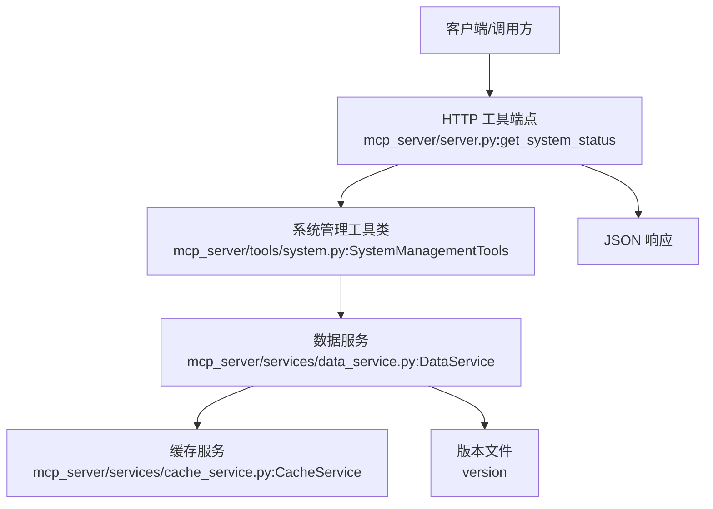
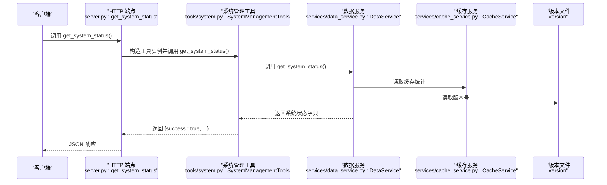
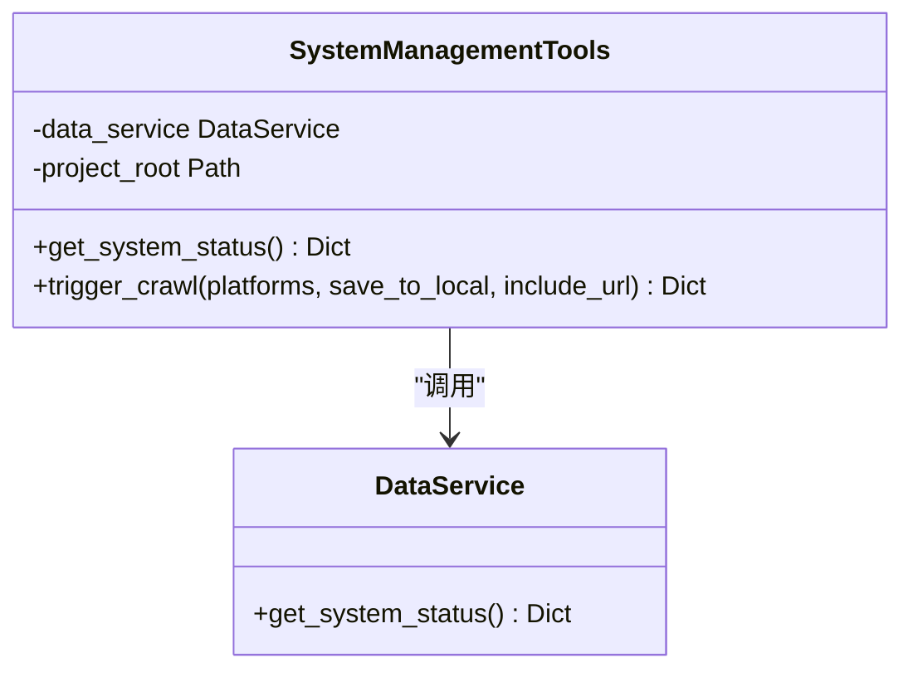
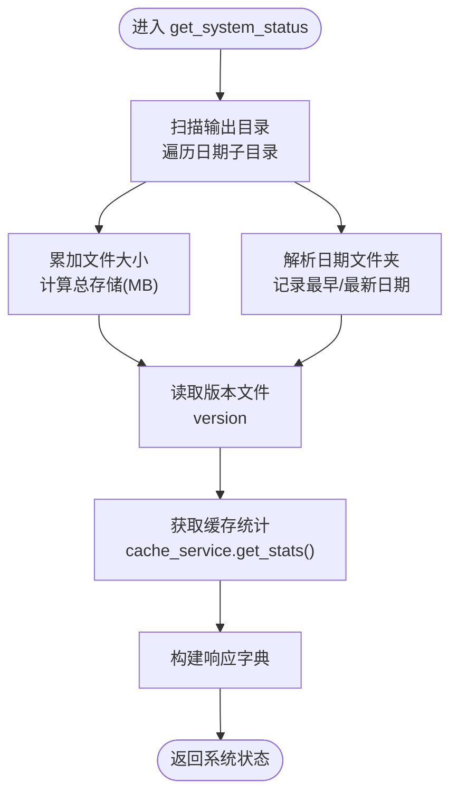
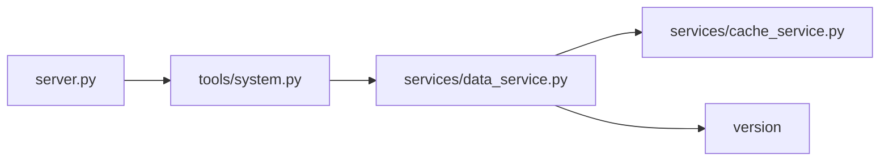

# get_system_status 工具

<cite>
**本文引用的文件**
- [mcp_server/tools/system.py](file://mcp_server/tools/system.py)
- [mcp_server/services/data_service.py](file://mcp_server/services/data_service.py)
- [mcp_server/services/cache_service.py](file://mcp_server/services/cache_service.py)
- [mcp_server/server.py](file://mcp_server/server.py)
- [version](file://version)
</cite>

## 目录
1. [简介](#简介)
2. [项目结构](#项目结构)
3. [核心组件](#核心组件)
4. [架构总览](#架构总览)
5. [详细组件分析](#详细组件分析)
6. [依赖关系分析](#依赖关系分析)
7. [性能与可靠性考量](#性能与可靠性考量)
8. [故障排查指南](#故障排查指南)
9. [结论](#结论)
10. [附录](#附录)

## 简介
本文件面向运维与开发人员，系统性地文档化 get_system_status 工具。该工具用于获取系统运行状态与健康检查信息，无需输入参数，直接返回结构化的 JSON 状态对象。其核心价值在于：
- 提供系统版本、数据统计（如总存储大小、最早/最新记录日期）、缓存状态、整体健康状态等关键指标；
- 作为监控与诊断的“第一现场”，帮助快速判断服务是否正常运行、爬虫是否按时更新、数据是否及时入库；
- 为自动化巡检与告警提供稳定、一致的健康度量来源。

## 项目结构
get_system_status 工具位于 MCP 服务层，通过 HTTP 工具端点暴露，内部委托系统管理工具类调用数据服务以聚合系统状态，并最终由服务端点序列化为 JSON 返回。

图表来源
- [mcp_server/server.py](file://mcp_server/server.py#L612-L624)
- [mcp_server/tools/system.py](file://mcp_server/tools/system.py#L33-L66)
- [mcp_server/services/data_service.py](file://mcp_server/services/data_service.py#L569-L624)
- [mcp_server/services/cache_service.py](file://mcp_server/services/cache_service.py#L101-L120)
- [version](file://version#L1-L1)

章节来源
- [mcp_server/server.py](file://mcp_server/server.py#L612-L624)
- [mcp_server/tools/system.py](file://mcp_server/tools/system.py#L33-L66)
- [mcp_server/services/data_service.py](file://mcp_server/services/data_service.py#L569-L624)

## 核心组件
- HTTP 工具端点：负责接收调用、构造工具实例、调用系统工具并返回 JSON。
- 系统管理工具类：封装 get_system_status 逻辑，负责调用数据服务并处理错误。
- 数据服务：聚合系统状态，包括系统版本、数据统计、缓存统计与健康状态。
- 缓存服务：提供缓存统计信息（条目数、最老/最新条目年龄）。
- 版本文件：提供系统版本号。

章节来源
- [mcp_server/server.py](file://mcp_server/server.py#L612-L624)
- [mcp_server/tools/system.py](file://mcp_server/tools/system.py#L33-L66)
- [mcp_server/services/data_service.py](file://mcp_server/services/data_service.py#L569-L624)
- [mcp_server/services/cache_service.py](file://mcp_server/services/cache_service.py#L101-L120)
- [version](file://version#L1-L1)

## 架构总览
下图展示 get_system_status 的调用链路与数据流向。

图表来源
- [mcp_server/server.py](file://mcp_server/server.py#L612-L624)
- [mcp_server/tools/system.py](file://mcp_server/tools/system.py#L33-L66)
- [mcp_server/services/data_service.py](file://mcp_server/services/data_service.py#L569-L624)
- [mcp_server/services/cache_service.py](file://mcp_server/services/cache_service.py#L101-L120)
- [version](file://version#L1-L1)

## 详细组件分析

### 系统管理工具类（SystemManagementTools）
- 职责：对外暴露 get_system_status 方法；内部委托数据服务获取系统状态，并统一包装返回结构。
- 错误处理：捕获自定义错误与通用异常，返回统一的错误结构，便于上层识别与处理。

图表来源
- [mcp_server/tools/system.py](file://mcp_server/tools/system.py#L15-L66)
- [mcp_server/services/data_service.py](file://mcp_server/services/data_service.py#L569-L624)

章节来源
- [mcp_server/tools/system.py](file://mcp_server/tools/system.py#L33-L66)

### 数据服务（DataService）
- 职责：聚合系统状态，包括：
  - system.version：系统版本号（来自版本文件）。
  - system.project_root：项目根目录路径。
  - data.total_storage：输出目录总存储大小（MB）。
  - data.oldest_record / data.latest_record：最早/最新记录日期。
  - cache：缓存统计（条目数、最老/最新条目年龄）。
  - health：整体健康状态字符串（如 healthy）。

图表来源
- [mcp_server/services/data_service.py](file://mcp_server/services/data_service.py#L569-L624)
- [mcp_server/services/cache_service.py](file://mcp_server/services/cache_service.py#L101-L120)
- [version](file://version#L1-L1)

章节来源
- [mcp_server/services/data_service.py](file://mcp_server/services/data_service.py#L569-L624)

### 缓存服务（CacheService）
- 职责：提供缓存统计信息，包括：
  - total_entries：当前缓存条目总数。
  - oldest_entry_age：最老条目的存活时长（秒）。
  - newest_entry_age：最新条目的存活时长（秒）。

章节来源
- [mcp_server/services/cache_service.py](file://mcp_server/services/cache_service.py#L101-L120)

### HTTP 工具端点（server.py）
- 职责：将系统状态结果序列化为 JSON 并返回给调用方。

章节来源
- [mcp_server/server.py](file://mcp_server/server.py#L612-L624)

## 依赖关系分析
- 工具层依赖数据服务，数据服务依赖缓存服务与版本文件。
- HTTP 端点依赖工具层，形成清晰的分层调用链。

图表来源
- [mcp_server/server.py](file://mcp_server/server.py#L612-L624)
- [mcp_server/tools/system.py](file://mcp_server/tools/system.py#L33-L66)
- [mcp_server/services/data_service.py](file://mcp_server/services/data_service.py#L569-L624)
- [mcp_server/services/cache_service.py](file://mcp_server/services/cache_service.py#L101-L120)
- [version](file://version#L1-L1)

章节来源
- [mcp_server/server.py](file://mcp_server/server.py#L612-L624)
- [mcp_server/tools/system.py](file://mcp_server/tools/system.py#L33-L66)
- [mcp_server/services/data_service.py](file://mcp_server/services/data_service.py#L569-L624)

## 性能与可靠性考量
- 缓存命中率：系统状态查询会读取缓存统计，若缓存命中良好，查询开销低；若缓存缺失或清理频繁，需关注缓存策略与 TTL。
- I/O 开销：数据统计涉及遍历输出目录，建议定期归档或清理历史数据，避免目录层级过深影响扫描性能。
- 版本读取：版本文件读取为轻量操作，通常对性能影响可忽略。
- 错误隔离：工具层对异常进行捕获与标准化，保证外部调用获得稳定的 JSON 结果。

[本节为通用指导，不直接分析具体文件]

## 故障排查指南
- 返回 success=false 且包含 error 字段：表示工具层捕获到异常。请根据错误码与消息定位问题（例如配置错误、权限问题、网络异常等）。
- health 字段非 healthy：结合 data 与 cache 指标综合判断，如缓存条目数异常、最老条目年龄过大等。
- total_storage 异常为 0 或远小于预期：检查输出目录是否存在、权限是否允许读取、是否被外部清理策略删除。
- version 为 unknown：确认版本文件是否存在且可读。
- 缓存统计异常：检查缓存服务是否初始化成功、是否被清理或并发竞争导致统计不准确。

章节来源
- [mcp_server/tools/system.py](file://mcp_server/tools/system.py#L45-L66)
- [mcp_server/services/data_service.py](file://mcp_server/services/data_service.py#L569-L624)
- [mcp_server/services/cache_service.py](file://mcp_server/services/cache_service.py#L101-L120)

## 结论
get_system_status 工具提供了系统健康度量的统一入口，涵盖版本、数据、缓存与健康状态等关键指标。通过该工具，运维与开发团队可以快速评估系统运行状况、定位问题并确认服务是否正常。建议将其纳入日常巡检与自动化监控流程，配合告警策略实现早期发现问题与快速恢复。

[本节为总结性内容，不直接分析具体文件]

## 附录

### 返回的 JSON 结构说明
- success: 布尔值，true 表示成功，false 表示失败。
- error: 当 success=false 时返回，包含 code 与 message，必要时包含建议 suggestion。
- system.version: 字符串，系统版本号（来自版本文件）。
- system.project_root: 字符串，项目根目录路径。
- data.total_storage: 字符串，输出目录总存储大小（单位 MB）。
- data.oldest_record: 字符串或 null，最早记录日期（YYYY-MM-DD）。
- data.latest_record: 字符串或 null，最新记录日期（YYYY-MM-DD）。
- cache.total_entries: 整数，缓存条目总数。
- cache.oldest_entry_age: 浮点数，最老条目存活时长（秒）。
- cache.newest_entry_age: 浮点数，最新条目存活时长（秒）。
- health: 字符串，整体健康状态（如 healthy）。

章节来源
- [mcp_server/services/data_service.py](file://mcp_server/services/data_service.py#L569-L624)
- [mcp_server/services/cache_service.py](file://mcp_server/services/cache_service.py#L101-L120)
- [version](file://version#L1-L1)

### 调用示例
- HTTP 工具端点调用：调用 GET /tools/get_system_status，返回 JSON。
- 代码级调用参考路径：
  - [mcp_server/server.py](file://mcp_server/server.py#L612-L624)
  - [mcp_server/tools/system.py](file://mcp_server/tools/system.py#L33-L66)

章节来源
- [mcp_server/server.py](file://mcp_server/server.py#L612-L624)
- [mcp_server/tools/system.py](file://mcp_server/tools/system.py#L33-L66)

### 如何判断爬虫是否正常工作或数据是否及时更新
- 观察 data.latest_record 与当前日期的差距，若长期未更新，可能存在爬取任务未执行或失败。
- 关注 cache.oldest_entry_age 与 newest_entry_age，若最老条目年龄异常增大，可能意味着缓存未及时刷新或数据未入库。
- 若 total_storage 长期不变，结合 latest_record 判断是否缺少新的数据写入。
- 出现 error 字段时，优先根据错误码与消息定位问题（如配置错误、权限不足、网络异常等）。

章节来源
- [mcp_server/services/data_service.py](file://mcp_server/services/data_service.py#L569-L624)
- [mcp_server/tools/system.py](file://mcp_server/tools/system.py#L45-L66)