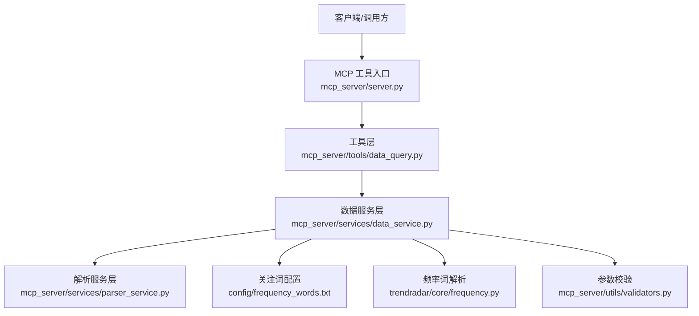
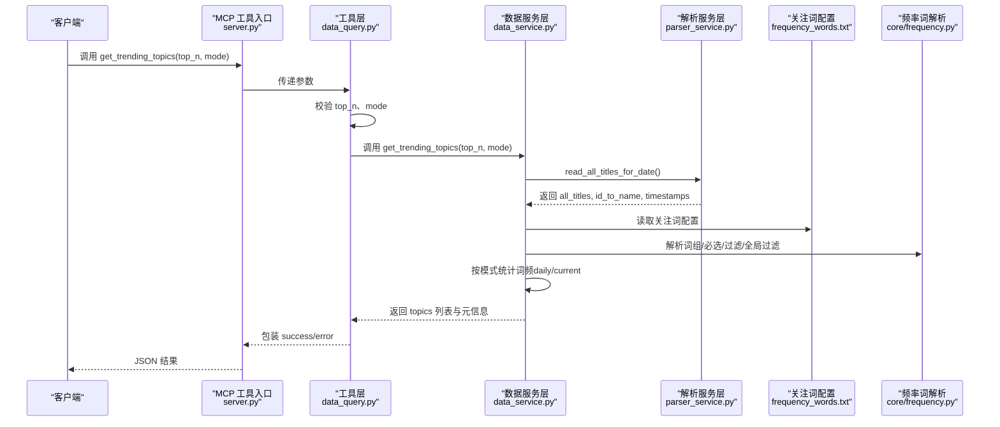
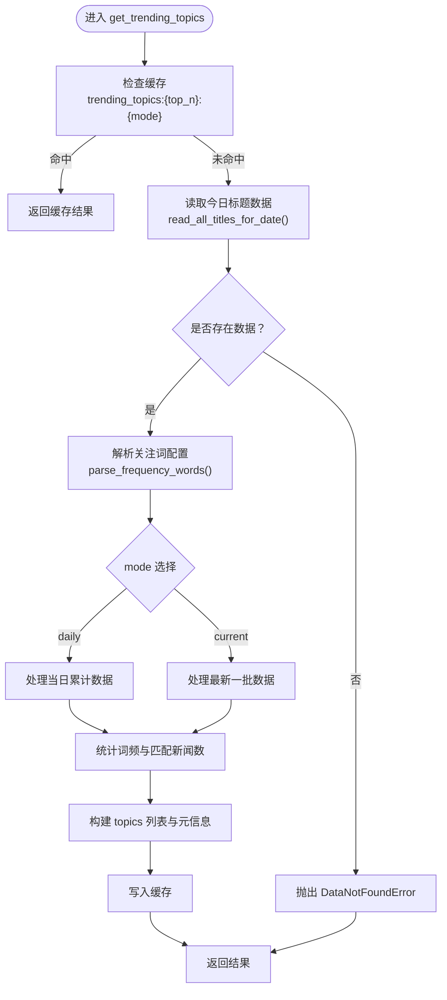
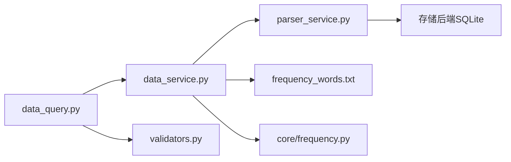

# get_trending_topics 工具

<cite>
**本文引用的文件**
- [mcp_server/server.py](file://mcp_server/server.py)
- [mcp_server/tools/data_query.py](file://mcp_server/tools/data_query.py)
- [mcp_server/services/data_service.py](file://mcp_server/services/data_service.py)
- [mcp_server/services/parser_service.py](file://mcp_server/services/parser_service.py)
- [mcp_server/utils/validators.py](file://mcp_server/utils/validators.py)
- [config/frequency_words.txt](file://config/frequency_words.txt)
- [trendradar/core/frequency.py](file://trendradar/core/frequency.py)
</cite>

## 目录
1. [简介](#简介)
2. [项目结构](#项目结构)
3. [核心组件](#核心组件)
4. [架构总览](#架构总览)
5. [详细组件分析](#详细组件分析)
6. [依赖关系分析](#依赖关系分析)
7. [性能考量](#性能考量)
8. [故障排查指南](#故障排查指南)
9. [结论](#结论)
10. [附录](#附录)

## 简介
本文件面向“get_trending_topics”工具，用于获取个人关注词的新闻出现频率统计。该工具严格基于配置文件 config/frequency_words.txt 中定义的个人关注词列表进行统计，而非自动从新闻中提取热点。它提供两个统计模式：
- daily：当日累计数据统计
- current：最新一批数据统计（默认）

工具支持通过 top_n 参数控制返回的 TOP N 关注词数量（默认 10）。返回的 JSON 结构包含关注词、出现频次、去重后的新闻数量等字段，并标注生成时间、模式说明等辅助信息，便于用户监控自定义关键词的热度变化。

## 项目结构
围绕 get_trending_topics 的关键文件与职责如下：
- mcp_server/server.py：MCP 工具入口，提供 get_trending_topics 接口，接收 top_n 与 mode 参数，调用工具层并返回 JSON。
- mcp_server/tools/data_query.py：工具层封装，负责参数校验（top_n、mode）、调用数据服务并包装返回结果。
- mcp_server/services/data_service.py：数据服务层，实现 get_trending_topics 的核心逻辑，包括缓存、读取标题数据、解析关注词配置、按模式统计词频、构建返回结果。
- mcp_server/services/parser_service.py：解析服务层，提供读取指定日期标题数据的能力（含缓存），并返回平台映射与时间戳信息。
- mcp_server/utils/validators.py：参数校验工具，提供 validate_top_n、validate_mode 等方法，保证输入合法。
- config/frequency_words.txt：个人关注词配置文件，定义词组、必选词、过滤词、全局过滤词等规则。
- trendradar/core/frequency.py：频率词配置加载与匹配逻辑，解析配置文件并提供匹配能力。

图表来源
- [mcp_server/server.py](file://mcp_server/server.py#L153-L176)
- [mcp_server/tools/data_query.py](file://mcp_server/tools/data_query.py#L170-L209)
- [mcp_server/services/data_service.py](file://mcp_server/services/data_service.py#L285-L401)
- [mcp_server/services/parser_service.py](file://mcp_server/services/parser_service.py#L461-L485)
- [mcp_server/utils/validators.py](file://mcp_server/utils/validators.py#L245-L289)
- [config/frequency_words.txt](file://config/frequency_words.txt#L1-L114)
- [trendradar/core/frequency.py](file://trendradar/core/frequency.py#L1-L195)

章节来源
- [mcp_server/server.py](file://mcp_server/server.py#L153-L176)
- [mcp_server/tools/data_query.py](file://mcp_server/tools/data_query.py#L170-L209)
- [mcp_server/services/data_service.py](file://mcp_server/services/data_service.py#L285-L401)
- [mcp_server/services/parser_service.py](file://mcp_server/services/parser_service.py#L461-L485)
- [mcp_server/utils/validators.py](file://mcp_server/utils/validators.py#L245-L289)
- [config/frequency_words.txt](file://config/frequency_words.txt#L1-L114)
- [trendradar/core/frequency.py](file://trendradar/core/frequency.py#L1-L195)

## 核心组件
- 工具入口（MCP）：提供 get_trending_topics(top_n=10, mode="current") 接口，负责参数透传与结果 JSON 序列化。
- 工具层（DataQueryTools）：对 top_n 与 mode 进行参数校验，调用数据服务并统一返回结构。
- 数据服务层（DataService）：核心统计逻辑，读取标题数据、解析关注词配置、按模式统计词频、构建 topics 列表并缓存。
- 解析服务层（ParserService）：提供 read_all_titles_for_date 能力，返回 all_titles、id_to_name、timestamps，支持缓存。
- 参数校验（Validators）：validate_top_n、validate_mode 等，限制 top_n 上限与 mode 合法性。
- 关注词配置（config/frequency_words.txt）：定义个人关注词列表，支持普通词、必选词（+前缀）、过滤词（!前缀）、全局过滤词等。
- 频率词解析（trendradar/core/frequency.py）：解析配置文件并提供匹配逻辑，供统计时使用。

章节来源
- [mcp_server/server.py](file://mcp_server/server.py#L153-L176)
- [mcp_server/tools/data_query.py](file://mcp_server/tools/data_query.py#L170-L209)
- [mcp_server/services/data_service.py](file://mcp_server/services/data_service.py#L285-L401)
- [mcp_server/services/parser_service.py](file://mcp_server/services/parser_service.py#L461-L485)
- [mcp_server/utils/validators.py](file://mcp_server/utils/validators.py#L245-L289)
- [config/frequency_words.txt](file://config/frequency_words.txt#L1-L114)
- [trendradar/core/frequency.py](file://trendradar/core/frequency.py#L1-L195)

## 架构总览
下面的序列图展示了从调用 get_trending_topics 到返回统计结果的完整流程。

图表来源
- [mcp_server/server.py](file://mcp_server/server.py#L153-L176)
- [mcp_server/tools/data_query.py](file://mcp_server/tools/data_query.py#L170-L209)
- [mcp_server/services/data_service.py](file://mcp_server/services/data_service.py#L285-L401)
- [mcp_server/services/parser_service.py](file://mcp_server/services/parser_service.py#L461-L485)
- [config/frequency_words.txt](file://config/frequency_words.txt#L1-L114)
- [trendradar/core/frequency.py](file://trendradar/core/frequency.py#L1-L195)

## 详细组件分析

### 参数与调用方式
- top_n：返回 TOP N 关注词，默认 10，上限 100。
- mode：统计模式
  - daily：当日累计数据统计
  - current：最新一批数据统计（默认）
- 返回结构要点（topics 列表中的每项包含）：
  - keyword：关注词
  - frequency：出现频次
  - matched_news：去重后的新闻数量
  - trend：趋势占位（预留）
  - weight_score：权重占位（预留）
  - generated_at：生成时间
  - mode：模式说明
  - total_keywords：总关注词数量
  - description：模式描述

章节来源
- [mcp_server/server.py](file://mcp_server/server.py#L153-L176)
- [mcp_server/tools/data_query.py](file://mcp_server/tools/data_query.py#L170-L209)
- [mcp_server/services/data_service.py](file://mcp_server/services/data_service.py#L285-L401)
- [mcp_server/utils/validators.py](file://mcp_server/utils/validators.py#L245-L289)

### 统计流程与模式说明
- daily 模式：遍历当天所有标题，统计关注词出现频次。
- current 模式：根据 timestamps 识别最新一批数据（基于最新时间戳），仅对该批标题进行统计。
- 缓存：以 trending_topics:{top_n}:{mode} 为键，缓存 30 分钟，避免重复计算。
- 错误处理：当未找到今日数据时抛出 DataNotFoundError；工具层捕获并返回统一的 error 结构。

图表来源
- [mcp_server/services/data_service.py](file://mcp_server/services/data_service.py#L285-L401)
- [mcp_server/services/parser_service.py](file://mcp_server/services/parser_service.py#L461-L485)

### 关注词配置与匹配规则
- 配置文件位置：config/frequency_words.txt
- 支持语法：
  - 普通词：直接写入，任意匹配即可
  - +词：必须词，所有必须词都要匹配
  - !词：过滤词，匹配则排除
  - @数字：该词组最多显示的条数（当前统计仍按出现频次排序，@数字主要用于展示层面）
- 全局过滤词：可通过 [GLOBAL_FILTER] 区域集中定义，优先级最高
- 词组解析与匹配：由 trendradar/core/frequency.py 完成，支持大小写不敏感匹配与组合规则

章节来源
- [config/frequency_words.txt](file://config/frequency_words.txt#L1-L114)
- [trendradar/core/frequency.py](file://trendradar/core/frequency.py#L1-L195)

### 与个性化热点算法的关系
- get_trending_topics 基于用户自定义的 config/frequency_words.txt 中的个人关注词进行统计，不涉及自动提取热点的算法。
- 个性化热点算法通常会从新闻中自动发现高频词或主题，而本工具仅统计用户已明确列出的关注词，因此：
  - 更适合“自定义监控”场景：用户希望聚焦自身关心的主题
  - 与自动热点算法互补：可先用本工具观察自定义词热度，再结合自动热点做交叉验证

章节来源
- [mcp_server/services/data_service.py](file://mcp_server/services/data_service.py#L285-L305)
- [config/frequency_words.txt](file://config/frequency_words.txt#L1-L114)

### 调用示例
- 获取当前模式下 TOP 15 关注词的频率统计：
  - 调用参数：top_n=15，mode="current"
  - 返回结构包含 topics 列表，每项包含 keyword、frequency、matched_news 等字段
- 获取当日累计统计：
  - 调用参数：top_n=10，mode="daily"

章节来源
- [mcp_server/server.py](file://mcp_server/server.py#L153-L176)
- [mcp_server/tools/data_query.py](file://mcp_server/tools/data_query.py#L170-L209)
- [mcp_server/services/data_service.py](file://mcp_server/services/data_service.py#L285-L401)

## 依赖关系分析
- 工具层依赖数据服务层与参数校验工具
- 数据服务层依赖解析服务层、关注词配置与频率词解析模块
- 解析服务层依赖存储后端（SQLite）读取标题数据
- 关注词配置与频率词解析模块相互配合，提供词组解析与匹配能力

图表来源
- [mcp_server/tools/data_query.py](file://mcp_server/tools/data_query.py#L170-L209)
- [mcp_server/services/data_service.py](file://mcp_server/services/data_service.py#L285-L401)
- [mcp_server/services/parser_service.py](file://mcp_server/services/parser_service.py#L461-L485)
- [mcp_server/utils/validators.py](file://mcp_server/utils/validators.py#L245-L289)
- [config/frequency_words.txt](file://config/frequency_words.txt#L1-L114)
- [trendradar/core/frequency.py](file://trendradar/core/frequency.py#L1-L195)

## 性能考量
- 缓存策略：按 top_n 与 mode 维度缓存 30 分钟，减少重复统计开销
- 数据读取：read_all_titles_for_date 支持缓存，避免频繁 IO
- 统计复杂度：遍历 all_titles 与 word_groups，时间复杂度近似 O(N×M)，其中 N 为标题数，M 为词组数
- 建议：
  - 合理设置 top_n，避免过大导致排序与序列化成本上升
  - 在高频调用场景下，利用缓存减少重复计算
  - 控制关注词组数量，避免过多词组导致匹配开销增大

章节来源
- [mcp_server/services/data_service.py](file://mcp_server/services/data_service.py#L306-L310)
- [mcp_server/services/parser_service.py](file://mcp_server/services/parser_service.py#L461-L485)

## 故障排查指南
- 未找到今日数据
  - 现象：抛出 DataNotFoundError，提示未找到今天的新闻数据
  - 处理：确认爬虫已运行并生成数据，或稍后再试
- 参数非法
  - top_n 超出范围或类型不正确：validate_top_n 抛出 InvalidParameterError
  - mode 非法：validate_mode 抛出 InvalidParameterError
- 工具层异常
  - MCPError：工具层捕获并返回统一 error 结构
  - 其他异常：返回 INTERNAL_ERROR

章节来源
- [mcp_server/services/data_service.py](file://mcp_server/services/data_service.py#L315-L319)
- [mcp_server/utils/validators.py](file://mcp_server/utils/validators.py#L245-L289)
- [mcp_server/tools/data_query.py](file://mcp_server/tools/data_query.py#L197-L209)

## 结论
get_trending_topics 工具通过 config/frequency_words.txt 定义的个人关注词，提供两种统计模式（daily/current）与 TOP N 控制，帮助用户监控自定义关键词的热度变化。其设计强调可配置性与可验证性：用户可随时调整关注词配置，工具返回的 JSON 结构清晰直观，便于进一步分析与集成。与自动热点算法互补，既满足个性化需求，又可作为关键词有效性验证的重要手段。

## 附录
- 关注词配置语法速览
  - 普通词：直接写入
  - +词：必须词（全部匹配才计入）
  - !词：过滤词（匹配则排除）
  - @数字：该词组最多显示条数（展示层面）
  - [GLOBAL_FILTER]：全局过滤词区域
- 调用建议
  - 日常监控：使用 current 模式，获取最新一批数据
  - 周期对比：使用 daily 模式，观察当日累计趋势
  - 关注词优化：定期评估关注词命中率与噪声，调整配置

章节来源
- [config/frequency_words.txt](file://config/frequency_words.txt#L1-L114)
- [trendradar/core/frequency.py](file://trendradar/core/frequency.py#L1-L195)