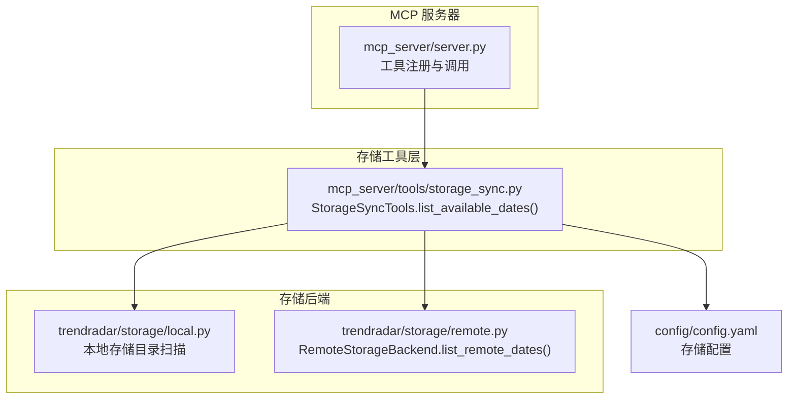
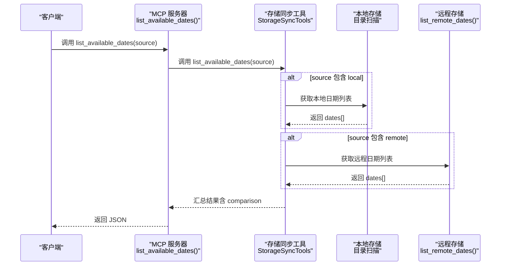
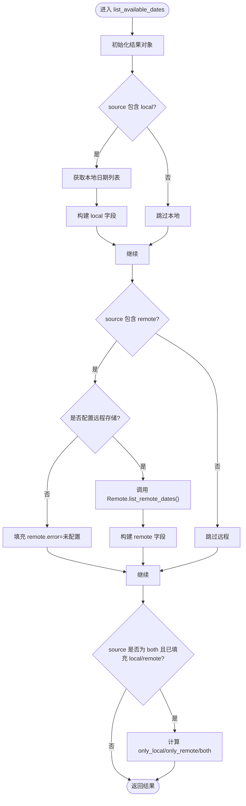
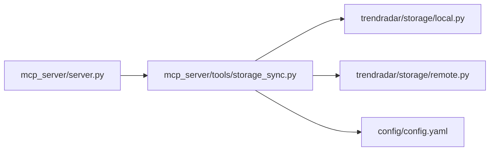

# list_available_dates 工具

<cite>
**本文引用的文件**
- [mcp_server/server.py](file://mcp_server/server.py)
- [mcp_server/tools/storage_sync.py](file://mcp_server/tools/storage_sync.py)
- [trendradar/storage/remote.py](file://trendradar/storage/remote.py)
- [config/config.yaml](file://config/config.yaml)
- [README.md](file://README.md)
- [README-MCP-FAQ.md](file://README-MCP-FAQ.md)
</cite>

## 目录
1. [简介](#简介)
2. [项目结构](#项目结构)
3. [核心组件](#核心组件)
4. [架构概览](#架构概览)
5. [详细组件分析](#详细组件分析)
6. [依赖关系分析](#依赖关系分析)
7. [性能考量](#性能考量)
8. [故障排查指南](#故障排查指南)
9. [结论](#结论)
10. [附录](#附录)

## 简介
list_available_dates 是一个用于列出本地与远程可用日期范围的工具，帮助用户了解数据覆盖范围、检查同步完整性，并规划分析时间范围。它支持三种查询模式：
- local：仅列出本地可用日期
- remote：仅列出远程可用日期
- both：同时列出本地与远程，并进行对比（默认）

在 both 模式下，工具还会返回 comparison 部分，包含 only_local、only_remote、both 三类日期集合，便于快速定位数据缺失或同步中断问题。

## 项目结构
该工具位于 MCP 服务器的工具层，通过统一的工具注册与调用接口对外提供服务；其内部依赖本地与远程存储后端以获取日期列表。

图表来源
- [mcp_server/server.py](file://mcp_server/server.py#L739-L780)
- [mcp_server/tools/storage_sync.py](file://mcp_server/tools/storage_sync.py#L373-L468)
- [trendradar/storage/remote.py](file://trendradar/storage/remote.py#L1100-L1129)
- [config/config.yaml](file://config/config.yaml#L13-L52)

章节来源
- [mcp_server/server.py](file://mcp_server/server.py#L739-L780)
- [mcp_server/tools/storage_sync.py](file://mcp_server/tools/storage_sync.py#L373-L468)
- [trendradar/storage/remote.py](file://trendradar/storage/remote.py#L1100-L1129)
- [config/config.yaml](file://config/config.yaml#L13-L52)

## 核心组件
- MCP 工具函数：list_available_dates（在服务器层注册，负责参数解析与结果序列化）
- 存储同步工具类：StorageSyncTools.list_available_dates（核心实现，负责本地与远程日期收集、对比）
- 远程存储后端：RemoteStorageBackend.list_remote_dates（列举远程 news/ 目录下的日期文件）

返回的 JSON 结构要点（both 模式）：
- local：包含 dates、count、earliest、latest
- remote：包含 configured、dates、count、earliest、latest（若未配置或异常则包含 error 字段）
- comparison：仅当 source="both" 时存在，包含 only_local、only_remote、both 三组日期集合

章节来源
- [mcp_server/server.py](file://mcp_server/server.py#L739-L780)
- [mcp_server/tools/storage_sync.py](file://mcp_server/tools/storage_sync.py#L373-L468)
- [trendradar/storage/remote.py](file://trendradar/storage/remote.py#L1100-L1129)

## 架构概览
工具调用链路如下：客户端调用 MCP 工具 -> 服务器层解析参数 -> 调用存储同步工具 -> 本地与远程后端分别返回日期列表 -> 汇总并返回 JSON。

图表来源
- [mcp_server/server.py](file://mcp_server/server.py#L739-L780)
- [mcp_server/tools/storage_sync.py](file://mcp_server/tools/storage_sync.py#L373-L468)
- [trendradar/storage/remote.py](file://trendradar/storage/remote.py#L1100-L1129)

## 详细组件分析

### 1) MCP 工具函数（服务器层）
- 功能：注册为 MCP 工具，接收 source 参数，调用存储同步工具并返回 JSON
- 参数：
  - source：可选值 "local"、"remote"、"both"（默认 both）
- 返回：JSON 字符串，包含 local/remote/comparison（当 source="both" 时）

章节来源
- [mcp_server/server.py](file://mcp_server/server.py#L739-L780)

### 2) 存储同步工具（核心实现）
- 功能：根据 source 参数决定查询本地、远程或两者；在 both 模式下计算对比集合
- 关键行为：
  - 本地日期：通过本地数据目录扫描，解析日期文件夹名（支持 ISO 与中文格式），返回按时间倒序的日期列表
  - 远程日期：通过 S3 兼容 API 列举 news/ 前缀对象，提取 YYYY-MM-DD 文件名，返回按时间倒序的日期列表
  - 对比：both 模式下计算 only_local、only_remote、both 三组集合
  - 异常处理：远程未配置或异常时，remote 部分包含 error 字段

图表来源
- [mcp_server/tools/storage_sync.py](file://mcp_server/tools/storage_sync.py#L373-L468)

章节来源
- [mcp_server/tools/storage_sync.py](file://mcp_server/tools/storage_sync.py#L373-L468)

### 3) 远程存储后端（日期枚举）
- 功能：通过 S3 兼容 API 分页列举对象，筛选 news/ 前缀下的日期文件，返回按时间倒序的日期列表
- 异常：捕获并记录错误，返回空列表

章节来源
- [trendradar/storage/remote.py](file://trendradar/storage/remote.py#L1100-L1129)

### 4) 配置与环境变量
- 存储配置位置：config/config.yaml 的 storage.local 与 storage.remote
- 远程配置支持环境变量覆盖（endpoint_url、bucket_name、access_key_id、secret_access_key、region）
- 时区配置影响时间显示与计算（app.timezone）

章节来源
- [config/config.yaml](file://config/config.yaml#L13-L52)

## 依赖关系分析
- 服务器层依赖存储同步工具类
- 存储同步工具依赖本地与远程存储后端
- 远程存储后端依赖 S3 兼容 SDK（boto3）
- 配置文件提供存储后端与远程连接参数

图表来源
- [mcp_server/server.py](file://mcp_server/server.py#L739-L780)
- [mcp_server/tools/storage_sync.py](file://mcp_server/tools/storage_sync.py#L373-L468)
- [trendradar/storage/remote.py](file://trendradar/storage/remote.py#L1100-L1129)
- [config/config.yaml](file://config/config.yaml#L13-L52)

章节来源
- [mcp_server/server.py](file://mcp_server/server.py#L739-L780)
- [mcp_server/tools/storage_sync.py](file://mcp_server/tools/storage_sync.py#L373-L468)
- [trendradar/storage/remote.py](file://trendradar/storage/remote.py#L1100-L1129)
- [config/config.yaml](file://config/config.yaml#L13-L52)

## 性能考量
- 本地日期枚举：遍历本地数据目录，复杂度 O(N)，其中 N 为日期子目录数量
- 远程日期枚举：使用 S3 list_objects_v2 分页，复杂度近似 O(M)，其中 M 为远程对象数量
- both 模式对比：集合差集与交集操作，复杂度 O(L+R)，L/R 分别为本地/远程日期数量
- 建议：在大规模数据场景下，优先使用 both 模式进行快速筛查，再按需缩小范围

## 故障排查指南
- 远程未配置
  - 现象：remote 部分包含 error 字段，提示未配置远程存储
  - 处理：检查 config/config.yaml 的 storage.remote 配置或相应环境变量
- 远程后端创建失败
  - 现象：remote 部分包含 error 字段，提示无法创建远程存储后端
  - 处理：确认 boto3 已安装，网络连通性，endpoint_url、bucket_name、access_key_id、secret_access_key、region 正确
- 远程列举异常
  - 现象：remote 部分 dates 为空，error 字段包含异常信息
  - 处理：检查远程服务状态、权限、对象键命名规范（news/YYYY-MM-DD.db）
- 本地目录不存在
  - 现象：local 部分 dates 为空
  - 处理：确认 storage.local.data_dir 指向正确的数据目录，且目录存在

章节来源
- [mcp_server/tools/storage_sync.py](file://mcp_server/tools/storage_sync.py#L401-L442)
- [trendradar/storage/remote.py](file://trendradar/storage/remote.py#L1100-L1129)
- [config/config.yaml](file://config/config.yaml#L13-L52)

## 结论
list_available_dates 工具通过统一接口提供本地与远程日期的可视化对比，是评估数据覆盖范围与同步健康状况的关键手段。结合 both 模式的 comparison 字段，可快速定位数据缺失或同步中断问题，辅助规划分析时间范围与优化数据治理策略。

## 附录

### A. 调用示例与使用场景
- 查看本地与远程对比
  - 调用：list_available_dates()
  - 场景：日常巡检，快速掌握本地与远程数据一致性
- 仅查看本地
  - 调用：list_available_dates(source="local")
  - 场景：确认本地数据完整性与最新日期
- 仅查看远程
  - 调用：list_available_dates(source="remote")
  - 场景：确认远程数据是否完整，排查网络或权限问题
- 常见问题定位
  - 仅本地存在：only_local 非空，说明本地数据未同步到远程
  - 仅远程存在：only_remote 非空，说明远程有本地缺失的数据
  - 两边都存在：both 非空，说明同步基本正常，可进一步检查具体日期

章节来源
- [mcp_server/server.py](file://mcp_server/server.py#L739-L780)
- [README-MCP-FAQ.md](file://README-MCP-FAQ.md#L508-L527)
- [README.md](file://README.md#L392-L393)

### B. 返回字段说明（JSON）
- local
  - dates：日期列表（按时间倒序）
  - count：日期数量
  - earliest：最早日期
  - latest：最新日期
- remote
  - configured：是否已配置远程存储
  - dates：日期列表
  - count：日期数量
  - earliest：最早日期
  - latest：最新日期
  - error：错误信息（当未配置或异常时）
- comparison（仅 source="both"）
  - only_local：仅本地存在的日期
  - only_remote：仅远程存在的日期
  - both：两边都存在的日期

章节来源
- [mcp_server/server.py](file://mcp_server/server.py#L739-L780)
- [mcp_server/tools/storage_sync.py](file://mcp_server/tools/storage_sync.py#L373-L468)