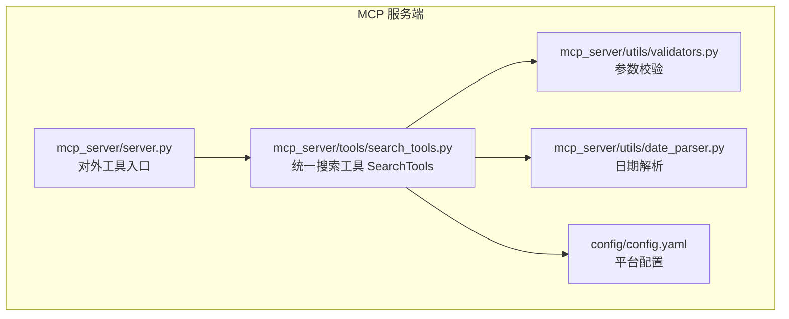
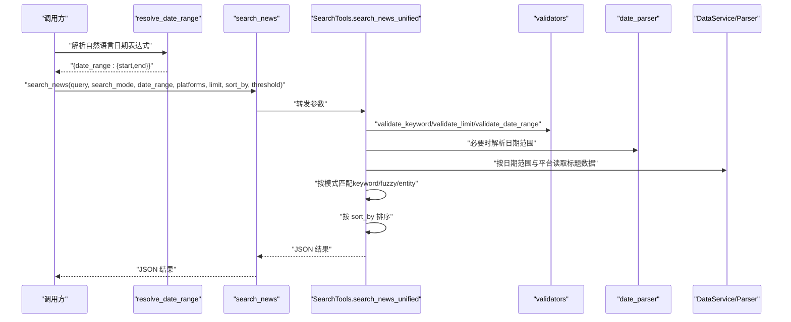
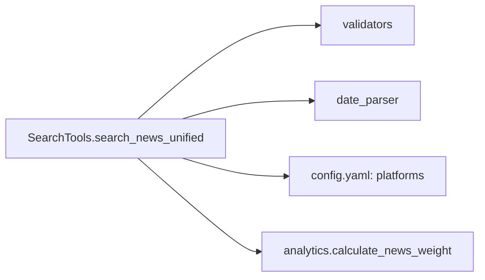

# search_news 工具

<cite>
**本文引用的文件**
- [mcp_server/tools/search_tools.py](file://mcp_server/tools/search_tools.py)
- [mcp_server/server.py](file://mcp_server/server.py)
- [mcp_server/utils/validators.py](file://mcp_server/utils/validators.py)
- [mcp_server/utils/date_parser.py](file://mcp_server/utils/date_parser.py)
- [config/config.yaml](file://config/config.yaml)
- [README-MCP-FAQ.md](file://README-MCP-FAQ.md)
</cite>

## 目录
1. [简介](#简介)
2. [项目结构](#项目结构)
3. [核心组件](#核心组件)
4. [架构总览](#架构总览)
5. [详细组件分析](#详细组件分析)
6. [依赖关系分析](#依赖关系分析)
7. [性能考量](#性能考量)
8. [故障排查指南](#故障排查指南)
9. [结论](#结论)
10. [附录](#附录)

## 简介
本文件为 search_news 统一搜索工具的权威文档。该工具提供三种搜索模式（keyword、fuzzy、entity），支持按日期范围、平台过滤、排序方式与数量限制进行检索，并返回结构化的 JSON 结果。文档重点说明：
- query 参数与 search_mode 的三种模式
- date_range 参数的使用与必须通过 resolve_date_range 获取的实践
- platforms 参数的过滤能力与 limit 的限制（默认50，最大1000）
- sort_by 的三种排序方式：relevance、weight、date
- fuzzy 模式的 threshold（相似度阈值）作用
- 返回的 JSON 结构与字段含义
- 完整调用示例（如“本周AI新闻”的两步流程）
- 数据展示策略：默认展示完整结果列表，无需主动总结

## 项目结构
search_news 工具位于 MCP 服务端工具层，围绕统一搜索接口实现，配合参数校验、日期解析与平台配置，形成完整的搜索链路。

图表来源
- [mcp_server/server.py](file://mcp_server/server.py#L500-L540)
- [mcp_server/tools/search_tools.py](file://mcp_server/tools/search_tools.py#L38-L241)
- [mcp_server/utils/validators.py](file://mcp_server/utils/validators.py#L90-L121)
- [mcp_server/utils/date_parser.py](file://mcp_server/utils/date_parser.py#L330-L423)
- [config/config.yaml](file://config/config.yaml#L163-L187)

章节来源
- [mcp_server/server.py](file://mcp_server/server.py#L500-L540)
- [mcp_server/tools/search_tools.py](file://mcp_server/tools/search_tools.py#L38-L241)
- [mcp_server/utils/validators.py](file://mcp_server/utils/validators.py#L90-L121)
- [mcp_server/utils/date_parser.py](file://mcp_server/utils/date_parser.py#L330-L423)
- [config/config.yaml](file://config/config.yaml#L163-L187)

## 核心组件
- SearchTools.search_news_unified：统一搜索入口，负责参数校验、日期范围处理、按模式检索、排序与限制、结果组装与返回。
- 参数校验器 validators：提供 validate_keyword、validate_limit、validate_date_range 等，保障输入合法与边界约束。
- 日期解析器 date_parser：提供 resolve_date_range_expression，将自然语言日期表达式解析为标准日期范围。
- 平台配置 config.yaml：定义支持的平台 id 与名称，工具侧通过 get_supported_platforms 读取并进行平台过滤。

章节来源
- [mcp_server/tools/search_tools.py](file://mcp_server/tools/search_tools.py#L38-L241)
- [mcp_server/utils/validators.py](file://mcp_server/utils/validators.py#L90-L121)
- [mcp_server/utils/date_parser.py](file://mcp_server/utils/date_parser.py#L330-L423)
- [config/config.yaml](file://config/config.yaml#L163-L187)

## 架构总览
统一搜索工具的调用链如下：客户端/调用方 → resolve_date_range（可选）→ search_news → SearchTools.search_news_unified → 数据服务读取 → 模式匹配与排序 → 返回 JSON。

图表来源
- [mcp_server/server.py](file://mcp_server/server.py#L500-L540)
- [mcp_server/tools/search_tools.py](file://mcp_server/tools/search_tools.py#L38-L241)
- [mcp_server/utils/validators.py](file://mcp_server/utils/validators.py#L90-L121)
- [mcp_server/utils/date_parser.py](file://mcp_server/utils/date_parser.py#L330-L423)

## 详细组件分析

### 统一搜索接口 search_news_unified
- 功能概述
  - 接收 query、search_mode、date_range、platforms、limit、sort_by、threshold、include_url 等参数
  - 根据 search_mode 执行 keyword、fuzzy 或 entity 模式
  - 按 sort_by 对结果排序
  - 限制返回数量并返回完整摘要与结果列表
- 关键行为
  - 参数校验：validate_keyword、validate_limit、validate_date_range
  - 日期范围：若未提供 date_range，则使用最新可用数据日期；若提供则校验并限定范围
  - 模式匹配：
    - keyword：精确包含匹配
    - fuzzy：整体相似度 + 关键词重合度 + 直接包含
    - entity：实体名称包含匹配
  - 排序：
    - relevance：按 similarity_score 降序
    - weight：按新闻权重降序（依赖 analytics 计算）
    - date：按 date 降序
  - 结果封装：返回 success、summary（含 total_found、returned_count、requested_limit、search_mode、query、platforms、time_range、sort_by、threshold（fuzzy 模式））、results 列表

章节来源
- [mcp_server/tools/search_tools.py](file://mcp_server/tools/search_tools.py#L38-L241)
- [mcp_server/tools/search_tools.py](file://mcp_server/tools/search_tools.py#L242-L390)
- [mcp_server/tools/search_tools.py](file://mcp_server/tools/search_tools.py#L391-L493)

### 参数详解

- query（必需）
  - 说明：搜索关键词或内容片段或实体名称
  - 校验：validate_keyword，长度限制、类型检查、空白字符处理
  - 示例路径：[参数校验](file://mcp_server/tools/search_tools.py#L82-L84)

- search_mode（可选，默认 keyword）
  - keyword：精确关键词匹配
  - fuzzy：模糊内容匹配（使用相似度算法）
  - entity：实体名称搜索（自动按权重排序）
  - 示例路径：[模式校验与示例](file://mcp_server/tools/search_tools.py#L83-L95)

- date_range（可选）
  - 格式：{"start":"YYYY-MM-DD","end":"YYYY-MM-DD"}
  - 默认：未提供时使用最新可用数据日期（非当天时会提示可用范围）
  - 校验：validate_date_range，start/end 必填、日期格式、start≤end、不可查询未来日期
  - 实践：强烈建议使用 resolve_date_range 获取标准日期范围，避免模型自行计算导致不一致
  - 示例路径：[日期范围处理与默认逻辑](file://mcp_server/tools/search_tools.py#L100-L122)

- platforms（可选）
  - 说明：平台过滤列表，如 ["zhihu","weibo"]
  - 校验：validate_platforms，基于 config.yaml 中的 platforms 配置进行校验
  - 示例路径：[平台配置与校验](file://mcp_server/utils/validators.py#L43-L88)、[平台配置文件](file://config/config.yaml#L163-L187)

- limit（可选，默认50，最大1000）
  - 说明：返回条数限制
  - 校验：validate_limit，类型、范围、最大值限制
  - 示例路径：[limit 校验](file://mcp_server/utils/validators.py#L90-L121)

- sort_by（可选，默认 relevance）
  - relevance：按相关度排序（similarity_score）
  - weight：按新闻权重排序（依赖 analytics 计算）
  - date：按日期排序
  - 示例路径：[排序逻辑](file://mcp_server/tools/search_tools.py#L186-L194)

- threshold（可选，fuzzy 模式有效，默认0.6）
  - 说明：模糊匹配相似度阈值（0-1之间），越高匹配越严格，返回结果越少
  - 示例路径：[阈值处理与模糊匹配](file://mcp_server/tools/search_tools.py#L96-L98)、[模糊匹配实现](file://mcp_server/tools/search_tools.py#L405-L441)

- include_url（可选，默认 False）
  - 说明：是否包含 URL 链接（节省 token）
  - 示例路径：[条件性添加 URL 字段](file://mcp_server/tools/search_tools.py#L282-L286)、[模糊模式 URL 添加](file://mcp_server/tools/search_tools.py#L334-L338)

### 返回的 JSON 结构
- 成功响应（success=true）
  - summary：包含 total_found、returned_count、requested_limit、search_mode、query、platforms、time_range、sort_by、threshold（fuzzy 模式）
  - results：新闻列表，每条包含 title、platform、platform_name、date、similarity_score、ranks、count、rank、url、mobileUrl（可选）
- 失败响应（success=false）
  - error：包含 code、message 等错误信息
- 无匹配时
  - results 为空，返回 message 与可用数据范围提示

章节来源
- [mcp_server/tools/search_tools.py](file://mcp_server/tools/search_tools.py#L186-L241)
- [mcp_server/tools/search_tools.py](file://mcp_server/tools/search_tools.py#L242-L390)

### 调用示例：搜索“本周AI新闻”的两步流程
- 步骤1：resolve_date_range("本周")
  - 返回标准日期范围 {"date_range":{"start":"YYYY-MM-DD","end":"YYYY-MM-DD"}}
- 步骤2：search_news(query="AI", date_range=上一步返回的日期范围)
  - 返回完整搜索结果列表（默认展示全部，无需总结）

章节来源
- [mcp_server/server.py](file://mcp_server/server.py#L507-L540)
- [README-MCP-FAQ.md](file://README-MCP-FAQ.md#L150-L194)

### 数据展示策略
- 默认展示：展示全部返回的新闻，无需总结或筛选
- 仅在用户明确要求“总结”或“挑重点”时才进行筛选
- 重要提示：工具返回完整列表，AI 通常会自动总结，如需全量展示，需明确要求

章节来源
- [mcp_server/server.py](file://mcp_server/server.py#L524-L528)
- [README-MCP-FAQ.md](file://README-MCP-FAQ.md#L150-L194)

## 依赖关系分析
- SearchTools.search_news_unified 依赖
  - 参数校验：validators.validate_keyword、validate_limit、validate_date_range
  - 日期解析：date_parser.resolve_date_range_expression
  - 平台配置：config.yaml 中的 platforms
  - 排序权重：analytics.calculate_news_weight（在 weight 排序时使用）
- 依赖图

图表来源
- [mcp_server/tools/search_tools.py](file://mcp_server/tools/search_tools.py#L38-L241)
- [mcp_server/utils/validators.py](file://mcp_server/utils/validators.py#L90-L121)
- [mcp_server/utils/date_parser.py](file://mcp_server/utils/date_parser.py#L330-L423)
- [config/config.yaml](file://config/config.yaml#L163-L187)

章节来源
- [mcp_server/tools/search_tools.py](file://mcp_server/tools/search_tools.py#L38-L241)
- [mcp_server/utils/validators.py](file://mcp_server/utils/validators.py#L90-L121)
- [mcp_server/utils/date_parser.py](file://mcp_server/utils/date_parser.py#L330-L423)
- [config/config.yaml](file://config/config.yaml#L163-L187)

## 性能考量
- 模糊匹配复杂度
  - 对每个标题执行相似度计算与关键词重合度评估，整体复杂度与标题数量成正比
  - threshold 越高，过滤越严格，减少后续排序与截断开销
- 排序成本
  - relevance：按 similarity_score 排序
  - weight：依赖 analytics 计算权重，排序成本与结果数量相关
  - date：按日期字符串排序，成本较低
- 限制与截断
  - limit 控制最终返回数量，建议根据需求合理设置，避免过多数据传输与渲染压力
- 平台过滤
  - platforms 作为平台过滤列表，可缩小扫描范围，提升性能

[本节为通用性能讨论，不直接分析具体文件]

## 故障排查指南
- 常见错误与处理
  - 无效的 search_mode：检查是否为 keyword、fuzzy、entity
  - 无效的 sort_by：检查是否为 relevance、weight、date
  - 无效的 limit：超出范围或类型不符
  - 无效的 date_range：start/end 缺失、格式错误、start>end、未来日期
  - 无效的 platforms：不在 config.yaml 配置中
  - 无可用数据：output 目录下没有新闻数据
- 排查要点
  - 使用 resolve_date_range 获取标准日期范围，避免模型自行计算误差
  - 确认 platforms 是否存在于 config.yaml
  - 检查 limit 是否超过最大限制（1000）
  - 若返回空结果，关注 message 中的可用数据范围提示

章节来源
- [mcp_server/tools/search_tools.py](file://mcp_server/tools/search_tools.py#L83-L95)
- [mcp_server/utils/validators.py](file://mcp_server/utils/validators.py#L90-L121)
- [mcp_server/utils/validators.py](file://mcp_server/utils/validators.py#L145-L209)
- [mcp_server/utils/validators.py](file://mcp_server/utils/validators.py#L43-L88)

## 结论
search_news 统一搜索工具提供了灵活、可控的新闻检索能力。通过 keyword、fuzzy、entity 三种模式与丰富的参数组合，能够满足多样化的检索需求。遵循“先解析日期、再统一搜索”的最佳实践，结合平台过滤与排序策略，可在保证准确性的同时提升查询效率。默认展示完整结果列表，便于用户自主决策与进一步分析。

[本节为总结性内容，不直接分析具体文件]

## 附录

### 参数与默认值速览
- query：必需，字符串
- search_mode：keyword/fuzzy/entity，默认 keyword
- date_range：{"start":"YYYY-MM-DD","end":"YYYY-MM-DD"}，未提供时使用最新可用日期
- platforms：平台过滤列表，基于 config.yaml 配置
- limit：默认50，最大1000
- sort_by：relevance/weight/date，默认 relevance
- threshold：fuzzy 模式有效，默认0.6
- include_url：是否包含 URL，默认 False

章节来源
- [mcp_server/tools/search_tools.py](file://mcp_server/tools/search_tools.py#L38-L241)
- [mcp_server/utils/validators.py](file://mcp_server/utils/validators.py#L90-L121)
- [config/config.yaml](file://config/config.yaml#L163-L187)