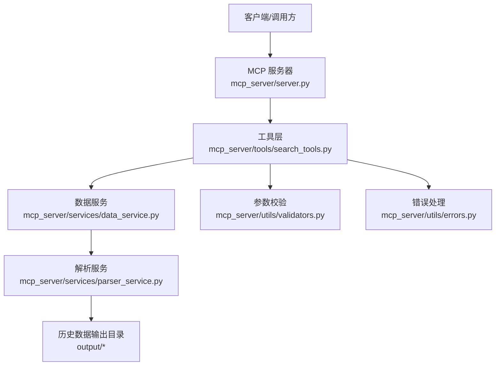
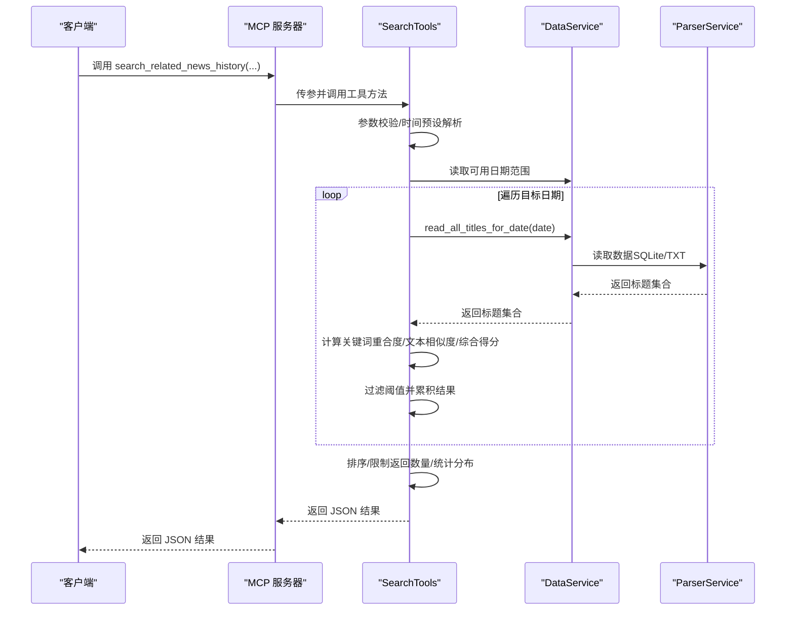
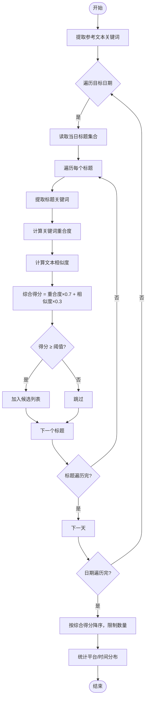
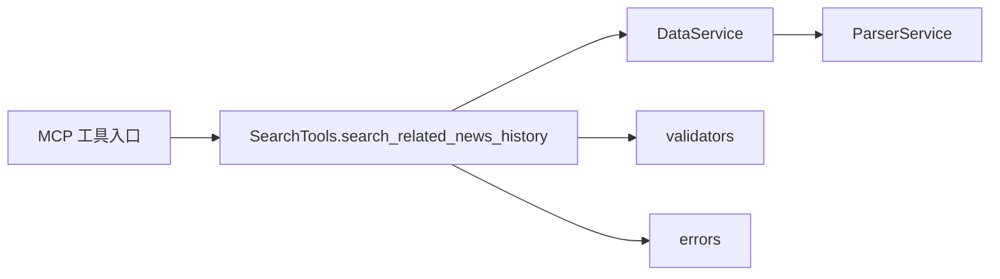

# search_related_news_history 工具

<cite>
**本文引用的文件**
- [mcp_server/server.py](file://mcp_server/server.py)
- [mcp_server/tools/search_tools.py](file://mcp_server/tools/search_tools.py)
- [mcp_server/services/data_service.py](file://mcp_server/services/data_service.py)
- [mcp_server/services/parser_service.py](file://mcp_server/services/parser_service.py)
- [mcp_server/utils/validators.py](file://mcp_server/utils/validators.py)
- [mcp_server/utils/errors.py](file://mcp_server/utils/errors.py)
- [config/config.yaml](file://config/config.yaml)
- [config/frequency_words.txt](file://config/frequency_words.txt)
</cite>

## 目录
1. [简介](#简介)
2. [项目结构](#项目结构)
3. [核心组件](#核心组件)
4. [架构总览](#架构总览)
5. [详细组件分析](#详细组件分析)
6. [依赖关系分析](#依赖关系分析)
7. [性能考量](#性能考量)
8. [故障排查指南](#故障排查指南)
9. [结论](#结论)
10. [附录](#附录)

## 简介
search_related_news_history 是基于 MCP（Model Context Protocol）的智能检索工具之一，用于“基于种子新闻在历史数据中搜索相关新闻”。它支持按时间预设（昨天、上周、上个月、自定义）检索，并通过“关键词重合度（70%）+ 文本相似度（30%）”的综合评分计算相关性，返回相关新闻列表及时间分布统计。默认展示全部返回的新闻及分数，便于深度话题研究与事件脉络梳理。

## 项目结构
该工具位于 MCP 服务端的工具层，通过 HTTP/STDIO 暴露为 MCP 工具，内部依赖数据服务与解析服务读取历史数据，使用参数校验与错误处理保障健壮性。

图表来源
- [mcp_server/server.py](file://mcp_server/server.py#L543-L585)
- [mcp_server/tools/search_tools.py](file://mcp_server/tools/search_tools.py#L494-L702)
- [mcp_server/services/data_service.py](file://mcp_server/services/data_service.py#L498-L624)
- [mcp_server/services/parser_service.py](file://mcp_server/services/parser_service.py#L461-L514)
- [mcp_server/utils/validators.py](file://mcp_server/utils/validators.py#L90-L121)
- [mcp_server/utils/errors.py](file://mcp_server/utils/errors.py#L10-L94)

章节来源
- [mcp_server/server.py](file://mcp_server/server.py#L543-L585)
- [mcp_server/tools/search_tools.py](file://mcp_server/tools/search_tools.py#L494-L702)
- [mcp_server/services/data_service.py](file://mcp_server/services/data_service.py#L498-L624)
- [mcp_server/services/parser_service.py](file://mcp_server/services/parser_service.py#L461-L514)
- [mcp_server/utils/validators.py](file://mcp_server/utils/validators.py#L90-L121)
- [mcp_server/utils/errors.py](file://mcp_server/utils/errors.py#L10-L94)

## 核心组件
- MCP 工具入口：在 MCP 服务器中注册为工具，接收参数并调用工具层实现。
- 工具层实现：SearchTools.search_related_news_history 负责时间范围解析、关键词提取、相似度计算、结果排序与统计。
- 数据服务与解析服务：DataService.ParserService 提供历史数据读取与缓存，支持 SQLite 与 TXT 两种数据源。
- 参数校验与错误处理：validators 提供 limit、日期范围等校验；errors 定义统一错误类型。

章节来源
- [mcp_server/server.py](file://mcp_server/server.py#L543-L585)
- [mcp_server/tools/search_tools.py](file://mcp_server/tools/search_tools.py#L494-L702)
- [mcp_server/services/data_service.py](file://mcp_server/services/data_service.py#L498-L624)
- [mcp_server/services/parser_service.py](file://mcp_server/services/parser_service.py#L461-L514)
- [mcp_server/utils/validators.py](file://mcp_server/utils/validators.py#L90-L121)
- [mcp_server/utils/errors.py](file://mcp_server/utils/errors.py#L10-L94)

## 架构总览
该工具遵循“MCP 工具层 → 数据服务 → 解析服务 → 历史数据”的调用链路，参数校验与错误处理贯穿始终。

图表来源
- [mcp_server/server.py](file://mcp_server/server.py#L543-L585)
- [mcp_server/tools/search_tools.py](file://mcp_server/tools/search_tools.py#L534-L702)
- [mcp_server/services/data_service.py](file://mcp_server/services/data_service.py#L498-L624)
- [mcp_server/services/parser_service.py](file://mcp_server/services/parser_service.py#L461-L514)

## 详细组件分析

### 参数说明与行为
- reference_text（参考新闻标题/内容）
  - 类型：字符串
  - 作用：作为种子新闻，用于与历史标题进行相似度计算
  - 校验：通过参数校验器进行长度与类型检查
- time_preset（时间预设）
  - 可选值：yesterday（昨天）、last_week（上周）、last_month（上个月）、custom（自定义）
  - 行为：根据预设计算起止日期；custom 模式需提供 start_date 与 end_date
- threshold（相关性阈值，默认0.4）
  - 计算方式：综合相似度 = 关键词重合度 × 0.7 + 文本相似度 × 0.3
  - 影响：阈值越高，匹配越严格，返回结果越少
- limit（默认50，最大100）
  - 作用：限制最终返回的新闻数量
- include_url（默认False）
  - 作用：是否包含新闻链接字段（节省 token）

章节来源
- [mcp_server/server.py](file://mcp_server/server.py#L543-L585)
- [mcp_server/tools/search_tools.py](file://mcp_server/tools/search_tools.py#L494-L702)
- [mcp_server/utils/validators.py](file://mcp_server/utils/validators.py#L90-L121)

### 相似度计算与阈值
- 关键词重合度：对参考文本与标题分别提取关键词，计算交集与并集的 Jaccard 相似度
- 文本相似度：使用 SequenceMatcher 计算标题与参考文本的相似度
- 综合得分：关键词重合度×0.7 + 文本相似度×0.3
- 过滤：仅保留综合得分≥阈值的新闻

图表来源
- [mcp_server/tools/search_tools.py](file://mcp_server/tools/search_tools.py#L534-L702)

章节来源
- [mcp_server/tools/search_tools.py](file://mcp_server/tools/search_tools.py#L534-L702)

### 返回结构与统计
- summary 字段
  - total_found：匹配到的总条数
  - returned_count：最终返回条数
  - requested_limit：请求的 limit
  - threshold：相关性阈值
  - reference_text：参考文本
  - reference_keywords：参考文本提取的关键词
  - time_preset/date_range：时间范围描述
- results 字段
  - 包含每条相关新闻的标题、平台、日期、综合相似度、关键词重合度、文本相似度、共同关键词、排名等
  - 可选字段：url/mobileUrl（当 include_url=True 时）
- statistics 字段
  - platform_distribution：各平台出现次数
  - date_distribution：各日期出现次数
  - avg_similarity：所有匹配新闻的平均综合相似度

章节来源
- [mcp_server/tools/search_tools.py](file://mcp_server/tools/search_tools.py#L654-L687)

### 数据展示策略
- 默认展示策略：展示全部返回的新闻及分数，便于用户进行深度分析与事件脉络梳理
- 仅在用户明确要求“总结”或“挑重点”时才进行筛选

章节来源
- [mcp_server/server.py](file://mcp_server/server.py#L543-L585)

### 调用示例
- 基于某新闻标题搜索上周的相关报道
  - 参考标题：某新闻标题
  - time_preset：last_week
  - threshold：0.4（默认）
  - limit：50（默认）
  - include_url：False（默认）
- 自定义日期范围
  - time_preset：custom
  - start_date/end_date：指定日期范围

章节来源
- [mcp_server/server.py](file://mcp_server/server.py#L543-L585)
- [mcp_server/tools/search_tools.py](file://mcp_server/tools/search_tools.py#L494-L702)

### 在深度话题研究与事件脉络梳理中的应用
- 事件溯源：以某关键新闻为种子，回溯历史相关报道，识别事件早期信号与传播路径
- 跨平台对比：利用平台分布统计，观察不同平台对同一事件的关注度与节奏差异
- 时间线梳理：结合日期分布统计，绘制事件热度与曝光的时间线
- 相关性分析：通过相似度分数与共同关键词，辅助判断新闻间的关联强度与主题一致性

章节来源
- [mcp_server/tools/search_tools.py](file://mcp_server/tools/search_tools.py#L654-L687)

## 依赖关系分析
- 工具层依赖
  - 数据服务：读取历史数据、缓存与可用日期范围
  - 解析服务：读取 SQLite/TXT 数据源，合并同一天多批次数据
  - 参数校验：limit、日期范围、关键词等
  - 错误处理：统一异常类型与错误字典
- MCP 层依赖
  - 工具注册与参数透传，返回 JSON 结果

图表来源
- [mcp_server/tools/search_tools.py](file://mcp_server/tools/search_tools.py#L494-L702)
- [mcp_server/services/data_service.py](file://mcp_server/services/data_service.py#L498-L624)
- [mcp_server/services/parser_service.py](file://mcp_server/services/parser_service.py#L461-L514)
- [mcp_server/utils/validators.py](file://mcp_server/utils/validators.py#L90-L121)
- [mcp_server/utils/errors.py](file://mcp_server/utils/errors.py#L10-L94)
- [mcp_server/server.py](file://mcp_server/server.py#L543-L585)

章节来源
- [mcp_server/tools/search_tools.py](file://mcp_server/tools/search_tools.py#L494-L702)
- [mcp_server/services/data_service.py](file://mcp_server/services/data_service.py#L498-L624)
- [mcp_server/services/parser_service.py](file://mcp_server/services/parser_service.py#L461-L514)
- [mcp_server/utils/validators.py](file://mcp_server/utils/validators.py#L90-L121)
- [mcp_server/utils/errors.py](file://mcp_server/utils/errors.py#L10-L94)
- [mcp_server/server.py](file://mcp_server/server.py#L543-L585)

## 性能考量
- 数据源优先级：优先读取 SQLite，其次读取 TXT；解析服务对历史数据使用较长缓存时间，减少 IO
- 日期遍历：按日遍历目标日期范围，逐日读取标题集合，避免一次性加载过多数据
- 相似度计算：关键词重合度与文本相似度均为 O(n) 级别，整体复杂度与标题数量线性相关
- 排序与限制：最终按综合得分降序，限制返回数量，控制响应体积

章节来源
- [mcp_server/services/parser_service.py](file://mcp_server/services/parser_service.py#L461-L514)
- [mcp_server/tools/search_tools.py](file://mcp_server/tools/search_tools.py#L534-L702)

## 故障排查指南
- 无数据可用
  - 现象：返回“未找到相关新闻”
  - 原因：目标日期范围内无数据或输出目录为空
  - 处理：确认爬虫已运行并生成数据，或调整时间范围
- 参数错误
  - 现象：抛出 INVALID_PARAMETER 错误
  - 原因：limit 超上限、日期范围非法、自定义模式缺少日期参数
  - 处理：检查参数范围与必填项
- 数据不存在
  - 现象：抛出 DATA_NOT_FOUND 错误
  - 原因：解析服务无法读取指定日期数据
  - 处理：确认日期格式与数据存在情况

章节来源
- [mcp_server/utils/errors.py](file://mcp_server/utils/errors.py#L10-L94)
- [mcp_server/utils/validators.py](file://mcp_server/utils/validators.py#L90-L121)
- [mcp_server/tools/search_tools.py](file://mcp_server/tools/search_tools.py#L534-L702)

## 结论
search_related_news_history 工具通过“关键词重合度+文本相似度”的综合评分，结合时间预设与阈值控制，能够高效地在历史数据中检索与种子新闻相关的新闻，为深度话题研究与事件脉络梳理提供可靠支撑。默认展示全部结果与分数，有助于用户进行进一步的人工判读与交叉验证。

## 附录
- 配置参考
  - 平台配置与权重：用于影响新闻权重与排序（与本工具相关但非直接参数）
  - 关键词配置：用于关注词统计与趋势分析（与本工具无直接关系）

章节来源
- [config/config.yaml](file://config/config.yaml#L158-L187)
- [config/frequency_words.txt](file://config/frequency_words.txt#L1-L114)