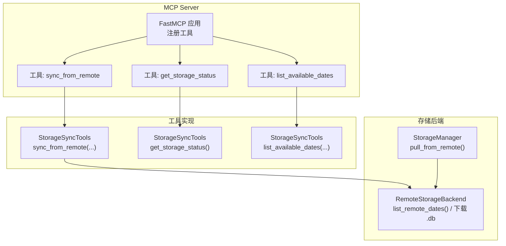
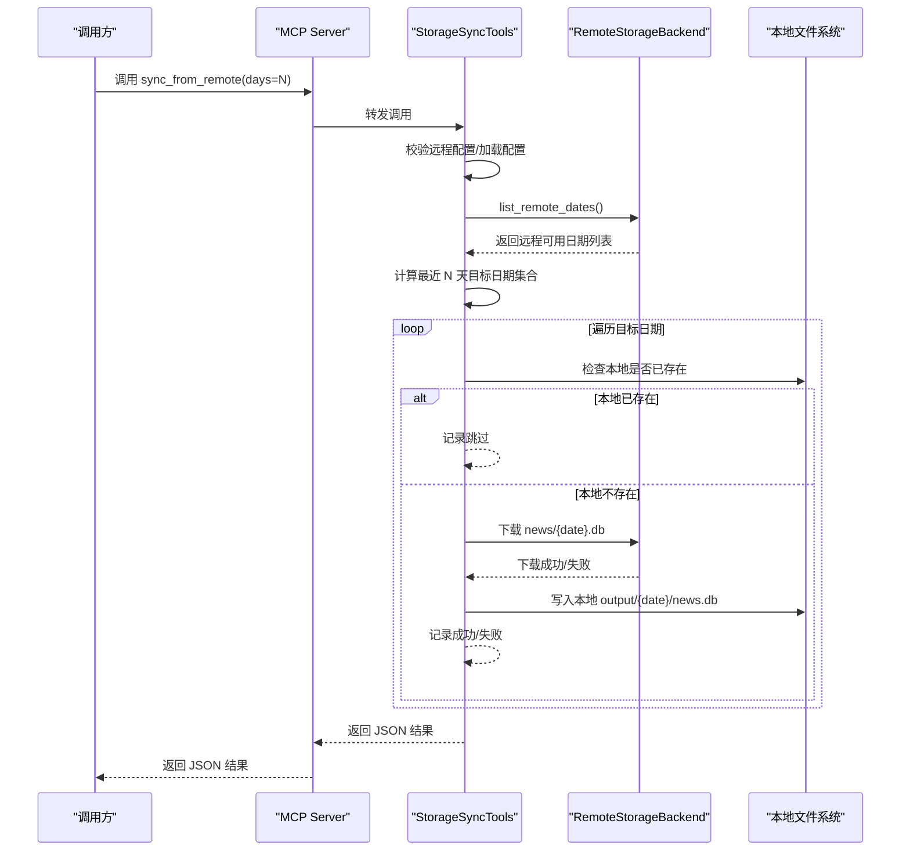
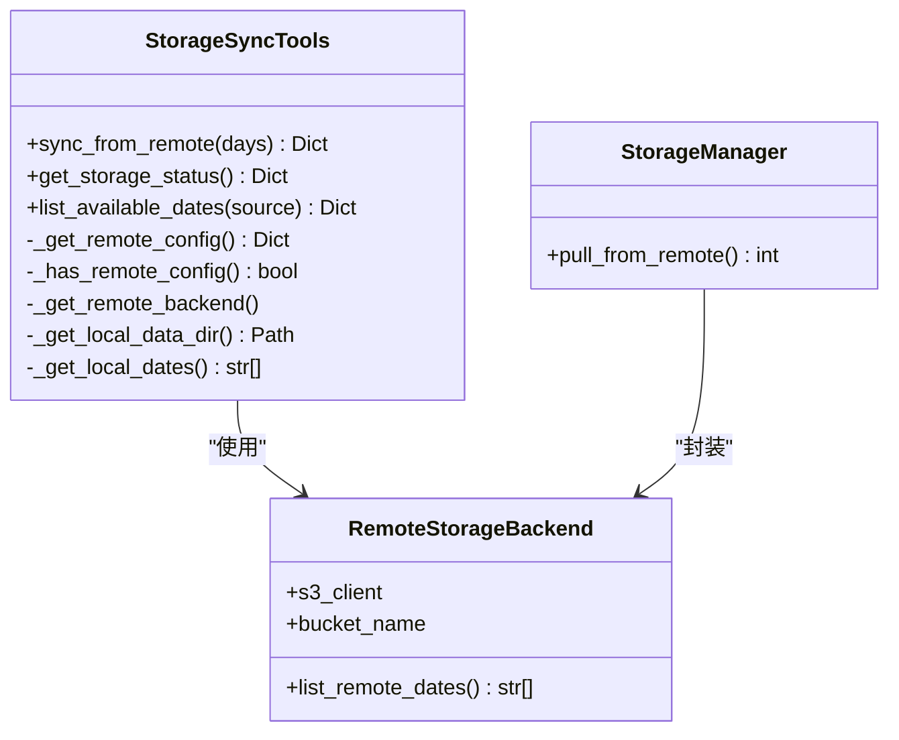
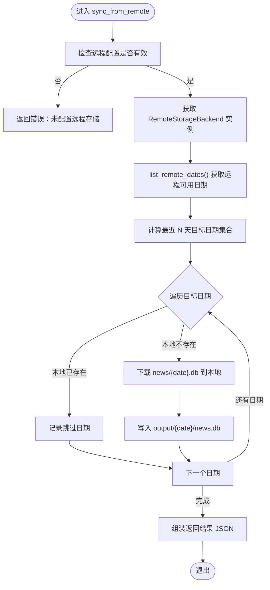

# sync_from_remote 工具

<cite>
**本文引用的文件**
- [mcp_server/server.py](file://mcp_server/server.py)
- [mcp_server/tools/storage_sync.py](file://mcp_server/tools/storage_sync.py)
- [trendradar/storage/remote.py](file://trendradar/storage/remote.py)
- [trendradar/storage/manager.py](file://trendradar/storage/manager.py)
- [config/config.yaml](file://config/config.yaml)
</cite>

## 目录
1. [简介](#简介)
2. [项目结构](#项目结构)
3. [核心组件](#核心组件)
4. [架构总览](#架构总览)
5. [详细组件分析](#详细组件分析)
6. [依赖关系分析](#依赖关系分析)
7. [性能考量](#性能考量)
8. [故障排查指南](#故障排查指南)
9. [结论](#结论)
10. [附录](#附录)

## 简介
sync_from_remote 是 TrendRadar MCP Server 提供的一个工具，用于从远程云存储（如 Cloudflare R2、AWS S3、阿里云 OSS、腾讯云 COS、MinIO 等 S3 兼容服务）拉取数据到本地，以便在本地进行分析与查询。该工具支持按“最近 N 天”拉取，其中 N 由 days 参数决定：
- days=0：不拉取
- days=7：拉取最近一周的数据
- days=30：拉取最近一个月的数据

返回的 JSON 结果包含 success 状态、同步文件数、同步日期列表、跳过的日期以及失败日期等关键字段，便于用户了解拉取结果与后续处理。

## 项目结构
sync_from_remote 工具位于 MCP Server 的工具层，通过 FastMCP 注册为可调用工具；其核心逻辑由 StorageSyncTools 实现，并依赖 trendradar.storage.remote.RemoteStorageBackend 与 trendradar.storage.manager.StorageManager 的能力完成远程数据拉取与本地落盘。

图表来源
- [mcp_server/server.py](file://mcp_server/server.py#L662-L781)
- [mcp_server/tools/storage_sync.py](file://mcp_server/tools/storage_sync.py#L1-L469)
- [trendradar/storage/remote.py](file://trendradar/storage/remote.py#L1099-L1127)
- [trendradar/storage/manager.py](file://trendradar/storage/manager.py#L175-L199)

章节来源
- [mcp_server/server.py](file://mcp_server/server.py#L662-L781)
- [mcp_server/tools/storage_sync.py](file://mcp_server/tools/storage_sync.py#L1-L469)
- [trendradar/storage/remote.py](file://trendradar/storage/remote.py#L1099-L1127)
- [trendradar/storage/manager.py](file://trendradar/storage/manager.py#L175-L199)

## 核心组件
- MCP Server 工具注册：在 mcp_server/server.py 中注册 sync_from_remote、get_storage_status、list_available_dates 等工具，供外部调用。
- StorageSyncTools：实现 sync_from_remote 的核心逻辑，负责：
  - 加载配置（config/config.yaml）与远程存储配置合并（支持环境变量）
  - 获取远程可用日期列表
  - 计算目标日期集合（最近 N 天）
  - 下载对应日期的 SQLite 数据库文件到本地 output 目录
  - 统计成功/跳过/失败的日期并返回结构化结果
- RemoteStorageBackend：提供远程存储访问能力，包括 list_remote_dates 与下载 .db 文件。
- StorageManager：提供 pull_from_remote 等高级封装，也可用于自动拉取。

章节来源
- [mcp_server/server.py](file://mcp_server/server.py#L662-L781)
- [mcp_server/tools/storage_sync.py](file://mcp_server/tools/storage_sync.py#L176-L288)
- [trendradar/storage/remote.py](file://trendradar/storage/remote.py#L1099-L1127)
- [trendradar/storage/manager.py](file://trendradar/storage/manager.py#L175-L199)

## 架构总览
sync_from_remote 的调用链路如下：

图表来源
- [mcp_server/server.py](file://mcp_server/server.py#L662-L703)
- [mcp_server/tools/storage_sync.py](file://mcp_server/tools/storage_sync.py#L176-L288)
- [trendradar/storage/remote.py](file://trendradar/storage/remote.py#L1099-L1127)

## 详细组件分析

### days 参数语义与行为
- days=0：不拉取任何数据，返回空结果或提示未启用拉取。
- days=7：拉取最近一周（包含今天）的数据，若某天远程不存在则跳过。
- days=30：拉取最近一个月（包含今天）的数据，若某天远程不存在则跳过。
- 日期来源：从远程存储的 news/{YYYY-MM-DD}.db 对象键中解析日期列表，再按当前时区计算最近 N 天。

章节来源
- [mcp_server/server.py](file://mcp_server/server.py#L662-L703)
- [mcp_server/tools/storage_sync.py](file://mcp_server/tools/storage_sync.py#L220-L261)
- [trendradar/storage/remote.py](file://trendradar/storage/remote.py#L1099-L1127)

### 返回的 JSON 结果结构
sync_from_remote 返回的 JSON 字段说明：
- success：布尔值，表示本次拉取是否成功
- synced_files：数字，成功同步的文件数量
- synced_dates：数组，成功同步的日期列表（YYYY-MM-DD）
- skipped_dates：数组，跳过的日期列表（本地已存在）
- failed_dates：数组，失败的日期及错误信息（每个元素包含 date 与 error）
- message：字符串，操作结果描述（包含成功/跳过/失败的数量统计）

章节来源
- [mcp_server/tools/storage_sync.py](file://mcp_server/tools/storage_sync.py#L262-L273)

### 调用示例
- 拉取最近 7 天数据：调用 sync_from_remote()
- 拉取最近 30 天数据：调用 sync_from_remote(days=30)

章节来源
- [mcp_server/server.py](file://mcp_server/server.py#L662-L703)

### 在 MCP Server 场景中的重要性
- 爬虫将数据存储到远程云存储（如 Cloudflare R2），MCP Server 通过 sync_from_remote 将数据拉取到本地，从而在本地进行分析与查询，避免跨网络频繁访问远程存储带来的延迟与成本。
- 该工具与 get_storage_status、list_available_dates 协同使用，帮助用户掌握本地/远程数据覆盖情况与同步状态。

章节来源
- [mcp_server/server.py](file://mcp_server/server.py#L705-L781)

### 配置远程存储
- 配置文件：config/config.yaml 中的 storage.remote 节点
- 环境变量（优先级低于配置文件）：
  - S3_ENDPOINT_URL
  - S3_BUCKET_NAME
  - S3_ACCESS_KEY_ID
  - S3_SECRET_ACCESS_KEY
  - S3_REGION
- 时区配置：app.timezone 影响日期计算与显示

章节来源
- [mcp_server/tools/storage_sync.py](file://mcp_server/tools/storage_sync.py#L54-L77)
- [config/config.yaml](file://config/config.yaml#L1-L187)

### 错误处理与边界情况
- 未配置远程存储：返回 error.code=REMOTE_NOT_CONFIGURED
- 远程后端初始化失败：返回 error.code=REMOTE_BACKEND_FAILED
- 内部异常：返回 error.code=INTERNAL_ERROR
- 本地已存在：记录到 skipped_dates
- 下载失败：记录到 failed_dates（包含错误信息）

章节来源
- [mcp_server/tools/storage_sync.py](file://mcp_server/tools/storage_sync.py#L186-L287)

## 依赖关系分析

图表来源
- [mcp_server/tools/storage_sync.py](file://mcp_server/tools/storage_sync.py#L1-L469)
- [trendradar/storage/remote.py](file://trendradar/storage/remote.py#L1099-L1127)
- [trendradar/storage/manager.py](file://trendradar/storage/manager.py#L175-L199)

章节来源
- [mcp_server/tools/storage_sync.py](file://mcp_server/tools/storage_sync.py#L1-L469)
- [trendradar/storage/remote.py](file://trendradar/storage/remote.py#L1099-L1127)
- [trendradar/storage/manager.py](file://trendradar/storage/manager.py#L175-L199)

## 性能考量
- 远程遍历：list_remote_dates 使用分页列举远程对象，避免一次性拉取过多对象键。
- 本地写入：逐日期下载并写入本地 SQLite 文件，I/O 为顺序写入，适合本地 SSD。
- 时区与时钟：使用配置时区计算日期，避免跨时区误差导致的日期偏差。
- 失败重试：当前实现未内置重试机制，失败日期需手动重试或扩大 days 后再次拉取。

[本节为通用指导，不涉及具体文件分析]

## 故障排查指南
- 未配置远程存储
  - 现象：返回 error.code=REMOTE_NOT_CONFIGURED
  - 处理：在 config/config.yaml 中配置 storage.remote，或设置 S3_* 环境变量
- 远程后端初始化失败
  - 现象：返回 error.code=REMOTE_BACKEND_FAILED
  - 处理：确认 boto3 已安装，检查 endpoint_url、bucket_name、access_key_id、secret_access_key、region
- 下载失败
  - 现象：failed_dates 中包含具体错误
  - 处理：检查网络连通性、凭证权限、对象是否存在、签名版本兼容性
- 本地已存在
  - 现象：日期出现在 skipped_dates
  - 处理：本地已有对应日期的 news.db，无需重复拉取
- 日期不匹配
  - 现象：目标日期不在远程可用日期列表
  - 处理：确认远程对象键命名规范 news/{YYYY-MM-DD}.db，或调整 days

章节来源
- [mcp_server/tools/storage_sync.py](file://mcp_server/tools/storage_sync.py#L186-L287)
- [trendradar/storage/remote.py](file://trendradar/storage/remote.py#L1099-L1127)

## 结论
sync_from_remote 工具为 MCP Server 提供了从远程云存储高效拉取数据到本地的能力，支持按最近 N 天灵活拉取，并返回清晰的结构化结果。结合配置文件与环境变量，用户可在多种部署场景（如 GitHub Actions 爬虫 + 本地 MCP Server 分析）中稳定使用。建议在生产环境中：
- 明确配置远程存储参数
- 使用 days=7 或 days=30 根据分析需求选择
- 定期使用 get_storage_status 与 list_available_dates 检查数据覆盖情况

[本节为总结性内容，不涉及具体文件分析]

## 附录

### 调用流程图（算法视角）

图表来源
- [mcp_server/tools/storage_sync.py](file://mcp_server/tools/storage_sync.py#L176-L288)
- [trendradar/storage/remote.py](file://trendradar/storage/remote.py#L1099-L1127)