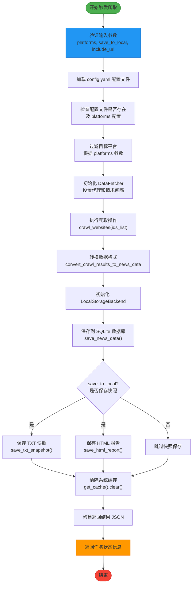

# trigger_crawl 工具

<cite>
**本文档引用的文件**   
- [system.py](file://mcp_server/tools/system.py)
- [server.py](file://mcp_server/server.py)
- [config.yaml](file://config/config.yaml)
- [validators.py](file://mcp_server/utils/validators.py)
- [fetcher.py](file://trendradar/crawler/fetcher.py)
- [base.py](file://trendradar/storage/base.py)
- [local.py](file://trendradar/storage/local.py)
</cite>

## 目录
1. [简介](#简介)
2. [参数详解](#参数详解)
3. [返回结果结构](#返回结果结构)
4. [调用示例](#调用示例)
5. [应用场景](#应用场景)
6. [工作流程](#工作流程)

## 简介

`trigger_crawl` 是一个用于手动触发临时爬取任务的工具，允许用户按需获取特定平台或所有平台的实时热点数据。该工具支持将爬取结果保存到本地 `output` 目录，也可仅临时获取数据而不持久化。它在调试、补爬历史数据或获取最新热点信息时非常有用。

该工具通过读取 `config.yaml` 文件中的配置来确定可用平台，并利用 `DataFetcher` 从 NewsNow API 获取数据。爬取完成后，数据会被转换为标准格式，并可选择性地保存到 SQLite 数据库和 TXT/HTML 文件中。同时，系统会清除缓存以确保后续查询能获取最新数据。

**Section sources**
- [system.py](file://mcp_server/tools/system.py#L68-L267)
- [server.py](file://mcp_server/server.py#L627-L659)

## 参数详解

### platforms 参数

`platforms` 参数用于指定要爬取的目标平台列表。其行为如下：

- **不指定时**：工具会读取 `config.yaml` 文件中 `platforms` 配置项下的所有平台，并对这些平台执行爬取操作。
- **指定时**：传入一个包含平台 ID 的字符串列表（如 `['zhihu']`），仅爬取列表中指定的平台。

平台 ID 必须存在于 `config.yaml` 的配置中，否则会抛出错误。每个平台在配置中都有一个 `id` 和对应的 `name` 字段，例如：
```yaml
- id: "zhihu"
  name: "知乎"
```

系统通过 `validate_platforms` 函数验证传入的平台列表是否有效。如果配置文件加载失败，系统会降级处理，允许所有平台通过验证。

**Section sources**
- [system.py](file://mcp_server/tools/system.py#L99-L130)
- [validators.py](file://mcp_server/utils/validators.py#L42-L87)
- [config.yaml](file://config/config.yaml#L163-L187)

### save_to_local 参数

`save_to_local` 是一个布尔值参数，控制是否将爬取结果保存到本地文件系统。

- **`False`（默认）**：仅将数据保存到 SQLite 数据库中，不会生成 TXT 或 HTML 快照文件。
- **`True`**：除了保存到数据库外，还会生成 TXT 快照和 HTML 报告文件，并存储在 `output` 目录下对应日期的子目录中。

即使 `save_to_local` 为 `False`，数据仍会写入 SQLite 数据库作为核心持久化存储。此参数主要用于控制是否生成便于查看和分享的文本与网页格式快照。

**Section sources**
- [system.py](file://mcp_server/tools/system.py#L181-L204)
- [local.py](file://trendradar/storage/local.py#L585-L639)

### include_url 参数

`include_url` 是一个布尔值参数，决定返回结果中是否包含新闻条目的链接信息。

- **`False`（默认）**：返回结果中不包含 `url` 和 `mobile_url` 字段，有助于减少数据体积和 token 消耗。
- **`True`**：返回结果中会包含每个新闻条目的 `url` 和 `mobile_url` 字段，便于用户直接访问原始内容。

该参数主要影响最终返回给用户的 JSON 数据结构，在数据存储阶段 URL 信息始终会被记录。

**Section sources**
- [system.py](file://mcp_server/tools/system.py#L227-L229)
- [fetcher.py](file://trendradar/crawler/fetcher.py#L157-L158)

## 返回结果结构

`trigger_crawl` 工具返回一个 JSON 格式的任务状态信息对象，包含以下字段：

| 字段名 | 类型 | 说明 |
|--------|------|------|
| `success` | boolean | 操作是否成功 |
| `task_id` | string | 本次爬取任务的唯一标识符 |
| `status` | string | 任务状态，通常为 "completed" |
| `crawl_time` | string | 爬取完成的时间戳（格式：YYYY-MM-DD HH:MM:SS） |
| `platforms` | array | 成功爬取的平台 ID 列表 |
| `failed_platforms` | array | 爬取失败的平台 ID 列表 |
| `total_news` | integer | 本次爬取到的新闻总数 |
| `data` | array | 新闻数据列表，每个条目包含标题、平台信息和排名等 |
| `saved_to_local` | boolean | 数据是否已成功保存到本地 |
| `saved_files` | object | 保存的文件路径映射（当 `save_to_local=true` 时存在） |
| `note` | string | 补充说明信息，如保存状态或失败原因 |

其中 `data` 数组中的每个新闻条目结构如下：
```json
{
  "platform_id": "zhihu",
  "platform_name": "知乎",
  "title": "新闻标题",
  "ranks": [1, 3, 5],
  "url": "https://...",
  "mobile_url": "https://..."
}
```
`ranks` 字段表示该新闻在不同时间点的排名历史。

**Section sources**
- [system.py](file://mcp_server/tools/system.py#L232-L258)
- [base.py](file://trendradar/storage/base.py#L13-L46)

## 调用示例

### 临时爬取微博数据

仅爬取微博平台的最新热搜，不保存到本地文件：

```python
trigger_crawl(platforms=['weibo'])
```

此调用将返回微博平台的热搜列表，数据仅在本次响应中有效，不会生成持久化文件。

### 爬取所有平台数据并保存到本地

爬取 `config.yaml` 中配置的所有平台数据，并生成本地快照文件：

```python
trigger_crawl(save_to_local=True)
```

此调用会：
1. 读取 `config.yaml` 中所有平台配置
2. 依次爬取每个平台的热搜数据
3. 将数据保存到 SQLite 数据库
4. 生成 TXT 和 HTML 格式的快照文件，存储于 `output/YYYY-MM-DD/txt/` 和 `output/YYYY-MM-DD/html/` 目录下

### 爬取知乎数据并包含链接

爬取知乎平台数据，并在返回结果中包含新闻链接：

```python
trigger_crawl(platforms=['zhihu'], include_url=True)
```

返回结果中的每条新闻都将包含 `url` 和 `mobile_url` 字段，方便直接访问。

**Section sources**
- [server.py](file://mcp_server/server.py#L653-L655)
- [system.py](file://mcp_server/tools/system.py#L83-L87)

## 应用场景

### 调试与验证

在开发或配置新平台时，可通过 `trigger_crawl` 手动触发一次爬取，快速验证爬虫是否正常工作。例如，添加一个新的平台 ID 后，可以立即调用该工具测试其数据获取能力。

### 补爬数据

当自动爬取任务因网络或服务问题失败时，可使用此工具手动补爬缺失时间段的数据，确保数据完整性。结合 `sync_from_remote` 工具，还能将补爬数据同步到远程存储。

### 按需获取最新热点

在需要即时了解当前热点事件时（如突发事件、市场动态），可调用 `trigger_crawl` 获取最新数据，而无需等待定时任务。这对于决策支持、舆情监控等场景尤为重要。

### 数据分析与报告生成

通过设置 `save_to_local=True`，可生成便于分析和分享的 TXT 和 HTML 报告。这些文件可用于生成日报、周报或作为数据导出源供其他系统使用。

**Section sources**
- [README-MCP-FAQ-EN.md](file://README-MCP-FAQ-EN.md#L416-L449)

## 工作流程



**Diagram sources**
- [system.py](file://mcp_server/tools/system.py#L89-L261)
- [fetcher.py](file://trendradar/crawler/fetcher.py#L117-L184)
- [base.py](file://trendradar/storage/base.py#L357-L419)
- [local.py](file://trendradar/storage/local.py#L113-L288)

**Section sources**
- [system.py](file://mcp_server/tools/system.py#L68-L267)