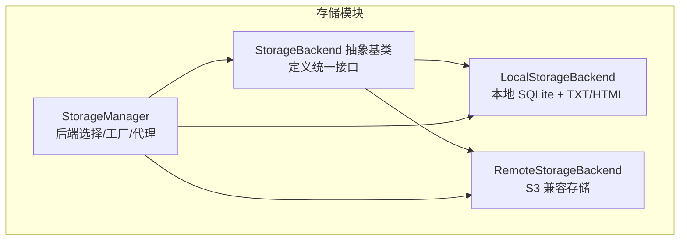
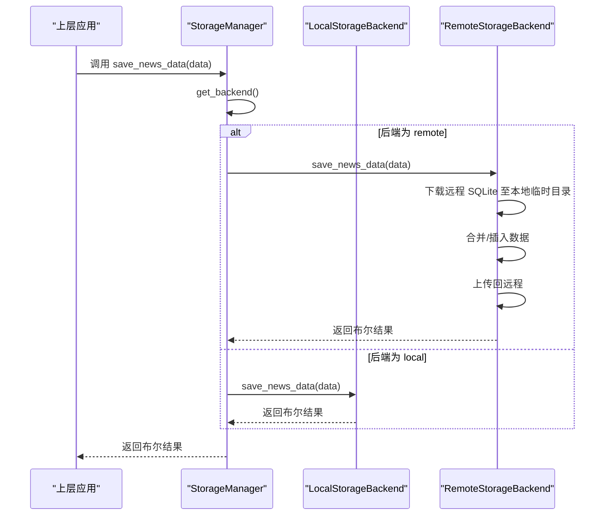
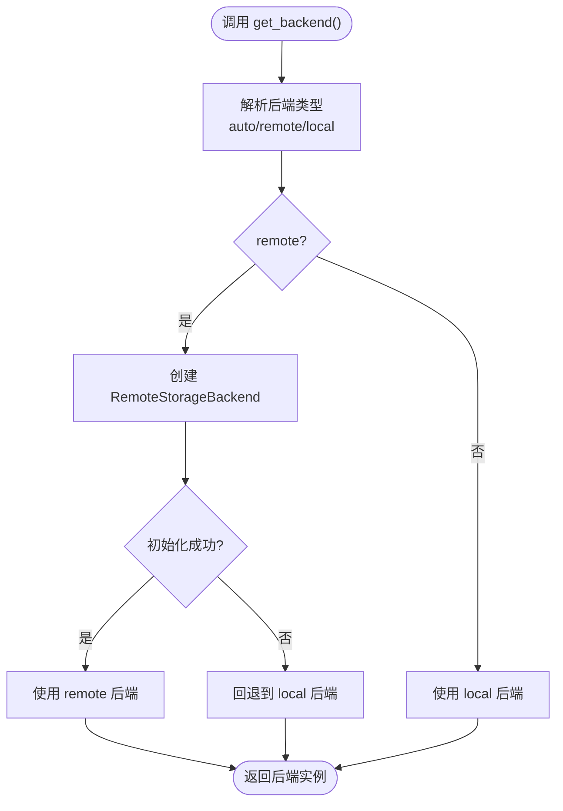
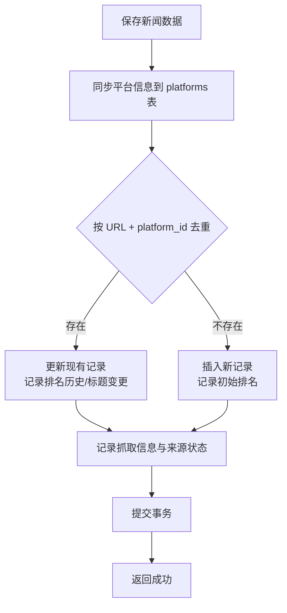
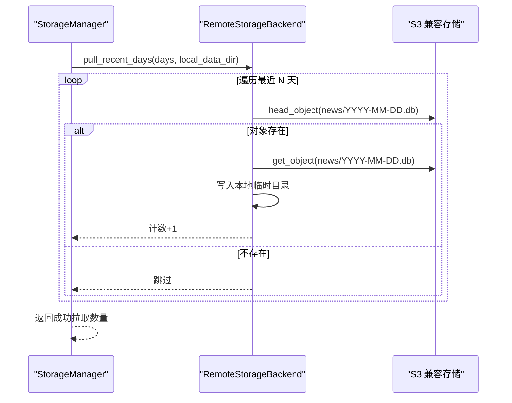
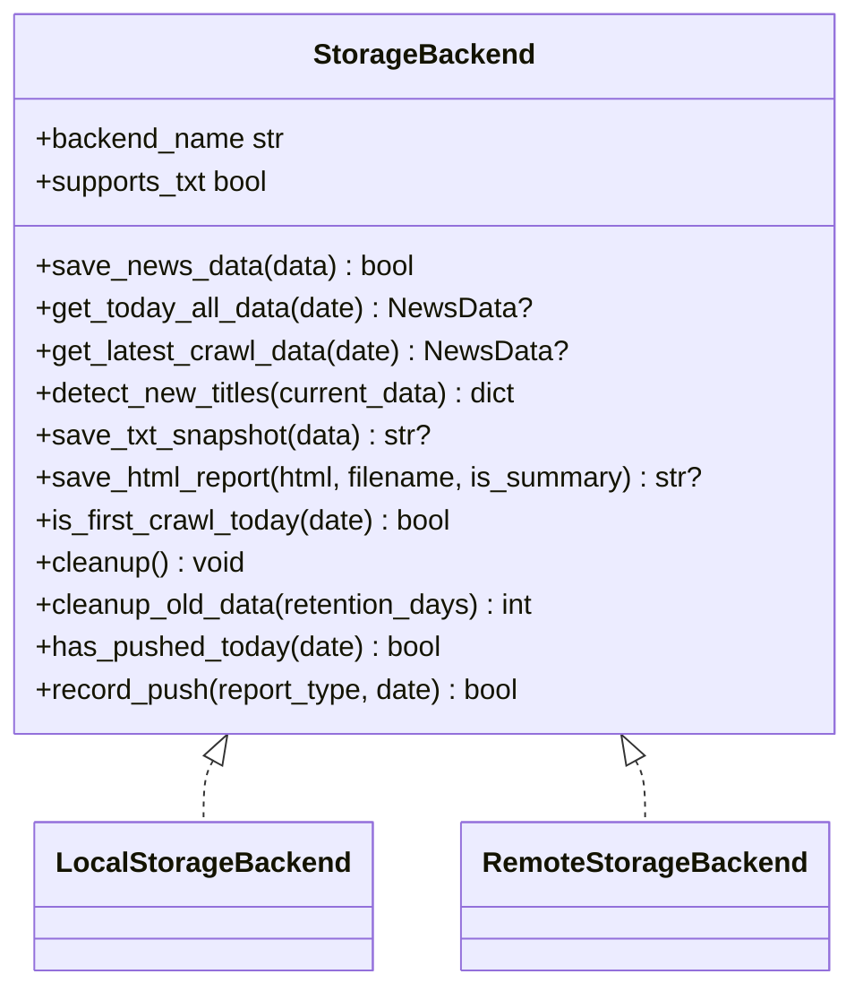
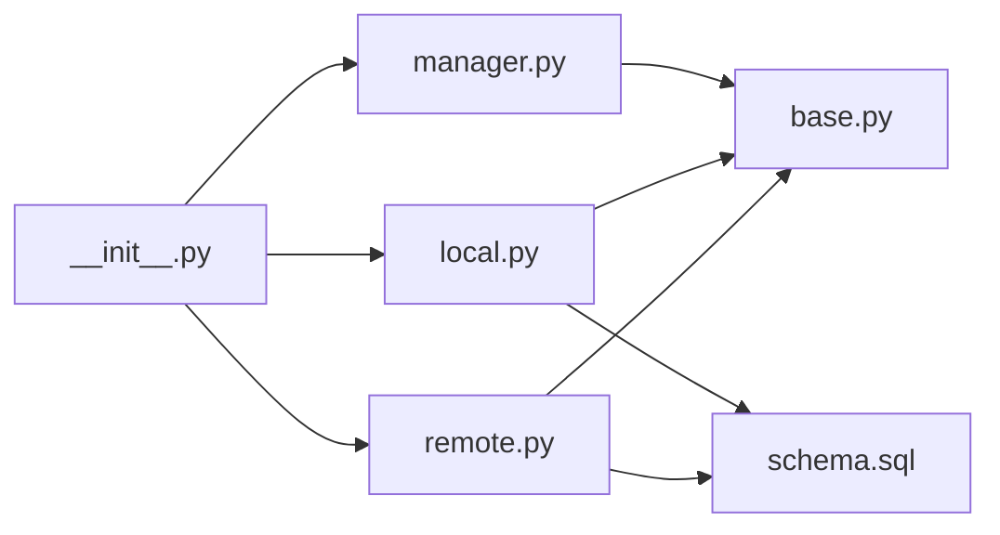

# 内部存储API

<cite>
**本文引用的文件**
- [manager.py](file://trendradar/storage/manager.py)
- [base.py](file://trendradar/storage/base.py)
- [local.py](file://trendradar/storage/local.py)
- [remote.py](file://trendradar/storage/remote.py)
- [schema.sql](file://trendradar/storage/schema.sql)
- [__init__.py](file://trendradar/storage/__init__.py)
- [config.yaml](file://config/config.yaml)
</cite>

## 目录
1. [简介](#简介)
2. [项目结构](#项目结构)
3. [核心组件](#核心组件)
4. [架构总览](#架构总览)
5. [详细组件分析](#详细组件分析)
6. [依赖关系分析](#依赖关系分析)
7. [性能考量](#性能考量)
8. [故障排查指南](#故障排查指南)
9. [结论](#结论)
10. [附录](#附录)

## 简介
本参考文档聚焦于 TrendRadar 内部存储管理API，围绕 StorageManager 类与其统一的存储接口展开，系统性说明：
- 如何根据配置（local/remote/auto）动态选择存储后端；
- 统一的存储操作方法：保存新闻数据、读取当天/最新数据、增量检测、文件输出（TXT/HTML）、推送状态管理；
- 从S3兼容存储拉取数据的流程；
- 过期数据清理逻辑；
- 工厂函数 get_storage_manager 的单例模式与配置参数；
- 为上层应用提供一致接口，屏蔽本地与远程存储差异。

## 项目结构
存储模块采用“抽象基类 + 多后端实现 + 管理器”的分层设计：
- 抽象层：定义统一接口与数据模型；
- 后端层：本地SQLite与远程S3兼容存储；
- 管理器层：根据环境与配置选择后端，提供统一API与辅助能力（拉取、清理、推送记录代理）。

图表来源
- [base.py](file://trendradar/storage/base.py#L187-L355)
- [local.py](file://trendradar/storage/local.py#L25-L120)
- [remote.py](file://trendradar/storage/remote.py#L40-L120)
- [manager.py](file://trendradar/storage/manager.py#L18-L173)

章节来源
- [base.py](file://trendradar/storage/base.py#L1-L120)
- [local.py](file://trendradar/storage/local.py#L1-L120)
- [remote.py](file://trendradar/storage/remote.py#L1-L120)
- [manager.py](file://trendradar/storage/manager.py#L1-L120)

## 核心组件
- StorageBackend 抽象基类：定义所有存储后端必须实现的方法，包括数据保存、读取、增量检测、文件输出、清理、推送记录等。
- LocalStorageBackend：基于 SQLite 的本地存储，支持可选的 TXT 快照与 HTML 报告；提供过期数据清理。
- RemoteStorageBackend：基于 S3 兼容协议的远程存储，支持下载/上传 SQLite、批量拉取历史数据、远程过期清理、推送记录写入与同步。
- StorageManager：统一入口，负责后端选择、远程拉取、过期清理、推送记录代理、单例工厂。

章节来源
- [base.py](file://trendradar/storage/base.py#L187-L355)
- [local.py](file://trendradar/storage/local.py#L25-L120)
- [remote.py](file://trendradar/storage/remote.py#L40-L120)
- [manager.py](file://trendradar/storage/manager.py#L18-L173)

## 架构总览
StorageManager 通过 get_backend() 在运行时解析后端类型（auto/remote/local），并委托具体后端执行统一接口。远程后端在需要时通过临时目录与S3交互，最终将数据持久化至远端对象存储。

图表来源
- [manager.py](file://trendradar/storage/manager.py#L149-L173)
- [remote.py](file://trendradar/storage/remote.py#L312-L512)
- [local.py](file://trendradar/storage/local.py#L113-L292)

章节来源
- [manager.py](file://trendradar/storage/manager.py#L149-L173)
- [remote.py](file://trendradar/storage/remote.py#L312-L512)
- [local.py](file://trendradar/storage/local.py#L113-L292)

## 详细组件分析

### StorageManager：后端选择与工厂
- 后端选择策略
  - backend_type 为 auto 时：
    - 在 GitHub Actions 环境且配置了远程存储时使用 remote；
    - 否则使用 local；
  - 其他情况直接使用配置值。
- get_backend()：惰性创建后端实例，支持回退（remote 初始化失败时回退 local）。
- pull_from_remote()：按配置从远程拉取最近 N 天的 SQLite 文件到本地。
- cleanup_old_data()：分别调用本地与远程后端的清理逻辑，按保留天数删除过期数据。
- 推送记录代理：has_pushed_today()/record_push() 直接委托给当前后端。
- 单例工厂 get_storage_manager()：全局唯一实例，支持 force_new 强制重建。

图表来源
- [manager.py](file://trendradar/storage/manager.py#L93-L173)

章节来源
- [manager.py](file://trendradar/storage/manager.py#L18-L173)
- [manager.py](file://trendradar/storage/manager.py#L175-L199)
- [manager.py](file://trendradar/storage/manager.py#L235-L255)
- [manager.py](file://trendradar/storage/manager.py#L269-L293)
- [manager.py](file://trendradar/storage/manager.py#L295-L344)

### LocalStorageBackend：本地SQLite存储
- 数据模型与表结构：由 schema.sql 定义，包含 platforms、news_items、title_changes、rank_history、crawl_records、crawl_source_status、push_records 等。
- 保存新闻数据：按 URL + platform_id 去重，支持标题变更记录与排名历史追加。
- 读取数据：支持获取当天全部数据与最新一次抓取数据，按平台分组并合并历史排名。
- 增量检测：比较当前批次与历史数据，仅当历史批次中从未出现过才视为新增。
- 文件输出：可选 TXT 快照与 HTML 报告，按日期组织文件。
- 首次抓取判断：若当天仅有一条或零条抓取记录则视为首次。
- 过期清理：遍历本地 output/<date>/news.db，删除超过保留天数的日期目录。

图表来源
- [local.py](file://trendradar/storage/local.py#L113-L292)
- [schema.sql](file://trendradar/storage/schema.sql#L1-L118)

章节来源
- [local.py](file://trendradar/storage/local.py#L113-L292)
- [local.py](file://trendradar/storage/local.py#L293-L524)
- [local.py](file://trendradar/storage/local.py#L526-L584)
- [local.py](file://trendradar/storage/local.py#L585-L671)
- [local.py](file://trendradar/storage/local.py#L673-L734)
- [local.py](file://trendradar/storage/local.py#L746-L800)
- [schema.sql](file://trendradar/storage/schema.sql#L1-L118)

### RemoteStorageBackend：S3兼容远程存储
- 连接与认证：根据 endpoint_url 自动选择签名版本（COS 使用 s3，其他使用 s3v4），支持虚拟主机样式访问。
- 数据流程：下载当天 SQLite 至本地临时目录，合并新数据后上传回远程；上传时显式设置 ContentLength，避免 chunked transfer encoding 问题。
- 读取数据：与本地一致，支持当天全部数据与最新一次抓取数据。
- 增量检测：与本地一致。
- 文件输出：可选 TXT 快照与 HTML 报告，保存在本地临时目录。
- 首次抓取判断：基于抓取记录计数。
- 过期清理：遍历远程 news/ 前缀对象，按日期删除过期数据库文件。
- 推送记录：has_pushed_today()/record_push() 通过 push_records 表实现，写入后同步上传至远程。

图表来源
- [remote.py](file://trendradar/storage/remote.py#L1042-L1098)

章节来源
- [remote.py](file://trendradar/storage/remote.py#L40-L120)
- [remote.py](file://trendradar/storage/remote.py#L178-L274)
- [remote.py](file://trendradar/storage/remote.py#L275-L311)
- [remote.py](file://trendradar/storage/remote.py#L312-L512)
- [remote.py](file://trendradar/storage/remote.py#L513-L697)
- [remote.py](file://trendradar/storage/remote.py#L699-L748)
- [remote.py](file://trendradar/storage/remote.py#L749-L816)
- [remote.py](file://trendradar/storage/remote.py#L817-L835)
- [remote.py](file://trendradar/storage/remote.py#L836-L869)
- [remote.py](file://trendradar/storage/remote.py#L870-L958)
- [remote.py](file://trendradar/storage/remote.py#L959-L1030)
- [remote.py](file://trendradar/storage/remote.py#L1042-L1098)
- [remote.py](file://trendradar/storage/remote.py#L1100-L1129)

### StorageBackend 抽象与数据模型
- 抽象接口：save_news_data/get_today_all_data/get_latest_crawl_data/detect_new_titles/save_txt_snapshot/save_html_report/is_first_crawl_today/cleanup/cleanup_old_data/backend_name/supports_txt/has_pushed_today/record_push。
- 数据模型：NewsItem/NewsData，支持合并、统计与序列化。

图表来源
- [base.py](file://trendradar/storage/base.py#L187-L355)
- [local.py](file://trendradar/storage/local.py#L25-L120)
- [remote.py](file://trendradar/storage/remote.py#L40-L120)

章节来源
- [base.py](file://trendradar/storage/base.py#L187-L355)

## 依赖关系分析
- StorageManager 依赖 StorageBackend 抽象与具体后端实现；
- Local/Remote 后端均依赖 schema.sql 定义的表结构；
- Remote 后端依赖 boto3 与 S3 兼容服务；
- __init__.py 暴露基础类、后端实现与工厂函数。

图表来源
- [manager.py](file://trendradar/storage/manager.py#L1-L40)
- [base.py](file://trendradar/storage/base.py#L1-L40)
- [local.py](file://trendradar/storage/local.py#L1-L40)
- [remote.py](file://trendradar/storage/remote.py#L1-L40)
- [schema.sql](file://trendradar/storage/schema.sql#L1-L40)
- [__init__.py](file://trendradar/storage/__init__.py#L1-L45)

章节来源
- [__init__.py](file://trendradar/storage/__init__.py#L1-L45)

## 性能考量
- 本地存储
  - 使用连接池缓存与索引优化（按平台、抓取时间、标题、URL+平台唯一索引）减少查询开销。
  - 批量查询排名历史，避免 N+1 查询。
- 远程存储
  - 下载/上传使用 get_object + iter_chunks，避免 chunked transfer encoding 问题；
  - 上传时显式设置 ContentLength，提升兼容性；
  - 清理过期数据使用分页器与批量删除，降低网络往返。
- 增量检测
  - 通过 first_time 与当前批次时间比较，避免同一标题多次计为新增。

[本节为通用指导，无需特定文件来源]

## 故障排查指南
- 远程后端导入失败或缺少 boto3
  - 现象：初始化 remote 后端失败并回退 local。
  - 处理：安装 boto3 并检查 S3 配置。
- 远程配置缺失
  - 现象：pull_from_remote 返回 0，提示未配置远程存储。
  - 处理：在配置文件或环境变量中补齐 endpoint_url、bucket_name、access_key_id、secret_access_key。
- 上传/下载异常
  - 现象：上传/下载失败或验证失败。
  - 处理：检查签名版本、endpoint_url、网络连通性与权限。
- 首次抓取误判
  - 现象：is_first_crawl_today 返回异常。
  - 处理：确认当天抓取记录数量与时间字段。
- 过期清理无效
  - 现象：保留天数设置后未删除过期数据。
  - 处理：确认 retention_days 设置与日期格式（ISO/中文格式均支持）。

章节来源
- [manager.py](file://trendradar/storage/manager.py#L107-L148)
- [manager.py](file://trendradar/storage/manager.py#L175-L199)
- [remote.py](file://trendradar/storage/remote.py#L178-L274)
- [remote.py](file://trendradar/storage/remote.py#L870-L958)
- [local.py](file://trendradar/storage/local.py#L673-L734)

## 结论
StorageManager 通过统一抽象与后端选择机制，为上层应用提供了稳定一致的存储接口。无论本地还是远程，均可透明地进行数据保存、读取、增量检测、文件输出与推送状态管理。配合远程拉取与过期清理能力，满足多部署场景下的数据一致性与成本控制需求。

[本节为总结，无需特定文件来源]

## 附录

### API 方法一览与说明
- get_backend()
  - 依据 backend_type 与运行环境解析后端类型，惰性创建并返回 StorageBackend 实例。
  - 参考路径：[manager.py](file://trendradar/storage/manager.py#L149-L173)
- save_news_data(data)
  - 保存新闻数据，支持去重与历史合并。
  - 参考路径：[manager.py](file://trendradar/storage/manager.py#L200-L203)，[local.py](file://trendradar/storage/local.py#L113-L292)，[remote.py](file://trendradar/storage/remote.py#L312-L512)
- get_today_all_data(date)
  - 获取指定日期的合并数据。
  - 参考路径：[manager.py](file://trendradar/storage/manager.py#L204-L207)，[local.py](file://trendradar/storage/local.py#L293-L409)，[remote.py](file://trendradar/storage/remote.py#L513-L617)
- get_latest_crawl_data(date)
  - 获取最新一次抓取的数据。
  - 参考路径：[manager.py](file://trendradar/storage/manager.py#L208-L211)，[local.py](file://trendradar/storage/local.py#L410-L524)，[remote.py](file://trendradar/storage/remote.py#L618-L697)
- detect_new_titles(current_data)
  - 增量检测：仅返回历史批次中从未出现过的标题。
  - 参考路径：[manager.py](file://trendradar/storage/manager.py#L212-L215)，[local.py](file://trendradar/storage/local.py#L526-L584)，[remote.py](file://trendradar/storage/remote.py#L699-L748)
- save_txt_snapshot(data)
  - 保存 TXT 快照（本地默认启用，远程默认禁用）。
  - 参考路径：[manager.py](file://trendradar/storage/manager.py#L216-L219)，[local.py](file://trendradar/storage/local.py#L585-L640)，[remote.py](file://trendradar/storage/remote.py#L749-L794)
- save_html_report(html_content, filename, is_summary)
  - 保存 HTML 报告。
  - 参考路径：[manager.py](file://trendradar/storage/manager.py#L220-L223)，[local.py](file://trendradar/storage/local.py#L641-L671)，[remote.py](file://trendradar/storage/remote.py#L795-L816)
- is_first_crawl_today(date)
  - 检查当天是否为首次抓取。
  - 参考路径：[manager.py](file://trendradar/storage/manager.py#L224-L227)，[local.py](file://trendradar/storage/local.py#L673-L704)，[remote.py](file://trendradar/storage/remote.py#L817-L835)
- cleanup_old_data()
  - 清理本地与远程过期数据，返回删除的日期数量。
  - 参考路径：[manager.py](file://trendradar/storage/manager.py#L235-L255)，[local.py](file://trendradar/storage/local.py#L746-L800)，[remote.py](file://trendradar/storage/remote.py#L870-L958)
- has_pushed_today(date) / record_push(report_type, date)
  - 推送状态管理：查询与记录今日推送。
  - 参考路径：[manager.py](file://trendradar/storage/manager.py#L269-L293)，[remote.py](file://trendradar/storage/remote.py#L959-L1030)
- pull_from_remote()
  - 从远程拉取最近 N 天数据到本地。
  - 参考路径：[manager.py](file://trendradar/storage/manager.py#L175-L199)，[remote.py](file://trendradar/storage/remote.py#L1042-L1098)
- get_storage_manager(...)
  - 单例工厂，支持 backend_type、data_dir、enable_txt、enable_html、remote_config、local_retention_days、remote_retention_days、pull_enabled、pull_days、timezone、force_new。
  - 参考路径：[manager.py](file://trendradar/storage/manager.py#L295-L344)，[__init__.py](file://trendradar/storage/__init__.py#L1-L45)

### 配置参数与示例
- 配置文件位置与关键项
  - 存储后端选择：storage.backend（local/remote/auto）
  - 本地存储：storage.local.data_dir、storage.local.retention_days
  - 远程存储：storage.remote.endpoint_url、storage.remote.bucket_name、storage.remote.access_key_id、storage.remote.secret_access_key、storage.remote.region、storage.remote.retention_days
  - 拉取配置：storage.pull.enabled、storage.pull.days
  - 参考路径：[config.yaml](file://config/config.yaml#L12-L52)
- 获取存储管理器实例并调用方法
  - 获取实例：调用 get_storage_manager(...)，传入所需参数。
  - 调用示例（路径引用而非代码）：
    - 保存数据：[manager.py](file://trendradar/storage/manager.py#L200-L203)
    - 读取当天数据：[manager.py](file://trendradar/storage/manager.py#L204-L207)
    - 增量检测：[manager.py](file://trendradar/storage/manager.py#L212-L215)
    - 保存报告：[manager.py](file://trendradar/storage/manager.py#L220-L223)
    - 拉取远程数据：[manager.py](file://trendradar/storage/manager.py#L175-L199)
    - 清理过期数据：[manager.py](file://trendradar/storage/manager.py#L235-L255)
    - 推送状态管理：[manager.py](file://trendradar/storage/manager.py#L269-L293)

章节来源
- [config.yaml](file://config/config.yaml#L12-L52)
- [manager.py](file://trendradar/storage/manager.py#L295-L344)