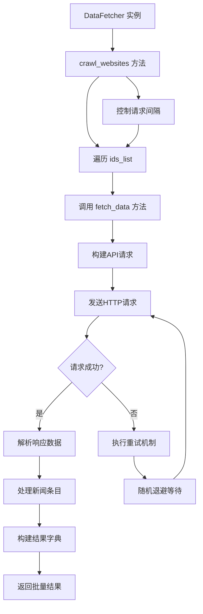

# 内部数据API

<cite>
**本文档引用的文件**   
- [fetcher.py](file://trendradar/crawler/fetcher.py)
- [config.yaml](file://config/config.yaml)
- [__main__.py](file://trendradar/__main__.py)
- [system.py](file://mcp_server/tools/system.py)
- [context.py](file://trendradar/context.py)
</cite>

## 目录
1. [简介](#简介)
2. [核心组件](#核心组件)
3. [数据流架构](#数据流架构)
4. [DataFetcher类接口文档](#datafetcher类接口文档)
5. [配置与参数说明](#配置与参数说明)
6. [使用示例](#使用示例)
7. [错误处理与重试机制](#错误处理与重试机制)

## 简介
TrendRadar项目通过`DataFetcher`类实现从NewsNow API获取各平台热搜数据的功能。该类提供了两个核心方法：`fetch_data`用于获取单个平台数据，`crawl_websites`用于批量爬取多个平台数据。数据获取过程支持代理配置、自定义API地址、请求间隔控制和自动重试机制。平台配置在`config.yaml`文件中定义，支持灵活的平台ID和别名管理。

## 核心组件

`DataFetcher`类是TrendRadar数据获取的核心组件，负责与NewsNow API进行交互。该类封装了HTTP请求、错误处理、重试逻辑和数据解析等复杂性，为上层应用提供简洁的接口。`fetch_data`方法作为基础单元，实现单个平台的数据获取；`crawl_websites`方法作为批量控制器，协调多个平台的数据爬取。两个方法协同工作，构成了完整的数据获取流程。

**本文档引用的文件**   
- [fetcher.py](file://trendradar/crawler/fetcher.py)
- [config.yaml](file://config/config.yaml)

## 数据流架构



**图表来源**
- [fetcher.py](file://trendradar/crawler/fetcher.py#L117-L184)

## DataFetcher类接口文档

### fetch_data方法
`fetch_data`方法用于获取指定平台的原始数据。该方法根据平台ID向NewsNow API发起请求，获取最新的热搜数据。

**方法签名**
```python
def fetch_data(
    self,
    id_info: Union[str, Tuple[str, str]],
    max_retries: int = 2,
    min_retry_wait: int = 3,
    max_retry_wait: int = 5,
) -> Tuple[Optional[str], str, str]:
```

**参数说明**
- `id_info`: 平台标识，支持字符串或元组格式。字符串格式直接作为平台ID（如'zhihu'），元组格式为(平台ID, 别名)（如('zhihu', '知乎')）
- `max_retries`: 最大重试次数，默认为2次
- `min_retry_wait`: 重试最小等待时间（秒），默认为3秒
- `max_retry_wait`: 重试最大等待时间（秒），默认为5秒

**返回值**
返回三元组(响应文本, 平台ID, 别名)。请求成功时，响应文本为JSON格式的字符串；请求失败时，响应文本为None。

**内部流程**
1. 解析`id_info`参数，提取平台ID和别名
2. 构建API请求URL
3. 配置代理（如果已设置）
4. 发起HTTP GET请求
5. 验证响应状态和JSON格式
6. 处理成功或失败情况

**本文档引用的文件**   
- [fetcher.py](file://trendradar/crawler/fetcher.py#L50-L115)

### crawl_websites方法
`crawl_websites`方法用于批量爬取多个平台的数据。该方法协调多个`fetch_data`调用，实现批量数据获取。

**方法签名**
```python
def crawl_websites(
    self,
    ids_list: List[Union[str, Tuple[str, str]]],
    request_interval: int = 100,
) -> Tuple[Dict, Dict, List]:
```

**参数说明**
- `ids_list`: 平台ID列表，每个元素可以是字符串或(平台ID, 别名)元组
- `request_interval`: 请求间隔（毫秒），默认为100毫秒

**返回值**
返回三元组(结果字典, ID到名称的映射, 失败列表)：
- 结果字典：以平台ID为键，包含标题、排名、URL等信息的嵌套字典
- ID到名称的映射：平台ID到显示名称的映射字典
- 失败列表：获取失败的平台ID列表

**内部流程**
1. 初始化结果容器
2. 遍历`ids_list`中的每个平台标识
3. 调用`fetch_data`方法获取单个平台数据
4. 解析和结构化响应数据
5. 控制请求间隔，避免过于频繁的请求
6. 汇总成功和失败的结果

**本文档引用的文件**   
- [fetcher.py](file://trendradar/crawler/fetcher.py#L117-L184)

## 配置与参数说明

### 平台配置
平台配置在`config/config.yaml`文件中定义，采用ID和名称分离的设计。这种设计允许在不改变数据抓取逻辑的情况下修改平台显示名称。

```yaml
platforms:
  - id: "toutiao"
    name: "今日头条"
  - id: "baidu"
    name: "百度热搜"
  - id: "zhihu"
    name: "知乎"
  - id: "weibo"
    name: "微博"
```

当使用`crawl_websites`方法时，系统会自动将配置中的平台信息转换为(平台ID, 别名)元组列表，确保数据获取和显示的一致性。

**本文档引用的文件**   
- [config.yaml](file://config/config.yaml#L164-L187)
- [system.py](file://mcp_server/tools/system.py#L132-L138)

### 代理与API配置
`DataFetcher`类支持通过构造函数参数配置代理和自定义API地址：

```python
fetcher = DataFetcher(
    proxy_url="http://127.0.0.1:10801",  # 代理服务器URL
    api_url="https://custom.newsnow.api"  # 自定义API地址
)
```

- `proxy_url`: 指定HTTP/HTTPS代理服务器地址，用于绕过网络限制
- `api_url`: 指定NewsNow API的基础URL，默认为`https://newsnow.busiyi.world/api/s`

这些配置使得`DataFetcher`具有良好的灵活性和可配置性，能够适应不同的部署环境和网络条件。

**本文档引用的文件**   
- [fetcher.py](file://trendradar/crawler/fetcher.py#L35-L49)
- [__main__.py](file://trendradar/__main__.py#L120-L121)

## 使用示例

### 基本使用
以下示例展示如何实例化`DataFetcher`并调用其方法进行数据抓取：

```python
# 创建DataFetcher实例
fetcher = DataFetcher()

# 单个平台数据获取
response_text, platform_id, alias = fetcher.fetch_data('zhihu')
if response_text:
    print(f"成功获取{alias}数据")
    # 处理响应数据
    data = json.loads(response_text)
else:
    print(f"获取{alias}数据失败")

# 批量平台数据获取
platforms = [
    'zhihu',
    ('weibo', '新浪微博'),
    ('baidu', '百度热搜')
]
results, id_to_name, failed_ids = fetcher.crawl_websites(
    ids_list=platforms,
    request_interval=200  # 200毫秒间隔
)

print(f"成功获取{len(results)}个平台数据")
print(f"失败平台: {failed_ids}")
```

### 高级使用
结合配置文件中的平台列表进行批量抓取：

```python
# 从配置中获取所有监控平台
from trendradar.context import AppContext
ctx = AppContext(config)
platform_ids = ctx.platform_ids

# 构建带别名的平台列表
ids_list = []
for platform_id in platform_ids:
    # 查找平台配置获取名称
    platform_config = next((p for p in ctx.platforms if p['id'] == platform_id), None)
    if platform_config and 'name' in platform_config:
        ids_list.append((platform_id, platform_config['name']))
    else:
        ids_list.append(platform_id)

# 批量爬取
fetcher = DataFetcher(proxy_url="http://127.0.0.1:10801")
results, id_to_name, failed_ids = fetcher.crawl_websites(
    ids_list=ids_list,
    request_interval=150
)
```

**本文档引用的文件**   
- [fetcher.py](file://trendradar/crawler/fetcher.py)
- [__main__.py](file://trendradar/__main__.py#L120-L121)
- [context.py](file://trendradar/context.py#L98-L101)
- [system.py](file://mcp_server/tools/system.py#L132-L138)

## 错误处理与重试机制

### 重试算法
`fetch_data`方法实现了智能的重试机制，采用随机退避算法避免请求洪峰：

```python
# 重试等待时间计算
base_wait = random.uniform(min_retry_wait, max_retry_wait)  # 基础随机等待
additional_wait = (retries - 1) * random.uniform(1, 2)      # 递增等待
wait_time = base_wait + additional_wait                     # 总等待时间
```

这种算法确保了：
1. 每次重试的等待时间在一定范围内随机，避免多个实例同时重试
2. 随着重试次数增加，等待时间逐渐延长，减轻服务器压力
3. 初始等待时间较短，快速响应临时网络问题

### 错误处理
`fetch_data`方法捕获所有异常并进行分类处理：

```python
try:
    # 发起请求
    response = requests.get(...)
    response.raise_for_status()
    
    # 验证响应状态
    data_json = json.loads(data_text)
    status = data_json.get("status", "未知")
    if status not in ["success", "cache"]:
        raise ValueError(f"响应状态异常: {status}")
        
except Exception as e:
    # 统一异常处理
    retries += 1
    if retries <= max_retries:
        # 执行重试
        time.sleep(wait_time)
    else:
        # 返回失败结果
        return None, id_value, alias
```

错误处理流程包括：
1. 网络连接错误（超时、连接拒绝等）
2. HTTP状态码错误（4xx、5xx）
3. 响应数据格式错误（非JSON、状态异常）
4. 数据解析错误

所有错误都被捕获并转换为统一的返回格式，确保调用方可以一致地处理成功和失败情况。

**本文档引用的文件**   
- [fetcher.py](file://trendradar/crawler/fetcher.py#L83-L115)