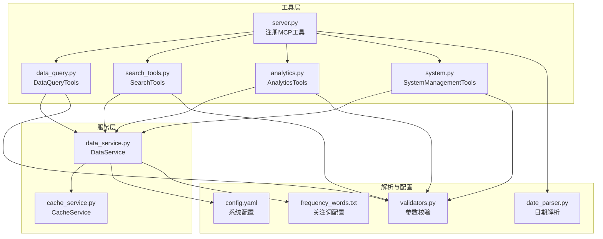
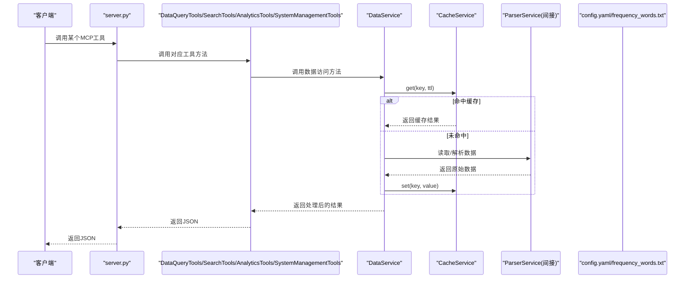
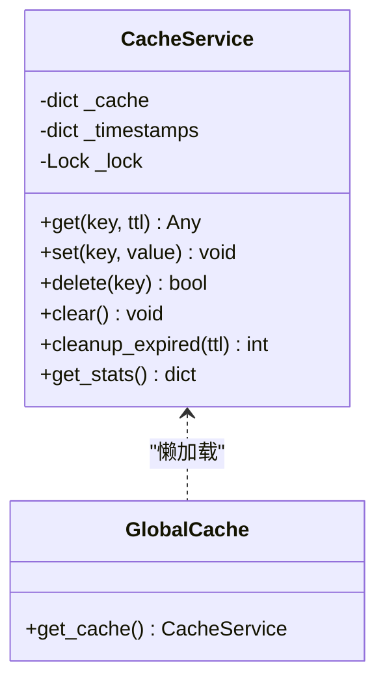
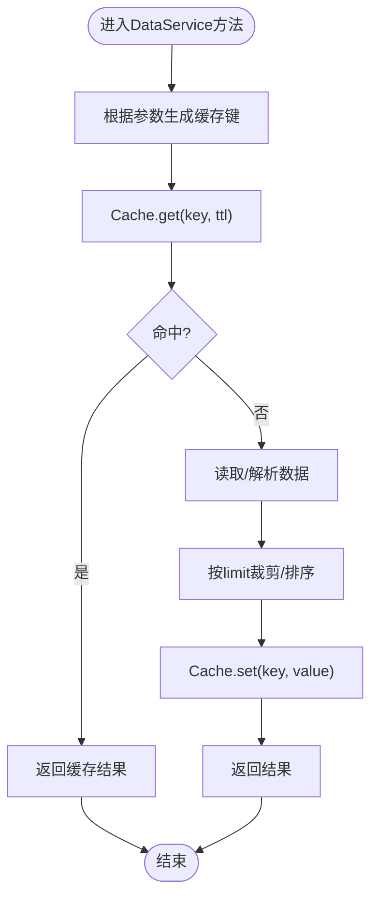
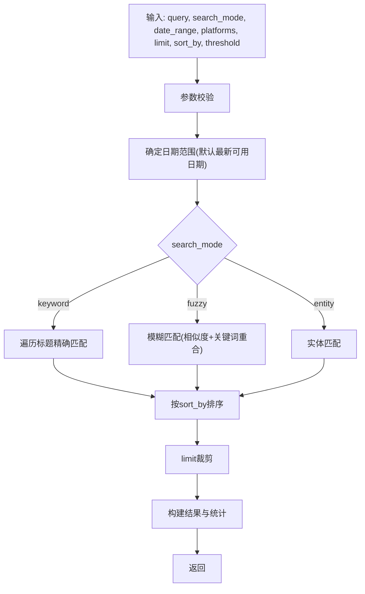
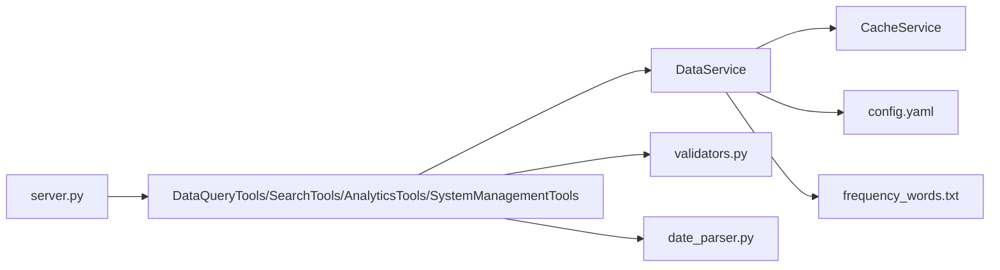

# API性能优化建议

<cite>
**本文引用的文件**
- [mcp_server/server.py](file://mcp_server/server.py)
- [mcp_server/services/cache_service.py](file://mcp_server/services/cache_service.py)
- [mcp_server/services/data_service.py](file://mcp_server/services/data_service.py)
- [mcp_server/tools/search_tools.py](file://mcp_server/tools/search_tools.py)
- [mcp_server/tools/data_query.py](file://mcp_server/tools/data_query.py)
- [mcp_server/tools/analytics.py](file://mcp_server/tools/analytics.py)
- [mcp_server/tools/system.py](file://mcp_server/tools/system.py)
- [mcp_server/utils/validators.py](file://mcp_server/utils/validators.py)
- [mcp_server/utils/date_parser.py](file://mcp_server/utils/date_parser.py)
- [config/config.yaml](file://config/config.yaml)
- [config/frequency_words.txt](file://config/frequency_words.txt)
- [requirements.txt](file://requirements.txt)
</cite>

## 目录
1. [简介](#简介)
2. [项目结构](#项目结构)
3. [核心组件](#核心组件)
4. [架构总览](#架构总览)
5. [详细组件分析](#详细组件分析)
6. [依赖关系分析](#依赖关系分析)
7. [性能考量与优化策略](#性能考量与优化策略)
8. [故障排查指南](#故障排查指南)
9. [结论](#结论)
10. [附录](#附录)

## 简介
本指南围绕TrendRadar MCP服务器的API性能优化展开，结合代码实现与配置，系统化提出以下优化方向：
- 合理使用limit参数控制数据量，避免一次性返回过多数据
- 利用系统内置缓存机制（TTL缓存）提升响应速度
- 采用分批查询与日期范围控制，高效处理历史数据
- 明确不同搜索模式（keyword、fuzzy、entity）的性能特征与选择建议
- 提供监控缓存命中率（hit_rate）的方法与缓存清理策略
- 结合实际测试与调优案例，帮助开发者最大化API调用效率

## 项目结构
系统采用“工具层-服务层-缓存层-解析层”的分层架构，核心API集中在server.py中，通过工具类（DataQueryTools、SearchTools、AnalyticsTools、SystemManagementTools）调用DataService进行数据访问，并通过CacheService实现TTL缓存。

图表来源
- [mcp_server/server.py](file://mcp_server/server.py#L1-L120)
- [mcp_server/tools/data_query.py](file://mcp_server/tools/data_query.py#L1-L120)
- [mcp_server/tools/search_tools.py](file://mcp_server/tools/search_tools.py#L1-L120)
- [mcp_server/tools/analytics.py](file://mcp_server/tools/analytics.py#L1-L120)
- [mcp_server/tools/system.py](file://mcp_server/tools/system.py#L1-L120)
- [mcp_server/services/data_service.py](file://mcp_server/services/data_service.py#L1-L120)
- [mcp_server/services/cache_service.py](file://mcp_server/services/cache_service.py#L1-L120)
- [mcp_server/utils/validators.py](file://mcp_server/utils/validators.py#L1-L120)
- [mcp_server/utils/date_parser.py](file://mcp_server/utils/date_parser.py#L1-L120)
- [config/config.yaml](file://config/config.yaml#L1-L140)
- [config/frequency_words.txt](file://config/frequency_words.txt#L1-L114)

章节来源
- [mcp_server/server.py](file://mcp_server/server.py#L1-L120)
- [mcp_server/services/data_service.py](file://mcp_server/services/data_service.py#L1-L120)

## 核心组件
- 缓存服务（CacheService）：提供TTL缓存、清理过期、统计信息等能力，用于加速热点数据访问
- 数据服务（DataService）：封装数据访问逻辑，统一读取解析器输出，实现缓存命中与结果缓存
- 搜索工具（SearchTools）：实现keyword/fuzzy/entity三种搜索模式，支持分页与排序
- 数据查询工具（DataQueryTools）：提供最新新闻、按日期查询、趋势话题等基础查询
- 分析工具（AnalyticsTools）：提供趋势分析、平台对比、情感分析、关键词共现等高级分析
- 系统工具（SystemManagementTools）：提供系统状态查询与临时爬取触发
- 参数校验（validators）：统一参数校验与默认值处理
- 日期解析（date_parser）：统一日期表达式解析，保证日期一致性

章节来源
- [mcp_server/services/cache_service.py](file://mcp_server/services/cache_service.py#L1-L137)
- [mcp_server/services/data_service.py](file://mcp_server/services/data_service.py#L1-L200)
- [mcp_server/tools/search_tools.py](file://mcp_server/tools/search_tools.py#L1-L200)
- [mcp_server/tools/data_query.py](file://mcp_server/tools/data_query.py#L1-L120)
- [mcp_server/tools/analytics.py](file://mcp_server/tools/analytics.py#L1-L120)
- [mcp_server/tools/system.py](file://mcp_server/tools/system.py#L1-L120)
- [mcp_server/utils/validators.py](file://mcp_server/utils/validators.py#L1-L120)
- [mcp_server/utils/date_parser.py](file://mcp_server/utils/date_parser.py#L1-L120)

## 架构总览
API调用链路如下：客户端调用server.py中注册的MCP工具，工具类通过DataService访问数据，DataService内部使用CacheService进行缓存，最终返回JSON结果。

图表来源
- [mcp_server/server.py](file://mcp_server/server.py#L110-L220)
- [mcp_server/tools/data_query.py](file://mcp_server/tools/data_query.py#L1-L120)
- [mcp_server/tools/search_tools.py](file://mcp_server/tools/search_tools.py#L1-L120)
- [mcp_server/tools/analytics.py](file://mcp_server/tools/analytics.py#L1-L120)
- [mcp_server/tools/system.py](file://mcp_server/tools/system.py#L1-L120)
- [mcp_server/services/data_service.py](file://mcp_server/services/data_service.py#L1-L120)
- [mcp_server/services/cache_service.py](file://mcp_server/services/cache_service.py#L1-L120)

## 详细组件分析

### 缓存服务（CacheService）
- TTL缓存：get(key, ttl)在ttl时间内返回缓存；过期则删除并返回None
- 并发安全：使用线程锁保护缓存字典与时间戳字典
- 清理策略：cleanup_expired(ttl)清理过期项；clear()清空所有
- 统计信息：get_stats()返回总条目数、最老/最新条目年龄
- 全局实例：get_cache()懒加载单例

图表来源
- [mcp_server/services/cache_service.py](file://mcp_server/services/cache_service.py#L1-L137)

章节来源
- [mcp_server/services/cache_service.py](file://mcp_server/services/cache_service.py#L1-L137)

### 数据服务（DataService）
- 最新新闻缓存：latest_news缓存15分钟；按平台、limit、include_url拼key
- 按日期查询缓存：news_by_date缓存30分钟；按日期、平台、limit、include_url拼key
- 趋势话题缓存：trending_topics缓存30分钟
- 配置缓存：config按节缓存1小时
- 系统状态：get_system_status()返回缓存统计信息
- 历史扫描：get_available_date_range()扫描output目录获取可用日期范围

图表来源
- [mcp_server/services/data_service.py](file://mcp_server/services/data_service.py#L1-L200)
- [mcp_server/services/cache_service.py](file://mcp_server/services/cache_service.py#L1-L120)

章节来源
- [mcp_server/services/data_service.py](file://mcp_server/services/data_service.py#L1-L200)

### 搜索工具（SearchTools）
- 统一搜索接口：search_news_unified(query, search_mode, date_range, platforms, limit, sort_by, threshold)
- 搜索模式：
  - keyword：精确包含匹配，返回相似度1.0，排序按权重或日期
  - fuzzy：综合相似度（文本相似度70%+关键词重合30%），阈值过滤
  - entity：实体名称匹配，返回相似度1.0
- 历史相关：search_related_news_history(reference_text, time_preset, threshold, limit)
- 分页与排序：按relevance/weight/date排序，limit裁剪
- 日期范围：若未提供date_range，默认使用最新可用日期（避免全量扫描）

图表来源
- [mcp_server/tools/search_tools.py](file://mcp_server/tools/search_tools.py#L1-L240)

章节来源
- [mcp_server/tools/search_tools.py](file://mcp_server/tools/search_tools.py#L1-L240)

### 数据查询工具（DataQueryTools）
- get_latest_news：获取最新新闻，支持平台过滤与limit
- get_news_by_date：按日期查询新闻，支持自然语言日期解析
- get_trending_topics：基于关注词列表统计频率，支持daily/current模式

章节来源
- [mcp_server/tools/data_query.py](file://mcp_server/tools/data_query.py#L1-L285)

### 分析工具（AnalyticsTools）
- analyze_topic_trend_unified：统一话题趋势分析（trend/lifecycle/viral/predict）
- analyze_data_insights_unified：平台对比/活跃度/关键词共现
- analyze_sentiment：情感分析，支持去重与权重排序

章节来源
- [mcp_server/tools/analytics.py](file://mcp_server/tools/analytics.py#L1-L200)

### 系统工具（SystemManagementTools）
- get_system_status：获取系统状态与缓存统计
- trigger_crawl：手动触发临时爬取，支持保存到本地output目录

章节来源
- [mcp_server/tools/system.py](file://mcp_server/tools/system.py#L1-L120)

## 依赖关系分析
- 工具层依赖服务层：工具类通过DataService访问数据
- 服务层依赖缓存层：DataService在关键查询上使用CacheService
- 工具层依赖校验与日期解析：validators提供参数校验，date_parser提供日期解析
- 配置与关注词：config.yaml与frequency_words.txt为系统行为提供配置依据

图表来源
- [mcp_server/server.py](file://mcp_server/server.py#L1-L120)
- [mcp_server/tools/data_query.py](file://mcp_server/tools/data_query.py#L1-L120)
- [mcp_server/tools/search_tools.py](file://mcp_server/tools/search_tools.py#L1-L120)
- [mcp_server/tools/analytics.py](file://mcp_server/tools/analytics.py#L1-L120)
- [mcp_server/tools/system.py](file://mcp_server/tools/system.py#L1-L120)
- [mcp_server/services/data_service.py](file://mcp_server/services/data_service.py#L1-L120)
- [mcp_server/utils/validators.py](file://mcp_server/utils/validators.py#L1-L120)
- [mcp_server/utils/date_parser.py](file://mcp_server/utils/date_parser.py#L1-L120)
- [config/config.yaml](file://config/config.yaml#L1-L140)
- [config/frequency_words.txt](file://config/frequency_words.txt#L1-L114)

章节来源
- [mcp_server/server.py](file://mcp_server/server.py#L1-L120)
- [mcp_server/services/data_service.py](file://mcp_server/services/data_service.py#L1-L120)

## 性能考量与优化策略

### 1. 合理使用limit参数控制数据量
- 限制返回条数：所有查询工具均支持limit参数，且存在最大上限（如50/100/500），避免一次性返回过多数据
- 分页策略：对于历史数据查询，建议使用较小limit并结合日期范围逐步拉取
- 去重与权重：情感分析工具在返回前进行去重与权重排序，减少下游处理成本

章节来源
- [mcp_server/tools/data_query.py](file://mcp_server/tools/data_query.py#L1-L120)
- [mcp_server/tools/search_tools.py](file://mcp_server/tools/search_tools.py#L1-L120)
- [mcp_server/tools/analytics.py](file://mcp_server/tools/analytics.py#L600-L800)

### 2. 利用系统缓存机制提升响应速度
- 缓存键设计：按查询参数（平台、日期、limit、include_url等）生成唯一键，避免误命中
- TTL策略：
  - 最新新闻：15分钟
  - 按日期查询：30分钟
  - 趋势话题：30分钟
  - 配置：1小时
- 命中率监控：通过系统状态接口获取缓存统计（总条目、最老/最新条目年龄），评估命中情况
- 清理策略：定期调用cleanup_expired清理过期项，必要时使用clear清空缓存

章节来源
- [mcp_server/services/data_service.py](file://mcp_server/services/data_service.py#L1-L200)
- [mcp_server/services/cache_service.py](file://mcp_server/services/cache_service.py#L1-L120)
- [mcp_server/tools/system.py](file://mcp_server/tools/system.py#L1-L120)

### 3. 采用分批查询处理历史数据
- 日期范围控制：优先使用resolve_date_range工具解析自然语言日期，确保日期范围一致且可控
- 分批拉取：对历史数据查询（如按日期范围或关键词搜索），建议按天或按周分批处理，避免一次性扫描整个历史区间
- 搜索模式选择：keyword模式适合精确匹配，fuzzy模式适合内容片段匹配但需设置合适阈值，entity模式适合实体检索

章节来源
- [mcp_server/server.py](file://mcp_server/server.py#L1-L120)
- [mcp_server/utils/date_parser.py](file://mcp_server/utils/date_parser.py#L1-L120)
- [mcp_server/tools/search_tools.py](file://mcp_server/tools/search_tools.py#L1-L240)

### 4. 不同搜索模式的性能特征与选择建议
- keyword（精确关键词匹配）
  - 特征：O(N)遍历标题，相似度1.0，排序灵活
  - 适用：精确话题检索、实体名称检索
- fuzzy（模糊内容匹配）
  - 特征：综合相似度（文本相似度70%+关键词重合30%），阈值过滤
  - 适用：内容片段检索、模糊匹配场景
  - 建议：合理设置阈值，避免返回过多低质量结果
- entity（实体名称搜索）
  - 特征：精确包含实体名称，相似度1.0
  - 适用：人物/地点/机构等实体检索

章节来源
- [mcp_server/tools/search_tools.py](file://mcp_server/tools/search_tools.py#L1-L240)

### 5. 监控缓存命中率（hit_rate）与缓存清理策略
- 命中率监控：通过系统状态接口获取缓存统计信息，结合业务场景评估命中率
- 清理策略：
  - 定期清理：调用cleanup_expired清理过期项
  - 全量清理：在配置变更或缓存异常时使用clear清空
  - TTL调整：根据业务热点调整不同接口的TTL

章节来源
- [mcp_server/services/cache_service.py](file://mcp_server/services/cache_service.py#L1-L120)
- [mcp_server/tools/system.py](file://mcp_server/tools/system.py#L1-L120)

### 6. 实际性能测试与调优案例
- 测试维度建议：
  - 响应时间：记录从工具调用到返回JSON的耗时
  - 缓存命中率：统计缓存命中次数/总查询次数
  - 数据量：不同limit下的吞吐量与内存占用
  - 搜索模式：keyword/fuzzy/entity在不同阈值下的性能差异
- 调优建议：
  - 优先使用keyword模式进行精确检索
  - 对fuzzy模式设置合理阈值，避免低质量结果
  - 合理设置limit，配合分批查询
  - 根据热点数据调整TTL，提高缓存命中率

[本节为通用指导，不直接分析具体文件]

## 故障排查指南
- 参数校验错误：validators提供统一的参数校验与错误提示，检查平台、日期范围、limit等参数
- 日期解析异常：date_parser支持多种日期格式，确保输入符合规范
- 数据不存在：DataNotFoundError提示检查日期范围或等待爬取任务完成
- 系统状态：get_system_status返回缓存统计与数据统计，便于定位性能瓶颈

章节来源
- [mcp_server/utils/validators.py](file://mcp_server/utils/validators.py#L1-L200)
- [mcp_server/utils/date_parser.py](file://mcp_server/utils/date_parser.py#L1-L200)
- [mcp_server/services/data_service.py](file://mcp_server/services/data_service.py#L480-L605)
- [mcp_server/tools/system.py](file://mcp_server/tools/system.py#L1-L120)

## 结论
通过合理使用limit参数、充分利用TTL缓存、采用分批查询与日期范围控制、选择合适的搜索模式以及建立缓存命中率监控与清理策略，可以显著提升TrendRadar MCP服务器的API性能与稳定性。建议在生产环境中结合业务场景持续优化TTL与阈值，并通过系统状态接口持续监控缓存表现。

## 附录
- 依赖库：requests、pytz、PyYAML、fastmcp、websockets
- 关键配置：config.yaml中的平台、权重、通知等配置；frequency_words.txt中的关注词列表

章节来源
- [requirements.txt](file://requirements.txt#L1-L6)
- [config/config.yaml](file://config/config.yaml#L1-L140)
- [config/frequency_words.txt](file://config/frequency_words.txt#L1-L114)