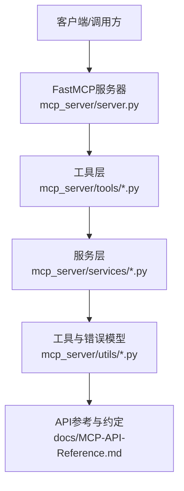
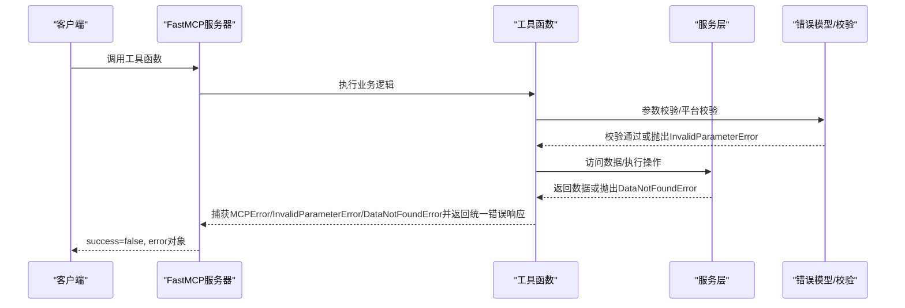
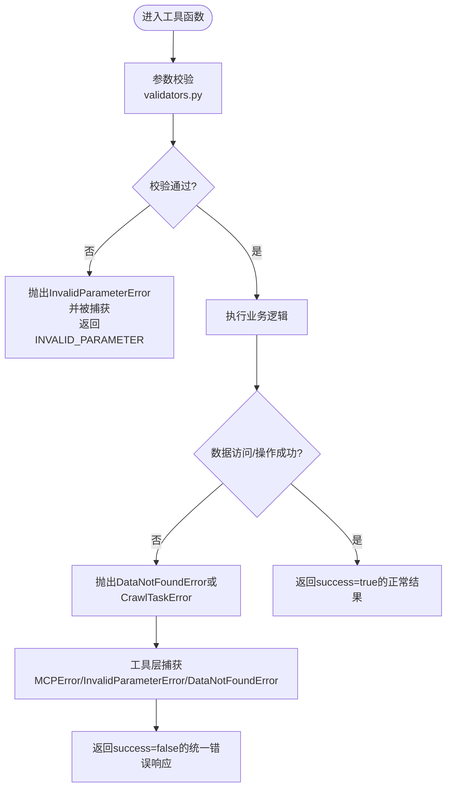
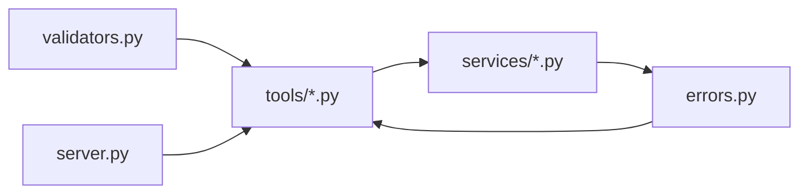

# API错误处理规范

<cite>
**本文引用的文件**
- [MCP-API-Reference.md](file://docs/MCP-API-Reference.md)
- [errors.py](file://mcp_server/utils/errors.py)
- [validators.py](file://mcp_server/utils/validators.py)
- [server.py](file://mcp_server/server.py)
- [analytics.py](file://mcp_server/tools/analytics.py)
- [data_service.py](file://mcp_server/services/data_service.py)
- [config_mgmt.py](file://mcp_server/tools/config_mgmt.py)
- [README.md](file://README.md)
</cite>

## 目录
1. [简介](#简介)
2. [项目结构](#项目结构)
3. [核心组件](#核心组件)
4. [架构总览](#架构总览)
5. [详细组件分析](#详细组件分析)
6. [依赖关系分析](#依赖关系分析)
7. [性能考量](#性能考量)
8. [故障排查指南](#故障排查指南)
9. [结论](#结论)
10. [附录](#附录)

## 简介
本规范面向客户端与集成开发者，统一说明MCP-API-Reference.md中定义的错误响应格式，明确success=false时error对象的结构与字段使用规范，并列举常见错误码及其触发条件与解决方案。同时提供客户端错误处理最佳实践，包括重试机制、错误日志记录与用户友好提示，以及可复用的错误处理流程图与序列图，帮助在不同场景下优雅地处理异常。

## 项目结构
围绕错误处理的关键文件与职责如下：
- 文档与约定：MCP-API-Reference.md定义统一错误响应格式与常见错误码
- 错误模型：mcp_server/utils/errors.py定义MCPError及各类具体错误类型
- 参数校验：mcp_server/utils/validators.py提供参数有效性校验，触发InvalidParameterError
- 工具层：mcp_server/tools/*在业务逻辑中抛出MCPError或DataNotFoundError
- 服务层：mcp_server/services/*在数据访问层抛出DataNotFoundError
- 服务器：mcp_server/server.py在工具函数中捕获MCPError并转换为统一错误响应
- 配置与系统：mcp_server/tools/config_mgmt.py等工具同样遵循统一错误响应

图表来源
- [server.py](file://mcp_server/server.py#L93-L108)
- [analytics.py](file://mcp_server/tools/analytics.py#L118-L154)
- [data_service.py](file://mcp_server/services/data_service.py#L1-L100)
- [errors.py](file://mcp_server/utils/errors.py#L1-L93)
- [validators.py](file://mcp_server/utils/validators.py#L1-L120)
- [MCP-API-Reference.md](file://docs/MCP-API-Reference.md#L384-L407)

章节来源
- [server.py](file://mcp_server/server.py#L93-L108)
- [MCP-API-Reference.md](file://docs/MCP-API-Reference.md#L384-L407)

## 核心组件
- 统一错误响应格式
  - 结构：success=false，error对象包含code、message、suggestion（可选）、details（可选）
  - 示例：参见MCP-API-Reference.md“错误处理”章节
- 错误模型
  - MCPError为基类，提供to_dict()将错误转为统一字典
  - 具体错误类型：INVALID_PARAMETER、DATA_NOT_FOUND、CRAWL_TASK_ERROR、CONFIGURATION_ERROR、PLATFORM_NOT_SUPPORTED、FILE_PARSE_ERROR等
- 参数校验
  - validators.py对平台、limit、date_range、keyword等进行严格校验，不符合条件时抛出InvalidParameterError
- 工具与服务层
  - 工具层与服务层在捕获MCPError或DataNotFoundError后，统一返回success=false的错误响应
  - 服务器层在工具函数内部捕获MCPError并转换为统一错误响应

章节来源
- [MCP-API-Reference.md](file://docs/MCP-API-Reference.md#L384-L407)
- [errors.py](file://mcp_server/utils/errors.py#L1-L93)
- [validators.py](file://mcp_server/utils/validators.py#L1-L120)
- [analytics.py](file://mcp_server/tools/analytics.py#L118-L154)
- [data_service.py](file://mcp_server/services/data_service.py#L1-L100)
- [server.py](file://mcp_server/server.py#L93-L108)

## 架构总览
统一错误处理在调用链中的流转如下：
- 客户端调用工具函数
- 工具函数执行参数校验与业务逻辑
- 若发生参数错误或数据缺失，抛出MCPError/InvalidParameterError/DataNotFoundError
- 工具函数捕获异常并返回success=false的统一错误响应
- 服务器层在工具函数内部捕获MCPError并转换为统一错误响应

图表来源
- [server.py](file://mcp_server/server.py#L93-L108)
- [analytics.py](file://mcp_server/tools/analytics.py#L118-L154)
- [data_service.py](file://mcp_server/services/data_service.py#L1-L100)
- [validators.py](file://mcp_server/utils/validators.py#L1-L120)
- [errors.py](file://mcp_server/utils/errors.py#L1-L93)

## 详细组件分析

### 统一错误响应格式与字段规范
- 字段说明
  - code：错误码字符串，如INVALID_PARAMETER、DATA_NOT_FOUND、CRAWL_TASK_ERROR等
  - message：人类可读的错误描述
  - suggestion（可选）：针对问题的修复建议
  - details（可选）：补充的结构化错误细节
- 触发条件
  - 参数无效：由validators.py校验失败触发InvalidParameterError
  - 数据未找到：由服务层抛出DataNotFoundError
  - 爬虫任务错误：由系统管理工具或爬取流程抛出CrawlTaskError
  - 其他内部错误：捕获非MCPError异常时返回INTERNAL_ERROR
- 返回示例
  - 参见MCP-API-Reference.md“错误处理”章节

章节来源
- [MCP-API-Reference.md](file://docs/MCP-API-Reference.md#L384-L407)
- [errors.py](file://mcp_server/utils/errors.py#L1-L93)
- [validators.py](file://mcp_server/utils/validators.py#L1-L120)
- [data_service.py](file://mcp_server/services/data_service.py#L1-L100)

### 错误码与触发条件
- INVALID_PARAMETER
  - 触发：参数类型不符、范围越界、格式错误、模式非法等
  - 典型场景：limit>最大值、date_range缺少字段、keyword为空或过长、平台不在支持列表
  - 解决：根据suggestion修正参数；必要时使用resolve_date_range获取标准日期范围
- DATA_NOT_FOUND
  - 触发：目标日期无数据、文件解析失败、数据源不可用
  - 典型场景：查询未来日期、超出可用日期范围、爬取尚未产生数据
  - 解决：调整日期范围至可用区间；等待爬取任务完成；检查数据目录
- CRAWL_TASK_ERROR
  - 触发：爬取任务执行失败、网络异常、第三方平台限流或接口变更
  - 典型场景：trigger_crawl返回failed_platforms或异常
  - 解决：稍后重试；检查代理/网络；查看日志；确认平台支持与配置
- CONFIGURATION_ERROR
  - 触发：配置文件加载失败或配置项不合法
  - 典型场景：config.yaml读取异常、平台配置缺失
  - 解决：检查配置文件格式与路径；恢复默认配置
- PLATFORM_NOT_SUPPORTED
  - 触发：传入平台ID不在支持列表
  - 典型场景：platforms包含未知平台
  - 解决：使用支持列表内的平台ID
- FILE_PARSE_ERROR
  - 触发：本地文件解析失败（格式、编码、损坏等）
  - 典型场景：历史数据文件损坏或格式不兼容
  - 解决：检查文件完整性与格式；重新生成数据

章节来源
- [errors.py](file://mcp_server/utils/errors.py#L1-L93)
- [validators.py](file://mcp_server/utils/validators.py#L1-L200)
- [data_service.py](file://mcp_server/services/data_service.py#L1-L200)
- [config_mgmt.py](file://mcp_server/tools/config_mgmt.py#L48-L66)

### 工具层与服务层的错误捕获与转换
- 工具层（analytics.py等）
  - 在业务逻辑中捕获MCPError/InvalidParameterError/DataNotFoundError，返回success=false的统一错误响应
  - 对于未捕获的异常，返回INTERNAL_ERROR
- 服务器层（server.py）
  - 在工具函数内部捕获MCPError并转换为统一错误响应
  - 对于未捕获异常，返回INTERNAL_ERROR

图表来源
- [analytics.py](file://mcp_server/tools/analytics.py#L118-L154)
- [server.py](file://mcp_server/server.py#L93-L108)
- [validators.py](file://mcp_server/utils/validators.py#L1-L120)
- [errors.py](file://mcp_server/utils/errors.py#L1-L93)

章节来源
- [analytics.py](file://mcp_server/tools/analytics.py#L118-L154)
- [server.py](file://mcp_server/server.py#L93-L108)

### 参数校验与错误码映射
- 平台校验
  - validate_platforms：若平台不在支持列表，抛出InvalidParameterError
- 数量限制
  - validate_limit：limit<=0或超过最大值时抛出InvalidParameterError
- 日期范围
  - validate_date_range：start>end、未来日期、范围过大等触发InvalidParameterError
- 关键词
  - validate_keyword：空值、类型不符、长度超限触发InvalidParameterError
- 模式
  - validate_mode：模式不在允许集合内触发InvalidParameterError

章节来源
- [validators.py](file://mcp_server/utils/validators.py#L1-L200)

### 服务器层错误捕获
- resolve_date_range工具函数在内部捕获MCPError并返回统一错误响应
- 其他工具函数在工具层捕获MCPError并返回统一错误响应

章节来源
- [server.py](file://mcp_server/server.py#L93-L108)

## 依赖关系分析
- 工具层依赖服务层与错误模型
- 服务层依赖解析与缓存组件，并在数据缺失时抛出DataNotFoundError
- 错误模型提供统一的错误对象与to_dict()转换
- 服务器层作为统一出口，负责将异常转换为统一错误响应

图表来源
- [validators.py](file://mcp_server/utils/validators.py#L1-L120)
- [errors.py](file://mcp_server/utils/errors.py#L1-L93)
- [analytics.py](file://mcp_server/tools/analytics.py#L118-L154)
- [data_service.py](file://mcp_server/services/data_service.py#L1-L100)
- [server.py](file://mcp_server/server.py#L93-L108)

章节来源
- [validators.py](file://mcp_server/utils/validators.py#L1-L120)
- [errors.py](file://mcp_server/utils/errors.py#L1-L93)
- [analytics.py](file://mcp_server/tools/analytics.py#L118-L154)
- [data_service.py](file://mcp_server/services/data_service.py#L1-L100)
- [server.py](file://mcp_server/server.py#L93-L108)

## 性能考量
- 合理使用limit参数，避免一次性获取过多数据
- 启用缓存，减少重复查询与IO开销
- 分批处理大数据，使用date_range分批查询历史数据
- 选择合适的搜索模式：精确匹配、模糊搜索、实体搜索
- 定期清理缓存，保持系统性能稳定

章节来源
- [MCP-API-Reference.md](file://docs/MCP-API-Reference.md#L459-L475)

## 故障排查指南
- 常见问题定位
  - 参数错误：检查INVALID_PARAMETER的suggestion，修正参数类型、范围与格式
  - 数据未找到：检查日期范围是否在可用区间，等待爬取任务完成
  - 爬虫任务错误：查看failed_platforms，检查网络与代理，重试或查看日志
  - 配置错误：核对config.yaml格式与路径，恢复默认配置
- 日志与诊断
  - 服务器启动与连接问题：参考README.md中的端口占用、依赖安装、日志查看与端口切换
  - HTTP模式连接：确认服务已启动，检查防火墙，尝试使用127.0.0.1替代localhost
- 客户端最佳实践
  - 重试机制：对瞬时性错误（如网络波动）进行指数退避重试
  - 错误日志记录：记录error.code、message、details与上下文参数
  - 用户友好提示：优先展示suggestion，必要时提供简化解释与自助排查指引

章节来源
- [README.md](file://README.md#L3175-L3229)

## 结论
通过统一的错误响应格式与严格的参数校验、错误捕获与转换机制，系统能够在不同层级清晰地暴露问题并提供修复建议。客户端应遵循重试、日志与用户提示的最佳实践，以提升整体稳定性与用户体验。

## 附录

### 常见错误码清单与建议触发条件
- INVALID_PARAMETER：参数类型/范围/格式/模式非法
- DATA_NOT_FOUND：目标日期无数据、文件解析失败、数据源不可用
- CRAWL_TASK_ERROR：爬取任务失败、网络异常、第三方限流
- CONFIGURATION_ERROR：配置文件加载失败或配置项不合法
- PLATFORM_NOT_SUPPORTED：平台ID不在支持列表
- FILE_PARSE_ERROR：本地文件解析失败
- INTERNAL_ERROR：未捕获的异常

章节来源
- [MCP-API-Reference.md](file://docs/MCP-API-Reference.md#L400-L407)
- [errors.py](file://mcp_server/utils/errors.py#L1-L93)
- [validators.py](file://mcp_server/utils/validators.py#L1-L200)
- [data_service.py](file://mcp_server/services/data_service.py#L1-L200)

### 客户端错误处理最佳实践
- 重试机制
  - 对瞬时性错误（如网络波动、第三方限流）采用指数退避重试
  - 对参数错误（INVALID_PARAMETER）不建议自动重试，需提示用户修正
- 错误日志记录
  - 记录error.code、message、details与关键上下文参数
  - 对DATA_NOT_FOUND与CRAWL_TASK_ERROR区分处理，便于后续诊断
- 用户友好提示
  - 优先展示suggestion，必要时提供简化解释与自助排查指引
  - 对INTERNAL_ERROR隐藏技术细节，提供反馈渠道与日志收集

[本节为通用指导，不直接分析具体文件]